# What is Amazon Web Services?

Aaj kal IT ki dunya mein har choti barri cheez ke sath **cloud computing** ya sirf **cloud** ka naam jor diya jata hai. Yeh "buzzwords" (mashhoor alfaz) marketing aur sales ke liye to bohot achhe hain, lekin jab koi inko seekhnay ya parhnay baithta hai, to yeh parshani paida karte hain. Is liye, cheezon ko bilkul saaf aur asaan samajhnay ke liye, hum pehle kuch basic alfaz ki defination se shuru karte hain.

**Cloud computing** ya **the cloud**, asal mein IT resources (jaise computers, storage, networks) ko haasil karne aur unhein istemaal karne ka ek asaan tareeqa hai.

* **Abstraction ki Layers:** Cloud ke andar jo IT resources hotay hain, woh aap ko seedhay nazar nahi aatay. Un ke darmiyan "abstraction" (parda ya asaan interface) ki layers hoti hain. Is ko asaan zaban mein yun samjhein ke jaise aap gaari chalate hain, to aap ko sirf steering aur pedals nazar aatay hain (high abstraction), aap ko andar ke complex engine ki fikar nahi karni parti. Cloud bhi aisa hi hai; yeh aap ko aik Bani-banai Virtual Machine (VM) se lekar aik mukammal software (Software as a Service - SaaS) tak kuch bhi de sakta hai, jahan pichli saari mushkil coding aur hardware aapse chupa hua hota hai.
* **On-demand aur Unlimited:** Yeh resources jab aap ko chahiye hon, bparri se barri tadaad mein foran mil jaate hain.
* **Pay-for-what-you-use:** Is ka sab se barra faida yeh hai ke jitna aap istemaal karenge, sirf utne hi paise dein gaey—bilkul bijli ya paani ke bill ki tarah.

NIST (National Institute of Standards and Technology) ki official defination ke mutabaq:

> Cloud computing aik aisa model hai jo hamein internet ke zariye har jagah se, bohot asani se, aur jab dil chahe computing resources (jaise networks, servers, storage, applications, aur services) ka aik shared pool (aik sath jama kiye huay resources) istemaal karne ki ijazat deta hai. In resources ko bohot jaldi se shuru (provision) aur khatam (release) kiya ja sakta hai, aur is mein management ki bohot kam mehnat ya service provider se baar baar baat karne ki zaroorat nahi parti.

NIST ne cloud computing ki **panch (5) zaroori khoobiyan (Essential Characteristics)** batai hain, jinhein hum bacho ki tarah asaan karke samajhte hain:

* **On-demand self-service:** Aap ko koi naya server chahiye? Aap ko kisi bande ko call karne ya lambi approvals lene ki zaroorat nahi. Aap ne sirf aik button click kiya ya aik API call ki, aur aap ka resource foran tayyar.
* **Broad network access:** Cloud ki saari sahuliyat internet ke zariye her jagah mojud hoti hain. Aap chahein laptop se chalaein, mobile se ya kisi bhi device se, bas internet hona chahiye.
* **Resource pooling:** Is ko **multitenant model** kehte hain. Is ki misaal aik hostel ya apartment building jaisi hai, jahan building aik hi hoti hai (physical hardware), lekin us mein alag alag log (consumers) apne apne kamron mein rehte hain aur aapas mein resources share karte hain, bina aik doosre ki privacy kharab kiye.
* **Rapid elasticity:** Yeh bilkul aik rubber band ki tarah hai. Jab aap ki website par bohot zyaada log (traffic) aa jaein, to cloud khud ko barha (expand) leta hai. Jab log chale jaein, to yeh wapas chota (shrink) ho jata hai. Is se resources zaya nahi hotay.
* **Measured service:** Cloud mein har cheez ka meter chal raha hota hai. Aap ko mukammal insights aur metrics (data) milte hain ke aap ne kitna resource istemaal kiya, taake aap ko pata ho ke kis cheez ke paise lag rahe hain.

Is ke ilawa, cloud ke offers ko in **teen (3) barray types** mein banta jata hai:

* **Public Cloud:** Yeh aik aisa cloud hota hai jise koi barri organization chala rahi hoti hai aur yeh aam public (kisi bhi aam bande ya company) ke liye khula hota hai, jaise AWS.
* **Private Cloud:** Yeh kisi aik specific company ka apna zati cloud hota hai, jo sirf unhi ke infrastructure ko virtualize karke unhi ke andaroni istemaal ke liye hota hai.
* **Hybrid Cloud:** Yeh Public aur Private cloud ka mix hota hai. Jab aap apne ghar ya daftar ke zati servers (on-premises data center) ko AWS (Public Cloud) ke sath jor dete hain, to aap aik Hybrid Cloud bana rahe hotay hain.

Cloud computing services ko mazeed in **teen classifications** mein divide kiya jata hai:

* **Infrastructure as a Service (IaaS):** Is mein aap ko bilkul basic cheezon ka control milta hai jaise computing power, storage, aur networking. Aap ko aik khali Virtual Machine milti hai, baqi OS aur software aap ne khud manage karna hota hai. *Examples:* Amazon EC2, Google Compute Engine, Microsoft Azure Virtual Machines.
* **Platform as a Service (PaaS):** Is mein infrastructure (servers, OS) cloud khud sambhalta hai, aap ko sirf apna code deploy karna hota hai. *Examples:* AWS Lambda, AWS App Runner, Google App Engine, aur Heroku. *(Aaj 2026 ke daur mein AWS Lambda aur App Runner bohot zyada mature aur modern microservices ke liye standard ban chuke hain).*
* **Software as a Service (SaaS):** Yeh bilkul bana banaya software hota hai jo cloud par chal raha hota hai, aap ne bas login karna hai aur istemaal shuru karna hai. *Examples:* Amazon WorkSpaces, Google WorkSpace, aur Microsoft 365.

AWS aik cloud-computing provider hai jiske paas IaaS, PaaS, aur SaaS ki bohot barri variety mojud hai. Chalein ab isko mazeed detail se dekhte hain.

---

## What is Amazon Web Services (AWS)?

Amazon Web Services (AWS) web services ka aik aisa mukammal platform hai jo aap ko computing, storage, aur networking ke solutions alag alag **layers of abstraction** par deta hai.

* **Low level of abstraction (Zyada control, zyada mehnat):** Is ki misaal yeh hai ke aap aik virtual machine ke sath khud se storage volumes (hard disks) attach kar rahe hain. Yahan aap ko hardware ki choti bareekiyan khud set karni parti hain.
* **High level of abstraction (Kam mehnat, asaan kaam):** Is ki misaal yeh hai ke aap bina kisi server ki fikar kiye, aik simple REST API ke zariye apna data store aur retrieve kar rahe hain (jaise S3). Aap ko piche ki koi fikar nahi hoti ke server kaise chal raha hai.

Aap AWS ki services ko har barray kaam ke liye istemaal kar sakte hain—chahe websites host karni hon, barri companies ke enterprise applications chalane hon, ya bohot barray data (Big Data) par mining aur analysis karna ho. Yeh web services internet par aam web protocols (jaise **HTTP**) ke zariye kaam karti hain. Inhein machines (code ke zariye) ya insaan (ek Graphical User Interface ya Console ke zariye) aasani se access kar sakte hain.

AWS ki do sab se mashhoor aur bunyadi services hain:

1. **EC2 (Elastic Compute Cloud):** Jo aap ko Virtual Machines (servers) deti hai.
2. **S3 (Simple Storage Service):** Jo aap ko data store karne ke liye unlimited capacity deti hai.

AWS ki khoobi yeh hai ke is ki saari services aapas mein bohot achhe tarike se mil kar kaam karti hain. Aap inhein use karke apne purane on-premises data center ko cloud par shift (migrate) bhi kar sakte hain, ya bilkul scartch se aik naya system bhi kharra kar sakte hain. Is ka pricing model **pay-per-use** hai, yani jitna chalao gay, utna bhariye.

Aik AWS customer hone ke naate, aap apni marzi se duniya ke mukhtalif data centers chun sakte hain kyunke AWS ke data centers poori dunya mein phailey huay hain. Agar aap Japan mein baith kar koi virtual machine chalana chahte hain, to us ka tareeqa bilkul waisa hi asaan hoga jaise Ireland mein chalane ka hai. Is se aap poori dunya ke customers ko un ke qareeb tareen location se minto mein serve kar sakte hain.

---

### Figure 1.1 Ka Breakdown (AWS data center locations)

  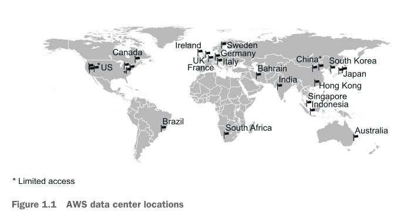

Agar hum diye gaye **Figure 1.1** ke map ko ghaur se dekhein, to yeh dunya ke mukhtalif hisson mein AWS ke data centers (Regions) ko dikhata hai:

* **Global Distribution:** Map mein flag icons se dikhaya gaya hai ke US, Canada, Brazil, Ireland, UK, France, Sweden, Germany, Italy, South Africa, Bahrain, India, China, Hong Kong, South Korea, Japan, Singapore, Indonesia, aur Australia tak AWS ke data centers phailey huay hain.
* **Limited Access (*):** Map par kuch jagah star (`*`) laga hai, jaise US aur China mein. Is ka matlab hai ke in data centers tak har kisi ki pahunch nahi hoti. US Government ke liye alag se "GovCloud" hota hai taake security tight rahe, aur China ke data centers ke liye wahan ke local qawaneen ke mutabaq special conditions hoti hain.
* **2026 Context:** Book mein jin data centers (Canada, Spain, Switzerland, Israel, UAE, India, Australia, New Zealand) ke liye "announced" likha gaya tha, aaj **2026** mein yeh saare regions mukammal taur par active, mature, aur production-ready ho chuke hain, jo dunya bhar mein behtareen speed aur low latency faraham kar rahe hain.

---

Ab jab hum ne zaroori alfaz samajh liye hain, to sawaal yeh paida hota hai ke aap AWS ke sath aakhir kar kya sakte hain?

---

## What can you do with AWS?

Aap AWS par aik ya aik se zyaada services ko aapas mein jor kar har kism ki application chala sakte hain. Agla section aap ko is ki aik behtareen real-world misaal daita hai.

---

## Hosting a web shop

Chalein **John** ki kahani se samajhte hain. John aik medium e-commerce business ka CIO (Chief Information Officer) hai. Woh apni company ke liye aik aisi online shop (web shop) banana chahta hai jo bohot fast ho, reliable ho (kabhi band na ho), aur scalable ho (jitna traffic aaye, bardasht kar sakay).

**John Ka Purana Setup (On-Premises):**
John ne teen saal pehle aik physical data center mein kuch machines rent par li thin. Us setup mein:

* Aik **Web Server (WWW)** tha jo customers ki requests ko handle karta tha.
* Aik **Database** tha jo products ki detail aur orders ka data store karta bha.

John ab yeh dekh raha hai ke agar woh isi setup ko AWS par le jaye, to us ki company ko kya fayda hoga.

---

### Figure 1.2 Ka Breakdown (Running a web shop on-premises vs. on AWS)

  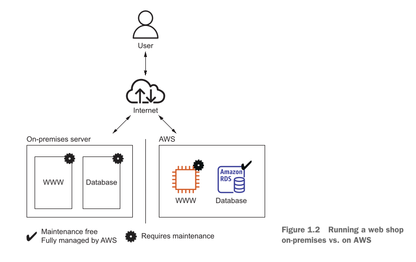

Agar aap **Figure 1.2** ko dekhein, to is mein do hissay dikhaaye gaye hain jo John ke purane aur naye setup ka muwazna (comparison) karte hain:

* **Left Side (On-premises server):** Yahan aik box ke andar WWW (Web server) aur Database dono mojud hain. Lekin dono ke upar aik **Kala Gear (Requires maintenance)** ka icon bana hua hai. Is ka matlab hai ke hardware kharab ho, OS update karna ho, ya security patch lagana ho—yeh saara sar-dard John aur us ki team ka hai.
* **Right Side (AWS):** Jab John isi setup ko AWS par lata hai, to WWW abhi bhi aik EC2 instance (Virtual Machine) par chal raha hai jis par gear icon hai (yani OS level tak ki maintenance John ko karni hai). Lekin, database ke liye us ne **Amazon RDS** chun liya hai, jis par **Checkmark (Maintenance free / Fully managed by AWS)** laga hua hai. Is ka matlab hai ke database ka backup lena, updates karna ab AWS ki zimmedari hai, John ki nahi!

---

John sirf apne purane setup ko "Lift-and-shift" (jaisa hai waisa hi utha kar cloud par rakh dena) nahi karna chahta, balkay woh cloud ke asli faide uthana chahta hai. Is liye, kuch mazeed AWS services use karke John ne apne setup ko mazeed behtar banaya, jo ke in points mein tafseel se bayan kiya gaya hai:

* **Static aur Dynamic Content Ko Alag Karna:** Web shop par do tarah ka content hota hai. Aik hota hai **Dynamic Content** (jaise products ki badalti hui qeemtein) aur doosra hota hai **Static Content** (jaise company ka logo, purani images, CSS files). John ne in dono ko alag kar diya. Static content ko aik Content Delivery Network (CDN) ke zariye deliver kiya gaya, jis se web servers par se load bohot kam ho gaya aur website ki speed bohot barh gayi.
* **Maintenance-Free Services Par Shift Hona:** Database, Object Store, aur DNS system ke liye fully managed services chunne se John ki team infrastructure sambhalne ke jhanjhat se azaad ho gayi. Is se operational costs (chalane ka kharcha) kam ho gaya aur system ki quality behtar ho gayi.
* **Multi-VM Architecture aur Load Balancer:** Purane setup mein aik barra server tha. AWS par John ne usay utne hi kharche mein **chote chote teen virtual machines** mein divide kar diya. Ab fayda yeh hua ke agar un teen servers mein se koi aik server kharab (fail) bhi ho jaye, to samnay kharra **Load Balancer** automatic tarike se customers ki traffic ko baqi do chalte huay servers par bhej dega. Website band nahi hogi! Is se reliability (bhrose-mandi) bohot barh gayi.

---

### Figure 1.3 Ka Breakdown (Enhanced Web Shop Setup)

**Figure 1.3** mein John ka aik mukammal, modern aur behtareen cloud architecture dikhaya gaya hai. Chalein is ke har component ko step-by-step aur bacho ki tarah asaan karke samajhte hain ke request kaise flow karti hai:

  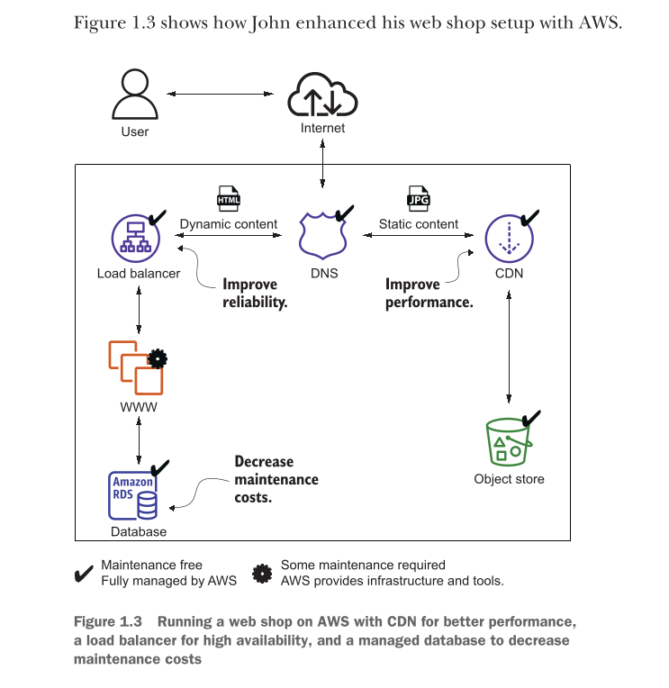

1. **User aur Internet:** Jab koi user browser mein website open karta hai, to request internet ke zariye sab se pehle **DNS (Domain Name System)** ke paas jati hai (jis par Checkmark hai, yani AWS isay bina rukawat ke manage kar raha hai).
2. **Traffic Ka Batwara (Split):** DNS request ko do hisson mein baant deta hai:
* **Static Content (Right Side):** Logo aur images ke liye request seedhi **CDN (Content Delivery Network)** ke paas jati hai. CDN yeh static files peeche mojud **Object Store** (S3) se uthata hai. Kyunke CDN user ke shahar ya mulk ke qareeb tareen server se file de deta hai, is liye website "Improve performance" (bohot tezi se) load hoti hai. Is par bhi checkmark hai, yani yeh maintenance-free hai.
* **Dynamic Content (Left Side):** HTML aur coding wali requests seedhi **Load Balancer** ke paas aati hain. Load balancer aik traffic police wale ki tarah kaam karta hai jo anay wali traffic ko barabar tarike se peeche mojud do alag alag **WWW (Web servers)** par baant deta hai. Is se "Improve reliability" hoti hai ke agar aik server crash bhi ho jaye, to doosra zinda rehta hai. (Servers par gear icon hai, yani coding aur scaling policy aap ki hai, lekin load balancer managed hai).

3. **Managed Database (Amazon RDS):** Dono web servers niche mojud aik hi **Database (Amazon RDS)** se connect hotay hain jo orders aur data save karta hai. Is par checkmark laga hai, jo "Decrease maintenance costs" (John ka kharcha aur pareshani kam) karta hai kyunke database ko chalana ab AWS ka kaam hai.

John AWS par apna web shop chala kar bohot khush hai. Apni company ka infrastructure cloud par migrate karne ke baad, us ki website ki reliability (uptime) aur performance (speed) dono mein zameen-asman ka faraq aa chuka hai!

---

## Running a Java EE application in your private network

**Maureen** aik bari global corporation (dunya bhar mein pheli hui company) mein senior system architect hain. Un ki company ka apna jo physical data center tha, us ka rent ya contract kuch mahino mein khatam hone wala hai. Maureen chahti hain ke woh apni company ke enterprise business applications (jaise **Java Enterprise Edition [EE]** applications) ko AWS par shift kar dein, taake company ka kharcha kam ho (reduce costs) aur unhein kaam karne mein asani aur azaadi mile (gain flexibility).

In applications ke do barray hissay hain: aik **Application Server** (jo coding ko chalata hai) aur aik **SQL Database** (jo saara data save karta hai).

Maureen ne is poore setup ko AWS par chalane ke liye aik zabardast aur secure tareeqa apnaya:

* **Virtual Network (VPC) Ki Tyari:** Unho ne AWS ke cloud mein apna aik mukammal zati aur secure virtual network design kiya.
* **Corporate Network Se Connection (VPN):** Apne daftar ke chalte huay network (corporate network) ko cloud wale network ke sath jorne ke liye unho ne aik secure **VPN (Virtual Private Network)** connection ka istemaal kiya. Is ka faida yeh hai ke daftar ke log bina kisi rukawat ke cloud par mojud servers ko aam clients ki tarah access kar sakte hain.
* **Application aur Database Setup:** Unho ne AWS ki virtual machines par application servers install kiye taake Java EE app chal sakay, aur sath hi data store karne ke liye aik behtareen SQL database service (jaise Oracle Database EE ya Microsoft SQL Server EE) chun li.

### Security Aur Traffic Ka Control

Maureen ne security ko itna tight banaya ke koi aam banda ya hacker database tak na pohnch sakay. Is ke liye unho ne do bareekiyon par kaam kiya:

* **Subnets Ka Istemaal:** Unho ne apne virtual network ko chote chote hisson mein baant diya, jinhein **subnets** kehte hain. Har subnet ka security level alag rakha gaya. Yeh bilkul aisa hi hai jaise aik bank ke andar aam public ke liye alag kamra ho aur khazane (cash vault) ke liye alag sab se mehfooz kamra.
* **Access-Control Lists (ACLs):** Har subnet ke darwaze par aik security guard bitha diya jise ACLs kehte hain. Yeh guard tay karta hai ke kaun si traffic andar aa sakti hai aur kaun si baahir ja sakti hai (ingoing and outgoing traffic). *Example:* Unho ne rule banaya ke database wale subnet ko sirf aur sirf Java EE server wale subnet ka banda touch kar sakta hai, baqi poori dunya ke liye yeh rasta band hai. Is se company ka sab se important data (mission-critical data) bilkul safe ho gaya.
* **NAT aur Firewall:** Jo servers private subnets mein hain, unhein internet par bhejney ya internet se zaroori software updates lane ke liye unho ne **NAT (Network Address Translation)** aur firewall rules ka behtareen use kiya.

---

### Figure 1.4 Ka Breakdown (Running a Java EE application with enterprise networking)

  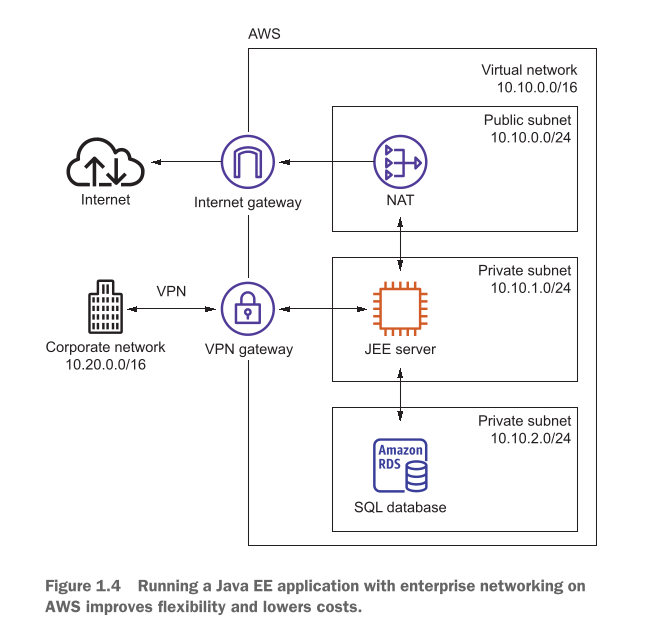

Chalein hum **Figure 1.4** ke pooray network flow ko step-by-step aur bacho ki tarah asaan kar ke samajhte hain ke data kaise travel kar raha hai:

* **Corporate Network (`10.20.0.0/16`):** Yeh Maureen ka apna zati office ya company ka data center hai.
* **VPN Connection & VPN Gateway:** Office se AWS cloud ke andar safe rasta banane ke liye aik **VPN tunnel** bani hui hai jo AWS ke **VPN Gateway** par aakar milti hai. Is raste se office ka network seedha **JEE server** (Private Subnet) se baat karta hai.
* **AWS Virtual Network (`10.10.0.0/16`):** Yeh AWS ke andar Maureen ka banaya hua poora secured ilaqa (VPC) hai, jise teen floor ya subnets mein divide kiya gaya hai:
1. **Public Subnet (`10.10.0.0/24`):** Is floor par **NAT** baitha hua hai. Yeh floor **Internet Gateway** ke zariye baahir ki dunya (Internet) se seedha jura hua hai.
2. **Private Subnet (`10.10.1.0/24`):** Is ke andar **JEE server** (Java Enterprise Edition) chal raha hai. Is server ko internet se koi seedha nahi dekh sakta, lekin agar is server ne internet par koi request bhejni ho, to yeh upar mojud **NAT** ke paas jata hai, aur NAT is ki request Internet Gateway ke zariye baahir bhejta hai.
3. **Private Subnet (`10.10.2.0/24`):** Yeh sab se nichla aur locked floor hai jahan **SQL Database (Amazon RDS)** mojud hai. Is ka arrow sirf upar wale JEE server ke sath jura hai. Yani database tak pohnchne ka koi aur rasta dunya mein mojud nahi hai.

---

### Future Plans Aur Project Ki Kamyabi

Maureen ne abhi shuruat ke liye VPN connection lagaya hai, lekin unho ne aage ka plan (trade-off) pehle se soch rakha hai. Woh aane wale waqt mein aik **dedicated network connection** (jise AWS Direct Connect kehte hain) lagane ka soch rahi hain.

* *Design Decision:* VPN internet ke zariye chalta hai to speeds up-down ho sakti hain, lekin dedicated connection lagane se network ka kharcha (network costs) mazeed kam ho jayega aur data transfer ki speed (network throughput) bohot fast aur pakki ho jayegi.

**Project Ka Result:** Maureen ke liye yeh project aik bohot bari kamyabi raha! Pehle jis enterprise application ko set karne mein **mahino (months)** lag jaate thay, ab AWS par on-demand virtual machines, databases, aur networking infrastructure minto mein milne ki wajah se woh kaam **kuch ghanton (hours)** mein mukammal ho jata hai. Aur sab se bari baat, un ki company ka infrastructure cost on-premises ke muwazne bohot kam ho gaya.

---

## Implementing a highly available system

**Alexa** aik bohot tezi se barhne wale startup mein software engineer hain. Woh IT dunya ka aik mashhoor asool achhi tarah janti hain jise **Murphy’s Law** kehte hain: *"IT infrastructure mein jo cheez kharab ho sakti hai, woh aik na aik din zaroor kharab hogi!"*

Agar system band (outage) ho jaye, to startup ka poora business tabah ho sakta hai. Is liye Alexa aik aisa system design kar rahi hain jo **Highly Available (HA)** ho, yaani agar piche koi machine jal bhi jaye, to samnay customer ko pata bhi na chale aur website chalti rahe.

AWS ki khubsurti yeh hai ke is ki saari services ya to pehle se highly available hoti hain, ya unhein bohot asani se HA tarike se configure kiya ja sakta hai. Alexa ne aik aala qism ka high availability architecture taiyar kiya:

* **Database Ki Replication (Copy):** Database service ko Alexa ne automatic **replication** (aik database ka data sath ke sath doosre backup database mein copy hona) aur **fail-over handling** ke sath lagaya. Is ka faida yeh hai ke agar aap ka **Primary Database instance** kisi wajah se crash ya fail ho jaye, to jo **Standby Database** (backup database) hota hai, woh automatic tarike se khud ko naya primary database bana leta hai (promote ho jata hai). Is dauran website band nahi hoti.
* **Virtual Machines (Web Servers):** AWS par jo virtual machines (EC2 instances) hoti hain, woh khud se highly available nahi hotin (yani agar aik VM band hui to game over). Lekin Alexa ne dmaagh ladaya! Unho ne aik VM chalane ki bajaye **multiple virtual machines mukhtalif data centers (Availability Zones)** mein chala dein.
* **Load Balancer Ka Role:** In saare web servers ke aage unho ne aik **Load Balancer** kharra kar diya. Yeh load balancer lagatar servers ki sehat check karta rehta hai (Health Checks). Agar koi aik server kharab ho jaye, to load balancer chalaki se requests ko sirf un servers par bhejta hai jo bilkul theek aur sehatmand (healthy) chal rahe hotay hain.

---

### Figure 1.5 Ka Breakdown (Building a highly available system on AWS)

  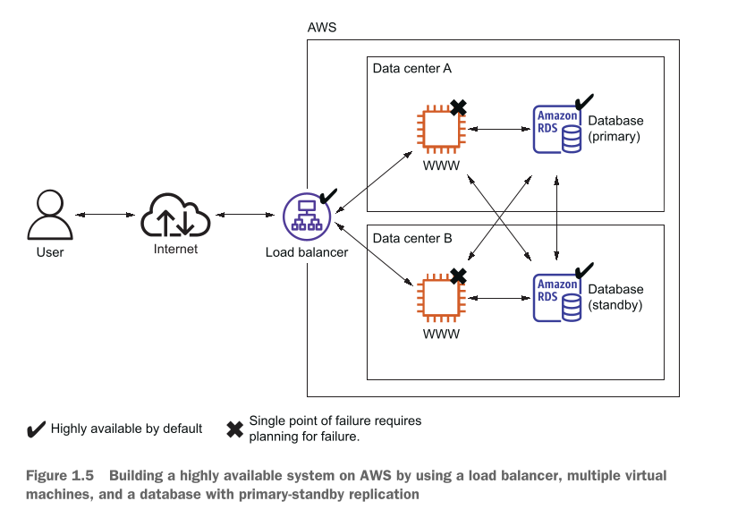

Chalein hum **Figure 1.5** ke diagram ko bacho ki tarah asaan breakdown ke sath samajhte hain ke yeh "Failure-proof" system kaise kaam karta hai:

* **User & Internet:** User jab bhi internet se website par aata hai, to us ki request seedhi servers par nahi jati.
* **Load Balancer (Checkmark - Highly available by default):** Request sab se pehle is load balancer par aati hai. Is par checkmark laga hai kyunke yeh AWS ki apni zimmewari hai ke yeh kabhi band nahi hoga. Yeh traffic ko do alag alag buildings (Data centers) mein barabar baant raha hai.
* **Data Center A aur Data Center B:** Yeh AWS ke do alag alag physical data centers (Availability Zones) hain. Agar aik building mein aag lag jaye ya bijli chali jaye, to doosri building bilkul safe rehti hai.
* **WWW Servers (Kala Cross - Single point of failure):** Dono data centers mein aik aik virtual machine (WWW) chal rahi hai. In par cross ka nishan is liye hai kyunke aik akeli VM crash ho sakti hai. Lekin chunke Alexa ne dono jagah VMs rakhi hain, is liye agar Data Center A ki VM ghalti se band bhi ho jaye, to Load Balancer traffic ko Data Center B ki VM par bhej dega.
* **Amazon RDS (Database Primary vs Standby):** Data Center A mein **Database (primary)** chal raha hai jo likhne parhne ka saara kaam sambhalta hai. Data Center B mein **Database (standby)** chup-chap baitha hai aur primary se saara data sath ke sath copy kar raha hai (cross arrows dikha rahe hain ke dono servers dono databases se connect ho sakte hain). Agar Data Center A mukammal doob gaya, to Data Center B ka standby database automatic active ho kar kaam shuru kar dega.

---

Alexa ne is behtareen planning se apne startup ko kisi bhi barrey nuksan ya outage se bacha liya hai. Lekin cloud engineering ka asool yahi hai ke aap kabhi sukoon se nahi baithte; Alexa aur un ki team hamesha agle kisi failure ke liye pehle se plan karti rehti hai aur apne systems ki mazbooti (resilience) ko lagatar behtar bana rahi hai. *(Aaj ke modern cloud era mein yeh Multi-AZ deployment har barri production application ka standard asool hai).*

---

## Profiting from low costs for batch processing infrastructure

**Nick** aik data scientist hai jise gas turbines (jo barri barri gas se chalne wali machines hoti hain) se ikatha hone wale bohot barray data (massive measurement data) ko process karna hota hai. Us ka asal kaam yeh hai ke woh rozana aik report taiyar kare jo bataye ke in sainkron (hundreds) turbines ki maintenance ki haalat kya hai. Is report ko dekh kar pata chalta hai ke kis turbine mein kya kharabi aa sakti hai.

Is kaam ko karne ke liye Nick ki team ko aik computing infrastructure (yaani bhaari computers aur servers) ki zaroorat hoti hai jo din mein sirf **aik baar** naye aane wale data ko analyze kar sakay.

### Nick Ka System Kaise Kaam Karta Hai? (Step-by-Step Flow)

1. **Scheduled Batch Jobs:** Nick ka system aik mukammal schedule (waqt) par chalta hai, jise batch jobs kehte hain. Yeh jobs tab chalte hain jab naya data aata hai.
2. **Database Storage:** Batch jobs chalne ke baad jo baari bareek calculations hoti hain, un ke nichorr (aggregated results) ko aik database mein save kar diya jata hai.
3. **Business Intelligence (BI) Tool:** Aakhir mein aik BI tool is database se sara data uthata hai aur us se asaan aur khoobsurat reports bana kar tyar karta hai taake business chalanay wale log usay asani se samajh sakein.

---

### Chota Budget Aur AWS Ka Clever Pricing Model

Nick ke paas computers lagane ya chalanay ke liye budget bohot hi chota (very small budget) hai, is liye us ki team koi aisa tareeqa dhoond rahi thi jahan paise kam se kam lagein. Nick ne AWS ke pricing model (paise lene ke tareeqay) ka bohot hi chalaaki aur aqalmandana istemaal kiya, jo ke yeh hain:

* **Per-Second Billing:** AWS virtual machines ka bill har aik second ke hisab se banata hai, bashart-e-ke kam az kam bill 60 seconds (aik minute) ka zaroor banta hai. Nick ne is ka faida uthatay huay aik rule banaya: Jaise hi batch job shuru hota hai, woh virtual machine ko **start (launch)** karta hai, aur jaise ہی kaam mukammal hota hai, woh machine ko foran **band (terminate)** kar deta hai. Is tarah woh computing infrastructure ke paise sirf ussi waqt ke deta hai jab woh waqai chal rahi hoti hai. Purane zamane ke traditional data centers ke muwazne yeh aik bohot barra badlao (**game changer**) hai, jahan machine chahe farigh baithi rahe ya chale, aap ko har mahine ka poora flat bill dena parta tha.
* **Spare Capacity (Spot Instances):** AWS ke barray barray data centers mein kuch aisi computing power (khali servers) hoti hai jo faltu pari hoti hai aur use nahi ho rahi hoti. AWS is khali capacity ko bohot barri chout (substantial discount) par bechta hai. Nick ke liye yeh zaroori nahi hai ke us ka batch job bilkul kisi pakke fixed minute par hi chale; woh intezar kar sakta hai ke jab cloud mein khali computers available hon, tab us ka kaam chal jaye. Is sabr ki wajah se AWS usay poore **75% discount** par virtual machine de deta hai! *(Aaj 2026 ke modern cloud daur mein is ko **Spot Instances** kaha jata hai, jo bade analytics aur batch processing ke liye sab se sasta tareeqa mana jata hai).*

---

### Figure 1.6 Ka Breakdown (Pay-per-use price model)

  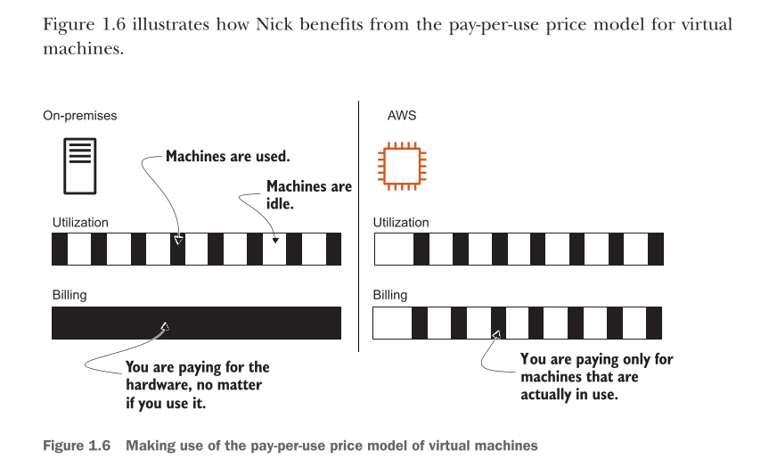

Agar hum diye gaye **Figure 1.6** ko ghaur se dekhein, to yeh bohot hi asaan tarike se On-premises (purane zati servers) aur AWS Cloud ke kharche ka faraq samjhata hai:

* **Left Side (On-premises):**
* **Utilization Line:** Is mein kale (black) aur safaid (white) dabbay hain. Kale dabbay ka matlab hai ke machine par kaam ho raha hai (Machines are used) aur safaid dabbay ka matlab hai machine farigh baithi hai (Machines are idle).
* **Billing Line:** Yeh line poori ki poori kali (black) hai. Is ke niche likha hai: *"You are paying for the hardware, no matter if you use it."* Yaani jab Nick ka computer farigh baitha tha, tab bhi company ko poore mahine ka bill bharna par raha hai. Is se bohot paisa zaya hota hai.

* **Right Side (AWS):**
* **Utilization Line:** Is mein bhi bilkul wese hi kale aur safaid dabbay hain, kyunke Nick ka kaam din mein sirf thodi der chalta hai.
* **Billing Line:** Ghaur karein! Is line mein sirf wahan kala rang hai jahan utilization mein kala rang tha. Baqi saari line safaid (khali) hai. Is ke niche likha hai: *"You are paying only for machines that are actually in use."* Yaani jaise hi Nick ne kaam khatam kar ke machine band ki, bill ka meter bhi foran ruk gaya aur bill bilkul zero ($0) ho gaya.

Nick is baat se bohot khush hai ke ab us ki team ke paas aik aisa computing infrastructure mojud hai jo bohot hi kam kharche (low costs) mein itne barray data ko minto mein analyze kar leta hai.

Ab aap ko aik broad idea mil chuka hai ke AWS ke sath kya kuch kiya ja sakta hai—aam tor par kahein to aap dunya ki **kisi bhi application** ko AWS par host kar sakte hain. Next section mein hum un **nau (9) sab se barray faidon** ke baare mein baat karenge jo AWS hamain deta hai.

---

## How you can benefit from using AWS

AWS use karne ka sab se barra aur ahem faida kya hai? Aap shayad foran kahein ke paise bachana (cost savings). Lekin yaad rakhein ke sirf paisa bachana hi akela faida nahi hai. Chalein hum AWS ke kuch khaas features ko dekhte hain aur samajhte hain ke is se aap ko mazeed kya kya behtareen faide mil sakte hain.

---

## Innovative and fast-growing platform

AWS aik aisa platform hai jo bohot hi tezi se barh raha hai aur har waqt nayi cheezein ijaad (innovate) kar raha hai.

* AWS lagatar nayi services, naye features, aur purani cheezon mein behtari (improvements) ka elaan karta rehta hai.
* Agar aap un ki website ke "What's New" page par jayein, to aap ko andaza hoga ke un ke kaam karne ki raftar kitni tez hai. Aik andaze ke mutabaq, saal 2021 mein AWS ne **2,080 naye elaanaat** kiye thay. *(Aaj 2026 ke modern daur mein yeh raftar mazeed barh chuki hai, jahan AI aur advanced automation har haftay launch ho rahi hain).*
* In modern aur nayi tekhnologies ka faida utha kar aap apne customers ke liye aala qism ke solutions bana sakte hain. Is se aap ko market mein baqi sab par aik barri bartari (competitive advantage) haasil ho jati hai.
* Amazon ne saal 2021 mein **$62 billion** ki net sales report ki thin. Is barri kamai aur size se yeh saaf zahir hota hai ke AWS aane wale saalon mein apne platform aur data centers ka jaal mazeed phelaye ga.

---

## Services solve common problems

Jaise hum ne pehle parha, AWS mukhtalif services ka aik bohot barra platform hai. Software dunya ke jo aam maslay hotay hain, AWS ne unhein pehle se hi hal kar ke rakh diya hai:

* **Aam Maslay (Common Problems):** Traffic ko barabar banta (load balancing), data ko line mein lagana (queuing), emails bhejney (sending email), aur files ko mahfooz rakhna (storing files). In sab ke liye bani-banayi services mojud hain.
* **Bacho Wali Misaal:** Aap ko "pahiya dobara ijaad" (reinvent the wheel) karne ki koi zaroorat nahi hai. Yaani jo cheez pehle se bani hui aur test shuda hai, usay khud se zero se banane mein apna waqt aur paisa zaya mat karein.
* **Aap Ka Kaam:** Aap ka asal kaam bas yeh hai ke market se sahi services ko uthaein aur unhein aapas mein jor kar aik mazboot system kharra kar dein. Pichli saari mushkil management AWS khud sambhale ga, jabki aap poori tawajjoh sirf apne customers ki zarooriyat par lagayenge.

---

## Enabling automation

AWS poori tarah se **API driven** hai, yaani is ka har component code ke zariye chalaya ja sakta hai. Is wajah se aap har choti-bardi cheez ko automatic (automate) kar sakte hain:

* **Code Se Infrastructure:** Aap sirf code likh kar poora network design kar sakte hain, virtual machines ka poora cluster (gurooh) minto mein shuru kar sakte hain, ya aik relational database deploy kar sakte hain. Automation se system par bhrosa (reliability) barhta hai aur kaam mein tezi (efficiency) aati hai.
* **Theoretical Aspect (Insaan vs Computer):** Aap ka system jitna bara hota jata hai, us mein aapas ke jor aur taluqaat (dependencies) utne hi ulajhte jate hain. Aik insaan itni saari bareekiyon mein bhatak sakta hai aur ghalti kar sakta hai, lekin computer chahe jitna bhi barra aur aapas mein jura hua network ho, usay asani se handle kar leta hai.
* **Trade-off Decision:** Insaan ko un kaamon par focus karna chahiye jo woh behtar kar sakta hai—jaise system ka blueprint (naksha) likhna. Computer khud hi dhoond nikalega ke un saari dependencies ko aapas mein kaise hal karna hai. Cloud mein apne nakshay ke mutabaq automatically poora environment kharra karne ke is asool ko **Infrastructure as Code (IaC)** kehte hain, jise hum aage Chapter 4 mein detail se parhenge.

---

## Flexible capacity (scalability)

Flexible capacity ka matlab hai aisi gunjaish jo zaroorat ke mutabaq barh ya ghat sakay. Is se "overcapacity" (faltu ya zyaada computers rakhna jin ka use na ho) ka khatma ho jata hai.

* Aap aik akeli virtual machine se shuru kar ke hazaron virtual machines tak ja sakte hain.
* Aap ki data store karne ki jagah (storage) gigabytes (GB) se petabytes (PB) tak phail sakti hai.
* Purane zamane ki tarah ab aap ko agle mahino ya saalon ka andaza laga kar pehle se mehanga hardware khareed kar rakhne ki koi zaroorat nahi hai.
* **Real-World Example (Web Shop):** Agar aap aik online shop chalate hain, to us par traffic hamesha aik jaisi nahi rehti, balkay badalti rehti hai (seasonal traffic patterns). Jaise din ke waqt log zyaada aate hain aur raat ko kam. Haftay ke aam dino aur chuttiyon (weekends/holidays) mein faraq hota hai. AWS par aap minto mein naye servers barha sakte hain aur traffic kam hone par unhein delete kar sakte hain.
* Cloud mein resources ki koi aakhri hadd (capacity constraints) nahi hoti. Aap ko hardware racks, network switches, aur power supplies ki fikar chor kar bas virtual machines add karte jana hai.
* **Writer's Project Example:** Writer batate hain ke un ke aik pichle project mein, jo test environment tha woh sirf haftay ke dino (weekdays) mein subah 7:00 a.m. se raat 8:00 p.m. tak chalta tha. Unho ne baqi farigh waqt (raat ko aur weekends par) saare unused systems ko shut down (band) kar diya, jis se unho ne seedha **60% kharcha bacha liya**!

---

### Figure 1.7 Ka Breakdown (Seasonal traffic patterns for a web shop)

  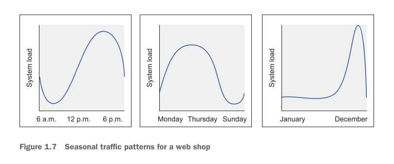

Chalein hum **Figure 1.7** ki teeno graphs ko ghaur se dekhte hain jo bacho ki tarah asaan karke samjhati hain ke aik web shop par traffic ka utaar-chadhon kaisa hota hai:

1. **Daily Pattern (6 a.m. - 12 p.m. - 6 p.m.):** Pehla graph dikhata hai ke subah ke waqt system par load bohot kam hota hai. Dopahar 12 baje se lekar shaam 6 baje tak graph upar chala jata hai (peak traffic), aur raat ko wapas niche gir jata hai. Flexible capacity ke tehat, AWS sirf un peak hours mein servers barhaye ga.
2. **Weekly Pattern (Monday - Thursday - Sunday):** Doosra graph batata hai ke haftay ke shuruati dino (Monday se Thursday) mein shopping ka load kafi upar rehta hai, jabke Sunday aate hi log farigh hotay hain ya baahir hotay hain, to website ka load bilkul niche gir jata hai.
3. **Yearly Pattern (January - December):** Teesra graph poore saal ka haal batata hai. January se November tak load aik seedhi sasti line mein chalta hai, lekin **December** (holiday season/deals) aate hi graph bilkul asman ko chhune lagta hai. Traditional data center mein aap ko is aik mahine ke peak ke liye saal ke baqi 11 mahine mehnge servers ka faltu bill bharna parta, lekin AWS par aap sirf December mein capacity barha kar baqi saal paise bacha sakte hain.

---

## Built for failure (reliability)

AWS ke andar zyaada tar services pehle se hi **highly available** (hamesha chalne wali) ya **fault tolerant** (kisi bhi kharabi ko khud hi jhelne wali) design ki gayi hain.

* Agar aap in services ko as-it-is istemaal karte hain, to aap ko system ki mazbooti aur reliability bilkul muft (for free) mil jati hai.
* Is ke ilawa, AWS aap ko aise advanced tools aur software faraham karta hai jinhain use kar ke aap apni marzi ka mukammal failure-proof system khud kharra kar sakte hain.

---

## Reducing time to market

"Time to market" ka matlab hai ke aap ka naya software ya product kitni jaldi market mein bikney ya chalne ke liye tayyar hota hai.

* AWS mein jab aap koi naye virtual machine ki request karte hain, to kuch hi minto mein woh ready ho kar aap ke saamne hoti hai. AWS ki har service isi tarah aik click par on-demand available hai.
* Is sahulat ki wajah se software banane ka tareeqakar (development process) bohot fast ho jata hai kyunke testing aur feedback ke loops chote ho jate hain.
* Purani rukawatein—jaise test karne ke liye servers kam par jana—bilkul khatam ho jati hain. Agar aap ko test karne ke liye aik alag se naya network environment chahiye, to aap usay sirf kuch ghanton ke liye banaein aur kaam ke baad mita dein.

---

## Benefiting from economies of scale

"Economies of scale" ko asaan zaban mein **wholesale (thoke ka bhav) ka faida** kehte hain. Jab koi company bohot hi barray paimane par hardware khareedti hai, to usay cheezein bohot sasti parti hain. AWS lagatar poori dunya mein apna infrastructure barha raha hai, jis se un ki apni costs kam hoti hain, aur aik customer hone ke naate is sastepan ka faida aap ko bhi milta hai.

AWS waqt waqt par apni cloud services ki qeemtein khud hi kam karta rehta hai. Chalein unho ne jo real-world misalein di hain, unhein dekhte hain:

* **January 2019:** AWS ne Fargate par containers chalane ki qeemat mein vCPU ke liye **20%** aur memory ke liye **65%** tak ki bari discount di.
* **November 2020:** Cold HDD type ke EBS storage volumes ki qeemton ko **40%** tak sasta kiya gaya.
* **November 2021:** S3 storage ki teen barri storage classes mein qeemtein **31%** tak ghatai gayin.
* **April 2022:** Data centers ke darmiyan hone wale network traffic par se izafi charges ko bilkul khatam kar diya gaya, jab aap AWS PrivateLink, AWS Transit Gateway, ya AWS Client VPN ka use kar rahe hon.

---

## Global infrastructure

Agar aap ke customers poori dunya mein phailey huay hain, to AWS ka dunya bhar mein phela hua network use karne ke teen barray faide hain:

1. **Low Network Latency:** Aap ke customers aur servers ke darmiyan faasla kam hone ki wajah se website bina kisi delay (lag) ke minto mein khulegi.
2. **Regional Data Protection:** Har mulk ka qanoon hota hai ke un ke shahriyon ka sensitive data unhi ke mulk ke andar save rahe. AWS ke alag alag data centers se aap un sarkari qawaneen par asani se amal kar sakte hain.
3. **Price Benefits:** Mukhtalif mulkon ya regions mein infrastructure ki qeemtein alag hoti hain, aap saste region ka faida utha sakte hain.

AWS ke data centers North America, South America, Europe, Africa, Asia, aur Australia mein mojud hain, taake aap bina kisi mushkil ke apni application poori dunya mein kahin bhi chala sakein.

---

## Professional partner

Jab aap AWS ka intikhab karte hain, to aap aik certified aur professional partner ke sath kaam kar rahe hotay hain. AWS ki quality aur security dunya ke sab se aala standards ke mutabaq hoti hai:

* **ISO 27001:** Dunya bhar mein information security ka sab se bada aur certified standard, jise bahaar ke azaad idaray check karte hain.
* **ISO 9001:** Dunya bhar mein mana jane wala behtareen quality management ka tareeqakar.
* **PCI DSS Level 1:** Credit card aur online banking ka data mehfooz rakhne ke liye payment card industry ka sab se karrka security certification.

Agar aap ko abhi bhi shaq hai, to aap ko pata hona chahiye ke dunya ke sab se barray aur serious brands jaise **Expedia, Volkswagen, FINRA, Airbnb, aur Slack** apna poora karobar aur bhaari workloads AWS par hi kamyabi se chala rahe hain.

---

## How much does it cost?

AWS ka bill bilkul aik bijli ke bill (electric bill) jaisa hota hai. Is mein saari services ka bill is baat par banta hai ke aap unhein kitna aur kaise istemaal karte hain (based on use). Aap ko paise sirf un cheezon ke dene hotay hain jo waqai chal rahi hain—jaise virtual machine kitni der tak active thi, object store (S3) mein aap ne kitni storage gheri hui hai, ya aap ke network mein kitne load balancers chal rahe hain.

* **Monthly Invoice:** In saari services ka hisab-kitab mahine ke mahine (monthly basis) kiya jata hai aur aap ko aik invoice bheji jati hai.
* **Transparency:** Har aik service ki qeemat pehle se publicly sab ke liye mojud hoti hai. Agar aap koi naya setup lagane ka plan kar rahe hain aur pehle se andaza lagana chahte hain ke mahine ka kitna kharcha aayega, to aap **AWS Pricing Calculator** (`[https://calculator.aws/](https://calculator.aws/)`) ka use kar sakte hain.

---

### Free Tier

AWS par jab aap naya sign up (account create) karte hain, to pehle **12 mahino** ke liye aap ko bohot si services bilkul muft (free) milti hain. Free Tier ka asal maqsad yeh hai ke aap bina kisi darr ya kharche ke cloud ke sath khel sakein, nayi cheezon ke experiments kar sakein, aur AWS ki services ko chalane ka practical tajurba (experience) haasil kar sakein.

Chalein dekhte hain ke is Free Tier mein aap ko bacho ki tarah asaan zaban mein kya kya milta hai:

* **Virtual Machines:** Linux ya Windows par chalne wali aik choti virtual machine ke **750 hours** aap ko milte hain (jo ke takreeban aik poora mahina banta hai). Is ka matlab yeh hai ke aap chahein to aik single virtual machine ko poora mahina non-stop chalayein, ya phir 750 alag alag virtual machines ko sirf aik ghante ke liye aik sath chala dein, dono suraton mein kharcha bilkul zero hoga.
* **Load Balancers:** Aik classic ya application load balancer chalanay ke liye bhi **750 hours** (takreeban aik mahina) bilkul muft diye jaate hain.
* **Object Store:** Data aur files store karne ke liye object store (S3) ke andar **5 GB** tak ki free storage milti hai.
* **Relational Database:** Aik chota relational database (RDS) jis mein **20 GB** ki storage shamil hoti hai aur sath mein database ka backup rakhne ki capacity bhi muft milti hai.
* **NoSQL Database:** NoSQL database (DynamoDB) par data store karne ke liye **25 GB** tak ki space di jati hai.

**Zaroori Bareekiyan aur Rules:**

* **Limit Se Agay Jana:** Agar aap ne ghalti se bhi Free Tier ki in haddon (limits) ko cross kiya, to bina kisi mazeed notice ya warning ke aap se un resources ke paise lene shuru kar diye jayenge aur mahine ke aakhir mein aap ko bill bhej diya jayega. Lekin pareshan hone ki zaroorat nahi, is kitab mein hum agay chal kar seekhenge ke kaam shuru karne se pehle hi apne kharche par nazar kaise rakhni hai aur monitor kaise karna hai.
* **Free Forever:** Jab aap ka aik saal ka trial period khatam ho jata hai, to aap ko baqi resources ke paise dene parte hain. Lekin kuch resources **hamesha ke liye free (free forever)** hotay hain. Jaise ke NoSQL database ke pehle 25 GB hamesha free rehte hain, chahe aik saal guzre ya das saal.
* **Kitab Ki Strategy:** Is ke ilawa mazeed details aap `[http://aws.amazon.com/free](http://aws.amazon.com/free)` par dekh sakte hain. Yeh kitab poori koshish karegi ke jahan tak ho sake Free Tier ka istemaal kare taake aap ka kharcha na ho, aur jahan koi mehangi cheez aayegi jo free tier mein nahi aati, wahan pehle hi saaf saaf bata diya jayega.

---

### Billing example

Jaise hum ne pehle baat ki, AWS aap ko mukhtalif tareeqon se bill bhej sakta hai. Is ko asani se samajhnay ke liye teen barray hisson mein banta gaya hai:

* **Based on time of use (Waqt ke mutabaq):** Aik virtual machine ka bill har second ke hisab se calculate hota hai, jabki load balancer ka bill har ghante (per hour) ke hisab se banta hai.
* **Based on traffic (Data ke aane jaane ke mutabaq):** Traffic ko gigabytes (GB) mein ya requests ki tadaad (number of requests) ke mutabaq napa jata hai.
* **Based on storage usage (Jagah ke mutabaq):** Yeh do tarah se hota hai—ya to allocated capacity ke mutabaq (jaise 50 GB ka memory volume le liya, ab chahe us mein data 1 GB rakho ya 50 GB, bill poore 50 GB ka aayega) ya phir real usage ke mutabaq (jaise jitna data rakha hai, sirf utne hi GBs ka bill aayega).

---

#### Figure 1.8 Ka Breakdown (Some services are billed based on time of use, others by throughput or consumed storage)

  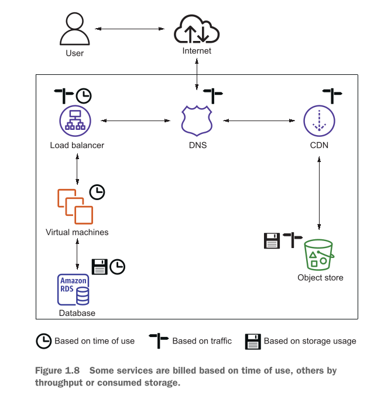

Agar hum diye gaye **Figure 1.8** ke diagram ko ghaur se dekhein, to yeh hamari purani web shop ke components par billing ke chalte huay meters ko asaan tarike se samajhata hai:

* **Clock Icon (Based on time of use):** Yeh icon **Load Balancer**, **Virtual Machines (EC2)**, aur **Database (Amazon RDS)** par laga hua hai. Is ka matlab hai ke jab tak yeh teeno chal rahe hain, ghante aur seconds ke hisab se in ka meter ghumta rahega.
* **Signpost/Arrow Icon (Based on traffic):** Yeh icon **DNS**, **Load Balancer**, aur **CDN** par mojud hai. Is ka matlab hai ke jab dunya se log website par aayenge aur requests bhejenge ya data download karenge, to us traffic ke GBs aur requests ke mutabaq bill banega.
* **Floppy Disk Icon (Based on storage usage):** Yeh icon **Database (Amazon RDS)** aur **Object Store (S3)** par laga hai. Is ka matlab hai ke in ke andar jo files ya data mehfooz kiya gaya hai, us ke size ke mutabaq paise liye jayenge.

---

#### Table 1.1 Ka Breakdown (How an AWS bill changes if the number of web shop visitors increases)

  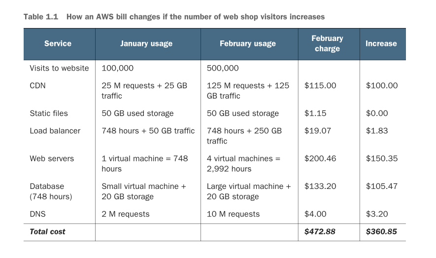

Chalein ab writer ki di gayi real-world example ko dekhte hain. फर्ज़ karein January mein aap ki web shop kamyab rahi, aur February mein aap ne sales mazeed barhane ke liye aik marketing campaign (ads) chalayi. Khush-qismati se February mein aap ke visitors ki tadaad seedha **5 guna (fivefold)** barh gayi (100,000 se barh kar 500,000 ho gayi).

Chunke AWS ka asool use-par-pay hai, to chalein dekhte hain ke January ke muwazne February ke bill mein kya tabdeeli aayi:

| Service | January usage | February usage | February charge | Increase |
| --- | --- | --- | --- | --- |
| **Visits to website** | 100,000 | 500,000 |  |  |
| **CDN** | 25 M requests + 25 GB traffic | 125 M requests + 125 GB traffic | $115.00 | $100.00 |
| **Static files** | 50 GB used storage | 50 GB used storage | $1.15 | $0.00 |
| **Load balancer** | 748 hours + 50 GB traffic | 748 hours + 250 GB traffic | $19.07 | $1.83 |
| **Web servers** | 1 virtual machine = 748 hours | 4 virtual machines = 2,992 hours | $200.46 | $150.35 |
| **Database (748 hours)** | Small virtual machine + 20 GB storage | Large virtual machine + 20 GB storage | $133.20 | $105.47 |
| **DNS** | 2 M requests | 10 M requests | $4.00 | $3.20 |
| **Total cost** |  |  | **$472.88** | **$360.85** |

**Table Ki Bachon Wali Explanation Aur Design Analysis:**

* **Linear Relationship:** Ghaur karein, visitors ki tadaad **5 guna** barhi (100k se 500k), lekin aap ka total monthly bill $112 se barh kar $473 hua, jo ke sirf **4.2 guna (4.2-fold)** izafa hai. AWS aap ko traffic aur kharche ke darmiyan aik seedha aur munasib taluq (linear relationship) deta hai.
* **Static Files ($0.00 Increase):** Chunke website ka logo aur purani static images February mein bhi 50 GB hi rahin, is liye storage ka kharcha bilkul nahi barha, woh $1.15 par hi ruka raha.
* **Web Servers & Database (High Cost Increase):** Traffic 5 guna barhne ki wajah se 1 machine crash ho sakti hai, is liye February mein background mein **4 virtual machines** chalani parin aur database ko bhi Small se **Large** karna para, jis se in ka kharcha sab se zyada barha.

---

### Pay-per-use opportunities

AWS ka yeh pay-per-use model software ki dunya mein naye aur anokhe moqay paida karta hai:

* **Project Barrier Khatam:** Kisi bhi naye idea ya startup ko shuru karne ki sabsay bari rukawat (barrier) khatam ho jati hai, kyunke aap ko shuruat mein servers khareedne ke liye bhaari paiso (upfront investment) ki bilkul zaroorat nahi hoti. Aap minto mein virtual machines shuru karein, seconds ke hisab se pay karein, aur agar project band karna ho to stop kar dein—koi nuksan nahi. Storage ke liye bhi pehle se koi pakka wada (upfront commitment) nahi karna parta.
* **Choti vs Barri Machines Ka Architecture Decision:** Cloud ka aik bohot barra asool yeh hai ke **aik barri virtual machine** ki qeemat bilkul utni hi hoti hai jitni **do (2) choti virtual machines** ki hoti hai agar un ka size barabar ho.
* *Trade-off Benefit:* Is se chote budget wale logo ke liye **fault tolerance** afford karna asaan ho jata hai. Aap aik barri machine chalanay ki bajaye do choti machines chala kar apna system fail-safe bana sakte hain, woh bhi bina aik rupya izafi diye.

---

### Comparing alternatives

Dunya mein AWS akela badshah nahi hai, balkay cloud computing market mein **Microsoft Azure** aur **Google Cloud Platform (GCP)** bhi bohot barray khiladi (major players) hain.

In teeno barray cloud providers mein yeh barray points bilkul **aik jaise (common)** hain:

* Teeno ke paas poori dunya mein phela hua zameeni infrastructure mojud hai jo computing, networking, aur storage deta hai.
* Teeno ke paas on-demand virtual machines (IaaS) chalane ka behtareen system hai: AWS ke paas **Amazon EC2**, Azure ke paas **Azure Virtual Machines**, aur Google ke paas **Google Compute Engine** hai.
* Teeno ke paas unlimited distributed storage systems hain jo bina kisi hadd ke scale ho sakte hain: AWS ke paas **Amazon S3**, Azure ke paas **Azure Blob Storage**, aur Google ke paas **Google Cloud Storage** hai.
* Teeno ka pricing model **pay-as-you-go** (jitna chalao utna do) par kaam karta hai.

#### Magar in cloud providers mein aakhir Faraq kya hai?

Chalein teeno ki aapas ki game ko asaan breakdown ke sath samajhte hain:

* **Amazon Web Services (AWS):** AWS cloud market ka **leader** hai aur is ke paas services ka sab se bada portfolio (range) mojud hai. Agarche AWS ab enterprise (badi sarkari aur purani companies) ke sector mein kafi aage nikal chuka hai, lekin is ki jarrton ko dekh kar saaf pata chalta hai ke yeh internet ke barray barray maslon (internet-scale problems) ko hal karne ke liye ijaad hua tha. AWS zyaada tar innovative aur open-source tekhnologies par kamal ki rock-solid services banata hai, aur cloud infrastructure ki security ko lock karne ke liye bohot hi mazboot (lekin thode mushkil) tareeqay deta hai.
* **Microsoft Azure:** Azure ka poora focus Microsoft ke apne technology stack (Windows Server, MS SQL, .NET) ko cloud par faraham karne par tha, halanki ab unho ne web-centric aur open-source tekhnologies ko bhi kafi adopt kar liya hai. Aisa lagta hai ke Microsoft poori jaan maar raha hai taake Amazon ke market share ke barabar pohnch sakay.
* **Google Cloud Platform (GCP):** GCP ka poora jhukaav un developers par hai jo bare complex aur advanced distributed systems banana chahte hain. Google apne poore dunya ke network ko mila kar aala qism ki scalable aur fault-tolerant services deta hai (jaise Google Cloud Load Balancing). Hamari raye mein, GCP aap ke local office ke purane software ko cloud par shift karne ke bajaye **cloud-native applications** (jaise modern containers aur Kubernetes) par zyada focus karta hai.

**Aakhri Faisla Kaise Karein?**
Cloud provider chunney ka koi shortcut nahi hota. Har project aur use-case alag hota hai aur "shaitan bareekiyon mein hi chupa hota hai" (the devil is in the details). Aap ko hamesha apni background dekhni parti hai: Kya aap Microsoft technology ka heavy use karte hain? Kya aap ke paas traditional system administrators ki team hai ya aap developers se bhari hui company hain?

Lekin agar sab baaton ka nichorr nikala jaye, to hamari raye mein **AWS is waqt dunya ka sab se zyada mature, behtareen aur powerful cloud platform mojud hai**.

---

## Exploring AWS services

Inis section mein, aap ko andaza hoga ke AWS ke paas mukhtalif services ki kitni barri range mojud hai. Hum kuch diagrams ki madad se aik **Mental Model** (zehni naksha) bhi banayein ge, taake aap ko upar upar se aik achha overview mil sakay ke yeh saari services poore AWS setup mein kis tarah aur kahan baithti hain.

Chalein is mental model ke overview se shuru karte hain. Computing (calculation karne), storing (data mahfooz karne), aur networking (computers ko jorne) ka jo **Hardware** hota hai, woh AWS cloud ki sab se bunyadi neenv (foundation) hai. AWS is saare physical hardware ke upar hi apni software services ko chalata hai.

---

### Figure 1.9 Ka Breakdown (The AWS cloud is composed of hardware and software services accessible via an API)

  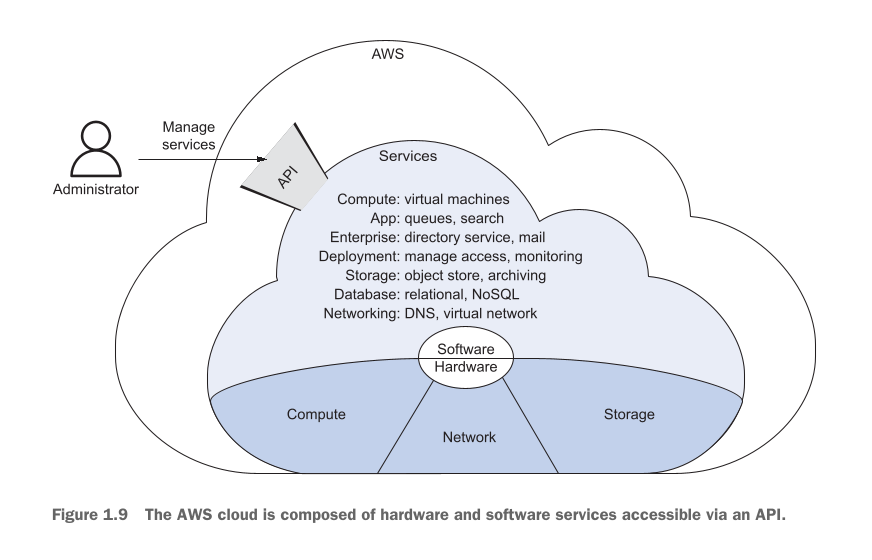

Agar aap **Figure 1.9** ke diagram ko ghaur se dekhein, to cloud computing ki poori dunya ko teen barray hisson mein banta gaya hai:

1. **Software / Hardware (Sab se niche):** Yeh cloud ki asli zameen hai, jahan physical devices mojud hain. Is mein teen barray pillars hain: **Compute** (CPU aur RAM), **Network** (tarrein aur switches), aur **Storage** (badi hard disks).
2. **Services (Darmiyan mein):** Hardware ke thik upar saari chalne wali services aati hain. Jaise Virtual machines, queues, search engines, business applications, object store, databases (relational aur NoSQL), aur networking solutions (DNS/Virtual networks).
3. **API (Sab se baahir):** Is poore cloud ke munh par aik hi darwaza laga hua hai jise **API** kehte hain.

* **Services Ko Control Kaise Karte Hain?** Kisi bhi service ko chalane ya band karne ke liye, baahir se aik **Administrator** ko is API ke darwaze par request bhejni parti hai. Is ke teen tareeqay hotay hain:
* **Web-based GUI (Management Console):** Aik simple website jahan mouse se click kar ke kaam hota hai.
* **CLI (Command-Line Interface):** Black screen par short commands likh kar control karna.
* **SDK (Software Development Kit):** Apne programming code ke andar se automatically requests bhejna.

* **Virtual Machines Ka Khas Jadu (Low Abstraction):** Virtual machines ke paas aik special feature hota hai ke aap baahir se **SSH** (secure shell) ke zariye un ke andar dakhil ho sakte hain aur aap ko **Administrator (Root) Access** mil jati hai. Is ka matlab hai ke ab us computer par aap ki hukoomat hai, aap jo dil chahe custom software us par install kar sakte hain.
* **NoSQL Jaisi Services (High Abstraction):** Is ke ulat, jo doosri services hain (jaise NoSQL database), woh aap ko computer ke andar janay ki ijazat nahi detin. Woh piche ka saara mushkil jhanjhat aapse chupa (hide) deti hain aur aap ko sirf aik baahir ka darwaza (API) de deti hain ke "bas data bhejtey jao, piche machine kaise chal rahi hai us se aap ka koi lena dena nahi".

---

### Figure 1.10 Ka Breakdown (Managing a custom application running on a virtual machine and cloud-native services)

  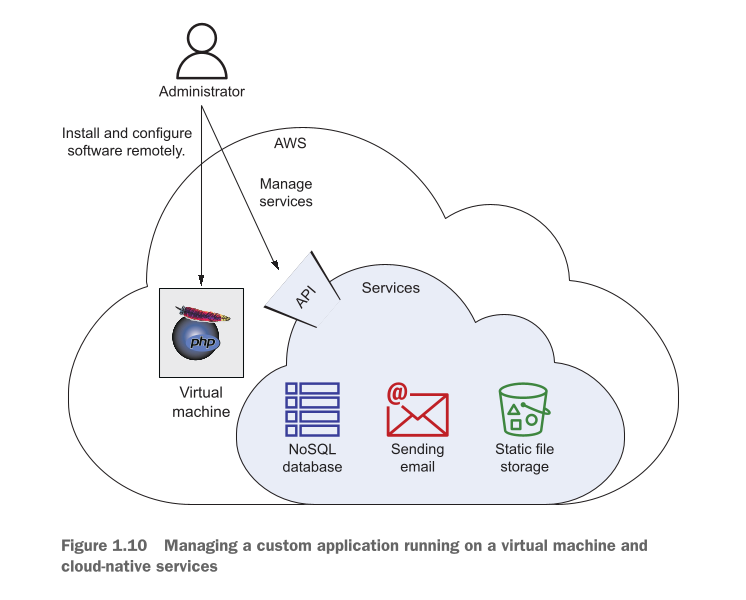

**Figure 1.10** dikhata hai ke aik Administrator jab system set karta hai, to woh do alag alag rasto ka istemaal kaise karta hai:

1. **Direct Control (Left Arrow):** Administrator seedha **Virtual Machine** ke andar ja kar apna aik **Custom PHP Web Application** aur web server remotely install aur configure kar raha hai.
2. **API Control (Right Arrow):** Sath hi sath, woh AWS ki **API** par request bhej kar application ke sath juri hui baqi services ko manage kar raha hai—jaise application ke liye use hone wala **NoSQL database**, **Sending email** service, aur **Static file storage**.

---

### Figure 1.11 Ka Breakdown (Handling an HTTP request with a custom web application using additional AWS services)

  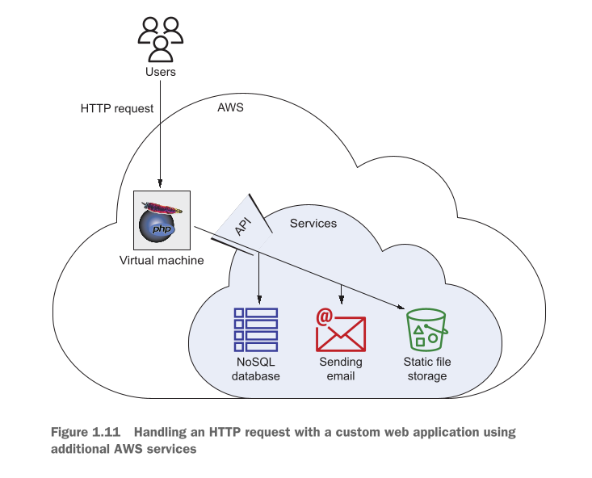

Jab Administrator system kharra kar leta hai, to aam users ke website open karne par data kaise travel karta hai, yeh **Figure 1.11** mein step-by-step samjhaya gaya hai:

1. **User Ki Request:** Jab **Users** browser kholte hain, to un ki **HTTP request** seedhi AWS ke andar mojud **Virtual Machine** ke paas jati hai.
2. **App Ka Response:** Virtual machine ke andar chal raha web server aur custom PHP web application us request ko prapare karta hai.
3. **API Se Baat-Cheet:** User ko sahi jawab dene ke liye PHP app ko doosri AWS services ki madad chahiye hoti hai. Is ke liye PHP app khud AWS ki **API** ka darwaza khatkhatata hai:
* Woh data check karne ke liye **NoSQL Database** se query karta hai.
* Zaroori files uthane ke liye **Static File Storage** se contact karta hai.
* Aur user ko notification dene ke liye **Sending Email** service ka use karta hai.

4. Yeh saara data API ke zariye minto mein process ho kar user ke samne screen par website ki surat mein aa jata hai.

---

### Services Ki Bharmaar Aur Categories

Shuru shuru mein services ki ginti dekh kar banda darr sakta hai. Jab aap pehli baar AWS ke web interface mein login karte hain, to aap ke samne takreeban **200 se zyada services** aa jati hain, jo **25 mukhtalif categories** mein banti hui hain.

In mein lagatar izafa hota rehta hai kyunke AWS poore saal naye features nikalta hai aur har saal November mein Las Vegas mein un ki aik bohot bari conference hoti hai jise **AWS re:Invent** kehte hain, jahan naye barray jadooi tools launch kiye jaate hain. *(Aaj 2026 ke daur mein AI, GenAI aur Serverless ki wajah se yeh ginti aur bhi zyada phail chuki hai).*

AWS in mukhtalif categories mein services faraham karta hai:

* Analytics  Application integration  AR and VR
* AWS cost management  Blockchain  Business applications
* Compute  Containers  Customer enablement
* Database  Developer tools  End-user computing
* Frontend web and mobile  Game Development  Internet of Things
* Machine learning  Management and governance  Media services
* Migration and transfer  Networking and content delivery  Quantum technologies
* Robotics  Satellite  Security, identity, and compliance

---

### Kitab Ka Scope (Selected Must-Have Services)

Zaahir si baat hai ke aik hi kitab mein in saari 200+ services ko parhana bilkul na-mumkin (impossible) hai. Is liye is kitab mein aap ke liye sirf un **khas aur sab se zyada chalne wali (must-have) services** ko chuna gaya hai, jo aap ko minto mein aik lajawab, responsive, aur failure-proof system banane, usay barhane, aur chalane mein madad dengi. Jab aap in bunyadi services ke ustad ban jayein, to aap baqi ki nice-to-have services ko khud bhi explore kar sakte hain.

Is kitab mein hum in services ko poori gehrai (deep detail) ke sath parhenge:

* **EC2:** Virtual machines (Khali computers jin par aap ka control hota hai).
* **ECS and Fargate:** Containers (Docker apps) ko chalanay aur manage karne ke liye.
* **Lambda:** Executing functions (Serverless tareeqa, jahan computer ki fikar kiye bina sirf apna code run kiya jata hai).
* **S3:** Object store (Files, videos, aur static data rakhne ki unlimited space).
* **Glacier:** Purane data ko saste tareeqay se archive (mahfooz) karne ke liye.
* **EBS:** Virtual machines ke liye lagne wali hard disks (Block storage).
* **EFS:** Network filesystem (Aik aisi shared drive jo aik sath kayi computers se connect ho sakay).
* **RDS:** SQL databases (Table aur rows wala managed structured database).
* **DynamoDB:** NoSQL database (Bohot hi fast aur scale hone wala unstructured database).
* **ElastiCache:** In-memory key-value store (Data ko RAM mein rakh kar speed barhane ke liye caching tool).
* **VPC:** Virtual network (Cloud ke andar aap ka apna secured zati network area).
* **ELB:** Load balancers (Traffic ko servers par barabar bantne wala guard).
* **Simple Queue Service (SQS):** Distributed queues (Messages aur tasks ko line mein lagane ke liye).
* **CodeDeploy:** Code ko automatically bina website band kiye servers tak pohnchana.
* **CloudWatch:** Monitoring aur logging (System ki performance par nazar rakhna aur errors pakadna).
* **CloudFormation:** Automating your infrastructure (Poora network aur server setup sirf code ke zariye kharra karna - IaC).
* **IAM:** Security checking (Kiski pahunch kis resource tak hogi, usay sakhti se restrict karna).

Yahan teen barray topics (Continuous Delivery, Machine Learning, aur Analytics) ko shamil nahi kiya gaya kyunke un par alag se poori kitabein bhari ja sakti hain. Agar aap baad mein Machine Learning seekhna chahein, to Manning ki hi aik alag kitab mojud hai (*AI as a Service: Serverless Machine Learning with AWS*). Lekin writer ka kehna hai ke pehle is kitab ko mukammal karein, kyunke yeh aap ko woh pakki **bunyadi samajh (foundational knowledge)** de degi, jis ke baad aap cloud ki dunya ki kisi bhi advanced service ko bacho ki tarah khud hi samajh payenge.

---
