# A Simple Example : Wordpress in 15 minutes

Socho hum ek game khel rahe hain jahan hum ek website ko internet par chalana chahte hain. Is chapter mein hum seekhenge ke aik aam website (jaise WordPress blog) ko sirf 15 minutes mein AWS cloud par kaise shift (migrate) karte hain aur wahan is ka ek naya dhancha (infrastructure) khara karte hain.

Puri book mein hum isi WordPress ki misaal ko bar-bar dekhnge taake mushkil cheezein aaram se samajh aa jayein. Jaise database ke concepts ko hum chapter 10 mein deeply parhain ge aur auto-scaling (yani users zyada hon toh machines ka khud-ba-khud barh jana) ko chapter 17 mein seekhenge.

> **Zaroori Note (Free Tier):** Agar aap ka AWS account bilkul naya hai aur aap ne koi aur cheez nahi chalai hui, toh yeh lab bilkul muft (Free) hai. Bas is baat ka khayal rakhna hai ke kaam khatam hote hi 2-3 din ke andar sab kuch delete (clean up) kar dena hai taake baad mein koi charges na parhein.

### Ek Real-World Example Se Samajhte Hain

Farz karo aap aik aisi company mein kaam karte ho jo naye software aur operations engineers ko attract karne ke liye ek blog chalati hai, aur is blog ke liye WordPress use karti hai. Is blog par rozana taqreeban 1,000 log aate hain. Purane tareeqe (on-premises/apne server) par is website ko chalane ka kharcha $250 mahina aa raha hai, jo ke kafi mehnga hai! Aur sab se bara masla yeh hai ke yeh blog mahine mein kahin dafa band (outage/down) ho jata hai.

Company chahti hai ke naye engineers par acha impression pare, is liye website ka **Highly Available** hona zaroori hai. Highly available ka matlab hai **99.99% Uptime**—yani website saal bhar mein sirf kuch hi minutes ke liye band ho sakti hai, is se zyada nahi! Is cheez ko check karne ke liye hum ek Proof of Concept (PoC) kar rahe hain jahan hum yeh 3 kaam karenge:

1. WordPress ke liye highly available setup banayenge.
2. Mahine ka kharcha (cost) check karenge.
3. Aakhri faisla karke infrastructure ko delete kar denge.

WordPress chalne ke liye **PHP** language use karta hai, data store karne ke liye **MySQL database** chahiye hota hai, aur images/files ke liye storage disk chahiye hoti hai. Pages serve karne ke liye **Apache** web server kaam karta hai. Ab hum in requirements ko AWS ke tools ke sath jorain ge.

---

## Creating your infrastructure

Upar diye gaye purane system ko AWS par laane ke liye hum niche di gayi 5 AWS services ka use karenge:

* **Elastic Load Balancing (ELB):** Yeh samajh lo aik traffic pulis wala (traffic cop) hai. Jab bohot saare log website par aate hain, toh yeh load balancer un sab ka load alag-alag computer machines par barabar baant (distribute) deta hai. Yeh khud kabhi fail nahi hota (highly available by default). Yeh computers ka 'health check' bhi karta hai—yani check karta rehta hai ke computer theek kaam kar raha hai ya nahi. Agar koi computer kharab ho jaye, toh yeh wahan traffic bhejna band kar deta hai. Yahan hum **Application Load Balancer (ALB)** use kar rahe hain jo **Layer 7 (HTTP/HTTPS)** par kaam karta hai, yani yeh website ke web traffic ke mutabaq smart decisions leta hai.
* **Elastic Compute Cloud (EC2):** Yeh cloud ke andar aap ke virtual computers (machines) hain. Hum yahan Linux operating system ka ek khas version use kar rahe hain jise **Amazon Linux** kehte hain (jo AWS ke liye special optimized hai), lekin aap Ubuntu ya Windows bhi use kar sakte hain. Kyunki computers achanak kharab ho sakte hain, is liye design decision yeh hai ke hum ek ke bajaye **kam se kam 2 EC2 machines** lagayenge. Agar aik machine kharab ho gayi, toh Load Balancer foran saari traffic doosri machine par bhej dega jab tak pehli machine ki jagah nayi machine na aa jaye.
* **Relational Database Service (RDS) for MySQL:** WordPress ka sara data (posts, comments, user info) MySQL database mein save hota hai. Agar hum khud computer par database banayein toh backup lena aur updates install karna bohot mushkil hota hai. **RDS** aik aisi service hai jahan AWS database ka sara boring aur mushkil kaam (backups lena, security patches lagana, updates install karna) khud sambhal leta hai. RDS database ko bhi highly available bana deta hai taake data kabhi zaya na ho.
* **Elastic File System (EFS):** WordPress ki apni application files aur users ki upload ki hui images ko save karne ke liye ek shared storage chahiye hoti hai. Kyunki hamari website 2 alag-alag EC2 machines par chal rahi hai, dono computers ko ek hi jagah se images uthani aur pehchanni hain. **EFS** ek aisi network file storage hai jise dono computers aik sath use kar sakte hain network protocol (**NFSv4.1**) ke zariye. Yeh bohot mazboot (durable) aur highly available hoti hai.
* **Security groups:** Yeh aap ke computers, databases, aur load balancers ke bahar khara aik virtual security guard (**Firewall**) hai. Yeh control karta hai ke kaun andar aa sakta hai aur kaun bahar ja sakta hai. Jaise hum rule banayenge ke internet se koi bhi shakhs Load Balancer ke Port 80 (HTTP traffic) par aa sakta hai. Lekin database (Port 3306) par sirf hamare web servers (EC2 machines) hi baat kar sakte hain, koi bahar ka banda direct database ko touch nahi kar sakta.

### Figure 2.1 Breakdown

  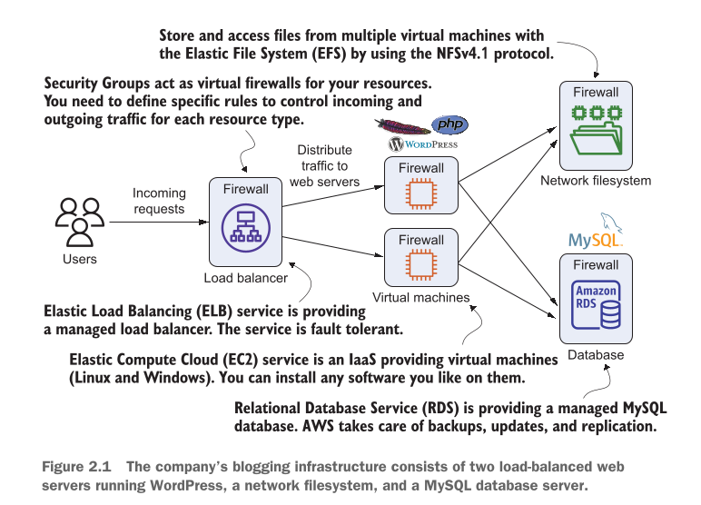

Chalein ab upar di gayi image (**Figure 2.1**) ko samajhte hain ke yeh sab mil kar kaise kaam karte hain:

1. **Users aur Incoming Requests:** Sab se pehle left side par users hain jo website open karne ke liye requests bhejte hain.
2. **Load Balancer (ELB) aur Firewall:** Yeh requests sab se pehle ek Firewall (Security Group) se guzarti hain aur Load Balancer ke paas aati hain jo traffic ko distribute karta hai.
3. **Virtual Machines (EC2):** Load balancer traffic ko do alag-alag virtual machines (EC2 web servers) par bhej raha hai jahan WordPress chal raha hai. Har machine ke agay apna Firewall laga hua hai.
4. **Storage aur Database:** Yeh dono web servers right side par majood do cheezon se connect hain: upar **Network filesystem (EFS)** hai jahan files store hoti hain (NFSv4.1 protocol ke zariye), aur neeche **Amazon RDS Database** hai jahan MySQL chal raha hai. Dono ke baahar bhi Firewalls lage hain taake security tight rahe.

---

### CloudFormation Ke Zariye Automation

Yeh saari cheezein hath se banana kafi mushkil lagta hai, lekin AWS mein hum yeh sab kuch sirf chand clicks se **AWS CloudFormation** ke zariye automatic bana sakte hain. CloudFormation background mein yeh saare kaam khud hi kar deta hai:

1. Load Balancer (ELB) banata hai.
2. MySQL Database (RDS) ready karta hai.
3. Network filesystem (EFS) khara karta hai.
4. Firewall rules (security groups) attach karta hai.
5. Do virtual machines (EC2) banata hai, un par EFS mount karta hai, Apache aur PHP install karta hai, WordPress 4.8 download karta hai, database configure karta hai, aur web server start kar deta hai.

Is setup ko shuru karne ke liye aap ko AWS Management Console (`[https://console.aws.amazon.com](https://console.aws.amazon.com)`) open karna hoga. Wahan navigation bar mein 'Services' par click karke **CloudFormation** select ya search karein.

> **Zaroori Baat (Default Region):** Hamesha yaad rakhein ke cloud mein aap ko koi ek ilaqa (Region) chunna hota hai. Hum is book ke saare kaam **N. Virginia (us-east-1)** region mein karenge. Screen ke top-right corner se hamesha check kar lein ke N. Virginia select ho.

Ab **Create Stack** par click karein aur **With New Resources (Standard)** ko select karein taake 4-steps ka wizard shuru ho sake.

### Figure 2.2 Breakdown

  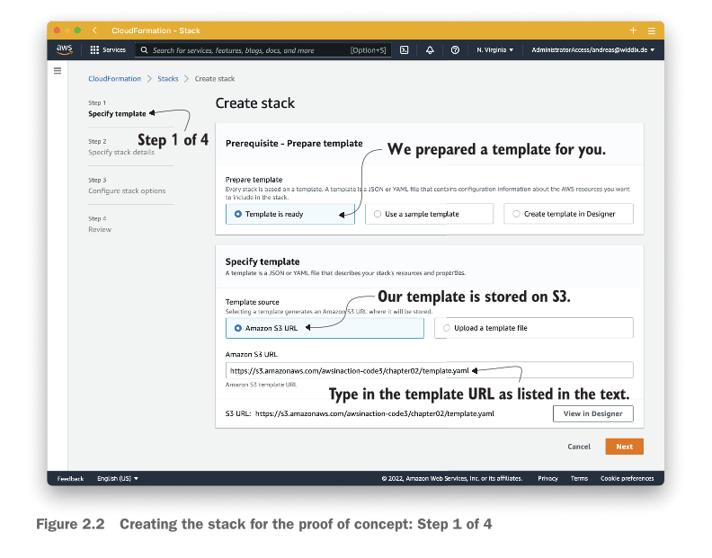

Jaise ke aap **Figure 2.2** mein dekh sakte hain, yeh hamara **Step 1 of 4** hai:

* Sab se pehle **Template is ready** ko select karna hai, kyunki hamare paas bani-banayi template file majood hai.
* Template source mein **Amazon S3 URL** par click karna hai aur niche box ke andar exact yeh link paste karna hai: `[https://s3.amazonaws.com/awsinaction-code3/chapter02/template.yaml](https://s3.amazonaws.com/awsinaction-code3/chapter02/template.yaml)`. Is ke baad **Next** button par click karna hai.

### Figure 2.3 Breakdown

  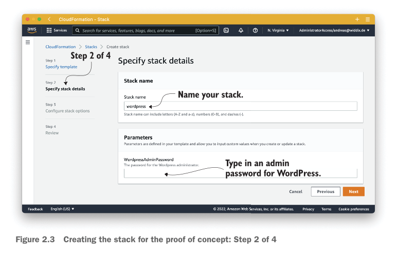

Jaise ke aap **Figure 2.3** mein dekh sakte hain, yeh hamara **Step 2 of 4** hai jahan details enter karni hain:

* **Stack name:** Yahan box mein chote lafzon mein `wordpress` likhna hai taake is poore setup ka ek naam rakha ja sake.
* **Parameters:** Niche `WordpressAdminPassword` ka option hai, yahan aap ne apna ek secret password likhna hai jo aap WordPress dashboard login ke liye use karenge. Is ke baad **Next** daba dena hai.

### Figure 2.4 Breakdown

  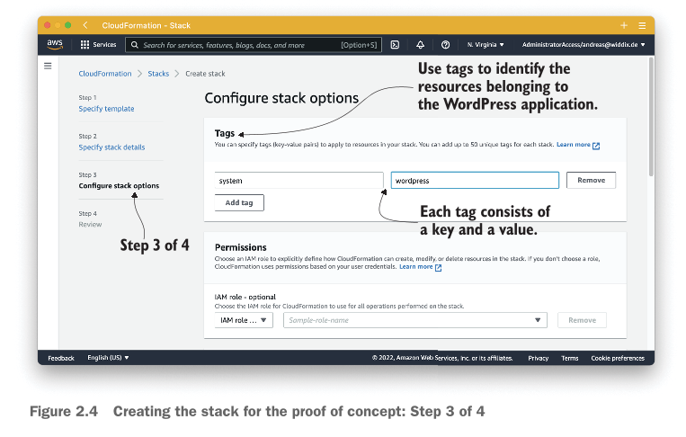

Jaise ke aap **Figure 2.4** mein dekh sakte hain, yeh hamara **Step 3 of 4** hai jahan hum **Tags** lagate hain:

* Tags sticker ki tarah hote hain jo resources par pehchan ke liye lagaye jaate hain taake testing aur production ka farq pata chal sake ya kharche track ho sakein. Yahan hum Key mein `system` aur Value mein `wordpress` likhenge. Is se humein asani se pata chal jayega ke yeh saare components isi WordPress project ka hissa hain.
* *Tagging Rules:* Key ka naam 128 characters se chota aur Value ka naam 256 characters se kam hona chahiye. Is ke baad **Next** button dabayein.

---

## Additional CloudFormation stack options

Is step par mazeed advance cheezein aati hain jaise permissions (IAM roles) lagana ya notifications set karna. 99% aam kaamon mein hmeim in ki zaroorat nahi hoti, is liye hum inhein bina chere aage barh sakte hain.

### Figure 2.5 Breakdown

  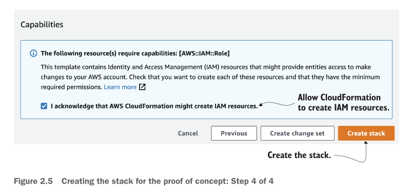

Jaise ke aap **Figure 2.5** mein dekh sakte hain, yeh hamara **Step 4 of 4** (Review screen) ka aakhri hissa hai:

* Yahan AWS aap se ijazat mangta hai ke CloudFormation background mein security aur access management (IAM) resources bana sake. Aap ne blue box ke andar majood **"I acknowledge that AWS CloudFormation might create IAM resources."** ke checkbox ko tick mark (check) karna hai.
* Phir right side par orange rang ke **Create stack** button par click kar dena hai.

### Figure 2.6 Breakdown

  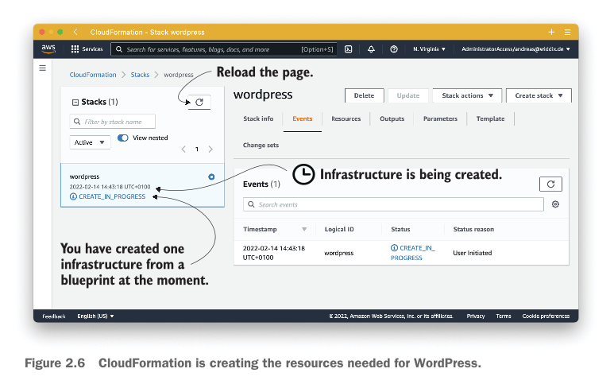

Jaise hi aap button click karenge, aap ke samne yeh screen (**Figure 2.6**) aa jayegi:

* Yahan aap ke stack ka status **CREATE_IN_PROGRESS** dikhayi dega. Is ka matlab hai ke cloud mein computers, networks aur databases background mein ek blueprint se banna shuru ho gaye hain.
* Yeh poora setup banne mein taqreeban **15 minutes** langenge. Aap thori thori der baad upar diye gaye gol arrow (Refresh button) par click kar ke status check kar sakte hain.

### Figure 2.7 Breakdown

  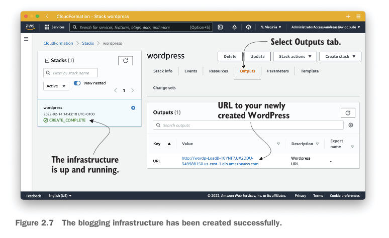

Jab saara kaam mukammal ho jaye ga, toh status badal kar hira (green) rang mein **CREATE_COMPLETE** ho jayega jaisa ke **Figure 2.7** mein dikhaya gaya hai:

* Aap ne apni `wordpress` row ke shuru mein majood checkbox ko select karna hai.
* Phir center mein majood tabs mein se **Outputs** tab par click karna hai.
* Outputs ke andar aap ko ek **URL** milega (jaise `http://wordp-LoadB-...`). Yeh aap ki live WordPress website ka address hai! Is link par click karte hi aap ka blog browser mein khul jayega.

---

## Automation references

Ab aap soch rahe honge ke yeh sab itni asaani se khud-ba-khud kaise ho gaya? Is ka jawab hai **Automation**. AWS ka sab se bada asool hi yeh hai ke aap har cheez ko automate kar sakte hain.

Background mein hamara poora cloud infrastructure ek blueprint (naksha/template) ko dekh kar bana hai. Is tarah se infrastructure ko program karne ka tareeqa hum chapter 4 mein deeply seekhenge aur software ko automatic deploy karne ka tareeqa chapter 15 mein parhenge. Next section mein hum is poore blogging infrastructure ko mazeed andar se explore karenge!

---

Hum ne apna blogging infrastructure toh khara kar liya, ab chalain bilkul kareeb se is ka niaz-bata (inspection) karte hain ke is ke andar chal kya raha hai. Hamara yeh setup in 4 main hisson par mushtamil hai:

* **Web servers:** Jo virtual machines par chal rahe hain.
* **Load balancer:** Traffic ko sambhalne wala traffic cop.
* **MySQL database:** Jahan sara zaroori data save hota hai.
* **Network filesystem:** Ek shared memory ya folder jise sab use kar sakte hain.

---

## Virtual machines

Sab se pehle, AWS Console ke upar search bar ya navigation bar ka istamal kar ke **EC2 service** ko kholain, jaisa ke **Figure 2.8** mein dikhaya gaya hai. Is ke baad, left side par majood menu se **Instances** par click karein. Aap ke samne ek list khulegi jis mein do virtual computers (machines) nazar aayengi jin ka naam `wordpress` rakha gaya hai. Jab aap un mein se kisi aik machine par click karenge, toh us ki saari andaruni details niche khul kar samne aa jayengi.

**Figure 2.8 Breakdown:**

  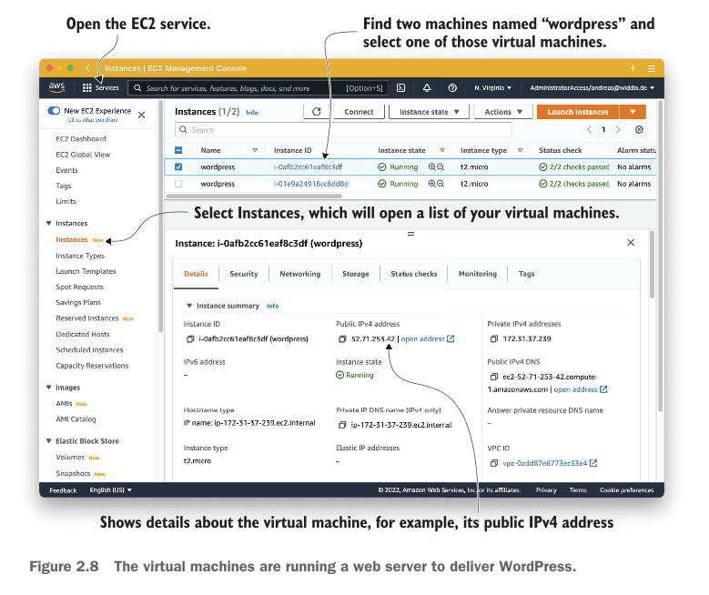

* Upar wala arrow ishara kar raha hai ke **Services** menu par click kar ke **EC2 service** ko khola gaya hai.
* Left side par **Instances** ka option select karne se center mein hamari chalne wali machines ki list aa gayi hai. Niche box mein aik machine ki summary dikhayi de rahi hai.
* Yahan center mein **Public IPv4 address** (jaise `52.71.253.42`) saaf nazar aa raha hai. Yeh woh address hai jise use kar ke yeh machine internet se connect hoti hai.

Chalein ab computer ki in technical details ko bilkul bacho ki tarah aasan lafzon mein samajhte hain:

* **Instance ID:** Yeh samajh lo is computer ka roll number ya unique identity card number hai, jo AWS mein kisi aur computer ka nahi ho sakta.
* **Instance type:** Yeh batata hai ke is computer ka size kitna hai—yani is mein kitna CPU (dimagh) aur kitni Memory/RAM (yaadashat) lagi hui hai. Hamari template ne isay `t2.micro` size diya hai.
* **IPv4 Public IP:** Yeh is computer ka internet wala ghar ka pata (address) hai. Is address ke zariye internet par koi bhi is computer tak pohanch sakta hai.
* **AMI ID:** Hum ne padha tha ke hum **Amazon Linux OS** use kar rahe hain. Is ID par click karne se aap ko pata chal jata hai ke is operating system ka exact version konsa chal raha hai.

Yahan par aik tab hota hai jise **Monitoring** kehte hain. Yeh samajh lo computer ke dil ki dharkan check karne wali ECG machine hai. Yeh tab dekhna bohot zaroori hai agar aap dekhna chahte hain ke aap ka system sahi chal raha hai ya thak raha hai. AWS yahan computer ki performance ke graph dikhata hai.

> **Design Decision & Trade-off:** Agar website par achanak bohot log aa jayein aur CPU ka istamal **80% se upar** chala jaye, toh computer thak jata hai aur website slow ho jati hai. Yeh graph dekh kar hi hum faisla karte hain ke ab humein aik aur naya computer (virtual machine) barha dena chahiye taake website super-fast rahe.

---

## Load balancer

Ab bari aati hai load balancer ko check karne ki, jo hamari traffic ko dono computers mein barabar baantta hai. Yeh bhi EC2 service ka hi ek hissa hai, is liye aap ko kisi naye page par jaane ki zaroorat nahi hai. Bas left side par majood sub-navigation menu mein thora niche scroll karein aur **Load Balancers** par click kar dein. List mein se apne load balancer ko select karein taake us ki details khul sakein.

**Figure 2.9 Breakdown:**

  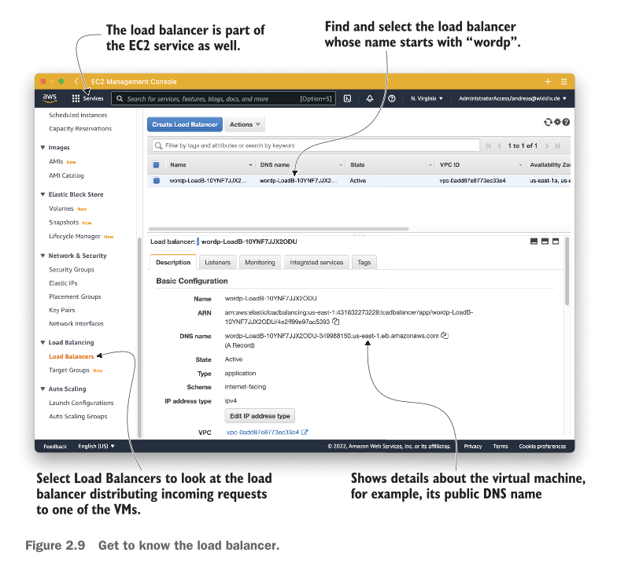

* Left menu se **Load Balancers** par click kiya gaya hai aur center mein `wordp-LoadB-...` naam ka load balancer select hai.
* Neeche arrow dikha raha hai is ka **DNS name**. Yeh AWS ki taraf se khud-ba-khud banaya gaya ek lamba sa web address hota hai. Hamara load balancer internet-facing hai, yani bahar ki dunya isi DNS name ke zariye hamari website par aati hai.

Load balancer internet se aane wali har request ko pakadta hai aur hamari dono virtual machines mein se kisi aik ki taraf bhej deta hai. Lekin load balancer ko kaise pata chalta hai ke computers kahan chupe hain? Is ke liye **Target Group** ka istamal hota hai. Target group ka matlab hai un computers ki toli (group) jin par traffic bhejni hai. Isay dekhne ke liye left menu mein Load Balancers ke thora sa niche majood **Target Groups** par click karein.

**Figure 2.10 Breakdown:**

  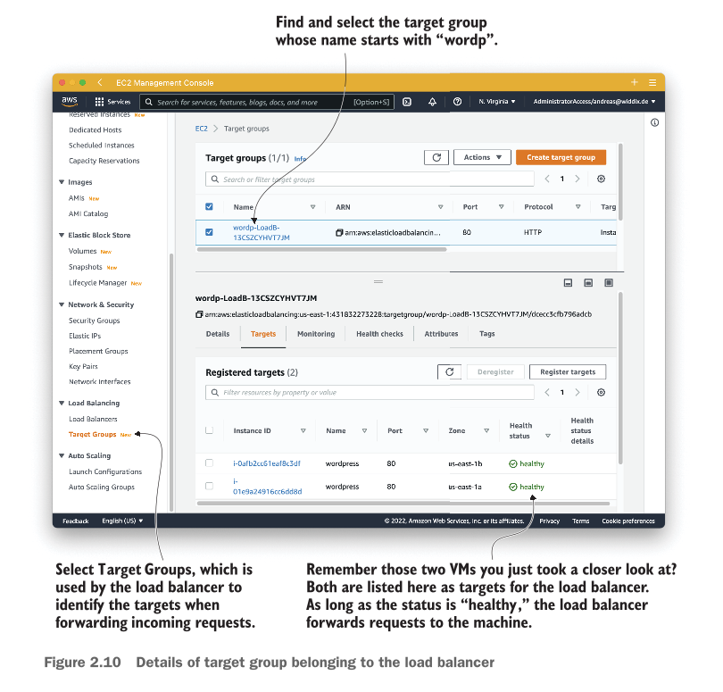

* Left menu se **Target Groups** par click karne par center mein `wordp-LoadB-...` group ki details khul gayi hain.
* Neeche **Targets** tab ke andar woh do virtual computers (EC2 instances) saaf dikh rahe hain jo hum ne shuru mein dekhe the.
* Dono computers ke agay **Health status** ke niche green rang mein **healthy** likha hua hai.

*System Behavior Detail:* Load balancer har thori der baad computers ka 'health check' karta hai (yani unhein ping kar ke poochta hai ke tum theek ho?). Kyunki dono ka status **healthy** hai, is liye load balancer dono par traffic bhej raha hai. Agar koi computer kharab ho jaye, toh status unhealthy ho jata hai aur load balancer wahan traffic bhejna band kar deta hai.

Yahan bhi **Monitoring** tab hota hai jo production (live system) mein dekhna bohot zaroori hai. Agar achanak traffic badal jaye ya HTTP errors (jaise website par error code aana) shuru ho jayein, toh yahan se dekh kar hum kharabi ko pakad (debug kar) sakte hain.

---

## MySQL database

Hamari website ka sab se keemti hissa is ka database hai jahan saara data save hota hai. Isay dekhne ke liye top navigation bar se **RDS (Relational Database Service)** kholain. Phir left side ke menu se **Databases** select karein. Wahan aap ko `MySQL community` engine wala database nazar aayega, jaisa ke **Figure 2.11** mein dikhaya gaya hai.

**Figure 2.11 Breakdown:**

  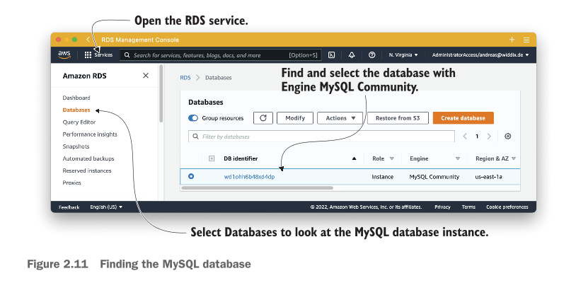

* Services se **RDS** khol kar left menu se **Databases** select kiya gaya hai.
* Center mein database ka ek unique naam (DB identifier) dikh raha hai (jaise `wd1ohh...`) aur us ka Engine `MySQL Community` hai.

**Figure 2.12 Breakdown:**

  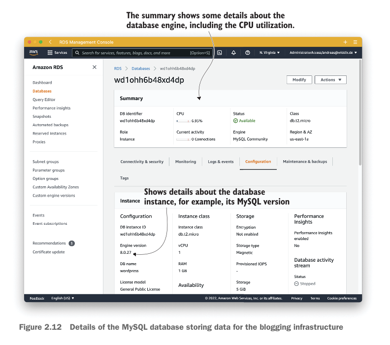

* Jab hum database par click karte hain toh us ka **Summary** page khul jata hai, jahan is ka **CPU utilization** (jaise 6.95%) dikha raha hai ke database par kitna bojh hai.
* Neeche Configuration box mein Engine version (`8.0.27`) aur Instance class (`db.t2.micro`) likha hai. Is computer mein **1 vCPU** aur **1 GB RAM** majood hai.
* Storage type ke agay **Magnetic** likha hua hai.

*Design Decision & Cost Trade-off:* Kyunki hamare is blog par rozana sirf 1,000 log aate hain, is liye database par koi bohot bada bojh nahi hai. Paise bachane ke liye (cost-effective design) hum ne mehnge SSD disks ke bajaye saste **Magnetic disks** lagaye hain aur computer ka size bhi chota (`db.t2.micro`) rakha hai jo is traffic ke liye kaafi hai. Jab hamari company barhegi aur load zyada hoga, toh hum chapter 10 ke mutabaq mehnge database engines (jaise PostgreSQL ya Oracle) aur 96 cores CPU aur 768 GB RAM wali bhari-kamkam machines par bhi shift ho sakte hain.

*WordPress Data Kahan Rakhta Hai?*

1. **Database ke andar:** WordPress blog ke posts, logon ke comments, aur settings ko MySQL database ke andar tables mein save karta hai.
2. **Database ke baahar (Disk par):** Agar koi author blog ke liye koi photo upload karta hai, ya admin naye plugins aur themes install karta hai, toh woh database mein nahi balkay computer ki storage disk par save hoti hain.

---

## Network filesystem

Ab ek masla sochein: Hamare paas 2 alag computers (EC2) chal rahe hain. Agar aik author computer #1 par login ho kar koi nayi photo upload karta hai, toh woh photo computer #1 ki disk par save ho jayegi. Lekin jab koi user website kholega aur load balancer us ki request computer #2 par bhej dega, toh us user ko photo nazar nahi aayegi kyunki computer #2 ki disk par toh photo hai hi nahi!

Is masle ko hal karne ke liye hum ne **Elastic File System (EFS)** lagaya hai. Yeh samajh lo internet par para ek aisa shared network folder hai jise hamare dono computers aik sath ek khas raste (**NFSv4.1 protocol**) ke zariye access kar sakte hain. Hum ne simplicity ke liye WordPress ki saari files (PHP, HTML, CSS, aur uploaded photos) isi shared folder (EFS) par rakh di hain taake dono computers ko har waqt har ek file milti rahe.

Isay dekhne ke liye main navigation se **EFS service** kholain aur us filesystem par click karein jis ka naam `wordpress` se shuru hota hai.

**Figure 2.13 Breakdown:**

  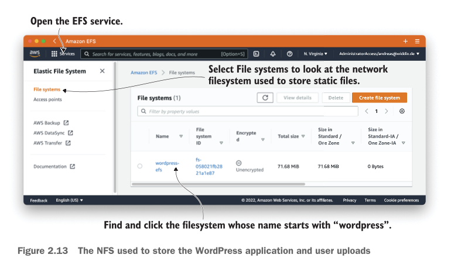

* Upar arrow se pata chal raha hai ke **EFS service** open ki gayi hai aur left menu se **File systems** select hai.
* Center mein hamara `wordpress-efs` nazar aa raha hai jis ka Total size `71.68 MiB` hai aur Security ke mutabaq yeh unencrypted hai.

*System Behavior & Configuration Details:*

* **Bursting Throughput Mode:** Is filesystem ka throughput mode **Bursting** par set hai. Is ka bacho wala matlab yeh hai ke aam tor par yeh sasta aur normal speed par chalta hai, lekin agar din mein kisi waqt achanak bohot saari files download ya upload karni parhein, toh yeh bina kisi extra kharche ke thori der ke liye apni speed ko bohot teiz (burst) kar leta hai.
* **Mount Targets:** Virtual computers ko is shared folder se jorne ke liye raste chahiye hote hain jinhein **Mount Targets** kehte hain. Hum ne yahan fault tolerance (yani agar aik network rasta kharab bhi ho jaye toh doosra chalta rahe) ke liye **2 mount targets** banaye hain. Yeh virtual machines is network storage se connect karne ke liye ek DNS name ka istamal karti hain.

Ab jab ke hum ne apne poore naye cloud ghar (infrastructure) ka kona-kona dekh liya hai, agle section mein hum is baat ka hisab lagayenge ke is saare setup ko chalane ka mahine ka kharcha kitna aata hai!

---