# Using virtual machines: EC2

Aap apne haath mein pakde hue smartphone ya apne bag mein rakhe laptop ki taqat ko dekh kar heraan hote honge ke yeh kitne saare kaam asani se kar lete hain. Lekin, agar aap ka task aisa hai jise bohot zyada **massive computing power** chahiye, ya bohot zyada **network traffic** handle karni hai, ya phir use bina ruke **24/7** chalte rehna hai, to aap ke laptop ya mobile ki bas ho jayegi! Aise kamo ke liye ek **Virtual Machine (VM)** sab se behtareen solution hai.

### Virtual Machine Kya Hoti Hai?

Iski misal aise samajhein ke ek bohot bada, aalishan mall (Physical Server) hai. Is mall ke andar choti-choti partitions kar ke alag-alag shops (Virtual Machines) bana di gayi hain.

* Har shop ka apna shutter, apna counter, aur apna staff hota hai.
* Ek shop mein kya bik raha hai, us se barabar wali shop ko koi lena dena nahi hota.
* Virtual machine ke case mein bhi bilkul aisa hi hota hai. Aap ko ek bohot bade physical computer (jo AWS ke data center mein pada hai) ka ek chota sa hissa ya slice de diya jata hai. Is slice ko aap bilkul apne zati computer ki tarah chalate hain.

AWS par in virtual machines ko jis service ke zariye chalaya jata hai, use hum **Elastic Compute Cloud (EC2)** kehte hain.

Is chapter mein aap seekhenge ke AWS par virtual machine ko kaise launch (start) aur manage kiya jata hai. Is ke sath hi hum is VM se connect karna, applications configure karna, aur is system ki performance ko monitor karna bhi seekhenge. Sab se ahem baat, hum EC2 ke alag-alag **pricing options** ko bhi explore karenge taake aap ke paise zaya na hon aur kam budget mein behtareen computing power mil sake.

---

## Not all examples are covered by Free Tier

Yahan writer humein pehle hi ek warning de raha hai jo ke bohot zaroori hai. Is chapter mein di gayi tamam examples **AWS Free Tier** (muft sahulat) ke daire mein nahi aatein.

### Nuqsan Se Bachne Ka Tarika:

* Jab bhi koi aisi example aayegi jis par paise lagte hain, to wahan ek **special warning message** diya jayega.
* Baqi aam examples ke liye rule yeh hai ke jab tak aap unhein **kuch dino se zyada** on nahi chorenge, aap ko kuch pay nahi karna padega.
* Lekin yaad rakhein, yeh tabhi sach hai agar aap ne is book ke liye ek bilkul **fresh (naya) AWS account** banaya hai aur us par pehle se koi aur cheez nahi chal rahi.
* Behtareen strategy yeh hai ke aap is chapter ke practicals ko **kuch hi dino ke andar mukammal karein** aur aakhir mein apne account ko clean-up (tamam chalne wali cheezon ko delete) kar dein.

---

## Exploring a virtual machine

Virtual machine (VM) hamesha ek physical computer (jise hum **Host Machine** kehte hain) par chalti hai. Is virtual machine ko doosri virtual machines se mukammal taur par alag aur safe rakhne ka kaam **Hypervisor** karta hai.

### Virtualization Ki Layers (Figure 3.1 Breakdown)

Agar hum **Figure 3.1** ko dekhein, to virtualization ka poora dacha (architecture) teen ahem layers par khara hai:

<div align="center">
  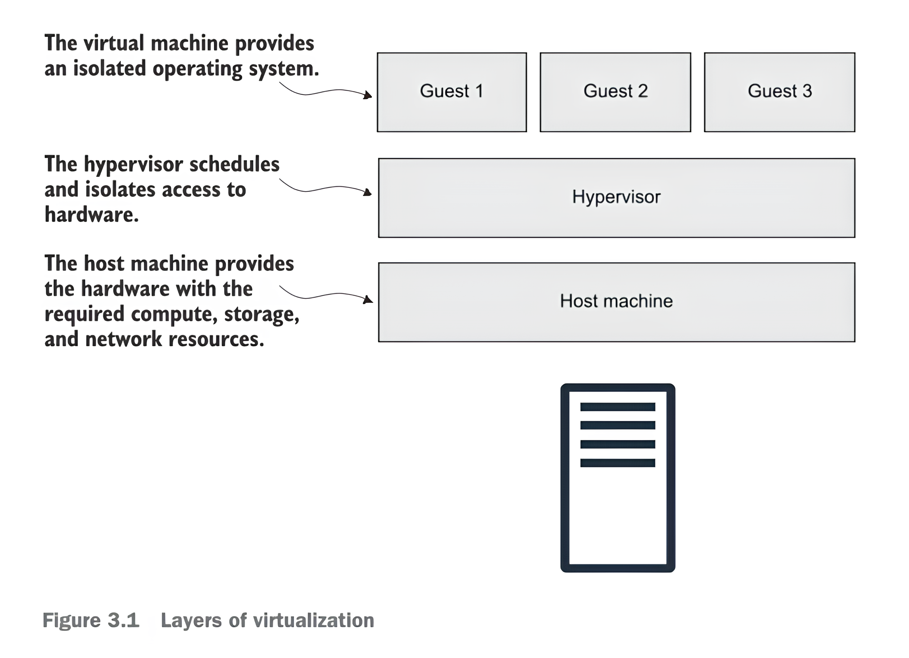
</div>

1. **The Host Machine (Sab se niche wali layer):** Yeh asli, physical hardware server hai jo AWS ke data center mein laga hota hai. Is ke paas CPU, RAM, Storage (hard disks), aur Network cables hoti hain.
2. **The Hypervisor (Darmeyan wali layer):** Yeh ek behtareen software ya hardware manager hai. Iska kaam physical machine ke hardware ko chote chote hisson mein baant kar upar wali virtual machines ko dena hai. Yeh bilkul ek traffic cop ki tarah kaam karta hai jo har Guest VM ko security aur boundary deta hai taake Guest 1 kabhi bhi Guest 2 ke data mein taank-jhaank na kar sake.
3. **The Guest Machines / Guest OS (Sab se upar wali layer):** Yeh wo virtual machines hain jo hum AWS par banate hain. Har Guest VM ke paas apna isolated (alag) Operating System hota hai (jaise Linux ya Windows).

### Virtual Machine Kahan Kaam Aati Hai? (Real-world Use Cases)

Writer ne teen bohot ahem real-world use cases bataye hain:

* **Hosting a web application (WordPress):** Agar aap ne koi blog ya website chalani hai.
* **Operating an enterprise application (ERP):** Company ke hisab-kitab aur management ke bade softwares chalane ke liye.
* **Transforming or analyzing data:** Jaise badi video files ko convert (encode) karna ya bade data sets ko process karna.

---

## Launching a virtual machine

Ab hum ek asli practical kaam karne ja rahe hain! Hum ek virtual machine launch karenge taake hum **LinkChecker** naam ka ek tool chala sakein.

### LinkChecker Kya Hai Aur Kyun Chahiye? (Real-World Example)

Aap ki website par agar koi link toota hua hai (yani jab user click kare to "404 Not Found" error aaye), to website ka user experience kharab hota hai aur Google search rankings (SEO score) bhi gir jati hai. **LinkChecker** poori website ko scan kar ke in tootay hue links ko dhoond nikalta hai.
Aap ise apne laptop par bhi chala sakte hain, lekin AWS ke EC2 instance par chalane ka faida yeh hai ke wahan **internet speed** aur **computing power** bohot zyada milti hai, jis se kaam seconds mein ho jata hai.

AWS par virtual machine ko launch karna bohot asaan hai (AWS virtual machine ko **EC2 Instance** kehta hai). **Figure 3.2** ke mutabaq aap ko yeh steps follow karne hain:

<div align="center">
  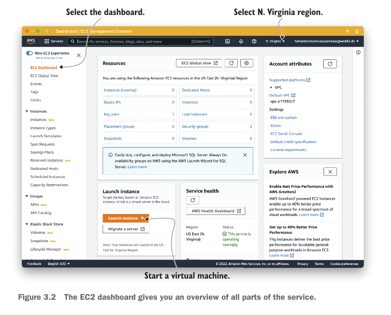
</div>

1. Apne browser mein AWS Management Console kholin: `[https://console.aws.amazon.com](https://console.aws.amazon.com)`
2. **Region Selection (Figure 3.2):** Sab se pehle top right corner par ja kar region select karein. Hum is book ke liye **N. Virginia (US East-1)** region select karenge kyunke saari examples isi ke liye design ki gayi hain.
3. **Search for EC2:** Services menu par click karein aur search bar mein "EC2" likh kar enter karein.
4. **Click Launch Instance:** EC2 dashboard par aate hi aap ko ek bada orange button **"Launch instance"** nazar aayega (jaise **Figure 3.2** mein dikhaya gaya hai). Is par click karte hi ek wizard (form) khul jayega jo virtual machine banane mein aap ki rehnumai karega.

Yeh wizard aap se niche batayi gayi 7 details poochega:

1. Virtual machine ka naam rakhna
2. Operating System (OS) choose karna
3. Machine ka size (RAM/CPU) select karna
4. Connection details configure karna
5. Storage (Hard drive) add karna
6. Firewall (Security Group) set karna
7. Permissions set karna (taake VM doosri AWS services se baat kar sake)

---

### NAMING THE VIRTUAL MACHINE

Apni virtual machine ko pehchanna bohot zaroori hai, khaas tor par jab ek hi AWS account ko zyada log istemal kar rahe hon.

**Figure 3.3** ke mutabaq:

<div align="center">
  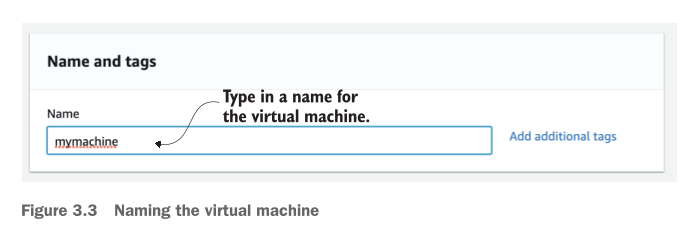
</div>

* **Name and tags** wale section mein ja kar **Name** field ke andar apni machine ka koi munasib naam likhein.
* Book ke mutabaq hum iska naam **"mymachine"** rakhenge. Yeh naam AWS ke andar is instance par ek `Name` tag laga deta hai, jis se ise dhoondna asaan ho jata hai.

---

### SELECTING THE OPERATING SYSTEM

Ab humein apni machine ke liye Operating System chunna hai. AWS mein operating system akela nahi aata, balkey us ke sath kuch zaroori tools aur software pehle se pack (bundle) hote hain. Is poore package ko hum **Amazon Machine Image (AMI)** kehte hain.

### AMI Kya Hai? (Virtual Appliances ki ELI5 Explanation)

Agar hum **Virtual Appliance** wale diagram ko dekhein, to yeh ek **tayyar-shuda template** ki tarah hai.

```
+--------------------------+                 +--------------------------+
|    Virtual Appliance     |                 |     Virtual Machine      |
|  (Template / Blueprint)  |                 |     (Live & Running)     |
|                          |                 |                          |
|  +--------------------+  |                 |  +--------------------+  |
|  |    Application     |  |                 |  |    Application     |  |
|  +--------------------+  |  Launch Machine |  +--------------------+  |
|  |     Libraries      |  | --------------> |  |     Libraries      |  |
|  +--------------------+  |                 |  +--------------------+  |
|  |  Operating System  |  |                 |  |  Operating System  |  |
|  +--------------------+  |                 |  +--------------------+  |
+--------------------------+                 +--------------------------+

```

Iski asaan misal **frozen pizza** jaisi hai. Aap frozen pizza late hain, use oven mein rakhte hain, aur pizza tayyar! Aap ko dough gundhne ya sauce banane ki mehnat nahi karni padti.

* **Virtual Appliance (AMI):** Wo frozen pizza (template) hai jis mein OS, libraries, aur tools pehle se dale hue hain.
* **Virtual Machine:** Wo paka hua pizza hai jo launch hone ke baad chal raha hai. Jab bhi aap kisi AMI se VM banayenge, har dafa bilkul **exact same result** milega. Is se softwares ko baar baar install aur configure karne ka kharcha aur waqt bach jata hai.

#### AMI ke Technical Details aur 2026 ke Modern Updates:

* **AMI Components:** AMI ke andar ek read-only filesystem (OS, files, config) hoti hai. Lekin purane zamane mein operating system ka main engine (Kernel) alag se **Amazon Kernel Image (AKI)** ke zariye load hota tha.
* **Modern Nitro System (2026 Update):** Aaj ke dor (2026) mein AWS mukammal taur par apne **Nitro System** par shift ho chuka hai. Nitro ek nihayat hi tez, hardware-based virtualization system hai jo **KVM (Kernel-based Virtual Machine)** hypervisor ko custom-made ASICs (chips) ke sath jodta hai. Iska faida yeh hai ke aap ki virtual machine ko bilkul aisi direct speed milti hai jaise wo bina kisi hypervisor ke direct physical hardware (bare metal) par chal rahi ho!

<div align="center">
  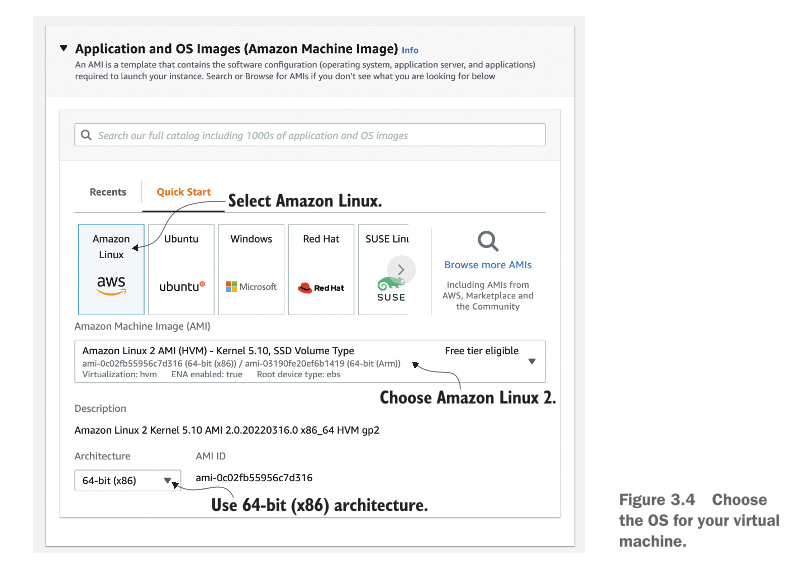
</div>

* **Operating System Choice (Figure 3.4):** **Figure 3.4** ke mutabaq humein **Quick Start** mein ja kar **Amazon Linux** select karna hai.
* *Purana rasta:* Book mein Amazon Linux 2 select karne ka kaha gaya hai.
* *2026 Modern Standard:* Aaj kal **Amazon Linux 2023 (AL2023)** standard hai. Yeh Red Hat aur Fedora par mabni hai, bohot secure hai, aur AWS isay khud maintain aur optimize karta hai taake EC2 par maximum performance mil sake. Architecture hamesha **64-bit (x86)** select karein.


---

### CHOOSING THE SIZE OF YOUR VIRTUAL MACHINE

Ab baari aati hai taqat choose karne ki! AWS computing power ko **Instance Types** mein divide karta hai. Har instance type aap ko batata hai ke aap ke paas kitne **virtual CPUs (vCPUs)** aur kitni **Memory (RAM)** hogi.

#### Table 3.1: Examples of instance families and types (Updated for 2026)

Writer ne April 2022 ke rates bataye the, lekin neeche hum ne **2026 ke modern standard** aur rates ke mutabaq is table ko update kiya hai taake aap sahi faisla kar sakein:

| Instance Type | Virtual CPUs (vCPUs) | Memory (RAM) | Description / Core Behavior | Typical Use Case | 2026 Est. Monthly Cost (On-Demand Linux) |
| --- | --- | --- | --- | --- | --- |
| **t3.nano** (Replacing t2.nano) | 2 vCPUs | 0.5 GiB | Cheap aur burstable performance. 2 vCPUs ke sath aati hai jo t2 se behtar performance deti hai. | Chote testing environments, low-traffic web apps. | ~$3.80 |
| **m6i.large** / **m7i.large** | 2 vCPUs | 8 GiB | Balanced ratio. CPU aur RAM ka behtareen tawazun. (m7i features modern Intel Xeon processors). | Medium databases, backend APIs, enterprise apps. | ~$65 - $70 |
| **r6i.large** / **r7i.large** | 2 vCPUs | 16 GiB | Memory-optimized. CPU ke muqable RAM bohot zyada hoti hai. | In-memory caches (Redis/Memcached), heavy database servers. | ~$85 - $90 |

---

### Instance Families (Bacho ki tarah asaan classification)

AWS ne har workload ke liye alag alag "gariyan" banayi hui hain. In gariyon ko hum families kehte hain:

* **T Family (The Budget Hybrid Car):** Yeh sasti hoti hain. Inki baseline performance normal hoti hai, lekin agar achanak load barh jaye, to yeh **burst** kar ke apni speed bohot tez kar sakti hain (short periods ke liye).
* **M Family (The Everyday Sedan):** General purpose. Jitna CPU, utni RAM. Har aam kaam ke liye fit.
* **C Family (The Sports Car):** Compute-optimized. Iska engine (CPU) bohot heavy hota hai. Heavy calculations aur video rendering ke liye bani hai.
* **R Family (The Delivery Truck):** Memory-optimized. Is ke paas bohot badi space (RAM) hoti hai taake bade databases ko dimaag mein fit rakh sake.
* **X Family (The Cargo Train):** Intehai zyada RAM wali machines (up to several Terabytes) jo in-memory databases ke liye use hoti hain.
* **D & I Families (The Warehouse Servers):** Storage optimized. Huge hard drives (HDDs/SSDs) fast data reading ke liye.
* **P, G, CG Families (The Supercars with Nitro):** In mein **GPUs** (Graphics cards) lage hote hain jo Machine Learning, AI, aur high-end graphics processing ke liye hote hain.
* **F Family (The Shapeshifter):** FPGAs based, jin ke hardware chips ko custom tasks ke liye reprogram kiya ja sakta hai.

> **Rule of Thumb:** Shuru mein hum aksar zaroorat se zyada badi machine select kar lete hain. DevOps ka sunehra asool yeh hai ke **hamesha sab se choti machine (jaise t2.micro ya t3.micro) se shuru karein**. Agar zaroorat paray, to hum baad mein asani se size barha sakte hain.

#### Disassembling `t2.micro` (Figure 3.5 & Diagram Breakdown)

```
      t       2    .   micro
     ---     ---      -------
      |       |          |
    Family Generation   Size

```

Agar hum **Figure 3.5** aur is breakdown diagram ko dekhein:

<div align="center">
  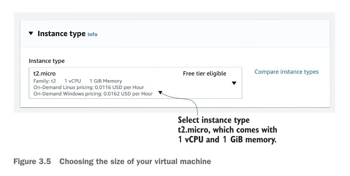
</div>

* **Family (`t`):** Batata hai ke yeh burstable family hai.
* **Generation (`2`):** Batata hai ke yeh is family ki doosri nasal (generation) hai. (2026 mein hamare paas `t3` aur `t4g` generations standard hain).
* **Size (`micro`):** Batata hai ke yeh is family ka bohot hi chota aur sasta variant hai.

Select **t2.micro** (ya agar aap ke region mein t3.micro available hai aur free tier mein hai to wo) kyunke yeh **Free Tier eligible** hai (is mein 1 vCPU aur 1 GiB RAM milti hai).

---

### Graviton Processors (The Future of AWS Chips)

Aap ne Apple ke M1/M2/M3 chips (ARM architecture) ke bare mein suna hoga jo laptop ko bina garam kiye behtareen speed aur lambi battery life dete hain. AWS ne bilkul isi tarah servers ke liye apna custom ARM chip banaya hai jise **Graviton** kehte hain.

* **Faida:** Kam kharche mein Intel/AMD se behtar performance milti hai.
* **Shart:** Aap ka software **ARM64 architecture** ke liye compile hona chahiye (jo ke Linux par ab bohot hi asaan hai).
* **2026 Graviton Options:** 2026 mein **Graviton 4 (C8g/M8g/R8g)** tak ke processors aa chuke hain! Lekin seekhne ke liye aap niche diye gaye types ko explore kar sakte hain:
* **T4g:** Intehai sasti aur burstable machines.
* **M6g/M7g:** General-purpose.
* **C6g/C7g:** Compute-optimized.
* **R6g/R7g:** Memory-optimized.


---

### CONFIGURING THE KEY PAIR FOR LOGIN

Purane zamane mein jab bhi kisi Linux machine par login karna hota tha, to hum password ya phir ek **SSH Key Pair (Public/Private Key)** use karte the.

**Figure 3.6** ke mutabaq AWS wizard bhi aap se poochega ke aap kaunsa Key Pair use karna chahte hain.

<div align="center">
  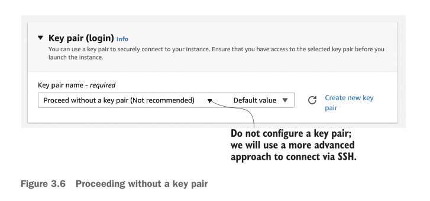
</div>

### Hum Key Pair Kyun Use Nahi Kar Rahte? (The Trade-Off)

Writer yahan ek bohot hi kamal ka architectural design decision bata raha hai. Hum is wizard mein **Key Pair configure nahi karenge** aur **"Proceed without a key pair"** select karenge.

**Kyun?**

1. **Single User Limit:** SSH key aam tor par ek hi user ke liye banti hai. Agar poori DevOps team ne login karna ho, to ek hi key sab ko share karni paregi jo ke security ka bera-ghark kar deti hai.
2. **Hard to Change:** Agar VM launch ho jaye, to bahar se uski SSH key badalna intehai mushkil kaam hai. Agar aap se key kho gayi, to machine hamesha ke liye lock ho sakti hai.

**Behtar Rasta (2026 Standard):**
Hum aage chal kar AWS ka modern tareeqa seekhenge (jaise **AWS Systems Manager Session Manager** ya **EC2 Instance Connect**). Is tareeqe mein humein kisi key file (`.pem` ya `.ppk`) ki zaroorat nahi hoti, aur hum direct browser ke zariye secure tareeqe se login kar lete hain. Is liye abhi ke liye be-fakar ho kar dropdown se **"Proceed without a key pair (Not recommended)"** select kar lein.

## DEFINING NETWORK AND FIREWALL SETTINGS

Ab hum apni virtual machine ke liye rasta aur deewar (Network aur Firewall) tayar karne lage hain. AWS par network ko hum **VPC (Virtual Private Cloud)** kehte hain aur firewall ko **Security Group** kehte hain.

### Security Group aur Firewall Kya Hai? (Bacho Wali Example)

Iski misal aise samajhein ke aap ne ek naya ghar (EC2 Instance) banaya hai. Is ghar ke bahar ek chowkidar (Security Group/Firewall) betha hai.

* Chowkidar ke paas ek register (Inbound Rules) hai.
* Agar aap register mein likh dein ke *"Ali ko andar aane do (Allow SSH/Port 22)"*, to chowkidar Ali ko andar jaane dega.
* Lekin agar register bilkul khali hai, to chowkidar kisi ko bhi ghar ke andar qadam nahi rakhne dega.

Book ke mutabaq, default settings bilkul theek hain, lekin humein ek ahem tabdeeli karni hai: **"Allow SSH Traffic" ke option ko uncheck (deselect) kar dena hai.**

### Is Architectural Decision Ka Trade-Off:

Pehle zamane mein log SSH chalane ke liye port 22 ko internet par khol dete the. Iska nuqsan yeh hota tha ke poori duniya ke hackers aap ke server ke bahar khare ho kar bar bar galat passwords ya keys try karte rehte the (jise brute-force attack kehte hain).

**Figure 3.7** ke mutabaq, jab hum "Allow SSH traffic" ko deselect kar dete hain:

<div align="center">
  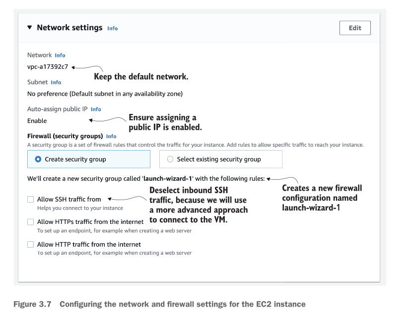
</div>

* **No Inbound Traffic:** Hamare chowkidar (Firewall) ke register mein koi rule nahi hoga. Iska matlab hai ke bahar se koi bhi hamari machine se connect nahi ho sakega.
* **Maximum Security:** Port 22 mukammal tor par band hogi, jis se hackers hamari VM par attack nahi kar sakenge.
* **The Question:** Agar sab raste band hain, to hum khud kaise connect honge? Iska jawab hum aage **Systems Manager (SSM)** ke zariye seekhenge, jo bina koi port khole humein andar jaane deta hai!

#### Figure 3.7 Ka Breakdown:

* **Network & Subnet:** Is mein default settings ko hi rehne diya gaya hai (`vpc-a17392c7`).
* **Auto-assign public IP:** Isay **Enable** rakhna hai taake machine ko internet par ek pehchan mil sake.
* **Firewall (security groups):** Wizard ek naya security group banayega jiska naam `launch-wizard-1` hoga, jis mein hum ne SSH, HTTP aur HTTPS ke tamam boxes ko khali (unchecked) chora hai taake koi incoming traffic allow na ho.

---

## ATTACHING STORAGE

Ab baari aati hai machine ke dimaag aur storage ki, jahan hamara Operating System aur zaroori files save hongi. Isay hum **Root Volume** kehte hain.

### Root Volume Kya Hai? (ELI5)

Yeh bilkul aap ke laptop ki **C: Drive** ki tarah hai. Jab bhi computer on hota hai, wo isi drive se windows ya linux ko chala raha hota hai. AWS par is hard disk/SSD ko **EBS (Elastic Block Store)** kaha jata hai, jo network ke zariye hamari machine se jura hota hai.

**Figure 3.8** ke mutabaq, default settings mein humein **8 GiB** size aur **gp2** volume type milta hai.

<div align="center">
  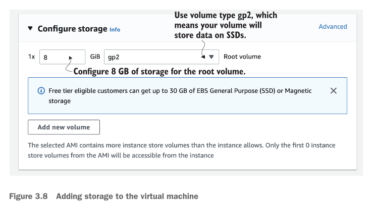
</div>

#### 2026 Modern AWS Standard Update:

* **Book Standard (gp2):** Book mein **gp2 (General Purpose 2)** volume type select karne ka kaha gaya hai.
* **2026 Industry Standard (gp3):** Aaj ke dor (2026) mein AWS par **gp3** default aur standard ban chuka hai. Hum aap ko highly recommend karenge ke aap **gp3** select karein.
* **Kyun?** gp3 volumes **gp2 se 20% sasti** hain. Is ke sath sath, gp2 mein speed (IOPS) is baat par depend karti thi ke aap ki disk kitni badi hai (choti disk = kam speed). Lekin gp3 mein aap ko choti se choti disk par bhi bina kisi extra charge ke **3000 IOPS** ki behtareen speed milti hai.


* **Free Tier Note:** AWS Free Tier ke andar aap ko har mahine **30 GB** tak ki EBS storage muft milti hai, is liye 8 GB volume bilkul free chalega.

---

## SETTING ADVANCED DETAILS

Ab hum setup ke aakhri aur nihayat hi ahem hisse par pahuche hain jise **Advanced details** kehte hain. Yahan hum ne ek cheez set karni hai jise **IAM Role** kaha jata hai.

### IAM Role Kya Hota Hai? (Bacho Wali Example)

Imagine karein ke AWS ek bohot bada secure campus hai. Aap ki EC2 machine us campus mein ek worker hai.

* Agar is worker ne campus ke doosre departments (jaise Systems Manager) mein ja kar koi file lani hai ya baat karni hai, to usay ek identity card ya badge chahiye hoga.
* **IAM Role** bilkul wahi security badge hai jo hum is machine ko pehna dete hain.
* Jab machine ke paas yeh badge hota hai, to AWS ki doosri services khud-ba-khud samajh jati hain ke is machine ko aane ki ijazat hai, aur humein machine ke andar koi password ya secret key rakhne ki zaroori nahi parti.

Humein yeh IAM role is liye chahiye taake **Systems Manager (SSM)** hamari virtual machine ke sath bina kisi open port ya key pair ke ek secure connection (SSH) bana sake.

---

## CREATING IAM ROLE

Chunke hamare paas pehle se koi role nahi bana hua, is liye hum ek naya browser tab khol kar **IAM Console** par jayenge aur niche diye gaye steps ke mutabaq role banayenge:

<div align="center">
  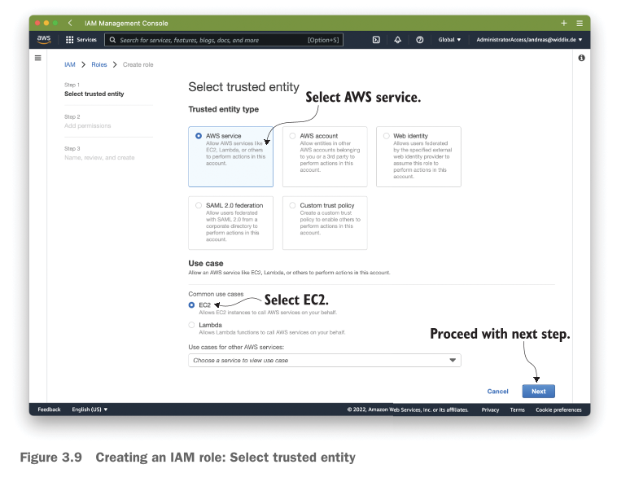
</div>

### Step-by-Step Role Creation:

1. **Open IAM Dashboard:** Browser mein `[https://console.aws.amazon.com/iam/](https://console.aws.amazon.com/iam/)` par jayein.
2. **Go to Roles:** Left side par navigation menu se **Roles** par click karein aur phir **Create role** ka button dabayein.
3. **Select Trusted Entity (Figure 3.9):**
* **AWS service** ko select karein (kyunke hum AWS ki service yani EC2 ko yeh permission de rahe hain).
* **Use case** dropdown se **EC2** ko select karein (Figure 3.9 ke mutabaq). Iska matlab hai ke yeh badge sirf EC2 instances hi pehan sakte hain. Phir **Next** par click karein.


4. **Add Permissions (Figure 3.10):**

<div align="center">
  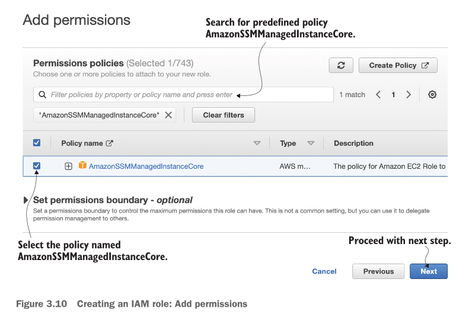
</div>

* Search bar mein filter karein: `AmazonSSMManagedInstanceCore`.
* Is policy ke sath bane checkbox ko tick mark karein (jaise Figure 3.10 mein dikhaya gaya hai).
* **Yeh Policy Kyun Zaroori Hai?** Is policy ke andar wo saari permissions maujood hain jo AWS Systems Manager ke Agent (SSM Agent) ko hamari machine par sahi tareeqe se chalne ke liye chahiye hoti hain. Is ke bagair hum browser se machine ko control nahi kar sakenge. Phir **Next** dabayein.


<div align="center">
  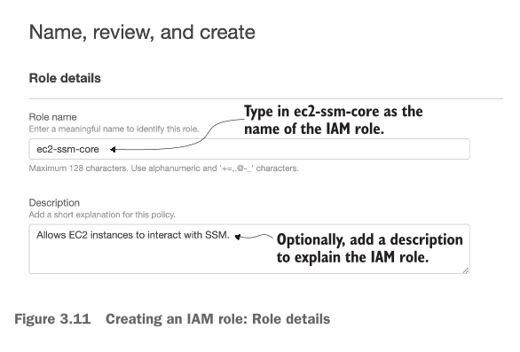
</div>

5. **Name and Create (Figure 3.11):**
* Role ka naam exactly **`ec2-ssm-core`** likhein. Isay small letters mein likhiye ga kyunke aage chal kar hum ne isi naam ko use karna hai.
* Description mein aap likh sakte hain: *"Allows EC2 instances to interact with SSM."*
* Page ke aakhir mein ja kar **Create role** button par click kar dein.


#### EC2 Tab Par Wapas Aana (Figure 3.12):

<div align="center">
  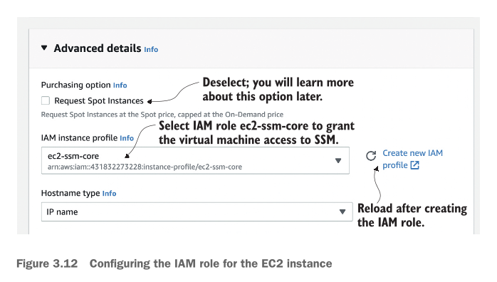
</div>

Ab wapas apne pehle wale EC2 tab par aayein jahan hum machine launch kar rahe the:

* Scroll kar ke sab se niche **Advanced details** section mein jayein.
* **IAM instance profile** ke dropdown ke barabar mein ek **Reload (refresh) button** hoga, use click karein taake naya role list mein aa jaye.
* Dropdown se **`ec2-ssm-core`** ko select kar lein (Figure 3.12).
* Baqi tamam settings ko default par hi choren (jaise Spot Instances ko unchecked chor dein).

---

## LAUNCHING THE EC2 INSTANCE

Mubarak ho! Aap ne machine ki tamam settings mukammal kar li hain. Ab aakhri rasm baqi hai.

### Figure 3.13 (The Summary Panel) Ka Breakdown:

<div align="center">
  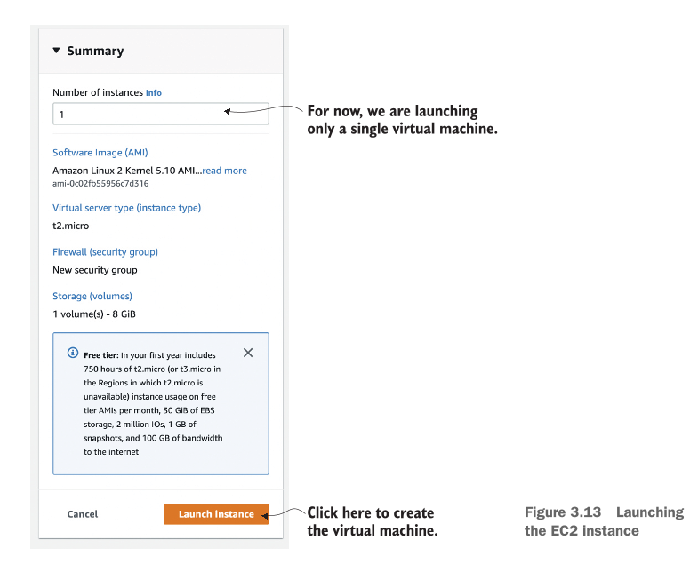
</div>

Aap ke browser ke right side par ek summary box nazar aa raha hoga, jo aap ko aap ke poore setup ka ek quick overview deta hai:

* **Number of instances:** `1` (Hum abhi sirf ek hi machine launch kar rahe hain).
* **Software Image (AMI):** `Amazon Linux 2` (Ya AL2023 modern standard ke mutabaq).
* **Virtual server type (Instance type):** `t2.micro` (Jo Free Tier ke liye eligible hai).
* **Firewall (security group):** `New security group` (Jo hum ne launch-wizard-1 ke naam se banaya hai, jis mein tamam incoming raste band hain).
* **Storage (volumes):** `1 volume(s) - 8 GiB` (Hamari SSD hard drive).

Ab bina kisi hichkichahat ke, niche diye gaye orange button **"Launch instance"** par click kar dein!

AWS background mein physical server par aap ke liye space allocate karega, OS install karega, storage attach karega, aur mushkil se 1-2 minutes mein aap ki virtual machine chalne ke liye bilkul tayar ho jayegi. Aap ne kamyabi se apna pehla cloud server launch kar diya hai!

---


## Connecting to your virtual machine

Ab jab hamari virtual machine chal rahi hai, toh us se kaam lene ke liye humein us mein **login** karna hoga. Login karne ke baad, hum apne real-world use case yani **LinkChecker** ko install aur run karenge taake broken links dhoond sakein.

Yeh exercise toh ek example hai, lekin ek baar jab aap ko virtual machine ki administrator (root) access mil jati hai, toh aap ke paas system ka poora control hota hai. Aap apni marzi ka operating system configure kar sakte hain aur koi bhi application install kar sakte hain.

### AWS Systems Manager Session Manager: Ek Bilkul Naya Tareeqa (ELI5 Explanation)

Pehle ke zamane mein server se connect karne ke liye humein ghar ka darwaza (Port 22) kholna parta tha aur ek chabi (SSH Key Pair) chahiye hoti thi. Lekin AWS Systems Manager Session Manager is se bilkul alag aur behtareen tareeqe se kaam karta hai.

Iski asaan misal **"Outbound Walkie-Talkie"** jaisi hai:

* Purane tareeqe (SSH) mein aap bahar se server ke andar ghusne ki koshish karte hain. Is ke liye server par **Port 22 (SSH)** ka khula hona zaroori hai. Agar darwaza khula hai, toh hackers bhi us par hamla kar sakte hain.
* Session Manager (SSM) mein hum server ka darwaza bahar se bilkul band rakhte hain (koi port khuli nahi hoti). Lekin server ke andar ek chota sa worker betha hota hai jise **SSM Agent** kehte hain.
* Yeh SSM Agent khud andar se AWS Systems Manager ke sath ek secure connection (tunnel) banata hai. Jab aap connect hote hain, toh aap AWS Console ke zariye us agent se baat karte hain. Darwaza andar se khulta hai, bahar se koi rasta nahi hota!

#### Session Manager Ke Faide:

* **No upfront Key Pairs:** Aap ko pehle se koi SSH `.pem` ya `.ppk` key file sambhal kar rakhne ki zaroori nahi hai. AWS temporary keys ke zariye connection handle karta hai.
* **No Inbound Ports Needed:** Aap ko Firewall (Security Group) mein Port 22 kholne ki bilkul zaroorat nahi parti. Is se aap ka attack surface (wo raste jahan se hacker hamla kar sakein) na hone ke barabar reh jata hai.

#### Session Manager Ki Sharaat (Requirements):

* **OS Support:** Yeh Amazon Linux 2, CentOS, Oracle Linux, Red Hat Enterprise Linux, SUSE Linux, macOS, aur Windows Server par kaam karta hai.
* **SSM Agent:** Yeh agent system mein install hona chahiye. Amazon Linux 2 (aur modern AL2023), macOS (>10.14), Ubuntu (>16.04), aur Windows Server par yeh pehle se install aata hai.
* **IAM Role:** Aap ke instance par wo IAM role (`ec2-ssm-core`) laga hona chahiye jo hum ne pichle step mein banaya tha.

---

### Step-by-Step Connection Guide (Figures Ka Breakdown)

Hum ne pichle section mein jo machine launch ki thi, wo in tamam sharaat ko poora karti hai. Ab us se connect karne ke liye niche diye gaye steps follow karein:

#### 1. Figure 3.14 Ka Breakdown: EC2 Dashboard Par Instance Dhoondna

<div align="center">
  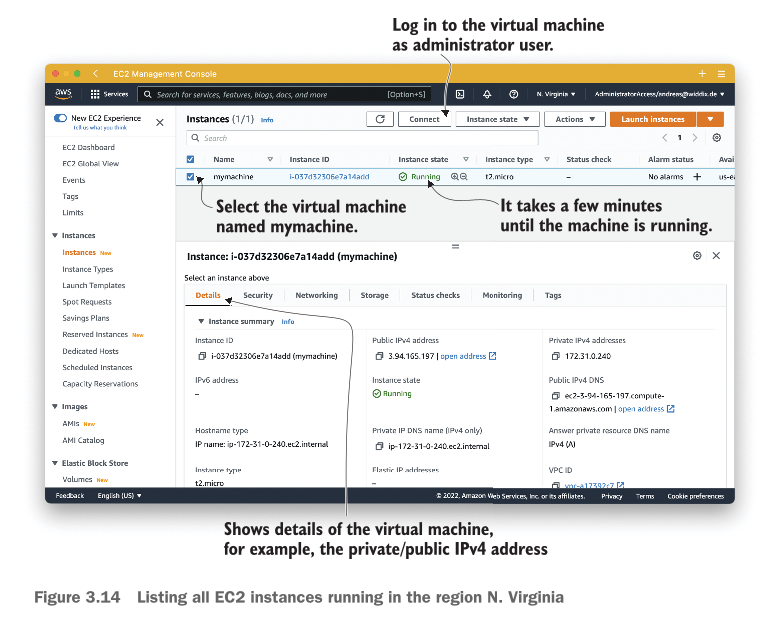
</div>

Agar aap **Figure 3.14** ko dekhein:

* EC2 dashboard ke left menu se **Instances** par click karein.
* Aap ke samne chalne wale servers ki list aa jayegi. Yahan hamari machine **"mymachine"** nazar aa rahi hogi.
* **Instance State:** Check karein ke iska status green color mein **Running** ho chuka ho (is mein 1-2 minutes lag sakte hain).
* **Details Section:** Niche details tab mein aap ko machine ki public/private IP addresses aur doosri ahem networking details nazar aayengi.
* Machine ke naam ke sath bane checkbox ko select karein aur top right corner par maujood **Connect** button par click karein.

#### 2. Figure 3.15 Ka Breakdown: Connection Method Select Karna

<div align="center">
  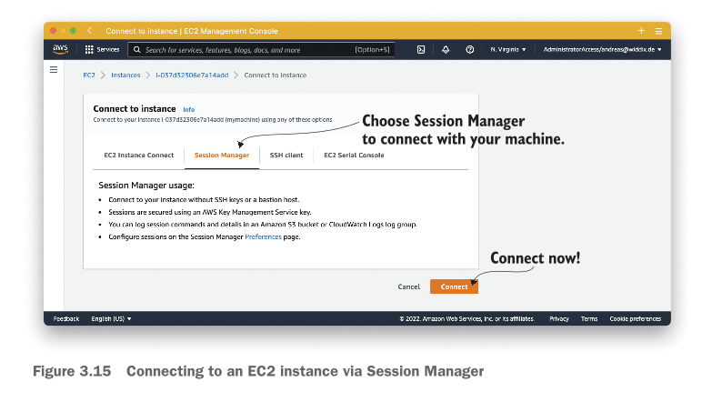
</div>

Jab aap Connect par click karenge, toh ek naya page khulega jaisa **Figure 3.15** mein dikhaya gaya hai:

* Yahan aap ko connect karne ke mukhtalif tabs nazar ayenge (EC2 Instance Connect, Session Manager, SSH client, EC2 Serial Console).
* Hum ne **Session Manager** wale tab par click karna hai.
* Niche diye gaye orange rang ke **Connect** button par click kar dein.

#### 3. Figure 3.16 Ka Breakdown: Browser Ke Andar Terminal

<div align="center">
  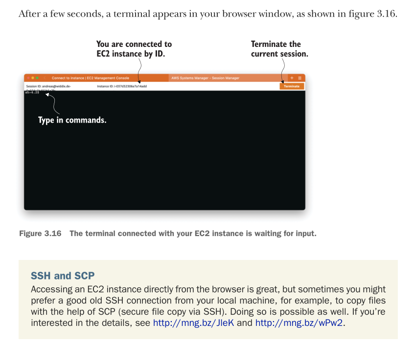
</div>

* Orange button dabane ke thode hi seconds baad, aap ke browser ke andar ek kali screen (Terminal/Shell) khul jayegi, jaisa **Figure 3.16** mein dikhaya gaya hai.
* **Admin Login:** Yeh terminal aap ko direct system ke admin (`ssm-user`) ke tor par login karwa deta hai.
* Aap screen par direct command likhna shuru kar sakte hain. Kaam khatam hone par aap top right par maujood **Terminate** button dabakar session band kar sakte hain.

---

## SSH and SCP

Browser ke zariye direct terminal access milna bohot hi shandar sahulat hai. Lekin baaz auqat, ek DevOps engineer ke tor par aap chahenge ke aap apne local computer ke terminal (jaise VS Code, Terminal, ya Putty) se direct connection banayein.

Khaas tor par tab jab aap ko **SCP (Secure Copy Protocol)** ke zariye apne local computer se koi file server par transfer karni ho ya server se koi file download karni ho.

* **SSM Tunneling (Modern Way):** 2026 ke standards ke mutabaq, aap ko SSH aur SCP chalane ke liye bhi Port 22 kholne ki zaroorat nahi hai. Aap apne local computer par **AWS CLI** aur **Session Manager Plugin** install kar ke SSM tunnel ke zariye direct SSH/SCP chala sakte hain. Yeh intehai secure aur professional tareeqa hai.

---

## Installing and running software manually

Ab hum apne asli maqsad ki taraf aate hain. Hamari virtual machine launch ho chuki hai aur hum terminal mein enter ho chuke hain. Humein **LinkChecker** tool install karna hai jise chalne ke liye **Python** environment chahiye.

> ⚠️ **Nihayat Ahem 2026 Technical Update (Amazon Linux 2 vs Amazon Linux 2023):**
> Book mein **Amazon Linux 2 (AL2)** ke commands diye gaye hain jo `amazon-linux-extras` tool use karte hain.
> Agar aap aaj ke modern standard operating system **Amazon Linux 2023 (AL2023)** par hain, toh wahan `amazon-linux-extras` ka tool khatam kar diya gaya hai. AL2023 mein package manager `yum` se upgrade ho kar `dnf` ban chuka hai aur Python 3 pehle se install aata hai ya direct standard repository se mil jata hai.
> Neeche hum ne **dono operating systems** (Book ka AL2 aur Modern AL2023) ke mutabaq codes likh diye hain taake aap ka practical kabhi fail na ho!

### Step 1: Install Python

#### Book Method (For Amazon Linux 2):

AL2 mein extra packages install karne ke liye `amazon-linux-extras` library ka use kiya jata hai. Python 3.8 install karne ke liye yeh command run karein:

```bash
sudo amazon-linux-extras install python3.8 -y
```

* **Code Explanation:**
* `sudo`: SuperUser Do (Yani administrator ki taqat se command chalana taake software install ho sake).
* `amazon-linux-extras`: Amazon ka ek tool jo curated (test shuda) software packages provide karta hai.
* `-y`: Jab installation ke doran system aap se pooche ke *"Kya aap waqai install karna chahte hain (y/n)?"*, toh yeh option usay pehle hi "Yes" bol deta hai taake process ruke nahi.


#### Modern Method (For Amazon Linux 2023 / 2026 Standard):

Agar aap modern AL2023 use kar rahe hain, toh simply standard package manager `dnf` ke zariye Python install karein:

```bash
sudo dnf install python3 -y
```

---

### Step 2: Install LinkChecker

Python install hone ke baad, hum Python ke package manager (`pip3`) ke zariye **LinkChecker** install karenge:

```bash
pip3 install linkchecker
```

* **Code Explanation:**
* `pip3`: Python ka official package manager hai jo online repository se python libraries aur tools dhoond kar download karta hai.
* `install linkchecker`: Yeh package manager ko batata hai ke "LinkChecker" naam ka tool download aur install karo.
* **Note:** Hum ne is command ke sath `sudo` use nahi kiya. Iska matlab hai ke yeh tool sirf hamare current user ke local folder (`~/.local/bin/`) mein install hoga, system-wide nahi. Yeh security ke lihaz se behtar practice hai.


---

### Step 3: Run LinkChecker to Scan a Website

Ab hamara tool bilkul tayar hai. Hum kisi bhi website ko scan kar sakte hain. Example ke tor par hum apni website par isay run karte hain:

```bash
~/.local/bin/linkchecker -r 2 https://cloudonaut.io
```

* **Code Explanation:**
* `~/.local/bin/linkchecker`: Yeh hamare local user ke bin folder mein mojood linkchecker tool ka mukammal rasta (path) hai.
* `-r 2`: Yeh recursion level hai. Iska matlab hai ke crawler website ke main page par jayega (Level 1) aur phir un pages par moojood links ke andar mazeed 1 step gehrayi tak jayega (Level 2). Agar hum recursion level set na karein, toh yeh poore internet par nikal jayega aur kabhi rukh nahi payega!
* `[https://cloudonaut.io](https://cloudonaut.io)`: Yeh target website ka URL hai jise hum check karna chahte hain. (Aap yahan apni marzi ki website ka link de sakte hain).


#### Output Ka Breakdown (Line by Line Analysis):

Jab tool run hota hai, toh terminal par is tarah ka output aata hai:

* **Error Example:**
```text
URL          `/images/2022/02/terminal.png'
Name         `Connect to your EC2 instance using SSH the modern way'
Parent URL   https://cloudonaut.io, line 379, col 1165
Real URL     https://cloudonaut.io/images/2022/02/terminal.png
Check time   2.959 seconds
Size         0B
Result       Error: 404 Not Found

10 threads active, 5 links queued, 72 links in 87 URLs checked
1 thread active, 0 links queued, 86 links in 87 URLs checked
```


* **Line 1 & 2:** Kis file/image ya text par toota hua link laga hua hai aur us ka naam kya hai.
* **Line 3 & 4:** Kis parent page par yeh link mojood hai (taake aap asani se use dhoond sakein) aur us link ka asli URL kya hai.
* **Line 7 (`Result Error: 404 Not Found`):** Sab se ahem line! Yeh batati hai ke target page internet par mojood nahi hai, yani link toota hua hai.


* **Overall Statistics (Aakhri Summary):**
```text
Statistics:
Downloaded: 66.01KB.
Content types: 26 image, 29 text, 0 video, 0 audio, 3 application, ...
URL lengths: min=21, max=160, avg=56.

That's it. 87 links in 87 URLs checked. 0 warnings found. 1 error found.
Stopped checking at 2022-04-04 09:02:55+000 (22 seconds)
```


* **Downloaded:** Tool ne total kitna data scan kiya.
* **Content types:** Scanner ko kitne images aur text pages mile.
* **Summary:** Total **87 URLs** check huay, jin mein se **0 warnings** aur **1 error** (broken link) mila. Poora process mukammal hone mein **22 seconds** lagay.


Website ke pages jitne zyada honge, crawler ko scan karne mein utna hi zyada waqt lagega. Lekin aakhir mein yeh aap ko tamam tootay hue links ki saaf list de dega taake aap unhein website par ja kar asani se theek kar sakein.

---


## Monitoring and debugging a virtual machine

Jab aap cloud par koi virtual machine (VM) chalate hain aur us par apni application run karte hain, toh hamesha sab kuch perfect nahi chalta. Kabhi koi application crash ho jati hai, toh kabhi server slow ho jata hai. Ek DevOps engineer ke tor par aap ka sab se ahem kaam yeh dhoondna hota hai ke *"Galti kahan hui?"*

Is galti (error) ko dhoondne aur system ki sehat ka andaza lagane ke liye AWS humein **Monitoring** (dekh-bhaal) aur **Debugging** (galtiyan dhoondne) ke behtareen tools deta hai. In mein se sab se asaan aur pehla tareeqa yeh hai ke hum virtual machine ke **System Logs** (diary/history) ko check karein.

---

## Showing logs from a virtual machine

Imagine karein ke aap ka computer on nahi ho raha aur screen bilkul kaali hai. Aap ko kaise pata chalega ke andar hardware ya operating system mein kya kharabi hai? Agar aap physical server par kaam kar rahe hote, toh aap monitor screen par chalne wali boot lines ko dekhte. AWS console par hum bina kisi SSH connection ke yeh sab dekh sakte hain.

### System Logs Dekhne Ka Step-by-Step Tareeqa (Figure 3.17 Reference)

<div align="center">
  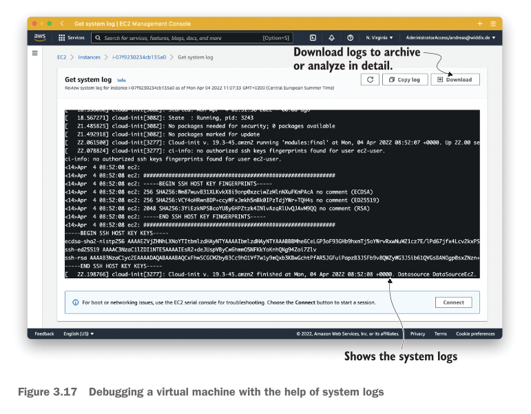
</div>

Virtual machine ke system logs dekhne ke liye niche diye gaye steps ko follow karein:

1. AWS Management Console par ja kar **EC2 Dashboard** kholin: `[https://console.aws.amazon.com/ec2/](https://console.aws.amazon.com/ec2/)`.
2. Left side par navigation options se **Instances** par click kar ke chalne wale servers ki list kholin.
3. Apni chalne wali machine par click kar ke use select karein.
4. Top right par **Actions** menu par click karein, phir **Monitor and troubleshoot** par jayein, aur wahan **Get system log** par click kar dein.
5. Aap ke samne ek screen khul jayegi jahan virtual machine ke chalne ke tamam logs nazar aayenge, bilkul waise hi jaise **Figure 3.17** mein dikhaya gaya hai.

#### Figure 3.17 Ka Detailed Breakdown (Logs Ki Explanation)

* **The Boot Output:** Figure 3.17 mein humein ek kaali screen par safaid text nazar aa raha hai. Yeh operating system ke boot hone ke messages hain (jaise `cloud-init` ka chalna, system services ka start hona, aur SSH host key fingerprints ka generate hona).
* **Copy and Download Buttons:** Is screen ke top right corner par **Copy log** aur **Download** ke buttons hote hain. Agar aap ke system mein koi bada masla aa raha hai, toh aap in logs ko download kar ke apne computer par aaram se analyze kar sakte hain ya kisi expert ko bhej sakte hain.

#### Troubleshooting Ki Real-World Strategy:

Agar operating system start hote hi kisi error par ruk jata hai, toh wo error aap ko in logs ke aakhir mein saaf nazar aa jayega.

* Agar aap ko error samajh na aaye, toh aap is operating system (AMI) ko banane wali company se raabta kar sakte hain, AWS Support ko ticket bhej sakte hain, ya phir AWS ki official community **AWS re:Post** (`[https://repost.aws](https://repost.aws)`) par apna sawal post kar sakte hain.
* **Ahem Note:** Jab aap virtual machine ko launch karte hain, toh system logs ko is console viewer mein load hone mein **kuch minutes** lagte hain, is liye sabar se kaam lena zaroori hai!

---

## Monitoring the load of a virtual machine

Logs dekhne ke baad doosra ahem sawal yeh hota hai ke: *"Kya hamari virtual machine par load bohot zyada hai? Kya CPU ya Network apni aakhri limit tak pahuch chuke hain?"*

AWS is sawaal ka jawab dene ke liye automatic metrics collect karta hai jise hum **Amazon CloudWatch** kehte hain.

### VM Ki Load Metrics Dekhne Ka Tareeqa (Figure 3.18 Reference)

<div align="center">
  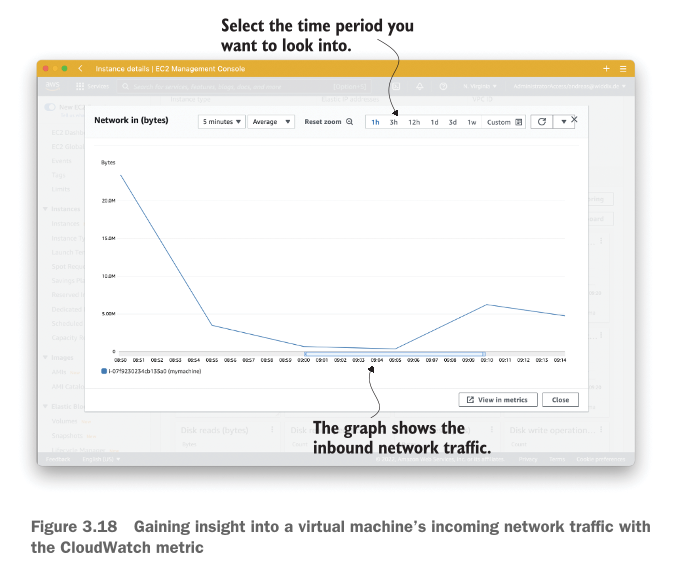
</div>

1. Apne **EC2 Console** par jayein aur **Instances** ki list kholin.
2. Apni chalne wali machine par click karein.
3. Niche diye gaye panel mein se **Monitoring** tab par click karein.
4. Yahan aap ko CPU, Network, aur Disk ke graphs nazar aayenge. **Figure 3.18** ke mutabaq, agar aap **Network in (Bytes)** wale graph par jana chahte hain, toh us ke kone mein bane teen dots (...) par click karein aur **Enlarge** (bada) kar lein.

#### Figure 3.18 Ka Grafical Breakdown (The CloudWatch Metric)

* **The Graph:** Figure 3.18 mein hum ek graph dekh rahe hain jo graph par aane wali traffic (Bytes) ko waqt ke hisab se dikha raha hai. Shuru mein jab system start hua toh network traffic ka ek bada spike (uncha graph) aaya, jo baad mein kam ho kar normal line par aa gaya.
* **Time Range Selector:** Aap graph ke upar se waqt select kar sakte hain (jaise *1h, 3h, 12h, 1d, 3d, 1w*) taake aap dekh sakein ke pichle kuch ghanton ya dino mein machine par kitna load tha.

### Sab Se Ahem Concept: Memory (RAM) Ka Missing Hona (The Outside-In Rule)

> ⚠️ **Bacho Ki Tarah Asaan Explanation (The Inspector Analogy):**
> Imagine karein ke AWS ek bahar khara inspector hai jo aap ke ghar (Virtual Machine) ko bahar se dekh raha hai.
> * Inspector dekh sakta hai ke ghar se kitna dhuan nikal raha hai (CPU Usage).
> * Inspector dekh sakta hai ke ghar ke andar kitne log ja rahe hain aur kitne bahar aa rahe hain (Network In/Out).
> * Inspector dekh sakta hai ke ghar ke bahar kitna kachra phenka ja raha hai (Disk Read/Write).
> * **Lekin:** Inspector ghar ki deewaron ke par nahi dekh sakta! Use yeh nahi pata ke ghar ke andar ke cupboards (RAM/Memory) kitne bhare hue hain.
> 
> 
> Bilkul isi tarah, kyunke hypervisor machine ko bahar se monitor karta hai, is liye AWS ke paas default mein **Memory (RAM) usage** ki koi metric nahi hoti!
> If you need RAM metrics, aap ko virtual machine ke andar ek chota sa software (CloudWatch Agent) install karna parta hai jo andar se RAM ka data collect kar ke AWS CloudWatch ko bhejta hai.

#### Basic vs. Detailed Monitoring (2026 Price & Standard Update):

* **Basic Monitoring (Default & Free):** Yeh default mein har machine par on hoti hai. Is mein aap ke graphs har **5 minutes** baad naye data ke sath update hote hain. Iska koi kharcha nahi hota.
* **Detailed Monitoring (Paid):** Agar aap ko har **1 minute** ka bariki se data chahiye (jo production systems ke liye zaroori hota hai), toh aap isay enable kar sakte hain, lekin is ke alag se paise lagte hain.

---

## Shutting down a virtual machine

AWS par chalne wali har cheez ke paise lagte hain. Agar aap ne apni virtual machine ko chala kar chor diya, toh mahine ke aakhir mein aap ko ek bada shock lag sakta hai! Is liye jab kaam khatam ho jaye, toh machine ko band karna ya mita dena sab se behtareen DevOps practice hai.

AWS par virtual machine ki life-cycle (zindagi) ko chalane ke liye 4 mukhtalif actions hote hain:

1. **Start:** Agar aap ki machine pehle se **Stopped** state mein hai, toh aap isay dobara chalane ke liye "Start" karte hain. (Nayi machine banani ho toh "Launch" karte hain).
2. **Stop (Remote control se TV band karna):**
* Jab aap machine ko stop karte hain, toh computer shutdown ho jata hai.
* **Cost Control:** Sasti parne wali state! Jab machine stop hoti hai, toh aap se CPU aur RAM ka koi paisa nahi liya jata.
* **Storage Charges:** Lekin yaad rakhein! Jo storage (EBS disk/8 GB SSD) machine ke sath juri hui hai, wo data ko safe rakhne ke liye cloud par maujood rehti hai. Is liye storage ka bohot chota sa kharcha chalta rehta hai.
* **Different Host:** Jab aap stopped machine ko dobara start karenge, toh AWS background mein use kisi doosre physical computer (different host) par chala sakta hai, lekin aap ka data hard drive mein bilkul salamat rahega.


3. **Reboot:** Computer ko restart karna. Machine usi physical host par rehti hai, data salamat rehta hai, aur system bas jaldi se band ho kar dobara on ho jata hai.
4. **Terminate (Machine ko dustbin mein phenk dena):**
* Terminate ka matlab hai machine ko hamesha ke liye delete kar dena.
* Ek baar machine terminate ho jaye, toh aap isay dobara kabhi start nahi kar sakte.
* Is ke sath attach tamam storage (EBS disks) aur public/private IP addresses bhi mita diye jate hain.
* **No more charges:** Is state mein aate hi aap ka har qism ka kharcha (CPU, RAM, aur Storage) mukammal tor par khatam ho jata hai.


### Stopping vs. Terminating Ka Flowchart (Figure 3.19 Reference)

**Figure 3.19** humein in dono states ke darmeyan sab se bada farq samajhata hai:

<div align="center">
  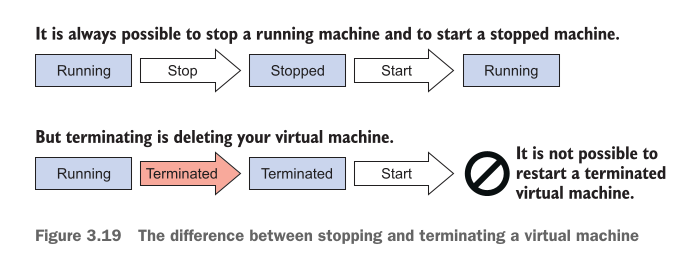
</div>

* Upay wale flowchart mein aap dekh sakte hain ke running machine ko stop kar ke dobara start karna bilkul safe aur mumkin hai.
* Niche wale flowchart mein dikhaya gaya hai ke running machine ko jab hum terminate (delete) kar dete hain, toh us par ek bada **forbid/cross symbol** lag jata hai. Yani ab yeh machine hamesha ke liye khatam ho chuki hai.

#### Real-World Examples (Kahan kya use karna hai?):

* **Scenario A (Proof of Concept):** Aap ne sirf testing ke liye ek chota sa system banaya, check kiya ke code chal raha hai ya nahi. Kaam khatam hone par aap isay **Terminate** kar dein taake bilkul kharcha na ho.
* **Scenario B (Daily Development Work):** Aap ek testing server par kaam kar rahe hain. Aap raat ko 6 baje office se ghar chale jate hain aur subah 9 baje wapas aate hain. Raat ke 15 ghante server fazool chalega. Behtareen strategy yeh hai ke shaam ko server ko **Stop** kar dein aur subah aa kar **Start** kar lein. Is se aap ki company ke bohot saare paise bachenge!
* **Scenario C (Canceled Client):** Kisi client ka contract khatam ho gaya. Aap ne un ke database ka backup le kar save kar liya, aur ab un ke servers ko **Terminate** kar ke free kar diya.

---

## Cleaning up

Hum ne is chapter ke shuru mein jo **"mymachine"** naam ka EC2 server launch kiya tha, ab hamara us par practical kaam mukammal ho chuka hai. Free tier ke paise bachane aur account ko saaf rakhne ke liye ab hum isay **Terminate** karenge.

### Step-by-Step Cleanup Process:

1. Apne browser mein **EC2 Console** par jayein: `[https://console.aws.amazon.com/ec2/](https://console.aws.amazon.com/ec2/)`.
2. Left navigation panel se **Instances** select karein taake saare servers ki list samne aa jaye.
3. Hamari machine **`mymachine`** ke row par click kar ke use select karein.
4. Top menu mein **Instance state** wale dropdown button par click karein aur wahan se **Terminate instance** select kar lein.
5. Ek warning message aayega, us par **Terminate** click kar ke confirm kar dein.

Kuch hi seconds mein machine ka status *Shutting down* aur phir *Terminated* ho jayega. Mubarak ho! Aap ne AWS EC2 par virtual machine launch karne, configure karne, run karne, debug karne, aur safely cleanup karne ka poora lifecycle behtareen tareeqe se seekh liya hai.

---

## Changing the size of a virtual machine

Cloud computing ka sab se bada aur dilchasp faida yehi hai ke aap kisi bhi waqt apni virtual machine ka size chota ya bada kar sakte hain. Is capability ko technical zaban mein **Vertical Scaling (Scale Up / Scale Down)** kehte hain.

### Vertical Scaling Kya Hoti Hai? (Bacho Wali Example)

Iski misal bilkul aisi hai ke shuru mein aap ne ek choti dukan (t2.micro) kholi kyunke aap ke paas customer kam the. Lekin jaise hi dukan par customer ka rush (workload) barh gaya, aap ne dukan ko bara kar ke ek bada mall (m5.large) bana diya taake zyada logon ko handle kiya ja sake. Cloud par hum CPU aur RAM ke sath bilkul yahi karte hain! Agar computing power kam paray toh machine bari kar do (Scale Up), aur agar kharcha bachana ho toh dukan phir choti kar do (Scale Down).

Chaliye, pehle hum ek choti virtual machine launch karte hain:

1. AWS Management Console mein **EC2 Dashboard** par jayein: `[https://console.aws.amazon.com/ec2/](https://console.aws.amazon.com/ec2/)`.
2. Orange rang ka **Launch Instances** button click karein.
3. Virtual machine ka naam **`growingup`** rakhein.
4. Operating system ke liye **Amazon Linux 2 AMI** select karein (2026 standards ke mutabaq aap modern **Amazon Linux 2023** bhi chun sakte hain).
5. Instance type mein **`t2.micro`** select karein (jo ke free tier ke liye bilkul muft hai).
6. Connection settings mein **Proceed without a Key Pair** select karein.
7. Network aur Storage settings ko default par hi choren (yani 8 GB SSD disk).
8. **Advanced Details** ke andar ja kar **IAM instance profile** ke dropdown se hamara banaya hua secure badge **`ec2-ssm-core`** select karein.
9. Sab se niche ja kar **Launch instance** par click kar dein.

Ab aap ke paas AWS ki sab se choti aur sasti virtual machines mein se ek (`t2.micro`) chal rahi hai.

---

### Machine Ki Power Ko Check Karna (Linux Commands Deep Explanation)

Aap ke DevOps engineer banne ke safar aur Linux administration ko behtareen tareeqe se seekhne ke liye system ki specifications ko check karna aana bohot zaroori hai.

Session Manager ke zariye terminal se connect karein aur niche di gayi do technical commands run karein:

#### Command 1: `cat /proc/cpuinfo`

Linux operating system mein `/proc` ek aisi virtual (pseudo) directory hoti hai jo hard disk par real space nahi leti, balkey direct Linux Kernel se system hardware ka live data utha kar dikhati hai. Is command ke zariye hum CPU ki information dekhte hain.

```bash
$ cat /proc/cpuinfo
processor   : 0
vendor_id   : GenuineIntel
cpu family  : 6
model       : 63
model name  : Intel(R) Xeon(R) CPU E5-2676 v3 @ 2.40GHz
stepping    : 2
microcode   : 0x46
cpu MHz     : 2399.915
cache size  : 30720 KB
...
```

**Output Breakdown:**

* **`processor : 0`**: Iska matlab hai hamari machine ke paas sirf **1 CPU Core** hai (Linux mein counting 0 se shuru hoti hai).
* **`vendor_id : GenuineIntel`**: Yeh processor Intel company ne banaya hai.
* **`model name : Intel(R) Xeon(R) CPU E5-2676 v3 @ 2.40GHz`**: Yeh AWS data center ke physical server ka core model aur uski speed (2.40 Gigahertz) batata hai.
* **`cpu MHz : 2399.915`**: Processor ki live running frequency/speed.

#### Command 2: `free -m`

Yeh command hamari virtual machine ki RAM (Memory) ki details Megabytes (`-m`) mein dikhati hai taake hum dekh sakein ke kitni memory khali hai aur kitni use ho rahi hai.

```bash
$ free -m
              total   used   free   shared   buff/cache   available
Mem:            965     93    379        0          492         739
Swap:             0      0      0
```

**Output Breakdown (Table of Memory):**

| Column Name | Value (MB) | ELI5 Description (Bacho ki tarah asaan) |
| --- | --- | --- |
| **total** | `965` | Machine ke paas total takreeban **1 GB** (965 MB) RAM hai. |
| **used** | `93` | Abhi is waqt system sirf 93 MB RAM use kar raha hai. |
| **free** | `379` | Bilkul khali RAM jo abhi kisi bhi kaam mein nahi hai. |
| **buff/cache** | `492` | Linux system chalte waqt files ko tezi se load karne ke liye RAM ka ek hissa temporary cache mein rakh leta hai. |
| **available** | `739` | **Sab se ahem column!** Iska matlab hai agar aap koi naya software run karenge toh usay total 739 MB RAM mil sakti hai bina system ko slow kiye. |
| **Swap** | `0` | Virtual disk memory jo RAM khatam hone par storage ko use karti hai, wo abhi disabled (0) hai. |

---

### Machine Ka Size Kaise Barhein? (The Stop/Start Design Trade-Off)

Agar aap ki application ka load barh jaye, use zyada CPU ya RAM chahiye, toh hum machine ka size barha sakte hain. Lekin yahan ek nihayat hi ahem technical asool (trade-off) yaad rakhein: **Chalti gari ka engine tabdeel nahi kiya ja sakta!**

* **The Design Decision:** AWS par jab machine chal rahi hoti hai, toh wo physical hardware ke ek specific slot ke sath bandhi hoti hai. Instance type badalne ke liye humein machine ko **Stop** karna parta hai.
* **The Trade-Off:** Is ka matlab hai ke machine ko resize karte waqt thodi der ke liye **Downtime** (system ka band hona) hoga. Lekin iska faida yeh hai ke aap ka storage database aur files (jo EBS disk par hain) mukammal tor par mehfooz rehte hain aur naye server par asani se mount ho jate hain.

Machine ko stop karne ke steps:

1. EC2 Console par jayein aur **Instances** select karein.
2. Apni machine `growingup` par click karein.
3. **Instance State** dropdown par click kar ke **Stop Instance** select karein aur tab tak wait karein jab tak status "Stopped" na ho jaye.

> ⚠️ **Cost Warning:** Machine ka size barha kar `m5.large` ya is se upar karne par AWS aap se hourly charges leta hai (yeh free tier mein nahi aati). Is liye kaam khatam hote hi isay terminate karna mat bhooliye ga!

---

### Instance Type Change Karna (Figure 3.20 Breakdown)

<div align="center">
  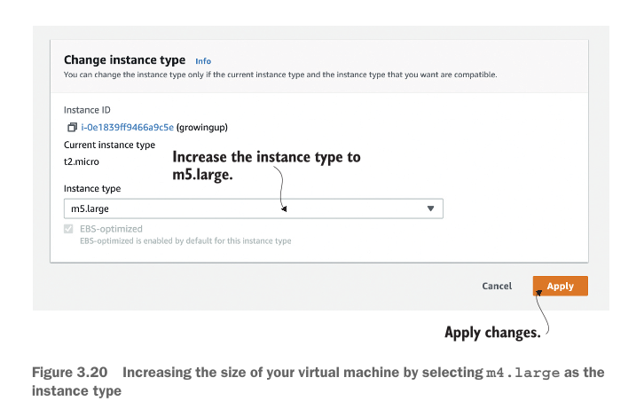
</div>

Jab machine mukammal tor par stop ho jaye, toh hum naya engine (size) choose karenge:

1. Machine select rakhin, **Actions** button par click karein, aur **Instance Settings** par jayein.
2. Wahan **Change Instance Type** par click karein.

#### Figure 3.20 Ka Console Breakdown:

* **Figure 3.20** mein humein "Change instance type" ka dialogue box nazar aa raha hai.
* Is mein hamari machine ki ID (`i-0e1839ff9466a9c5e`) aur uska current type (`t2.micro`) likha hua hai.
* Hum ne dropdown menu par click kar ke **`m5.large`** select karna hai aur orange rang ke **Apply** button par click kar dena hai.

#### 2026 Modern Standard Update:

* Book mein `m5.large` use karne ka kaha gaya hai. Lekin 2026 mein m5 family purani ho chuki hai.
* Aaj ke dor mein is se kahin sasti aur behtareen option **`m6i.large`** (Intel Based) ya **`m7i.large`** hai. Agar aap AWS Graviton (ARM processor) use karna chahein, toh aap **`m6g.large`** ya **`m7g.large`** select kar sakte hain jo ke nihayat hi tez aur cost-effective hain!

Apply karne ke baad, machine ko select karein aur **Instance State** se **Start Instance** par click kar ke on kar lein.

---

### Naye Size Ko Verify Karna

Ab jab machine bade engine ke sath on ho chuki hai, toh dobara Session Manager se terminal connect karein aur unhi dono commands ko run kar ke dekhein ke kya farq aaya hai:

```bash
$ cat /proc/cpuinfo
processor       : 0
vendor_id       : GenuineIntel
cpu family      : 6
model           : 85
model name      : Intel(R) Xeon(R) Platinum 8259CL CPU @ 2.50GHz
stepping        : 7
microcode       : 0x500320a
cpu MHz         : 3117.531
cache size      : 36608 KB
...

processor       : 1
vendor_id       : GenuineIntel
cpu family      : 6
model           : 85
model name      : Intel(R) Xeon(R) Platinum 8259CL CPU @ 2.50GHz
stepping        : 7
microcode       : 0x500320a

cpu MHz        : 3100.884
cache size     : 36608 KB
...
```

**New Output Analysis:**

* Ab aap ke terminal par ek ke badle do CPU cores ki list dikh rahi hogi: **`processor : 0`** aur **`processor : 1`**! Yani CPU power double ho chuki hai.
* Model name bhi update ho kar heavy server grade chip ban chuka hai: **`Intel(R) Xeon(R) Platinum 8259CL CPU @ 2.50GHz`**.

```bash
$ free -m
              total   used   free   shared   buff/cache   available
Mem:           7737    108   7427        0          202        7406
Swap:             0      0      0
```

**New Output Analysis:**

* **`total (7737 MB)`**: Hamari RAM ab **1 GB** se barh kar takreeban **8 GB** (7737 Megabytes) ho chuki hai!
* **`free (7427 MB)`**: System ke paas ab pehle se 20 guna zyada khali memory moojood hai. Hamari application ab bina ruke aur fast tareeqe se heavy tasks perform kar sakegi.

---

## Cleaning up

Kyunke `m5.large` (ya 2026 ke modern equivalent) instances par hourly charges lagte hain, is liye testing mukammal hone ke baad system ko mita dena hi ek behtareen DevOps rule hai taake fazool bills na banin.

1. AWS Console par **EC2 Instances** ki list mein jayein.
2. Apni machine **`growingup`** ke checkbox ko select karein.
3. Top menu mein **Instance State** par click kar ke **Terminate Instance** select karein.
4. Warning pop-up par **Terminate** daba kar confirm kar dein.

Kuch hi der mein machine completely delete ho jayegi aur aap ke billing charges foran ruk jayenge. Aap ne kamyabi se EC2 instances par vertical scaling ka poora concept step-by-step seekh liya hai!

----

## Starting a virtual machine in another data center

AWS ke paas poori duniya mein alag-alag maqamat (locations) par bohot bade-bade data centers moojood hain. Jab aap cloud par apna infrastructure (servers, databases wagera) khara karne lagte hain, toh aap ko yeh faisla karna hota hai ke aap kis **Region** (mulk ya shehar) ko chunein.

### Region Chunne Ke 4 Sunehri Asool (Bacho Ki Tarah Asaan Explanation)

Iski misal hum ek online pizza delivery shop se lete hain:

1. **Latency (Deri ya Lag):** Agar aap Lahore mein bethe hain, toh aap us pizza shop se order karenge jo aap ke ghar ke kareeb ho taake pizza garam aur jaldi pahuche. Cloud mein bhi bilkul aisa hi hota hai. Hamari virtual machine us region mein honi chahiye jo hamare users ke sab se zaroori aur kareeb ho. Agar hamare users Australia mein hain, toh Sydney region behtareen hai.
2. **Compliance (Qanoon aur Rules):** Har mulk ke apne rules hote hain. Kuch mulkon ka qanoon kehta hai ke un ke shehriyon (citizens) ka data us mulk ki boundary se bahar nahi jana chahiye. Agar aap Europe ka data process kar rahe hain, toh aap ko data Europe ke hi kisi region (jaise Frankfurt ya Ireland) mein rakhna hoga.
3. **Service Availability (Services Ki Moojoodgi):** AWS har naya feature ya service sab se pehle saare regions mein launch nahi karta. Humein check karna parta hai ke jo tool hum use karna chahte hain, kya wo us specific region mein available hai ya nahi. Is ke liye hum AWS ki region tables (`[https://awsservices.info](https://awsservices.info)`) check karte hain.
4. **Costs (Kharcha):** Alag-alag mulkon mein zameen, bijli (electricity), aur taxes ke rates alag hote hain. Is liye ek hi EC2 instance us-east-1 (N. Virginia) mein sasta ho sakta hai aur Sydney (ap-southeast-2) mein thoda mehanga. Humein budget ke mutabaq sab se cost-effective region chunna hota hai.

#### Real-World Example:

Farz karein aap ki company ke customers pehle sirf America (US) mein the, is liye aap ke saare servers **N. Virginia (us-east-1)** mein chal rahe hain. Ab aap ke paas Australia se bhi customers aane shuru ho gaye hain. Australia ke log shikayat kar rahe hain ke jab wo aap ki website kholte hain, toh page load hone mein bohot zyada time lagta hai (high latency).

Is masle ka sab se behtareen hal kya hai? Hum Australia ke logon ko khush karne ke liye un ke apne shehar **Sydney** ke data center mein ek naya server (VM) launch karenge!

#### Region Badalne Ka Tarika (Figure 3.21 Breakdown)

<div align="center">
  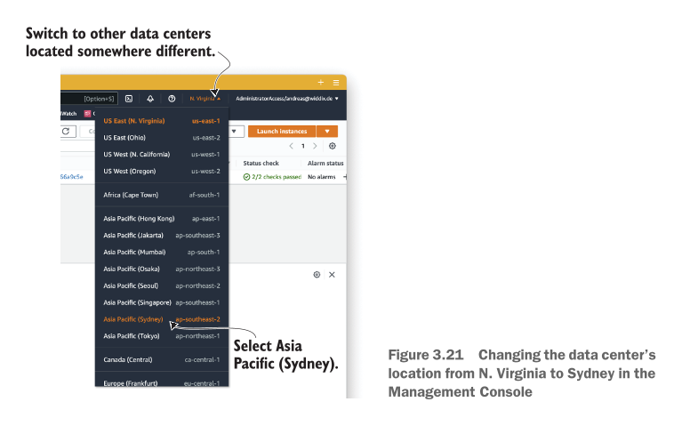
</div>

AWS Console par kam karne ka region badalna nihayat hi asaan hai:

* **Figure 3.21** ko agar aap dekhein, toh AWS Management Console ke top navigation bar mein right side par aap ko region ka naam likha nazar aayega (jaise pehle *N. Virginia* likha tha).
* Is dropdown menu par click karein. Aap ke samne poori duniya ke regions ki list aa jayegi.
* Is list mein se **Asia Pacific (Sydney) `ap-southeast-2**` par click kar dein, jaisa ke Figure 3.21 mein orange arrow ke zariye dikhaya gaya hai.
* Click karte hi aap ka dashboard Sydney region par switch ho jayega, aur ab aap jo bhi machine banayenge wo physical tor par Australia ke data center mein banegi!

---

### AWS Regions Table

Niche di gayi table mein AWS ke regions aur un ke technical codes (IDs) diye gaye hain.

| AWS Regions (Left) | AWS Regions (Right) |
| --- | --- |
| US East, N. Virginia (us-east-1) | US East, Ohio (us-east-2) |
| US West, N. California (us-west-1) | US West, Oregon (us-west-2) |
| Africa, Cape Town (af-south-1) | Asia Pacific, Hong Kong (ap-east-1) |
| Asia Pacific, Jakarta (ap-southeast-3) | Asia Pacific, Mumbai (ap-south-1) |
| Asia Pacific, Osaka (ap-northeast-3) | Asia Pacific, Seoul (ap-northeast-2) |
| Asia Pacific, Singapore (ap-southeast-1) | Asia Pacific, Sydney (ap-southeast-2) |
| Asia Pacific, Tokyo (ap-northeast-1) | Canada, Central (ca-central-1) |
| Europe, Frankfurt (eu-central-1) | Europe, Ireland (eu-west-1) |
| Europe, London (eu-west-2) | Europe, Milan (eu-south-1) |
| Europe, Paris (eu-west-3) | Europe, Stockholm (eu-north-1) |
| Middle East, Bahrain (me-south-1) | South America, São Paulo (sa-east-1) |

#### 2026 Modern AWS Regions Update:

AWS ne apne network ko mazeed barha diya hai. Aaj ke dor (2026) mein is table ke ilawa mazeed naye regions bhi moojood hain jo bohot ahem hain, jaise:

* **Middle East, UAE (me-central-1)** aur **Israel, Tel Aviv (il-central-1)**.
* **Asia Pacific, Hyderabad (ap-south-2)** aur **Melbourne (ap-southeast-4)**.
* **Europe, Zurich (eu-central-2)** aur **Spain (eu-south-2)**.

### Architectural Concept: Regional Independence & Global Services

* **Regional Independence:** AWS ke tamam regions aapas mein mukammal tor par azad (independent) hote hain. Ek region ka data khud-ba-khud doosre region mein transfer nahi hota jab tak aap khud koi cross-region replication ya transfer setup na karein.
* **Availability Zones (AZs):** Ek region aam tor par **3 ya is se zyada** physical data centers ka collection hota hai. In alag-alag data centers ko hum **Availability Zones** kehte hain. Yeh aapas mein intehai high-speed fiber cables se munsalik hote hain taake agar ek data center mein koi disaster (jaise zalzala ya aag) aa jaye, toh aap ki website bina ruke doosre data center se chalti rahe.
* **Global Services:** AWS ki kuch khas services aisi hain jo kisi ek region mein nahi hotin, balkey pure global network par bethi hoti hain. Jaise **IAM** (Identity and Access Management - jahan hum ne `ec2-ssm-core` role banaya tha), **Route 53** (DNS), aur **CloudFront** (CDN) wagera.

---

### Step-by-Step Guide to Launching the Instance in Sydney

Ab hum Sydney region ke andar apni virtual machine launch karenge:

1. Sydney region par switch karne ke baad, **EC2 Console** par jayein https://console.aws.amazon.com/ec2/
2. **Launch Instances** button par click karein.
3. Machine ka naam **`sydney`** likhein.
4. OS image mein **Amazon Linux 2 AMI** (ya modern standard ke mutabaq **Amazon Linux 2023**) choose karein.
5. Instance type mein **`t2.micro`** (ya modern equivalent **`t3.micro`**) select karein.
6. Key Pair section mein **Proceed without a Key Pair** select karein.
7. **Firewall / Network Settings (Ahem Configuration Change):**
* Is baar hum ne firewall rule mein **`Allow HTTP Traffic from the Internet`** (Port 80) wale checkbox ko tick mark (allow) karna hai.
* **Kyun?** Kyunke is baar hum is server par ek Web Server (Apache) chalane ja rahe hain. Hum chahte hain ke poori duniya se log hamari website ko browser mein open kar sakein. HTTP (Port 80) web traffic ke liye standard rasta hai. SSH (Port 22) abhi bhi mukammal tor par block rahega!


8. Storage ko default (8 GB SSD) par hi choren.
9. **Advanced Details** mein ja kar **IAM instance profile** ke dropdown se apna banaya hua role **`ec2-ssm-core`** select karein.
10. Orange button **Launch instance** par click kar dein!

Mubarak ho! Aap ki virtual machine ab Sydney ke data center mein chal rahi hai. Ab Session Manager ke zariye terminal connect karein taake hum is par Apache Web Server install kar sakein.

---

### Web Server Installation Commands (AL2 vs AL2023 - 2026 Modern Standard)

#### Step 1: Install Apache Web Server (`httpd`)

Amazon Linux par Apache web server ke software package ko **`httpd`** (HTTP Daemon) kaha jata hai.

* **Book Method (Amazon Linux 2):**
```bash
sudo yum install httpd -y
```


* **Modern Method (Amazon Linux 2023 / 2026 Standard):**
```bash
sudo dnf install httpd -y
```


* **Code Explanation:**
* `sudo`: Admin rights ke sath run karna taake software system folders mein install ho sake.
* `yum` / `dnf`: Red Hat based Linux distributions ke package managers jo internet se Apache ko download aur install karenge.
* `install httpd`: Apache web server package ko install karne ka hukum.
* `-y`: Automatic "Yes" confirm karna installation prompts ke liye.


#### Step 2: Start and Enable Apache Service

Software install karne ke baad, humein us ki background service (daemon) ko start karna hota hai aur use boot time par auto-start ke liye register karna hota hai:

```bash
sudo systemctl start httpd
sudo systemctl enable httpd
```

* **Code Explanation:**
* `systemctl`: Linux ka core system manager (Systemd) control tool hai jo services (background processes) ko manage karta hai.
* `start httpd`: Apache web server ko foran abhi isi waqt chala do.
* `enable httpd`: Is service ko "enable" kar do taake agar future mein hamara server kabhi reboot ya restart ho, toh Apache khud-ba-khud piche se on ho jaye, humein khud manally start na karna pare.


---

### Public IP Maloom Karna (IMDSv1 vs IMDSv2 - Ahem 2026 Update)

Apni website ko browser mein kholne ke liye humein apni EC2 machine ka Public IP address chahiye.

* Ek rasta toh yeh hai ke aap AWS Console par machine par click karein aur niche details se Public IP copy kar lein.
* Doosra rasta yeh hai ke aap direct Linux terminal ke andar se hi AWS ke **Instance Metadata Service (IMDS)** ko call kar ke IP address pooch lein.

AWS har EC2 machine ke andar ek special, local IP address chalata hai jise **`169.254.169.254`** kehte hain (isay Link-Local Address kaha jata hai). Is IP par request bhej kar machine khud apne bare mein details (jaise instance ID, IP, region) jaan sakti hai.

#### Book Method (IMDSv1 - Older Standard):

```bash
curl http://169.254.169.254/latest/meta-data/public-ipv4
```

> ⚠️ **Nihayat Ahem 2026 Security Update (IMDSv1 vs IMDSv2):**
> Purane IMDSv1 mein koi bhi process ya hacker (SSRF vulnerability ke zariye) bina kisi security check ke direct metadata nikal sakta tha. Is liye, **2026 ke modern standards mein AWS ne IMDSv1 ko default tor par disable kar diya hai** aur ab hamari machines par secure **IMDSv2** chal raha hota hai.
> IMDSv2 mein request bhejne ke liye pehle ek temporary **Token** lena parta hai, phir us token ko header mein bhej kar data milta hai.

#### Modern 2026 Method (IMDSv2 - Token Based Security Standard):

Modern systems par metadata se IP nikalne ke liye aap ko yeh behtareen script run karni chahiye:

```bash
# Pehle metadata token lein jo 6 ghante (21600 seconds) ke liye valid ho
TOKEN=$(curl -s -X PUT "http://169.254.169.254/latest/api/token" -H "X-aws-ec2-metadata-token-ttl-seconds: 21600")

# Ab is token ko use kar ke IP address nikalen
curl -s -H "X-aws-ec2-metadata-token: $TOKEN" http://169.254.169.254/latest/meta-data/public-ipv4

```

* **Code Explanation:**
* `curl -s -X PUT ...`: chupchap (silent mode `-s`) metadata engine par ek PUT request bhej kar secure token lena.
* `-H "X-aws-ec2-metadata-token: $TOKEN"`: Naye security rule ke mutabaq token ko envelope (header) par laga kar request bhejna taake metadata server ijazat de sake.


Yeh command aap ke samne screen par aap ka public IP address (jaise `52.54.202.9`) print kar degi.

---

### Website Ko Browser Mein Check Karna

Ab apne computer ya mobile par naya browser tab kholin aur URL bar mein likhin:

```text
http://[Aap_Ka_Public_IP]
```

*(Yad rakhin ke `http://` use karna hai, `https://` nahi, kyunke hum ne abhi tak SSL certificate install nahi kiya).*

Jaise hi aap enter karenge, aap ke samne Apache ka official **Demo/Test Welcome Page** aa jayega. Iska matlab hai ke aap ki website Sydney ke physical data center se poori duniya ke liye live chal rahi hai!

### Trade-Off Warning: The Dynamic Public IP Problem

Abhi hum ne jo Public IP use kiya hai, wo **Dynamic** hai.

* **Design Issue:** Agar aap is machine ko kisi din **Stop** karenge aur phir **Start** karenge, toh AWS isay back-end par ek naya physical host aur ek **bilkul naya, mukhtalif Public IP address** de dega.
* **Problem:** Agar aap ne kisi customer ko apna IP address diya hua hai, ya DNS mein domain name map kiya hua hai, toh un ka connection toot jayega kyunke IP badal chuka hoga.
* **Solution:** Is masle ko hal karne ke liye hum agle section mein seekhenge ke kaise hum server ke sath ek bilkul paka aur pakiza (static/fixed) IP address jod sakte hain jise AWS ki zaban mein **Elastic IP (EIP)** kehte hain.

---


## Allocating a public IP address

Abhi tak is book mein hum ne jitni bhi virtual machines launch ki hain, un ke sath ek public IP address khud-ba-khud attach ho jata tha. Lekin is mein ek bohot bada masla (trade-off) hai: **jab bhi aap machine ko stop kar ke dobara start karte hain, toh uska public IP address badal jata hai.**

Agar aap koi serious application ya website chalana chahte hain, toh badalne wala IP address bilkul kaam nahi karega. Is masle ko hal karne ke liye AWS ek service deta hai jise **Elastic IP (EIP)** kaha jata hai. Elastic IP aap ko ek **fixed (static/permanent) public IP address** allocate karne ki sahulat deta hai jo kabhi nahi badalta jab tak aap khud use delete na karein.

### Elastic IP Kyun Zaroori Hai? (Bacho Wali Example)

Imagine karein ke aap ne ek biryani ki dukan kholi hai.

* Agar aap har doosre din apni dukan ka address badal dein, toh customers aap ko dhoond dhoond kar thak jayenge aur kisi aur dukan par chale jayenge.
* **Elastic IP** bilkul us permanent address ya dukan ki tarah hai jo ek hi jagah rehti hai.
* Agar clients ka firewall sirf makhsoos IP addresses ko ijazat deta hai, ya aap DNS records (website name mapping) ko bar bar update karne ke jhanjhat se bachna chahte hain (kyunke DNS update hone mein baaz auqat ghante lag jate hain), toh Elastic IP aap ka sab se behtareen dost hai.

---

### Step-by-Step Guide to Allocate and Associate Elastic IP

Chaliye, hum ne pichle section mein Sydney region mein jo machine launch ki thi, us ke sath ek paka (static) IP address jorhte (associate) hain. Is ke liye niche diye gaye steps ko follow karein:

#### Step 1: Elastic IPs Menu Mein Jana (Figure 3.22 Breakdown)

<div align="center">
  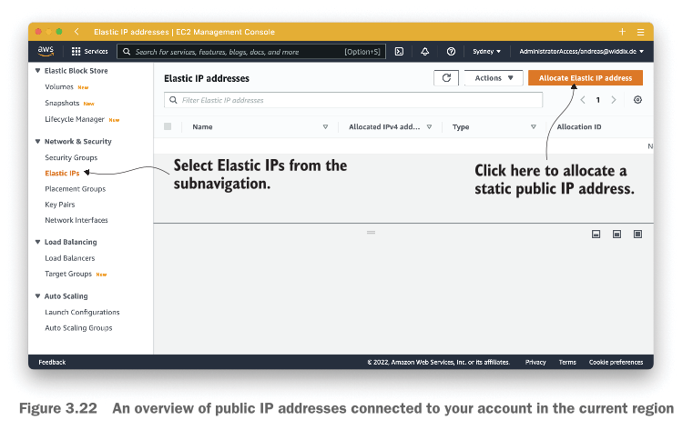
</div>

* **Figure 3.22** ke mutabaq, apne AWS Management Console mein **EC2 Dashboard** par jayein.
* Left side par scroll kar ke **Network & Security** section ke andar **Elastic IPs** par click karein.
* Yahan aap ko un tamam static IPs ki list nazar aayegi jo aap ne pehle se allocate kiye honge (abhi yeh list khali hogi).
* Naya IP address lene ke liye top right corner par moojood orange rang ke **Allocate Elastic IP address** button par click karein.

#### Step 2: Amazon Ke Pool Se IP Address Lena (Figure 3.23 Breakdown)

<div align="center">
  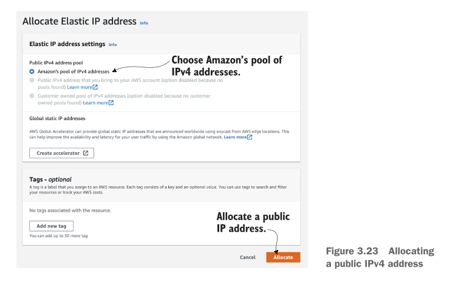
</div>

* **Figure 3.23** ke mutabaq ek naya page open hoga jahan aap se poocha jayega ke aap IP address kahan se lana chahte hain.
* Hum ne **Amazon's pool of IPv4 addresses** wale option ko select karna hai. Iska matlab hai ke AWS apne bade se IP bank (pool) mein se humein ek khali IP address nikal kar de dega.
* Niche scroll karein aur orange rang ke **Allocate** button par click kar dein.
* Click karte hi aap ke account ko ek permanent IP address (jaise `13.236.254.54`) mil jayega.

#### Step 3: IP Address Ko Virtual Machine Se Jodhna (Figure 3.24 Breakdown)

<div align="center">
  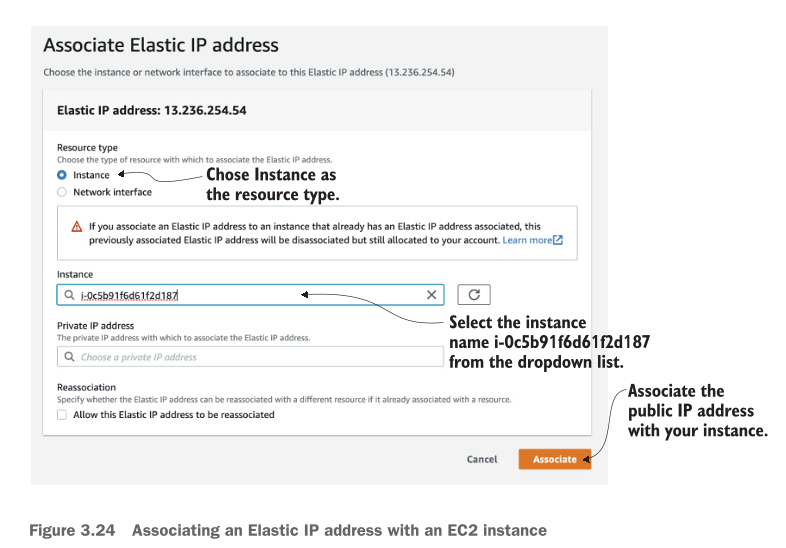
</div>

Ab hum ne is naye permanent IP ko apni Sydney wali machine se connect karna hai:

* Jo IP abhi allocate hua hai, use list mein se select (tick) karein.
* Top right par **Actions** button par click kar ke **Associate Elastic IP address** select karein.
* **Figure 3.24** ke mutabaq aap ke samne configuration page khul jayega:
* **Resource type:** Is mein **Instance** select karein (kyunke hum isay EC2 virtual machine se jorhna chahte hain).
* **Instance:** Dropdown par click karein aur apni chalne wali Sydney machine (jaise ID: `i-0c5b91f6d61f2d187` ya naam `sydney`) ko select kar lein.
* **Private IP address:** Dropdown se machine ka private IP select kar lein.
* Sab se niche moojood orange rang ke **Associate** button par click kar dein.


**Hurray!** Aap ka kaam ho gaya. Ab aap ki Sydney wali machine is naye Elastic IP address ke zariye poori duniya ke liye live ho chuki hai.

Apne browser mein naya tab kholin, is naye Elastic IP ko URL bar mein dalin, aur enter dabayein. Aap ke samne wahi Apache ka default test page khul jayega jo pichle section mein khula tha. Lekin is baar faida yeh hai ke agar aap machine ko **Stop** kar ke **Start** bhi karenge, toh yeh web page isi exact IP par chalta rahega!

---

### Zero-Downtime Server Replacement (Real-World DevOps Scenario)

Elastic IP ka sab se bada aur jaadui faida tab nazar aata hai jab humein bina kisi interruption (downtime) ke chalte hue server ko naye upgraded server se tabdeel (replace) karna ho.

Imagine karein ke aap ka **Server A** chal raha hai aur us ke sath aap ka Elastic IP jura hua hai. Ab aap ne server ke operating system ko patch/upgrade karna hai, ya naya code deploy karna hai. Agar aap isi server ko band karenge toh customers gussa ho jayenge.

```
[ Step 1 ]  Launch Server B (Naya server start karein aur setup complete karein)
             
[ Step 2 ]  Disconnect (Disassociate) Elastic IP from Server A
                                |
                                v
[ Step 3 ]  Connect (Associate) Elastic IP to Server B (Direct flow of traffic!)

```

**DevOps Style Implementation:**

1. Background mein ek naya **Server B** launch karein jo bilkul Server A jaisa ho lekin updated ho.
2. Server B ke andar apni application, dependency, aur sara code install kar ke start kar dein aur verify kar lein ke sab theek chal raha hai.
3. Ab Elastic IP Console par jayein, us IP ko Server A se **Disassociate** (alag) karein, aur foran Server B ke sath **Associate** (connect) kar dein.
4. **The Result:** Kuch hi milliseconds ke andar, poori duniya se aane wali traffic bina kisi DNS delay ke khud-ba-khud Server B ki taraf mudh (route) jayegi! Kisi bhi customer ko pata bhi nahi chalega ke piche se poora computer badal diya gaya hai.

Multiple public IPs ko ek hi VM ke sath jodhne ke liye hum multiple virtual network interfaces (**ENIs - Elastic Network Interfaces**) ka istemal karte hain, jise hum agle section mein mazeed detail se parhenge. Yeh tab kaam aata hai jab hum ek hi server par alag-alag websites ko un ke zati fixed IPs par chalana chahein.

---

### ⚠️ Ahem Warning aur 2026 ke Modern Billing Updates

Internet par IPv4 addresses ki bohot zyada kami (scarcity) ho chuki hai, isi liye AWS in ka bohot ehtiyat se istemal chahta hai.

* **Book Rule (Old Idle Charge Rule):** Pehle AWS ka rule hota تھا ke jab tak Elastic IP aap ki chalne wali machine ke sath connect hai, tab tak wo bilkul **Free** hai. Lekin agar aap ne IP allocate kar liya aur use kisi machine ke sath connect nahi kiya (yani use khali/idle chor diya), toh AWS aap se penalty ke tor par hourly charges leta tha taake log faaltu IPs jama kar ke block na karein.
* **Modern 2026 AWS Standard Rule (Nihayat Ahem Update):**
AWS ne **February 1, 2024** se apni billing policy mukammal tor par tabdeel kar di hai jo 2026 mein bhi barqarar hai. **Ab har ek public IPv4 address par charge lagta hai, chahe wo machine ke sath jura ho ya khali pada ho!**
* **Cost:** Takreeban **$0.005 per hour** (jo ke mahine ka lag bhag **$3.60 per IP** banta hai).
* **DevOps Best Practice:** Is liye, apna practical test mukammal karne ke baad Elastic IP ko sirf disassociate hi nahi karna, balkey use hamesha ke liye **Release** (delete) kar dena hai taake aap ke account par fazool charges na lagte rahein. (Hum clean-up agle section mein seekhenge).

---

## Adding an additional network interface to a virtual machine

Abhi tak hum ne seekha ke ek virtual machine (EC2) ko kaise chalate hain aur us ke sath ek pakka IP address (Elastic IP) kaise jorhte hain. Lekin kya aap ko pata hai ke aap apni virtual machine ke network cards ko bhi customize kar sakte hain?

AWS par hum ek virtual machine ke sath ek se zyada virtual network cards attach kar sakte hain. AWS ki zaban mein in network cards ko **Elastic Network Interface (ENI)** kaha jata hai.

### Elastic Network Interface (ENI) Kya Hai? (Bacho Wali Example)

Iski sab se asaan misal ek **Dual-SIM Mobile Phone** jaisi hai:

* Aap ke paas ek hi mobile phone (Virtual Machine) hai.
* Lekin aap us mein do alag-alag SIM cards (Network Interfaces) daal dete hain.
* **SIM 1 (eth0):** Aap ka personal number hai jise aap family ke liye use karte hain.
* **SIM 2 (eth1):** Aap ka business number hai jise aap customers ke liye use karte hain.
* Dono SIMs ke apne alag-alag phone numbers (IP addresses) hote hain, lekin mobile phone ek hi hota hai.

#### Multiple Network Interfaces Ke Real-World Use Cases:

1. **Legacy Clients Aur SSL/TLS Certificates (Bina SNI Ke):**
Pehle zamane mein agar aap ne ek hi server par do alag websites chalani hoti thin aur dono par SSL (HTTPS) lagana hota tha, toh har website ke liye ek alag IP address zaroori hota تھا (kyunke purane browsers Server Name Indication yani SNI support nahi karte the). Do interfaces se humein do alag IPs milte hain aur hum bina kisi security error ke dono chala sakte hain.
2. **Management Network Ko Application Network Se Alag Karna (Security Boundary):**

<div align="center">
  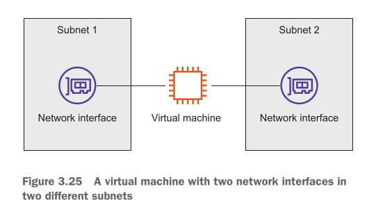
</div>

* **Figure 3.25** ko agar aap dekhein, toh yahan ek virtual machine ko do alag-alag subnets (networks) ke sath jorha gaya hai:
* **Subnet 1 (Public):** Is interface ke zariye aam internet users aap ki application ya website tak pohochty hain.
* **Subnet 2 (Private/Management):** Is dusre interface ke zariye sirf aap ke system administrators ya internal monitoring tools secure tareeqe se machine se connect hote hain. Is tarah aam users aur admin network bilkul alag rehte hain.
3. **Network and Security Appliances:**
Bohot saare security hardwares (jaise Firewalls, Load Balancers, ya Intrusion Detection Systems) ko chalne ke liye multiple network interfaces chahiye hote hain taake wo ek taraf se traffic lein (inspect karein) aur dusri taraf se aage bhejein.

---

### Step-by-Step: Creating and Attaching the 2nd Interface (Figures Breakdown)

Chaliye, ab hum practical kaam shuru karte hain aur apni Sydney wali machine ke liye ek dusra network card banate hain.

#### 1. Creating the Network Interface (Figure 3.26 Breakdown)

<div align="center">
  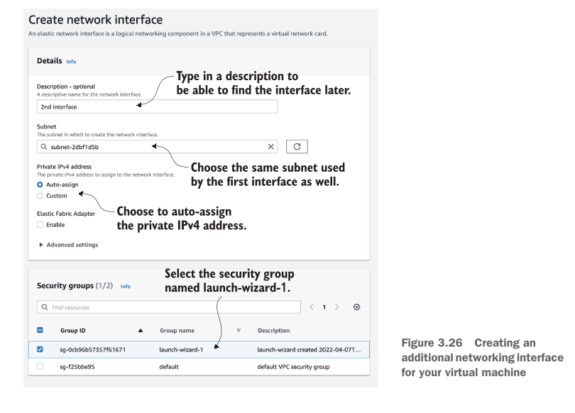
</div>

* **Figure 3.26** ke mutabaq, apne EC2 Dashboard ke left menu se **Network & Security** section mein jayein aur **Network Interfaces** par click karein.
* Top right par moojood **Create network interface** button par click karein. Aap ke samne ek form khul jayega:
* **Description:** Is mein likhin **`2nd interface`** taake aap ko baad mein pehchanna asaan ho.
* **Subnet:** Yahan aap ne wahi subnet choose karna hai jo aap ki Sydney machine ka primary interface use kar raha hai (step 2 mein jo subnet ID aap ne note ki thi).
* **Private IPv4 address:** Isay **Auto-assign** par set rehne dein taake AWS khud se ek khali private IP address chun le.
* **Security groups:** Yahan hamara banaya hua firewall **`launch-wizard-1`** select karein.
* Sab se niche ja kar **Create network interface** par click kar dein.


#### 2. Attaching the Interface to the VM (Figure 3.27 Breakdown)

<div align="center">
  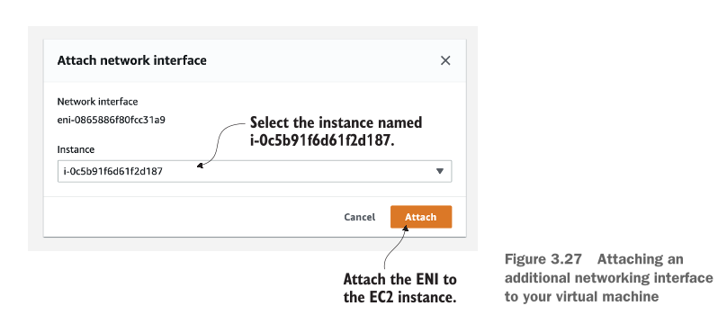
</div>

* Jab aap ka naya interface ban jaye aur uska status **Available** ho jaye, toh use select karein.
* **Actions** menu par click kar ke **Attach** select karein.
* **Figure 3.27** ke mutabaq ek chota dialog box khulega:
* Dropdown par click kar ke apni Sydney machine ki **Instance ID** (`i-0c5b91f6d61f2d187`) select karein.
* **Attach** button par click kar dein. Ab aap ki machine ke sath do network cards lag chuke hain!


---

### Associating an Elastic IP to the 2nd Interface (Figure 3.28 Breakdown)

<div align="center">
  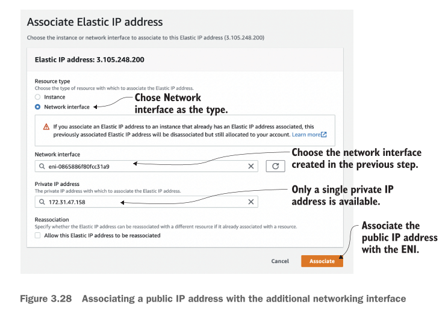
</div>

Ab hum ek naya Elastic IP address allocate karenge aur use is dusre network card (`2nd interface`) ke sath jorhein ge taake humein doosra public IP mil sake.

* Elastic IPs menu mein ja kar ek naya public IP allocate karein (jaise hum ne pichle section mein kiya tha).
* Naye allocated IP ko select karein, **Actions** par jayein, aur **Associate Elastic IP address** par click karein.
* **Figure 3.28** ke mutabaq is baar details dhyan se set karni hain:
* **Resource type:** Is baar hum ne "Instance" ke bajaye **`Network interface`** select karna hai. (Kyunke machine ke paas do interfaces hain, agar hum instance select karte toh AWS confuse ho jata ke kis card par IP lagana hai).
* **Network interface:** Dropdown se apna banaya hua **`2nd interface`** (jis ki ID `eni-...` se shuru hoti hai) select karein.
* **Private IP address:** Is interface ke sath jo private IP auto-assign hua tha, dropdown se use select kar lein.
* **Associate** button par click kar dein.


Ab aap ki single virtual machine poori duniya se **do mukhtalif Public IP addresses** ke zariye connect ho sakti hai!

---

### Analyzing Network Configuration with Commands (2026 Modern Standard)

Ab hum apni Sydney wali machine ke terminal (Session Manager) mein wapas chalte hain aur check karte hain ke kya operating system ko pata chal chuka hai ke us ke sath do network cards lag chuke hain?

#### Command: `ifconfig`

* **ifconfig** (Interface Configuration) Linux ki ek classic networking command hai jo system ke tamam network cards aur un ke IP addresses dikhati hai.

```bash
$ ifconfig
eth0: flags=4163<UP,BROADCAST,RUNNING,MULTICAST>  mtu 9001
        inet 172.31.33.219  netmask 255.255.240.0  broadcast 172.31.47.255
        inet6 fe80::495:5fff:fea6:abde  prefixlen 64  scopeid 0x20<link>
        ether 06:95:5f:a6:ab:de  txqueuelen 1000  (Ethernet)
        RX packets 68382  bytes 80442006 (76.7 MiB)
        RX errors 0  dropped 0  overruns 0  frame 0
        TX packets 35228  bytes 4219870 (4.0 MiB)
        TX errors 0  dropped 0  overruns 0  carrier 0  collisions 0

--> The primary network interface uses the private IP address 172.31.33.219.

eth1: flags=4163<UP,BROADCAST,RUNNING,MULTICAST>  mtu 9001
        inet 172.31.47.158  netmask 255.255.240.0  broadcast 172.31.47.255
        inet6 fe80::4a2:8fff:feaa:bbba  prefixlen 64  scopeid 0x20<link>
        ether 06:a2:8f:aa:bb:ba  txqueuelen 1000  (Ethernet)
        RX packets 22  bytes 1641 (1.6 KiB)
        RX errors 0  dropped 0  overruns 0  frame 0
        TX packets 33  bytes 2971 (2.9 KiB)
        TX errors 0  dropped 0  overruns 0  carrier 0  collisions 0

--> The secondary network interface uses the private IP address 172.31.47.158.
```

#### Output Breakdown:

Terminal par chalne wali command ka output humein do alag network interfaces dikha raha hai:

* **`eth0` (Primary Network Interface):**
```text
eth0: flags=4163<UP,BROADCAST,RUNNING,MULTICAST>  mtu 9001
      inet 172.31.33.219  netmask 255.255.240.0  broadcast 172.31.47.255
```


* Yeh hamari machine ka pehla/asal network card hai.
* Iska private IP address **`172.31.33.219`** hai.


* **`eth1` (Secondary Network Interface):**
```text
eth1: flags=4163<UP,BROADCAST,RUNNING,MULTICAST>  mtu 9001
      inet 172.31.47.158  netmask 255.255.240.0  broadcast 172.31.47.255
```


* Yeh hamara abhi lagaya hua dusra network card (`2nd interface`) hai.
* Iska private IP address **`172.31.47.158`** hai.


> ⚠️ **Nihayat Ahem 2026 Technical Update (`ifconfig` vs `ip a`):**
> Aaj ke modern operating systems (jaise **Amazon Linux 2023**) mein purani tool `net-tools` (jis mein `ifconfig` aata tha) default installed nahi hoti. Modern Linux system administrators ab modern **`ip`** routing utility command use karte hain.
> Hum aap ko highly recommend karenge ke aap `ifconfig` ke badle yeh modern command yaad rakhein:
> ```bash
> ip address show  # (Ya asani ke liye sirf 'ip a')
> ```
> 
> 
> Iska output bhi bilkul isi tarah `eth0` aur `eth1` ke under un ke respective private IPs (`172.31.33.219` aur `172.31.47.158`) ko saaf saaf dikhata hai.

---

### Serving Two Different Websites (Virtual Hosts Setup)

Ab ata hai sab se mazedaar architectural concept!

### Virtual Machine Ko Apne Public IP Ka Kyun Nahi Pata? (The NAT Concept)

Agar aap ne dhyan diya ho, toh `ifconfig` ya `ip a` ke output mein kahin bhi hamara **Public Elastic IP** (`13.236.254.54` ya `3.105.248.200`) likha nazar nahi aata.

* **Concept:** AWS background mein **NAT (Network Address Translation)** use karta hai. Jab bahar se koi user aap ke Public IP par aata hai, toh AWS ka internet gateway use convert kar ke automatic aap ke private IP (`eth0` ya `eth1`) par bhej deta hai.
* **Solution:** Operating system sirf private IP ko samajhta hai. Is liye agar hum ne do alag-alag websites chalani hain, toh humein Apache web server ko yeh batana hoga ke agar request `eth0` ke private IP par aaye toh **Website A** dikhao, aur agar request `eth1` ke private IP par aaye toh **Website B** dikhao!

```bash
$ sudo -s
$ mkdir /var/www/html/a
$ wget -P /var/www/html/a \
  https://raw.githubusercontent.com/AWSinAction/code3/main/chapter03/a/index.html

$ mkdir /var/www/html/b
$ wget -P /var/www/html/b \
  https://raw.githubusercontent.com/AWSinAction/code3/main/chapter03/b/index.html
```

#### Step 1: Websites Ke Liye Folders Aur Files Bananna

Sab se pehle root user banne ke liye terminal mein type karein:

```bash
sudo -s
```

*(Yeh command aap ko system ka administrator `root` bana deti hai taake aap system configuration files ko edit kar sakein).*

Ab do alag websites ke liye folders banayein aur book ke code repository se simple HTML templates (files) download karein:

```bash
# Website A setup
mkdir /var/www/html/a
wget -P /var/www/html/a https://raw.githubusercontent.com/AWSinAction/code3/main/chapter03/a/index.html

# Website B setup
mkdir /var/www/html/b
wget -P /var/www/html/b https://raw.githubusercontent.com/AWSinAction/code3/main/chapter03/b/index.html

```

* **Code Explanation:**
* `mkdir /var/www/html/a`: Apache ke web directory mein "a" naam ka naya folder banana.
* `wget -P /...`: Web se file download karne ka tool. `-P` switch batata hai ke downloaded `index.html` file ko direct kis folder ke andar save karna hai.


---

#### Step 2: Website A Ka Virtual Host Configure Karna

Hum Apache ko batayenge ke `eth0` wale private IP ko website "a" ke sath map karein. Is ke liye hum `/etc/httpd/conf.d/` folder mein ek configuration file banayein ge:

```bash
nano /etc/httpd/conf.d/a.conf
```

*(Yeh command terminal ke andar nano editor mein `a.conf` file open kar degi).*

Ab is file ke andar niche diya gaya code paste karein. **Yaad rakhin ke `172.31.x.x` ki jagah aap ne apni machine ka `eth0` wala private IP address likhna hai** (jaise hamari example mein `172.31.33.219` hai):

```apache
<VirtualHost 172.31.33.219:80>
    DocumentRoot /var/www/html/a
</VirtualHost>
```

* **Code Explanation:**
* `<VirtualHost IP:Port>`: Yeh directive Apache ko batata hai ke agar is specific IP address aur Port 80 (HTTP) par koi request aaye, toh usay handle karo.
* `DocumentRoot`: Yeh batata hai ke is website ki files kis folder (directory) ke andar pari hain.


*File ko save karne ke liye terminal par **CTRL + X** dabayein, phir **y** likhin aur **Enter** daba dein.*

---

#### Step 3: Website B Ka Virtual Host Configure Karna

Bilkul isi tarah hum `eth1` wale private IP ko website "b" ke sath map karenge:

```bash
nano /etc/httpd/conf.d/b.conf
```

Is file ke andar niche diya gaya code paste karein. **Yahan aap ne `eth1` wala private IP address likhna hai** (jaise hamari example mein `172.31.47.158` hai):

```apache
<VirtualHost 172.31.47.158:80>
    DocumentRoot /var/www/html/b
</VirtualHost>
```

*File ko save karne ke liye **CTRL + X**, phir **y** aur **Enter** dabayein.*

---

#### Step 4: Web Server Restart Aur Testing

Tamam configurations ko system mein apply karne ke liye Apache web server ko restart karna zaroori hai:

```bash
systemctl restart httpd
```

Ab test karne ka waqt aa gaya hai!

1. Apne browser mein pehla **Elastic IP** (jo `eth0` se jura hai) open karein: `http://[Elastic_IP_1]`. Aap ko screen par likha nazar aayega: **"Hello A!"**.
2. Ab browser mein dusra **Elastic IP** (jo `eth1` se jura hai) open karein: `http://[Elastic_IP_2]`. Aap ko screen par likha nazar aayega: **"Hello B!"**.

**Kamyabi!** Aap ne kamyabi se ek hi virtual machine par do mukhtalif network cards use kar ke do alag-alag websites ko un ke respective public IPs ke zariye serve kar diya hai. Yeh ek nihayat hi advance aur shandar networking setup hai.

---

> ⚠️ **Ahem Note:** Chunke hum ne Sydney region par switch kiya tha, apna kaam mukammal karne ke baad hum wapas main region **US East (N. Virginia)** par switch karenge. Is ke liye console ke top right corner se region selector par click kar ke **US East (N. Virginia)** select kar lein.

---

## Cleaning up

Kyunke hum ne is chapter mein makhsoos aur costly resources (jaise do Elastic IPs aur additional Network Interface) banaye hain, in par lagne wale faaltu charges se bachne ke liye poore setup ko mita dena hi hamari sab se behtareen safe practice hai. Niche diye gaye steps ke mutabaq cleanup mukammal karein:

1. **Terminate VM:** Sydney region mein wapas jayein, apni virtual machine `sydney` ko select kar ke **Terminate** kar dein. Jab tak machine mukammal tor par terminate (deleted) na ho jaye, tab tak wait karein.
2. **Delete 2nd Network Interface:**
* **Network Interfaces** menu mein jayein.
* Apne banaye hue **`2nd interface`** ko select karein.
* Kyunke machine delete ho chuki hai, yeh interface ab **Available** state mein hoga. Isay select kar ke **Actions** se **Delete** kar dein.


3. **Release Elastic IPs (Nihayat Ahem 2026 Billing Rule):**
* **Elastic IPs** menu mein jayein.
* Dono public IP addresses ko select karein.
* **Actions** par click karein aur **Release Elastic IP addresses** select kar ke confirm kar dein.
* *(Yaad rakhin, 2026 ke rules ke mutabaq in ko release karna sab se zaroori hai, warna in ka bill banta rahega).*


4. **Delete Security Group:** **Security Groups** menu mein jayein, `launch-wizard-1` ko select kar ke use delete kar dein.

---

## Optimizing costs for virtual machines

Cloud infrastructure ko design aur manage karte waqt cost-optimization har DevOps engineer ki pehli aur sab se ahem priority hoti hai. Muhammad Hashim, jab hum bade-scale systems par kaam karte hain, toh fazool kharche ko rokna aur budget ko customize karna hamari zimmedari hoti hai.

Chaliye ab is book ke agle hisse ko bilkul asaan, step-by-step, aur modern 2026 ke standards ke mutabaq Roman Urdu mein samajhte hain.

Aam tor par jab aap cloud par virtual machines (EC2) launch karte hain, toh aap **On-Demand Instances** ka istemal karte hain. Yeh aap ko behtareen flexibility (azadi) deti hain: aap jab chahein machine ko start karein, jab chahein stop ya terminate karein, aur aap ko sirf un seconds ya ghanton ka paisa dena hota hai jitni der machine chali hai.

### On-Demand Pricing (Bacho Wali Example)

Iski misal bilkul ek **Rental Taxi** jaisi hai. Aap taxi mein bethe, dukan tak gaye, aur utar gaye. Aap ne sirf us safar ka rent diya. Aap par koi pabandi nahi hai ke aap ne kal bhi isi taxi mein jana hai ya nahi.

Lekin agar aap ka server 24/7 chalna hai, toh rental taxi har roz chalana bohot mehanga paray ga. Is kharche ko kam karne ke liye AWS humein do behtareen options deta hai:

1. **Savings Plans** (Commitment-based discount)
2. **Spot Instances** (Spare capacity utilization)

In dono options ke darmeyan farq ko samajhne ke liye pehle hum writer ki di gayi **Table 3.2** ko asaan kar ke samajhte hain.

#### Table 3.2: Differences between on-demand instances, Savings Plans, and Spot Instances

| Category   | On-demand instances                                      | Savings Plans                                             | Spot Instances                                                |
|------------|-----------------------------------------------------------|------------------------------------------------------------|----------------------------------------------------------------|
| **Price**      | High                                                      | Medium                                                     | Low                                                            |
| **Flexibility**| High                                                      | Low                                                        | Medium                                                         |
| **Reliability**| High                                                      | High                                                       | Low                                                            |
| **Scenarios**  | Dynamic workloads (e.g., for a news site) or proof of concept | Predictable and static workloads (e.g., for a business application) | Batch workloads (e.g., for data analytics, media encoding, etc.) |

---

### Billing unit: Seconds

AWS par virtual machines ka billing system bohot hi bariki se kaam karta hai. Windows aur Linux (jaise Amazon Linux, Ubuntu, ya Red Hat) ke aksar EC2 instances ki billing **per-second** ke hisab se hoti hai.

#### Iska Core Rule (The 60-Second Rule):

* **Minimum Charge:** Har naye launch hone wale instance ka minimum charge **60 seconds** hota hai.
* **Scenario A:** Agar aap ne ek naya server launch kiya aur use sirf **30 seconds** baad hi terminate (delete) kar diya, toh aap ko poore **60 seconds** ka bill dena hoga.
* **Scenario B:** Agar aap ne server ko **61 seconds** chala kar band kiya, toh aap ko exactly **61 seconds** ka hi bill aayega, ek bhi extra second ka paisa nahi liya jayega.
* **Niche Workloads:** Kuch specific operating systems ya marketplace ke softwares abhi bhi hourly (per hour) par bill hote hain, jahan agar aap ne 5 minute bhi machine chalayi toh pure 1 ghante ka bill dena parta hai.

---

## Commit to usage, get a discount

Agar aap ko pehle se pata hai ke aap ka server agle ek ya teen saal tak lagatar chalne wala hai, toh on-demand rates dena bewakoofi hai. Aise moqay par hum **Savings Plans** khareedte hain.

### Savings Plans Kya Hain? (Bacho Wali Example)

Imagine karein ke aap roz metro train mein safar karte hain aur roz ek single ticket ($1) lete hain.

* Agar aap metro walon ke paas jayein aur kahein ke *"Mein agle 1 saal tak roz safar karunga, mein aap se commit karta hoon"*
* Toh wo aap ko ek **Monthly/Yearly Pass** bana kar de dete hain, jis se aap ki roz ki ticket ka kharcha $1 se kam ho kar sirf $0.60 reh jata hai.
* **Savings Plans** bilkul isi tarah ka commitment pass hain.

AWS humein EC2 ke liye do qism ke Savings Plans deta hai:

* **1. Compute Savings Plans (Sab se flexible):**
* Yeh discount sirf EC2 virtual machines par hi nahi lagta, balkey agar aap future mein container services (**Fargate**) ya serverless (**Lambda**) par shift ho jayein, toh wahan bhi chal jata hai.
* Yeh aap ko azadi deta hai ke aap kisi bhi waqt instance family (C family se M family) ya region (Virginia se Ireland) badal sakein.


* **2. EC2 Instance Savings Plans (Sab se zyada discount):**
* Yeh plan sirf aur sirf EC2 instances par apply hota hai (Fargate ya Lambda par nahi chalega).
* Is mein aap ko region aur instance family ko lock karna parta hai, lekin is ke badle mein aap ko Compute Savings Plan se **kahin zyada discount** milta hai.


#### Savings Plan Kaise Khareeda Jata Hai? (Writer's Example Breakdown)

Jab aap Savings Plan khareedte hain, toh aap ko yeh details set karni hoti hain:

* **Term:** Commitment ka duration (1 saal ya 3 saal).
* **Hourly commitment:** Aap har ghante kitne paise kharch karne ka wadah karte hain (e.g., $1 per hour).
* **Payment option:**
* *All Upfront:* Saare paise shuru mein hi de dein (sab se zyada discount).
* *Partial Upfront:* Adhe paise shuru mein, baqi har mahine.
* *No Upfront:* Shuru mein zero payment, bas har mahine commitment ke mutabaq bill aayega (sab se kam discount).


#### Pure Mathematical Calculation:

Chaliye writer ki mathematical example ko breakdown karte hain:

* Agar aap **$1 per hour** ka commitment karte hain **1 saal** ke liye, aur payment option select karte hain **All Upfront** (yani saare paise pehle hi de dete hain):

$$\text{Total Upfront Payment} = 24 \text{ hours} \times 365 \text{ days} \times \$1 = \$8,760.00$$


* **Compute Savings Plan ke sath:** Aap ko us-east-1 mein chalne wale `m5.large` instance par **31% discount** milega.
* **EC2 Instance Savings Plan ke sath:** Kyunke aap ne family (m5) aur region (us-east-1) ko lock kar diya hai, is liye aap ko isi machine par **42% discount** milega!

> ⚠️ **Design Warning:** Savings Plan sirf ek billing optimization tool hai. Isay khareedne se chalte hue servers par koi physical asar nahi hota aur na hi unhein restart karna parta hai. AWS ka billing engine khud-ba-khud chalne wale on-demand instances par yeh discount apply kar deta hai. Lekin yaad rakhein, agar aap ne commitment kar li, toh **paisa har haal mein dena hoga**, chahe aap ka server chal raha ho ya band pada ho!

---

## Capacity Reservations

Aksar log **Savings Plans** aur **Capacity Reservations** ko ek hi cheez samajhte hain, jo ke bilkul galat hai. In dono ke darmeyan farq ko samajhna ek DevOps engineer ke liye nihayat zaroori hai.

### Capacity Reservation Kya Hai? (Bacho Wali Example)

Imagine karein ke aap ne kisi bade VIP event mein jana hai aur aap chahte hain ke aap ki gari ke liye parking spot pehle se reserved ho:

* **Savings Plans:** Yeh parking spot ka discount coupon hai. Spot milega ya nahi, yeh iski guarantee nahi deta, bas chalne par discount deta hai.
* **Capacity Reservation:** Yeh parking slot ke upar aap ki gari ka number plate lagana hai. Wo space sirf aap ki hai. Chahe aap apni gari wahan park karein ya na karein, wo space kisi aur ko nahi di jayegi. Aur kyunke wo space reserved hai, aap ko **har ghante ka rent dena hoga**, chahe parking slot khali hi kyun na pada ho!

#### Hamein Iski Zaroorat Kyun Parti Hai? (The Infrastructure Challenge)

On-demand instances ke sath baaz auqat (rare cases mein) aisa ho jata hai ke jab aap achanak koi naya server launch karne lagte hain, toh AWS ke paas us data center mein physical hardware khali nahi hota (AWS gives "Insufficent Capacity Error").

* Yeh tab ho sakta hai jab koi rare/specialized instance type ho, ya peak hours chal rahe hon (jaise Black Friday ya FIFA World Cup match ke doran traffic spike), ya kisi bad disaster ke waqt jab hazaron customers achanak apne crash servers ko replace kar rahe hon.
* **The Solution:** Agar aap ki application aisi hai jiska har haal mein chalna zaroori hai (mission-critical), toh aap **EC2 Capacity Reservation** use karte hain. Aap AWS ko normal on-demand fee (jaise `m5.large` ke liye $0.096 per hour) dete rehte hain, aur AWS guarantee deta hai ke jab bhi aap command chalayenge, aap ki machine bina kisi delay ke foran launch ho jayegi.

---

## Taking advantage of spare compute capacity

AWS ke data centers poori duniya mein hazaron physical servers par mushtamil hain. AWS ko hamesha aane wali demand ke liye pehle se extra hardware ready rakhna hota hai. Jo hardware khali pada hota hai, usay **Spare Capacity** kehte hain.

Kyunke khali hardware se AWS ko koi kamai nahi ho rahi hoti, is liye AWS is khali space ko bohot hi saste daam par bech deta hai. In sasti virtual machines ko hum **Spot Instances** kehte hain.

### Spot Instance Kya Hai? (Standby Ticket Wali Example)

Iski misal **Standby Airplane Ticket** jaisi hai:

* Airplanes ki ticket aam tor par mehangi hoti hai. Lekin agar flight urne mein sirf 10 minutes baqi hon aur plane mein kuch seats khali hon, toh airline un khali seats ko 90% discount par bech deti hai.
* **The Catch:** Lekin agar koi full-price dene wala passenger achanak aa jaye, toh airline aap ko seat se utha degi.
* Spot instances mein bhi bilkul aisa hi hota hai. Aap ko **90% tak ka discount** mil jata hai (jaise writer ne bataya ke `m5.large` ka on-demand price $0.096/hour tha, jabke spot price sirf **$0.039/hour** tha - yani seedha 60% se zyada ki bachat!).
* **The Interruption:** Lekin jaise hi kisi on-demand user ko us hardware ki zaroorat paregi, AWS aap ki machine ko **sirf 2-minute ka notice** de kar terminate (delete) kar dega!

#### Spot Instances Kahan Istemal Hote Hain? (Stateless Workloads)

Aap sochenge ke aisi machine par kaun apna kaam chalaye jo kabhi bhi band ho sakti hai? Ek behtareen DevOps architecture hamesha **stateless aur fault-tolerant** design kiya jata hai:

* **Virus Scanning / Batch Jobs:** S3 bucket mein padi files ko scan karna. Agar server chalte chalte delete ho jaye, toh naya server aakar queue se dobara file utha kar scan kar lega (koi data loss nahi hoga).
* **Media Transcoding:** Badi video files ko convert karna. Agar job fail ho jaye, toh orchestrator use dobara restart kar deta hai.
* **Fault-Tolerant Web Apps:** Agar aap ke load balancer ke piche 10 servers chal rahe hain, aur un mein se 3 spot instances hain. Agar wo delete bhi ho jayein, toh baqi ke 7 on-demand servers website ka load sambhal lenge.
* **Test/Dev Environments:** Office testing servers jahan thodi der ke outage se koi farq nahi parta lekin kharcha bohot bach jata hai.

---

### Step-by-Step Spot Instance Launch Guide (Figures Breakdown)

Chaliye, ab hum console par ja kar apna pehla **Spot Instance** launch karte hain.

*Yaad rahe ke hum ne pichle section mein Sydney region select kiya tha, abhi ke liye hum wahi reh kar Spot Request banayenge.*

#### 1. Figure 3.29 Ka Breakdown: Spot Request Creation

<div align="center">
  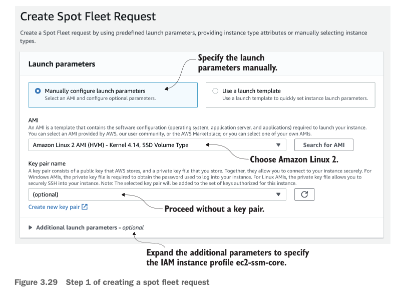
</div>

* **EC2 Dashboard** par jayein aur left menu se **Spot Requests** select karein.
* Orange button **Request Spot Instances** par click karein.
* **Figure 3.29** ke mutabaq:
* Launch parameters mein **`Manually configure launch parameters`** select karein (taake hum apni marzi ka OS aur IAM role set kar sakein).
* AMI mein **Amazon Linux 2** (ya modern standard **AL2023**) select karein.
* Key pair ko **(optional)** ya *Proceed without a key pair* par chor dein.
* *Additional launch parameters* ko expand kar ke **IAM instance profile** mein hamara badge **`ec2-ssm-core`** select karein taake hum Session Manager se connect ho sakein.


#### 2. Figure 3.30 Ka Breakdown: Target Capacity Settings

<div align="center">
  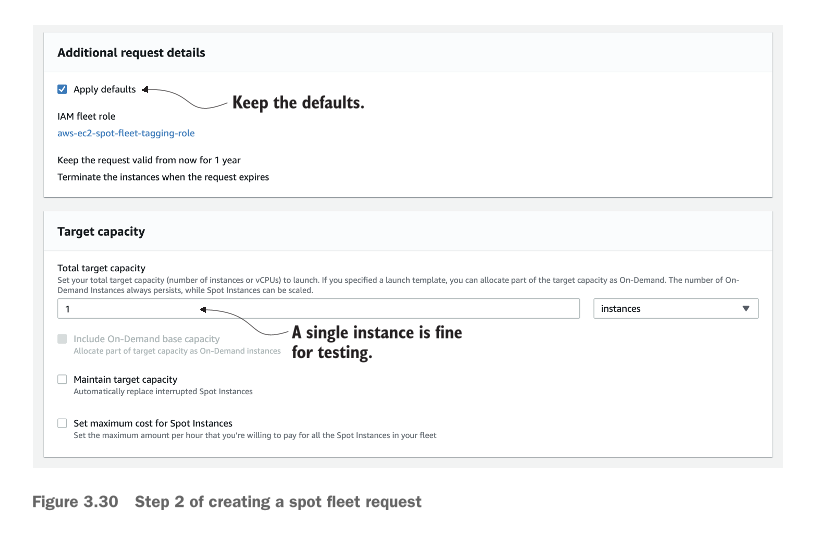
</div>

* Niche scroll kar ke **Target capacity** wale section par aayein.
* **Figure 3.30** ke mutabaq:
* **Total target capacity:** Is mein **`1`** likhin (testing ke liye humein sirf ek hi spot machine chahiye).
* Baqi options (jaise *Maintain target capacity*) ko default unchecked hi rehne dein.


#### 3. Figure 3.31 Ka Breakdown: Instance Type Selection

<div align="center">
  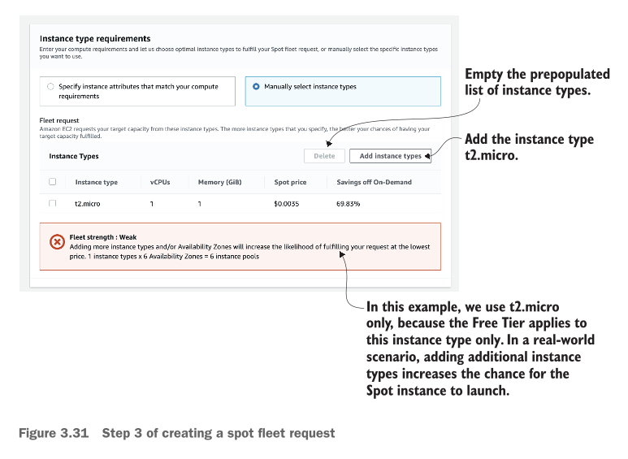
</div>

* **Figure 3.31** ke mutabaq:
* **Manually select instance types** par click karein.
* Pehle se add hue saare bade instance types ko list se select kar ke **Delete** kar dein (taake koi mehangi machine launch na ho jaye).
* **Add Instance Types** par click kar ke sirf **`t2.micro`** (ya modern standard `t3.micro`) ko select karein.


#### 4. Figure 3.32 Ka Breakdown: Allocation Strategy

<div align="center">
  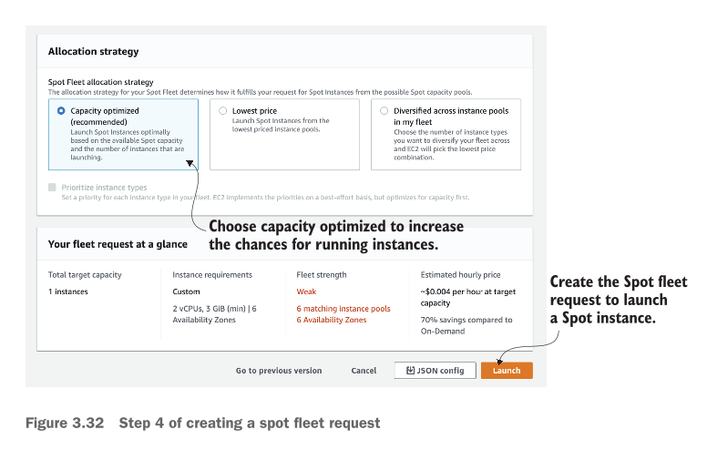
</div>

* **Figure 3.32** ke mutabaq:
* Allocation strategy mein **`Capacity optimized`** select karein.
* **Kyun?** Yeh strategy AWS ko batati hai ke *"Mujhe us hardware pool se machine do jahan sab se zyada spare capacity khali pari hai"*. Is se hamari machine ke terminate hone ke chances bohot kam ho jate hain.
* Sab se niche ja kar orange **Launch** button par click kar dein.


#### 5. Figure 3.33 Ka Breakdown: Fulfilled Spot Requests

<div align="center">
  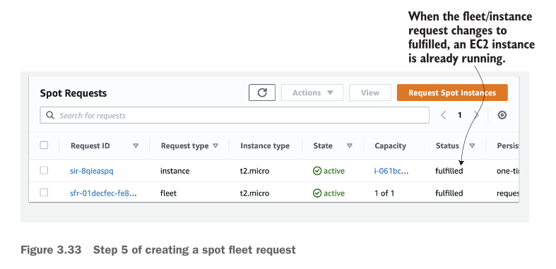
</div>

* Launch karte hi aap ke samne Spot Requests ki list aa jayegi.
* **Figure 3.33** ke mutabaq, jab aap ki request ka status **active** aur status **`fulfilled`** ho jaye, toh iska matlab hai ke AWS ne kamyabi se aap ke liye spot machine dhond kar launch kar di hai!
* Ab aap left menu se **Instances** mein ja kar apni is spot machine ko dekh sakte hain.

---

### Interruption Check Commands (IMDSv1 vs IMDSv2 - 2026 Modern Standard)

Spot instance chalte waqt, AWS hamari machine ko delete karne se exactly **2 minutes pehle** ek notification generate karta hai. Hum is notification ko machine ke andar chalne wale **Metadata Service** ke zariye monitor kar sakte hain.

#### Book Method (IMDSv1 - Older Standard):

```bash
curl http://169.254.169.254/latest/meta-data/spot/instance-action
```

> ⚠️ **Nihayat Ahem 2026 Security Update (IMDSv2 Token Standard):**
> 2026 ke modern standards mein secure IMDSv2 default chal raha hota hai. Agar aap direct purani curl command chalayenge, toh aap ko `401 Unauthorized` error mil sakta hai. IMDSv2 ke zariye spot interruption check karne ka sahi aur modern tareeqa yeh hai:

```bash
# Step 1: Secure Session Token generate karein
TOKEN=$(curl -s -X PUT "http://169.254.169.254/latest/api/token" -H "X-aws-ec2-metadata-token-ttl-seconds: 60")

# Step 2: Token use kar ke spot instance-action check karein
curl -s -H "X-aws-ec2-metadata-token: $TOKEN" http://169.254.169.254/latest/meta-data/spot/instance-action

```

#### Output Messages Ka Line-by-Line Analysis:

* **Case 1: No Interruption (Sab safe hai ✅)**
Agar is command ko chalane par aap ko **`404 - Not Found`** error milti hai, toh yeh ek bohot hi **khush-ayend (good) sign** hai! Iska matlab hai ke AWS ko abhi is hardware ki zaroorat nahi hai aur aap ki machine bilkul mehfooz tarike se chalti rahegi.
* **Case 2: Interruption Warning (Danger Zone ⚠️)**
Agar output mein niche diya gaya JSON response aata hai:
```json
{
  "action": "stop", 
  "time": "2026-07-14T12:12:00Z"
}

```


* **`"action": "stop"` (ya `"terminate"`):** Yeh batata hai ke AWS aap ke server ke sath kya karne laga hai.
* **`"time": "2026-07-14T12:12:00Z"`:** Yeh exact wo time batata hai jab server band ho jayega. Yeh warning thik **2 minutes pehle** aati hai.
* **DevOps Best Practice:** Hum is metadata URL par har 5 seconds baad ek script (cron job) chalate hain. Jaise hi warning milti hai, hamara script automatic apna saara zaroori data backup karta hai, active users ko dusre server par transfer karta hai, aur safely graceful shutdown kar leta hai.


---

## Cleaning up

Spot instances aur fleets ko completely saaf karne ka tareeqa aam instances se thoda alag hota hai, kyunke agar aap sirf instance delete karenge, toh spot fleet request piche se ek naya server dobara khara kar degi! Is liye humein pehle **Spot Request** ko cancel karna hota hai:

1. EC2 Dashboard par ja kar left side se **Spot Requests** par click karein.
2. Apni banayi hui fleet request ko select karein.
3. Top right par **Actions** button par click kar ke **Cancel request** select karein.
4. **Nihayat Ahem Step:** Khulne wale window mein **`Terminate instances`** ke checkbox ko lazmi select (tick) karein. Is se spot request cancel hone ke sath sath chalne wali virtual machine bhi khud-ba-khud delete ho jayegi.
5. **Confirm** par click kar dein.

*(Sydney region mein banaye gaye dono Elastic IPs aur doosre resources hum ne pichle section mein hi safely clean-up kar liye the).*

---

## Summary

Aap ne is teesre chapter mein cloud computing aur virtual infrastructure ki bohot saari barikiyaan seekh li hain:

* **OS Choice:** AWS par virtual machine launch karte waqt aap ke paas operating systems ki mukammal range hoti hai (Amazon Linux, Red Hat, Ubuntu, Windows).
* **Easy Resizing (Vertical Scaling):** Machine ka size (vCPU/RAM) badalna nihayat asaan hai: chalte hue server ko stop karein, instance type tabdeel karein, aur naye heavy engine ke sath start kar lein.
* **Logs & Metrics:** System debugging ke liye hum console se directly **System Logs** nikal sakte hain aur graphs dekhne ke liye **CloudWatch Metrics** ka use karte hain.
* **Global Locations:** AWS ke data centers poori duniya mein hain. Sydney ya Virginia mein server chalane ka step-by-step tareeqa bilkul ek jaisa hai.
* **Region Selection Criteria:** Hamesha data center chunte waqt network latency, legal compliance (qanooni rules), costs (qemat), aur services ki availability ko zehan mein rakhein.
* **Static Routing (Elastic IP):** Elastic IP address allocate aur associate karne se aap ka public IP address fix ho jata hai, jis se aap piche se machine ko bina IP badle change kar sakte hain.
* **Cost Optimization (Savings Plans):** Agar aap 1 ya 3 saal ke liye bare workloads chalane ka commit karte hain, toh Savings Plans ke zariye aap ko bohot bara discount milta hai.
* **Spare Capacity (Spot Instances):** AWS ke khali physical hardware pool (Spot) ka faida utha kar aap 90% tak ke saste rates par stateless aur fault-tolerant tasks chala sakte hain, bas 2-minute ke warning notice ko handle karna aana chahiye.

---
