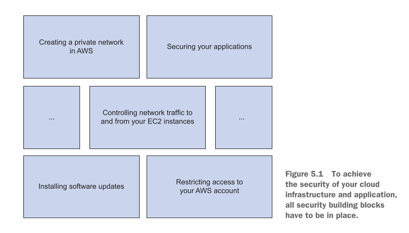
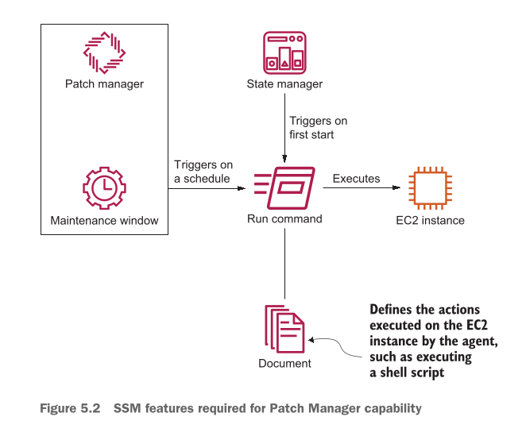
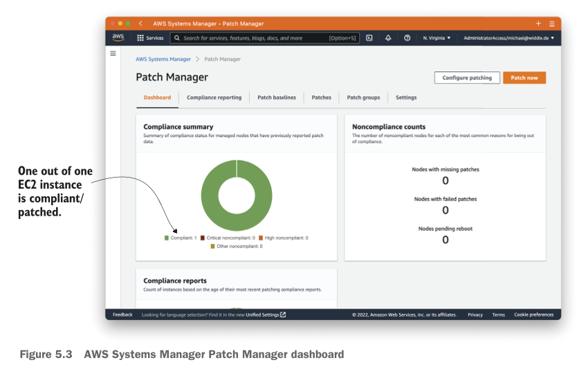
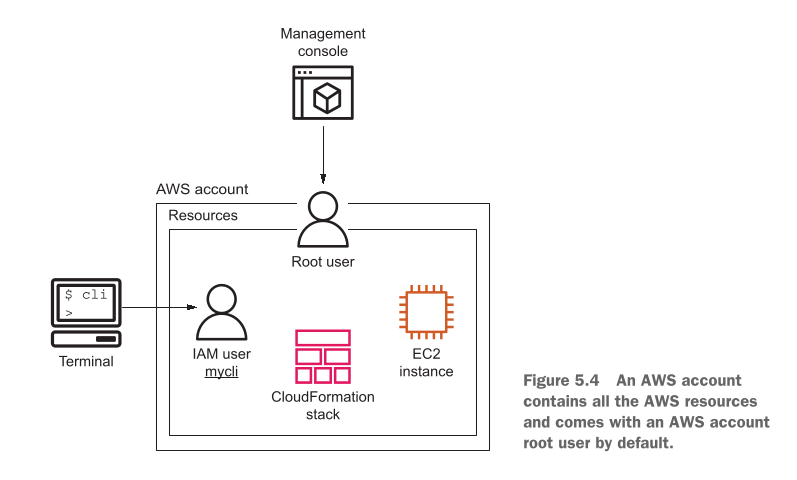
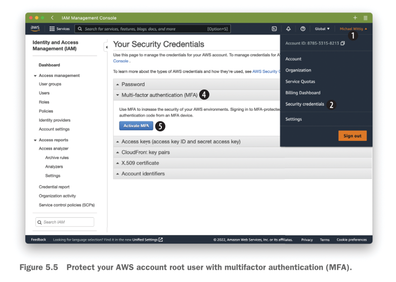
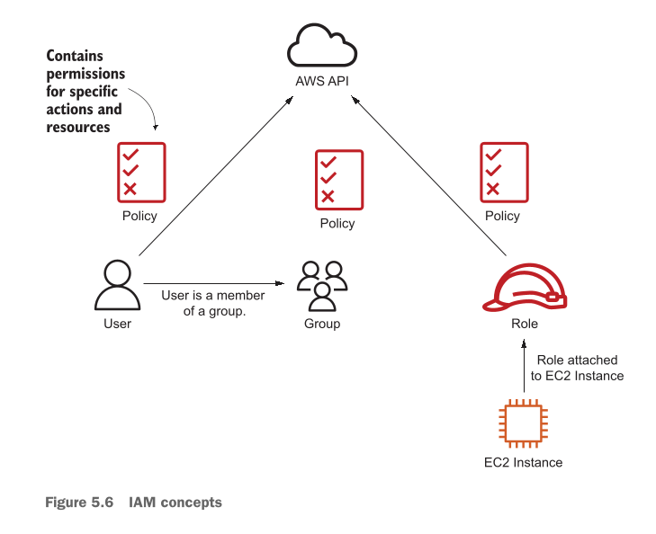
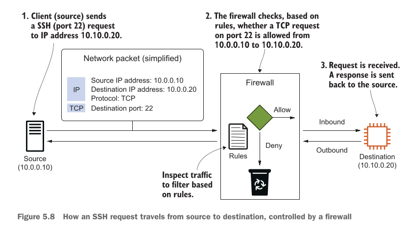
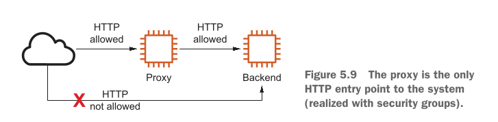
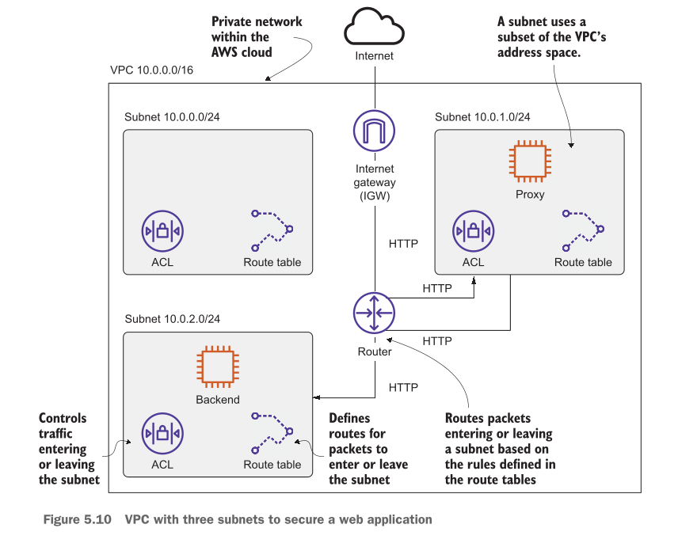
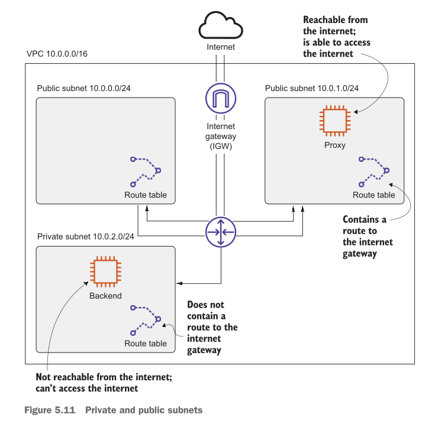

# Securing your system: IAM, security groups, and VPC

## Securing your systems on AWS

Deewar (wall) ki misaal se security ko samajhna sab se asaan hai. Agar aap ne apne ghar ki hifazat ke liye ek mazboot deewar khari karni hai, toh aapko bohot saari eenton (bricks) ki zaroorat hogi. Agar un mein se ek bhi eent kamzor hui ya apni jagah par na hui, toh chor (hackers) us kamzoori ka faida utha kar andar ghus sakte hain.

Aapko screen par di gayi image (**Figure 5.1**) mein yeh poora concept saaf nazar aa raha hoga. Chaliye pehle is figure ko break down karte hain ke writer is deewar ke zariye kya samjhana chahta hai:

<div align="center">
  
</div>

---

### Figure 5.1 Ka Breakdown: Security Ki Deewar

**Figure 5.1** ko agar aap ghaur se dekhein, toh isme security ko ek eenton ki deewar ki tarah dikhaya gaya hai:

* **Buniyadi Eentein (Bottom Layer):** Is deewar ki buniyaad mein do main cheezein hain—**"Installing software updates"** (software ko up-to-date rakhna) aur **"Restricting access to your AWS account"** (apne cloud account ki chaabi har kisi ko na dena).
* **Darmyan Wali Eentein (Middle Layer):** Beech mein sab se important brick hai **"Controlling network traffic to and from your EC2 instances"** (yeh tay karna ke kaunsa traffic aapke virtual computers ke andar aa sakta hai aur kaunsa bahar ja sakta hai).
* **Upar Wali Eentein (Top Layer):** Deewar ko mukammal karne ke liye upar **"Creating a private network in AWS"** (apna ek khusoosi khufia network banana) aur **"Securing your applications"** (apne software ko khud andar se secure rakhna) ki bricks lagayi gayi hain.

**Sabaq (Lesson):** Agar aap ne cloud infrastructure aur apni application ko bilkul safe rakhna hai, toh aapko in tamam building blocks (eenton) ko ek sath sahi jagah par fit karna hoga. Agar ek bhi brick missing hui, toh deewar nakara ho jayegi.

---

Chaliye ab is deewar ki sab se ahem char eenton (bricks) ko bilkul asaan lafzon mein samajhte hain:

### 1. Installing software updates (Software Updates Ko Install Karna)

* **Bachon Wali Example:** Jaise aapke mobile phone mein har thode din baad apps ya operating system ki update aati hai. Agar aap update nahi karenge, toh phone slow ho jata hai ya usme bugs aa jate hain jinse hacker aapka data chura sakte hain.
* **Asaan Technical Detail:** AWS par jab hum virtual servers (EC2 instances) chalate hain, toh unme chalne wale softwares (jaise Linux, Web Server, ya Databases) mein rozana nayi kamzoriyan (vulnerabilities) dhoondi jati hain. Software banane wali companies in kamzoriyon ko theek karne ke liye patches (updates) nikalti hain. Hamari sab se pehli zimmedari yeh hoti hai ke hum in updates ko bina kisi deri ke install karein. Agar hum susti karenge, toh automated hackers hamare system ko asani se apna shikar bana lenge.

### 2. Restricting access to your AWS account (AWS Account Ka Access Mehdood Karna)

* **Bachon Wali Example:** Jaise aap apne ghar ki locker ki chaabi har kisi ke hath mein nahi dete. Sirf usay dete hain jise waqti zoorat ho, aur kaam khatam hote hi chaabi wapas le lete hain.
* **Asaan Technical Detail:** Agar aap ki team mein aur bhi log (coworkers) hain ya kuch automatic scripts hain jo aapke AWS account ko chalati hain, toh sab ko full control (Administrator access) dena sab se bari be-waqufi hai. Agar kisi buggy script (galti se likhe gaye code) ya kisi ghalti se coworker ne galat command chala di, toh aapka poora infrastructure tabah ho sakta hai. Is liye hum **Least Privilege Principle** use karte hain—yani jis ko jitna kaam hai, usay sirf utni hi ijazat (permissions) di jaye.

### 3. Controlling network traffic to and from your EC2 instances (Traffic Ko Control Karna)

* **Bachon Wali Example:** Ghar ke darwaze aur khidkiyan. Agar aap ke ghar mein mehman aane hain, toh aap sirf baithak (drawing room) ka darwaza kholte hain, ghar ke saare pichle darwaze aur khidkiyan band rakhte hain taake koi chor peeche se na ghuse.
* **Asaan Technical Detail:** Jab aap cloud par koi web server chalate hain, toh bahar ki duniya (internet) ke liye sirf do darwaze khule hone chahiye:
* **Port 80:** Yeh HTTP traffic ke liye hota hai (unsecured web browsing).
* **Port 443:** Yeh HTTPS traffic ke liye hota hai (secured/encrypted browsing).
In do ports ke ilawa, internet se aane wale tamam raste (jaise Database port ya SSH port) band hone chahiye taake koi bahar ka banda direct aapke servers mein dakhil na ho sake.


### 4. Creating a private network in AWS (Private Network Banana)

* **Bachon Wali Example:** Ek aam park aur ek VIP private society. Park mein koi bhi aa ja sakta hai, lekin VIP society ke gate par security hoti hai aur har koi wahan bina ijazat nahi ja sakta.
* **Asaan Technical Detail:** AWS par hum **VPC (Virtual Private Cloud)** banate hain. Iske andar hum **Subnets** (network ke chhote hisse) aur **Routing Tables** (traffic ka rasta dikhane wale maps) define karte hain. Hum apne sensitive databases ko hamesha ek "Private Subnet" mein rakhte hain, jiska internet se direct koi rasta hi nahi hota. Agar internet se koi traffic aana bhi chahe, toh woh pehle public area mein aayega, direct private area mein nahi ghus sakta.

---

### One Important Brick is Missing: Securing Your Applications (Application Security)

Deewar toh aap ne mazboot bana di, lekin agar aapne ghar ke andar khane mein zeher mila diya, toh nuksaan andar se hi hoga.

AWS aapke network aur hardware ko toh secure kar deta hai, lekin jo **Application** (software code ya website) aap chala rahe hain, use secure rakhna aapka apna kaam hai. Writer batata hai ke is book mein application security cover nahi ki gayi, lekin aapko ye baatein lazmi follow karni chahiye:

1. **User Input Verification:** User jo bhi data website par likhe (jaise search bar mein ya login form mein), usay check karein ke usme koi kharab code ya virus toh nahi hai (SQL Injection se bachne ke liye).
2. **No Plain Text Passwords:** Passwords ko database mein seedha seedha (plain text) kabhi save nahi karna chahiye. Unhein hamesha "Hash" (encryption technique) kar ke save karein.
3. **TLS/SSL Encryption:** Apne users aur virtual machines ke darmiyan hone wali baatcheet ko encrypt karein (jaise HTTPS use karna), taake beech raste mein koi aapka data chura na sake.

---

### Not all examples are covered by Free Tier

> ⚠️ **Cost Warning (Paise Lagne Ka Khatra):**
> Is chapter mein jo hum practical kaam karenge, woh saare ke saare AWS Free Tier (muft scheme) mein cover nahi hote. Jab bhi koi aisi configuration aayegi jahan aapke paise lag sakte hain, wahan ek **Warning Message** diya jayega.

* **Design/Money Saving Decision:** Iska behtareen hal yeh hai ke jab aap koi practical seekh rahe hon, toh usay seekhne ke baad furan un resources ko **delete (clean up)** kar dein. Agar aap unhein 2-3 din se zyada chalta chorenge, toh billing start ho sakti hai. Koshish karein ke chapter ko kuch hi dinon mein mukammal kar ke account saaf kar dein.

---

### Chapter requirements

Is chapter ke concepts ko asani se hazam karne ke liye, aapko in networking ke buniyadi lafzon (terms) ka pata hona zaroori hai. Chaliye inhein bilkul 1-line mein asaan kar ke samajh lete hain:

* **Subnet:** Ek bare network ka chota sa tukra ya kamra (jaise poore ghar mein se ek bedroom).
* **Route tables:** Ek rasta dikhane wala board (road sign) jo batata hai ke network ka traffic kis taraf jayega.
* **Access control lists (ACLs):** Network ke darwaze par khara security guard jo aane aur jaane wale traffic ko rules ke mutabaq check karta hai.
* **Gateway:** Ghar ka main gate jo aapko bahar ki duniya (internet) se jorta hai.
* **Firewall:** Ek hifazati deewar jo kharab ya dangerous traffic ko rokti hai.
* **Port:** Ek specific khidki ya darwaza jo kisi khas service (jaise website ya email) ke liye khususi taur par khola jata hai.
* **Access management:** Yeh tay karna ke kis insaan ko ghar ke kis kamre mein jaane ki permission hai aur kis ki nahi.
* **Basics of the Internet Protocol (IP), including IP addresses:** Internet par chalne wali har device ka ek unique identity card number ya ghar ka pata (address), taake data sahi jagah pahunch sake.

---


## Who’s responsible for security?

Cloud mein security kisi ek bande ka kaam nahi hai. Yeh ek **Shared-Responsibility Environment** hai. Iska matlab hai ke cloud ko secure rakhne ki zimmedari AWS aur aap (customer) ke darmiyan aadhi-aadhi banti hui hai.

Isko bachon ki tarah samajhne ke liye ek **Kiraaye ke Flat (Rented Apartment)** ki misaal lete hain.

> 🏢 **Ghar Wali Misal:**
> Building ka jo maalik (Landlord yani **AWS**) hai, uski zimmedari hai ke woh building ka main gate mazboot banaye, wahan security guard bithaye, aur aag lagne se bachane ke liye fire alarms lagaye. Lekin aapke flat ke andar ka jo darwaza hai, usay tala lagana, apni tijori ki chaabi sambhal kar rakhna, aur flat ke andar kis ko aane dena hai—yeh sab aapki (**Customer**) zimmedari hai. Agar aap apne flat ka darwaza khula chor dein aur chori ho jaye, toh aap landlord ko zimmedar nahi thehra sakte.

Chaliye ab is poore concept ko detail mein step-by-step samajhte hain ke AWS kya karta hai aur aapko kya karna hoga.

---

### AWS Ki Zimmedariyan (Security "OF" the Cloud)

AWS is baat ka zimmedar hai ke jo physical infrastructure (hardware, data centers, cables) aap use kar rahe hain, woh har tarah se safe ho. AWS in char main cheezon ki hifazat karta hai:

* **Protecting the network (Network Ki Hifazat):** AWS apne network ko har waqt chalne wale automatic monitoring systems aur bohot hi heavy internet pipelines ke zariye secure rakhta hai. Iska sab se bara faida yeh hota hai ke yeh aapke systems ko **DDoS (Distributed Denial of Service) attacks** se bachata hai.
* *DDoS Kya Hai?* Farz karein aapki ek khilono ki dukan hai jahan aam log aate hain. Agar koi dushman 10,000 nakli bache aapki dukan ke samne khare kar de taake asli khareedar andar na aa sakein, toh use DDoS attack kehte hain. AWS ka automatic system in nakli logon (fake traffic) ko pehle hi rok deta hai.


* **Performing background checks on employees (Mulaazmeen Ki Janch):** Jo engineers ya staff AWS ke un ahem hisson (sensitive areas) mein kaam karte hain jahan physical servers pare hain, AWS unka mukammal criminal aur professional background check karta hai. Kisi bhi aam ya shakki bande ko un servers ke paas jaane ki ijazat nahi hoti.
* **Decommissioning storage devices (Purani Hard Drives Ko Tabah Karna):** Jab AWS ke data centers mein koi hard drive ya storage device purani ho jati hai ya kharab ho jati hai (End of Life), toh AWS use bahein phenkne ya bechne ke bajaye **physically destroy** (shredder mein daal kar ya hathoray se) tukre-tukre kar deta hai. Iska faida yeh hota hai ke koi badmaash us purani hard drive ko dhoodh kar aapka data wapas nikal nahi sakta.
* **Ensuring the physical and environmental security of data centers (Data Centers Ki Hifazat):** Jahan AWS ke hazaron servers lage hain, un buildings ki hifazat bohot sakht hoti hai. Wahan har waqt security staff maujood hota hai, biometric locks hote hain, aur agar khuda-na-khwasta aag lag jaye toh us se bachne ke liye advance **Fire Protection Systems** lage hote hain jo pani ke bajaye special gas use karte hain taake computers kharab na hon.

> 📋 **Compliance Note:** AWS ke in tamam hifazati intezamaat ko bar-bar **Third-Party Auditors** (bahar ki top companies) check karti hain aur certificate deti hain. Agar aap dekhna chahein ke AWS standard par poora utar raha hai ya nahi, toh aap har waqt unki up-to-date report is website par check kar sakte hain: [aws.amazon.com/compliance/](https://aws.amazon.com/compliance/).

---

### What are your responsibilities? See the following:

AWS ne aapko ek bilkul safe aur clean ghar bana kar de diya hai, lekin us ghar ke andar ka nizaam chalana aapki zimmedari hai. **2026** ke modern cloud dor mein aapko in panch cheezon ka khususi khayal rakhna hota hai:

* **Configuring access management using AWS IAM (Chaabiyan Aur Permission Set Karna):** Aapki sab se pehli zimmedari yeh hai ke aap **AWS IAM (Identity and Access Management)** ka sahi use karein. Iska matlab yeh hai ke agar aapke paas **S3** (data save karne ki jagah) aur **EC2** (virtual servers) hain, toh aap har bande ya script ko sirf utna hi access dein jitna uske kaam ke liye zaroori ho (**Minimum Access**). Kisi ko bhi faltu ijazat nahi honi chahiye.
* **Encrypting network traffic using HTTPS (Chitthi Ko Lock Box Mein Bhejna):** Jab aapka data internet par chal raha ho, toh aapki zimmedari hai ke aap use **Encrypt** (code word mein tabdeel) karein, jaise **HTTPS (SSL/TLS)** use karna. Agar aap aisa nahi karenge, toh internet ke raste mein betha koi bhi hacker aapka data parh sakta hai ya usme her-pher kar sakta hai.
* **Configuring a firewall with security groups and NACLs (Chowkidar Khare Karna):** Aapko apne virtual network ki hifazat ke liye firewall set karni hoti hai. AWS mein iske liye do main cheezein hoti hain:
* **Security Groups:** Yeh aapke server (EC2) ka apna personal chowkidar hota hai.
* **NACLs (Network Access Control Lists):** Yeh aapke poore sub-network (subnets) ka main gate ka chowkidar hota hai.
In dono ko sahi tarah configure karna aapka kaam hai taake sirf sahi traffic andar aa sakay aur faltu traffic bahar hi ruk jaye.


* **Encrypting data at rest (Sote Hue Data Ko Tala Lagana):** Jab aapka data database mein ya kisi storage system (jaise EBS ya S3) mein chup-chap para hua ho (At Rest), toh use bhi encrypt karna aapki zimmedari hai. Modern AWS mein aap ek click se encryption on kar sakte hain taake agar koi data chura bhi le, toh use parh na sakay.
* **Managing patches for the OS and additional software (Software Ko Update Rakhna):** AWS aapko virtual machine (EC2) bana kar de deta hai, lekin us machine ke andar jo Operating System (jaise Linux ya Windows) chal raha hai, aur jo softwares aapne khud install kiye hain, unko update (patch) rakhna aapka kaam hai. Agar unme koi security vulnerability aati hai, toh unka patch aapne khud lagana hai.

---

### Khulasa (Summary)

Security hamesha **AWS aur Aapke darmiyan ek teamwork** ka naam hai. Agar AWS apna kaam perfect kare aur aap upar diye gaye rules ke mutabaq apna kaam sahi se karein, toh aap cloud par aala tareen security (High Security Standards) haasil kar sakte hain.

Yad rakhein, agar aap ne flat ka darwaza khula chora (yani firewall ghalt set ki), toh AWS building ka guard hone ke bawajood aapko chori se nahi bacha sakega.

Agar aap is model ko mazeed gehrai se aur tasweeron ke sath samjhana chahte hain, toh aap unki is official link ko dekh sakte hain: [aws.amazon.com/compliance/shared-responsibility-model/](https://aws.amazon.com/compliance/shared-responsibility-model/).

---

## Keeping the operating system up-to-date

Duniya mein koi bhi software aisa nahi hai jisme kabhi koi kharabi ya kamzori (vulnerability) na nikle. Har hafte Linux Kernel, OpenSSL, Java, Apache, PHP, ya WordPress jise chalne wale softwares mein naye security bugs dhoonde jaate hain.

* **Bachon Wali Example:** Farz karein aapke ghar ke taale (lock) mein choron ko ek aisi kharabi ka pata chal jaye jisse koi bhi purani chaabi lagakar taala khola ja sakta hai. Ab agar taala banane wali company us kharabi ko theek karne ke liye ek naya "patch" ya pucha (fix) nikalti hai, toh aapki zimmedari hai ke aap furan use apne taale par lagayein. Agar aap der karenge, toh chor (hackers) us kharabi ka faida utha kar andar ghus jayenge.

Isliye, cloud engineering mein aapke paas ek solid aur automatic plan hona chahiye ke jaise hi koi naya security update aaye, aapke saare virtual servers (EC2 instances) furan patch (update) ho sakein.

**Amazon Linux 2** operating system jab pehli baar start hota hai, toh woh **cloud-init** ke zariye critical aur ahem security updates ko automatic install kar leta hai. Lekin baqi bache hue updates ko handle karne ke liye hamare paas teen main options hote hain:

1. **Boot ke aakhri hisse mein saare updates install karna:** Iske liye hum user-data script mein `yum -y update` command likhte hain.
2. **Boot ke waqt sirf security updates install karna:** Iske liye hum user-data script mein `yum -y --security update` chalate hain.
3. **AWS Systems Manager Patch Manager ka use karna:** Yeh sab se behtareen aur robust tareeqa hai jisme hum rules ke mutabaq patching karte hain.

Chaliye pehle shuruaati do options ke CloudFormation codes ko dekh kar samajhte hain.

---

### User Data Ke Zariye Initial Patching Setup

Agar aap chahte hain ke aapka EC2 instance chalte hi automatic tarike se update ho jaye, toh aap CloudFormation template mein niche diye gaye tarike se UserData ka use kar sakte hain:

#### Option A: Saare Updates Install Karna (All Updates)

```yaml
Instance:
  Type: 'AWS::EC2::Instance'
  Properties:
    # [...]
    UserData: !Base64 |
      #!/bin/bash -ex
      yum -y update # Saare updates install karta hai.
```

* **Asaan Explanation:** 
### 1. `!Base64`

AWS ke EC2 API ko `UserData` script **Base64 encoded** format mein chahiye hoti hai. Lekin CloudFormation ka `!Base64` tag hamari zindagi aasaan bana deta hai. Hamein manual encoding ki zaroorat nahi padti; hum bas apna plain script likhte hain, aur CloudFormation usay automatically encode kar deta hai.

---

### 2. `#!/bin/bash -ex`

Yeh script ki pehli line hai jise **Shebang** kehte hain.

* **`#!/bin/bash`**: Yeh OS ko batata hai ke "Is script ko run karne ke liye `/bin/bash` (Bash Shell) ka istemaal karo."
* **`-e` (Exit on error)**: **Yeh bohot important hai.** Agar is script ke beech mein koi bhi command fail ho jati hai (error aata hai), toh script wahi ruk jayegi. Yeh humein ek broken server banne se bachata hai.
* **`-x` (Execution trace/Debug)**: Yeh har command ko execute karne se pehle print karta hai. Jab aap server ke logs check karenge (`/var/log/cloud-init-output.log`), toh aapko saaf dikhega ke kaunsa step execute hua hai. Debugging ke liye yeh essential hai.

---

### 3. `yum -y update`

Yeh wo command hai jo server par run hogi:

* **`yum`**: Yeh Amazon Linux/CentOS/RHEL ka default **package manager** hai.
* **`-y`**: Yeh flag sabse zaroori hai. Jab hum updates run karte hain, toh system aksar puchta hai "Is it OK? [Y/N]". Kyunki yeh automated script hai aur yahan koi banda keyboard par 'Y' press karne wala nahi hai, isliye `-y` ka matlab hai: "Jo bhi ho, bina puche sab kuch 'Yes' kar do."
* **`update`**: Yeh system ke installed packages ko latest version par update kar deta hai.

---

#### Option B: Sirf Security Updates Install Karna (Security Updates Only)

Agar aap chahte hain ke baqi softwares ke versions na badlein aur sirf wahi cheezein update hon jo security ke liye zaroori hain, toh aap yeh code use karte hain:

```yaml
Instance:
  Type: 'AWS::EC2::Instance'
  Properties:
    # [...]
    UserData: !Base64 |
      #!/bin/bash -ex
      yum -y --security update    <--------- Installs only security updates
```

* **Asaan Explanation:** `--security` tag lagane se `yum` baqi aam features ko chor deta hai aur sirf un patches ko install karta hai jo system ko hackers se bachane ke liye sab se zyada ahem hain.

---

### The Following Challenges Are Still Waiting For A Solution

Upar diye gaye dono tareeqay bohot asaan lagte hain, lekin inme do bare maslay (challenges) hain jinhein hal karna zaroori hai:

* **The Reboot Problem:** Sab se bara masla yeh hai ke kuch updates (khususan **Kernel updates**, jo operating system ka dil hota hai) install hone ke bawajood tab tak kaam shuru nahi kartin jab tak server ko **reboot (restart)** na kiya jaye. Agar server restart nahi hua, toh update hone ke bawajood aapka system kamzor (vulnerable) hi rahega.
* **Not Continuous:** Startup par patching karna kaafi nahi hota. Agar aapka server lagatar 6 mahine tak chalta rahe, toh 6 mahine pehle ki updates toh lag jayengi, lekin is dauran rozana aane wali nayi kamzoriyon se nipatne ke liye aapke paas koi continuous (lagatar) nizaam nahi hoga.

---

### Solution: AWS Systems Manager (SSM) Patch Manager

Inhi dono maslon se bachne ke liye hum khud se dubara koi naya system nahi banate (yani we don't reinvent the wheel), balkay AWS ke bane-banaye tool **AWS Systems Manager (SSM) Patch Manager** ka use karte hain.

**Figure 5.2** ke mutabaq, Patch Manager akela kaam nahi karta, balkay yeh SSM ke andar maujood un ahem core features (capabilities) ka ek majmua hai jo aapas mein mil kar kaam karte hain:

<div align="center">
  
</div>

* **Agent:** Yeh server ke andar betha ek chota sa mukhbir ya worker software hota hai. Amazon Linux 2 mein yeh pehle se install aur automatic start hota hai. Yeh har waqt AWS cloud se aane wale orders ka intezar karta hai.
* **Document:** Yeh samajh lein ke ek aam script ka bara bhai (script on steroids) hai. Patching ke liye hum AWS ka pehle se banaya hua standard document use karte hain jiska naam hai `AWS-RunPatchBaseline`.
* **Run Command:** Yeh cloud se baji gayi woh command hai jo bina kisi manual login (SSH) ke, direct Agent ke zariye server ke andar scripts chala deti hai.
* **Association:** Yeh State Manager ka hissa hai. Iska kaam yeh tay karna hai ke koi command kisi schedule ke tehat ya server ke start hote hi (startup par) lazmi execute ho.
* **Maintenance Window:** Yeh ek khas waqt ka hissa (time window) hota hai jo hum tay karte hain (jaise raat ke 3 baje). Hum AWS ko kehte hain ke jo bhi heavy maintenance ya restart ka kaam hai, woh sirf isi time window ke andar hona chahiye taake aam users ka nuksaan na ho.
* **Patch baseline:** Yeh rules ki ek policy book hoti hai jo batati hai ke kaunse patches ko safe samajh kar install karna hai. AWS ne Amazon Linux 2 ke liye ek default patch baseline di hui hai jo un tamam security patches ko automatic approve kar deti hai jin ki severity **Critical** ya **Important** hoti hai. Isme ek **7-day waiting period** hota hai—yani jab koi naya patch market mein aata hai, toh yeh system 7 din intezar karta hai taake yeh pakka ho sake ke us patch mein koi bug nahi hai, aur phir use automatic approve kar deta hai.

---

### CloudFormation Setup For Patch Manager

Niche diye gaye CloudFormation code ke zariye hum ek automatic Maintenance Window aur Association tay karte hain taake patching automatic aur continuous ho sake:

```yaml
MaintenanceWindow:
  Type: 'AWS::SSM::MaintenanceWindow'
  Properties:
    AllowUnassociatedTargets: false
    Duration: 2 # Maintenance window do ghante lambi hai. Aap chahay to ek se zyada EC2 instances ko patch kar sakte hain.
    Cutoff: 1 # Aakhri ghanta commands ko khatam karne ke liye reserved hai (saari commands pehle ghante mein shuru ho jati hain).
    Name: !Ref 'AWS::StackName'
    Schedule: 'cron(0 5 ? * SUN *)' # Maintenance window har Sunday subah 5 baje UTC time par scheduled hai. Syntax ke baare mein mazeed http://mng.bz/zmRZ par seekhein.
    ScheduleTimezone: UTC

MaintenanceWindowTarget:
  Type: 'AWS::SSM::MaintenanceWindowTarget'
  Properties:
    ResourceType: INSTANCE
    Targets:
      - Key: InstanceIds
        Values:
          - !Ref Instance
    WindowId: !Ref MaintenanceWindow # Ek EC2 instance ko maintenance window assign karta hai. Aap tags ki bunyad par bhi EC2 instances assign kar sakte hain.

MaintenanceWindowTask:
  Type: 'AWS::SSM::MaintenanceWindowTask'
  Properties:
    MaxConcurrency: '1'
    MaxErrors: '1'
    Priority: 0
    Targets:
      - Key: WindowTargetIds
        Values:
          - !Ref MaintenanceWindowTarget
    TaskArn: 'AWS-RunPatchBaseline' # AWS-RunPatchBaseline document execute hota hai.
    TaskInvocationParameters:
      MaintenanceWindowRunCommandParameters:
        Parameters:
          Operation:
            - Install
        TaskType: 'RUN_COMMAND' # Document parameters ko support karta hai. Operation ko 'Install' ya 'Scan' par set kiya ja sakta hai. By default, agar kisi patch ke liye zaroori ho to reboot ho jata hai.
        WindowId: !Ref MaintenanceWindow

AssociationRunPatchBaselineInstall:
  Type: 'AWS::SSM::Association'
  Properties:
    Name: 'AWS-RunPatchBaseline'
    Parameters:
      Operation:
        - Install
    Targets:
      - Key: InstanceIds
        Values:
          - !Ref Instance # Association yaqeeni banata hai ke patches startup par install ho jayen. Wahi document wahi parameters ke sath istemaal hota hai.
```

#### 1. Maintenance Window Define Karna

```yaml
MaintenanceWindow:
  Type: 'AWS::SSM::MaintenanceWindow'
  Properties:
    AllowUnassociatedTargets: false
    Duration: 2
    Name: !Ref 'AWS::StackName'
    Schedule: 'cron(0 5 ? * SUN *)'
    Cutoff: 1
```

* **Asaan Explanation:**
* **`Type: 'AWS::SSM::MaintenanceWindow'`**: Yeh line CloudFormation ko batati hai ke humein ek `MaintenanceWindow` resource banani hai, jo SSM ke core features mein se ek hai.
* **`AllowUnassociatedTargets: false`**: Yeh ek control mechanism hai. Jab ise `false` rakhte hain, toh iska matlab hai ke sirf wahi EC2 instances is window par update honge jo specifically is maintenance window ke sath register (associate) kiye gaye hain. Yeh un-authorized ya ghalti se hone wale updates ko rokta hai.
* **`Duration: 2`**: Yeh maintenance window ki lambai (duration) ko hours mein define karta hai. Is case mein, window 2 ghante tak open rahegi.
* **`Name: !Ref 'AWS::StackName'`**: Yeh resource ka naam set kar raha hai. `!Ref` ek built-in function hai jo aapke CloudFormation stack ka naam utha kar is window ko de dega. Iska faida yeh hai ke aapko manual naam nahi likhna padta.
* **`Schedule: 'cron(0 5 ? * SUN *)'`**: Yeh cron syntax ka istemaal karte hue time set karta hai. Is specific format ka matlab hai: "Har Sunday, subah 5 baje yeh window start hogi."
* **`Cutoff: 1`**: Yeh "Cutoff" time define karta hai. Agar window 2 ghante ki hai, toh `1` ka matlab hai ke window khatam hone se 1 ghanta pehle yeh naye tasks accept karna band kar degi. Yeh ensure karta hai ke chal raha kaam time par complete ho jaye aur window waqt par band ho sake.


#### 2. Target Server Select Karna

```yaml
MaintenanceWindowTarget:
  Type: 'AWS::SSM::MaintenanceWindowTarget'
  Properties:
    ResourceType: INSTANCE
    Targets:
      - Key: 'InstanceIds'
        Values:
          - !Ref Instance
    WindowId: !Ref MaintenanceWindow
```

* **Asaan Explanation:** 
* **`Type: 'AWS::SSM::MaintenanceWindowTarget'`**: Yeh resource type hai jo SSM ko batata hai ke hum yahan target servers ki list define kar rahe hain jo maintenance window ka hissa banenge.
* **`ResourceType: INSTANCE`**: Yeh SSM ko yeh instruction deta hai ke hum EC2 instances (jo ke "INSTANCE" type hote hain) ko target kar rahe hain. Isse SSM ko pata chalta hai ke usay kis resource ke sath interact karna hai.
* **`Targets`**: Yeh wo section hai jahan hum filtering ya selection karte hain ke kaunse servers is maintenance mein shamil honge.
* **`Key: 'InstanceIds'`**: Yeh filter ka method hai. Iska matlab hai ke hum "Instance ID" ki bunyad par servers ko select kar rahe hain.
* **`Values: - !Ref Instance`**: Yeh dynamic linking hai. Yahan humne `!Ref` ka use karke us EC2 instance ko reference kiya hai jo humne template mein pehle define kiya tha. Jab stack deploy hoga, CloudFormation automatically us specific instance ki ID yahan daal dega.
* **`WindowId: !Ref MaintenanceWindow`**: Yeh sab se zaroori line hai. Yeh hamare target group ko us "Maintenance Window" ke sath "attach" (link) kar deti hai jo humne pichle code block mein banayi thi. Iske baghair, SSM ko pata nahi chalega ke yeh server kis window ke tehat patch hona hai.


#### 3. Task Assign Karna (What to do?)

```yaml
MaintenanceWindowTask:
  Type: 'AWS::SSM::MaintenanceWindowTask'
  Properties:
    MaxConcurrency: '1'
    MaxErrors: '1'
    Priority: 1
    WindowId: !Ref MaintenanceWindow
    Targets:
      - Key: 'WindowTargetIds'
        Values:
          - !Ref MaintenanceWindowTarget
    TaskArn: 'AWS-RunPatchBaseline'
    TaskType: 'RUN_COMMAND'
    TaskInvocationParameters:
      RunCommandParameters:
        Comment: 'Patch instance'
        OutputS3BucketName: !Ref S3Bucket
```

* **Asaan Explanation:**
* **`Type: 'AWS::SSM::MaintenanceWindowTask'`**: Yeh resource batata hai ke hum ek specific kaam (patching) define kar rahe hain jo Maintenance Window mein execute hoga.
* **`MaxConcurrency: '1'`**: Yeh bohot ahem safety feature hai. Iska matlab hai ke ek waqt mein sirf **1 instance** par update run hogi. Agar aapke paas 50 servers hain, toh wo ek-ek karke update honge, ek saath nahi. Yeh system load ko control mein rakhta hai.
* **`MaxErrors: '1'`**: Agar update process ke dauran **1 error** bhi aa jaye, toh task wahi ruk jayega. Yeh tab helpful hota hai jab aap nahi chahte ke agar update ghalat ho toh wo baqi servers ko bhi kharab kar de.
* **`Priority: 1`**: Agar aapne ek hi window mein multiple tasks rakhe hain (jaise pehle update, phir backup), toh yeh priority decide karti hai ke kaunsa kaam pehle hoga.
* **`WindowId: !Ref MaintenanceWindow`**: Yeh is task ko us "Time Window" ke sath link karta hai jo humne pehle banayi thi.
* **`Targets`**: Yahan humne `MaintenanceWindowTarget` ko reference diya hai. Yeh SSM ko batata hai ke "bhai, yeh task unhi servers par chalao jo humne is target group mein define kiye hain."
* **`TaskArn: 'AWS-RunPatchBaseline'`**: Yeh **"What"** (kaam) hai. `AWS-RunPatchBaseline` AWS ka ek standard document (script) hai jo automatically patching ka sara process handle karta hai.
* **`TaskType: 'RUN_COMMAND'`**: Yeh batata hai ke patching ka kaam kaise hoga. `RUN_COMMAND` woh feature hai jo bina SSH login kiye, SSM Agent ke zariye server ke andar scripts chala deta hai.
* **`TaskInvocationParameters`**: Yahan humne ek `OutputS3BucketName` diya hai. Patching ke dauran jo logs generate honge (yani update successful hua ya fail), woh automatically is S3 bucket mein save ho jayenge taake aap baad mein unhein check kar saken.


#### 4. Startup Par Checking Ke Liye Association

```yaml
MaintenanceWindowTaskAssociation:
  Type: 'AWS::SSM::MaintenanceWindowTaskAssociation'
  Properties:
    Name: !Ref MaintenanceWindow
    TaskArn: 'AWS-RunPatchBaseline'
    Targets:
      - Key: 'InstanceIds'
        Values:
          - !Ref Instance
```

* **Asaan Explanation:**
* **`Type: 'AWS::SSM::MaintenanceWindowTaskAssociation'`**: Yeh resource ka type hai. Iska maqsad SSM ko yeh batana hai ke "Is task ko is window ke sath permanently link kar do."
* **`Name: !Ref MaintenanceWindow`**: Yeh property us Maintenance Window ko point kar rahi hai jo aapne pehle banayi thi. Iske baghair task ko pata nahi chalega ke wo kis time schedule ke andar run hona hai.
* **`TaskArn: 'AWS-RunPatchBaseline'`**: Yeh aapka "Action" hai. Aap ne `AWS-RunPatchBaseline` ko select kiya hai, jo ke AWS ka standard document hai. Iska kaam server par patches ko check aur install karna hai.
* **`Targets`**: Yahan aap specify kar rahe hain ke yeh association kis par apply karni hai.
* `Key: 'InstanceIds'`: SSM ko batata hai ke hum specific instance ID ke zariye target kar rahe hain.
* `Values: - !Ref Instance`: Yeh aapke us specific EC2 instance ko target kar raha hai jo aapne template mein define kiya tha.


---

### Prerequisite: IAM Instance Role For S3 Access

Patch Manager ko chalne ke liye hamare EC2 instance ke paas AWS ke kuch specific S3 buckets se data khinchne (Read access) ki ijazat honi chahiye. Iske bina Agent kaam nahi kar sakega: https://mng.bz/0ynz


```yaml
InstanceRole:
  Type: 'AWS::IAM::Role'
  Properties:
    #[...]
    Policies:
      - PolicyName: PatchManager
        PolicyDocument:
          Version: '2012-10-17'
          Statement:
            - Effect: Allow
              Action: 's3:GetObject'
              Resource:
                - !Sub 'arn:aws:s3:::patch-baseline-snapshot-${AWS::Region}/*'
                - !Sub 'arn:aws:s3:::aws-ssm-${AWS::Region}/*'
```

* **Asaan Explanation:** 
Yeh `InstanceRole` aik bohot ahem security layer hai. EC2 instance ko patch karne ke liye, usay AWS ki kuch buckets se data download karna parta hai, aur yeh IAM Role usay woh "access" deta hai.

* **InstanceRole (IAM Role):** Yeh EC2 instance ki aik digital shanakht (identity) hai. Is role ke baghair EC2 instance AWS ki kisi bhi dusri service (jaise S3) ke sath baat nahi kar sakta.
* **Policies:** Yeh section define karta hai ke is role ko kya karne ki ijazat (permission) hai. Yahan hum sirf wohi access de rahe hain jo patching ke liye zaroori hai.
* **PolicyName (PatchManager):** Yeh policy ka naam hai. Isay "PatchManager" isliye rakha gaya hai taake future mein agar aapko permissions check karni hon, toh aapko foran samajh aa jaye ke yeh policy patching se related hai.
* **Version ('2012-10-17'):** Yeh IAM policy ka standard format version hai jo AWS ne security definitions ke liye banaya hai.
* **Effect: Allow:** Iska matlab hai ke hum access ko "permit" (ijazat) de rahe hain. IAM mein default access "Deny" hota hai, isliye ijazat dena lazmi hai.
* **Action: 's3:GetObject':** Yeh sab se zaroori permission hai. Iska matlab hai ke EC2 instance S3 bucket se files ko sirf "read" (download) kar sakta hai. Yeh patching ke liye zaroori documents download karne ke liye istemaal hoti hai.
* **!Sub (String Substitution):** Yeh function (`!Sub`) dynamic hai. Yeh `${AWS::Region}` ki jagah automatically aapke region ka naam daal deta hai (jaise `us-east-1`). Iska faida yeh hai ke aapko har region ke liye alag se code nahi likhna parta.
* **Resource (Target Buckets):** Yeh un S3 buckets ka address hai jahan se instance patches aur configurations download karega. Humne yahan specific buckets di hain (patch-baseline aur aws-ssm), taake EC2 instance poori S3 service ko access na kar sake, balkay sirf un buckets tak mehdood rahe jo patching ke liye zaroori hain.

---

### Visualizing Patches With Scan Association

Patch Manager sirf patches lagata nahi hai, balkay yeh aapko yeh bhi dikha sakta hai ke kaunse patches bache hue hain aur aapka server kitna safe hai. Is data ko har waqt fresh rakhne ke liye hum ek alag association banate hain jo sirf scan karti hai:

```yaml
AssociationRunPatchBaselineScan:
  Type: 'AWS::SSM::Association'
  Properties:
    ApplyOnlyAtCronInterval: true # Startup par run na karein. Badqismati se, AWS-RunPatchBaseline document crash ho jata hai agar ek hi waqt mein ek se zyada baar run ho. Yeh AssociationRunPatchBaselineInstall mein define ki gayi association ke sath conflict se bachta hai.
    Name: 'AWS-RunPatchBaseline' # Wahi AWS-RunPatchBaseline document istemaal karta hai.
    Parameters:
      Operation:
        - Scan # ...lekin is baar, Operation ko 'Scan' par set kiya gaya hai.
    ScheduleExpression: 'cron(0 0/1 * * ? *)' # Har ghante run hota hai.
    Targets:
      - Key: InstanceIds
        Values:
          - !Ref Instance
```

* **Asaan Explanation:** Yeh association har ghante (`cron(0 0/1 * * ? *)`) chal kar server ka muayna (Scan) karti hai ke koi naya patch aane wala toh nahi hai.
* **Crucial Design Decision:** Yahan `ApplyOnlyAtCronInterval: true` lagaya gaya hai taake yeh association startup par run na ho. Iska faida yeh hota hai ke yeh hamari pehli wali association (jo startup par install karti hai) ke sath takrayegi nahi. Agar `AWS-RunPatchBaseline` document ek hi waqt mein ek server par do dafa chal jaye (ek taraf se Scan aur ek taraf se Install), toh yeh crash ho jata hai. Is takrao (conflict) se bachne ke liye yeh setting lazmi hai.

---

### Figure 5.3 Ka Breakdown: Patch Manager Dashboard

<div align="center">
  
</div>

Jab aap is poori CloudFormation template ko deploy karte hain aur AWS Systems Manager ke console mein ja kar **Patch Manager** ko open karte hain, toh aapko **Figure 5.3** jaisa ek dashboard dikhta hai:

* **Gol Chart (Pie Chart):** Yeh chart aapko live status dikhata hai. Jaisa ke figure mein dikhaya gaya hai, agar aapka server poori tarah up-to-date hai, toh wahan **"Compliant: 1"** likha aayega aur ek green circle poora nazar aayega.
* **Non-compliance Counts:** Dashboard ke right side par agar kisi patch ki installation fail ho jaye, ya koi critical patch missing ho, ya koi server restart (reboot) hone ka intezar kar raha ho, toh unki ginti (count) `0` se badh kar wahan show ho jati hai taake engineer ko furan pata chal sake.
* **Manual Override:** Agar aap automatic schedule ka intezar nahi karna chahte aur furan patching shuru karna chahte hain, toh aap dashboard par upar right corner mein diye gaye **"Patch now"** button par click kar ke manually bhi isi waqt patching process start kar sakte hain.

---

### Cleaning up

> ⚠️ **Cost Reminder:**
> Jab aap is section ka practical mukammal kar lein, toh AWS CloudFormation par ja kar apne banaye hue `ec2-os-update` stack ko **Delete** karna mat bhooliyega. Agar aap resources ko chalta chor denge, toh unke chalne ka kharcha (charges) aapke account par par sakta hai.

---

## Securing your AWS account

AWS account ki security aap ke cloud infrastructure ki buniyaad hai. Agar koi badmaash ya attacker aapke AWS account ka access haasil kar leta hai, toh woh aapka keemti data chura sakta hai, aapke kharche par heavy resources chala kar aapko hazaron dollars ka bill bhej sakta hai, ya phir aapka saara data ek jhatke mein delete kar sakta hai.

> 🧺 **Bachon Wali Example:**
> Apne AWS account ka tasawwur ek bari tokri (basket) ki tarah karein. Jaise aap **Figure 5.4** mein dekh sakte hain, is tokri ke andar aapke saare toys (ya cloud resources) jaise EC2 instances, CloudFormation stacks, aur IAM users ek sath pare hote hain.

<div align="center">
  
</div>

* **Figure 5.4 Ka Breakdown:** Is tasweer mein saaf dikhaya gaya hai ke jab aap **Management Console** (web browser) ke zariye aate hain, toh aap direct account ke main malik yani **Root User** ke roop mein dakhil hote hain. Jabki **Terminal (CLI)** ke zariye kaam karte waqt aapne `mycli` naam ka ek chota user banaya hua hai.
* **The Root User Threat:** Har nayi tokri (AWS account) ke sath ek **Root User** automatic milta hai jiske paas bina kisi rok-tok ke har cheez ka full control hota hai. Ab tak hum isi se login kar rahe hain, lekin asal professional dunya mein aisa karna khatarnak hai. Is section mein hum ek extra user banayenge taake root user ko hamesha ke liye locked aur safe rakha ja sake, aur har bande ko uske kaam ke mutabaq limited access diya jaye.

#### Attacker Aapke Account Mein Kaise Ghus Sakta Hai? (Authentication Path)

Kisi bhi chor ko aapke account ke andar aane ke liye teen raste milte hain:

1. **Root User ke zariye:** Iske liye attacker ko aapka main email aur password chahiye.
2. **IAM User ke zariye:** Iske liye usay user ka password ya phir CLI wali **Access Keys** (Access Key ID + Secret Access Key) chahiye hotin hain.
3. **AWS Resource (jaise EC2 instance) ban kar:** Agar attacker aapki chalne wali machine (EC2) ke andar ghus jaye, toh woh wahan bethi **Instance Metadata Service (IMDS)** se baatchit kar ke temporary keys chura sakta hai.

In chor-raston ko band karne ke liye hamara sab se pehla qadam **Multifactor Authentication (MFA)** on karna hai, jo password ke upar ek extra security ka tala laga deta hai.

---

## Securing your AWS account’s root user

Root user aapke account ka sab se bada darwaza hai, isliye is par MFA lagana sab se zyada zaroori hai. MFA active hone ke baad, agar kisi chor ko aapka password pata chal bhi jaye, toh bhi woh tab tak login nahi kar sakega jab tak uske paas aapke phone mein aane wala temporary token (OTP) na ho.

<div align="center">
  
</div>

* **Figure 5.5 Ka Breakdown:** Agar aap **Figure 5.5** ki tasweer ko dekhein, toh yeh AWS IAM console ka **Your Security Credentials** wala page dikha rahi hai. Tasweer mein numbered tags (1, 2, 4, 5) ke zariye unhi steps ko highlight kiya gaya hai jo niche diye gaye hain taake aapko dhoodhne mein aasani ho.

#### Root User Par MFA On Karne Ke Steps:

1. Management Console mein top right (upar seedhe haath) par apne **Name** par click karein.
2. Drop-down menu mein se **Security Credentials** ko select karein.
3. Apne smartphone par ek free MFA app install karein jo TOTP (Time-based One-Time Password) standard ko support karti ho (jaise **Google Authenticator** ya Microsoft Authenticator).
4. Page par niche aa kar **Multi-Factor Authentication (MFA)** ke section ko expand (kholein).
5. **Activate MFA** ke blue button par click karein.
6. **Virtual MFA Device** ka option select karein aur next step par chalein.
7. Ab samne aane wale QR code ko apne mobile ki app se scan karein aur lagatar do temporary codes enter kar ke setup mukammal karein.

> ⚠️ **Professional Security Tip:** Agar aap apne mobile ko hi virtual MFA bana rahe hain, toh us mobile ke andar kabhi bhi root user ka password save mat karein aur na hi us mobile se AWS console chalayein. Token aur password dono alag alag jagah hone chahiye. Zyada high security ke liye aap hardware tokens jaise **YubiKeys** ka use bhi kar sakte hain.

---

## AWS Identity and Access Management (IAM)

<div align="center">
  
</div>

* **Figure 5.6 Ka Breakdown:** **Figure 5.6** mein IAM ka poora dhaanchan dikhaya gaya hai. Yeh service AWS ke dimgah ki tarah kaam karti hai. Jab bhi aap ya aapka koi server **AWS API** ko koi request bhejta hai (jaise: *Mera ek naya server chalao*), toh beech mein betha IAM do cheezein check karta hai: Pehla **Authentication** (Kya aap sach mein wahi hain jo dawwa kar rahe hain?) aur doosra **Authorization** (Kya aapko yeh kaam karne ki ijazat hai?).

IAM ke andar char buniyadi components (pors) hote hain jinhein samajhna laazmi hai:

* **IAM User:** Yeh aam taur par zinda insano (jaise aap ya aapke developers) ya AWS se bahar chalne wale automatic softwares ke liye banta hai.
* **IAM Group:** Yeh users ka ek majmua (collection) hota hai jinhein hum ek jaisi permissions dena chahte hain.
* **IAM Role:** Yeh kisi insan ke liye nahi hota, balkay AWS ke apne resources (jaise ek EC2 instance) ko temporary power dene ke liye banta hai.
* **IAM Identity Policy:** Yeh ek simple document hota hai jisme saaf-saaf likha hota hai ke kis cheez ki ijazat hai aur kis ki nahi.

Let's look at the exact differences in **Table 5.1**:

#### Table 5.1 Differences among an AWS account root user, IAM user, and IAM role

| Khususiyat | AWS account root user | IAM user | IAM role |
| :--- | :--- | :--- | :--- |
| **Password ho sakta hai** (AWS Management Console mein login karne ke liye zaroori hai) | Hamesha | Haan | Nahi |
| **Access keys ho sakti hain** (AWS API requests bhejney ke liye zaroori hain, maslan CLI ya SDK ke liye) | Haan (sifarish nahi ki jati) | Haan | Nahi |
| **Group ka hissa ban sakta hai** | Nahi | Haan | Nahi |
| **EC2 instance, ECS container, ya Lambda function ke sath associate ho sakta hai** | Nahi | Nahi | Haan |

> 🔑 **Golden Rule:** AWS mein paidaishi taur par (by default) kisi bhi user ya role ke paas koi taqat nahi hoti, woh kuch nahi kar sakte. Jab tak aap unke sath ek **Identity Policy** attach nahi karenge, unka access zero rahega.

---

## Defining permissions with an IAM identity policy

Identity policy ko hum **JSON** format mein likhte hain. Iske andar ek ya ek se zyada **Statements** hoti hain jo kisi kaam ko ya toh **Allow** (ijazat) kartin hain ya **Deny** (rokna). Agar hum kisi jagah `*` (wildcard) lagate hain, toh iska matlab hota hai "Sub Kuch".

> 💡 **Identity vs. Resource Policies (Farq):**
> * **Identity Policies:** Yeh hamesha kisi User, Group, ya Role ke upar chipkayi jati hain.
> * **Resource Policies:** Yeh direct kisi resource (jaise S3 bucket) par lagayi jati hain. Unme ek ahem cheez hoti hai jise **`Principal`** kehte hain. Principal yeh batata hai ke kaunsa banda ya account is resource par aa sakta hai (aur isko public yani poori duniya ke liye open bhi kiya ja sakta hai).
> 
> 

Chaliye policies ke kuch mazedaar design decisions aur codes ko breakdown karte hain:

#### Example 1: Full EC2 Access Policy

```json
{
  "Version": "2012-10-17", // Version ko lock down karne ke liye 2012-10-17 specify karta hai.
  "Statement": [{ // Yeh statement actions aur resources tak access allow karti hai.
    "Effect": "Allow",
    "Action": "ec2:*", // EC2 service ki koi bhi action (wildcard *)...
    "Resource": "*" // ...kisi bhi resource par.
  }]
}
```

## AWS IAM Policy Ka Tafseeli Jaiza
**Version (`"Version": "2012-10-17"`)**:
* Yeh AWS ka standard policy language version hai.
* Yeh define karta hai ke policy ka syntax aur format 2012 mein banaye gaye rules ke mutabiq hai.
* AWS mein policies ke liye yahi version recommend kiya jata hai.

**Statement**:
* Yeh policy ka main block hai.
* Iske andar ek array `[]` hoti hai, jismein permissions ke rules likhe jate hain. Ek policy mein ek se zyada statements bhi ho sakti hain.

**Effect (`"Effect": "Allow"`)**:
* Yeh batata hai ke jo actions neeche diye gaye hain, unhein **karna (allow)** hai ya **rokna (deny)** hai.
* Yahan "Allow" ka matlab hai ke access ki permission di ja rahi hai.

**Action (`"Action": "ec2:*"`)**:
* Yeh sabse ahem hissa hai. `ec2:*` mein `*` wildcard ka nishan hai.
* Iska matlab hai: **"EC2 service ki tamam operations/actions"**.
* Ismein instances create karna, terminate karna, volumes delete karna, security groups change karna—garz ke sab kuch shamil hai.

**Resource (`"Resource": "*"`)**:
* Yeh batata hai ke upar di gayi actions kin cheezon (resources) par apply hongi.
* `*` (Wildcard) ka matlab hai: **"Tamam Resources"**.
* Yani ye user apne AWS account mein mojood kisi bhi EC2 instance, volume, ya snapshot ke sath kuch bhi kar sakta hai.

---


#### Example 2: Deny Overrides Allow (Rok-tok Sub Se Pehle)

AWS ka ek pakka qanoon hai: **Deny hamesha Allow par bhaari parta hai**. Agar ek statement ijazat de rahi hai aur doosri mana kar rahi hai, toh kaam ruk jayega.

```json
{
  "Version": "2012-10-17",
  "Statement": [{
    "Effect": "Allow",
    "Action": "ec2:*",
    "Resource": "*"
  }, {
    "Effect": "Deny", // Action ko deny (mana) kiya gaya hai.
    "Action": "ec2:TerminateInstances", // EC2 instances ko terminate karna.
    "Resource": "*"
  }]
}
```

**Detail Breakdown:**
* **Pehla Statement (Allow `ec2:*`):**
* Yeh statement user ko EC2 service ki **tamam permissions** deta hai. Iska matlab hai ke user instances start kar sakta hai, images bana sakta hai, security groups badal sakta hai, etc.

**Doosra Statement (Deny `ec2:TerminateInstances`):**
* Yeh naya hissa hai. Yeh explicitly (wazeh tor par) "TerminateInstances" action ko **block** kar raha hai.
* Iska matlab hai ke user ke paas instances modify karne ki power to hai, lekin wo kisi instance ko **delete (terminate) nahi kar payega**.

**Yeh Policy Kaise Kaam Karti Hai**

AWS ki policy evaluation ka ek golden rule hai:

> **"Explicit Deny overrides Allow"**
> (Yani agar kisi ek jagah bhi "Deny" likha hai, to wo har soorat mein "Allow" par bhaari padega.)

Is policy mein chahe aapne upar `ec2:*` likha ho (jis mein terminate karna bhi shamil hai), lekin neeche "Deny" lagane se, AWS system **automatically** terminate karne ki koshish ko reject kar dega.


#### Example 3: Faltu Statement Ka Nuksaan

```json
{
  "Version": "2012-10-17",
  "Statement": [{
    "Effect": "Deny", // Har EC2 action ko deny (mana) karta hai.
    "Action": "ec2:*",
    "Resource": "*"
  }, {
    "Effect": "Allow",
    "Action": "ec2:TerminateInstances",
    "Resource": "*" // Allow zaroori nahi hai; Deny, Allow ko override kar deta hai.
  }]
}
```

**Detail Breakdown:**

**Pehla Statement (Global Deny):**
* `"Effect": "Deny"` aur `"Action": "ec2:*"` ka matlab hai ke aapne EC2 ki **tamam** operations ko block kar diya hai.
* Jab aap `*` use karte hain, to iska matlab hai "Everything". Yahan aapne sab kuch mana (deny) kar diya hai.

**Doosra Statement (Ineffective Allow):**
* Aapne `ec2:TerminateInstances` ko `Allow` kiya hai.
* Lekin kyunki aapne upar **pehle hi sab kuch Deny kar diya hai**, isliye yeh "Allow" statement ka koi asar nahi hoga.

**AWS ka Golden Rule (Explicit Deny > Allow):**
* AWS IAM mein ek asool hai: **"Explicit Deny" hamesha "Allow" par bhaari padta hai.**
* Agar ek hi policy (ya poore AWS account) mein kahi bhi `Deny` likha hai, to AWS us `Allow` ko ignore kar dega.
* Yahan `Deny` ki strength `Allow` se zyada hai, isliye user kuch bhi nahi kar payega.


### ARN (Amazon Resource Name) Aur Specific Resource Lockdown

AWS mein har ek cheez (jaise server, network, storage) ka apna ek unique identity address hota hai jise **ARN** kehte hain. **Figure 5.7** ke mutabaq, ARN ke paanch main hisse hote hain:

`arn:aws:ec2:us-east-1:878533158213:instance/i-3dd4f812`

```text
arn:aws:ec2:us-east-1:878533158213:instance/i-3dd4f812

// arn : Partition
// aws : cloud
// ec2 : Service
// us-east-1 : Region
// 878533158213 : Account ID
// instance : Resource type (sirf tab jab service multiple resources offer karti hai)
// i-3dd4f812 : Resource
```


1. **Partition:** `aws` (cloud ka aam hissa).
2. **Service:** `ec2` (jis service ka resource hai).
3. **Region:** `us-east-1` (jahan woh maujood hai).
4. **Account ID:** `878533158213` (12-digit ka account number).
5. **Resource:** `instance/i-3dd4f812` (asli resource ki ID).

Apne CLI terminal se apna 12-digit ka Account ID nikalne ki command yeh hai:

```bash
$ aws sts get-caller-identity --query "Account" --output text
111111111111 # Account ID hamesha 12 digits ka hota hai.
```

Agar aapko ARN pata ho, toh aap specific resource par lock laga sakte hain, jaise is policy mein user ko sirf ek hi specific server delete karne ki ijazat di gayi hai:

```json
{
    "Version": "2012-10-17",
    "Statement": [{
        "Effect": "Allow",
        "Action": "ec2:TerminateInstances",
        "Resource": "arn:aws:ec2:us-east-1:111111111111:instance/i-0b5c991e026104db9"
    }]
}
```

#### Managed Policy vs Inline Policy (Farq Aur Warning)

* **Managed Policy:** Yeh woh aisi policies hoti hain jinhein aap aik se zyada users ya roles par baar-baar reuse kar sakte hain. Yeh do tarah ki hoti hain: **AWS Managed** (jo AWS khud bana kar manage karta hai jaise `AdministratorAccess`) aur **Customer Managed** (jo aap apni company ke hisab se khud banate hain).
* **Inline Policy:** Yeh aisi policy hoti hai jo kisi ek specific user ya role ke andar hi sili hui (embedded) hoti hai. Agar woh user delete hoga, toh policy bhi khatam ho jayegi. CloudFormation ke sath inhein manage karna bohot easy hota hai.

> ⚠️ **Security Warning:** AWS Managed policies ka bar-bar use karna security ke **Least-Privilege Principle** (kam se kam ijazat dene ka qanoon) ke khilaf chala jata hai. Kyunki AWS managed policies aam taur par resources mein `*` ka use karti hain. Isliye behtareen tareeqa yeh hai ke hum CloudFormation ke zariye apni **Inline Policies** khud likhein.

---

## Users for authentication and groups to organize users

Insaano ke liye hum **Username/Password** banate hain taake woh console mein ja sakein, aur softwares/CLI ke liye **Access Keys** use karte hain.

Abhi tak aap root user use kar rahe the, lekin ab aapko foran **IAM Users** par shift hona chahiye kyunki:

1. Har bande ka apna unique track aur login hoga.
2. Aap har bande ko sirf uske kaam ke mutabaq limited taqat de sakenge.

Kaam ko azaan karne ke liye hum pehle ek **Group** banate hain (jaise `admin`), us group par policy lagate hain, aur users ko us group ka member bana dete hain. Iska faida yeh hai ke agar kal ko hifazat ke liye hum admin se koi power chinna chahein, toh humein 50 alag-alag users ke paas nahi jana padega, hum sirf ek baar group ki policy badlein ge aur sab par automatic apply ho jayega.

Chaliye CLI se ek mukammal admin user aur group banate hain:

```bash
# 1. 'admin' naam ka ek central group banayein
$ aws iam create-group --group-name "admin"

# 2. Is group ke sath AWS ki AdministratorAccess managed policy attach kar dein
$ aws iam attach-group-policy --group-name "admin" \
  --policy-arn "arn:aws:iam::aws:policy/AdministratorAccess"

# 3. Ek naya user paida karein jiska naam 'myuser' ho
$ aws iam create-user --user-name "myuser"

# 4. Apne naye user ko admin group ka member bana dein
$ aws iam add-user-to-group --group-name "admin" --user-name "myuser"

# 5. Is user ke liye console login password set karein (Replace $Password with a strong password)
$ aws iam create-login-profile --user-name "myuser" --password '$Password'
```

### Explanations:

1. **Group Banane ka Amal**

* **Command:** `aws iam create-group --group-name "admin"`
* **Wazahat:** AWS mein hum directly permissions users ko dene ke bajaye **Groups** ko dete hain. Is command se "admin" naam ka ek group ban gaya hai. Iska faida yeh hai ke future mein agar aap aur bhi admins banana chahein, to unhein sirf is group mein daalna hoga, baar-baar policies set nahi karni padengi.

2. **Permissions Assign Karna**

* **Command:** `aws iam attach-group-policy ... AdministratorAccess`
* **Wazahat:** Yeh command us "admin" group ko **AdministratorAccess** ki managed policy assign karti hai.
* **Note:** `AdministratorAccess` AWS ki sabse powerful policy hai; yeh us user ko aapke AWS account ki har service aur har resource par full control (read/write/delete) de deti hai.

3. **User Create Karna**

* **Command:** `aws iam create-user --user-name "myuser"`
* **Wazahat:** Yeh command AWS mein "myuser" naam ka ek naya identity (user) banati hai. Filhal is user ke paas koi permissions nahi hain, yeh sirf ek khali khata (account) hai.

4. **Group mein Shamil Karna**

* **Command:** `aws iam add-user-to-group ...`
* **Wazahat:** Ab hum ne "myuser" ko "admin" group ka hissa bana diya hai.
* **Nateeja:** Jaise hi user group mein shamil hota hai, wo automatically wo saari permissions (AdministratorAccess) hasil kar leta hai jo humne Step 2 mein group ko di thin. Ise **"Role Inheritance"** kehte hain.

5. **Console Access Dena**

* **Command:** `aws iam create-login-profile ...`
* **Wazahat:** AWS ke do tarah ke access hote hain: Programmatic (CLI/API) aur Console (Browser).
* `create-login-profile` command us user ko **AWS Management Console (website)** par login karne ki permission deti hai.
* Iske bina user sirf CLI (Terminal) se login kar sakta tha, browser se nahi.

---


#### Naye User Se Login Karne Ka Tarika

Ab aap aam root user wale page se login nahi kar sakte. IAM users ke liye link alag hota hai:
`https://$[accountId.signin.aws.amazon.com/console](https://accountId.signin.aws.amazon.com/console)` (Yahan `$accountId` ki jagah aap apna 12-digit number likhein ge).

---

## Enabling MFA for IAM users

Jaise root user par lagaya tha, waise hi apne naye bane hue `myuser` par bhi MFA on karna laazmi hai:

1. AWS Management Console mein **IAM** service open karein.
2. Left side bar mein **Users** par click karein.
3. Apne naye user **myuser** par click karein.
4. **Security Credentials** ke tab ko select karein.
5. **Assigned MFA Device** ke paas diye gaye **Manage** link par click karein.
6. Samne khulne wala wizard bilkul wahi hai jo humne root user ke liye chalaya tha, use follow kar ke scan karein.

> ⚠️ **Strict Critical Warnings:**
> * **Stop using root:** Aaj ke baad root user use karna bilkul band kar dein, hamesha `myuser` aur naye link se login karein!
> * **No Keys on EC2:** Kabhi bhi kisi IAM user ki Access Keys ko copy kar ke EC2 instance ke andar save mat karein!
> * **No Secrets in Git:** Apne program ke code ke andar kabhi bhi passwords ya keys likh kar GitHub ya repository par push na karein, hamesha **IAM Roles** ka use karein!
> 
> 

---

## Authenticating AWS resources with roles

Aam taur par hamare servers (EC2 instances) ko AWS ke baqi resources se baat karni parti hai, jaise:

* Apna data backup karne ke liye **S3 Bucket** mein file upload karna.
* Kaam khatam hone par paise bachane ke liye khud ko hi **Terminate/Stop** kar dena.
* Network (VPC) ki settings ko automatically tabdeel karna.

In kaamon ke liye server ko AWS API se baat karni parti hai. Agar hum wahan access keys likh kar chorenge, toh unki rotation (har thode din baad badalna) ek bura khwaab ban jayega aur keys leak hone ka khatra rahega. Iska modern hal **IAM Role** hai. Jab aap kisi EC2 instance par role lagate hain, toh AWS khud hi uske andar safe temporary access keys dalti aur badalti rehti hai.

#### Practical Project: Auto-Stopping EC2 Instance (Paise Bachane Ka System)

Hum ek aisi machine banayenge jo chalu hone ke 5 minute baad khud ko automatic band (`stop`) kar degi taake hamare paise fuzool mein zaya na hon. Iske liye hum Linux ki `at` command aur AWS CLI use karenge:

```bash
$ echo "aws ec2 stop-instances --instance-ids i-0b5c991e026104db9" | at now + 5 minutes
```

Lekin is command ko chalne ke liye instance ke paas khud ko rokne ki power (`ec2:StopInstances`) honi chahiye. Chaliye iska CloudFormation script dekhte hain:

```yaml
Role:
  Type: 'AWS::IAM::Role' # Kaun is role ko assume kar sakta hai?
  Properties:
    AssumeRolePolicyDocument: # Principal specify karta hai jise role tak access ki ijazat hai.
      Version: '2012-10-17'
      Statement:
        - Effect: Allow
          Principal:
            Service: 'ec2.amazonaws.com' # EC2 service ko principal ke taur par enter karein.
          Action: 'sts:AssumeRole' # Principal ko IAM role assume karne ki ijazat deta hai.
    ManagedPolicyArns:
      - 'arn:aws:iam::aws:policy/AmazonSSMManagedInstanceCore'
    Policies:
      - PolicyName: ec2 # Inline policy ka naam define karta hai.
        PolicyDocument: # Inline policy ke liye policy document.
          Version: '2012-10-17'
          Statement:
            - Effect: Allow # Ijazat deta hai...
              Action: 'ec2:StopInstances' # ...virtual machines ko rokne ki.
              Resource: '*' # ...saari EC2 instances ke liye...
              Condition: # ...lekin sirf unke liye jo CloudFormation stack ke naam se tagged hain.
                StringEquals:
                  'ec2:ResourceTag/aws:cloudformation:stack-id':
                    !Ref 'AWS::StackId'
```

* **Design Decision Explanation:**

Yeh AWS CloudFormation template ek **IAM Role** bana raha hai, jise EC2 instances use kar sakti hain. Iska breakdown kuch yun hai:

* `Type: 'AWS::IAM::Role'` ka matlab hai ke aap ek aisi identity bana rahe hain jo AWS services ko permissions deti hai ke woh aapke naam par kaam kar sakein.
* `AssumeRolePolicyDocument` ko "Trust Policy" kehte hain. Yeh define karta hai ke kaun is role ko istemal kar sakta hai. Yahan `ec2.amazonaws.com` allow hai, yani sirf EC2 instances hi is role ko "assume" (use) kar sakti hain.
* `Action: 'sts:AssumeRole'` woh technical permission hai jo EC2 service ko ijazat deti hai ke woh is role ki temporary security credentials le sake aur AWS services tak rasai hasil kar sake.
* `ManagedPolicyArns` mein `AmazonSSMManagedInstanceCore` policy shamil hai. Yeh AWS ki bani-banayi policy hai jo instance ko AWS Systems Manager (SSM) ke saath communicate karne ki ijazat deti hai, taake aap baghair SSH ke instance ko manage kar sakein.
* `Policies` ke section mein "ec2" naam ki ek **Inline Policy** banayi gayi hai, jo sirf isi role ke liye specific permissions define karti hai.
* `Action: 'ec2:StopInstances'` is policy ka maqsad hai instance ko band (stop) karne ki ijazat dena.
* `Resource: '*'` yahan yeh dikha raha hai ke permissions saari instances par apply ho sakti hain, lekin iske neeche di gayi `Condition` isay mehdood (restrict) karti hai.
* `Condition` is code ka sabse zaroori hissa hai. Yeh ensure karta hai ke aap sirf unhi instances ko band kar sakein jo is specific **CloudFormation stack** ka hissa hain.
* `'ec2:ResourceTag/aws:cloudformation:stack-id': !Ref 'AWS::StackId'` yeh check karta hai ke kya instance ka Stack ID current stack se match karta hai. Agar koi aisi instance hui jo is stack se belong nahi karti, to `StopInstances` ki request automatically deny ho jayegi. Yeh ghalti se dusri important instances ko band hone se bachane ka ek behtareen security feature hai.

---


Ab is role ko direct server par lagane ke liye pehle ek **Instance Profile** (ek tarah ka lifafa) banana parta hai:

```yaml
InstanceProfile:
  Type: 'AWS::IAM::InstanceProfile'
  Properties:
    Roles:
      - !Ref Role    <--------- Hamare upar wale IAM Role ka reference

```

Aakhri step mein hum is Profile ko apne EC2 instance ke sath attach karte hain aur **UserData** ke andar modern token system (**IMDSv2**) ka use kar ke server ki apni ID nikalte hain aur auto-stop command schedule kar dete hain:

```yaml
Instance:
  Type: 'AWS::EC2::Instance'
  Properties:
    # [...]
    IamInstanceProfile: !Ref InstanceProfile  <--------- Role lifafe ko yahan jor diya
    UserData:
      'Fn::Base64': !Sub |
        #!/bin/bash -ex
        # 1. IMDSv2 ka secure temporary token haasil karein
        TOKEN=`curl -X PUT "http://169.254.169.254/latest/api/token" -H "X-aws-ec2-metadata-token-ttl-seconds: 21600"`
        # 2. Us token ko use kar ke is chalne wale server ki exact Instance ID khinchein
        INSTANCEID=`curl -H "X-aws-ec2-metadata-token: $TOKEN" -s "http://169.254.169.254/latest/meta-data/instance-id"`
        # 3. 'at' command ke zariye parameter mein diye gaye waqt (${Lifetime}) baad auto-stop run karein
        echo "aws ec2 stop-instances --region ${AWS::Region} --instance-ids $INSTANCEID" | at now + ${Lifetime} minutes

```

---

### Cleaning up

> ⚠️ **Cost Warning:**
> Jab aap is demo ka practical test mukammal kar lein, toh CloudFormation console par ja kar apne `ec2-iam-role` stack ko **Delete** karna hargiz mat bhooliyega. Yad rakhein, server stop hone ke bawajood bhi uske sath jo network-attached storage (**EBS Volume**) hota hai, AWS uske paise barabar leta rehta hai. Account ko saaf rakhna hi behtareen security aur bachat hai!

## Use cases of IAM User, Group, Role

### 1. IAM User (The Human Identity)

**Kab istemaal karein:** Jab kisi **insaan** (human) ko AWS Console mein login karna ho ya apne laptop se AWS CLI/Terraform chalana ho.

* **Real World Use Case:**
* **Developer Access:** Aapke team ke developers ko AWS console access chahiye taake wo logs check kar saken ya resources troubleshoot kar saken. Aap har developer ke liye ek `IAM User` banayenge (jese `ali.khan`, `sara.ahmed`).
* **CLI/Programmatic Access:** Jab aap apne laptop (local machine) se `terraform apply` ya `aws s3 sync` chalate hain, toh aap apne personal IAM User ki `Access Key` aur `Secret Key` apne laptop ki `~/.aws/credentials` file mein save karte hain.


* **Zaroori Rule:** IAM User ke sath hamesha **MFA (Multi-Factor Authentication)** enable hona chahiye.

### 2. IAM Group (The Administrative Shortcut)

**Kab istemaal karein:** Jab aapke paas **ek se zyada users** hon aur aap unhein ek jaisi permissions dena chahte hon. Yeh "Scaling" ka tool hai.

* **Real World Use Case:**
* **Role-Based Access Control (RBAC):** Company mein 50 developers hain. Aap ek group banayenge `Developers_Group` aur usay `AmazonEC2ReadOnlyAccess` policy de denge. Ab jo bhi naya developer join karega, aap sirf usay is group mein add kar denge. Aapko baar-baar permissions set nahi karni parengi.
* **Team Separation:** Ek group `DevOps_Engineers` (jinhe full power chahiye) aur ek group `Junior_Interns` (jinhe sirf Read-Only power chahiye). Permissions group level par manage hoti hain, user level par nahi.


### 3. IAM Role (The "Service-to-Service" Identity)

Yeh industry ka **sab se ahem concept** hai. **Role** insaan ke liye nahi, **machine/service** ke liye hota hai. Yeh temporary credentials provide karta hai.

* **Real World Use Case 1: Application Permission (The Most Common)**
* Aapka EC2 server ek Python script chala raha hai jo S3 bucket se files download karti hai. Aap script mein apna password nahi likhenge (Hardcoding). Aap EC2 ko ek **IAM Role** assign karenge jisme S3 ki read permission ho. Server automatically AWS se temporary token lega aur files download kar lega.


* **Real World Use Case 2: Cross-Account Access (Enterprise Level)**
* Sochiye aapke paas do AWS accounts hain: **Account-A (Production)** aur **Account-B (Testing)**. Aap chahte hain ke Account-B ka user, Account-A ki S3 bucket se data uthaye. Aap Account-A mein ek **IAM Role** banayenge aur usay trust denge ke "Account-B ke users is role ko assume kar sakte hain." Yeh bohot secure tareeqa hai kyunke aapko password share nahi karna parta.


* **Real World Use Case 3: Identity Federation (SSO)**
* Badi companies mein employees AWS ke users nahi banate. Wo apne corporate system (jese Google Workspace ya Okta) se login karte hain. Jab wo AWS console click karte hain, toh wo behind the scenes ek **IAM Role "Assume"** kar lete hain. Ismein password manage karne ki tension khatam ho jati hai.

### Comparison Summary: Kaun kahan?

| Requirement | Use Karein | Technical Logic |
| --- | --- | --- |
| **Console/CLI Login (Insan)** | **IAM User** | Identity for human, needs permanent credentials (keys/pass). |
| **Managing Team Permissions** | **IAM Group** | Logical container to apply bulk policies. |
| **EC2/Lambda/Service Tasks** | **IAM Role** | Temporary, rotating credentials (secure). |
| **Cross-Account Access** | **IAM Role** | "Assuming" identity across account boundaries. |


---

## Controlling network traffic to and from your virtual machine

Cloud mein network security ka sab se sunehri usool yeh hai ke aapke virtual server (EC2 instance) ke andar sirf wahi traffic dakhil ho ya bahar jaye jiski waqifiyatan zaroorat ho. Is traffic ko control karne ke liye hum **Firewall** ka istemal karte hain jo aane wale (Inbound/Ingress) aur jaane wale (Outbound/Egress) traffic par nazar rakhti hai.

> 🚪 **Bachon Wali Example:**
> Farz karein aapka server ek ghar hai aur aapne wahan ek dukan (Web Server) kholi hui hai. Ab dukan par aane ke liye customers ko sirf do darwazon ki zaroorat hai: **Port 80** (HTTP traffic) aur **Port 443** (HTTPS traffic). Baqi ghar ke saare khufia darwaze aur khidkiyan band honi chahiye taake koi chor andar na ghus sakay. Jitna zyada aap darwazon ko band rakhein ge, aapka ghar (system) utna hi mehfooz rahega.

Firewall lagane ka ek aur bara faida yeh hai ke yeh aapko insani galtiyon (**Human Failure**) se bachati hai.

* **Real-World Example:** Farz karein aap ek test system par kaam kar rahe hain aur galti se koi aisi command chal jati hai jo aapke asli customers ko emails bhejna shuru kar de. Agar aapne firewall ke zariye test system ka outgoing SMTP (email bhejne wala port) pehle hi block kiya hua hoga, toh woh email bahar ja hi nahi sakay gi aur aap aik bare nuksaan se bach jayenge.

AWS mein network traffic server tak pohonchne se pehle hi AWS ki di gayi firewall se guzarta hai jo har packet ko check karti hai ke use andar aane dena hai ya kachray ke dabbe (bin) mein phenkna hai.

> 💡 **IP vs. IP address (Chota sa farq):**
> * **IP:** Iska matlab hai Internet Protocol (yani internet par baatchit karne ka qanoon).
> * **IP Address:** Yeh kisi specific device ka mukammal digital pata hota hai, jaise `84.186.116.47`.
> 
> 

---

### Figure 5.8 Ka Breakdown: SSH Request Ka Safar

<div align="center">
  
</div>

Agar aap **Figure 5.8** ki tasweer ko ghaur se dekhein, toh isme ek packet ka safar dikhaya gaya hai jise firewall inspect kar rahi hai:

1. **Source (10.0.0.10):** Ek client computer jis ka IP address `10.0.0.10` hai, woh destination server (`10.10.0.20`) ko **Port 22** par ek SSH (secure login) request bhejta hai.
2. **Firewall Aur Rules:** Raste mein bethi **Firewall** is packet ko pakarti hai aur apni rules ki diary kholti hai. Diary mein likha hota hai ke "Agar koi TCP protocol ke zariye Port 22 par aana chahe, toh use **Allow** kar do".
3. **Destination (10.10.0.20):** Kyunke rule maujood tha, isliye firewall ne packet ko aage jaane diya aur server ne use sukoon se receive kar ke response wapas bhej diya. Agar rule na hota, toh yeh packet niche bane trash bin (Deny) mein chala jata.

**Zimmedari Ka Farq:** AWS aapko yeh firewall bana kar deta hai, lekin is firewall ke andar kya rules likhne hain, yeh poori tarah aapki zimmedari hai. Paidaishi taur par (by default) security group mein inbound (andar aane wala) traffic bilkul band hota hai, jabke outbound (bahar jaane wala) traffic poora khula hota hai. Agar aapko high security chahiye, toh aap outbound rule ko delete kar ke apni marzi ke limited rules laga sakte hain.

---

## Debugging or monitoring network traffic

Kabhi kabhi aisa hota hai ke aapne saare rules sahi lagaye hote hain, phir bhi aapka SSH ya web traffic server tak nahi pohonch raha hota aur aap pareshan ho jaate hain ke galti kahan hai. Is maslay ko hal karne ke liye AWS ke paas do behtareen tools hain:

* **VPC Reachability Analyzer:** Yeh ek simulation tool hai. Yeh bilkul ek nakli packet network par bhej kar check karta hai aur aapko raaste mein batata hai ke traffic kahan ja kar ruk raha hai ya kis rule mein kharabi hai.
* **VPC Flow Logs:** Yeh aapke network ka register hai. Isko on karne se aapko un saare network connections ka data mil jata hai jinhein firewall ne **Reject** (denied) kiya hota hai, taake aap dekh sakein ke kaunsi genuine request block ho rahi hai.

---

## Controlling traffic to virtual machines with security groups

AWS mein virtual machines (EC2) ki is firewall ko **Security Group** kaha jata hai. Ek EC2 instance ke sath ek se zyada security groups bhi jore ja sakte hain, aur ek hi security group bohot saare instances par ek sath lagaya ja sakta hai.

Security group ka har ek rule char cheezon par mushtamil hota hai:

1. **Direction:** Traffic andar aa raha hai (Inbound) ya bahar ja raha hai (Outbound).
2. **IP Protocol:** Baatchit ka tareeqa kya hai—TCP, UDP, ya ICMP (ping ke liye).
3. **Port:** Kis khidki/darwaze se traffic guzre ga.
4. **Source/Destination:** Traffic kahan se aa raha hai ya kahan ja raha hai (kisi IP address range se ya kisi doosre AWS security group se).

Aap chahein toh sab khol sakte hain lekin secure tareeqa yeh hai ke rules ko jitna ho sakay sakht aur mehdood (restrictive) rakhein.

Chaliye **Listing 5.1** ke CloudFormation template ko dekhte hain jahan ek khali security group banya gaya hai:

### Listing 5.1 CloudFormation template: Security group

```yaml
---
Parameters:
  VPC: # Iske baare mein aap section 5.5 mein seekhenge.
  Subnet: # Iske baare mein aap section 5.5 mein seekhenge.

Resources:
  SecurityGroup: # Security group ko bina kisi rules ke define karta hai (by default, inbound traffic denied hota hai aur outbound traffic allowed hota hai). Rules aglay sections mein add kiye jayenge.
    Type: 'AWS::EC2::SecurityGroup'
    Properties:
      GroupDescription: 'Learn how to protect your EC2 Instance.'
      VpcId: !Ref VPC

  Instance: # EC2 instance ko define karta hai.
    Type: 'AWS::EC2::Instance'
    Properties:
      Tags:
        - Key: Name
          Value: 'AWS in Action: chapter 5 (firewall)'
      SecurityGroupIds:
        - !Ref SecurityGroup # Security group ko EC2 instance ke sath associate karta hai.
      SubnetId: !Ref Subnet
```

* **Detail Breakdown:**:
Yeh CloudFormation template do main cheezon ko define kar raha hai: ek Security Group (Firewall) aur ek EC2 Instance. Aaiye isay points mein samajhte hain:

* `Parameters` section mein `VPC` aur `Subnet` diye gaye hain. Yeh variables ki tarah hote hain, jiska matlab hai ke jab aap is template ko run karenge, to system aapse puchega ke aapko kis specific VPC aur Subnet mein ye resources banane hain.
* `Resources` section mein sabse pehle `SecurityGroup` define kiya gaya hai, jiska type `AWS::EC2::SecurityGroup` hai. Yeh ek virtual firewall hai jo aapki instance ko protect karega.
* `GroupDescription` mein "Learn how to protect your EC2 Instance" likha hai, jo is group ka purpose ya naam wazeh karta hai.
* `VpcId: !Ref VPC` ka matlab hai ke yeh Security Group usi VPC ke andar banaya jaye jo aapne `Parameters` mein select kiya hai (`!Ref` ka matlab hota hai "Reference", yani upar define ki gayi value ko yahan use karo).
* Is Security Group mein abhi koi rules nahi hain, isliye AWS ka default rule apply hoga: koi bhi "Inbound" (bahar se andar aane wala) traffic allow nahi hoga, jabke "Outbound" (andar se bahar jaane wala) traffic allow hoga.
* Iske baad `Instance` resource hai, jiska type `AWS::EC2::Instance` hai. Yeh aapka real server ya virtual machine hai jo banega.
* `Tags` mein `Name` key ke sath "AWS in Action: chapter 5 (firewall)" likha hai. Iska faida yeh hai ke jab aap AWS console mein login karenge, to aapko ye instance is naam se dikhayi degi, jisse pehchanne mein aasani hoti hai.
* `SecurityGroupIds: !Ref SecurityGroup` line kafi ahem hai. Yeh batati hai ke jo Security Group humne upar banaya tha, use is instance ke sath attach (jod) do. Ab yeh instance usi firewall policy ke andar rahegi.
* `SubnetId: !Ref Subnet` yeh batata hai ke is instance ko kis specific subnet mein launch karna hai. Networking ke lihaz se, instance ka ek network location mein hona zaroori hai, aur yeh parameter usi ki ijazat deta hai.

---

## Allowing ICMP traffic

Agar aap apne computer ke terminal se apne EC2 server ko check karne ke liye `ping` command chalayein, toh shuru mein woh fail ho jayegi kyunke default security group saara inbound traffic block kar deta hai:

```bash
$ ping 34.205.166.12
PING 34.205.166.12 (34.205.166.12): 56 data bytes
Request timeout for icmp_seq 0
Request timeout for icmp_seq 1
```

Isko theek karne ke liye humein **Internet Control Message Protocol (ICMP)** ka rule add karna hoga. Chaliye **Listing 5.2** ka CloudFormation code dekhte hain:

### Listing 5.2 CloudFormation template: Security group that allows ICMP

```yaml
SecurityGroup:
  Type: 'AWS::EC2::SecurityGroup'
  Properties:
    GroupDescription: 'Learn how to protect your EC2 Instance.'
    VpcId: !Ref VPC
    Tags:
      - Key: Name
        Value: 'AWS in Action: chapter 5 (firewall)'
    SecurityGroupIngress: # Incoming traffic ko allow karne wale rules.
      - Description: 'allowing inbound ICMP traffic'
        IpProtocol: icmp # Protocol ke taur par ICMP specify karta hai.
        FromPort: '-1' # ICMP ports ka istemaal nahi karta. -1 ka matlab har port hai.
        ToPort: '-1'
        CidrIp: '0.0.0.0/0' # Kisi bhi source IP address se traffic ko allow karta hai.
```

* **Detail Breakdown:**
* `SecurityGroupIngress` woh jagah hai jahan aap "Inbound Rules" likhte hain, yani woh traffic jo internet se aapki instance ki taraf aayega.
* `Description` field mein di gayi info ("allowing inbound ICMP traffic") baad mein policy audit karte waqt samajhne mein aasani deti hai ke yeh rule kis liye banaya gaya tha.
* `IpProtocol: icmp` ka matlab hai ke aap "ICMP" traffic ko allow kar rahe hain. ICMP aam tor par `ping` command ke liye use hota hai, taake check kiya ja sake ke server online hai ya nahi.
* `FromPort: '-1'` aur `ToPort: '-1'` ka istemal ICMP ke liye lazmi hai. Kyunki ICMP mein TCP/UDP ki tarah specific ports nahi hotay, isliye `-1` ka matlab "All ICMP types" hota hai.
* `CidrIp: '0.0.0.0/0'` ka matlab hai ke puri duniya (internet) se koi bhi IP address aapki instance ko ping kar sakta hai. Yeh "Open to the world" access hai.

> **Security Tip:** `0.0.0.0/0` ka matlab hai ke puri internet population ko aapke instance tak access mil gaya hai (sirf ping karne ke liye). Production systems par, sirf apne trusted IP addresses ko allow karna hamesha zyada secure rehta hai.

```bash
$ ping 34.205.166.12
PING 34.205.166.12 (34.205.166.12): 56 data bytes
64 bytes from 34.205.166.12: icmp_seq=0 ttl=234 time=109.095 ms
64 bytes from 34.205.166.12: icmp_seq=1 ttl=234 time=107.000 ms
[...]
round-trip min/avg/max/stddev = 107.000/108.917/110.657/1.498 ms
```

---

## Allowing HTTP traffic

Ping chalne ke baad, agar hum server par website chalana chahte hain, toh humein **Port 80 (HTTP)** kholna hoga. **Listing 5.3** ke mutabaq jab hum template (`firewall3.yaml`) ko deploy karte hain, toh security group ke andar ek naya rule add ho jata hai jo TCP protocol ke zariye Port 80 par traffic ko aane ki ijazat deta hai. Is stack ko update karne ke baad jab aap browser mein server ka IP dalenge, toh test page khul jayega.


Jab aap pichle step mein apne EC2 instance ko kamyabi se ping kar lete hain, toh iska matlab hai ke network ka buniyaadi rasta khul chuka hai. Ab hamara agla maqsad is virtual computer par aik asli **Web Server** chalana hai taake log hamari website dekh sakein.

Website chalane ke liye humein do kaam karne parenge: pehla yeh ke firewall mein **Port 80 (HTTP)** par aane wali requests ko andar aane ki ijazat (Allow) dein, aur doosra yeh ke server ke andar web server software install karein.

> 🏬 **Bachon Wali Example:**
> Tasawwur karein ke aapne aik naye market mein khilono ki dukan (Web Server) kholi hai. Agar aap dukan ka shutter hamesha band rakhein ge, toh koi khareedar andar nahi aa sakega. Security Group mein **Port 80** kholna bilkul aisa hi hai jaise aap apni dukan ka samne wala main shutter utha rahe hain taake internet se aane wale customers dukan ke andar dakhil ho sakein. Aur dukan ke andar betha salesman hamara **Apache Software** hai, jo customer ke maangne par use website (index.html) nikal kar deta hai.

---

### CloudFormation Code Breakdown: Security Group Config

Niche diye gaye code ke zariye hum digital bodyguard (Security Group) ko batate hain ke web traffic ke liye darwaza kaise kholna hai:

```yaml
SecurityGroup:
  Type: 'AWS::EC2::SecurityGroup'
  Properties:
    GroupDescription: 'Learn how to protect your EC2 Instance.'
    VpcId: !Ref VPC
    # [...]
    SecurityGroupIngress: # Incoming HTTP traffic ko allow karne ke liye rule add karta hai.
      # [...]
      - Description: 'allowing inbound HTTP traffic'
        IpProtocol: tcp # HTTP TCP protocol par mabni hai.
        FromPort: '80' # Default HTTP port 80 hai.
        ToPort: '80' # Aap ports ki range allow kar sakte hain ya FromPort = ToPort set kar sakte hain.
        CidrIp: '0.0.0.0/0' # Kisi bhi source IP address se traffic allow karta hai.
```

* **`IpProtocol: tcp`:** Internet par website ka jo data chalta hai, woh hamesha **TCP protocol** (baatchit ka aik pakka aur mehfooz tareeqa) ka istemal karta hai. Isliye humne bodyguard ko bola ke sirf TCP packets par nazar rakhe.
* **`FromPort: '80'` aur `ToPort: '80'`:** AWS mein hum ports ki poori range (jaise 80 se 90 tak) khol sakte hain. Lekin kyunke website ka standard darwaza sirf **Port 80** hota hai, isliye humne shuru ka port (`FromPort`) aur aakhri port (`ToPort`) dono ko 80 par set kar ke lock kar diya hai.
* **`CidrIp: '0.0.0.0/0'`:** Yeh sab se jaduwi line hai. `0.0.0.0/0` ka matlab hota hai **"Duniya ka koi bhi IP address"**. Is rule ko lagane se America, Pakistan, ya dunya ke kisi bhi kone mein betha insaan aapki website ko open kar sakega.

---

### CloudFormation Code Breakdown: EC2 Instance Aur Automation (UserData)

Sirf darwaza kholna kaafi nahi hai, dukan ke andar salesman (software) ka hona bhi zaroori hai. Iske liye hum EC2 instance ke andar **UserData** script ka istemal karte hain jo computer ke start hote hi automatic chal jati hai:

```yaml
Instance:
  Type: 'AWS::EC2::Instance'
  Properties:
    # [...]
    UserData:
      'Fn::Base64': |
        #!/bin/bash -ex
        yum -y install httpd # Startup par Apache HTTP Server install karta hai.
        systemctl start httpd # Apache HTTP Server start karta hai.
        echo '<!doctype html><html lang="en"><head><meta charset="utf-8"><title>Hello AWS in Action!</title></head><body><p>Hello AWS in Action!</p></body></html>' > /var/www/html/index.html

```

* **`'Fn::Base64': |`:** Yeh standard AWS setting hai jo hamari likhi hui commands ko safe tarike se convert kar ke virtual machine tak pohnchati hai taake computer use asani se parh sakay.
* **`#!/bin/bash -ex`:** Yeh script ki pehli line hoti hai jo Linux ko batati hai ke niche di gayi saari commands Bash shell mein chalani hain. Isme lagaye gaye `-e` ka matlab hai ke agar koi aik command bhi fail ho toh script wahin ruk jaye, aur `-x` ka matlab hai ke jo bhi command chale, uski poori detail terminal log mein print ho taake debugging asaan ho.
* **`yum -y install httpd`:** `yum` Linux ka sarkari dukan-dar (package manager) hai. Yeh command internet se Apache Web Server (jiska technical naam **httpd** hai) ko download aur install karti hai. `-y` lagane ka faida yeh hota hai ke installation ke dauran yeh system hum se baar-baar "Yes/No" nahi poochta, balkay automatic "Yes" kar ke install kar deta hai.
* **`systemctl start httpd`:** Software install toh ho gaya, lekin use chalu (activate) karne ke liye yeh command zaroori hai. Yeh Linux ke background mein Apache server ka engine start kar deti hai.
* **`echo '<html>...</html>' > /var/www/html/index.html`:** Yeh command aik choti si, buniyaadi HTML file (webpage) banati hai aur use Apache ke makhsoos folder (`/var/www/html/`) mein save kar deti hai. Jab bhi koi bahar se hamara IP address kholega, use yahi webpage nazar aayegi.

---

### Stack Update Aur Testing Ka Step-by-Step Tarika

1. Aapne apne AWS CloudFormation console par jana hai aur apne maujooda stack ko update karne ke liye book ke folder mein di gayi template `[https://s3.amazonaws.com/awsinaction-code3/chapter05/firewall3.yaml](https://s3.amazonaws.com/awsinaction-code3/chapter05/firewall3.yaml)` ka use karna hai.
2. Jab CloudFormation stack ki update mukammal (Complete) ho jaye, toh apne EC2 dashboard par ja kar us server ka **Public IP address** copy karein.
3. Ab apne web browser (jaise Chrome ya Firefox) ko kholein, uske address bar mein woh Public IP paste karein aur Enter dabaaein.
4. Aap ke samne aik bilkul basic test page khul kar aa jayega, jo is baat ka saboot hai ke aapki firewall ne traffic ko sahi tarike se guzara aur aapke server ne webpage load kar di!

## Allowing HTTP traffic from a specific source IP address

Pichle step mein humne Port 80 ko poori duniya (`0.0.0.0/0`) ke liye khol diya tha, jo ke unsafe ho sakta hai agar website sirf aapke zaati istemal ke liye ho. Hum chahte hain ke sirf hamare ghar ya office ke IP address se hi website khule.

> 🌐 **Public vs Private IP (Farq):**
> Aapke ghar ke andar laptop ka IP `192.168.0.10` aur iPad ka IP `192.168.0.20` ho sakta hai—yeh unke **Private IPs** hain jo sirf aapke ghar ke router tak mehdood hain. Lekin jab yeh internet par jaate hain, toh router (Internet Gateway) in sab ko ek hi pehchan deta hai jise **Public IP** kehte hain (jaise `79.241.98.155`). AWS ko sirf aapke Public IP ka pata hota hai. Aap apna public IP check karne ke liye [checkip.amazonaws.com](https://checkip.amazonaws.com/) par ja sakte hain. Aam taur par home internet ka public IP har 24 ghante baad badal jata hai.

Kyunke IP badal sakta hai, isliye code mein IP hardcode karne ke bajaye hum CloudFormation **Parameters** ka use karenge:

### Listing 5.4 Security group allows traffic from source IP

```yaml
Parameters:
  WhitelistedIpAddress: # Public IP address ka parameter
    Description: 'Whitelisted IP address'
    Type: String
    AllowedPattern: '^([0-9]{1,3}\.){3}[0-9]{1,3}$'
    ConstraintDescription: 'Enter a valid IPv4 address'

Resources:
  SecurityGroup:
    Type: 'AWS::EC2::SecurityGroup'
    Properties:
      GroupDescription: 'Learn how to protect your EC2 Instance.'
      VpcId: !Ref VPC
      # [...]
      SecurityGroupIngress:
        # [...]
        - Description: 'allowing inbound HTTP traffic'
          IpProtocol: tcp
          FromPort: '80'
          ToPort: '80'
          CidrIp: !Sub '${WhitelistedIpAddress}/32' # IP address input ko CIDR mein badalne ke liye WhitelistedIpAddress/32 ki value ka istemaal karta hai.
```

> 🔢 **Classless Inter-Domain Routing (CIDR) Kya Hai?**
> IP address 32 bits (binary digits) se banta hai. Jab hum kisi IP ke aage **`/32`** lagate hain, toh iska matlab hota hai ke saare ke saare 32 bits match hone chahiye, yani **"Sirf aur sirf yeh aik exact IP address allowed hai"**.
> Agar hum range banana chahein, toh hum boundary numbers use karte hain, jaise:
> * `10.0.0.0/24`: Iska matlab hai range `10.0.0.0` se lekar `10.0.0.255` tak (akhri hissa badal sakta hai).
> * `0.0.0.0/0`: Iska matlab hai zero bits lock hain, yani duniya ka koi bhi IP range mein shamil hai.

* `Parameters` section mein `WhitelistedIpAddress` ka maqsad user se ek valid IP address input lena hai taake aap sirf apni machine ya office network ko access de sakein.
* `Type: String` yeh batata hai ke input ke taur par aapko ek text format mein data dena hai.
* `AllowedPattern` ek Regular Expression (Regex) hai jo validate karta hai ke user ne jo IP likha hai, wo sahi IPv4 format mein hai ya nahi (e.g., 192.168.1.1). Agar format galat hoga, to template deploy nahi hoga.
* `ConstraintDescription` woh message hai jo user ko nazar aayega agar wo ghalat format mein IP address enter karega, taake use pata chale ke kya galti hui hai.
* `SecurityGroupIngress` ke andar, aap define kar rahe hain ke kaunsa traffic aapki instance ke andar aa sakta hai.
* `CidrIp: !Sub '${WhitelistedIpAddress}/32'` is code ka sabse ahem hissa hai. `!Sub` ek function hai jo variable ki value ko string ke sath jodh deta hai.
* `/32` ka technical matlab hota hai ek "Single Host" (sirf ek IP). Jab aap user se diye gaye IP ke saath `/32` lagate hain, to aap firewall ko batate hain ke "Sirf is ek specific IP ko access do, puri duniya ko nahi."
* Is tarah se, aapne server ko puri tarah public (0.0.0.0/0) karne ke bajaye, sirf apne trusted IP address tak mehfooz (secure) kar diya hai. 

---

## Allowing HTTP traffic from a source security group

Asli production environments mein servers automatic scale hotey hain (naye servers aate hain aur purane delete hote hain). Aise mein IPs lagatar badalte rehte hain aur security group mein bar-bar IPs update karna na-mumkin ho jata hai. Iska aala hal yeh hai ke hum IPs ke bajaye **Source Security Group** par rule banayein.

> 🤝 **Proxy Aur Backend Ki Misal:**
> Hum chahte hain ke internet se aane wala koi bhi customer hamare asli database ya Backend server ko direct touch na kar sakay. Saara traffic pehle ek **Proxy (Load Balancer)** par aayega, aur Proxy check kar ke traffic aage Backend ko bhejegi.

### Figure 5.9 Ka Breakdown: Proxy To Backend Flow

<div align="center">
  
</div>

**Figure 5.9** mein is architecture ko safaf dikhaya gaya hai:

1. Internet se traffic Proxy tak aata hai (**HTTP allowed**).
2. Lekin agar koi internet se seedha Backend par jana chahe, toh rasta band hai (**HTTP not allowed**).
3. Backend sirf us traffic ko kabool karta hai jo Proxy ke security group ka thappa (tag) laga kar aata hai.

Chaliye iska CloudFormation code dekhte hain ke yeh kaise configure hota hai:

### Listing 5.5 CloudFormation template: HTTP from proxy to backend

```yaml
# 1. Proxy ka Security Group (Yeh public face hai)
SecurityGroupProxy:
  Type: 'AWS::EC2::SecurityGroup'
  Properties:
    GroupDescription: 'Allowing incoming HTTP and ICMP from anywhere.'
    VpcId: !Ref VPC
    SecurityGroupIngress:
      - Description: 'allowing inbound ICMP traffic'
        IpProtocol: icmp
        FromPort: '-1'
        ToPort: '-1'
        CidrIp: '0.0.0.0/0'                           # Duniya mein kahin se bhi ping allow hai
      - Description: 'allowing inbound HTTP traffic'
        IpProtocol: tcp
        FromPort: '80'
        ToPort: '80'
        CidrIp: '0.0.0.0/0'                           # Duniya mein kahin se bhi web traffic allow hai

# 2. Backend ka Security Group (Yeh khufia/secured deewar hai)
SecurityGroupBackend:
  Type: 'AWS::EC2::SecurityGroup'
  Properties:
    GroupDescription: 'Allowing incoming HTTP from proxy.'
    VpcId: !Ref VPC
    SecurityGroupIngress:
      - Description: 'allowing inbound HTTP traffic from proxy'
        IpProtocol: tcp
        FromPort: '80'
        ToPort: '80'
        SourceSecurityGroupId: !Ref SecurityGroupProxy # IP address ki jagah PROXY ke Security Group ka reference de diya!
```

* **Detail Breakdown & Trade-off:**:
* `SecurityGroupProxy` ka maqsad ek public-facing firewall banana hai jo internet se aane wale traffic ko handle kar sake.
* `Type: 'AWS::EC2::SecurityGroup'` ka matlab hai ke yeh AWS ka standard firewall resource hai jisme rules store hote hain.
* `GroupDescription` ek text note hai jo wazeh karta hai ke is group ka maqsad HTTP aur ICMP traffic ko allow karna hai.
* `VpcId: !Ref VPC` yeh batata hai ke yeh firewall group usi network (VPC) mein banaya jaye jo aapke template mein pehle se define hai.
* `SecurityGroupIngress` woh section hai jahan hum inbound rules define kar rahe hain, yani jo traffic server ke andar aayega.
* Pehla rule `IpProtocol: icmp` ke liye hai, jiska matlab hai ke aap server ko ping karne ki ijazat de rahe hain.
* Isme `CidrIp: '0.0.0.0/0'` ka matlab hai ke puri duniya (internet) ka koi bhi IP address aapke server ko ping kar sakta hai.
* Doosra rule `IpProtocol: tcp` aur `FromPort: '80'` (HTTP) ke liye hai, jo web traffic allow karta hai.
* Yahan bhi `CidrIp: '0.0.0.0/0'` ka matlab hai ke koi bhi web user internet se aapki website ko access kar sakta hai.
* `SecurityGroupBackend` doosra security group hai, jise aapki application ke us hisse ke liye banaya gaya hai jo public internet par nahi hona chahiye.
* `GroupDescription` iska maqsad batata hai ke yeh sirf "Proxy" se aane wala traffic allow karega.
* `SecurityGroupIngress` ke andar yahan `SourceSecurityGroupId: !Ref SecurityGroupProxy` likha gaya hai, jo is poore code ka sabse ahem aur security ke hawale se behtareen hissa hai.
* `!Ref SecurityGroupProxy` ka matlab hai ke ab humne koi specific IP address (jaise 0.0.0.0/0) nahi diya, balkay humne "Identity" di hai.
* Iska matlab yeh hai ke Backend server sirf unhi requests ko accept karega jo us machine se aayengi jis par `SecurityGroupProxy` apply kiya gaya hai.
* Agar koi hacker direct aapke backend server ke IP address par attack karna chahega, to firewall usay block kar dega kyunke us request ke paas Proxy group ki shanakht (ID) nahi hogi.
* Yeh technique "Two-Tier Architecture" mein use hoti hai, jahan backend server public internet se bilkul hidden aur secure rehta hai, aur sirf proxy server hi us tak pahunch sakta hai.

#### Verification With Curl:

Jab aap `firewall5.yaml` stack deploy karte hain, toh aapko do outputs milte hain: `ProxyPublicIpAddress` aur `BackendPublicIpAddress`.

* Agar aap browser mein **Proxy** ka IP kholenge, toh website chalegi kyunke Proxy backend se data khinch kar aapko dikha rahi hai.
* Lekin agar aap direct **Backend** ka public IP browser mein dalenge, toh page load nahi hoga aur error aayega, kyunke aapka zaati IP backend par allowed nahi hai.

Agar aap terminal se testing karein:

```bash
$ curl -I http://$ProxyPublicIpAddress
HTTP/1.1 200 OK
...
x-backend: app1
```

Yahan response header mein aane wala `x-backend: app1` saaf sabit karta hai ke request pehle proxy par gayi, aur proxy ne use backend machine (`app1`) tak forward kiya.

---

### Cleaning up

> ⚠️ **Cost Reminder:**
> Practical seekhne ke baad CloudFormation par ja kar stack ko **Delete** karna hargiz mat bhooliyega. Agar resources khule reh gaye, toh AWS aapke account par charges laga dega.

---

## Amazon Virtual Private Cloud (VPC)

Amazon Virtual Private Cloud (VPC) ka matlab hai ke AWS cloud ke andar aapko aapka aik bilkul zaati aur **Private Network** mil jata hai.

> 🏡 **Bachon Wali Example:**
> Tasawwur karein ke internet aik bohot bari dunya hai, aur VPC is dunya ke andar aap ki apni aik **Private Housing Society** (zaati zameen) hai. Is society ki char-deewari ke andar kaun aayega, sarak (route) kahan banegi, aur kaunsa kamra (subnet) kahan hoga, is sab ka mukammal control aap ke hath mein hota hai.

Is private network ko design karne ke liye aap kuch safe IP address ranges ka istemal karte hain jinka internet se direct talluq nahi hota, jaise ke `10.0.0.0/8`, `172.16.0.0/12`, ya `192.168.0.0/16`. Iske andar aap apni marzi se subnets, route tables, Network Access Control Lists (NACLs), aur internet gateways bana sakte hain.

#### IPv6

AWS ka VPC **IPv6** ko bhi poori tarah support karta hai. Aap chahein toh sirf IPv4, sirf IPv6, ya dono (Dual-stack) ka ikatha network bana sakte hain. Lekin cheezon ko asaan rakhne aur complexity se bachne ke liye, hum is chapter mein sirf **IPv4** par hi baat karenge.

#### Subnets: Alag Alag Kamre Banana

Subnets ka kaam hota hai system ke mukhtalif hisson ko aik doosre se alag (separate concerns) karna. Writer kehta hai ke aap ko apne network mein kam se kam do tarah ke subnets laazmi banane chahiye:

* **Public subnets (Khula Ilaqa):** Yeh un resources ke liye hota hai jinhone internet se direct baatchit karni hoti hai, jaise ke kisi website ka Load Balancer ya Proxy server.
* **Private subnets (Khufia Ilaqa):** Yeh un sensitive cheezon ke liye hota hai jinhein internet ki nazron se chhupa kar rakhna zaroori hai, jaise ke aapke Application servers ya Database systems.

> 🔑 **Main Difference (Farq):** Public subnet aur private subnet mein sab se bada farq sirf yeh hota hai ke public subnet ke paas internet tak jaane ka aik sarak (route) hota hai, jabke private subnet ke paas internet par jaane ka direct koi rasta nahi hota.

#### Hamara Practical Target (The Proxy Project Setup)

VPC ke kaam ko gehrai se samajhne ke liye, hum pichle section wale proxy concept ko is naye network par dubara design karenge. Hum aik public proxy subnet banayenge jisme sirf hamara proxy server baithega, aur backend servers ke liye aik alag private subnet banayenge. Kyunke backend servers private subnet mein honge, isliye internet se koi bhi badmaash unhein direct touch nahi kar sakega; un tak pohonchne ka ek hi rasta hoga aur woh hai proxy server.

Is kaam ke liye hum poore VPC ko **`10.0.0.0/16`** ka address space de rahe hain.

> 🔢 **What does `10.0.0.0/16` mean?**
> CIDR notation ke mutabaq, `10.0.0.0/16` ka matlab hai ke is range ke andar `10.0.0.0` se lekar `10.0.255.255` tak ke saare IP addresses shamil hain.

Is bare area ke andar hum mazeed teen chhote hisse (subnets) torenge:

1. **`10.0.0.0/24` (Public NAT Subnet):** Iska istemal hum aage chal kar NAT Gateway lagane ke liye karenge.
2. **`10.0.1.0/24` (Public Proxy Subnet):** Yahan hamara proxy server baithega.
3. **`10.0.2.0/24` (Private Backend Subnet):** Yahan hamare backend web servers chhup kar baithenge.

---

### Figure 5.10 Ka Breakdown: VPC Architecture Overview

<div align="center">
  
</div>

Chaliye is poori setting ko samajhne ke liye **Figure 5.10** ka muayna karte hain jo is system ka architectural naksha dikha rahi hai:

* **Bari Boundary:** Jo sab se bada box aap ko dikh raha hai, woh hamara VPC (`10.0.0.0/16`) hai jo cloud ke andar hamara apna zaati network hai.
* **Teen Kamre (Subnets):** Is bare box ke andar teen chhote boxes hain: `Subnet 10.0.0.0/24`, `Subnet 10.0.1.0/24` (jisme Proxy server betha hai), aur `Subnet 10.0.2.0/24` (jisme Backend betha hai).
* **Main Gate aur Router:** Beech mein **Internet Gateway (IGW)** laga hai jo internet ko cloud se jorta hai, aur uske niche aik **Router** betha hai jo route tables ke rules ko dekh kar packets ko sahi subnet tak pohnchata hai.
* **Security Guards (ACL):** Har subnet ke darwaze par aik **ACL (Access Control List)** ka guard khada hai jo andar aane aur bahar jaane wale traffic par kadi nazar rakhta hai.

---

## Creating the VPC and an internet gateway (IGW)

Hum is poore network ko CloudFormation template ke zariye `vpc.yaml` file mein likhenge. Chaliye pehle hisse ka code breakdown karte hain jahan main VPC aur Internet Gateway (IGW) ka setup ho raha hai:

```yaml
VPC:
  Type: 'AWS::EC2::VPC'
  Properties:
    CidrBlock: '10.0.0.0/16' # Private network ke liye istemaal hone wala IP address space.
    EnableDnsHostnames: 'true'
    Tags: # VPC mein Name tag add karta hai.
      - Key: Name
        Value: 'AWS in Action: chapter 5 (VPC)'

InternetGateway: # Internet se traffic aane aur jaane ke liye IGW ki zaroorat hoti hai.
  Type: 'AWS::EC2::InternetGateway'
  Properties: {}

VPCGatewayAttachment: # Internet gateway ko VPC ke sath attach karta hai.
  Type: 'AWS::EC2::VPCGatewayAttachment'
  Properties:
    VpcId: !Ref VPC
    InternetGatewayId: !Ref InternetGateway
```

* **Asaan Technical Detail:**:
* `VPC: Type: 'AWS::EC2::VPC'` yeh line batati hai ke aap AWS mein ek naya Virtual Private Cloud (VPC) bana rahe hain, jo aapka apna isolate network hoga.
* `CidrBlock: '10.0.0.0/16'` yeh aapke VPC ka IP address range hai; iska matlab hai ke is network mein 10.0.0.0 se lekar 10.0.255.255 tak ke IP addresses maujood honge, jo aapki resources ke liye istemal honge.
* `EnableDnsHostnames: 'true'` yeh option ensure karta hai ke aapki instances ko DNS hostname milega, taake wo aasani se ek doosre ko naam se pehchan sakein.
* `Tags:` ka section resource ko pehchanne ke liye hai, jahan 'Name' tag mein "AWS in Action: chapter 5 (VPC)" likha hai taake console mein ise dhundna aasaan ho.
* `InternetGateway:` yeh line ek "Internet Gateway" (IGW) resource ko declare karti hai, jo aapke VPC aur baahar ki internet duniya ke darmiyan ek darwaze (gateway) ka kaam karta hai.
* `Type: 'AWS::EC2::InternetGateway'` batata hai ke yeh AWS ka woh specific resource hai jo internet traffic ko handle karne ke liye design kiya gaya hai.
* `Properties: {}` iska matlab hai ke is resource ko banate waqt koi khas configuration ki zaroorat nahi hai, sirf ise banana kaafi hai.
* `VPCGatewayAttachment:` yeh ek ahem resource hai jo abhi banaye gaye VPC aur Internet Gateway ko aapas mein jodta (attach) hai.
* `Type: 'AWS::EC2::VPCGatewayAttachment'` yeh confirm karta hai ke yeh attachment ka operation perform karega.
* `VpcId: !Ref VPC` yahan `!Ref VPC` ka matlab hai ke pehle section mein banaye gaye "VPC" ko yahan target ke taur par select kiya ja raha hai.
* `InternetGatewayId: !Ref InternetGateway` yahan `!Ref InternetGateway` ka matlab hai ke doosre section mein banaye gaye "InternetGateway" ko is VPC se connect kiya ja raha hai.

Baghair is `VPCGatewayAttachment` ke, aapka Internet Gateway bilkul be-asar hota kyunke wo kisi VPC se juda nahi hota, isliye yeh connection banana bahut zaroori hai taake traffic internet se VPC tak aa sake.

---

## Defining the public proxy subnet

Hamara proxy server internet se har kisi ke liye reachable hona chahiye. Is maqsad ko haasil karne ke liye humein char makhsoos steps poore karne parte hain:

1. VPC ke andar aik chota subnet (IP range) kaat kar alag karein.
2. Aik Route Table banayein aur use is subnet ke sath jor dein.
3. Route table mein instruction likhein ke `0.0.0.0/0` (yani internet) ka rasta Internet Gateway se hokar jata hai.
4. Subnet ke darwaze par aik Network Access Control List (NACL) ka guard khada karein.

Chaliye iska CloudFormation code step-by-step samajhte hain:

```yaml
# Step 1: Public Proxy Subnet banana
SubnetPublicProxy:
  Type: 'AWS::EC2::Subnet'
  Properties:
    AvailabilityZone: !Select [0, !GetAZs '']              # Pehla available data center select karein
    CidrBlock: '10.0.1.0/24'                               # Is public subnet ki range
    MapPublicIpOnLaunch: true                             # Yahan jo server banega use automatic public IP milega
    VpcId: !Ref VPC
    Tags:
      - Key: Name
        Value: 'Public Proxy'

# Step 2: Traffic Map (Route Table) banana
RouteTablePublicProxy:
  Type: 'AWS::EC2::RouteTable'
  Properties:
    VpcId: !Ref VPC                                       # Is network ka map

# Route Table ko Subnet ke sath jorna (Associate karna)
RouteTableAssociationPublicProxy:
  Type: 'AWS::EC2::SubnetRouteTableAssociation'
  Properties:
    SubnetId: !Ref SubnetPublicProxy                      # Kisko jorna hai
    RouteTableId: !Ref RouteTablePublicProxy               # Kis map se jorna hai

# Step 3: Map ke andar Internet Gateway ka rasta (Route) likhna
RoutePublicProxyToInternet:
  Type: 'AWS::EC2::Route'
  Properties:
    RouteTableId: !Ref RouteTablePublicProxy
    DestinationCidrBlock: '0.0.0.0/0'                     # Har address (internet) ke liye
    GatewayId: !Ref InternetGateway                       # Main gate ka rasta
    DependsOn: VPCGatewayAttachment                       # Pehle gate ka attach hona lazmi hai

# Step 4: Subnet ke bahar Security Guard (NACL) khada karna
NetworkAclPublicProxy:
  Type: 'AWS::EC2::NetworkAcl'
  Properties:
    VpcId: !Ref VPC                                       # VPC ka guard

# Guard ko subnet par deploy karna
SubnetNetworkAclAssociationPublicProxy:
  Type: 'AWS::EC2::SubnetNetworkAclAssociation'
  Properties:
    SubnetId: !Ref SubnetPublicProxy                      # Is subnet par duty lagao
    NetworkAclId: !Ref NetworkAclPublicProxy              # Is guard ki
```

### Explanations:
* `SubnetPublicProxy` ka `Type: 'AWS::EC2::Subnet'` command bata rahi hai ke hum ek naya subnet bana rahe hain jo hamare VPC ke andar ek chhota sa network hissa hai.
* `AvailabilityZone: !Select [0, !GetAZs '']` automatic tareeqay se us region ka pehla available data center chunti hai, jahan subnet banaya jayega.
* `CidrBlock: '10.0.1.0/24'` is subnet ke andar ke IPs ki range fix karta hai, yani is subnet mein IP addresses 10.0.1.0 se 10.0.1.255 tak honge.
* `MapPublicIpOnLaunch: true` is subnet ki sabse ahem property hai; iska matlab hai ke is subnet mein launch hone wali koi bhi virtual machine automatically public internet se connect ho sakegi.
* `VpcId: !Ref VPC` is subnet ko hamare main VPC ke sath jodta hai.
* `RouteTablePublicProxy` ka `Type: 'AWS::EC2::RouteTable'` ek virtual "Road Map" banata hai, jiske paas yeh instructions hoti hain ke traffic ko kahan bhejna hai.
* `RouteTableAssociationPublicProxy` ka `Type: 'AWS::EC2::SubnetRouteTableAssociation'` ek pul (bridge) ki tarah kaam karta hai jo hamare banaye gaye "Map" ko hamare "Subnet" ke sath permanently jodh deta hai.
* `RoutePublicProxyToInternet` ka `Type: 'AWS::EC2::Route'` asal rasta (path) clear karta hai.
* `DestinationCidrBlock: '0.0.0.0/0'` ka matlab hai "internet ki har jagah".
* `GatewayId: !Ref InternetGateway` ka matlab hai ke jab bhi koi traffic internet (0.0.0.0/0) ki taraf jana chahe, to use `InternetGateway` wale darwaze se bahar nikal do.
* `DependsOn: VPCGatewayAttachment` ek zaroori safety check hai; yeh confirm karta hai ke route tabhi banega jab Internet Gateway ka connection VPC ke sath successfully complete ho jaye.
* `NetworkAclPublicProxy` ka `Type: 'AWS::EC2::NetworkAcl'` ek "Guard" (firewall) banata hai jo pure subnet ke darwaze par khada hota hai aur aane-jaane wale traffic ko monitor karta hai.
* `SubnetNetworkAclAssociationPublicProxy` ka `Type: 'AWS::EC2::SubnetNetworkAclAssociation'` is Guard (ACL) ko specifically hamare "Public Proxy Subnet" par duty par lagata hai, taake yeh is subnet ke traffic ko control kar sake.

### Security Groups vs. NACLs (Aik Bohem Aur Bariki Wala Farq)

Yahan writer aik nihayat ahem concept samjhata hai jise dhyan se samajhna zaroori hai: **Security Groups "Stateful" hote hain jabke NACLs "Stateless" hote hain**.

> 🚪 **Bachon Wali Example:**
> * **Security Group (Stateful):** Yeh aik aqalmand door-keeper hai. Agar aap ne rule banaya ke "Mehman andar aa sakta hai", toh door-keeper yaad rakhta hai ke yeh banda andar gaya tha. Jab woh mehman wapas bahar jane lagega, toh door-keeper use chup-chap jaane dega, aapko bahar jaane ka alag rule nahi banana parega.
> * **NACL (Stateless):** Yeh aik bilkul laker-ka-faqeer aur bhullakar security guard hai. Agar aap ne inbound rule mein likha ke "Port 80 se traffic andar aa sakta hai", toh traffic andar toh aa jayega. Lekin jab server us request ka jawab wapas internet par bhejne lagega, toh yeh guard bhool jayega ke yeh wahi banda hai. Yeh rasta rok lega jab tak aap iski diary mein alag se **Outbound Rule** nahi likhenge.
> 
> 

Isi wajah se, NACL mein kaam karte waqt humein **Ephemeral Ports** kholne parte hain. Ephemeral ports temporary ya aarzi ports hote hain jo range `1024` se `65535` ke darmiyan hote hain. Jab koi client Port 80 par server se connect hota hai, toh server jawab dene ke liye inhi mein se koi random port use karta hai. Agar aapne outbound ephemeral ports block rakhe, toh website kabhi load nahi hogi.

NACL ka dusra qanoon yeh hai ke isme har rule ka aik **Rule Number (Priority)** hota hai. Chota number (jaise 100) sab se pehle check hota hai aur uski taqat zyada hoti hai. Jo rule pehle match ho gaya, packet par wahi faisla apply ho jata hai aur baqi saare rules skip ho jaate hain.

Chaliye is proxy subnet ke rules ka CloudFormation implementation dekhte hain jahan hum internet ke liye Port 80, Port 443 aur Ephemeral ports handle kar rahe hain:

```yaml
# Inbound Rule 110: Internet se aane wale HTTP (Port 80) traffic ko Allow karo
NetworkAclEntryInPublicProxyHTTP:
  Type: 'AWS::EC2::NetworkAclEntry'
  Properties:
    NetworkAclId: !Ref NetworkAclPublicProxy
    RuleNumber: '110'
    Protocol: '6'                                         # 6 ka matlab hai TCP protocol
    PortRange:
      From: '80'
      To: '80'
    RuleAction: 'allow'
    Egress: 'false'                                       # false yani Inbound (andar aane wala)
    CidrBlock: '0.0.0.0/0'                                # Duniya ka koi bhi IP

# Inbound Rule 200: Internet se aane wale temporary response ports (Ephemeral) ko Allow karo
NetworkAclEntryInPublicProxyEphemeralPorts:
  Type: 'AWS::EC2::NetworkAclEntry'
  Properties:
    NetworkAclId: !Ref NetworkAclPublicProxy
    RuleNumber: '200'
    Protocol: '6'
    PortRange:
      From: '1024'
      To: '65535'                                         # Ephemeral ports ki mukammal range
    RuleAction: 'allow'
    Egress: 'false'
    CidrBlock: '0.0.0.0/0'

# Outbound Rule 100: Server se internet par jaane wale HTTP (Port 80) traffic ko Allow karo
NetworkAclEntryOutPublicProxyHTTP:
  Type: 'AWS::EC2::NetworkAclEntry'
  Properties:
    NetworkAclId: !Ref NetworkAclPublicProxy
    RuleNumber: '100'
    Protocol: '6'
    PortRange:
      From: '80'
      To: '80'
    RuleAction: 'allow'
    Egress: 'true'                                        # true yani Outbound (bahar jaane wala)
    CidrBlock: '0.0.0.0/0'

# Outbound Rule 110: Server se internet par jaane wale secure web traffic (Port 443 HTTPS) ko Allow karo
NetworkAclEntryOutPublicProxyHTTPS:
  Type: 'AWS::EC2::NetworkAclEntry'
  Properties:
    NetworkAclId: !Ref NetworkAclPublicProxy
    RuleNumber: '110'
    Protocol: '6'
    PortRange:
      From: '443'
      To: '443'
    RuleAction: 'allow'
    Egress: 'true'
    CidrBlock: '0.0.0.0/0'

# Outbound Rule 200: Clients ko wapas jawab bhejne ke liye outbound Ephemeral ports ko Allow karo
NetworkAclEntryOutPublicProxyEphemeralPorts:
  Type: 'AWS::EC2::NetworkAclEntry'
  Properties:
    NetworkAclId: !Ref NetworkAclPublicProxy
    RuleNumber: '200'
    Protocol: '6'
    PortRange:
      From: '1024'
      To: '65535'
    RuleAction: 'allow'
    Egress: 'true'
    CidrBlock: '0.0.0.0/0'

```

### Explanations:
Yeh Network ACL (NACL) entries hain, jo subnet level par traffic ko control karti hain. NACL "Stateless" hote hain, iska matlab yeh hai ke agar aap inbound (aane wali) traffic allow karte hain, to aapko uska jawab bhejne ke liye outbound (jaane wali) traffic bhi alag se allow karni padti hai. Is wajah se yahan "Ephemeral Ports" ka concept use hua hai.

* `NetworkAclEntryInPublicProxyHTTP` (Rule 110): Yeh pehla inbound rule hai jo bahar se aane wali HTTP traffic (web browsing) ko port 80 par allow karta hai.
* `Protocol: '6'`: Yeh TCP protocol ka standard number hai, jo HTTP ke liye use hota hai.
* `RuleAction: 'allow'`: Iska matlab hai ke yeh traffic block nahi karni, balkay guzarnay dena hai.
* `Egress: 'false'`: `false` ka matlab hai ke yeh "Inbound" rule hai, yani traffic subnet ke andar aa rahi hai.
* `CidrBlock: '0.0.0.0/0'`: Iska matlab hai ke internet par maujood koi bhi IP hamari website tak pahunch sakta hai.
* `NetworkAclEntryInPublicProxyEphemeralPorts` (Rule 200): Jab koi bahar se user hamari website ko request bhejta hai, to browser randomly ek "Ephemeral port" (1024 se 65535 ke darmiyan) select karta hai.
* `PortRange 1024-65535`: Yeh range kholna bahut zaroori hai kyunki server ka jawab inhi ports par wapas jata hai. Agar ye allow na ho, to user ko website nahi dikhayi degi.
* `NetworkAclEntryOutPublicProxyHTTP` (Rule 100): Yeh pehla outbound rule hai jo server se bahar jaane wali traffic (port 80) ko allow karta hai.
* `Egress: 'true'`: `true` ka matlab hai ke yeh "Outbound" rule hai, yani traffic subnet se bahar internet ki taraf ja rahi hai (jaise server updates download karne ke liye).
* `NetworkAclEntryOutPublicProxyHTTPS` (Rule 110): Yeh rule secure website access (port 443) ke liye hai, taake hamara server internet se secure taur par data mangwa sake.
* `NetworkAclEntryOutPublicProxyEphemeralPorts` (Rule 200): Yeh outbound ka aakhri rule hai. Jab internet user hamari website request karta hai, to hamara server apna response isi range ke ports par wapas bhejta hai.
* NACLs mein order bahut ahem hai: `RuleNumber` jitna chhota hoga, wo utni jaldi check hoga. Yahan rules ko sahi tarteeb se set kiya gaya hai taake traffic flow mein rukawat na aaye.
* Yeh poora setup ensures karta hai ke hamara public subnet internet se request le sake (Inbound) aur usay jawab wapas bhej sake (Outbound) without any interruption.

> 💡 **Best Practice Note:** Writer mashwara deta hai ke aap ko hamesha pehle Security Groups se hi traffic control karna chahiye kyunke woh easy hote hain. Agar aap ko deewar ke upar aik aur extra hifazati layer lagani ho, tabhi NACLs ka use karein, warna aam taur par yeh optional hai.

---

## Adding the private backend subnet

### Figure 5.11 Ka Breakdown: Public Aur Private Subnet Ka Farq

<div align="center">
  
</div>

Agar aap **Figure 5.11** ki tasweer ko dekhein, toh yeh aap ko public aur private subnet ka sab se bada farq bilkul saaf dikhati hai:

* **Public Subnet (`10.0.1.0/24`):** Iske paas jo Route Table hai, uske andar Internet Gateway (IGW) ka direct rasta bana hua hai, isliye yeh internet se direct baat kar sakta hai.
* **Private Subnet (`10.0.2.0/24`):** Iske niche lagi Route Table ko dekhein, woh bilkul khali hai aur usme Internet Gateway ka koi zikr nahi hai, isliye yeh internet se direct block hai.

Ek baat yaad rakhein ke aik hi VPC ke andar jitne bhi subnets hote hain, unke darmiyan traffic automatic chal sakta hai (Local Routing) aur aap use default route table se mita nahi sakte. Agar aap subnets ke aapas ke traffic ko rokna chahte hain, toh uske liye aap ko NACLs ka hi sahara lena parta hai.

Chaliye private backend subnet aur uske NACL security guards ka CloudFormation code dekhte hain:

```yaml
# Private Subnet jahan hamara backend mehfooz rahega
SubnetPrivateBackend:
  Type: 'AWS::EC2::Subnet'
  Properties:
    AvailabilityZone: !Select [0, !GetAZs '']
    CidrBlock: '10.0.2.0/24'                               # Private Backend ki range
    VpcId: !Ref VPC
    Tags:
      - Key: Name
        Value: 'Private Backend'

# Is table mein hum Internet Gateway ka koi route nahi dalenge
RouteTablePrivateBackend:
  Type: 'AWS::EC2::RouteTable'
  Properties:
    VpcId: !Ref VPC

# Map ko Private Subnet se jor diya
RouteTableAssociationPrivateBackend:
  Type: 'AWS::EC2::SubnetRouteTableAssociation'
  Properties:
    SubnetId: !Ref SubnetPrivateBackend
    RouteTableId: !Ref RouteTablePrivateBackend

# Private Subnet ka zaati Network ACL guard
NetworkAclPrivateBackend:
  Type: 'AWS::EC2::NetworkAcl'
  Properties:
    VpcId: !Ref VPC

# Guard ko private subnet par khada kar diya
SubnetNetworkAclAssociationPrivateBackend:
  Type: 'AWS::EC2::SubnetNetworkAclAssociation'
  Properties:
    SubnetId: !Ref SubnetPrivateBackend
    NetworkAclId: !Ref NetworkAclPrivateBackend

```

### Explanations:
* `SubnetPrivateBackend` ka `Type: 'AWS::EC2::Subnet'` bata raha hai ke hum ek naya subnet bana rahe hain jo hamare VPC ka hissa hai, lekin yeh "Private" hai, yani isay direct internet access nahi milna chahiye.
* `AvailabilityZone: !Select [0, !GetAZs '']` automatic tareeqay se usi availability zone ko select karta hai jahan hamara public subnet hai, taake network communication fast aur local rahe.
* `CidrBlock: '10.0.2.0/24'` is subnet ki IP range hai. Public subnet mein humne `10.0.1.0/24` use kiya tha, aur yahan `10.0.2.0/24` use kar rahe hain taake dono subnet aapas mein mix na hon.
* `VpcId: !Ref VPC` is subnet ko hamare main VPC ke sath connect karta hai.
* `Tags` mein 'Private Backend' likha gaya hai taake AWS console mein dekhte hi pata chal jaye ke yeh sensitive area hai.
* `RouteTablePrivateBackend` ka `Type: 'AWS::EC2::RouteTable'` ek naya "Route Table" bana raha hai, lekin iska maqsad public walay se mukhtalif hai.
* Is `RouteTable` mein koi `InternetGateway` ka rasta nahi dala gaya, yahi wajah hai ke yeh subnet "Private" kehlata hai; kyunke yahan se internet tak nikalne ka koi rasta hi nahi hai.
* `RouteTableAssociationPrivateBackend` ka `Type: 'AWS::EC2::SubnetRouteTableAssociation'` hamare `SubnetPrivateBackend` ko us "Private Route Table" ke sath jodh deta hai.
* Iska matlab yeh hua ke ab is subnet mein mojood kisi bhi resource ko bahar ki duniya (internet) ki taraf bhejte waqt wahi rules follow karne padenge jo is "Private Route Table" mein hain (jo ke filhal sirf local VPC traffic allow karta hai).
* `NetworkAclPrivateBackend` ka `Type: 'AWS::EC2::NetworkAcl'` is subnet ke liye ek naya aur alag "Security Guard" (Firewall) bana raha hai.
* `SubnetNetworkAclAssociationPrivateBackend` ka `Type: 'AWS::EC2::SubnetNetworkAclAssociation'` is naye Guard ko hamare "Private Backend Subnet" par duty par lagata hai.
* Iska fayda yeh hai ke agar kabhi aapko backend subnet ke liye security rules badalne hon, to aap public subnet ko chede baghair sirf is `NetworkAcl` mein changes karke poore backend ki security ko control kar sakte hain.

Ab is private subnet ke liye jo rules chahiye, unhein ghaur se samajhein:

* **Inbound HTTP (Rule 110):** Hum sirf secure proxy subnet (`10.0.1.0/24`) se aane wale Port 80 traffic ko allow karenge. Baqi poori dunya se direct entry ban hai.
* **Outbound Ephemeral (Rule 200):** Jawab wapas bhejne ke liye hum proxy subnet (`10.0.1.0/24`) ki taraf temporary ports open rakhenge.

```yaml
# --- Inbound Rules (Traffic Andar Aane Ke Liye) ---

# Rule 110: Sirf Proxy Subnet (10.0.1.0/24) se HTTP request andar aane do
NetworkAclEntryInPrivateBackendHTTP:
  Type: 'AWS::EC2::NetworkAclEntry'
  Properties:
    NetworkAclId: !Ref NetworkAclPrivateBackend
    RuleNumber: '110'
    Protocol: '6'                                         # TCP
    PortRange:
      From: '80'
      To: '80'
    RuleAction: 'allow'
    Egress: 'false'
    CidrBlock: '10.0.1.0/24'                              # Proxy Subnet ka IP range

# Rule 200: Duniya bhar se aane wale responses ke liye internal ephemeral ports allow
NetworkAclEntryInPrivateBackendEphemeralPorts:
  Type: 'AWS::EC2::NetworkAclEntry'
  Properties:
    NetworkAclId: !Ref NetworkAclPrivateBackend
    RuleNumber: '200'
    Protocol: '6'
    PortRange:
      From: '1024'
      To: '65535'
    RuleAction: 'allow'
    Egress: 'false'
    CidrBlock: '0.0.0.0/0'                                # Global range

# --- Outbound Rules (Traffic Bahar Bhejne Ke Liye) ---

# Rule 100: Internet par outgoing HTTP calls allow karo
NetworkAclEntryOutPrivateBackendHTTP:
  Type: 'AWS::EC2::NetworkAclEntry'
  Properties:
    NetworkAclId: !Ref NetworkAclPrivateBackend
    RuleNumber: '100'
    Protocol: '6'
    PortRange:
      From: '80'
      To: '80'
    RuleAction: 'allow'
    Egress: 'true'
    CidrBlock: '0.0.0.0/0'

# Rule 110: Internet par outgoing HTTPS calls allow karo
NetworkAclEntryOutPrivateBackendHTTPS:
  Type: 'AWS::EC2::NetworkAclEntry'
  Properties:
    NetworkAclId: !Ref NetworkAclPrivateBackend
    RuleNumber: '110'
    Protocol: '6'
    PortRange:
      From: '443'
      To: '443'
    RuleAction: 'allow'
    Egress: 'true'
    CidrBlock: '0.0.0.0/0'

# Rule 200: Proxy ko wapas data lautaane ke liye outbound Ephemeral ports open rakho
NetworkAclEntryOutPrivateBackendEphemeralPorts:
  Type: 'AWS::EC2::NetworkAclEntry'
  Properties:
    NetworkAclId: !Ref NetworkAclPrivateBackend
    RuleNumber: '200'
    Protocol: '6'
    PortRange:
      From: '1024'
      To: '65535'
    RuleAction: 'allow'
    Egress: 'true'
    CidrBlock: '10.0.1.0/24'                              # Sirf proxy subnet ki taraf target

```

### Explanations:
Yeh configuration aapke "Private Backend" subnet ke liye ek mazboot "Security Guard" (NACL) taiyar kar rahi hai. Kyunki Network ACLs "stateless" hoti hain, isliye hamein inbound aur outbound dono taraf se traffic ko handle karna parta hai.

* `NetworkAclEntryInPrivateBackendHTTP` (Rule 110) yeh batata hai ke hamara backend sirf tabhi HTTP request qabool karega jab woh request hamare "Proxy Subnet" (`10.0.1.0/24`) se aayegi. Iska matlab yeh hai ke internet se koi bhi hacker direct hamare private backend ko access nahi kar sakta, sirf hamara Proxy server hi wahan tak pahunch sakta hai.
* `Protocol: '6'` TCP protocol ko zahir karta hai jo web requests (HTTP) ke liye lazmi hai.
* `CidrBlock: '10.0.1.0/24'` is rule ka sabse ahem hissa hai, kyunke yeh traffic ko sirf ek specific range tak mehdood (restrict) kar deta hai, jo security ke lihaz se bahut zaroori hai.
* `NetworkAclEntryInPrivateBackendEphemeralPorts` (Rule 200) tab kaam aata hai jab hamara backend server bahar kisi service (jaise API ya update server) ko request bhejta hai aur wahan se jawab wapas aata hai. `0.0.0.0/0` ka matlab hai ke jawab duniya mein kahin se bhi aa sakta hai, aur ephemeral ports (1024-65535) unhi connections ka return path hote hain.
* `NetworkAclEntryOutPrivateBackendHTTP` (Rule 100) aur `HTTPS` (Rule 110) backend ko ijazat dete hain ke woh internet par request bhej sake. Yeh aksar tab zaroori hota hai jab aapke server ko software updates download karni hon ya kisi external API se data mangwana ho.
* `Egress: 'true'` ka matlab hai ke yeh rules "Outbound" (server se bahar jaane wali) traffic ke liye hain.
* `CidrBlock: '0.0.0.0/0'` ka matlab hai ke server internet par kisi bhi destination se rabta kar sakta hai, jo ke updates ke liye zaroori hai.
* `NetworkAclEntryOutPrivateBackendEphemeralPorts` (Rule 200) sabse ahem hai. Jab Proxy hamare Backend ko request bhejta hai, to Backend ko usay jawab wapas (Response) bhejna hota hai. Yeh rule ensure karta hai ke hamara Backend server Proxy ko wapas jawab bhej sake.
* `CidrBlock: '10.0.1.0/24'` ko yahan `0.0.0.0/0` ke bajaye specifically proxy subnet par set kiya gaya hai, taake hamara Backend sirf Proxy ko hi jawab de sake, kisi aur ko nahi. Yeh "Least Privilege" ka asool hai jo security badhata hai.
* Poora setup yeh logic follow karta hai: "Backend sirf Proxy se sunega, aur Proxy ko hi jawab dega, magar updates ke liye internet se rabta kar sakta hai."

---

## Launching virtual machines in the subnets

Hamara subnets ka dhaanchan tayyar ho chuka hai, ab hum inme servers (EC2 instances) launch karenge. Pehle hum proxy server define karte hain jo public proxy subnet mein baithega:

```yaml
# Security Group jo filhal testing ke liye sab kuch allow kar raha hai
SecurityGroup:
  Type: 'AWS::EC2::SecurityGroup'
  Properties:
    GroupDescription: 'Allowing all incoming and outgoing traffic.'
    VpcId: !Ref VPC
    SecurityGroupIngress:
      - IpProtocol: '-1'                                  # -1 ka matlab saare protocols
        FromPort: '-1'
        ToPort: '-1'
        CidrIp: '0.0.0.0/0'
    SecurityGroupEgress:
      - IpProtocol: '-1'
        FromPort: '-1'
        ToPort: '-1'
        CidrIp: '0.0.0.0/0'

# Proxy Instance
Proxy:
  Type: AWS::EC2::Instance
  Properties:
    ImageId: 'ami-061ac2e015473fbe2'                      # 2026 ke standard ke mutabaq Linux Image ID
    InstanceType: 't2.micro'
    IamInstanceProfile: 'ec2-ssm-core'
    SecurityGroupIds:
      - !Ref SecurityGroup
    SubnetId: !Ref SubnetPublicProxy                      # Isay public proxy subnet mein dala
    Tags:
      - Key: Name
        Value: Proxy
    DependsOn: VPCGatewayAttachment                       # Jab tak internet gate ready na ho, yeh server na bane

```

### Explanations:
* `SecurityGroup` ka `Type: 'AWS::EC2::SecurityGroup'` batata hai ke hum yahan ek virtual firewall bana rahe hain jo server ki traffic ko control karega.
* `GroupDescription` ek note hai jo wazeh karta hai ke yeh security group testing ke maqsad se banaya gaya hai, isliye ismein sab kuch allowed hai.
* `VpcId: !Ref VPC` is security group ko aapke banaye gaye network (VPC) ke sath jodta hai.
* `SecurityGroupIngress` ke andar `IpProtocol: '-1'` ka matlab hai ke aapne saare network protocols (TCP, UDP, ICMP wagera) ko open kar diya hai, koi pabandi nahi hai.
* `FromPort: '-1'` aur `ToPort: '-1'` ka matlab hai ke saare ports (0 se 65535 tak) open kar diye gaye hain.
* `CidrIp: '0.0.0.0/0'` yeh batata hai ke duniya mein koi bhi IP address is server tak aa sakta hai (Poori duniya ke liye open).
* `SecurityGroupEgress` bhi bilkul waisa hi hai, lekin yeh "server se bahar jaane wali" traffic ke liye hai, jahan server ko duniya mein kahin bhi traffic bhejne ki ijazat hai.
* `Proxy` ka `Type: AWS::EC2::Instance` declare karta hai ke hum yahan ek virtual server (virtual machine) bana rahe hain.
* `ImageId: 'ami-061ac2e015473fbe2'` woh "Amazon Machine Image" (AMI) ID hai jo server ke Operating System (OS) ko define karti hai, is ID se Linux server install hoga.
* `InstanceType: 't2.micro'` server ka hardware size batata hai (CPU aur RAM), yeh "t2.micro" instance kaafi halka hai aur aksar free-tier mein aata hai.
* `IamInstanceProfile: 'ec2-ssm-core'` is server ko ek identity (Role) deta hai, taake server AWS ki services (jaise Systems Manager) ke sath bina login credentials ke securely baat kar sake.
* `SecurityGroupIds: - !Ref SecurityGroup` upar banaye gaye "allow-all" firewall ko is server ke sath attach kar deta hai, taake server internet se rabta kar sake.
* `SubnetId: !Ref SubnetPublicProxy` is server ko public network subnet mein rakhta hai, jahan se ise public internet access milta hai.
* `Tags` mein `Name: Proxy` ka maqsad yeh hai ke AWS Console mein server ka naam "Proxy" nazar aaye, jisse pehchanne mein aasani hoti hai.
* `DependsOn: VPCGatewayAttachment` ek zaroori logic hai; yeh AWS ko kehta hai ke jab tak aapka "Internet Gateway" (darwaza) puri tarah attach na ho jaye, tab tak yeh server launch mat karo, warna server bina internet connection ke ban jayega.


Lekin jab hum isi tarah **Backend Instance** ko private subnet mein launch karne ki koshish karte hain, toh aik bohot bada masla (serious trouble) khara ho jata hai:

```yaml
# Galti wala shuruaati setup (This will fail!)
Backend:
  Type: 'AWS::EC2::Instance'
  Properties:
    ImageId: 'ami-061ac2e015473fbe2'
    InstanceType: 't2.micro'
    SubnetId: !Ref SubnetPrivateBackend                   # Private Subnet
    UserData:
      'Fn::Base64': |
        #!/bin/bash -ex
        yum -y install httpd                              # <--- Yeh command fail ho jayegi!
        systemctl start httpd
        echo '<html>...</html>' > /var/www/html/index.html

```

### Explanations:
* `Backend:` aur `Type: 'AWS::EC2::Instance'` yeh declare kar raha hai ke hum ek virtual server (machine) bana rahe hain jise hum "Backend" keh rahe hain.
* `ImageId: 'ami-061ac2e015473fbe2'` yeh us Operating System (Linux) ki pehchan hai jo server par install hoga.
* `InstanceType: 't2.micro'` server ka size aur capacity batata hai.
* `SubnetId: !Ref SubnetPrivateBackend` yeh sabse ahem line hai. Yeh server ko "Private Subnet" mein dal rahi hai. Private Subnet ka matlab hai ke is subnet ka internet ke sath koi direct connection nahi hai (na hi iske paas Public IP hai aur na hi Internet Gateway ka rasta).
* `UserData:` section server ke start hote hi automatic commands run karne ke liye hota hai.
* `Fn::Base64` yeh format hai jismein script ko encode karke server ko bheja jata hai.
* `#!/bin/bash -ex` yeh script ki pehli line hai. `-ex` ka matlab hai ke agar script mein koi error aaye, to execution foran ruk jaye (yahi wajah hai ke script aage nahi badhegi).
* `yum -y install httpd` - **Yeh command fail ho jayegi.** Wajah yeh hai ke `yum` command jab run hoti hai, to woh internet par maujood "repository servers" se connection banati hai taake Apache (httpd) software download kar sake.
* Kyunki server "Private Subnet" mein hai aur usay internet tak jane ka koi rasta (NAT Gateway) nahi diya gaya, isliye `yum` ko "Connection Timeout" ya "Network Unreachable" ka error milega.
* `systemctl start httpd` yeh command tabhi chal sakti thi agar upar wali install command kamyab hoti. Package install na hone ki wajah se yeh command ya to error degi ya phir "service not found" dikhayegi.
* `echo '<html>...</html>' > /var/www/html/index.html` yeh command bhi fail ho jayegi kyunke `httpd` install na hone ki wajah se `/var/www/html/` jaisa directory structure shayad create hi na hua ho.

**Nateeja:** Is setup ko kamyab karne ke liye aapko ya to "NAT Gateway" lagana hoga taake Private Subnet internet se update le sake, ya phir "VPC Endpoint" use karna hoga, warna aapka backend server kabhi bhi software install nahi kar payega.

> 🚨 **Bari Mushkil (The Problem):**
> Jaise hi server start hoga, woh Apache web server ko download karne ke liye user-data mein bethi command `yum -y install httpd` chalayega. Lekin kyunke yeh machine aik **Private Subnet** mein bethi hai jiske paas internet par jaane ka koi rasta hi nahi hai, isliye yeh public Yum Repository tak pohonch hi nahi sakegi aur aapka poora setup **Fail** ho jayega.

---

## Accessing the internet from private subnets via a NAT gateway

Is maslay ka hal yeh hai ke hum private servers ko internet se seedha jorne ke bajaye aik middle-man (bicholiya) use karein jise **NAT Gateway (Network Address Translation Gateway)** kehte hain.

Hum public subnet ke andar aik NAT Gateway khada karte hain aur private subnet ki route table mein likh dete hain ke "Agar internet par jana hai, toh direct jaane ke bajaye NAT Gateway ke paas jao". Is tarah private subnet ke andar bethi machines internet par ja kar softwares download toh kar sakti hain, lekin internet se koi aam banda direct unke andar nahi ghus sakta.

#### NAT Gateway Par Paise Bachane Ke Tarike (Reducing Costs)

AWS mein NAT Gateway chalne aur usse guzarne wale data (traffic processed) ke alag se paise lagte hain. Agar aap ke private servers bohot heavy data internet par bhej rahe hain, toh kharcha kam karne ke liye aap ke paas do options hain:

1. **Public Subnet mein shift karna:** Apne instances ko private subnet se nikal kar public subnet mein rakh dein taake NAT ka kharcha bach jaye, aur unki hifazat ke liye Security Group firewalls ko bohot zyada sakht (restrictive) kar dein.
2. **VPC Endpoints use karna:** Agar aapka traffic AWS ki apni baqi mukaddas services jaise ke **Amazon S3** ya **Amazon DynamoDB** ki taraf ja raha hai, toh aap **Gateway VPC Endpoints** ka use karein. Yeh bilkul **Muft (No additional charge)** hote hain aur traffic internet par jaane ke bajaye AWS ke andar-andar se hi chala jata hai. Baqi services ke liye aap bandwidth fee de kar **Interface VPC Endpoints** (AWS PrivateLink) ka use bhi kar sakte hain.

> ⚠️ **Technical Capability Warning:** NAT Gateway aik mehdood (finite) resource hai. Yeh maximum **100 Gbit/s** tak ka traffic aur har second mein **10 million packets** handle kar sakta hai, aur yeh kisi aik specific Availability Zone ke sath bandha hota hai.

Chaliye is poori NAT connectivity ko CloudFormation ke zariye configure karte hain:

```yaml
# 1. NAT Gateway ke baithne ke liye Public NAT Subnet banana
SubnetPublicNAT:
  Type: 'AWS::EC2::Subnet'
  Properties:
    AvailabilityZone: !Select [0, !GetAZs '']
    CidrBlock: '10.0.0.0/24'                               # NAT subnet ki range
    MapPublicIpOnLaunch: true                             # Isay public IP milna laazmi hai
    VpcId: !Ref VPC
    Tags:
      - Key: Name
        Value: 'Public NAT'

# NAT Subnet ka apna traffic map
RouteTablePublicNAT:
  Type: 'AWS::EC2::RouteTable'
  Properties:
    VpcId: !Ref VPC

# Map aur NAT Subnet ko jora
RouteTableAssociationPublicNAT:
  Type: 'AWS::EC2::SubnetRouteTableAssociation'
  Properties:
    SubnetId: !Ref SubnetPublicNAT
    RouteTableId: !Ref RouteTablePublicNAT

# NAT Subnet se Internet Gateway ka rasta khola
RoutePublicNATToInternet:
  Type: 'AWS::EC2::Route'
  Properties:
    RouteTableId: !Ref RouteTablePublicNAT
    DestinationCidrBlock: '0.0.0.0/0'
    GatewayId: !Ref InternetGateway
    DependsOn: VPCGatewayAttachment

# NAT Subnet ka Security Guard (NACL)
NetworkAclPublicNAT:
  Type: 'AWS::EC2::NetworkAcl'
  Properties:
    VpcId: !Ref VPC

# Guard ki duty jori
SubnetNetworkAclAssociationPublicNAT:
  Type: 'AWS::EC2::SubnetNetworkAclAssociation'
  Properties:
    SubnetId: !Ref SubnetPublicNAT
    NetworkAclId: !Ref NetworkAclPublicNAT
```

### Expllanations:
Yeh CloudFormation code ek **Public Subnet** bana raha hai jiska maqsad sirf ek cheez hai: **NAT Gateway** ko host karna. NAT Gateway ka kaam yeh hota hai ke private instances ki internet traffic ko handle kare aur unhein internet se rabta karwaye. Aaiye har hissay ko line-by-line samajhte hain:

* `SubnetPublicNAT`: Yeh ek naya subnet bana raha hai jo hamare VPC ke andar "Public" area ke taur par kaam karega.
* `AvailabilityZone: !Select [0, !GetAZs '']`: Yeh system se kehta hai ke us region ka pehla available data center uthao jahan yeh subnet banega.
* `CidrBlock: '10.0.0.0/24'`: Yeh is subnet ki IP address range hai. Yaad rahe ke yeh range hamare pehle wale subnets (10.0.1.x aur 10.0.2.x) se alag honi chahiye taake IP conflict na ho.
* `MapPublicIpOnLaunch: true`: Yeh sabse zaroori property hai. Kyunki yeh NAT Gateway ka subnet hai, isay internet tak pahunchne ke liye ek **Public IP** ki zaroorat hai. Yeh option automatic IP assign karta hai.
* `VpcId: !Ref VPC`: Yeh batata hai ke yeh subnet hamare main VPC ka hissa hai.
* `Tags`: 'Public NAT' ka tag lagaya gaya hai taake AWS console mein dekhte hi pata chale ke yeh kis liye hai.
* `RouteTablePublicNAT`: Yeh ek naya "Road Map" (Route Table) bana raha hai jo sirf is subnet ke liye kaam karega.
* `VpcId: !Ref VPC`: Yeh route table bhi hamare VPC se judi hui hai.
* `RouteTableAssociationPublicNAT`: Yeh "Bridge" hai jo hamare banaye gaye `SubnetPublicNAT` ko `RouteTablePublicNAT` ke sath permanent jodta hai.
* `RoutePublicNATToInternet`: Yeh woh command hai jo asli rasta banati hai. Iske bina subnet public nahi ho sakta.
* `RouteTableId: !Ref RouteTablePublicNAT`: Hum bata rahe hain ke yeh rasta kis route table mein add karna hai.
* `DestinationCidrBlock: '0.0.0.0/0'`: Iska matlab hai "Internet ka har kone". Yani koi bhi traffic jo internet par ja rahi ho.
* `GatewayId: !Ref InternetGateway`: Yeh us raste ka destination hai. Traffic ko Internet Gateway (IGW) ki taraf bhej do.
* `DependsOn: VPCGatewayAttachment`: Yeh safety check hai ke pehle Internet Gateway attach ho jaye, phir hi yeh route bane, warna error aa sakta hai.
* `NetworkAclPublicNAT`: Yeh ek "Security Guard" (NACL) bana raha hai jo is subnet ke darwaze par khada hoga.
* `SubnetNetworkAclAssociationPublicNAT`: Yeh command us Guard (ACL) ko specifically hamare `SubnetPublicNAT` par duty par lagati hai.

**Aasaan Alfaaz Mein:**
Is poore setup ka maqsad ek aisa raasta banana hai jahan NAT Gateway baithe. NAT Gateway ko bahar ki duniya (internet) se baat karni hoti hai, isliye humne ise ek aisa subnet diya hai jisme public IP milti hai (`MapPublicIpOnLaunch: true`) aur internet ka raasta (`0.0.0.0/0` via `InternetGateway`) khula hai. Iske baad, hum apne **Private Backend** ko is NAT Gateway ke zariye internet se jod denge.

NAT Gateway ko sahi chalane ke liye humein mazeed NACL rules chahiye hote hain taake hamare internal subnets (`10.0.0.0/16`) se aane wali HTTP/HTTPS requests pass ho sakein aur internet se response wapas aa sakay:

```yaml
# Inbound Rule 100: VPC ke andar se aane wali HTTP (Port 80) requests ko allow karo
NetworkAclEntryInPublicNATHTTP:
  Type: 'AWS::EC2::NetworkAclEntry'
  Properties:
    NetworkAclId: !Ref NetworkAclPublicNAT
    RuleNumber: '100'
    Protocol: '6'
    PortRange:
      From: '80'
      To: '80'
    RuleAction: 'allow'
    Egress: 'false'
    CidrBlock: '10.0.0.0/16'                              # Poore VPC ka internal range

# Inbound Rule 110: VPC ke andar se aane wali HTTPS (Port 443) requests ko allow karo
NetworkAclEntryInPublicNATHTTPS:
  Type: 'AWS::EC2::NetworkAclEntry'
  Properties:
    NetworkAclId: !Ref NetworkAclPublicNAT
    RuleNumber: '110'
    Protocol: '6'
    PortRange:
      From: '443'
      To: '443'
    RuleAction: 'allow'
    Egress: 'false'
    CidrBlock: '10.0.0.0/16'

# Inbound Rule 200: Internet se aane wale return traffic ke liye Ephemeral ports open
NetworkAclEntryInPublicNATEphemeralPorts:
  Type: 'AWS::EC2::NetworkAclEntry'
  Properties:
    NetworkAclId: !Ref NetworkAclPublicNAT
    RuleNumber: '200'
    Protocol: '6'
    PortRange:
      From: '1024'
      To: '65535'
    RuleAction: 'allow'
    Egress: 'false'
    CidrBlock: '0.0.0.0/0'

# Outbound Rule (HTTPS): Internet par data baher bhejna secure connection ke sath
NetworkAclEntryOutPublicNATHTTPS:
  Type: 'AWS::EC2::NetworkAclEntry'
  Properties:
    NetworkAclId: !Ref NetworkAclPublicNAT
    RuleNumber: '110'
    Protocol: '6'
    PortRange:
      From: '443'
      To: '443'
    RuleAction: 'allow'
    Egress: 'true'
    CidrBlock: '0.0.0.0/0'

# Outbound Rule (Ephemeral): VPC ke andar ke instances ko jawab lautaane ke liye custom rule
NetworkAclEntryOutPublicNATEphemeralPorts:
  Type: 'AWS::EC2::NetworkAclEntry'
  Properties:
    NetworkAclId: !Ref NetworkAclPublicNAT
    RuleNumber: '200'
    Protocol: '6'
    PortRange:
      From: '1024'
      To: '65535'
    RuleAction: 'allow'
    Egress: 'true'
    CidrBlock: '10.0.0.0/16'                              # Sirf apne VPC ke network par return
```

### Explanations:
* `NetworkAclEntryInPublicNATHTTP` (Inbound Rule 100) yeh define karta hai ke jab VPC ke andar se koi server (jaise private backend) HTTP traffic (Port 80) NAT Gateway ki taraf bheje, to NAT subnet use allow karega.
* `CidrBlock: '10.0.0.0/16'` ka matlab hai ke yeh rule sirf hamare apne internal network (VPC) se aane wali requests ko accept karega, bahar se aane wali direct HTTP traffic ko nahi.
* `NetworkAclEntryInPublicNATHTTPS` (Inbound Rule 110) same logic use karta hai, lekin yeh secure web traffic (Port 443) ke liye hai jo VPC ke andar se NAT gateway ki taraf aati hai, taake secure updates ya API calls handle ho sakein.
* `NetworkAclEntryInPublicNATEphemeralPorts` (Inbound Rule 200) tab zaroori hai jab NAT Gateway internet se koi data mangwata hai. Jab internet se response wapas aata hai, to woh random "ephemeral ports" (1024 se 65535) par aata hai, jinhein allow karna lazmi hai.
* `CidrBlock: '0.0.0.0/0'` yahan isliye hai kyunke internet se aane wala return traffic duniya ke kisi bhi server se wapas aa sakta hai, isliye humein poori duniya se return traffic allow karni padti hai.
* `NetworkAclEntryOutPublicNATHTTPS` (Outbound Rule 110) ka kaam NAT Gateway ko ijazat dena hai ke woh internet par HTTPS requests (jaise software updates download karna) bhej sake.
* `CidrBlock: '0.0.0.0/0'` yahan yeh zahir karta hai ke NAT gateway ko poori duniya ke internet se rabta karne ki chhoot hai.
* `NetworkAclEntryOutPublicNATEphemeralPorts` (Outbound Rule 200) sabse ahem outbound rule hai. Jab internet se data wapas aata hai, to NAT Gateway usay wapas hamare private subnet ki taraf bhejta hai.
* `CidrBlock: '10.0.0.0/16'` yahan yeh restrict karta hai ke yeh return traffic sirf hamare VPC ke andar hi jaye, na ke wapas internet par kisi anjaan server ko bheja jaye.
* NACLs "stateless" hote hain, iska matlab hai ke har request ke liye aana aur jana dono separate rules se define karna padta hai. Isi liye yahan in rules ka set banaya gaya hai taake traffic flow (Request aur Response) dono mukammal ho sakein aur connection drop na ho.

Ab hum aakhri step mein asli **NAT Gateway** resource banayenge aur usko aik pakka static public IP address (**Elastic IP - EIP**) denge. Saath hi hum private subnet ka rasta badal kar NAT ki taraf kar denge:

```yaml
# Elastic IP address reserve karna
EIPNatGateway:
  Type: 'AWS::EC2::EIP'
  Properties:
    Domain: 'vpc'

# Asli NAT Gateway jo public NAT subnet mein baith kar kaam karega
NatGateway:
  Type: 'AWS::EC2::NatGateway'
  Properties:
    AllocationId: !GetAtt 'EIPNatGateway.AllocationId'    # Elastic IP iske sath jor diya
    SubnetId: !Ref SubnetPublicNAT                        # Is subnet mein rakha

# Private Subnet ke traffic ko internet par jaane ke liye NAT Gateway ka rasta dena
RoutePrivateBackendToInternet:
  Type: 'AWS::EC2::Route'
  Properties:
    RouteTableId: !Ref RouteTablePrivateBackend           # Private map ke andar
    DestinationCidrBlock: '0.0.0.0/0'                     # Internet ka pata
    NatGatewayId: !Ref NatGateway                         # NAT Gateway ki ID

# Backend Instance ko fix karna DependsOn ke sath
Backend:
  Type: 'AWS::EC2::Instance'
  Properties:
    # [...]
    DependsOn: RoutePrivateBackendToInternet              # Jab tak NAT ka rasta active na ho, tab tak server na chalayein taake yum script fail na ho!
```

### Explanations:
* `NatGateway` ka `Type: 'AWS::EC2::NatGateway'` batata hai ke hum ek aisi service bana rahe hain jo hamare private subnet ke servers ko internet se connect kar sakti hai, bina unhein public access diye.
* `AllocationId: !GetAtt 'EIPNatGateway.AllocationId'` is NAT Gateway ko ek "Elastic IP" (Static Public IP) ke sath jodta hai, taake internet par traffic hamesha ek hi fix IP address se jaye.
* `SubnetId: !Ref SubnetPublicNAT` ise `Public NAT` subnet mein deploy karta hai, kyunke NAT Gateway ko khud internet se rabta karne ke liye ek public subnet mein hona laazmi hai.
* `RoutePrivateBackendToInternet` ka `Type: 'AWS::EC2::Route'` hamare Private Subnet ke "Road Map" (Route Table) mein ek naya rasta add kar raha hai.
* `RouteTableId: !Ref RouteTablePrivateBackend` yeh wazeh karta hai ke yeh naya rasta hum "Private Backend" wale route table mein daal rahe hain.
* `DestinationCidrBlock: '0.0.0.0/0'` ka matlab hai ke agar server internet par kahin bhi jana chahta hai, to usay yeh rasta use karna hoga.
* `NatGatewayId: !Ref NatGateway` is raste ki sabse ahem command hai, jo system ko kehti hai ke internet wali saari traffic ko hamare `NatGateway` ke zariye bhej do.
* `Backend` resource mein `DependsOn: RoutePrivateBackendToInternet` ka use kiya gaya hai, jo is poore system ki reliability ke liye nihayat zaroori hai.
* `DependsOn` ka matlab hai ke AWS ko order diya gaya hai ke jab tak NAT Gateway aur uska raasta (Route) puri tarah configure na ho jaye, tab tak backend server ko start mat karna.
* Iska faida yeh hai ke jab server boot hoga aur apni `yum` (software installation) command chalayega, to use foran internet connection available hoga, jis se woh fail nahi hoga jo pehle network na hone ki wajah se ho raha tha.

> ⚠️ **Strict Cost Warning (Paise Lagne Ki Ittala):**
> Yeh practical setup AWS Free Tier ke andar cover nahi hota. N. Virginia (`us-east-1`) region mein is NAT Gateway ko chalane ka kharcha **$0.045 per hour** (har ghante ka) aur isse guzarne wale data ka kharcha **$0.045 per GB** aata hai. Up-to-date pricing ke liye aap unka link [aws.amazon.com/vpc/pricing/](https://aws.amazon.com/vpc/pricing/) dekh sakte hain.

Jab aap is `vpc.yaml` template ko CloudFormation par deploy kar ke mukammal kar lein, toh output mein se `ProxyPublicIpAddress` ko copy kar ke browser mein open karein. Aap ke samne **Apache Test Page** khul jayega, jiska matlab hai ke hamara private backend server ab proxy ke zariye kamyabi se chal raha hai.

---

### Cleaning up

> ⚠️ **Zaroori Qadam:** Practical khatam hote hi CloudFormation console par ja kar apne stack ko **Delete** karna hargiz mat bhooliyega. NAT Gateway chalta raha toh aapko bhari bill aa sakta hai!

---

### Summary (Chota Sa Khulasa)

* **Shared-Responsibility:** Cloud security aik teamwork hai. AWS building aur physical host computers ki hifazat karta hai, jabke cloud resources aur softwares ko sahi se secure karna aap ka kaam hai.
* **Automation:** Apne software packages ko hamesha up-to-date rakhna sab se ahem hai aur is kaam ko automatic kiya ja sakta hai.
* **IAM Service:** AWS API par aane wali har single request IAM se hokar guzarti hai jo check karti hai ke 'Kaun kya kaam kar sakta hai'. Hamesha minimum permissions (Least Privilege) ka qanoon follow karein.
* **Traffic Filtering:** EC2 instances ke traffic ko protocol, port, aur source IP ke mutabaq filter karna laazmi hai.
* **VPC Control:** VPC aap ka apna zaati network hai jahan aap subnets, routing, aur firewalls khud chalate hain. Private subnet ke instances ko baher ki dunya se connect karne ke liye **NAT Gateway** ka use hota hai.
* **Separate Concerns:** Apne network ke components ko hamesha alag-alag subnets mein rakhein taake agar khuda-na-khwasta aik hissa hack ho bhi jaye, toh baqi ka poora system safe rahe aur attackable surface kam se kam ho.

---
