# Automating operational tasks with Lambda

Yeh text **AWS Lambda** aur **Serverless Architecture** ka ek bohat aasan aur mazeedarchhed (introduction) hai. Aayein is pooray text ke ek ek point, concept, aur real-world misaal ko bacho ki tarah bilkul aasan Roman Urdu mein samajhte hain:

---

Is section mein writer humein AWS ke sab se zabardast aur mashhoor tool se milwa raha hai, jiska naam hai **AWS Lambda**.

### AWS Lambda: Aap ki Toolbox Ka Swiss Army Knife

Writer Lambda ko **Swiss Army Knife** keh raha hai. Swiss Army knife dekhi hai na aap ne? Ek chota sa pocket knife jismein scissor, bottle opener, screwdriver aur chaku sab aik sath hote hain. Bilkul waise hi, AWS Lambda bhi cloud ki duniya ka aisa tool hai jo har chote-bade kaam ke liye fit ho jata hai.

#### 1. Server Ya Virtual Machine Ka Headache Khatam

Pehle jab bhi aap ko apna code (jaise Python ya JavaScript) chalana hota tha, toh aap ko ek poori **Virtual Machine (EC2 instance)** khareedni aur chalani parti thi. Us mein Operating System install karo, settings karo, phir code chalao.

Lekin **AWS Lambda** ke aane se aap ko kisi Virtual Machine ki bilkul zaroorat nahi rahi!

* **Execution Environments (Tayyar Mahool):** Lambda aap ko bani-banai jagah (environments) deta hai jahan aap apna code seedha chala sakte hain.
* **Supported Languages:** C#/.NET Core, Go, Java, JavaScript (Node.js), Python, aur Ruby. *(Aaj kal modern AWS mein aap custom runtimes aur Docker containers bhi chala sakte hain).*

#### 2. Aap Ko Bas 3 Chote Kaam Karne Hain:

1. **Function Likhna:** Apne kaam ka code (function) tayyar karein.
2. **Upload Karna:** Code ko AWS Lambda par upload kar dein.
3. **Configure Karna:** Yeh set karein ke code ko kitni memory (RAM) chahiye aur yeh kab chalay.

Is ke baad aap ka kaam khatam! Aap ka code ek **Fully Managed Computing Environment** mein chalega — matlab background mein server ko sambhalna, chalana, aur dekh-bhal karna poora AWS ka kaam hai, aap ka nahi.

---

### AWS Infrastructure Ko Automate Karna

AWS Lambda poore AWS system ke sath bohat gehre tarike se mila hua (integrated) hai. Is ka sab se bara fayda yeh hai ke aap apni infrastructure ke daily repetitive (baar baar hone wale) kaam automatic karwa sakte hain.

#### Writer Ki Real-World Examples:

Writer apni company mein Lambda ko do bare kaamon ke liye use karta hai:

1. **Container Cluster Scaling:** Unhon ne ek apna formula (custom algorithm) banaya hua hai. Jab container cluster par load barhta hai ya kam hota hai, toh Lambda automatically naye servers add ya remove kar deta hai.
2. **Log Files Processing:** System ke saare logs aur data files ko automatically read aur analyze karne ke liye Lambda function chalta hai.

---

### Zero Maintenance aur High Availability

Lambda aap ko ek aisa environment deta hai jahan aap ko koi maintenance (dekh-bhal) nahi karni parti aur yeh **Highly Available** hota hai (matlab kabhi band nahi hota).

* **No Security Updates:** Aap ko Linux ya Windows ke security patches install karne ki zaroorat nahi.
* **No Server Replacement:** Agar background ka koi server kharab ho jaye, toh AWS usay khud replace karta hai. Aap ko pata bhi nahi chalega.
* **No Remote Access Management:** Admin log-in ke liye SSH keys ya RDP (Remote Desktop) manage karne ka koi jhanjhat nahi.

---

### Billing Model: "Jitna Chalaoge, Sirf Usi Ka Paisa Dena Hai" (Pay-per-Invocation)

Pehle jab aap EC2 server lete the, toh chahe server par koi kaam ho raha ho ya wo khali (idle) baitha ho, aap ko 24 ghante ka kiraya dena parta tha.

* **Lambda Ka Tareeqa:** Lambda mein billing **Invocation** (jitni baar aap ka code call/trigger hua) aur **Execution Time** (jitne milliseconds tak code chala) par hoti hai.
* **Misaal:** Agar aap ka koi task din mein sirf **ek baar** chalta hai, toh aap sirf us ek baar chalne ke kuch milliseconds ka paisa denge. Baqi 23 ghante 59 minute khali baithne ka **ek rupya bhi nahi dena parega**.

---

### Is Chapter Mein Aagay Hum Kya Seekhein Ge? (Step-by-Step Roadmap)

1. **Pehli Real-World Example (Website Health Check):**
Aap AWS Management Console ka use karke ek chota sa Lambda function banayein ge jo regular waqfe ke baad aap ki website ko check karega ke wo chal rahi hai ya nahi.
2. **Doosri Real-World Example (Automated EC2 Tagging with CloudFormation):**
Aap Python code likhein ge aur **CloudFormation** (jo chapter 4 mein seekha tha) ke zariye automatically Lambda deploy karenge. Yeh function jaise hi koi naya EC2 instance banega, us par automatically **Tag** (label) laga dega.
3. **Aagay Ke Practical Use-Cases:**
Chapter ke aakhir mein aap seekhein ge ke Lambda se Web Applications, Internet of Things (IoT) backends, aur Big Data ko kaise process kiya jata hai.

---

### Examples are almost all covered by the Free Tier

* **Free Tier Coverage:** Is chapter ki taqriban saari examples **AWS Free Tier** mein bilkul FREE cover ho jati hain (AWS Lambda har mahine 1 Million requests free deta hai).
* **CloudTrail Exception:** Sirf ek jagah **AWS CloudTrail** ki wajah se shayad kuch cents (bohat hi choti raqam) lag sakti hain, agar aap ke account mein pehle se CloudTrail chal raha ho.
* **Clean-up Instructions:** Har section ke aakhir mein created resources ko delete/clean-up karne ka tareeqa bataya gaya hai taake aap ka koi faltu bill na aaye.

---


## Executing your code with AWS Lambda

Cloud mein computing power alag-alag layers (jaise pyaz ke chilke hote hain) mein milti hai, jinhein hum **layers of abstraction** kehte hain:

* **Virtual Machines (Amazon EC2):** Yeh sab se pehli layer hai jahan aap ko ek poora Virtual Computer aur Operating System (Linux ya Windows) milta hai.
* **Containers:** Yeh Virtual Machine ke upar ek aur layer hai, jahan aap apne app ko us ki saari settings ke sath pack karte hain (is ke baare mein chapter 18 mein detail se baat hogi).
* **Functions (AWS Lambda):** Yeh sab se choti aur barik layer (**fine-grained manner**) hai. Yahan aap ko koi poora computer ya container nahi sambhalna parta, balki yeh sirf chote-chote code snippet (functions) chalane ki jagah hai.

---

## What is serverless?

Jab aap AWS Lambda ke baare mein parhte hain, toh aap ko ek lafz baar baar sunne ko milta hai: **Serverless**.

Lekin kya "Serverless" ka matlab yeh hai ke background mein koi server hota hi nahi?

Peter Sbarski ne apni book *Serverless Architectures on AWS* mein is confusion ko bohat pyare tarike se samjhaya hai:

> […] word **serverless** thoda sa misnomer (galat fehmi paida karne wala naam) hai. Chahe aap AWS Lambda jaisa compute service use karein ya kisi API se baat karein, background mein servers ab bhi chal rahe hote hain. Farq sirf yeh hai ke yeh servers aap se **chupaye (hidden)** gaye hain. Aap ko infrastructure ke baare mein sochne ki zaroorat nahi hai aur na hi underlying operating system ko chhedne ka koi tarika hai. Koi aur (AWS) aap ki jagah infrastructure management ki tamam mushkil barikion ko sambhal raha hai, taake aap ka waqt doosre zaroori kaamon ke liye aazad ho sake.
> — Peter Sbarski

### Serverless System Ki 3 Buniyaadi Shartein:

Writer ke mutabaq koi bhi system tabhi **Serverless** kehlayega jab us mein yeh 3 batein hongi:

1. **No VM Management:** Aap ko Virtual Machines ko manage, update, ya maintain karne ki bilkul zaroorat na ho.
2. **Fully Managed Scalability & High Availability:** System khud hi load ke hisab se bara/chota ho sake (**Scalability**) aur kabhi band na ho (**High Availability**).
3. **Pay-per-Request & Consumption:** Bill sirf utna aaye jitni baar request aayi aur jitna CPU/Memory istemal hua. Idle (khali) baithne ka koi bill na ho.

AWS Lambda in teeno sharton par poora utarta hai. Is ke alawa market mein doosri companies ke bhi serverless products hain, jaise Google ka **Google Cloud Functions** aur Microsoft ka **Azure Functions**.

---

## Running your code on AWS Lambda

AWS Lambda, Amazon ke poore serverless platform ki sab se buniyaadi eent (basic building block) hai. Sab se pehla step yeh hai ke aap apne code ko apne server ke bajaye Lambda par chalana seekhein.

Writer ne **Figure 6.1** ke zariye code chalane ke 4 aasan steps dikhaye hain:

```
[1. Write Code] ──> [2. Upload Code + Dependencies] ──> [3. Create Function & Runtime] ──> [4. Execute in Cloud]

```

### Figure 6.1 Ka mukammal breakdown:

<div align="center">
  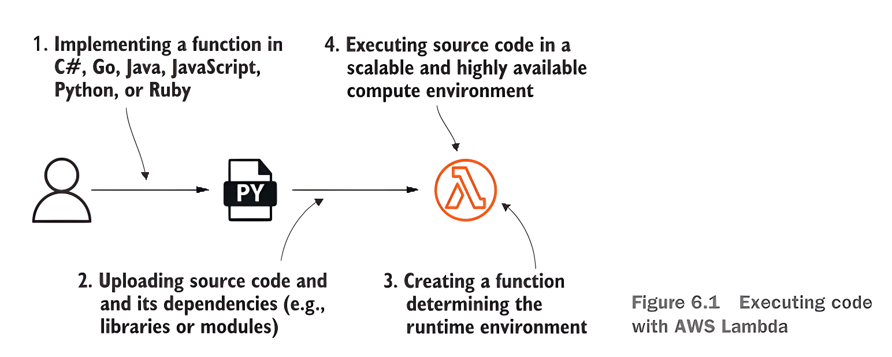
</div>

* **Step 1: Implementing a function in C#, Go, Java, JavaScript, Python, or Ruby**
Sab se pehle aap apni pasand ki kisi bhi supported language mein apna function (code) likhte hain.
* **Step 2: Uploading source code and its dependencies (e.g., libraries or modules)**
Aap apne code file (jaise Python ki `.py` file) aur us ke sath jo extra libraries ya modules chahiye hote hain, unka `.zip` package bana kar upload karte hain.
* **Step 3: Creating a function determining the runtime environment**
AWS Lambda Console par ja kar function create karte hain aur batate hain ke yeh kis environment (e.g., Python 3.12 ya Node.js 20) par chalega.
* **Step 4: Executing source code in a scalable and highly available compute environment**
Aap apne function ko invoke (call) karte hain, aur AWS background mein automatically ek dam safe aur highly available environment mein aap ka code chala deta hai.

### AWS Lambda Ke Supported Runtimes:

Lambda filhal in languages ko natively support karta hai:

* **C# / .NET Core**
* **Go**
* **Java**
* **JavaScript / Node.js**
* **Python**
* **Ruby**

> **Custom Runtimes & Container Images:**
> Agar aap koi aisi language use karna chahte hain jo list mein nahi hai, toh aap **Custom Runtime** ya **Docker Container Image** la sakte hain. Lekin is se system thoda mushkil (complex) ho jata hai, is liye writer recommend karta hai ke shuru mein inhi official supported runtimes ka use karein.

---

## Comparing AWS Lambda with virtual machines (Amazon EC2)

Aayein dekhte hain ke AWS Lambda aur Traditional EC2 Virtual Machine mein kya farq hai:

1. **Granularity (Tukde Ka Size):** Virtual Machine (EC2) aap ko poora Operating System deti hai jahan aap ek se ziyada app chala sakte hain. Jabke Lambda aap ko sirf ek chote se **single function** ko chalane ki jagah deta hai.
2. **Zimmewari (Responsibility):** EC2 mein server ko secure rakhna, scale karna, aur band hone se bachana aap ki zimmedari hai. Lambda mein infrastructure ko production-ready rakhna poora AWS ki zimmedari hai.
3. **Billing Farq (Real-World Price Comparison):**
* EC2 chalne par har second/ghante ka bill aata hai, chahe koi user aaye ya na aaye.
* Lambda sirf us waqt ka bill leta hai jab code asal mein chal raha ho.


#### Writer Ki Real-World Example:

Maan lijiye aap ko har 5 minute baad apni website check karne ke liye ek script chalani hai (Website Health Check):

* **EC2 Instance Par:** Aap ko server 24 ghante, 7 din on rakhna parega. Iska kharcha taqriban **$3.71 per month** aayega.
* **AWS Lambda Par:** Lambda sirf har 5 minute baad kuch milliseconds ke liye jagega aur phir so jayega. Iska kharcha sirf taqriban **$0.04 per month** (sirf 4 cents!) aayega.

---

## Table 6.1 AWS Lambda compared to Amazon EC2

Pehlay writer ka diya gaya table dekhein, phir is ki ek ek feature ko aasan urdu mein samajhte hain:

| Comparison Feature | AWS Lambda | Amazon EC2 |
| --- | --- | --- |
| **Granularity of virtualization** | Small piece of code (a function). | An entire operating system. |
| **Scalability** | Scales automatically. A throttling limit prevents you from creating unwanted charges accidentally and can be increased by AWS support if needed. | As you will learn in chapter 17, using an Auto Scaling group allows you to scale the number of EC2 instances serving requests automatically, but configuring and monitoring the scaling activities is your responsibility. |
| **High availability** | Fault tolerant by default. The computing infrastructure spans multiple machines and data centers. | Virtual machines are not highly available by default. Nevertheless, as you will learn in chapter 13, it is possible to set up a highly available infrastructure based on EC2 instances as well. |
| **Maintenance effort** | Almost zero. You need only to configure your function. | You are responsible for maintaining all layers between your virtual machine’s operating system and your application’s runtime environment. |
| **Deployment effort** | Almost zero due to a well-defined API | Rolling out your application to a fleet of virtual machines is a challenge that requires tools and know-how. |
| **Pricing model** | Pay per request as well as execution time and allocated memory | Pay for operating hours of the virtual machines, billed per second |

---

### Table 6.1 Ka Aasan Breakdown:

* **1. Granularity of virtualization (Kaam ka size):**
* **Lambda:** Bohot chota code ka tukda (sirf 1 function).
* **EC2:** Ek poora ka poora Operating System (jaise aap ka apna computer).


* **2. Scalability (Load ke hisab se bara/chota hona):**
* **Lambda:** Yeh **automatically** scale hota hai. Agar 1 user aaye toh 1 function jagega, agar 10,000 users ek sath aa jayein toh Lambda khud 10,000 instances bana dega. Bill achanak bohot ziyada na badh jaye, is ke liye ek safety limit (**Throttling Limit**) hoti hai jise zaroorat parne par badhaya ja sakta hai.
* **EC2:** EC2 mein aap ko **Auto Scaling Group** khud set karna parta hai, rules khud likhne parte hain, aur khud monitor karna parta hai.


* **3. High availability (System ka crash hone se bachna):**
* **Lambda:** Yeh **by default fault-tolerant** hai. AWS is ke code ko alag-alag data centers (Availability Zones) aur alag-alag machines par khud phailata hai taake ek jagah kharab ho toh doosri jagah se chalta rahe.
* **EC2:** EC2 by-default highly available nahi hota. Agar wo single server kharab hua toh app band ho jayegi. Isay highly available banane ke liye aap ko multiple EC2 instances aur Load Balancer khud setup karna parta hai.


* **4. Maintenance effort (Dekh-bhal ki mehnat):**
* **Lambda:** Almost **Zero**. Aap ko sirf apne function ki settings configure karni hain.
* **EC2:** Bohot mehnat hai. Operating System ke patches, security updates, aur runtime dependencies ki zimmedari aap ki hai.


* **5. Deployment effort (Code ko upload karna):**
* **Lambda:** Almost **Zero**. Ek simple API call ya CLI command se naya code deploy ho jata hai.
* **EC2:** Bohot mushkil task hai. Ek se ziyada servers (fleet) par app deploy karne ke liye alag se deployment tools aur knowledge ki zaroorat hoti hai.


* **6. Pricing model (Paisa kis baat ka Dena hai):**
* **Lambda:** Sirf utni baar ka paisa jitni baar function call hua (**Pay per request**), jitna time chala (**Execution time**), aur jitni RAM select ki (**Allocated memory**).
* **EC2:** Server jitne ghante ya seconds on raha, utna kiraya Dena parega—chahe server par koi kaam ho raha ho ya wo khali baitha ho.


---

## Building a website health check with AWS Lambda

Kya aap kisi website ya application ke chalte rehne (**uptime**) ke zimmedar hain? Writer batata hai ke wo apni blog website (`[https://cloudonaut.io](https://cloudonaut.io)`) ko 24/7 on rakhne ki poori koshish karte hain.

Lekin agar website kabhi band (down) ho jaye, toh sab se pehle kis ko pata chalna chahiye? Readers ko ya aap ko? Zaahir hai aap ko! Is kaam ke liye hum ek **External Health Check** lagate hain jo ek security guard (safety net) ki tarah kaam karta hai.

### Website Health Check Ke Liye AWS Lambda Kyun Sab Se Best Hai?

Sochein, website check karne ke liye aap ko 24 ghante computer chalane ki zaroorat nahi hai. Aap ko sirf har 5 minute baad, 1-2 milliseconds ke liye code chalana hai. AWS Lambda is kaam ke liye **perfect** hai kyunki yeh idle time ke paise nahi leta!

Is section mein hum Lambda ka use karke apni website ke liye ek automatic health check setup karenge.

---

### Is Setup Mein Konsi AWS Services Use Hongi?

1. **AWS Lambda:** Humara Python code chalaye gi.
2. **Amazon CloudWatch:** Lambda by-default apne saare results aur errors CloudWatch ko bhejta hai. Yahan hum charts dekh sakte hain aur **Alarms** bana sakte hain jo website down hone par email bhejenge.
3. **Amazon EventBridge:** Yeh humari **timer clock** ka kaam karega jo har 5 minute baad Lambda function ko jagega (trigger karega).

---

### Architecture Breakdown (Figure 6.2)

Writer ne **Figure 6.2** mein is poore system ke 3 mukhya (main) hissay bataye hain:

<div align="center">
  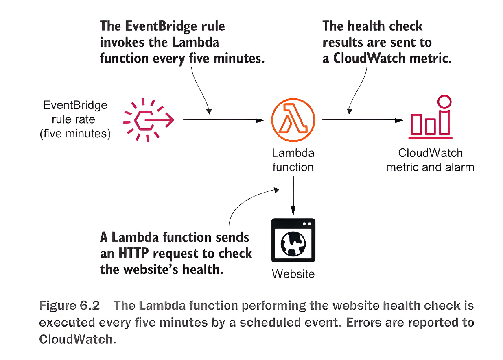
</div>

#### Figure 6.2 Ka Detail Breakdown:

* **1. EventBridge rule:** Har 5 minute baad ek event (ishara) bhejta hai jo Lambda function ko execute karta hai. Yeh bilkul Linux ke **cron service** (scheduled timer) ki tarah kaam karta hai.
* **2. Lambda function:** Ek Python script chalta hai jo aap ki website par HTTP request (e.g., `GET [https://cloudonaut.io](https://cloudonaut.io)`) bhejta hai aur check karta hai ke response mein khas lafz (jaise `cloudonaut`) likha hua aa raha hai ya nahi.
* **3. Alarm:** CloudWatch check karta hai ke kitni baar health check fail hua. Agar website down ho, toh yeh aap ko **email notification** bhej deta hai.

> **Note:** Is section mein hum yeh poora setup **AWS Management Console** (buttons click karke) banaen ge taake aap ko Lambda use karne ki achi practice ho jaye. Automated tarika (CloudFormation) hum section 6.3 mein seekhein ge.

---

## Creating a Lambda function

Aayein step-by-step apni pehli Lambda function banate hain:

### Step 1: Lambda Console Kholna

1. Browser mein AWS Console open karein: `[https://console.aws.amazon.com/lambda/home](https://console.aws.amazon.com/lambda/home)`
2. **Create a Function** button par click karein.

#### Figure 6.3 Breakdown:

<div align="center">
  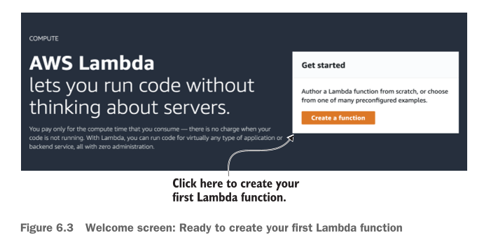
</div>

**Figure 6.3** mein AWS Lambda ka Welcome screen dikhaya gaya hai jahan **Get started** box ke andar **Create a function** ka orange button hai. Is button par click karke function banane ka wizard shuru hota hai.

---

### Step 2: AWS Blueprint Ka Istemal Karna

AWS humein bani-banai templates (code + settings) deta hai jinhein hum **Blueprints** kehte hain.

* **Blueprint Selection:** **Use a blueprint** wala option select karein.
* **Search:** Search box mein `canary` likhein.
* **Select:** Results mein se `lambda-canary` blueprint ko chun lein.

#### Figure 6.4 Breakdown:

<div align="center">
  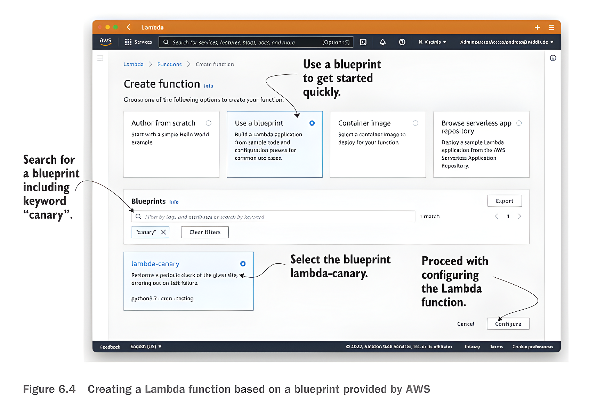
</div>

**Figure 6.4** mein Console ka screen hai jahan top par **Use a blueprint** selected hai. Search bar mein `"canary"` filter karne par neeche `lambda-canary` card nazar aata hai (jo Python 3.7 / modern Python runtimes par chalta hai). Us par click karke bottom right par **Configure** button dabaen.

> **Canary Kya Hota Hai?** Purane zamanay mein koyle ki khanon (coal mines) mein log ek choti chidya (canary) sath le jaate the. Agar zaharili gas aati thi toh chidya sab se pehle behosh ho jati thi aur mazdooron ko khatre ka pata chal jata tha. IT mein bhi "Canary" us chote check ko kehte hain jo system ke kharab hone par sab se pehle alert deta hai.

---

### Step 3: Function Name aur IAM Role Set Karna

#### Function Name Rules:

* Name box mein `website-health-check` likhein.
* Name aap ke AWS account aur current region (e.g., `US East (N. Virginia)`) mein unique hona chahiye.
* Is ki max length **64 characters** hoti hai.

#### IAM Role (Permissions):

* **Execution Role:** Select karein **Create a New Role with Basic Lambda Permissions**.
* Yeh role Lambda ko permission deta hai ke wo apne logs Amazon CloudWatch mein write (save) kar sake.

#### Figure 6.5 Breakdown:

<div align="center">
  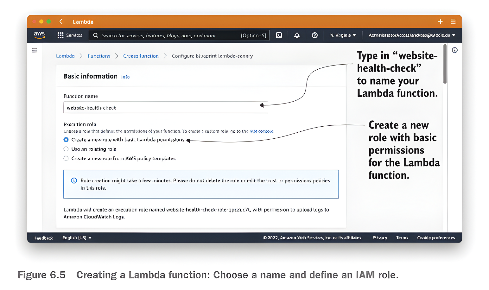
</div>

**Figure 6.5** mein **Basic information** ka section hai jahan `website-health-check` name type kiya gaya hai aur Execution role mein **Create a new role with basic Lambda permissions** wala radio button selected hai.

---

### Step 4: EventBridge Trigger (Schedule Expression) Setup Karna

Hum chahte hain ke humara health check har 5 minute baad automatic chalay. Is ke liye hum **EventBridge (CloudWatch Events)** trigger add karenge:

1. **Rule Option:** Select **Create a New Rule**.
2. **Rule Name:** Type karein `website-health-check`.
3. **Rule Description:** Kuch bhi simple description likhein, e.g., `Check website every 5 minutes`.
4. **Rule Type:** Select **Schedule Expression**.
5. **Schedule Expression Value:** Box mein `rate(5 minutes)` likhein.

#### Figure 6.6 Breakdown:

<div align="center">
  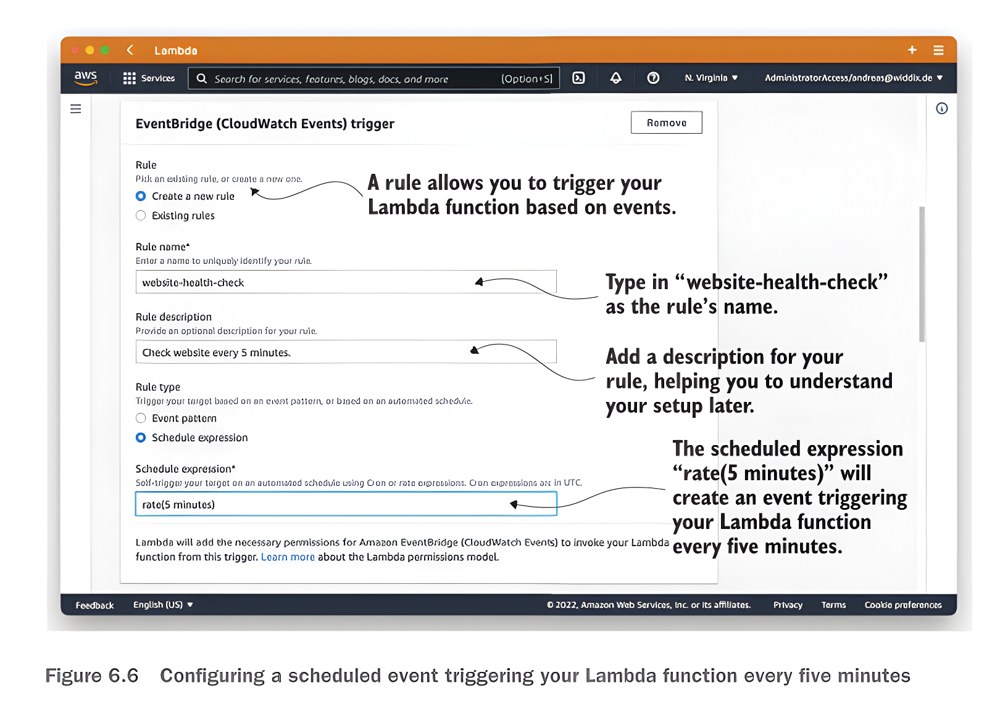
</div>

**Figure 6.6** mein **EventBridge (CloudWatch Events) trigger** ka section hai. Is mein Rule Name, Description, Schedule Expression radio button, aur text field mein `rate(5 minutes)` enter kiya hua nazar aa raha hai.

---

### Schedule Expressions Deep Detail (Rate vs Cron)

Recurring (baar baar hone wale) tasks ke liye AWS do tarah ke Schedule Expressions deta hai:

#### 1. Rate Expression Syntax: `rate($value $unit)`

* **Rules:** `$value` hamesha ek positive integer (1, 2, 5, 10 etc.) hoga.
* **Units:** Aap `minute`, `minutes`, `hour`, `hours`, `day`, ya `days` use kar sakte hain.
* **Examples:**
* `rate(5 minutes)` ──> Har 5 minute baad chalega.
* `rate(1 hour)` ──> Har 1 ghante baad chalega.


* **Limitation:** **1 minute se kam** (e.g., seconds mein) ki frequency support nahi hoti.

#### 2. Cron Expression Syntax: `cron($minutes $hours $dayOfMonth $month $dayOfWeek $year)`

Agar aap ko specific time par code chalana ho (jaise roz subah 8 baje), toh Cron expression use hoti hai:

```bash
# Formats: cron(Minutes Hours Day-of-month Month Day-of-week Year)

# Example 1: Har roz subah 8:00 baje (UTC) chalana:
cron(0 8 * * ? *)

# Example 2: Har Monday se Friday shaam 4:00 baje (UTC) chalana:
cron(0 16 ? * MON-FRI *)
```

---

### Step 5: Code aur Environment Variables Setup

Blueprint use karne ka fayda yeh hua ke AWS ne Python code pehle se likh kar de diya hai.

#### Environment Variables Kya Hote Hain?

Code ke andar URL ya keywords hardcode karne ke bajaye hum **Environment Variables** (Key-Value pairs) use karte hain. Is se code ko chhede bina settings change ki ja sakti hain.

Aap ko 2 Environment Variables add karne hain:

* **`site`**: Aap ki website ka URL (e.g., `[https://cloudonaut.io](https://cloudonaut.io)`).
* **`expected`**: Webpage par maujood koi lafz jo confirm kare ke page sahi load hua hai (e.g., `cloudonaut`).

#### Code Ka Breakdown (Python):

Blueprint dwara diya gaya Python code (2026 Modern Python standard ke sath) yeh hai:

```python
import os
from datetime import datetime
from urllib.request import Request, urlopen

# Environment Variables se values read karna
SITE = os.environ['site']
EXPECTED = os.environ['expected']

def validate(res):
    '''Agar expected text page mein na miley toh False return karo'''
    return EXPECTED in res

def lambda_handler(event, context):
    print(f"Checking {SITE} at {event.get('time', datetime.now().isoformat())}")
    try:
        # Website par HTTP Request bhejna
        req = Request(SITE, headers={'User-Agent': 'AWS Lambda'})
        page_content = str(urlopen(req).read())
        
        # Check karna ke expected word content mein hai ya nahi
        if not validate(page_content):
            raise Exception("Validation failed")
            
    except Exception as e:
        print("Check failed!")
        raise e

```

#### Code Ki Step-by-Step Samajh:

1. `os.environ['site']` aur `os.environ['expected']`: Console mein diye gaye `site` aur `expected` variables ki values ko read karte hain.
2. `lambda_handler(event, context)`: Yeh Lambda ka **entry point** hai. Jab bhi EventBridge trigger hoga, AWS sab se pehle is function ko call karega.
3. `Request(SITE, headers=...)`: Website ko HTTP GET request bhejta hai.
4. `validate(...)`: Webpage ka HTML response check karta hai. Agar `expected` lafz (jaise `cloudonaut`) HTML mein na mile, toh Exception create hota hai.
5. `raise e`: Jab error aata hai, toh Lambda execution mark ho jati hai as **Failed**. Yeh failure entry CloudWatch bhej di jati hai.

#### Figure 6.7 Breakdown:

<div align="center">
  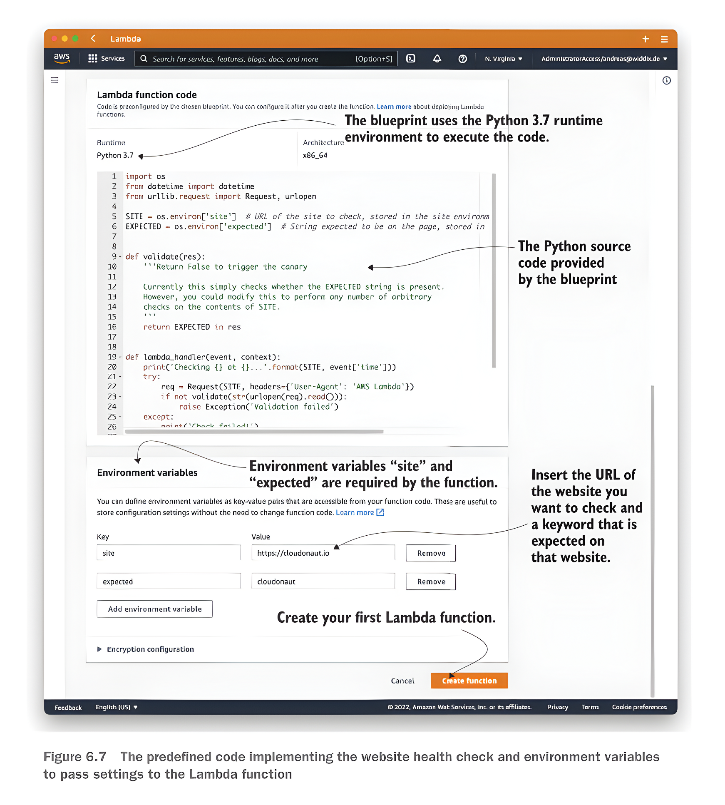
</div>

**Figure 6.7** mein top section par Code Editor hai jahan Python code (Python runtime environment) dikhaya gaya hai. Neeche **Environment variables** ka section hai jahan `site` = `[https://cloudonaut.io](https://cloudonaut.io)` aur `expected` = `cloudonaut` set kiya gaya hai. Sab se aakhir mein orange **Create function** button hai.

---

### Conclusion & Final Step

Tamam configurations aur Environment Variables set karne ke baad, screen ke aakhir mein **Create Function** button par click karein.

**Mubarak ho!** Aap ne apna pehla AWS Lambda function safaltapurvak create kar liya hai. Ab har 5 minute baad yeh automatic jagega, website check karega, aur wapas so jayega.

> **Doosre Tasks Ke Liye Use-Cases:** Is tarah ke scheduled Lambda functions ko aap doosre automatic kaamon ke liye bhi use kar sakte hain, jaise:
> * System status monitor karna.
> * Faltu resources (jaise purane EBS Snapshots) ko clean-up/delete karna.
> * Har roz automatic summary reports email karna.
> 
> 

---

## Use CloudWatch to search through your Lambda function’s logs

Aap ko kaise pata chalega ke aap ka website health check sahi tareeqe se kaam kar raha hai? Ya aap ko kaise pata chalega ke aap ka Lambda function असल mein chal bhi raha hai ya nahi?

Ab waqt aa gaya hai ke hum seekhein ke Lambda function ki **Monitoring** kaise ki jaati hai. Sab se pehle hum seekhein ge ke Lambda function ke bhejey gaye **Log Messages** ko kaise dekha jata hai, aur is ke baad hum ek **Alarm** banana seekhein ge jo function fail hone par aap ko alert karega.

---

### Step 1: Lambda Function Ka Monitor Tab Dekhna

Aap apne Lambda function ke details page par jayein aur top par maujood **Monitor** tab par click karein.

* **Invocations Chart:** Monitor tab kholte hi aap ko ek chart nazar aayega jo batata hai ke aap ka function kitni baar invoke (call/trigger) hua hai.
* **Delay Note:** Agar chart mein pehli baar koi line ya point nazar na aaye, toh 1-2 minute sabar karein aur page ko **reload** karein, kyunki data aane mein thoda waqt lagta hai.
* **CloudWatch Logs Par Jaana:** Logs dekhne ke liye **View logs in CloudWatch** button par click karein.

---

### Figure 6.8 Breakdown (Monitoring Overview)

<div align="center">
  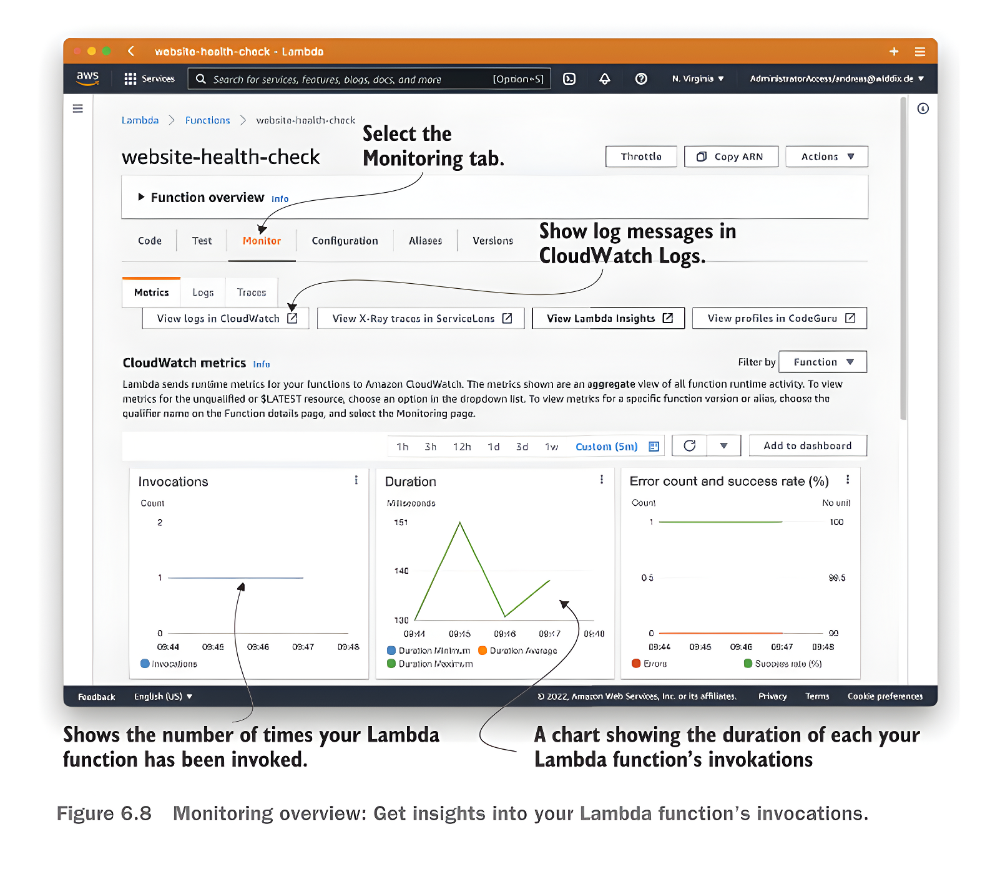
</div>

**Figure 6.8** mein Lambda Console ka **Monitor** tab dikhaya gaya hai:

* **Monitor Tab:** Top menu mein `Code`, `Test` ke sath `Monitor` tab selected hai.
* **View logs in CloudWatch Button:** Is button par click karke aap seedha Amazon CloudWatch service mein chaley jaate hain jahan saare detailed logs maujood hote hain.
* **CloudWatch Metrics Charts:**
1. **Invocations:** Yeh chart batata hai ke function kitni baar run hua (e.g., har 5 minute baad 1 count).
2. **Duration:** Yeh chart batata hai ke function ko chalne mein kitne milliseconds (ms) ka waqt laga (e.g., 130ms - 150ms).
3. **Error count and success rate (%):** Yeh chart batata hai ke kitni requests kamyab (success) huin aur kitni fail (error).


---

### CloudWatch Log Groups Aur Log Streams Kya Hote Hain?

By default, AWS Lambda apne tamam output aur error messages **Amazon CloudWatch** ko bhejta hai.

#### 1. Log Group (Main Folder)

Jab aap Lambda function banate hain, toh AWS background mein automatically ek **Log Group** bana deta hai. Is log group ka naam hamesha `/aws/lambda/<function-name>` hota hai (jaise humare case mein `/aws/lambda/website-health-check` hai).

#### 2. Log Streams (Individual Files)

Ek Log Group ke andar bohot saare **Log Streams** hote hain.

* **Aasan Samjh:** Log Group ko ek poori file cabinet samjhein, aur Log Streams ko us ke andar rakhi hui alag-alag files.
* Lambda jab bhi naya execution environment banata hai, wo ek naya Log Stream shuru kar deta hai taake system par bojh na pare aur logs aasaani se scale ho sakein.

---

### Figure 6.9 Breakdown (Log Group View)

<div align="center">
  
</div>

**Figure 6.9** mein Amazon CloudWatch Console ka Log Group screen dikhaya gaya hai:

* **Log Group Name:** Top par `/aws/lambda/website-health-check` likha nazar aa raha hai.
* **Search Log Group Button:** Agar aap ke paas bohot saare Log Streams hain, toh ek ek stream ko alag se kholna mushkil hota hai. Is orange **Search log group** button par click karne se tamam Log Streams ke messages ek hi screen par jama ho kar samne aa jaate hain.
* **Log Streams List:** Tabular form mein neechay Log Streams ki list dikhai gayi hai jahan har stream ka time aur ID likhi hoti hai.

---

### Logs Mein Result Search Karna

Jab aap **Search log group** par click karte hain, toh aap ke samne saare log events aa jaate hain.

* **Check Passed Message:** Agar aap ka health check sahi chala hai, toh aap ko logs mein `Check passed!` ki line nazar aayeki. Is ka matlab hai ke Lambda ne website par HTTP request bheji, website on mili, aur expected word bhi mil gaya!

---

### Figure 6.10 Breakdown (Searching Log Messages)

<div align="center">
  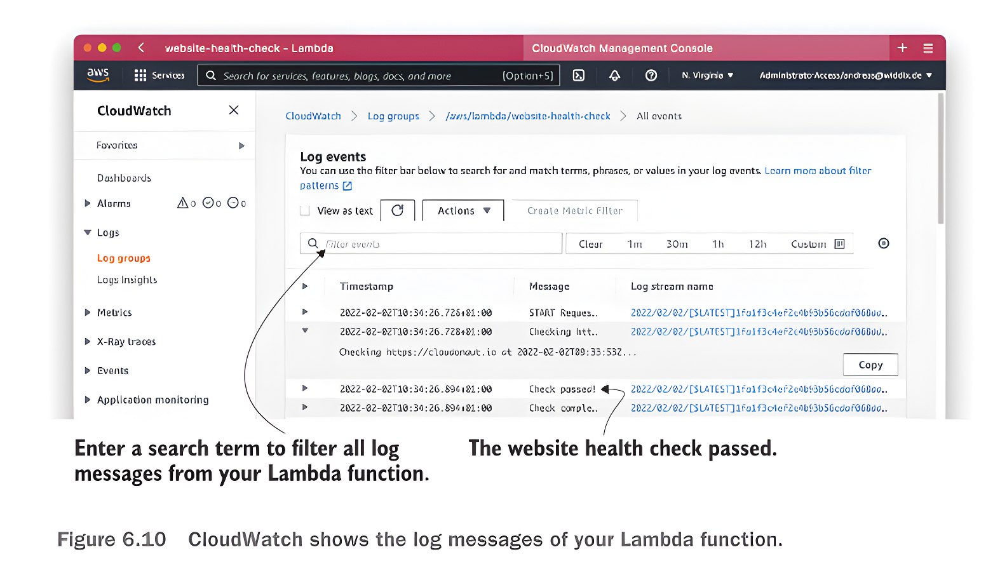
</div>

**Figure 6.10** mein CloudWatch Log Events ki search window dikhai gayi hai:

* **Filter Events Search Bar:** Top par ek search box (`Filter events`) hai. Yahan aap koi bhi keyword (jaise `passed` ya `failed`) likh kar specific logs dhoond sakte hain.
* **Log Messages List:** Screen par Timestamp, Message, aur Log Stream Name ke sath exact lines dikhai de rahi hain:
* `START RequestId...` (Function shuru hua)
* `Checking [https://cloudonaut.io](https://cloudonaut.io)...` (Website check ho rahi hai)
* `Check passed!` (Health check kamyab ho gaya)
* `END RequestId...` (Function khatam hua)


---

### Real-World Debugging Tip (Code Mein Logs Kaise Bhejein?)

Centralized jagah par logs ko search karna debugging (code ki galti dhoondne) ke liye bohot zaroori aur faide-mand hota hai—khas taur par jab aap apna custom Python code likh rahe hon.

* **Python Print Statements:** Python mein jab aap simple `print("Mera message")` likhte hain, toh Lambda automatically us text ko capture karta hai aur CloudWatch Logs mein save kar deta hai.
* **Python Logging Module:** Aap Python ka built-in `logging` module (`logging.info()`, `logging.error()`) bhi use kar sakte hain. Yeh ziada professional tarika hai kyunki is se log level (INFO, ERROR, WARNING) bhi sath mention hota hai.

> **Yad Rakhein:** Logs turant nahi aate! Har execution ke baad logs CloudWatch tak pahunche mein **1 se 2 minute ka delay** ho sakta hai. Agar aap ko apna naya log message nazar na aaye, toh pareshan hue bina table ko **reload** kar lein.

---

## Monitoring a Lambda function with CloudWatch metrics and alarms

Aap ka Lambda function ab har 5 minute baad website ki sehat (health) check kar raha hai, aur har check ka result **CloudWatch Logs** mein likha ja raha hai.

Lekin agar raat ko ya kisi bhi waqt website down ho jaye, toh aap ko phone ya email par fawran alert kaise miley ga? Is kaam ke liye hum **CloudWatch Metrics** aur **Alarms** ka istemal karte hain.

AWS Lambda by default har execution ke data points (statistics) ko **Metrics** ki shakal mein Amazon CloudWatch ko bhejta rehta hai.

---

### Table 6.2 The CloudWatch metrics published by each Lambda function

Pehle book ka yeh table dekhein, phir is ki har metric ko bacho ki tarah aasan zaban mein samajhte hain:

| Name | Description |
| --- | --- |
| **Invocations** | Counts the number of times a function is invoked. Includes successful and failed invocations. |
| **Errors** | Counts the number of times a function failed due to errors inside the function, for example, exceptions or timeouts. |
| **Duration** | Measures how long the code takes to run, from the time when the code starts executing to when it stops executing. |
| **Throttles** | As discussed at the beginning of the chapter, there is a limit for how many copies of your Lambda function can run at one time. This metric counts how many invocations have been throttled due to reaching this limit. Contact AWS support to increase the limit, if needed. |

---

#### Table 6.2 Ka Simple Breakdown:

1. **Invocations (Kitni Baar Chala):**
Yeh batata hai ke aap ka function kul (total) kitni baar call/trigger hua. Is mein success hone waale aur fail hone waale, dono checks shamil hote hain.
2. **Errors (Kitni Baar Fail Hua):**
Jab aap ke Python code mein koi galti (exception) aaye, website na miley, ya execution ka time khatam (timeout) ho jaye, toh yeh metric 1 point barh jati hai.
3. **Duration (Kitna Waqt Laga):**
Code ke shuru hone se khatam hone tak kitne milliseconds (ms) lagay, yeh metric us waqt ko naapti hai. Is se aap ko bill ka andaza hota hai.
4. **Throttling / Throttles (Kitni Requests Rok Di Gain):**
AWS Lambda mein ek limit (Concurrent Execution Limit) hoti hai ke ek waqt mein kitne functions ek sath chal sakte hain. Agar requests us limit se ziada ho jayein, toh AWS extra requests ko rok (throttle kar) deta hai. Yeh metric un roki gayi requests ki ginti karti hai. (Agar limit badhani ho toh AWS Support ko request bhejni parti hai).

---

### CloudWatch Alarm Banane Ka Decision

Jab bhi website check fail hoga, Lambda function error return karega aur CloudWatch mein **Errors** metric ki ginti `0` se barh kar `1` ho jayegi.

Hum ek aisa **Alarm** set karenge jo check karega:

> **"Agar 5 minute ke andar Errors metric 0 se ziada ho jaye, toh fawran Email bhej do!"**

#### Writer Ki Recommendation:

Production environment mein hamesha apne Lambda functions ki monitoring ke liye **Errors** aur **Throttles** dono metrics par Alarms zaroor lagayein.

---

### Step-by-Step Guide: Alarm Banane Ka Tareeqa

CloudWatch Console mein ja kar neechay diye gaye steps follow karein:

#### Step 1: Alarm Wizard Shuru Karna

1. AWS Console mein CloudWatch service open karein.
2. Left side bar se **Alarms** menu par click karein.
3. Orange rang ke **Create Alarm** button par click karein.

#### Figure 6.11 Breakdown:

<div align="center">
  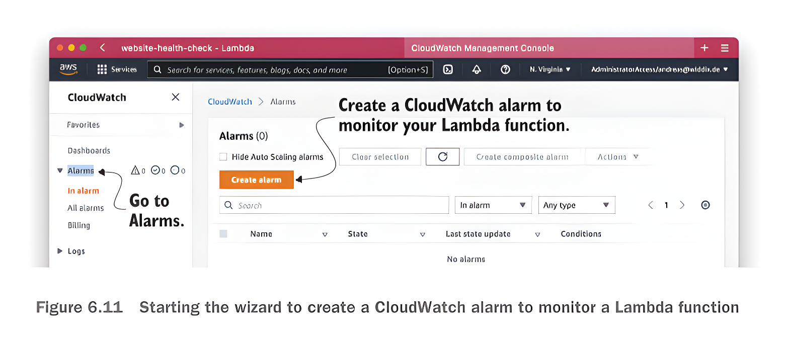
</div>

**Figure 6.11** mein CloudWatch Console dikhaya gaya hai jahan left menu mein **Alarms** highlighted hai aur screen ke beech mein **Create alarm** ka orange button nazar aa raha hai.

---

#### Step 2: Error Metric Dhoondna (Metric Selection)

1. Screen par **Select metric** button par click karein.
2. AWS Services ki list mein se **Lambda** namespace select karein.
3. **By Function Name** dimension wale card par click karein.

#### Figure 6.12 Breakdown:

<div align="center">
  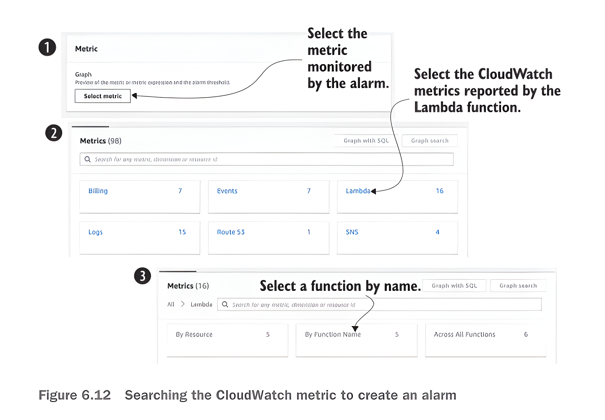
</div>

**Figure 6.12** ne is step ko 3 chote hisson mein baanta hai:

* **(1)** Top par **Select metric** button par click karein.
* **(2)** Categories mein se **Lambda** box par click karein.
* **(3)** Filtering options mein se **By Function Name** select karein taake aap ko function ke naam ke hisab se metrics nazar aayein.

---

#### Step 3: Specific Function Ka Error Metric Select Karna

1. Table mein se `website-health-check` function ke samne wali **Errors** metric wale checkbox ko select karein.
2. Bottom right corner par **Select metric** button dabaen.

#### Figure 6.13 Breakdown:

<div align="center">
  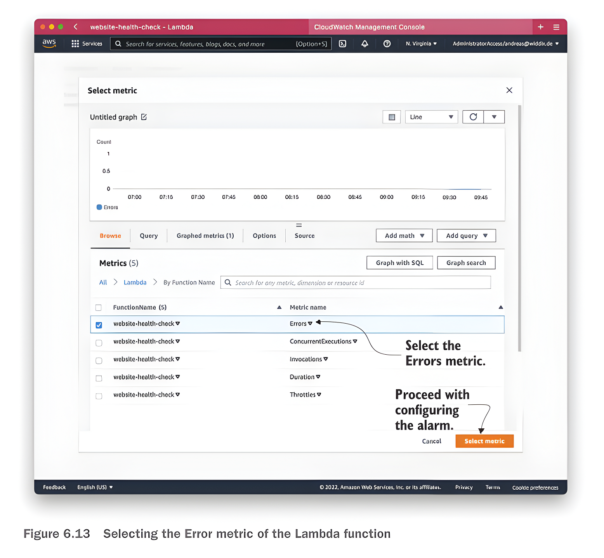
</div>

**Figure 6.13** mein Metric selection screen hai jahan graph ke neechay `website-health-check` function ki `Errors` row ko checkmark (tick) kiya gaya hai aur neeche **Select metric** button dikhaya gaya hai.

---

#### Step 4: Alarm Rules Aur Conditions Set Karna (Metric Configuration)

Ab aap ko set karna hai ke alarm kab aur kis shart par bajega:

1. **Statistic:** Choose karein **Sum** (Yeh evaluation period ke dauran aane wale tamam errors ko aapas mein jama/add karta hai).
2. **Period:** Select karein **5 minutes** (Kyunki humara health check har 5 minute baad chalta hai).
3. **Threshold type:** Select **Static**.
4. **Condition Operator:** Choose **Greater** (`>`).
5. **Threshold Value:** Type **0**.
6. **Next** button par click karein.

#### Logic (Alarm Kaise Kaam Karega?):

* **ALARM State:** Agar 5 minute mein total errors > 0 hue, toh Alarm baj uthega (State = ALARM).
* **OK State:** Agar errors 0 rahenge, toh Alarm khamosh rahega (State = OK).

#### Figure 6.14 Breakdown:

<div align="center">
  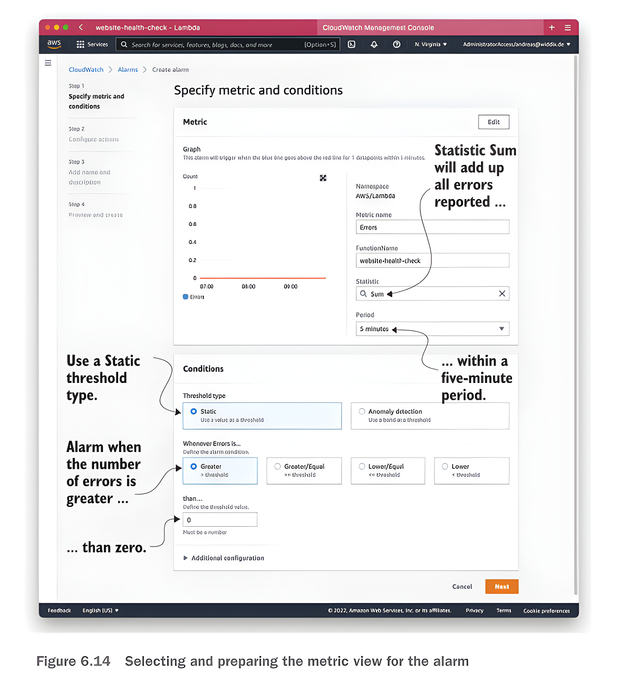
</div>

**Figure 6.14** mein Conditions setup form dikhaya gaya hai:

* Top par Statistic (`Sum`) aur Period (`5 minutes`) selected hai.
* Conditions section mein **Static** threshold type, **Greater** condition, aur value **0** enter ki gayi hai.

---

#### Step 5: Email Notification Actions Setup Karna (Amazon SNS)

Jab alarm bajey toh notification kahan jaye? Is ke liye hum **Amazon SNS (Simple Notification Service)** ka use karte hain:

1. **Alarm state trigger:** Select karein **In alarm** (Jab alarm trigger ho).
2. **Select an SNS topic:** Select karein **Create new topic**.
3. **Topic Name:** Box mein type karein `website-health-check`.
4. **Email Endpoint:** Apna actual Email address enter karein (jis par aap alert chahte hain).
5. **Create topic** dabaen aur phir **Next** button click karein.

#### Figure 6.15 Breakdown:

<div align="center">
  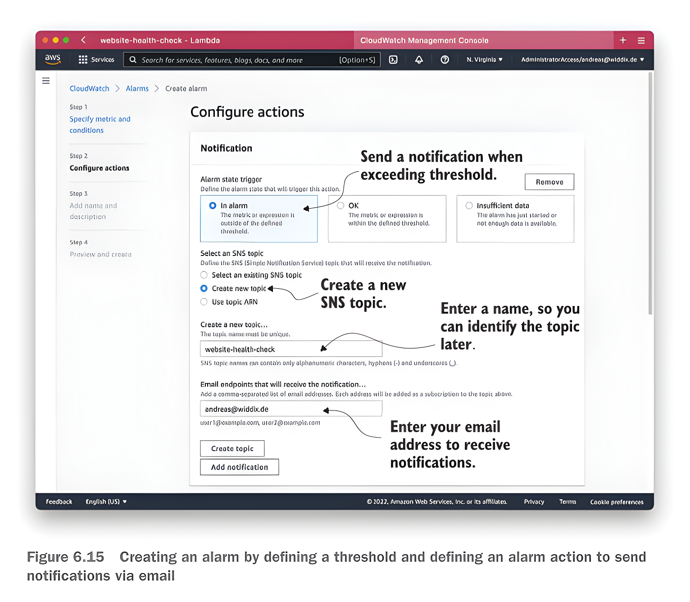
</div>

**Figure 6.15** mein Notification section dikhaya gaya hai:

* **In alarm** radio button selected hai.
* **Create new topic** par click karke Topic name `website-health-check` aur email address fill kiya gaya hai.

---

#### Step 6: Alarm Name Aur Confirmation

1. **Alarm Name:** Type karein `website-health-check-error`.
2. **Next** par click karke saari details review karein aur **Create Alarm** button daba dein.

> **Zaroori Warning (SNS Email Confirmation):** Alarm bante hi AWS aap ke Email inbox mein ek confirmation message bhejega. Apne email ko khol kar us mein diye gaye **Confirm subscription** link par click karein. **Jab tak aap link click nahi karenge, aap ko alerts ke emails nahi milenge!**

---

### Alarm Ko Test Karne Ka Tareeqa (Testing The Setup)

Aap ko kaise pata chalega ke alarm sach mein kaam kar raha hai? Hum jaan bujh kar system ko fail karke test karenge:

1. Wapas apne **AWS Lambda Console** par jayein.
2. Function ke **Environment Variables** section mein jayein.
3. `expected` variable ki value ko `cloudonaut` se badal kar **`FAILURE`** kar dein aur save karein.

#### Kya Hoga?

Aap ki website par `FAILURE` lafz toh maujood nahi hai! Agli baar jab Lambda har 5 minute baad chalega, toh usay text nahi miley ga, code error throw karega, CloudWatch mein `Errors` metric 1 ho jayegi, aur CloudWatch Alarm trigger ho kar aap ko email bhej dega.

* **Time Delay Note:** Error hone se lekar email aap ke inbox tak pahunche mein **15 minute tak ka waqt** lag sakta hai, is liye thoda sabar karein.

---

## Cleaning up

Agar aap yeh setup sirf practice ke liye kar rahe hain, toh AWS mein faltu charges ya resources se bachne ke liye in saare components ko step-by-step delete kar dein:

1. **AWS Lambda:** Lambda console par ja kar `website-health-check` naam ka function delete karein.
2. **AWS CloudWatch Logs:** CloudWatch -> Logs -> Log Groups mein ja kar `/aws/lambda/website-health-check` log group delete karein.
3. **Amazon EventBridge:** EventBridge -> Rules mein ja kar `website-health-check` rule delete karein.
4. **CloudWatch Alarms:** CloudWatch -> Alarms mein ja kar `website-health-check-error` alarm delete karein.
5. **AWS IAM:** IAM -> Roles mein ja kar wo role delete karein jis ka naam `website-health-check-role-` se shuru hota hai.
6. **Amazon SNS:** SNS -> Topics mein ja kar `website-health-check` waala topic delete karein.

---

## Accessing endpoints within a VPC

Is section mein writer humein yeh samjha raha hai ke jab aap ka code **AWS Lambda** par chal raha ho, toh wo doosri cheezon (jaise websites, databases, ya servers) se baat (communication) kaise karta hai—khas taur par jab wo cheezein aap ke apne private network (**VPC - Virtual Private Cloud**) ke andar chhupi hui hon.

---

### Lambda Ka Default Network Behavior (By Default Kya Hota Hai?)

By default (aam taur par), AWS Lambda functions aap ke banaye hue **VPC (Virtual Private Cloud)** ke andar **nahi** chalte. Wo AWS ke apne managed network ke andar chalte hain.

#### Public Internet Access:

By default, har Lambda function seedha **Internet** se juda (connected) hota hai. Is ka matlab hai ke Lambda internet par maujood kisi bhi aisi service se baat kar sakta hai jiska public address (IP/URL) ho.

#### Writer Ki Real-World Example:

Pichle section mein jab hum ne **Website Health Check** banaya tha, toh hum ne Lambda ko internet ke zariye hi `[https://cloudonaut.io](https://cloudonaut.io)` par HTTP request bhejne ke liye use kiya tha. Lambda ne internet ka rasta pakda aur public website check kar li.

---

### Figure 6.16 Breakdown (Default Lambda Setup)

**Figure 6.16** mein Lambda function ka default rasta dikhaya gaya hai:

<div align="center">
  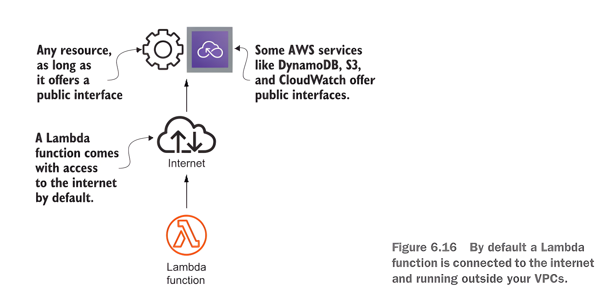
</div>

* **Lambda Function:** Yeh aap ke VPC ke bahar chal raha hai.
* **Internet:** Middle layer hai jahan se traffic guzar kar jata hai.
* **Public Resources:** Internet ke zariye Lambda kisi bhi public website ya AWS ki un services se baat kar sakta hai jinke public endpoints hote hain (jaise **Amazon DynamoDB**, **Amazon S3**, aur **Amazon CloudWatch**).

---

### Problem: Private Resources Tak Kaise Pahunchein?

Maan lijiye aap ke paas ek aisi website ya database hai jo internet par open **nahi** hai. Wo aap ke **VPC ke private subnet** mein chhupi hui hai (jaise company ka internal HR portal ya private RDS Database).

Agar Lambda default settings par rahega, toh wo aap ke private network ke andar maujood resources ko access **nahi** kar payega, kyunki internet se private IPs tak rasta nahi milta.

---

### Solution: Lambda Ko VPC Se Connect Karna

Agar aap chahte hain ke Lambda aap ke private network ke andar ja kar kaam kare (jaise kisi internal website ka health check karna ya private database se data read karna), toh aap ko Lambda mein **VPC Access** enable karna parta hai.

Jab aap VPC access enable karte hain, toh AWS Lambda background mein Elastic Network Interfaces (ENIs / Virtual Network Cards) bana kar aap ke VPC ke saath jod deta hai.

---

### Figure 6.17 Breakdown (Lambda inside VPC Setup)

<div align="center">
  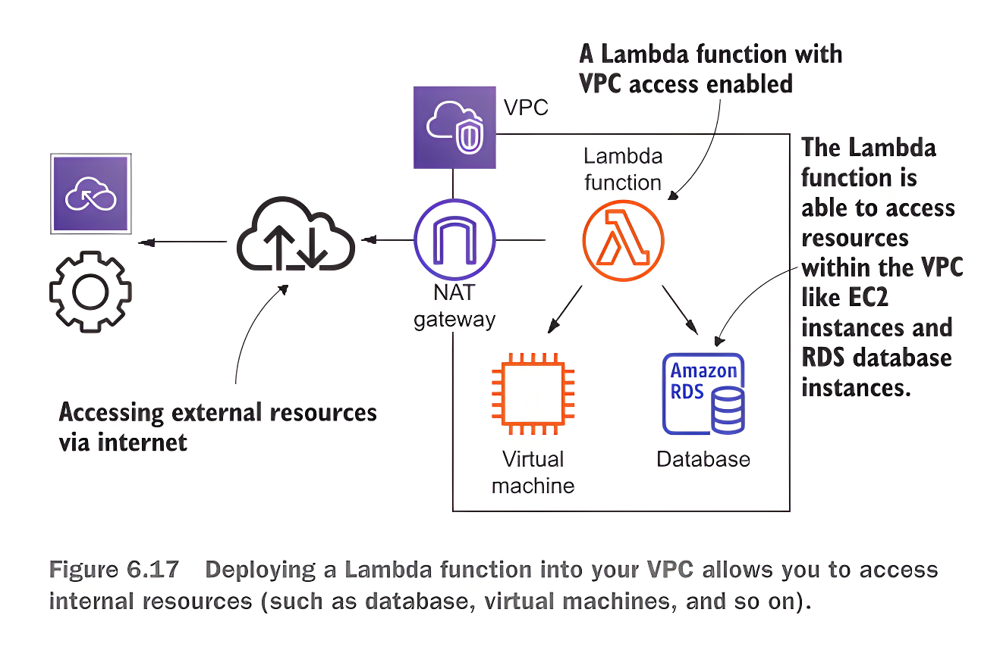
</div>
```

#### Figure 6.17 Ka Step-by-Step Breakdown:

1. **Lambda Function with VPC Access Enabled:** Lambda ab aap ke private VPC network ka hissa ban chuka hai.
2. **Accessing Internal Resources:** Lambda ab VPC ke andar maujood private resources se seedhi baat kar sakta hai, jaise:
* **Virtual Machine (EC2 Instance):** Internal web servers ya microservices.
* **Amazon RDS (Database):** Private SQL/PostgreSQL/MySQL databases.


3. **Accessing External Resources via Internet (Zaroori Point):**
* **Bohat Zaroori Point:** Jab aap Lambda ko VPC se jod dete hain, toh us ka **default direct internet access khatam ho jata hai**!
* Agar VPC wale Lambda ko bahar internet par bhi baat karni hai, toh VPC ke andar **NAT Gateway** ka hona zaroori hai, taake traffic Lambda ──> NAT Gateway ──> Internet ja sake.


---

### VPC Access Configure Karne Ke Liye Kitni Cheezein Chahiye?

Lambda ko apne VPC se jodne ke liye aap ko 3 buniyaadi settings deni parti hain:

1. **VPC ID:** Batana hota hai ke kis VPC se connect karna hai.
2. **Subnets:** Kam az kam 2 ya 3 alag-alag Availability Zones ke subnets select karne chahiye taake High Availability bani rahe.
3. **Security Groups:** Lambda ka apna firewall (Security Group) set karna hota hai jo batata hai ke Lambda kin IP addresses aur ports par traffic bhej sakta hai.

---

### Writer Ki Real-World Project Examples

Writer batata hai ke unhon ne apne multiple client projects mein Lambda ko VPC se connect karne ki ability ko use kiya hai, khas taur par:

* **Private Databases Access:** Lambda functions ke zariye private VPC mein chal rahe databases (jaise Amazon RDS) se secure data fetch ya write karna.

---

### Design Decision & Trade-offs (Writer Ki Key Advice)

Architectural design ke lehaz se writer ne ek bohot zaroori mashwara (trade-off) bataya hai:

#### 1. Writer Recommendation:

> **"Lambda function ko VPC se sirf TABHI connect karein jab aisa karna MUKAMMAL ZAROORI ho."**

#### 2. Trade-off (Wajah Kya Hai?):

* **Additional Complexity:** VPC connect karne se system mein networking ki complexity badh jaati hai (Subnets, Security Groups, IP address limits ko sambhalna parta hai).
* **Cost & Setup:** Internet access ke liye NAT Gateway lagana parta hai jis ka alag se monthly charge hota hai.

#### 3. Best Use-Cases (Yeh Kab Karna Chahiye?):

* Jab aap ko **Legacy Systems** (purane chalte hue internal company servers) ke sath integration karni ho.
* Jab aap ko **Private Databases** (RDS, ElastiCache) se secure connection banana ho.

---

## Adding a tag containing the owner of an EC2 instance automatically

Ab tak hum ne AWS Console par bani-banai blueprint template ka use karke Lambda function banana seekha. Lekin ab hum step-by-step apna **custom code bilkul zero (scratch) se** likhenge. Humara sab se bara focus apni cloud infrastructure ko **automate (khudkar)** karne par hai. Is liye hum seekhein ge ke Management Console par buttons click kiye bina, apne Lambda function aur us ki zaroori dependencies ko code ke zariye kaise deploy kiya jata hai.

---

### Real-World Problem: "Yeh EC2 Instance Kisne Banaya Hai?"

Maan lijiye aap apne doston ya office colleagues ke sath ek hi AWS account par kaam kar rahe hain. Kya aap ne kabhi dekha hai ke account mein ek EC2 Virtual Machine chal rahi hai aur aap ko pata hi nahi ke yeh kisne banayi hai?

Hum ne **Instance Owner** (banaane wale banda) ka pata lagana kyun hota hai? Is ki 4 badi wajoohat hain:

1. **Safety Check Before Deletion (Kharcha Bachana):** Faltu chalne wale EC2 instance ko band (terminate) karne se pehle double-check karna ke kahin us banda ka koi zaroori data toh delete nahi ho jayega.
2. **Security & Configuration Review:** Agar instance ki settings (jaise Security Groups ya Firewall) mein koi tabdeeli karni ho, toh owner se baat ki ja sake.
3. **Cost Attribution (Bill Kis Ke Khate Mein Dala Jaye):** Monthly bill ko alag-alag logon, projects, ya departments mein taqseem karna.
4. **Access Control (Hifazat):** Aisi paabandi lagana ke jis ne instance banaya hai, sirf wahi usay delete ya terminate kar sake.

---

### Tag Kya Hota Hai?

In tamam msly-masail ka hal **Tagging** hai.
Tag ek chota sa label hota hai jo aap EC2 instance ya kisi bhi AWS resource par laga sakte hain. Is mein do cheezein hoti hain:

* **Key (Naam):** Jaise `Owner`
* **Value (Data):** Jaise `Hashim`

Is tag ki madad se hum resources ko filter kar sakte hain, cost track kar sakte hain, aur security permissions laga sakte hain.

---

### Problem & Solution

* **Problem:** Agar hum har kisi ko kahein ke "bhai manual ja kar tag lagao", toh koi na koi banda tag lagana bhool jayega.
* **Automated Solution:** Hum ek aisa Lambda function banayein ge jo **jaise hi koi naya EC2 instance launch ho, fawran us par instance banane wale user ka naam automatically Tag kar de**!

Lekin sawal yeh paida hota hai: **Lambda function ko kaise pata chalega ke naya EC2 instance launch hua hai?**

---

## Event-driven: Subscribing to EventBridge events

Is masly ko hal karne ke liye hum **Event-Driven Architecture** ka istemal karte hain.

Aasan lafzon mein samjhein: Jaise aap ke ghar ke bahar jab koi door-bell bajata hai, toh bell ki aawaz sun kar aap darwaza kholte hain. Bilkul waise hi, cloud mein jab koi kaam hota hai, toh ek **Event (ishara)** paida hota hai.

### Amazon EventBridge Kya Hai?

**EventBridge** AWS ka ek central **Event Bus** hai. Yeh ek aisa post-office hai jahan alag-alag AWS services events bhejti hain, aur wahan se yeh events aage un logon tak pohanchte hain jinhon ne inhein subscribe kiya hota hai.

#### AWS Mein Events Kab Paida Hote Hain?

1. **CloudTrail Events:** Jab bhi koi banda AWS API ko call karta hai (e.g., console par button click karta hai ya CLI command chalta hai), AWS CloudTrail har API call par ek event generate karta hai.
2. **EC2 State Change Events:** Jab EC2 instance ka status badalta hai (e.g., Pending se Running state mein jaana).
3. **Service Maintenance Events:** Jab AWS kisi service ke down hone ya kharab hone ki khabar deta hai.

---

### System Ka Flow (Figure 6.18 Breakdown)

<div align="center">
  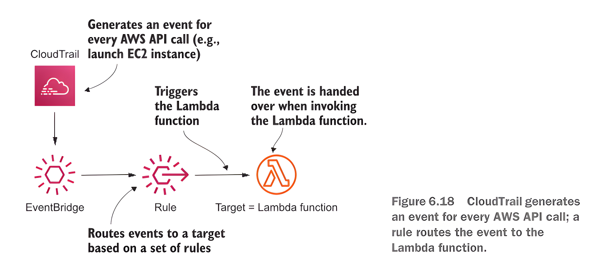
</div>

Jab aap naya EC2 instance banate hain, toh aap AWS ko ek API call bhejte hain (`RunInstances`). Is ke baad step-by-step yeh hota hai:

```
[ User Launches EC2 ] ──> [ CloudTrail Logs API Call ] ──> [ EventBridge ] ──> [ EventBridge Rule ] ──> [ Lambda Target ]

```

#### Figure 6.18 Detail Breakdown:

* **1. CloudTrail:** AWS API call ko detect karke ek event generate karta hai.
* **2. EventBridge:** Event ko receive karta hai.
* **3. Rule (Filter):** Rule check karta hai ke "Kya yeh event EC2 launch karne ka hai?" Agar haan, toh rule event ko aage bhej deta hai.
* **4. Target (Lambda Function):** Rule event ka poora data JSON format mein Lambda function ko thama deta hai aur usay trigger kar deta hai.

---

## Listing 6.1 Event generated by CloudTrail when launching an EC2 instance

Jab bhi koi banda EC2 instance launch karta hai, CloudTrail ek JSON file ki shakal mein event generate karta hai.

Neeche diye gaye event JSON code mein hamari zaroorat ki mukhya (main) cheezein yeh hain:

* **`detail-type`**: Event batata hai ke yeh CloudTrail API call se aaya hai.
* **`source`**: Event ki jagah (`aws.ec2`).
* **`eventName`**: **`RunInstances`** (Yeh confirm karta hai ke naya EC2 instance launch hua hai).
* **`userIdentity`**: Kis user ne API call ki?
* **`responseElements`**: AWS API ne wapsi par kya data diya? Is mein se humein **`instanceId`** milti hai taake hum us par tag laga sakein.

```json
{
  "version": "0",
  "id": "2db486ef-6775-de10-1472-ecc242928abe",
  "detail-type": "AWS API Call via CloudTrail",
  "source": "aws.ec2",
  "account": "XXXXXXXXXXXX",
  "time": "2026-07-20T21:43:00Z",
  "region": "us-east-1",
  "resources": [],
  "detail": {
    "eventVersion": "1.08",
    "userIdentity": {
      "type": "IAMUser",
      "principalId": "XXXXXXXXXXXX",
      "arn": "arn:aws:iam::XXXXXXXXXXXX:user/myuser",
      "accountId": "XXXXXXXXXXXX",
      "accessKeyId": "XXXXXXXXXXXX",
      "userName": "myuser"
    },
    "eventTime": "2026-07-20T21:43:00Z",
    "eventSource": "ec2.amazonaws.com",
    "eventName": "RunInstances",
    "awsRegion": "us-east-1",
    "sourceIPAddress": "109.90.107.17",
    "userAgent": "aws-cli/2.15.0 Python/3.11.0",
    "requestParameters": {
      "[...]": ""
    },
    "responseElements": {
      "requestId": "d52b86c7-5bf8-4d19-86e8-112e59164b21",
      "reservationId": "r-08131583e8311879d",
      "ownerId": "166876438428",
      "groupSet": {},
      "instancesSet": {
        "items": [
          {
            "instanceId": "i-07a3c0d78dclcb505",
            "imageId": "ami-01893222c83843146",
            "[...]": ""
          }
        ]
      }
    },
    "requestID": "d52b86c7-5bf8-4d19-86e8-112e59164b21",
    "eventID": "8225151b-3a9c-4275-8b37-4a317dfe9ee2",
    "readOnly": false,
    "eventType": "AwsApiCall",
    "managementEvent": true,
    "recipientAccountId": "XXXXXXXXXXXX",
    "eventCategory": "Management"
  }
}

```

### JSON Code Ka Aasan Step-by-Step Breakdown:

1. **`detail.userIdentity.userName` (`myuser`):** Yahan se humein user ka naam milta hai jis ne instance launch kiya. Is ko hum Tag value mein use karenge!
2. **`detail.eventName` (`RunInstances`):** Yeh AWS API ki specific command hai jo EC2 instance launch karne ke liye use hoti hai.
3. **`detail.responseElements.instancesSet.items[0].instanceId` (`i-07a3c0d78dclcb505`):** Yeh us naye banne waale EC2 instance ka unique ID number hai. Lambda is ID ko use karke isi instance par tag lagaye ga.

---

## Listing 6.2 The pattern to filter events from CloudTrail

EventBridge ke paas hazaron events aa rahe hote hain. Hum chahte hain ke humara Lambda function **sirf aur sirf** tabhi chale jab naya EC2 instance launch ho. Is ke liye hum ek **Event Pattern (Filter)** likhte hain.

Yeh Filter Ek Channi (Sieve) Ki Tarah Kaam Karta Hai:

```json
{
  "source": [
    "aws.ec2"
  ],
  "detail-type": [
    "AWS API Call via CloudTrail"
  ],
  "detail": {
    "eventSource": [
      "ec2.amazonaws.com"
    ],
    "eventName": [
      "RunInstances"
    ]
  }
}

```

### Listing 6.2 Filter Pattern Ka Breakdown:

* **`source`: `["aws.ec2"]**` ──> Sirf EC2 service se aane wale events ko pass hone do.
* **`detail-type`: `["AWS API Call via CloudTrail"]**` ──> Sirf un events ko pakro jo CloudTrail ne API calls se record kiye hon.
* **`detail.eventSource`: `["ec2.amazonaws.com"]**` ──> Double confirm karta hai ke API call EC2 service ke liye hi thi.
* **`detail.eventName`: `["RunInstances"]**` ──> Sirf aur sirf `RunInstances` call par filter lagata hai. Agar koi EC2 stop ya terminate karega, toh yeh filter usay rok dega aur Lambda trigger nahi hoga.

---

### Summary Of Event Fields

Har Event Pattern mein hum mukhya taur par 2 buniyaadi fields hamesha specify karte hain:

* **`source`**: Jis service ne event banaya us ka namespace (e.g., `aws.ec2`).
* **`detail-type`**: Event ki detail category.

Hum ne successfully yeh decide kar liya hai ke kaun sa event humare Lambda function ko jagaye ga (trigger karega). Next hum is Lambda function ke actual Python code ko implement karenge!

---

## Implementing the Lambda function in Python

EC2 instance par us ke owner (banaane wale user) ka naam automatically Tag karne ke liye humein bohat lamba-choura code likhne ki zaroorat nahi hai. Yeh kaam sirf **10 lines se bhi kam Python code** mein ho jata hai.

Lambda ka programming model har language ke liye ek khas structure (dhaancha) follow karta hai. Chahe aap C#/.NET Core, Go, Java, JavaScript/Node.js, Python, ya Ruby use kar rahe hon, basic tareeqa-e-kaar ek jaisa hi rehta hai.

Python mein Lambda function banane ke liye pehle us ke basic structure ko samajhna zaroori hai.

---

### Listing 6.3 Lambda function written in Python

Neeche Lambda function ka basic Python structure diya gaya hai:

```python
# Python function ka naam, jise AWS Lambda 'function handler' ke taur par reference karta hai.
def lambda_handler(event, context):
    # Is function ke andar hum apna actual logic likhte hain.
    
    return # Function execution khatam karne ke liye return use hota hai.
```

#### Code Ka Structure Breakdown:

* **`lambda_handler` (Entry Point):** Yeh aap ke code ka mukhya (main) darwaza hai. Jab bhi Lambda trigger hota hai, AWS sab se pehle is `lambda_handler` function ko dhoond kar call karta hai.
* **`event` Parameter:** Yeh ek Python Dictionary (JSON format) hota hai. AWS jab bhi Lambda ko jagata hai, toh wo saara relevant data (jaise CloudTrail se aaya hua EC2 launch event data) is `event` variable ke andar daal kar bhejta hai.
* **`context` Parameter:** Is parameter ke andar Lambda execution environment ki information hoti hai (jaise function ka naam, memory size, aur timeout hone mein kitna time bacha hai).
* **`return`:** Function ki execution ko khatam karta hai.
* **Asynchronous Invocation Note:** Kyunki humara Lambda function EventBridge ke event se **asynchronously** (background mein) chal raha hai, is liye event bhejne wala system kisi wapsi (return value) ka wait nahi kar raha hota. Is wajah se yahan koi value return karna zaroori nahi hai.


---

### Where is the code located?

Book ka tamam code official GitHub repository par maujood hai:

* **Repository Link:** `[https://github.com/AWSinAction/code3](https://github.com/AWSinAction/code3)`
* **Directory:** `chapter06` folder mein is example ke liye saari zaroori files maujood hain.

---

### Time to write some Python code!

Ab hum apna actual Python script likhte hain jo CloudTrail event se EC2 launch hone ki khabar receive karega, user ka naam aur instance ID nikale ga, aur EC2 par `Owner` tag laga dega.

#### Boto3 SDK Kya Hai?

Python ke zariye AWS services se baat karne ke liye hum AWS ka official SDK use karte hain jiska naam **`boto3`** hai. AWS Lambda ke Python runtime environment mein `boto3` pehle se **built-in (pre-installed)** hota hai, is liye aap ko isay alag se install karne ki zaroorat nahi parti.

---

### Listing 6.4 Lambda function adding a tag to EC2 instance

Neeche modern Python standards ke sath complete script ka code aur us ka detailed breakdown diya gaya hai:

```python
import boto3

# EC2 service se baat karne ke liye AWS SDK client banana
ec2 = boto3.client('ec2')

def lambda_handler(event, context):
    # Debugging ke liye aane wale CloudTrail event ko CloudWatch Logs mein print karna
    print(event)
    
    # CloudTrail event ke ARN se user ka naam extract karna
    user_arn = event['detail']['userIdentity']['arn']
    if "/" in user_arn:
        user_name = user_arn.split('/')[1]
    else:
        user_name = user_arn
        
    # CloudTrail event se naye EC2 instance ki ID extract karna
    instance_id = event['detail']['responseElements']['instancesSet']['items'][0]['instanceId']
    
    print(f"Adding owner tag {user_name} to instance {instance_id}.")
    
    # EC2 instance par 'Owner' Key aur User Name ki Value ka Tag lagana
    ec2.create_tags(
        Resources=[instance_id],
        Tags=[
            {
                'Key': 'Owner',
                'Value': user_name
            }
        ]
    )
    
    return
```

---

### Code Ka Step-by-Step Breakdown

Aayein is code ki ek ek line aur logic ko bacho ki tarah aasan karke samajhte hain:

#### 1. SDK Client Initialization (`import boto3` & `ec2 = boto3.client('ec2')`)

* Pehle hum ne `boto3` library import ki.
* `ec2 = boto3.client('ec2')` ke zariye hum ne EC2 service ke sath connection banane ka ek client tayyar kiya.
* **Design Decision:** Hum ne client ko `lambda_handler` function ke **bahar** banaya hai. Is ka fayda yeh hota hai ke jab Lambda baar baar chalta hai (**Warm Start**), toh client ko dobara initialize nahi karna parta, jis se execution fast ho jati hai.

#### 2. User Name Extract Karne Ka Logic

AWS mein har user ka ek unique **ARN (Amazon Resource Name)** hota hai, jaise:
`arn:aws:iam::123456789012:user/Hashim`

* **`user_arn = event['detail']['userIdentity']['arn']`**: Code event JSON ke andar ja kar user ka ARN read karta hai.
* **`if "/" in user_arn:`**: ARN mein `/` hota hai. Code check karta hai ke agar slash maujood hai, toh `split('/')[1]` ke zariye slash ke baad waala hissa yani sirf clean naam (`Hashim`) alag kar leta hai.
* **`else`**: Agar ARN mein slash na ho (jaise root user case mein), toh poora ARN hi `user_name` variable mein save kar leta hai.

#### 3. Instance ID Extract Karne Ka Logic

CloudTrail ka JSON data bohot gehra (nested) hota hai. Instance ID tak pahunche ke liye code step-by-step path follow karta hai:
`event['detail']['responseElements']['instancesSet']['items'][0]['instanceId']`

* Yeh logic specific path par ja kar naye banne wale EC2 instance ka ID number (e.g., `i-07a3c0d78dclcb505`) chun leta hai.

#### 4. Tag Lagane Ka Action (`ec2.create_tags(...)`)

User Name aur Instance ID milne ke baad, Boto3 SDK ka `create_tags` function call hota hai:

* **`Resources=[instance_id]`**: Batata hai ke kis specific EC2 instance par tag lagana hai.
* **`Tags=[{'Key': 'Owner', 'Value': user_name}]`**: Batata hai ke tag ki Key `'Owner'` honi chahiye aur Value extract kiya gaya user name (e.g., `'Hashim'`) hona chahiye.

---
