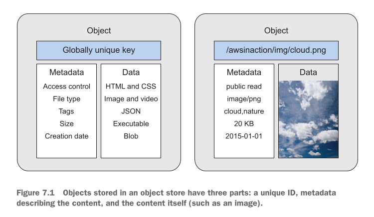
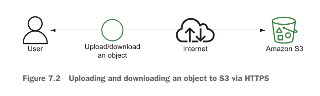
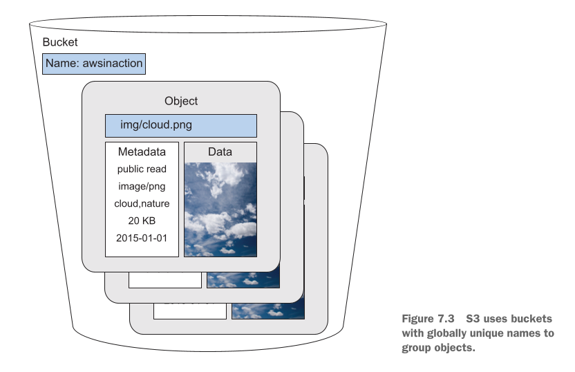
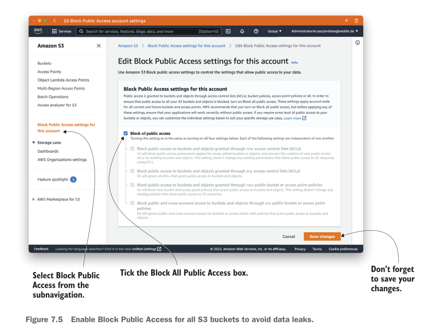
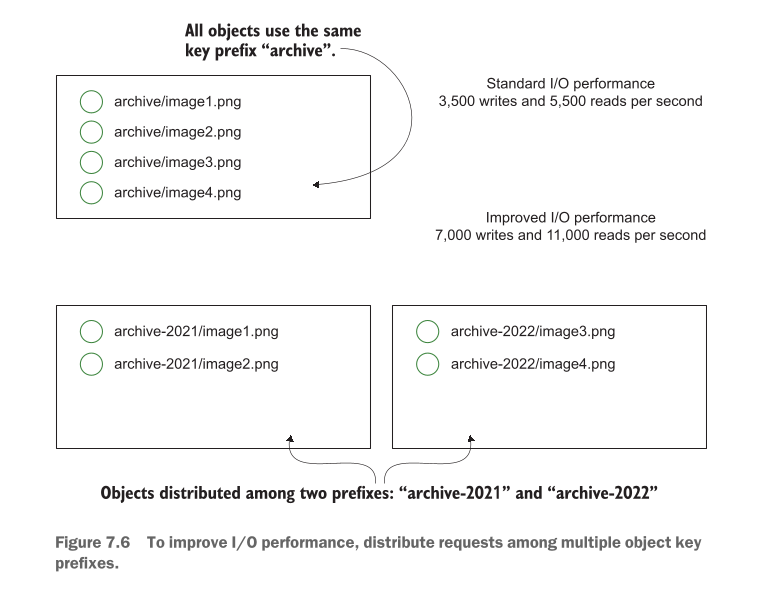

# Storing your objects: S3

## Data Storage Ke Do Bade Tachalish (Two Challenges)

Data ko sambhal kar rakhna (store karna) aasan kaam nahi hai. Is mein do bohot badi mushkilaat aati hain:

* **Ever-increasing volumes of data (Data ka lagataar barhna):**
* **Bacho ki tarah samjhein:** Farz karein aap ke paas khilono ka ek chota dabba hai. Roz aap naya khilona khareedte hain. Ek din dabba poora bhar jayega! Ab naye khilonay rakhne ke liye dabba chota par jayega. Exactly waise hi, kisi ek computer ya server ki hard disk limited hoti hai. Roz aane wali videos, photos aur files itni zyada hoti hain ke ek machine ki disk bhar jati hai.


* **Ensuring durability (Data ko hamesha ke liye safe rakhna):**
* **Bacho ki tarah samjhein:** Agar aap ne apni sari zaroori drawings usi ek dabbe mein rakhi hain, aur wo dabba paani mein gir jaye ya usay aag lag jaye, toh sab kuch hamesha ke liye zaya ho jayega. Single machine par data rakhne se agar wo hard disk kharab ho jaye, toh data wapas nahi milta. Isay hum **Single Point of Failure** kehte hain.


### Distributed Data Store: Revolutionary Solution

In dono mushkilaat ko hal karne ke liye writer ek naya tareeqa batata hai: **Distributed Data Store**.

* Ek akeli machine ke bajaye, hum hazaron computers ko aapas mein network ke zariye jod dete hain.
* **Unlimited Storage:** Jab data barhta hai, hum network mein mazeed machines add kar dete hain. Space kabhi khatam nahi hoti.
* **High Durability (Data Loss ka khatma):** Aap ki file kisi ek computer par nahi, balkay alag alag machines par copy karke rakhi jati hai. Agar ek computer kharab bhi ho jaye, toh aap ka data doosre computers par safe rehta hai.

---

## Amazon S3 Ka Ta'aruf (Introduction to Amazon S3)

AWS humein **Amazon S3 (Simple Storage Service)** deta hai, jo ek **fully managed, distributed object store** hai.

* **Fully Managed ka matlab:** Aap ko peeche wale servers, disks, ya hardware ko khud setup ya repair nahi karna parta—AWS sab kuch khud sambhalta hai.
* **Kiya store kar sakte hain?** Images, videos, PDF documents, installation files (.exe), backup files, wagera.
* **Writer ke bataye gaye main Use Cases:**
1. **Data Backups:** Apne zaroori data ki copy safe rakhna.
2. **Low-cost Archiving:** Purana data jo roz istemal nahi hota (jaise saalon purane records), usay kam qeemat par lambe arse ke liye store karna.
3. **User-Generated Content:** Applications mein users jo photos/videos upload karte hain unhe sambhalna.
4. **Static Website Hosting:** Direct S3 se bina kisi EC2 server ke HTML, CSS aur JavaScript wali websites chalana.


---

## Not all examples are covered by the Free Tier

Writer yahan ek zaroori maali (financial) hidayat de raha hai:

* **Free Tier ki Hadaayat:** AWS ka ek free plan hota hai, lekin is chapter ki tamam practical examples free nahi hain. Kuch cheezon par chote-mote charges lag sakte hain.
* **Cost Warning System:** Jab bhi koi aisi example aayegi jiss se paise kat sakte hon, writer pehle se ek **Warning Message** dikhaye ga.
* **Paisa Bachane ka Tareeqa:** Agar aap instructions ko sahi tarah follow karein aur kisi bhi practical ko khatam karne ke baad resources ko zyada din tak chalne na dein (delete kar dein), toh aap par koi extra charges nahi aayenge.

---

## What is an object store?

### Purana Tarika (Traditional Hierarchy / File System) vs Object Store

* **Traditional File System (Purana Tarika):** Pehle hum data ko folders aur sub-folders ke andar rakhte thay (jaise `C:\Documents\Photos\2026\pic.jpg`). Lekin jab billions of files ho jayein, toh folders ke andar file dhoondna system ko slow kar deta hai.
* **Object Store (Naya Tarika):** Object Store mein koi traditional folder tree nahi hota. Yahan har data item ko ek **Object** bana kar ek flat space mein daal diya jata hai.

---

## Object Ke 3 Main Hissay (Components)

Writer ke mutabiq, Object Store mein har Object ke **3 hissey** hote hain:

1. **Globally Unique Identifier (GUID / Key):** Object ka unique naam ya address.
2. **Metadata:** Object ke baare mein maloomat (Data about data).
3. **Data itself:** Actual file content.

---

## Figure 7.1 Ka Step-by-Step Breakdown

Writer ne **Figure 7.1** mein Object ke structure ko do hisson mein divider karke samjhaya hai:

<div align="center">
  
</div>

### 1. Globally Unique Identifier (GUID / Key)

* Yeh object ka unique name ya path hota hai.
* Is key ke zariye aap network par kisi bhi machine se is specific object ko dhoond sakte hain.
* *Example (Figure 7.1 ke mutabiq):* `/awsinaction/img/cloud.png`

### 2. Metadata (Data About Data)

Metadata ka matlab hai file ki apni maloomat ya properties. Writer ne is ki yeh misalein di hain:

* **Date of last modification / Creation date:** File kab bani ya update hui (e.g., `2015-01-01`).
* **Object size:** File ka size kitna hai (e.g., `20 KB`).
* **Object's owner / Access Control:** File ka malik kaun hai aur kis ke paas parhne/dekhne ki permission hai (e.g., `public read`).
* **Object's content type / File type:** Data ki kisam kya hai (e.g., `image/png`). Is se browser ko pata chalta hai ke file ko kaise open karna hai.
* **Tags:** Searching aur organization ke liye lagaye gaye labels (e.g., `cloud, nature`).

### 3. Data (Actual Content)

* Yeh wo asal file hoti hai jo aap save kar rahe hain.
* Is mein HTML/CSS code, images, videos, JSON documents, executable programs (.exe), ya koi bhi raw binary data (Blob) ho sakta hai.

---

## Metadata Request Ka Bada Faida (HEAD Request Concept)

Writer ek bohot aham architectural advantage batata hai:

* **Concept:** Aap poori file (Data) ko download kiye bina, **sirf uska Metadata request kar sakte hain**.
* **Bacho ki tarah samjhein:** Farz karein aap ke paas 5 GB ki ek bari video file S3 par parhi hai. Aap sirf yeh check karna chahte hain ke file kitni bari hai ya aakhri baar kab change hui thi.
* **Faida:** Agar aap ko metadata ke liye bhi poori 5 GB file download karni pare, toh aap ka internet aur waqt zaya hoga. Object store mein aap bina main file download kiye sirf 1 KB ka metadata mangwa kar saari info hasil kar sakte hain. Is se bandwidth bachti hai aur speed bohot fast ho jati hai.

---

## 2026 Modern AWS S3 Context (Updated Architecture)

Modern AWS S3 environment mein in concepts se judi chand zaroori baatein:

* **Strong Consistency:** S3 ab **Strong Read-After-Write Consistency** provide karta hai. Yani jaise hi aap koi naya object write ya update karte hain, usi millisecond mein har reader ko updated data hi milta hai.
* **Automatic Encryption:** Modern S3 buckets mein tamaam naye objects server-side encryption (`SSE-S3`) se automatically encrypted hote hain.
* **Performance & Classes:** High performance analytics ke liye ab *S3 Express One Zone* (single-digit millisecond speed) aur ultra-low-cost archiving ke liye *S3 Glacier Deep Archive* jaise modern storage classes available hain.

---

## Amazon S3

AWS S3 cloud computing ki dunya ka sab se mashhoor aur bunyadi pillar hai. Aayein is pure text ko choti se choti bareeki ke sath step-by-step aur bacho ki tarah aasan karke samajhte hain.

---

### Amazon S3 Kya Hai?

* **Full Form / Acronym:** S3 ka matlab hai **S**imple **S**torage **S**ervice (Teen 'S' hone ki wajah se isay **S3** kaha jata hai).
* **Sab Se Purani Service:** Yeh AWS ki sab se pehli aur purani services mein se ek hai jo 2006 mein launch hui thi.
* **Distributed Web Service:** Yeh ek aisi storage service hai jo internet ke zariye chalne wali **HTTPS APIs** par kaam karti hai. Is mein aap ka data kisi ek computer par nahi, balkay hazaron distributed servers par rakha jata hai.

> **Bacho ki tarah samjhein:**
> Amazon S3 ko cloud ke andar ek **"Jadui Digital Tijori" (Digital Vault)** samjhein. Jaise aap apne ghar ke khilonay dabba mein daal kar rakh dete hain, waise hi aap apni saari digital files (photos, videos, code) is tijori mein daal sakte hain. Internet ke zariye aap duniya ke kisi bhi kone se is tijori ko khol kar apna data nikal ya daal sakte hain.

---

### Writer Ki Di Gayi Real-World Examples (Use Cases)

Writer ne S3 ke **4 aham real-world istemal (use cases)** bataye hain:

1. **Static Website Content Deliver Karna:**
* **Writer ki Example:** Writer batata hai ke unka apna blog (`[https://cloudonaut.io](https://cloudonaut.io)`) S3 par hosted hai.
* **Asaan Samjh:** S3 par aap HTML, CSS, JavaScript, aur images rakh kar poori ki poori static website chala sakte hain. Is ke liye aap ko kisi mehnge EC2 server ki zaroorat nahi parti.


2. **Data Ka Backup Rakhna:**
* **Writer ki Example:** Aap apne personal computer ki photo library ko **AWS CLI** (Command Line Interface) ki madad se S3 par safely upload/backup kar sakte hain.


3. **Data Lakes (Analytics Ke Liye Structured Data Store Karna):**
* **Writer ki Example:** System performance benchmark ke jo JSON result files hote hain, unhe S3 par store karke analytics tools ke zariye analysis kiya ja sakta hai.


4. **User-Generated Content Store Karna:**
* **Writer ki Example:** Writer ne ek web application banayi—**AWS SDK** ki madad se—jo users ki upload ki hui files ko direct S3 par store karti hai. (Jaise Facebook ya WhatsApp par jab aap photo upload karte hain).


---

### Storage Limits, Performance, aur Pricing Rules

Writer S3 ke kuch bohot aham technical rules aur costs ke baare mein batata hai:

* **Virtually Unlimited Storage Space:**
* S3 mein kul (total) kitna data rakha ja sakta hai? Is ki koi limit nahi hai! Aap Petabytes ya Exabytes data bhi store kar sakte hain.


* **Single Object Size Limit (5 TB Rule):**
* S3 mein aap unlimited data rakh sakte hain, *lekin* **ek single file (object) ka maximum size 5 TB (Terabytes)** se zyada nahi ho sakta. Agar koi file 5 TB se badi ho, toh usay ek baar mein upload nahi kiya ja sakta.


* **High Availability & Durability:**
* S3 aap ke data ko ek se zyada data centers (Availability Zones) mein copy karke rakhta hai, taake agar koi ek server jal bhi jaye, toh aap ka data hamesha safe rahe (99.999999999% durability).


#### Pricing (S3 Ka Bill Kaise Banta Hai?)

Writer batata hai ke S3 bilkul free nahi hai, is mein 3 cheezon ke paise kat-te hain:

1. **Per GB Storage:** Jitne Gigabytes data aap S3 mein mahine bhar ke liye rakhte hain.
2. **Per Request Cost:** Data par hone wale har action ke paise (e.g., File upload karna = `PUT` request, file download karna = `GET` request).
3. **Data Transfer Out:** S3 se internet par data bahar nikalne (download karne) ki bandwidth cost.

---

### S3 Ko Access Karne Ke 4 Main Tareeqay

Aap S3 ke sath 4 different tariqon se communicate kar sakte hain:

* **1. AWS Management Console:** Browser ke andar AWS ka visual dashboard.
* **2. AWS CLI (Command Line Interface):** Terminal ya Command Prompt par commands likh kar.
* **3. AWS SDKs:** Programming languages (Python, Node.js, Java, C#) ke code ke andar se.
* **4. Third-Party Tools:** Desktop applications (jaise Cyberduck ya CloudBerry).

---

### Figure 7.2 Ka Step-by-Step Breakdown

Writer ne **Figure 7.2** mein S3 ke sath data transfer ka basic flow dikhaya hai:

<div align="center">
  
</div>

* **Figure Flow:**
`User` $\longleftrightarrow$ `Upload/download an object` $\longleftrightarrow$ `Internet` $\longleftrightarrow$ `Amazon S3`
* **Explanation:**
* User chahe Management Console use kare, CLI, ya koi app—har file transfer **Internet** ke zariye hoti hai.
* Security ke liye yeh poora communication **HTTPS (SSL/TLS Encryption)** protocol ke zariye hota hai, taake raste mein koi aap ka data steal ya read na kar sake.


---

### What is an S3 Bucket? (Grouping Objects)

Writer ab S3 ke main organizational unit **Bucket** ko samjhata hai.

* **Bucket Kya Hai?** S3 mein objects ko seedha aise hi khula nahi rakha jata. Objects ko group karne aur organize karne ke liye pehle ek container banaya jata hai jise **Bucket** kehte hain.
* **Bacho ki tarah samjhein:**
Bucket ko ek **"Bada Dabba" ya "Shopping Bag"** samjhein. Jab aap bazar se items khareedte hain, toh pehle ek bag lete hain aur phir sara saman us bag ke andar daalte hain. Bag = Bucket, aur saman = Objects.

```
+-------------------------------------------------------------+
|                     AMAZON S3 BUCKET                        |
|                  (Name: awsinaction)                        |
|                                                             |
|   +-----------------------+     +-----------------------+   |
|   | Object 1              |     | Object 2              |   |
|   | Key: img/cloud.png    |     | Key: docs/file.pdf    |   |
|   | Metadata: 20 KB       |     | Metadata: 1 MB        |   |
|   | Data: [ Image ]       |     | Data: [ PDF Document ]|   |
|   +-----------------------+     +-----------------------+   |
+-------------------------------------------------------------+

```

#### Globally Unique Name Rule (Bohot Aham Design Decision)

Writer ek bohot aham shart batata hai: **Bucket ka naam Globally Unique hona zaroori hai.**

* **Globally Unique ka matlab:** Aap jo bucket name select karenge, wo poore AWS network mein (duniya ke kisi bhi AWS account ya kisi bhi region mein) pehle se kisi aur ne use na kiya ho.
* **Bacho ki tarah samjhein:** Jaise dunya mein har insaan ka Passport Number ya CNIC unique hota hai, ya Instagram par ek username ek hi bande ko milta hai—waise hi S3 Bucket ka naam poori dunya mein sirf ek hi ho sakta hai.
* **Wajah (Architectural Reason):** S3 bucket ko internet par ek web address (`[https://bucket-name.s3.amazonaws.com](https://bucket-name.s3.amazonaws.com)`) milta hai. Kyun ke internet par do alag alag websites ka address same nahi ho sakta, is liye bucket name ka unique hona lazmi hai.

---

### Figure 7.3 Ka Step-by-Step Breakdown

Writer ne **Figure 7.3** mein Bucket aur us ke andar parhe hue Objects ke rishte ko visualize kiya hai:

<div align="center">
  
</div>

* **Figure Flow Breakdown:**
* **Outer Container (The Bucket):** Ek bada dabba hai jis ka unique naam rakha gaya hai: `awsinaction`.
* **Inner Contents (The Objects):** Is bucket ke andar multiple objects stacked hain.
* **Object Internal Architecture:** Figure mein ek object ko khol kar dikhaya gaya hai jis ki key `/img/cloud.png` hai. Us ke do parts hain:
1. **Metadata Side:** Object ki properties jaise `public read` permission, `image/png` type, `cloud,nature` tags, `20 KB` size, aur `2015-01-01` date.
2. **Data Side:** Content itself (Aasman aur badalon wali actual image file).


---

### 2026 Modern AWS S3 Architecture Standards

Modern cloud architecture ke mutabiq in points par dhyan dena zaroori hai:

* **Block Public Access (By Default On):** Modern S3 buckets banate waqt AWS security ke liye **Block Public Access** ko default taur par On rakhta hai, taake tiyaari mein koi private data publically leak na ho jaye.
* **Access Control Lists (ACLs) vs Bucket Policies:** Figure 7.3 mein metadata ke andar `public read` (ACL) dikhaya gaya hai. Modern 2026 practice mein ACLs ko disable kar diya jata hai aur permissions ko manage karne ke liye **S3 Bucket Policies** aur **IAM Policies** ka istemal kiya jata hai.
* **Default Encryption:** Ab har naya S3 bucket server-side encryption (**SSE-S3**) se automatically encrypt hota hai bina kisi extra cost ya manual setup ke.

---

## Backing up your data on S3 with AWS CLI

Data ka backup lena kisi bhi IT system ka sab se zaroori hissa hota hai. Agar aap ka data sirf aap ke apne computer par hai aur wo computer kharab ho jaye, chori ho jaye, ya koi qudrati aafat (jaise zalaala ya seelaab) aa jaye, toh aap ka tamam data hamesha ke liye khatam ho sakta hai.

### Offsite Backup Kya Hota Hai?

* **Offsite Backup ka matlab:** Apne data ki copy apne ghar ya office se door kisi doosri mehfooz jagah (jaise AWS Data Center) par rakhna.
* **Bacho ki tarah samjhein:** Farz karein aap ne ek bohot pyari painting banayi. Agar aap usay sirf apne kamre mein rakhenge aur kamre mein paani gir jaye toh painting kharab ho jayegi. Lekin agar aap us ki ek photo khinch kar apne kisi dost ke ghar bhi rakh dein, toh aap ke kamre ki painting kharab hone ke bawajood aap ka dost aap ko wo photo wapas de sakta hai. S3 bilkul wahi dost hai!

S3 offsite backup ke liye sab se behtareen jagah hai kyun ke:

1. Aap jitna chahein data rakh sakte hain (Unlimited space).
2. Aap ko pehle se paise nahi dene parte, sirf utne hi paise dene hote hain jitna data aap store karte hain (**Pay-per-use** model).

---

### Writer Ke Bataye Gaye 3 Doosre Scenarios (CLI File Transfer Ke Uses)

Writer batata hai ke CLI se S3 par data bhejnakisi sirf backup ke liye nahi, balkay in teeno kaamon ke liye bhi istemal hota hai:

1. **Coworkers Ya Partners Ke Sath Files Share Karna:** Jab aap ke team members alag alag shataron ya mulkon mein baith kar kaam kar rahe hon, toh S3 par file upload karke unke sath share ki ja sakti hai.
2. **Virtual Machines Ke Artifacts Save Karna:** Server (VM) ko chalane ke liye jo zaruri files, application binaries, libraries, ya configuration files chahiye hoti hain, unhe S3 par store aur retrieve kiya ja sakta hai.
3. **Local Storage Ka Bojh Kam Karna (Outsourcing Storage):** Jo data roz roz istemal nahi hota (Infrequently accessed data), usay apne computer ki hard disk se hata kar S3 par daal dena taake local disk par jagah khali ho jaye.

---

### Step 1: Naya Bucket Banana (`aws s3 mb`)

Sab se pehle humein S3 par ek dabba (Bucket) banana parta hai. Kyun ke Bucket name poori dunya mein unique hona zaroori hai, is liye writer mashwara deta hai ke apne name ya company name ka prefix/suffix istemal karein.

Terminal mein yeh command chalayein:

```bash
aws s3 mb s3://awsinaction-$yourname

```

Writer ki di gayi real command ki example:

```bash
aws s3 mb s3://awsinaction-awittig

```

#### Code Breakdown:

* `aws s3`: Yeh AWS CLI ka S3 module call karta hai.
* `mb`: Is ka matlab hai **Make Bucket** (Naya bucket banao).
* `s3://awsinaction-awittig`: Target bucket ka path.

#### System Behavior & Error Handling:

* Agar name pehle se kisi aur ne liya hua hai, toh AWS aap ko yeh error dega:
`An error occurred (BucketAlreadyExists)`
* **Solution:** Aap ko `$yourname` ki jagah koi aur unique shabd likhna parega (jaise apna naam aur koi number).

---

### Step 2: Local Folder Ka Backup Lena (`aws s3 sync`)

Backup ke liye apne computer se koi aisa folder chunein jiska size **1 GB se kam** ho, taake time bhi kam lage aur Free Tier ki limit bhi cross na ho (jaise Desktop folder).

Command format:

```bash
aws s3 sync $path s3://awsinaction-$yourname/backup

```

Writer ki example:

```bash
aws s3 sync /Users/andreas/Desktop s3://awsinaction-awittig/backup

```

#### Code Breakdown:

* `aws s3 sync`: Yeh command normal copy se zyada hoshiyar hoti hai.
* `$path`: Aap ke local computer ke folder ka address (e.g., `/Users/andreas/Desktop`).
* `s3://.../backup`: S3 bucket ke andar `backup` naam ka folder.

#### `sync` Command Ka Bada Faida (Smart Behavior):

* **Bacho ki tarah samjhein:** Sync command ek smart helper ki tarah kaam karti hai. Pehli baar yeh saari files upload karegi. Lekin agli baar jab aap yeh command chalayenge, toh yeh poore folder ko dubara upload nahi karegi!
* Yeh check karegi ke local folder aur S3 mein kya farq hai, aur **sirf nayi ya badli hui (changed) files ko hi upload karegi**. Is se aap ka internet aur waqt dono bachtay hain.

---

### Step 3: Backup Restore Process Ko Test Karna (`aws s3 cp --recursive`)

Backup lene ke baad usay check karna bohot zaruri hai ke kya zaroorat parne par data wapas download ho sakta hai ya nahi. Is ke liye hum S3 se data apne `Downloads` folder mein download karenge (kabhi bhi original source folder par restore na karein taake original data replace na ho).

Command format:

```bash
aws s3 cp --recursive s3://awsinaction-$yourname/backup $path

```

Writer ki example:

```bash
aws s3 cp --recursive s3://awsinaction-awittig/backup/ /Users/andreas/Downloads/restore

```

#### Code Breakdown:

* `aws s3 cp`: Copy command.
* `--recursive`: Yeh flag AWS ko batata hai ke S3 ke backup folder ke andar jitne bhi sub-folders aur files hain, un sab ko ek saath copy kare.
* `s3://.../backup/`: Direct S3 source path.
* `/Users/andreas/Downloads/restore`: Computer ka destination path jahan files save hongi.

---

## Versioning for objects

By default, S3 bucket mein **Versioning Disabled (band)** hoti hai.

### Versioning Band Hone Par Kya Hota Hai? (The Overwrite Problem)

Writer ek example se samjhata hai:

1. Aap ne `Key A` naam se file daali jismein data tha: `data 1`.
2. Phir aap ne dobara same `Key A` naam se file upload ki jismein naya data tha: `data 2`.
3. Ab jab aap `Key A` ko download karenge, toh aap ko sirf `data 2` milega. **Purana `data 1` hamesha ke liye mita diya gaya hai.**

### Versioning Enable Karne Ka Tareeqa

Agar hum chahte hain ke purani file erase na ho, toh hum Versioning On kar dete hain.

Command:

```bash
aws s3api put-bucket-versioning --bucket awsinaction-$yourname --versioning-configuration Status=Enabled

```

#### Code Breakdown:

* `aws s3api`: S3 ki low-level direct API command call karne ke liye.
* `put-bucket-versioning`: Bucket par versioning features apply karne ki API.
* `--versioning-configuration Status=Enabled`: Bucket mein versioning feature ko **ON** karne ke liye.

#### Versioning Enable Hone Ke Baad Kya Hoga?

* Jab aap `Key A` par `data 2` upload karenge, toh `data 1` delete nahi hoga!
* S3 dono versions ko apne paas sambhal kar rakhega (`Version ID 1` aur `Version ID 2`).
* Aap jab chahein purane version ko bhi wapas download kar sakte hain.

Tamam versions dekhne ke liye command:

```bash
aws s3api list-object-versions --bucket awsinaction-$yourname

```

#### Architectural Trade-off & Cost Warning:

> **Zaroori Baat (Cost Trade-off):** Versioning backup aur archiving ke liye toh zabardast hai, lekin is se **bucket ka size aur bill barhta rehta hai**. Kyun ke har naye version ke paise kat-te hain, agar aap ek 1 GB ki file ko 10 baar modify karenge, toh S3 10 GB ka bill charge karega.

---

### S3 Durability Math (99.999999999%)

Writer S3 ki durability ko bohot hi aasan aur shandar tareeqe se samjhata hai:

* S3 ki Durability **$99.999999999\%$ (11 Nines)** hai.
* **Math Example:** Agar aap S3 par **100,000,000,000 (1 Kharab)** objects/files ek saal ke liye store karein, toh ausatan (on average) poore saal mein sirf **1 single object** zaaya hone ka chance hota hai! Is ka matlab hai data loss hone ka khatra taqriban zero hai.

---

### Step 4: Cleanup - Bucket Delete Karna (`aws s3 rb --force`)

Practical khatam hone ke baad extra charges se bachne ke liye bucket aur us ka data delete karna zaroori hai.

Command:

```bash
aws s3 rb --force s3://awsinaction-$yourname

```

Writer ki example:

```bash
aws s3 rb --force s3://awsinaction-awittig

```

#### Code Breakdown:

* `aws s3 rb`: Is ka matlab hai **Remove Bucket**.
* `--force`: Yeh flag pehle bucket ke andar ki tamaam normal files ko delete karta hai aur us ke baad khali hone par bucket ko delete kar deta hai.

---

## Removing a bucket causes a BucketNotEmpty error

Agar aap ne apni bucket par **Versioning Turn On** ki hui ho, toh CLI se `aws s3 rb --force` command chalane par bucket delete nahi hogi aur terminal par yeh error aayega:

`BucketNotEmpty`

#### Wajah (System Behavior):

CLI ka `--force` flag sirf normal files ko delete karta hai. Lekin jab versioning ON hoti hai, toh files ke purane versions aur **Delete Markers** bucket mein hi reh jatay hain. Is liye AWS bucket ko khali nahi manta aur security ke liye error de deta hai.

---

### Management Console Se Versioned Bucket Ko Completely Delete Karne Ka Step-by-Step Tareeqa

Writer is maslay ka hal AWS Web Browser Dashboard (Management Console) se step-by-step batata hai:

1. **Open Browser:** Apne browser mein AWS Management Console kholain.
2. **Navigate:** Top menu se **S3** service par jayein.
3. **Select Bucket:** Apni banayi hui bucket ko list mein se select karein.
4. **Empty Bucket:** Pehle **Empty** button par click karein, aur confirmation de kar tamam objects aur unke *purane versions* ko permanent delete kar dein.
5. **Exit:** Delete hone ka wait karein aur jab tamam versions saaf ho jayein toh Exit par click karein.
6. **Select Again:** Dubara usi bucket ko select karein.
7. **Delete Bucket:** Ab **Delete** button par click karein aur bucket name type karke confirm kar dein. Bucket mukammal taur par remove ho jayegi.

---

## Archiving objects to optimize costs

S3 par data store karne ki cost ko kam se kam karna cloud architecture ka ek bohot aham hissa hai.

S3 Standard storage par **1 TB data store karne ka kharcha taqriban $23 per month** aata hai. Agar aap ke paas terabytes mein aisa data hai jise aap roz roz istemal nahi karte, toh $23 per month kafi mehnga ho sakta hai. AWS humein **S3 Glacier Storage Classes** deta hai jis se hum **storage cost ko 95% tak kam** kar sakte hain.

> **Bacho ki tarah samjhein:**
> Farz karein aap ke paas bohot purani khilonyon ki kitabein hain jinhe aap roz nahi parhte. Agar aap unhe apne kamre ke samne wale mez (S3 Standard) par rakhenge toh jagah ghiregi aur kamra mehnga parega. Lekin agar aap unhe ghar ke purane store room (Glacier Archiving) mein rakh dein, toh kamre mein jagah khali ho jayegi aur store room ka koi kharcha bhi nahi hoga. Bas jab kitaab chahiye hogi, toh store room se nikalne mein thoda waqt lagega.

---

### Table 7.1 Differences between storing data with S3 and Glacier

Writer ne S3 Standard aur Glacier Archiving storage classes ke darmiyan farq ko samajhane ke liye yeh table diya hai:

| Feature / Metric | S3 Standard | S3 Glacier Instant Retrieval | S3 Glacier Flexible Retrieval | S3 Glacier Deep Archive |
| --- | --- | --- | --- | --- |
| **Storage costs for 1 GB per month in US East (N. Virginia)** | $0.023 | $0.004 | $0.0036 | $0.00099 |
| **Costs for 1,000 write requests** | $0.005 | $0.02 | $0.03 | $0.05 |
| **Costs for retrieving data** | Low | High | High | Very High |
| **Accessibility** | Milliseconds | Milliseconds | 1–5 minutes / 3–5 hours / 5–12 hours | 12 hours / 48 hours |
| **Durability objective** | 99.999999999% | 99.999999999% | 99.999999999% | 99.999999999% |
| **Availability objective** | 99.99% | 99.9% | 99.99% | 99.99% |

#### Table Ka Step-by-Step Breakdown aur Trade-offs:

1. **Storage Costs (Mahana Storage Ka Kharcha):**
* **S3 Standard:** $0.023 per GB (Sab se mehnga).
* **S3 Glacier Deep Archive:** $0.00099 per GB (Sab se sasta—taqriban 95% bachat!).


2. **Costs for 1,000 write requests (Upload/Write Karne Ki Cost):**
* High-tier archiving mein initial write request thodi mehngi hoti hai ($0.05 vs $0.005), lekin long-term storage itni sasti hai ke yeh cost recover ho jati hai.


3. **Costs for retrieving data (Data Wapas Nikalne Ka Kharcha):**
* **S3 Standard:** Low (Data download karna bohot sasta hai).
* **Glacier Classes:** High / Very High (Data ko archive se wapas hot storage mein laana mehnga hota hai).


4. **Accessibility (Data Milne Ka Waqt):**
* **S3 Standard & Glacier Instant Retrieval:** Milliseconds (Palkein jhapakne mein data mil jata hai).
* **Glacier Flexible Retrieval:** Option ke mutabiq 1–5 minutes (Expedited), 3–5 hours (Standard), ya 5–12 hours (Bulk).
* **Glacier Deep Archive:** 12 hours se 48 hours tak ka waqt lagta hai.


5. **Durability & Availability:**
* Saari storage classes mein data ki safety (**Durability**) same hai: **99.999999999% (11 Nines)**. Data kabhi zaya nahi hoga.


---

### The Catch (Trade-offs Aur Sharaait)

Aap soch rahe honge ke agar Glacier itna sasta hai toh hum sara data Glacier mein hi kyun na rakh dein? Writer is ke **do bade trade-offs (sharaait)** batata hai:

1. **Retrieval Cost High Hai (Data Nikalna Mehnga Hai):**
* **Writer ki Example:** Agar aap 1 TB data (jo 1,000 files par mushtamil hai) S3 Glacier Deep Archive mein store karte hain, toh store karne ka kharcha toh kuch cents aayega. Lekin jab aap us 1 TB data ko wapas restore/download karenge, toh aap ko taqriban **$120** ki retrieval fee deni paregi!


2. **Access Immediate Nahi Hai (Waqt Lagta Hai):**
* S3 Standard ki tarah aap button daba kar immediately file download nahi kar sakte. Flexible Retrieval ya Deep Archive se file nikalne mein **1 minute se le kar 48 ghante** tak intazaar karna parta hai.


#### Scenario Example:

Writer ek real-world scenario batata hai: Farz karein aap ko tax ya company ke legal documents 5 saal ke liye archive karne hain. Aap ko pata hai ke agle 5 saalon mein shayad 5 baar bhi is document ki zaroorat na pare. Aise scenario ke liye Glacier Archiving bilkul perfect hai.

---

### Example not covered by Free Tier

* **Cost Warning:** Yeh practical AWS Free Tier mein shaamil nahi hai.
* **Expected Cost:** Is example ko chalanay par aap ka **$1 se bhi bohot kam (chund cents)** kharcha aayega.
* **Instruction:** Extra charges se bachne ke liye practical khatam karne ke baad resources ko 1-2 din ke andar delete kar dein.

---

### Hands-on Practical Breakdown (Step-by-Step CLI Archiving)

#### Step 1: Archiving Ke Liye Naya Bucket Banana

Sub se pehle terminal par ek naya S3 bucket banayein:

```bash
aws s3 mb s3://awsinaction-archive-$yourname

```

Writer ki example:

```bash
aws s3 mb s3://awsinaction-archive-awittig

```

* `aws s3 mb`: Naya S3 bucket create karta hai.

---

#### Step 2: File Ko GLACIER Storage Class Ke Sath Upload Karna

Ab local machine se koi document S3 par upload karein aur us ki storage class `GLACIER` set karein:

```bash
aws s3 cp --storage-class GLACIER $path s3://awsinaction-archive-$yourname/

```

Writer ki example command:

```bash
aws s3 cp --storage-class GLACIER /Users/andreas/Desktop/taxstatement-2022-07-01.pdf s3://awsinaction-archive-awittig/

```

* `--storage-class GLACIER`: Yeh parameter AWS ko batata hai ke is file ko normal S3 Standard mein mat rakho, balkay isay **S3 Glacier Flexible Retrieval** storage class mein direct freeze/archive kar do.

---

#### Step 3: Direct Download Ki Koshish Karna (Failure Step)

Jab file Glacier mein chali jati hai, toh aap usay direct download nahi kar sakte. Check karne ke liye yeh command chalayein:

```bash
aws s3 cp s3://awsinaction-archive-$yourname/$objectkey $path

```

Writer ki example error output:

```text
$ aws s3 cp s3://awsinaction-archive-awittig/taxstatement-2022-07-01.pdf ~/Downloads
warning: Skipping file s3://awsinaction-archive-awittig/taxstatement-2022-07-01.pdf. Object is of storage class GLACIER. Unable to perform download operations on GLACIER objects. You must restore the object to be able to perform the operation.

```

#### System Error Breakdown:

* **Skipping file... Object is of storage class GLACIER:** AWS CLI ne file ko download karne se inkaar kar diya kyun ke file Glacier cold storage mein parhi hai.
* **Solution:** File ko download karne se pehle AWS ko **Restore Request** bhejni padti hai taake AWS us file ki ek temporary copy hot storage mein tayyar kare.

---

#### Step 4: Object Restoration Request Bhejnat (`aws s3api restore-object`)

Normal mode mein Glacier Flexible Retrieval file restore karne mein **3 se 5 ghante** leta hai. Fast testing ke liye hum **Expedited Retrieval** tier use karenge (jis par chand cents extra lagte hain aur file 1 se 5 minute mein mil jati hai):

```bash
aws s3api restore-object --bucket awsinaction-archive-$yourname --key $objectkey --restore-request Days=1,,GlacierJobParameters={"Tier"="Expedited"}

```

Writer ki example command:

```bash
aws s3api restore-object --bucket awsinaction-archive-awittig --key taxstatement-2022-07-01.pdf --restore-request Days=1,,GlacierJobParameters={"Tier"="Expedited"}

```

* `aws s3api restore-object`: Low-level API command jo Glacier object ko unfreeze/restore karne ki request bhejti hai.
* `Days=1`: Restore hui file S3 par kitne din tak download ke liye available rahegi (1 din baad temporary copy delete ho jayegi, asal archived object wahi rahega).
* `GlacierJobParameters={"Tier"="Expedited"}`: Direct instruction ke mujhe file 1-5 minutes ke andar fast speed par chahiye.

---

#### Step 5: Restore Process Ka Status Check Karna (`head-object`)

Restore request bhejane ke baad hum check karenge ke kya file download ke liye tayyar ho chuki hai ya nahi:

```bash
aws s3api head-object --bucket awsinaction-archive-$yourname --key $objectkey

```

#### Phase A: Status Jab Restoration Chal Rahi Ho (Ongoing)

Jab tak file background mein restore ho rahi hoti hai, JSON output aisa dikhta hai:

```json
{
  "AcceptRanges": "bytes",
  "Expiration": "expiry-date=\"Wed, 12 Jul 2023 ...\"",
  "Restore": "ongoing-request=\"true\"",
  "LastModified": "2022-07-11T09:26:12+00:00",
  "ContentLength": 112,
  "ETag": "\"c25fa1df1968993d8e647c9dcd352d39\"",
  "ContentType": "binary/octet-stream",
  "Metadata": {},
  "StorageClass": "GLACIER"
}

```

* `"Restore": "ongoing-request=\"true\""`: Is key ka matlab hai ke AWS abhi backend par file ko cold storage se nikal kar hot storage par la raha hai. Abhi download nahi kar sakte.

#### Phase B: Status Jab Restoration Complete Ho Jaye

1 se 5 minute baad jab aap dobara command chalayenge, toh JSON output change ho jayega:

```json
{
  "AcceptRanges": "bytes",
  "Expiration": "expiry-date=\"Wed, 12 Jul 2023 ...\"",
  "Restore": "ongoing-request=\"false\", expiry-date=\"...\"",
  "LastModified": "2022-07-11T09:26:12+00:00",
  "ContentLength": 112,
  "ETag": "\"c25fa1df1968993d8e647c9dcd352d39\"",
  "ContentType": "binary/octet-stream",
  "Metadata": {},
  "StorageClass": "GLACIER"
}

```

* `"Restore": "ongoing-request=\"false\""`: Is ka matlab hai ke restoration process khatam ho chuka hai aur temporary copy download ke liye bilkul tayyar hai!

---

#### Step 6: Restored Object Ko Download Karna

Ab aap normal `aws s3 cp` command se file download kar sakte hain:

```bash
aws s3 cp s3://awsinaction-archive-$yourname/$objectkey $path

```

File ba-aasaani aap ke local folder (e.g., `~/Downloads`) mein download ho jayegi.

---

### Writer Ki Real-World Example Summary

Writer batata hai ke woh aur unki team apne **MacBooks ka remote backup S3 Glacier Deep Archive par store karte hain**.

* **Reasoning:** Woh apne data ka pehla backup ek local external hard drive par rakhte hain. Is liye AWS cloud se data wapas restore karne ki naubat shayad hi kabhi aaye (sirf tab jab ghar/office mein koi bohot badi aafat aaye aur local hard disk bhi tabaah ho jaye).
* **Design Decision:** Kyun ke data wapas nikalne ke chances $1\%$ se bhi kam hain, is liye S3 Glacier Deep Archive sab se sasta aur behtareen solution hai.

---

### Cleaning up

Practical khatam hone ke baad extra charges se bachne ke liye bucket ko tamam objects ke sath delete kar dein:

```bash
aws s3 rb --force s3://awsinaction-archive-$yourname

```

* `rb`: Remove Bucket.
* `--force`: Pehle andar parhe hue sabhi objects ko delete karta hai aur phir bucket ko mita deta hai.


---

## Storing objects programmatically

Ab tak aap ne dekha ke terminal (CLI) se S3 par backup kaise liya jata hai. Lekin asli software development mein applications (jaise mobile apps ya websites) S3 ke sath direct interact karti hain. Iss process ko hum **Programmatic Storage** kehte hain.

S3 ki poori bunyaad **HTTPS REST API** par hai. Iska matlab hai ke duniya ki koi bhi programming language internet request bhej kar S3 se files upload ya download kar sakti hai.

### AWS SDKs (Software Development Kits)

Har language ke liye khud se HTTPS requests likhna mushkil aur complex hota hai. Is liye AWS mukhtalif languages ke liye tayyar-shuda toolkits deta hai jinhe **SDKs** kaha jata hai:

* C++, Go, Java, JavaScript (Node.js), .NET, PHP, Python (Boto3), aur Ruby.

SDK ke zariye aap apni application se yeh 3 main operations kar sakte hain:

1. **Buckets aur Objects ki list dekhna** (`List`).
2. **Objects aur Buckets ko create, read, update, aur delete karna** (`CRUD operations`).
3. **Objects ki access permissions set karna** (`Access Control`).

---

### Writer Ki Di Gayi 3 Real-World Examples

Writer application mein S3 integration ki 3 aam misalein deta hai:

1. **User Profile Picture Upload:** User apni photo upload karta hai, app usay S3 par store karti hai aur image ko publicly accessible bana kar website par HTTPS link se dikhati hai.
2. **Automated PDF Reports Generate Karna:** Server har mahine ka sales report PDF banata hai, usay S3 par daalta hai, aur jab user ko report chahiye hoti hai toh S3 se fetch karke download karwa deta hai.
3. **App-to-App Data Sharing (Stateless Server Architecture):** Do alag alag applications S3 ke zariye data share karti hain. E.g., *Application A* daily sales ka data JSON format mein S3 par write karti hai, aur *Application B* us JSON file ko S3 se read karke analytics ya graph banati hai.

> **Stateless Server Ka Concept (Bacho Ki Tarah Samjhein):**
> Farz karein aap ek hotel mein kaam karte hain. Agar har waiter guests ka saman apne jeb mein rakhna shuru kar de, toh waiter ke ghar jatay hi guest ka saman ghum jayega! Is ke bajaye, har waiter guest ka saman hotel ke central safety locker (S3) mein daal deta hai. Iss tarah waiter (Server) par koi bojh nahi hota aur wo **stateless** rehta hai— server chahe crash ho jaye ya naya lag jaye, user ka data safe rehta hai.

Writer iss concept ko samjhane ke liye ek simple Node.js web application **Simple S3 Gallery** ki example deta hai.

---

## Installing and getting started with Node.js

Node.js ek aisa execution environment hai jo JavaScript ko browser se bahar (server par) chalane ki ijazat deta hai.

* **Installation:** official website (`[https://nodejs.org](https://nodejs.org)`) se apne Operating System (Windows/Mac/Linux) ke mutabiq package download karke install karein.
* **Verification:** Terminal mein yeh command chala kar check karein ke Node.js sahi install hua hai ya nahi:
```bash
node --version

```


Terminal output mein aap ko version dikhayi dega (jaise `v14.*` ya modern versions jaise `v18.*` / `v20.*`).
* **Writer Ki Book Recommendations:** Agar aap Node.js ko depth mein seekhna chahte hain toh writer ne do resources recommend kiye hain:
* Book: *Node.js in Action (Second Edition)* - Alex Young et al. (Manning, 2017).
* Video Course: *Node.js in Motion* - PJ Evans (Manning, 2018).


---

## Setting up an S3 Bucket

Simple S3 Gallery app ko chalane ke liye pehle S3 par ek khali bucket banana hoga. Terminal par yeh command chalayein:

```bash
aws s3 mb s3://awsinaction-sdk-$yourname

```

* `mb`: Make Bucket command jo `$yourname` ke sath unique bucket register kar degi.

---

## Installing a web application that uses S3

Writer ki code repository GitHub par available hai: `[https://github.com/AWSinAction/code3](https://github.com/AWSinAction/code3)`.

1. Code directory ke andar `/chapter07/gallery/` folder mein jayein.
2. Dependencies install karne ke liye terminal mein yeh command chalayein:
```bash
npm install

```


3. Web application ko start karne ke liye bucket ka naam pass karke server run karein:
```bash
node server.js awsinaction-sdk-$yourname

```


4. Browser kholain aur URL open karein: `http://localhost:8080`.

---

### Figure 7.4 Ka Breakdown (Simple S3 Gallery UI)

**Figure 7.4** mein Simple S3 Gallery app ka user interface (UI) dikhaya gaya hai:

```
+-------------------------------------------------------------------+
|  Simple S3 Gallery                                         _ O X  |
+-------------------------------------------------------------------+
|  Upload                                                           |
|  [ Choose file ] No file chosen                                   |
|  [ Upload ]                                                       |
|                                                                   |
|  Images                                                           |
|  +-------------------------------------------------------------+  |
|  |                                                             |  |
|  |                 [ AWS S3 Cloud Image Data ]                 |  |
|  |                                                             |  |
|  +-------------------------------------------------------------+  |
+-------------------------------------------------------------------+

```

* **Top Section (Upload Form):** User yahan se apne local computer se koi bhi photo choose karke **Upload** button par click karta hai.
* **Backend Flow:** Node.js server AWS SDK ke zariye file le kar S3 bucket mein push kar deta hai.
* **Bottom Section (Images Display Area):** Server S3 bucket mein parhi tamaam images ki list mangwata hai aur unhe direct S3 ke HTTPS link se browser par display karwa deta hai (jaise Figure 7.4 mein aasmaan aur badalon wali image show ho rahi hai).

---

## Reviewing code access S3 with SDK

App ke chalne ke baad, writer code ke main hisson ko breakdown karke samjhata hai ke JavaScript SDK se S3 kaise control hota hai.

---

### UPLOADING AN IMAGE TO S3

Image upload karne ke liye SDK ka `putObject()` function istemal hota hai.

#### Listing 7.1 Uploading an image with the AWS SDK for S3

```javascript
const AWS = require('aws-sdk'); // AWS SDK library ko load karta hai
const uuid = require('uuid');

const s3 = new AWS.S3({ // S3 client object ko configuration ke sath initialize karta hai
  'region': 'us-east-1'
});

const bucket = process.argv[2]; // Command line parameter se bucket name read karta hai

async function uploadImage(image, response) {
  try {
    await s3.putObject({ // S3 API ko putObject call bhejta hai
      Body: image, // Image ka raw binary data
      Bucket: bucket, // Target S3 bucket ka naam
      Key: uuid.v4(), // Unique random filename generate karta hai (e.g., 123e4567-e89b...)
      ACL: 'public-read', // Object ko publically readable banata hai
      ContentLength: image.byteCount, // Image file ka exact size in bytes
      ContentType: image.headers['content-type'] // File type (e.g., image/png ya image/jpeg)
    }).promise();
    
    response.redirect('/'); // Upload hone ke baad homepage par redirect karta hai
  } catch (err) { // Error Handling
    console.error(err);
    response.status(500);
    response.send('Internal server error.'); // Error aane par HTTP 500 status code bhejta hai
  }
}

```

#### Detailed Technical & Code Breakdown:

* `require('aws-sdk')`: AWS SDK module ko script mein import karta hai.
* `new AWS.S3({ 'region': 'us-east-1' })`: Specific AWS region (`us-east-1`) ke sath S3 API client instanciate karta hai.
* `uuid.v4()`: Har file ke liye ek Globally Unique Identifier generate karta hai. Is se yeh faida hota hai ke do users agar same naam ki file (e.g., `photo.jpg`) upload karein, toh wo ek doosre ko overwrite nahi karti.
* `Body: image`: File ka actual binary stream.
* `ACL: 'public-read'`: Object Level Access Control List jo internet par har kisi ko yeh photo dekhne ki permission deti hai.
* `.promise()`: Asynchronous request ko handle karta hai taake Node.js thread block na ho.

> **2026 Modern Architectural Note:**
> Code mein AWS SDK v2 (`aws-sdk`) use hua hai. Modern Node.js applications mein modular **AWS SDK v3** (`@aws-sdk/client-s3`) istemal hota hai jo light-weight hai aur `S3Client` + `PutObjectCommand` ka pattern use karta hai. Is ke ilawa, modern S3 buckets mein default security permissions ki wajha se `ACL: 'public-read'` ki bajaye **Bucket Policies** ya **Presigned URLs** se access diya jata hai.

---

### LISTING ALL THE IMAGES IN THE S3 BUCKET

Bucket mein kaun kaun si images parhi hain, unki list mangwane ke liye SDK ka `listObjects()` function istemal hota hai.

#### Listing 7.2 Retrieving all the image locations from the S3 bucket

```javascript
const bucket = process.argv[2]; // Command line argument se bucket ka naam nikalta hai

async function listImages(response) {
  try {
    let data = await s3.listObjects({ // S3 bucket ke andar maujood objects ki list mangwata hai
      Bucket: bucket // Faqat Target Bucket Name dena zaroori hai
    }).promise();

    let stream = mu.compileAndRender( // HTML template (index.html) ko data ke sath compile karta hai
      'index.html',
      {
        Objects: data.Contents, // Objects ka array jismein 'Key' aur 'Size' metadata hota hai
        Bucket: bucket
      }
    );
    stream.pipe(response); // Render hue HTML page ko browser tak stream kardeta hai
  } catch (err) { // Error Handling
    console.error(err);
    response.status(500);
    response.send('Internal server error.');
  }
}

```

#### Detailed Technical & Code Breakdown:

* `s3.listObjects({ Bucket: bucket })`: S3 API ko request bhejta hai. S3 response mein ek JSON object deta hai jismein `Contents` naam ka array hota hai.
* `data.Contents`: Iss array mein bucket ke tamaam objects ke metadata (jaise Object Key, LastModified date, Size) hote hain. *Dhyan rahe ke iss list request mein actual image data (bytes) download nahi hote, sirf list aati hai.*
* `mu.compileAndRender(...)`: Mustache templating engine ka istemal karke HTML page tayyar karta hai taake array items ko webpage par visually render kiya ja sake.

---

### Listing 7.3 Template to render the data as HTML

HTML template file (`index.html`) mein data ko dikhane ke liye dynamic code use kiya gaya hai:

```html
<h2>Images</h2>
{{#Objects}} <!-- S3 se aaye hue 'Objects' array par loop chalata hai -->
  <p>
    
  </p> <!-- Har Object ki Key aur Bucket name ko URL mein interpolate karke Direct Image URL banata hai -->
{{/Objects}}

```

#### Detailed Template Breakdown:

* `{{#Objects}} ... {{/Objects}}`: Loop structure. Kitni bhi images bucket mein hongi, yeh section utni baar repeat hoga.
* `[https://s3.amazonaws.com/](https://s3.amazonaws.com/){{Bucket}}/{{Key}}`: S3 Object ka direct public HTTPS URL.
* E.g., agar bucket `awsinaction-sdk-hashim` hai aur Key `uuid-1234.png` hai, toh browser direct `[https://s3.amazonaws.com/awsinaction-sdk-hashim/uuid-1234.png](https://s3.amazonaws.com/awsinaction-sdk-hashim/uuid-1234.png)` se image fetch karega.


---

### Cleaning up

Application ka practical complete hone ke baad extra cost se bachne ke liye S3 bucket ko complete delete kar dein. Terminal par yeh command chalayein:

```bash
aws s3 rb --force s3://awsinaction-sdk-$yourname

```

* `--force` parameter bucket ke andar SDK ke zariye upload ki gayi tamaam images ko pehle automatically clear karega aur phir main bucket ko delete karega.


---

## Using S3 for static web hosting

Traditional websites chalane ke liye humein virtual machines (jaise EC2 servers) chalane parte hain. Lekin agar aap ki website **Static** hai, toh aap ko koi server chalane ya maintain karne ki bilkul zaroorat nahi hai. S3 direct aap ki static website ko host kar sakta hai.

### Writer Ki Real-World Example

Writer batata hai ke unhone apna mashhoor blog **Cloudonaut** (`[https://cloudonaut.io](https://cloudonaut.io)`) May 2015 mein shuru kiya tha. Un ke blog posts (jaise *"ECS vs. Fargate"*, *"Advanced AWS Networking"*, aur *"CloudFormation vs. Terraform"*) ko **2,000,000 (20 lakh) se zyada baar parha ja chuka hai**. Itne zyada traffic ke bawajood unhone koi EC2 server nahi chalaya, balkay ek Static Site Generator **Hexo** (`[https://hexo.io](https://hexo.io)`) ke zariye poori website S3 par host ki. Yeh tareeqa bohot sasta, scalable, aur bina kisi maintenance ke chalta hai.

> **Static vs Dynamic Website (Bacho Ki Tarah Samjhein):**
> * **Static Website:** Ek chapi hui kitaab ki tarah hoti hai. Jo text aur pictures HTML, CSS, JavaScript, images (PNG/JPG), ya videos mein likh di gayi hain, wo har visitor ko ek jaisi hi dikhengi. S3 aisi static files ko bina kisi server ke direct internet par dikha sakta hai.
> * **Dynamic Website:** Ek live teacher ki tarah hoti hai jo har student ke sawal ke mutabiq board par naya jawab likhta hai. Dynamic websites mein server-side scripts (PHP, JSP, Python) chalte hain. **S3 par server-side code (jaise WordPress ya PHP) nahi chal sakta.**
> 
> 

---

### S3 Static Web Hosting Ke Main Features

Writer S3 web hosting ke 3 aham features batata hai:

1. **Custom Index Document aur Error Document:** Aap default home page (e.g., `index.html`) aur custom 404 error page set kar sakte hain.
2. **URL Redirects:** Aap purane URL ko naye URL par forward kar sakte hain (e.g., `/img/old.png` ki request ko `/img/new.png` par bhej dena).
3. **Custom Domain Linking:** Aap S3 ke ajeeb se address ke bajaye apna personal domain (e.g., `mybucket.andreaswittig.info`) S3 bucket ke sath jod sakte hain.

---

## Increasing speed by using a CDN

Static content ki loading speed ko tez karne ke liye **CDN (Content Delivery Network)** istemal kiya jata hai.

* **CDN Kaise Kaam Karta Hai?** CDN duniya bhar ke alag alag shahrion mein chote caching servers (nodes/edge locations) laga deta hai. Jab koi user aap ki website kholta hai, toh request S3 tak jane ke bajaye user ke sab se kareebi node se answer hoti hai, jis se website mili-seconds mein khul jati hai.
* **Amazon CloudFront:** AWS ki apni CDN service ka naam **Amazon CloudFront** hai. CloudFront user aur S3 bucket ke beech mein baith kar data serve karta hai.

> **Bacho Ki Tarah Samjhein:**
> Farz karein aap ki original khilonyon ki dabba (S3) America mein hai. Pakistan ka bacha jab khilona mangwayega toh aane mein 10 din lagengi. CDN ka matlab hai ke aap ne Karachi aur Lahore mein bhi dabba ki copies rakh dein. Ab Pakistan ke bache ko 1 minute mein Karachi se hi khilona mil jayega!

---

## Creating a bucket and uploading a static website

Step-by-step website setup karne ke liye pehle S3 bucket banayein aur file upload karein:

### Step 1: Bucket Create Karna

Terminal mein command chalayein:

```bash
aws s3 mb s3://$BucketName

```

* `$BucketName`: Apni pasand ka globally unique name likhein.

---

### Step 2: Placeholder HTML Download aur Upload Karna

Writer ne ek test HTML file tayyar ki hai. Download karne ke baad usay S3 par upload karne ke liye yeh command chalayein:

```bash
aws s3 cp $pathToPlaceholder/helloworld.html s3://$BucketName/helloworld.html

```

#### Code Breakdown:

* `aws s3 cp`: File copy karne ki command.
* `$pathToPlaceholder/helloworld.html`: Aap ke computer ka local file path.
* `s3://$BucketName/helloworld.html`: S3 bucket ka target path jahan file upload hogi.

---

## Configuring a bucket for static web hosting

By default, S3 bucket **100% private** hoti hai aur sirf bucket owner files parh sakta hai. Website chalane ke liye zaruri hai ke dunya ka har banda aap ki HTML files ko read kar sake. Is ke liye hum **Bucket Policy** istemal karte hain.

### Listing 7.4 Bucket policy allowing read-only access to every object in a bucket

Writer ki di gayi JSON policy bucket ke tamaam objects ko public-read permission deti hai:

```json
{
  "Version": "2012-10-17",
  "Statement": [
    {
      "Sid": "AddPerm",
      "Effect": "Allow",
      "Principal": "*",
      "Action": [
        "s3:GetObject"
      ],
      "Resource": [
        "arn:aws:s3:::$BucketName/*"
      ]
    }
  ]
}

```

#### Detailed Policy Breakdown:

* `"Version": "2012-10-17"`: Policy ka standard language version.
* `"Effect": "Allow"`: Access grant/allow kar raha hai.
* `"Principal": "*"`: Asterisk (`*`) ka matlab hai **duniya ka har insaan** (public access).
* `"Action": ["s3:GetObject"]`: Sirf file ko read/download karne ki ijazat (`GetObject`) di ja rahi hai. Data write ya delete karne ki permission nahi hai.
* `"Resource": ["arn:aws:s3:::$BucketName/*"]`: Is policy ka itlaaq bucket ke andar maujood tamaam objects (`/*`) par hoga.

---

### Policy Apply Karna aur Web Hosting Enable Karna

#### Policy Put Command:

```bash
aws s3api put-bucket-policy --bucket $BucketName --policy file://$pathToPolicy/bucketpolicy.json

```

* `put-bucket-policy`: Is CLI command se JSON policy file bucket par attach ho jati hai.

#### Web Hosting Enable Command:

```bash
aws s3 website s3://$BucketName --index-document helloworld.html

```

#### Command Breakdown:

* `aws s3 website`: Bucket ke static web hosting feature ko TURN ON karta hai.
* `--index-document helloworld.html`: AWS ko batata hai ke jab koi user root domain par aaye toh kaun si HTML file show karni hai.

---

## Accessing a website hosted on S3

Configuration ke baad, aap browser ke zariye S3 website endpoint ko access kar sakte hain.

* **S3 Website Endpoint Format:**
Region `us-east-1` ke liye endpoint format yeh hota hai:
`http://$BucketName.s3-website-us-east-1.amazonaws.com`
* **Example:**
Agar bucket ka naam `awesomebucket` hai, toh full URL yeh hoga:
`[http://awesomebucket.s3-website-us-east-1.amazonaws.com](http://awesomebucket.s3-website-us-east-1.amazonaws.com)`

> **System Behavior Note:**
> Ghor karein ke S3 Static Web Hosting ka direct URL hamesha **`http://`** se shuru hota hai (HTTPS nahi hota) aur URL mein **`.s3-website-`** ka shamil hona lazmi hai.

---

## Linking a custom domain to an S3 bucket

S3 ke lamba aur ajeeb URL ke bajaye agar aap apna domain (e.g., `awsinaction.example.com`) use karna chahte hain, toh aap ko apne DNS manager (jaise **AWS Route 53**) mein ek **CNAME record** add karna hota hai jo S3 endpoint ki taraf point kare.

### CNAME Ke 2 Strict Rules (S3 Architecture Constraints)

1. **Bucket Name Must Match Domain Name:**
Bucket ka naam bilkul exact wohi hona chahiye jo aap ka CNAME record name hai.
* *Example:* Agar domain `awsinaction.example.com` hai, toh S3 bucket ka naam bhi **`awsinaction.example.com`** hi rakhna parega.


2. **Primary / Apex Domain Limitation:**
CNAME record primary domains (jaise `example.com`) par kaam nahi karta. Is ke liye subdomain (jaise `[www.example.com](https://www.example.com)` ya `blog.example.com`) istemal karna padta hai. Agar primary domain (`example.com`) link karna ho, toh Route 53 ka special **Alias Record** istemal hota hai.

#### Important HTTP vs HTTPS Trade-off:

* **Limitations:** S3 custom domain hosting **sirf HTTP support karti hai**. Direct S3 custom domain par HTTPS SSL/TLS certificate nahi lag sakta.
* **Modern Solution:** Production websites ke liye **AWS CloudFront** ko S3 ke aage lagaya jata hai. CloudFront browser se HTTPS connection handle karta hai aur backend par S3 se content fetch karta hai.

---

## 2026 Modern AWS S3 Hosting Context

Modern Cloud Security standards ke mutabiq static web hosting ke liye in baaton ka dhyan rakha jata hai:

* **S3 Block Public Access Override:** Pehle bucket par **Block Public Access** settings ko disable karna parta hai, warna S3 Bucket Policy apply hote waqt `Access Denied` error dega.
* **Origin Access Control (OAC):** Modern architectures mein S3 buckets ko publically open karne ki bajaye **Private** rakha jata hai aur **CloudFront + OAC (Origin Access Control)** ke zariye securely content serve kiya jata hai, taake S3 URL direct public par expose na ho.

---

## Cleaning up

Practical complete hone ke baad extra charges se bachne ke liye bucket ko delete kar dein:

```bash
aws s3 rb --force s3://$BucketName

```

* `rb`: Remove Bucket command.
* `--force`: Bucket ke andar ki tamaam HTML/image files ko automatically delete karke bucket ko completely remove kardega.


---

## Protecting data from unauthorized access

Har thode din baad khabron mein yeh sunne ko milta hai ke kisi bari company ya organization ka confidential aur sensitive data Amazon S3 se accidentally leak ho gaya.

### S3 Data Leak Kyun Hota Hai?

Is chapter mein aap ne dekha ke S3 do bilkul mukhtalif (opposite) kaamon ke liye istemal hota hai:

1. **Private Data Store Karna:** Jaise aap ke personal computer ka sensitive backup data.
2. **Public Data Serve Karna:** Jaise aap ki static website ka HTML, CSS, aur images.

> **Bacho ki tarah samjhein:**
> Farz karein aap ke paas ek hi ghar mein do kamre hain. Ek kamre mein aap ka private khazana (sensitive data) hai aur doosre kamre mein dukan (public website) hai. Agar aap dukan ka darwaza kholte waqt ghalti se private khazane wale kamre ka darwaza bhi khula chor dein, toh raste se guzarne wala har banda aap ka khazana nikal sakta hai! S3 mein ghalt configuration ki waja se bilkul yahi hota hai.

---

### Is Khatre Ko Kaise Kam Karein? (Block Public Access)

Is data leak ke risk ko khatam karne ke liye AWS humein **Block Public Access** ka feature deta hai. Writer recommend karta hai ke aap apne poore AWS account level par hi public access ko block kar dein.

#### Account-Level Par Block Public Access On Karne Ke 3 Steps:

1. **Console Open Karein:** AWS Management Console mein jayein aur **S3** service par click karein.
2. **Setting Select Karein:** Left navigation menu se **Block Public Access settings for this account** par click karein.
3. **Block All Enable Karein:** **Block all public access** ke checkbox ko tick karein aur **Save Changes** button par click kar dein.

---

### Figure 7.5 Ka Step-by-Step Breakdown

Writer ne **Figure 7.5** mein S3 Management Console ka screenshot dikha kar is poore process ko clear kiya hai:

<div align="center">
  
</div>


* **Subnavigation Link:** Left menu se direct account-level settings par le jata hai.
* **Block All Public Access Checkbox:** Is ek box ko tick karne se S3 ki chaar alag-alag public access vulnerabilities ek sath block ho jati hain.
* **Save Changes Button:** Setting ko apply karne ke liye click karna lazmi hai, jiske baad AWS confirm karne ke liye modal dikhata hai.

---

### Crucial Trade-off (Ghor Talab Baat)

* **Impact of Account-Level Block:** Agar aap poore account par **Block All Public Access** enable kar denge, toh aap ke account ki **tamaam S3 static websites aur public link access kaam karna band kar dengi**.
* **Flexible Solution:** Agar aap ko apne account mein public websites bhi chalani hain aur private backups bhi rakhne hain, toh account-level par isay turn off rakhein, aur **sirf un individual buckets par Block Public Access turn on karein jin mein sensitive data hai**.

> **Writer Ka Blog Link:** S3 security par mazeed deep advice ke liye writer ne apne blog ka link share kiya hai: `[https://cloudonaut.io/s3-security-best-practice/](https://cloudonaut.io/s3-security-best-practice/)` (*"How to Avoid S3 Data Leaks?"*).

---

## Optimizing performance

By default, Amazon S3 ki performance limits bohot zabardast hoti hain:

* **Max Writes:** $3,500$ writes (PUT, POST, DELETE requests) per second.
* **Max Reads:** $5,500$ reads (GET, HEAD requests) per second.

Lekin agar aap ki application ko is se bhi zyada speed/throughput chahiye (maslan high-traffic apps ya big data processing), toh aap ko object keys ke naming scheme (prefixes) par dhyan dena parega.

---

### Prefix Kya Hota Hai? (S3 Flat Architecture)

S3 mein koi asli physical folders ya directories nahi hoti hain—tamam data ek flat structure mein hota hai. Folders ka ahsaas dilane ke liye hum key name mein slash (`/`) delimiter ka istemal karte hain. Slash se pehle wala hissa **Prefix** kehlata hai.

* **Single Prefix Example:**
* `archive/image1.png`
* `archive/image2.png`
* `archive/image3.png`
* `archive/image4.png`


In tamam files ka prefix **`archive/`** hai.

---

### Performance Bottleneck Rules

AWS S3 ki **$3,500$ writes aur $5,500$ reads per second ki limit har partitioned prefix par lagu hoti hai**.

* **Problem:** Agar aap ki $10,000$ applications ek hi waqt mein `archive/` prefix wali files ko read karne ki koshish karengi, toh S3 maximum $5,500$ requests per second hi handle karega, baki requests slow ya throttle ho jayengi.

---

### Solution: Multiple Prefixes Se Performance Double Karna

Performance ko optimize karne ke liye objects ko alag alag prefixes mein distribute kar diya jata hai.

* **Multi-Prefix Example:**
* `archive/2021/image1.png` (Prefix 1: `archive/2021/`)
* `archive/2021/image2.png` (Prefix 1: `archive/2021/`)
* `archive/2022/image3.png` (Prefix 2: `archive/2022/`)
* `archive/2022/image4.png` (Prefix 2: `archive/2022/`)


> **Bacho ki tarah samjhein:**
> Farz karein ek hi counter (Prefix) par 5,500 log khade hain. Aagay line bohot lamba ho jayegi. Lekin agar aap do alag counters (`2021` aur `2022`) khol dein, toh dono counters par 5,500 - 5,500 log ek sath apna kaam karwa sakte hain!

---

### Figure 7.6 Ka Step-by-Step Breakdown

Writer ne **Figure 7.6** mein prefix partitioning se performance improve karne ka tareeqa dikhaya hai:

<div align="center">
  
</div>


* **Top Box (Single Partition):** Jab tamam objects `archive` prefix share karte hain, toh S3 unhe ek hi partition par rakhta hai. Total limit **$3,500$ writes / $5,500$ reads** par ruk jati hai.
* **Bottom Boxes (Distributed Partitions):** Jab objects ko `archive-2021/` aur `archive-2022/` (ya `archive/2021/` aur `archive/2022/`) mein baant diya jata hai, toh S3 backend par do alag partitions bana deta hai. Is se overall performance double ho kar **$7,000$ writes aur $11,000$ reads per second** tak pohanch jati hai.

---

## Summary

Chapter 7 ke tamam main concepts ka mukammal nichod:

* **Object Store Fundamentals:** Object store mein har file ek object hoti hai jiske 3 hissey hote hain: Unique Identifier (Key), Metadata (file ki properties), aur Actual Content (Data bytes). Is mein images, documents, ya executable files store ki ja sakti hain.
* **Scalability & Pricing:** Amazon S3 virtually unlimited storage capacity deta hai jo **Pay-per-use** model par kaam karti hai. Aap se sirf data store karne aur read/write requests chalane ke paise liye jate hain.
* **Access Methods & Archiving:** S3 sirf HTTP(S) API par kaam karta hai. Isay CLI, SDKs, ya Console se access kiya ja sakta hai. Data ko kam qeemat par lambe arse ke liye store karne ke liye **Glacier Instant Retrieval**, **Glacier Flexible Retrieval**, aur **Glacier Deep Archive** classes munasib hain.
* **Stateless Server Architecture:** S3 ko applications mein integrate karne se server **Stateless** ban jata hai, kyun ke server ko local disk par files save nahi karni partin.
* **Security Standards:** Data leak se bachne ke liye account-level par ya kam se kam sensitive data wali buckets par **Block Public Access** hamesha enable rakhein.
* **Performance Optimization:** High performance aur heavy workloads ke liye hamesha unique key prefixes ka istemal karein taake requests alag alag S3 partitions par spread ho sakein.

---