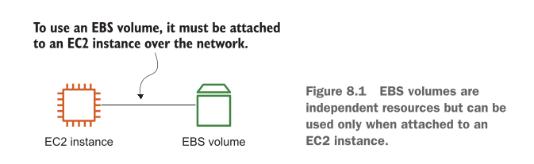

# Storing data on hard drives: EBS and instance store

Aap ke diye gaye text ki mukammal, step-by-step aur aasan Roman Urdu mein deep explanation niche di gayi hai, taake har theoretical aspect aur detail aap ke liye hamesha ke liye clear ho jaye.

---

Aap farz karein ke aap ko ek purana enterprise application (legacy application) AWS cloud par shift (migrate) karna hai jo abhi aap ke apne office ke physical servers (on-premises) par chal raha hai.

Purane zamane ke ziada tar applications files ko read aur write karne ke liye aik **Filesystem** ka istemal karte hain. In purane apps ko direct **Object Storage** (jaise AWS S3) par shift karna hamesha aasan ya mumkin nahi hota, kyunki is ke liye poore application ka code dubara likhna parta hai jo bohot mehenga (expensive) kaam hai.

Isi maslay ke hal ke liye AWS aap ko **Block-level storage** deta hai. Is ka sab se bara faida yeh hai ke aap bina kisi mehengi app-modification ke apna legacy application wese hi AWS par chala sakte hain jaise woh pehle chal raha tha.

---

### What is Block-Level Storage and Filesystem?

Block-level storage ko samajhne ke liye pehle in bunyadi chizon ko samajhna zaroori hai:

* **Disk Filesystem (FAT32, NTFS, ext3, ext4, XFS):** Yeh bilkul aap ke personal computer ki tarah kaam karta hai. Filesystem ka kaam yeh hisab rakhna hota hai ke aap ki konsi file storage mein kis jagah (kis block address par) mehfooz hai.
* **Block:** Block bytes ka ek chota sa sequence (tukda) hota hai. Yeh storage ki sab se choti **addressable unit** hoti hai (yani storage ki sab se choti jagah jiska apna ek khas address hota hai).
* **Operating System (OS) ka Role:** OS ek middleman (aadhat/raabta karwane wale) ka kaam karta hai. Yeh us application (jise file chahiye) aur neeche majood Filesystem/Block Storage ke darmiyan saara len-den sambhaltay hai.
* **Important Condition:** Aap block-level storage ko sirf aur sirf ek **EC2 Instance** ke sath jod kar use kar sakte hain, jahan aap ka OS chal raha ho.

---

### How OS handles Read Requests (Step-by-Step Flow)

Jab bhi koi application block-level storage se file read karti hai, toh woh OS ke **System Calls** (`open`, `write`, `read`) ka istemal karti hai. Aayein read request ka step-by-step flow samajhte hain:

1. **Step 1 (Application Call):** Application ko koi file (maslan `/path/to/file.txt`) parhni hoti hai, toh woh OS ko ek **Read System Call** bhejti hai.
2. **Step 2 (OS Forwarding):** OS is request ko pakadta hai aur aage **Filesystem** ko paas kar deta hai.
3. **Step 3 (Filesystem Translation):** Filesystem us file ke path (`/path/to/file.txt`) ko dekhta hai aur usay translate karke batata hai ke disk ke **kis Block Address par** yeh data para hua hai. Wahan se data parh kar app ko de diya jata hai.

#### Databases (jaise MySQL) ko Block Storage kyun chahiye?

Databases jaise MySQL data ko hamesha ke liye save (persistence) rakhne ke liye inhi low-level system calls ka istemal karti hain. Aap MySQL ko yeh nahi keh sakte ke "tum apna data S3 (Object Storage) mein daal do", kyunki MySQL direct system calls ke zariye files ko access karti hai, is liye databases ke liye Block-Level Storage laazmi hai.

---

> ### ⚠️ Not all examples are covered by the Free Tier
> 
> 
> * Is chapter ki tamam examples AWS Free Tier mein shamil nahi hain. Jab bhi koi aisa kaam aayega jiske paise lagenge, wahan **Warning Message** nazar aayega.
> * **Ghabranay ki zaroorat nahi:** Agar aap in examples ko ziada din tak chalne nahi denge aur 1–2 din mein khatam kar lenge, toh aap ko koi paise (cost) nahi dene parenge.
> * **Condition:** Yeh sirf tabhi apply hota hai jab aap ne is book ke liye bilkul fresh AWS account banaya ho aur us mein koi aur extra cheez na chal rahi ho.
> * **Best Practice:** Is chapter ke saare practicals kuch dino mein khatam karein aur aakhir mein apne account ke saare resources delete (clean-up) kar dein.
> 
> 

---

### Two Kinds of AWS Block-Level Storage

AWS aap ko do mukhtalif qisam ke block-level storage options deta hai:

```
                  ┌──────────────────────────────────────────┐
                  │          AWS Block-Level Storage         │
                  └─────────────────────┬────────────────────┘
                                        │
             ┌──────────────────────────┴──────────────────────────┐
             ▼                                                     ▼
┌───────────────────────────┐                         ┌───────────────────────────┐
│ Persistent Network Volume │                         │  Temporary Host-Attached  │
│        (e.g., EBS)        │                         │  (e.g., Instance Store)   │
├───────────────────────────┤                         ├───────────────────────────┤
│ • Connected via Network   │                         │ • Physically Attached     │
│ • Independent Lifecycle   │                         │ • Extremely High Speed    │
│ • Auto-Replicated Data    │                         │ • Data lost on shutdown   │
└───────────────────────────┘                         └───────────────────────────┘

```

#### 1. Persistent Block-Level Storage (Network Connected)

* **Kaise connect hota hai?** Yeh storage volume aap ke EC2 Virtual Machine se **Network** ke zariye jurha hota hai (Jaise ek Network Hard Drive / AWS EBS).
* **Sab se Behtar Choice Kyun Hai?** Ziada tar maslo ke liye yeh best choice hai kyunki yeh aap ke Virtual Machine (EC2) ki zindagi (life cycle) par depend nahi karta. Agar aap ki VM band ya delete bhi ho jaye, tab bhi aap ka data mehfooz rehta hai.
* **Durability aur Availability:** AWS aap ke data ko automatically ek se ziada physical disks par copy (replicate) karta rehta hai taake agar ek disk kharab bhi ho jaye, toh aap ka data zaya na ho.

#### 2. Temporary Block-Level Storage (Physically Attached)

* **Kaise connect hota hai?** Yeh storage volume direct us physical host machine ke sath lagaya hua hota hai jis par aap ki Virtual Machine chal rahi hoti hai (Isay AWS Instance Store kehte hain).
* **Kyun Istemal Karein?** Yeh sirf tab kaam aata hai jab aap ko **Extreme Performance** chahiye ho. Direct physical attachment ki wajah se is mein latency (delay) bohot kam milti hai aur data transfer ki speed (throughput) bohot ziada hoti hai.
* **Trade-off (Bara Nuqsan):** Yeh temporary hota hai. Agar aap ka Virtual Machine stop ya terminate hua, toh is disk par majood saara data hamesha ke liye khatam ho jayega.

---

### Aage Hum Kya Parhenge?

Agle teen sections mein writer humein inhi dono solutions ko deeply sikhayega:

1. Storage ko EC2 Instance ke sath connect karna.
2. Dono ki Performance testing karna.
3. Data ka Backup lene ke tareeqay explore karna.

---

## Elastic Block Store (EBS): Persistent block-level storage attached over the network

AWS mein **Elastic Block Store (EBS)** asal mein ek aisi hard drive hai jo aap ke server ke andar nahi lagi hoti, balke network ke zariye door se connect hoti hai. Iska sab se bara faida yeh hai ke yeh **persistent** hoti hai (yani is mein data hamesha mehfooz rehta hai) aur is mein data ki **built-in replication** hoti hai (yani AWS khud iski khufiya copies banata rehta hai taake hard disk kharab hone par data zaya na ho).

EBS ko aam tor par in real-world scenarios mein istemal kiya jata hai:

* **Relational Database Chalana:** Jab aap kisi virtual machine par MySQL ya PostgreSQL jaisa database chalate hain jise direct filesystem chahiye.
* **Legacy Applications Migrate Karna:** Jab aap purane zamane ke applications ko EC2 par shift karte hain jinhein files save karne ke liye standard hard drive ki zaroorat hoti hai.
* **Operating System (OS) ko Boot Karna:** Aap ki virtual machine (EC2) ka Windows ya Linux OS jahan install hota hai aur jahan se server start (boot) hota hai, woh jagah EBS hi hoti hai.

**Figure 8.1 ka Breakdown:**
Book mein di gayi image (Figure 8.1) is concept ko bohot khubsoorti se wazeh karti hai. Aayein isay ek aasan structural diagram se samajhte hain:

<div align="center">
  
</div>

**Image ki wazahat:** Jaisa ke tasveer aur diagram mein dikhaya gaya hai, EBS volume aur EC2 instance dono bilkul alag alag (independent) cheezein hain. Yeh physically ek box mein nahi hain, balke ek network connection ke zariye aapas mein juray hue hain. Is design ke bohot se faide hain:

* **EC2 ka Hissa Nahi:** Yeh volume aap ke server ka hissa nahi hota balke network ke through attached hota hai. Agar aap ka EC2 instance delete (terminate) ho jaye, tab bhi aap ka EBS volume (aur data) salamat rehta hai.
* **Single Connection:** Ek EBS volume ek waqt mein sirf aur sirf kisi **ek** EC2 instance ke sath hi attach ho sakta hai (by default). Yeh kisi aam USB drive ki tarah hai, jo ek waqt mein ek hi laptop mein lag sakti hai.
* **Typical Hard Disk:** Aap isay bilkul apni aam hard drive (C: drive ya D: drive) ki tarah format kar ke istemal kar sakte hain.
* **Hardware Failure se Bachao:** AWS aap ke data ko ek se ziada physical disks par copy karta hai, toh agar Amazon ke data center mein koi disk jal bhi jaye, aap ka data safe rehta hai.

**Root Volume aur DeleteOnTermination ka concept:**
Jab aap EC2 instance banate hain, toh uske sath ek default EBS volume lag kar aata hai jisme OS hota hai (isay Root Volume kehte hain).

* AWS by default is Root Volume ke `DeleteOnTermination` attribute ko **true** rakhta hai. Iska matlab hai, jaise hi aap EC2 server ko delete karenge, uski main hard drive (Root volume) bhi khud ba khud delete ho jayegi.
* Lekin, agar aap ne koi **doosra** EBS volume (additional volume) lagaya hai, toh AWS uska `DeleteOnTermination` **false** rakhta hai. Yani server delete hone par extra hard drive delete nahi hogi. Aap chahain toh in settings ko badal bhi sakte hain.

> **WARNING:** Aap ek aam EBS volume ko ek se ziada virtual machines (EC2) ke sath ek hi waqt mein attach nahi kar sakte! Agar aap ko aisa karna hi hai (multiple servers ko ek hi drive deni hai), toh aap ko Network Filesystem (EFS) ki taraf jana parta hai.

---

## Creating an EBS volume and attaching it to your EC2 instance

Misaal ke tor par, aap ek purani enterprise application ko AWS par laa rahe hain. Is application ko files save karne ke liye C: ya D: drive jaisi jagah chahiye. Kyunki is app mein company ka bohot eham data hai, is liye durability (data zaya na ho) aur availability (hamesha dastiyab ho) bohot zaroori hai. Is maqsad ke liye aap ek EBS volume banayenge aur usay apne EC2 instance ke sath attach karenge.

Niche diya gaya **CloudFormation (YAML)** code sikhata hai ke yeh kaam automated tareeqay se kaise hota hai. Main modern 2026 standards ke mutabiq har line ka maqsad bilkul bacho ki tarah aasan kar ke samjhata hoon:

```yaml
Instance: 
  Type: 'AWS::EC2::Instance'
  Properties:
    # [...] # Yahan EC2 ki baqi settings aati hain (jaise AMI, Instance Type) jo abhi skip ki gayi hain.

Volume: 
  Type: 'AWS::EC2::Volume'
  Properties:
    AvailabilityZone: !Sub ${Instance.AvailabilityZone} 
    Size: 5 
    VolumeType: gp2 
    Tags:
      - Key: Name
        Value: 'AWS in Action: chapter 8 (EBS)'

VolumeAttachment: 
  Type: 'AWS::EC2::VolumeAttachment'
  Condition: Attached
  Properties:
    Device: '/dev/xvdf' 
    InstanceId: !Ref Instance 
    VolumeId: !Ref Volume 

```

**Code ki Detail:**

* `Instance:` Yahan se hum CloudFormation ko batate hain ke ek virtual server (EC2) banana hai.
* `Type: 'AWS::EC2::Instance'`: Yeh batata hai ke jo resource ban raha hai, woh AWS ka EC2 server hai.
* `Volume:` Yeh block ek nayi hard drive (EBS) banane ke liye hai.
* `Type: 'AWS::EC2::Volume'`: Resource ka type EBS Volume hai.
* `AvailabilityZone:` Yeh sab se eham line hai! EBS aur EC2 dono ko **ek hi data center** (AZ) mein hona zaroori hai. `!Sub ${Instance.AvailabilityZone}` ka matlab hai "Mera volume wahi banao jahan mera EC2 server ban raha hai". Agar EC2 London A mein hai aur EBS London B mein, toh taar (network) connect nahi hogi.
* `Size: 5`: Mujhe 5 GB ki hard drive chahiye.
* `VolumeType: gp2`: Yeh hard drive ki qisam hai (General Purpose SSD). *2026 mein hum aksar `gp3` use karte hain, par writer ki example mein `gp2` hai.*
* `Tags:` Is volume par ek chit (tag) laga do jiska naam 'AWS in Action: chapter 8 (EBS)' ho, taake baad mein pehchanne mein aasani ho.
* `VolumeAttachment:` Ab EC2 ban gaya, EBS ban gaya, is block ka kaam un dono ko aapas mein attach karna (jodna) hai.
* `Type: 'AWS::EC2::VolumeAttachment'`: Yeh batata hai ke connection ka amal shuru karo.
* `Device: '/dev/xvdf'`: Jab yeh hard drive server ke andar lag jaye, toh Linux OS isay kis naam se pukarega? Humne kaha isay `/dev/xvdf` ka naam dena.
* `InstanceId: !Ref Instance`: Kis server ke sath jodna hai? Upar banaye gaye 'Instance' ke sath.
* `VolumeId: !Ref Volume`: Konsi hard drive jodani hai? Upar banaye gaye 'Volume' ko.

*Yaad Rakhein:* EBS volume khud mein ek azaad (standalone) cheez hai. Woh EC2 ke bina zinda reh sakta hai, lekin uske andar ka data dekhne ke liye aap ko usay kisi na kisi EC2 ke sath attach karna parta hai.

---

## Using EBS

Is section mein writer humein CloudFormation template ke zariye practically EBS ko istemal karna sikha raha hai. AWS console mein ja kar template run karne ke baad, jab aap SSM Session Manager ke zariye server ke andar jate hain, toh sab se pehla kaam apni connected hard drives ko dekhna hota hai.

Linux mein hard drives dekhne ki command `lsblk` (List Block Devices) hai. Ise aise samjhein jaise aap Windows mein "My Computer" khol kar C: aur D: drives dekhte hain.

**`lsblk` Command Breakdown:**

```bash
$ lsblk
NAME MAJ:MIN RM SIZE RO TYPE MOUNTPOINT
xvda 202:0 0 8G 0 disk  
└─xvda1 202:1 0 8G 0 part /
xvdf 202:80 0 5G 0 disk  

```

**Output ki Detail:**

* `NAME`: Device ka naam (Jaise `xvda` aur `xvdf`).
* `MAJ:MIN`: OS in numbers ke zariye hardware ko pehchanta hai (Major aur Minor ID).
* `RM`: Removable. `0` ka matlab hai yeh USB ki tarah nikalne wali drive nahi hai.
* `SIZE`: Drive ki total jagah. Ek 8G (8 GiB) ki hai, doosri 5G (5 GiB) ki hai.
* `RO`: Read Only. `0` ka matlab hai hum is par likh (write) bhi sakte hain.
* `TYPE`: `disk` ka matlab main hard drive, aur `part` ka matlab us drive ka partition (hissa).
* `MOUNTPOINT`: OS mein kis folder se yeh drive open hoti hai. `/` (root) ka matlab hai ke `xvda1` main OS drive hai jahan Linux install hai.
* **Nateeja:** Yahan 2 EBS volume hain. `xvda` (8 GB) jahan server ka apna system hai, aur `xvdf` (5 GB) jo hum ne alag se lagayi hai aur abhi kisi folder ke sath mount nahi (khaali hai).

### Formatting the Volume (Filesystem Banana)

Jab aap bazar se nayi hard drive latay hain, toh woh andar se bilkul plain zameen ki tarah hoti hai. Us mein files rakhne ke liye pehle **Filesystem** (jaise sadkein aur blocks) banana parta hai taake data properly save ho.

Linux mein `mkfs` (Make Filesystem) command yeh kaam karti hai. Hum apne 5 GB wale `xvdf` volume par **XFS** qisam ka filesystem banayenge:

```bash
$ sudo mkfs -t xfs /dev/xvdf 
meta-data=/dev/xvdf              isize=512    agcount=4, agsize=327680 blks
         =                       sectsz=512   attr=2, projid32bit=1
         =                       crc=1        finobt=1, sparse=0
data     =                       bsize=4096   blocks=1310720, imaxpct=25
         =                       sunit=0      swidth=0 blks
naming   =version 2              bsize=4096   ascii-ci=0 ftype=1
log      =internal log           bsize=4096   blocks=2560, version=2
         =                       sectsz=512   sunit=0 blks, lazy-count=1
realtime =none                   extsz=4096   blocks=0, rtextents=0

```

**Code aur Output ki Detail:**

* `sudo`: Super user (Admin) powers istemal karo.
* `mkfs -t xfs /dev/xvdf`: `/dev/xvdf` wali hard drive ko pakro, aur uspe `-t` (type) `xfs` filesystem format maar do.
* **Neeche ka lamba output kiya hai?** Yeh sirf technical details hain jo XFS filesystem format hone ke baad confirm kar raha hai.
* `meta-data`: Yeh batata hai ke files ki jankari kahan save hogi (inode size 512 bytes hai).
* `data`: Data save hone ke liye `bsize=4096` (4 KB ka ek block) set hua hai.
* `log`: System crash hone par data bachane ke liye jo internal log (diary) banti hai uski details.
* Asaan lafzon mein: Aap ki zameen par plot aur sadkein kamyabi se ban gayi hain!


### Mounting the Volume (Drive ko Folder se Jodna)

Filesystem banne ke baad OS ko yeh batana parta hai ke "Bhai, agar main is drive ke andar jana chahun, toh konsa folder open karun?". Is amal ko **Mounting** kehte hain.

```bash
$ sudo mkdir /data
$ sudo mount /dev/xvdf /data

```

* **Line 1:** `mkdir /data` - Linux mein ek khali folder banaya jiska naam `data` rakha.
* **Line 2:** `mount /dev/xvdf /data` - OS ko hukum diya ke `/dev/xvdf` hard drive ko is `/data` folder se jod do. Ab jo bhi file `/data` folder mein dalunga, woh asal mein us nayi hard drive mein save hogi.

Ab confirm karne ke liye `df -h` (Disk Free - Human readable) command chalate hain:

```bash
$ df -h
Filesystem      Size Used Avail Use% Mounted on
devtmpfs        484M    0  484M   0% /dev
tmpfs           492M    0  492M   0% /dev/shm
tmpfs           492M 348K  491M   1% /run
tmpfs           492M    0  492M   0% /sys/fs/cgroup
/dev/xvda1      8.0G 1.5G  6.6G  19% /      
/dev/xvdf       5.0G  38M  5.0G   1% /data  

```

* Yahan aap clear dekh sakte hain ke `xvda1` 8 GB ki main drive `/` (root) par mounted hai, jabke hamari nayi `xvdf` 5 GB ki drive `/data` folder par mounted hai aur usme se 1% (38 MB) OS ke system files ne le liya hai, baqi khali hai.

### Test: Independent Nature of EBS Volume

Writer ab practically sabit kar raha hai ke EBS aur EC2 dono alag alag hain. Woh drive mein ek file banayega, drive ko disconnect karega, aur phir dobara connect karega.

```bash
$ sudo touch /data/testfile 
$ sudo umount /data 

```

* **Line 1:** `touch` command ne `/data` folder (yani 5GB wali drive) ke andar ek khali file `testfile` banadi.
* **Line 2:** `umount /data` command ne us drive ka connection folder se tor diya (jaise USB ko "Safely Remove" karna).

Is ke baad jab AWS console se us volume ko **detach** kiya gaya aur dubara server mein `lsblk` dekha gaya toh woh 5 GB wali drive ghaib thi! Aur jab file dhoondi gayi:

```bash
$ ls /data/testfile
ls: cannot access /data/testfile: No such file or directory

```

* OS ko `/data` folder mein koi `testfile` nahi mili, kyunki drive toh unplug ho chuki hai!

Lekin jab AWS console se drive ko dobara **attach** kiya aur command lagayi:

```bash
$ sudo mount /dev/xvdf /data 
$ ls /data/testfile 
/data/testfile

```

* **Jaadu! (Voilà!):** Drive dobara mount hui, aur hamari `testfile` bilkul safe and sound waheen mojood thi. Yeh sabit karta hai ke data server mein nahi, balke EBS volume mein permanently mehfooz rehta hai.

---

## Tweaking performance

Ab hum check karenge ke hamari lagayi gayi hard drive ki speed kitni hai. Hard disk ki performance do cheezon mein napi jati hai: **Read** (data parhna) aur **Write** (data likhna). Writer ne iske liye Linux ka ek purana magar taqatwar tool `dd` istemal kiya hai.

### Write Performance Test

```bash
$ sudo dd if=/dev/zero of=/data/tempfile bs=1M count=1024 \ 
    conv=fdatasync,notrunc
1024+0 records in
1024+0 records out
1073741824 bytes (1.1 GB) copied, 15.8331 s, 67.8 MB/s 

```

**Code ki Detail:**

* `dd`: Disk cloning aur copying ka low-level tool hai.
* `if=/dev/zero`: Input kahan se aaye? `/dev/zero` Linux mein ek aisi fake file hoti hai jo lagataar "zero" paida karti rehti hai (unlimited empty data).
* `of=/data/tempfile`: Output kahan jaye? Hamari drive mein ek nayi `tempfile` ke andar.
* `bs=1M count=1024`: 1 Megabyte (`1M`) ka block lo, aur usay 1,024 baar likho. Yani total 1 GB (1,024 MB) data likho.
* `conv=fdatasync...`: Iska matlab hai OS ki memory (RAM) mein data mat roko, laazmi usay physically hard drive par likho taake asal disk speed pata chale.
* **Output Nateeja:** 1.1 GB data drive par likha gaya. Isay 15.8 seconds lage, aur speed nikli **67.8 MB/s**.

### Read Performance Test

Read test karne se pehle zaroori hai ke hum OS ki Memory (RAM Cache) ko khali karein, warna OS seedha RAM se data utha dega aur speed dhokay wali ayegi:

```bash
$ echo 3 | sudo tee /proc/sys/vm/drop_caches 
3

```

* Yeh command system ke cache ko flush (saaf) kar deti hai.

Ab Read test:

```bash
$ sudo dd if=/data/tempfile of=/dev/null bs=1M \ 
    count=1024
1024+0 records in
1024+0 records out
1073741824 bytes (1.1 GB) copied, 15.7875 s, 68.0 MB/s 

```

* **Code Detail:** Is dafa `if` (Input) hamari banayi hui `tempfile` hai, aur `of` (Output) `/dev/null` hai (jo Linux ka blackhole hai, jo bhi isme dalo ghaib ho jata hai). Hum file parh kar blackhole mein phaink rahe hain.
* **Output Nateeja:** 1.1 GB data parha gaya. 15.7 seconds lage, aur speed nikli **68.0 MB/s**.

> **WARNING:** Performance hamesha aap ke kaam (workload) par depend karti hai. Agar aap 1 MB ki bari files likh rahe hain toh speed achi hogi. Lekin agar aap ki website hazaron bohot choti choti files (KB mein) read/write kar rahi hai, toh throughput badal jayegi.

### EBS Optimization aur EC2 Instances

EBS volume ki speed sirf volume par nahi, balke aap ke **EC2 Instance (Server)** par bhi depend karti hai. Agar EC2 ke network card mein taqat hi nahi hai, toh fast EBS bhi slow chalega. Aaj kal ke naye instance types by default **EBS-optimized** hote hain, yani inke paas EBS se baat karne ke liye ek alag, dedicated (khas) network rasta hota hai.

**Table 8.1 What performance can be expected from modern instance types? Your mileage may vary.**

| Use case | Instance type | Baseline bandwidth (Mbps) | Maximum bandwidth (Mbps) |
| --- | --- | --- | --- |
| **General purpose** | m6a.large–m6a.48xlarge | 531–40,000 | 6,666–40,000 |
| **Compute optimized** | c6g.medium–c6g.16xlarge | 315–9,000 | 4,750–19,000 |
| **Memory optimized** | r6i.large–r6i.32xlarge | 650–40,000 | 10,000–40,000 |
| **Memory and network optimized** | x2idn.16xlarge–x2idn.32xlarge | 40,000–80,000 | 40,000–80,000 |

* **Table ko asaan karna:** Yeh table batata hai ke naye servers mein network speed bohot behtareen hai. Ek chota `m6a.large` 531 Mbps ki constant speed deta hai, jabke ek heavy `x2idn.32xlarge` aap ko 80,000 Mbps tak ki massive speed deta hai! Aap ko apna instance us hisab se select karna hota hai jitni storage speed aap ko chahiye.

**Table 8.2 How EBS volume types differ**

| Volume type | Volume size | MiB/s | IOPS | Performance burst | Price |
| --- | --- | --- | --- | --- | --- |
| **General Purpose SSD (gp3)** | 1 GiB–16 TiB | 1,000 | 3,000 per default, plus as much as you provision (up to 500 IOPS per GiB or 16,000 IOPS) | n/a | $$$$ |
| **General Purpose SSD (gp2)** | 1 GiB–16 TiB | 250 | 3 per GiB (up to 16,000) | 3,000 IOPS | $$$$$ |
| **Provisioned IOPS SSD (io2 Block Express)** | 4 GiB–64 TiB | 4000 | As much as you provision (up to 500 IOPS per GiB or 256,000 IOPS) | n/a | $$$$$$ |
| **Provisioned IOPS SSD (io2)** | 4 GiB–16 TiB | 1000 | As much as you provision (up to 500 IOPS per GiB or 64,000 IOPS) | n/a | $$$$$$ |
| **Provisioned IOPS SSD (io1)** | 4 GiB–16 TiB | 1000 | As much as you provision (up to 50 IOPS per GiB or 64,000 IOPS) | n/a | $$$$$$$ |
| **Throughput Optimized HDD (st1)** | 125 GiB–16 TiB | 40 per TiB (up to 500) | 500 | 250 MiB/s per TiB (up to 500 MiB/s) | $$ |
| **Cold HDD (sc1)** | 125 GiB–16 TiB | 12 per TiB (up to 250) | 250 | 80 MiB/s per TiB (up to 250 MiB/s) | $ |
| **EBS Magnetic HDD (standard)** | 1 GiB–1 TiB | 40–90 | 40–200 (100 on average) | Hundreds | $$$ |

* **Table ko asaan karna & Scenarios:**
* **gp3 (General Purpose SSD):** Yeh 2026 aur aaj kal ke daur ka default aur sab se popular option hai. Price mein sasta aur speed mein behtareen. OS chalana ho ya medium kaam, yahi use karein. (Aap dekhein iski speed gp2 se behtar aur price sasti hai).
* **io2 / io2 Block Express (Provisioned IOPS):** Jab aap ke paas massive production Database ho jise har second hazaron read/writes (IOPS) karni hon aur bilkul delay bardasht na ho, tab yeh mehengi lekin super-fast SSD use karte hain.
* **st1 (Throughput Optimized HDD):** Big Data aur aisi bari bari files jo sequence mein parhni hon (jaise log files ka analysis). Yeh HDD hai, SSD nahi, is liye choti aur random files ke liye buri hai.
* **sc1 (Cold HDD):** Sab se sasti hard drive. Yeh un data ke liye hai jo aap ne mahinon tak khol kar nahi dekhna (archived data).
* **Standard (Magnetic):** Yeh puranay daur ki legacy drive hai, kabhi kabhar saste kaam ke liye use hoti hai (lykn isme I/O operations per bhi charge lagta hai).


**GiB vs GB kya hai?**
Aksar AWS mein aap "GB" ki jagah "GiB" (Gibibyte) aur "TB" ki jagah "TiB" (Tebibyte) dekhte hain. Isay bilkul asaan alfaz mein aise samjhein:

* **GB (Gigabyte)** insano ke hisab se 1,000,000,000 bytes hota hai (Decimal system).
* **GiB (Gibibyte)** computer ke binary system (base-2) ke hisab se 1,073,741,824 bytes hota hai.
* Nateeja: 1 GiB thora sa bara hota hai 1 GB se (1 GiB = 1.074 GB).

**Billing (Paise Kaise Kat te Hain?):**
EBS ka rule bilkul seedha hai: **Jo size manga, uske paise do!** Agar aap ne 100 GB ki drive li, aur us mein sirf 1 MB ki ek choti si file rakhi hai, toh AWS aapse 1 MB ke nahi balke pure 100 GB ke paise lega. Is liye sirf utni jagah lein jitni zaroorat hai.

---

## Backing up your data with EBS snapshots

Agarchay AWS data ko khud copy (replicate) karta hai, aur kisi disk ke totally marne ka chance (Annual Failure Rate - AFR) sirf 0.1% se 0.2% hota hai (yani 500 drives mein se salana 1 kharab hogi). Lekin "Insaan ki ghalti" ka chance bohot hota hai (kisi ne ghalti se database delete kar diya). Is liye Backup lena laazmi hai.

EBS ka backup lene ke tareeqay ko **Snapshot** kehte hain.
Snapshot ek **Block-level incremental backup** hai. Incremental ka matlab: Agar 5GB ki drive mein 1GB data hai, pehla snapshot 1GB ka banega. Phir aap ne 10MB data naya dala, toh agla snapshot sirf un naye 10MB ko hi save karega poore 1GB ko dobara copy nahi karega. Is se space aur paise dono bachte hain!

Chaliye CLI se snapshot banate hain. Pehle apni drive ki ID dhoondhte hain:

```bash
$ aws ec2 describe-volumes \
    --filters "Name=size,Values=5" --query "Volumes [].VolumeId" \
    --output text
vol-043a5516bc104d9c6 

```

* **Line 1 & 2:** AWS ko command di ke woh drives dhoondo (describe-volumes) jinka filter size 5 ho, aur sirf unka `VolumeId` mujhe text shape mein de do.
* **Output:** Usne humein hamari drive ki ID de di `vol-043a5516bc104d9c6`.

Ab Snapshot (Photo) banate hain:

```bash
$ aws ec2 create-snapshot --volume-id vol-043a5516bc104d9c6 
{
  "Description": "",
  "Encrypted": false,
  "OwnerId": "163732473262",
  "Progress": "",
  "SnapshotId": "snap-0babfe807decdb918", 
  "StartTime": "2022-08-25T07:59:50.717000+00:00",
  "State": "pending", 
  "VolumeId": "vol-043a5516bc104d9c6",
  "VolumeSize": 5,
  "Tags": []
}

```

* **Command:** `create-snapshot` kar ke apni drive ki ID de di.
* **JSON Breakdown:** Is nayi file mein hamara apna Account ID (`OwnerId`), time (`StartTime`), aur kitne GB ka backup hai (`VolumeSize`) likha aya hai. Sab se eham cheez `SnapshotId` (hamare backup ka naam) aur `State: pending` hai (yani abhi ban raha hai).

Status check karne ki command:

```bash
$ aws ec2 describe-snapshots --snapshot-ids snap-0babfe807decdb918 

```

* Iska jo JSON output aayega usme `"State": "completed"` aur `"Progress": "100%"` likha hoga, jiska matlab backup tasali se mukammal ho gaya hai!

### Writer ka aham mashwara: "Safe Snapshot"

Agar server chal raha hai aur database file mein kuch likh raha hai, theek usi waqt snapshot bana liya jaye toh backup file corrupt ho sakti hai (Jaise tasveer kheenchne ke doran banda hil jaye). Iska behtareen aur safe hal yeh hai:

1. `sudo fsfreeze -f /data` (Filesystem ko freeze kar do, koi app us waqt data likh nahi payegi).
2. Snapshot banane ki command lagao.
3. Jaise hi snapshot status `pending` mein jaye (mukammal hone ka wait na karein), aap foran `sudo fsfreeze -u /data` (unfreeze) kar dein taake app apna normal kaam shuru kar de. Snapshot peeche khud banta rahega.

**Data Restore Karna:**
Agar asal drive jal jaye, toh snapshot se wapas ek nayi taaza drive aise banti hai:

```bash
$ aws ec2 create-volume --snapshot-id snap-0babfe807decdb918 \ 
    --availability-zone us-east-1a 
{
  "AvailabilityZone": "us-east-1a",
  "CreateTime": "2022-08-25T08:08:49+00:00",
  "Encrypted": false,
  "Size": 5,
  "SnapshotId": "snap-0babfe807decdb918",
  "State": "creating",
  "VolumeId": "vol-0bf4fdf3816f968c5", 
  "Iops": 100,
  "Tags": [],
  "VolumeType": "gp2",
  "MultiAttachEnabled": false
}

```

* **Command:** `create-volume` karo lekin is bar `--snapshot-id` de kar. Zone `us-east-1a` set karo taake drive wahi bane.
* **JSON Breakdown:** Is ne ek naya aur chamchamata hua volume (`VolumeId: vol-0bf4fdf3816f968c5`) usay purane snapshot ke data ko use karte hue (`State: creating`) banana shuru kar diya hai!

---

## Cleaning up

Jab saare tajarbaat mukammal ho jayein, toh sab kachra (resources) saaf karna bohot zaroori hai warna AWS aapke account se credit card ke paise kat-ta rahega. Neeche di gayi line-by-line commands sab delete kar dengi:

```bash
$ aws ec2 delete-snapshot --snapshot-id snap-0babfe807decdb918
$ aws ec2 delete-volume --volume-id vol-0bf4fdf3816f968c5
$ aws cloudformation delete-stack --stack-name ebs

```

* **Line 1:** `delete-snapshot` command hamari banayi hui picture (backup) ko delete kar degi.
* **Line 2:** `delete-volume` command snapshot se banayi gayi doosri nayi test hard drive ko urha degi.
* **Line 3:** `delete-stack` hamare CloudFormation stack ko urha dega, jisse asal mein pehli drive aur EC2 server automatically delete ho jayenge. (Poora infrastructure clean-up!)

---
