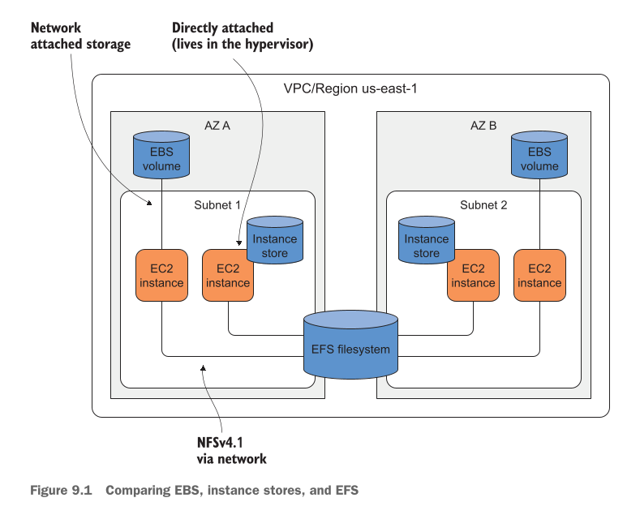
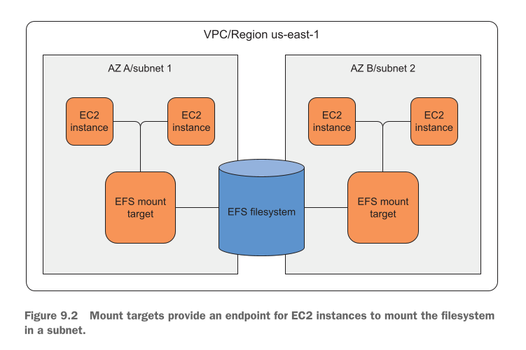
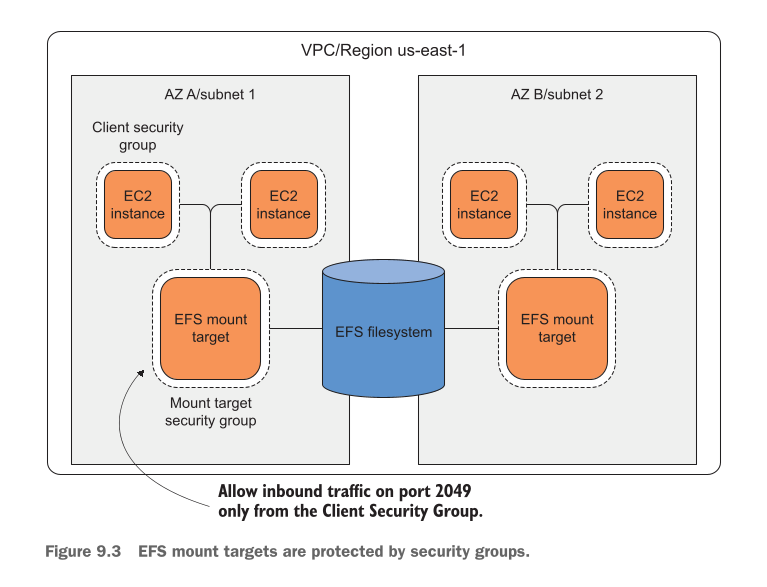

# Sharing data volumes between machines: EFS

## This chapter covers

Is chapter mein hum detail ke sath yeh baatein sikhenge:

* **High Availability wala Network Filesystem Banana:** Ek aisa storage banana jo kabhi down na ho aur multiple data centers mein replicate ho.
* **Network Filesystem ko Multiple EC2 Instances par Mount Karna:** Ek hi storage disk ko ek waqt mein bohot saare alag alag EC2 servers se jodna.
* **EC2 Instances ke Darmiyan Files Share Karna:** Alag alag servers ke darmiyan data ko real-time mein share karna.
* **Network Filesystem ki Performance Ko Improve (Tweak) Karna:** EFS ki speed aur response time ko optimize karna.
* **Network Bottlenecks ko Monitor Karna:** Yeh check karna ke kahin network speed ya bandwidth slow toh nahi ho rahi.
* **Shared Filesystem ka Backup Lena:** Apne poore shared storage ka secure backup maintain karna.

---

### Network Filesystem (EFS) Kya Hai Aur Yeh Kyun Zaroori Hai?

Aap farz karein ke aap ke paas ek purana application (legacy application) hai jo apni files ko kisi local drive (filesystem) par save karta hai.

* **Amazon S3 Kyun Nahi?** Hum ne Chapter 7 mein Object Storage (S3) parha tha. Lekin purane apps S3 ko direct samajh nahi paate. S3 use karne ke liye app ke poore code ko badalna parta hai, jo mehenga aur mushkil kaam hai.
* **EBS / Instance Store Kyun Nahi?** Chapter 8 mein hum ne Block Storage (EBS aur Instance Store) parha tha. EBS ka masla yeh hai ke woh sirf **ek waqt mein kisi ek EC2 server** ke sath hi lag sakta hai. Aur EBS sirf ek single data center (Availability Zone) mein rehta hai, jis wajeh se AWS iski uptime guarantee sirf **99.9%** deta hai.

Agar aap ko ek aisa storage chahiye jo **ek sath multiple EC2 servers** read/write kar sakein aur jo kabhi down bhi na ho, toh **Amazon Elastic File System (EFS)** sab se behtareen solution hai!

EFS **NFSv4.1** (Network File System version 4.1) protocol par kaam karta hai. Yeh aap ke data ko khud ba khud ek se ziada data centers (Availability Zones) mein copy (replicate) kar deta hai, jis wajeh se AWS iski uptime availability **99.99%** promise karta hai.

> **EFS WORKS ONLY WITH LINUX:** EFS filhal Windows EC2 instances ke sath kaam nahi karta. Agar aap Windows servers chalate hain, toh AWS aap ko EFS ke badle **Amazon FSx for Windows File Server** deta hai.

---

### EBS vs Instance Store vs EFS Figure 9.1 Breakdown)

Writer ne (Figure 9.1) mein teenon major storage types ka mawazna (comparison) kiya hai. Aayein isay ek clear architectural diagram se samajhte hain:

<div align="center">
  
</div>


**Image (`Figure 9.1`) ka Mukammal Breakdown:**

1. **EBS Volume (Virtual Disk):** Diagram mein dekhein, Subnet 1 ka EBS Volume sirf Subnet 1 ke EC2 Instance 1 se jurha hai. Yeh boundary se bahar nahi ja sakta aur na hi kisi doosre server se attach ho sakta hai.
2. **Instance Store (Local Disk):** Diagram mein dekhein, Instance Store EC2 Instance 2 ke sath chipka hua hai kyunki yeh us physical host machine ke andar (hypervisor layer par) laga hota hai. Yeh temporary hai.
3. **EFS Filesystem (Shared Folder):** Diagram ke centre mein dekhein! EFS Filesystem AZ A ke Subnet 1 aur AZ B ke Subnet 2 dono ke saare EC2 instances se **ek hi waqt mein Network (NFSv4.1)** ke zariye jurha hua hai. Agar AZ A poora ka poora tabah bhi ho jaye, tab bhi AZ B ke servers ke paas EFS ka data chal raha hoga!

---

## All examples are covered by the Free Tier

* Is chapter ki tamam practical examples **AWS Free Tier** ke andar aati hain.
* Aap ko koi extra paise nahi dene parenge jab tak aap hidayat par amal karein aur in resources ko kuch dino se ziada na chalne dein.
* Chapter ke aakhir mein saare banaye gaye resources ko delete (clean up) karne ki mukammal guide di jayegi.

---

### EFS Ke Do Main Components Figure 9.2 Breakdown)

EFS system do bunyadi hisson se mil kar banta hai:

1. **Filesystem:** Yeh asal storage resource hai jo AWS Region ke andar aap ke data ko save karta hai. Lekin aap isay direct access nahi kar sakte.
2. **Mount Target:** Yeh Subnet ke andar bana hua ek Network Endpoint (IP Address) hota hai. EC2 instance is Mount Target par NFSv4.1 protocol ke zariye connect hota hai aur data parhta/likhta hai.

**Image Figure 9.2 ka Structural Breakdown:**

<div align="center">
  
</div>

**Image breakdown:**

* Har Subnet ke andar ek **EFS Mount Target** lagaya gaya hai.
* Subnet 1 ke dono EC2 servers apne hi subnet ke Mount Target se baat karte hain.
* Subnet 2 ke dono EC2 servers apne subnet ke Mount Target se baat karte hain.
* Dono Mount Targets peeche se main **EFS Filesystem** ke sath jure hue hain, jisse charon EC2 servers ko same data nazar aata hai.

---

### Real-World Example: Shared `/home` Directories in Linux

Linux ek multiuser operating system hai, jahan alag alag users apna apna kaam kar sakte hain. Linux mein har user ka apna makhsoos folder hota hai jo `/home/$username` par pada hota hai.

Terminal par jab hum home directories ko dekhne ki command chalate hain:

```bash
$ ls -d -1 /home/* # Absolute paths ke sath tamam home directories ko list karta hai
drwx------ 2 andreas     andreas    4096 Jul 24 06:25 /home/andreas
drwx------ 3 michael     michael    4096 Jul 24 06:38 /home/michael
```

**Command aur Output ki Deep Detail:**

* `ls`: Files aur folders list karne ki command.
* `-d`: Sirf directories (folders) dikhao, unke andar ka saman nahi.
* `-1` (number 1): Har entry ko ek alag line par dikhao.
* `/home/*`: `/home` folder ke andar jitne bhi folders hain sab ka absolute path dikhao.
* `drwx------`:
* `d` = Directory (folder) hai.
* `rwx` = Owner ko **Read, Write, Execute** ki poori permissions hain.
* `------` = Baki kisi user ya group ko koi access nahi hai.


* `2` aur `3`: Hard links ki taadad (folders ki internal counting).
* `andreas andreas`: Folder ka Owner User `andreas` hai aur Owner Group bhi `andreas` hai.
* `4096`: Folder metadata ka size (4 KB).
* `Jul 24 06:25`: Folder banne ya last modify hone ki tareekh aur waqt.
* `/home/andreas`: Andreas user ka private ghar (home folder). Isay sirf Andreas hi khol sakta hai.
* `/home/michael`: Michael user ka private ghar (home folder). Isay sirf Michael hi khol sakta hai.

#### Real-World Masla (Problem)

Agar aap ke paas 5 alag alag EC2 servers chal rahe hain, toh har server par user ka home folder alag alag hoga. Agar Michael `EC2-Server-1` par login karke koi file save karega, aur agli dafa woh `EC2-Server-2` par login hoga, toh usay apni file **nahi milegi** kyunki woh doosra server hai!

#### EFS ka Hal (Solution)

Hum ek **EFS Filesystem** banayenge aur usay tamaam EC2 servers ke `/home` folder par mount kar denge!

Is se yeh hoga ke saare users ke home folders EFS par chale jayenge. Michael jis bhi EC2 server par login karega, usay apna wahi saara data, files, aur environment hamesha ready milega, bilkul waise hi jaise woh apne zati ghar mein ho!

---

## Creating a filesystem

Filesystem woh asal jagah (resource) hoti hai jahan aap ki saari files, directories (folders), aur symbolic links mehfooz hote hain.

EFS ki sab se khoobsurat baat yeh hai ke yeh **Amazon S3 ki tarah khud ba khud barhta (grow karta) hai**. Aap ko pehle se yeh guess nahi karna parta ke "mujhe 100 GB chahiye ya 500 GB". Aap jitna data dalte jayenge, storage space khud ba khud utni hi barhti jayegi.

Yeh filesystem ek makhsoos **AWS Region** (maslan `us-east-1`) mein banta hai, aur AWS background mein aap ke data ko automatically ek se ziada data centers (Availability Zones) mein copy (replicate) karta rehta hai taake data hamesha safe rahe.

---

### Using CloudFormation to describe a filesystem

Hum EFS filesystem ko manually AWS Console par ja kar clicking ke bajaye **CloudFormation** ke zariye (Infrastructure as Code) configure karenge.

Niche **Listing 9.1** ka CloudFormation code aur uski **har ek line ki deep explanation** di gayi hai:

```yaml
Resources: # Ye stack ke resources aur unki properties ko specify karta hai
  [...]
FileSystem:
  Type: 'AWS::EFS::FileSystem'
  Properties:
    Encrypted: true # Hum ye recommend karte hain ke by default encryption at rest enable rakhein
    ThroughputMode: bursting # Default throughput mode ko bursting kaha jata hai. Hum I/O intensive workloads ke liye throughput mode par aagay mazeed baat karein ge
    PerformanceMode: generalPurpose # Default performance mode general purpose hai. Hum performance mode par aagay mazeed baat karein ge
    FileSystemPolicy: # Data in transit ko encrypt karna security ki best practice hai. Filesystem policy ye yakeeni banati hai ke tamam access secure transport istemal karein
      Version: '2012-10-17'
      Statement:
        - Effect: 'Deny'
          Action: '*'
          Principal:
            AWS: '*'
          Condition:
            Bool:
              'aws:SecureTransport': 'false'

```

#### Code Ki Line-by-Line Breakdown

* **`Resources:`** CloudFormation template ka main section jahan hum batate hain ke konsi AWS services banani hain.
* **`FileSystem:`** Yeh hamare EFS resource ka logical naam (nickname) hai.
* **`Type: 'AWS::EFS::FileSystem'`**: Yeh line AWS ko batati hai ke hum ek **Amazon EFS Filesystem** banana chahte hain.
* **`Properties:`** Yahan se EFS ki tamam settings aur configuration shuru hoti hai.
* **`Encrypted: true`**: **Encryption at Rest** ko enable karta hai. Iska matlab hai ke jab aap ka data disk par pada hoga, woh AWS KMS (Key Management Service) ke zariye encrypted hoga. Agar koi physical drive chori bhi kar le, toh data nahi parh sakta.
* **`ThroughputMode: bursting`**: Throughput ka matlab hai data ke aane jaane ki speed. Default mode `bursting` hota hai, jisme aap ke filesystem ka size jitna bada hoga, uski speed utni hi ziada hogi. *(Note: Chote data size ke waqt yeh extra burst credits use karke tez speed deta hai).*
* **`PerformanceMode: generalPurpose`**: Performance mode do qisam ke hote hain. `generalPurpose` default hai jo web servers, content management systems, aur home directories ke liye best hai kyunki is mein latency (delay) bohot kam milti hai.
* **`FileSystemPolicy:`** Yeh EFS ki apni resource-based security policy hai jo access control karti hai.
* **`Version: '2012-10-17'`**: IAM policy language ka standard version.
* **`Statement:`** Security rules ki list.
* **`Effect: 'Deny'`**: Is rule ka maqsad access ko **rokna (block karna)** hai.
* **`Action: '*'`**: Tamam operations par (parhna, likhna, delete karna, wagera).
* **`Principal: AWS: '*'`**: Har user, server, ya request par yeh rule apply hoga.
* **`Condition:`** Condition tabhi sach hogi jab...
* **`Bool: 'aws:SecureTransport': 'false'`**: ...connection unencrypted ho (yani TLS/SSL encryption ke bina plain network par data bheja ja raha ho).
* **Is Policy Ka Aasan Matlab:** "Agar koi bhi user ya EC2 server EFS ke sath bina encryption (Encryption in Transit) ke connect hone ki koshish karega, toh EFS usay **Deny (block)** kar dega!" Yeh security ki sab se behtareen practice hai.

---

## Pricing

EFS ki pricing ko samajhna bohot aasan hai. Iska bill mukhya roop se **3 factors** par depend karta hai:

1. **Stored Data ki Taadad (GB per Month):** Aap ne kitne Gigabytes data store kiya hua hai.
2. **Access Frequency (Kitni Baar Data Parha/Likha Gaya):** Data rozaana access hota hai ya mahine mein ek do dafa.
3. **Availability vs Cost (Multi-AZ vs Single Zone):** Kya aap ko 99.99% High Availability chahiye ya aap saste bill ke liye ek single data center (99.9%) par raazi hain.

---

### Storage Classes Aur Unka Maqsad

AWS EFS mein 4 main Storage Classes milti hain jinhein aap apni zaroorat ke hisab se chunte hain:

```
                          ┌──────────────────────────────────────────┐
                          │            EFS Storage Classes           │
                          └─────────────────────┬────────────────────┘
                                                │
             ┌──────────────────────────────────┴──────────────────────────────────┐
             ▼                                                                     ▼
┌───────────────────────────┐                                         ┌───────────────────────────┐
│     Multi-AZ (Standard)   │                                         │   Single-AZ (One Zone)    │
│    Availability: 99.99%   │                                         │    Availability: 99.9%    │
├───────────────────────────┤                                         ├───────────────────────────┤
│ • Standard Storage        │                                         │ • One Zone Storage        │
│   (Rozaana frequent access│                                         │   (Frequent access,       │
│    ke liye)               │                                         │    sasta option)          │
│                           │                                         │                           │
│ • Standard-IA Storage     │                                         │ • One Zone-IA Storage     │
│   (Kambhar access karne   │                                         │   (Kambhar access,        │
│    wale data ke liye)     │                                         │    sab se sasta option)   │
└───────────────────────────┘                                         └───────────────────────────┘

```

#### 1. Standard Storage (Frequent Access + Multi-AZ)

* **Kiske Liye Hai?** Aisa data jise rozaana ya bar bar access kiya jata hai.
* **Faida:** Sab se kam latency (fast response) aur high availability (**99.99%**), kyunki data multiple data centers mein replicate hota hai.

#### 2. Standard–Infrequent Access (IA) Storage

* **Kiske Liye Hai?** Aisa data jise mahine mein ek do baar hi dekha jata hai (kambhar access).
* **Faida:** Data storage ki keemat bohot kam ho jati hai ($0.025 per GB).
* **Trade-off:** Jab bhi aap data access (read/write) karenge, toh **Access Request Fee** alag se lagegi, aur pehli byte aane mein thora sa delay (latency) ho sakta hai.

#### 3. One Zone Storage

* **Kiske Liye Hai?** Aisa data jo frequent access hota hai, lekin agar thori dair ke liye unavailable bhi ho jaye toh company ko bara nuqsan na ho.
* **Trade-off:** Yeh data ko multiple data centers mein copy nahi karta, balke **ek hi data center** mein rakhta hai. Availability kam ho kar **99.9%** reh jati hai, lekin storage price lag bhag aadhi ($0.16 per GB) ho jati hai.

#### 4. One Zone–Infrequent Access (IA) Storage

* **Kiske Liye Hai?** Aisa data jo na toh ziada access hota hai aur na hi uske liye Multi-AZ ki zaroorat hai.
* **Faida:** Yeh EFS ka **sab se sasta** storage option hai ($0.0133 per GB).

> **Durability Note:** Sub Storage Classes ki **Durability 99.999999999% (11 nines)** hoti hai! Durability ka matlab hai data ke khud ba khud corrupt ya lose na hone ki guarantee. Lekin agar aap One Zone use kar rahe hain, toh us data center par koi qudrati aafat aane ki surat mein data bachane ke liye backup zaroor rakhein.

---

### EFS Pricing Table

Niche di gayi Table 9.1 US East (N. Virginia - `us-east-1`) region ke rates ko zahir karti hai:

**Table 9.1 EFS storage classes affect the monthly costs for storing data.**

| Storage class | Price per GB/month | Access requests per GB transferred |
| --- | --- | --- |
| **Standard Storage** | $0.30 | $0.00 |
| **Standard–Infrequent Access Storage** | $0.025 | $0.01 |
| **One Zone Storage** | $0.16 | $0.00 |
| **One Zone–Infrequent Access Storage** | $0.0133 | $0.01 |

#### Table ki Aasan Wazahat:

* **Standard Storage:** $0.30 per GB har mahine. Access par koi extra charge nahi ($0.00).
* **Standard-IA:** Storage aam Standard se 12 guna sasti ($0.025), lekin har 1 GB data access karne par $0.01 ka extra request fee lagega.
* **One Zone Storage:** Storage rate $0.16 per GB. Access fee $0.00.
* **One Zone-IA:** Storage rate $0.0133 per GB. Access fee $0.01.

---

### Cost Estimation Example (5 GB Data Ka Hisab)

Aayein 5 GB data ko EFS par rakhne ka mahana kharcha (cost) calculate karte hain:

* **Scenario:** Data rozaana din mein kai baar access hota hai aur high availability (Multi-AZ) laazmi chahiye.
* **Storage Class Selection:** Hum **Standard Storage** class chunenge.
* **Calculation:**

$$\text{Total Cost} = 5\text{ GB} \times \$0.30/\text{GB} = \$1.50\text{ per month}$$


Poore ek mahine ke liye 5 GB data EFS par rakhne ka kul kharcha sirf **$1.50 (USD)** banta hai.

> **AWS Free Tier Benefit:** Agar aap ka AWS account naya hai (pehlay 12 mahine mein hai), toh AWS Free Tier ke tehat har mahine **5 GB (Standard Storage)** bilkul **MUFT (Free)** milti hai!

---


## Creating a mount target

Mount target ek aisa zariya (Network Endpoint / IP address) hai jo kisi makhsoos Subnet ke andar banta hai aur aap ke EC2 instances ko **NFSv4.1 protocol** ke zariye EFS filesystem se connect hone deta hai. EC2 instance aur mount target ke darmiyan saari baat-cheet standard TCP/IP network connection ke zariye hoti hai.

Security Groups ka istemal kar ke hum yeh control karte hain ke mount target ke andar konsa network traffic aa sakta hai. **NFS protocol** hamesha **Port 2049** ka istemal karta hai, is liye humein security group mein port 2049 ko allow karna parta hai.

---

### Dynamic Security Group Pattern (Security Groups Ki Chaining)

Kisi specific IP address ko allow karne ke bajaye, hum do alag alag security groups banate hain. Yeh AWS ka ek bohot hi taqatwar aur safe design pattern hai:

1. **EFS Client Security Group:** Yeh security group un tamam EC2 instances par lagaya jata hai jinhein EFS filesystem se connect hona hota hai. Is security group mein koi khas Inbound Rule (ijazat) nahi hoti, yeh sirf EC2 instances par ek **"Identity Card"** ya **"Badge"** ka kaam karta hai.
2. **Mount Target Security Group:** Yeh security group EFS Mount Target par lagaya jata hai. Is mein hum rule banate hain ke: *"Port 2049 par sirf wahi traffic andar aa sakta hai jiske paas 'EFS Client Security Group' ka badge ho!"*

#### Iska Bara Faida Kya Hai?

Aap ko kabhi bhi IP addresses manually add ya remove nahi karne parenge. Agar aap Auto Scaling ke zariye 10 naye EC2 servers bhi launch kar dete hain, toh jab tak un par Client Security Group laga hoga, woh automatically EFS se connect ho sakenge.

---

> ### 💡 EFS IS NOT ONLY ACCESSIBLE FROM EC2 INSTANCES
> 
> 
> Is chapter mein hum EFS ko EC2 instances par mount kar rahe hain kyunki yeh sab se aam use-case hai. Lekin EFS ko in jagahon par bhi istemal kiya ja sakta hai:
> * **Containers:** Amazon ECS (Elastic Container Service) aur Amazon EKS (Kubernetes)
> * **Serverless Functions:** AWS Lambda
> * **On-Premises Servers:** Aap ke apne office ke physical servers (AWS Direct Connect ya VPN ke zariye)
> 
> 

---

### Figure 9.3 Ka Visual Breakdown

Book mein di gayi image (Figure 9.3) is poore security concept ko wazeh karti hai. Aayein isay ek structural diagram se samajhte hain:

<div align="center">
  
</div>

**Diagram ki Wazahat:**

* **Client Security Group:** Dono Availability Zones (AZ A aur AZ B) ke EC2 instances ke gird ek boundary (badge) bana hua hai.
* **Mount Target Security Group:** Yeh protection layer Mount Target ke upar lagi hui hai jo keh rahi hai: *"Main sirf Client Security Group wale servers se aane wali Port 2049 requests ko hi EFS tak jaane dunga."*

---

### Listing 9.2 CloudFormation snippet of an EFS mount target and security groups

Is snippet mein hum CloudFormation ke zariye do security groups aur **Subnet A** ke liye EFS mount target define kar rahe hain:

```yaml
Resources:
  [...]
EFSClientSecurityGroup: # Is security group ko kisi rule ki zaroorat nahi hoti. Ye sirf EC2 instances se bahar jane wale traffic ko mark karne ke liye istemal hoti hai
  Type: 'AWS::EC2::SecurityGroup'
  Properties:
    GroupDescription: 'EFS Mount target client'
    VpcId: !Ref VPC

MountTargetSecurityGroup: # Ye security group mount target ke sath linked hoti hai
  Type: 'AWS::EC2::SecurityGroup'
  Properties:
    GroupDescription: 'EFS Mount target'
    SecurityGroupIngress:
      - IpProtocol: tcp
        FromPort: 2049 # Port 2049 par traffic ki ijazat deta hai
        ToPort: 2049
        SourceSecurityGroupId: !Ref EFSClientSecurityGroup # Ye sirf us security group se traffic ki ijazat deta hai jo EC2 instances ke sath linked ho
    VpcId: !Ref VPC

MountTargetA:
  Type: 'AWS::EFS::MountTarget'
  Properties:
    FileSystemId: !Ref FileSystem # Mount target ko filesystem ke sath attach karta hai
    SecurityGroups:
      - !Ref MountTargetSecurityGroup # Security group assign karta hai
      - SubnetId: !Ref SubnetA # Mount target ko subnet A ke sath link karta hai

```

#### Code Ki Har Detail (Deep Breakdown)

* **`EFSClientSecurityGroup:`** Is resource ka naam client security group rakha gaya hai.
* **`Type: 'AWS::EC2::SecurityGroup'`**: AWS ko batata hai ke hum ek Security Group bana rahe hain.
* **`GroupDescription: 'EFS Mount target client'`**: Is security group ki choti si wazahat.
* **`VpcId: !Ref VPC`**: Batata hai ke yeh security group kis Virtual Private Cloud (VPC) ke andar banega. *(Is Security Group mein koi `SecurityGroupIngress` rules nahi hain kyunki iska kaam sirf EC2 servers ko mark karna hai).*
* **`MountTargetSecurityGroup:`** Yeh mount target ko protect karne wala doosra security group hai.
* **`SecurityGroupIngress:`** Inbound rules ki list (yani kaun andar aa sakta hai).
* **`IpProtocol: tcp`**: Traffic TCP protocol istemal karega.
* **`FromPort: 2049` & `ToPort: 2049**`: Port number 2049 ko allow kar raha hai (jo NFS protocol ki default port hai).
* **`SourceSecurityGroupId: !Ref EFSClientSecurityGroup`**: **Sab se eham line!** Yeh IP address ke bajaye keh raha hai ke *"Sirf wahi servers allow hain jin par `EFSClientSecurityGroup` laga ho."*
* **`MountTargetA:`** Subnet A ke andar EFS Mount Target banane ka main block.
* **`Type: 'AWS::EFS::MountTarget'`**: Batata hai ke hum EFS Mount Target bana rahe hain.
* **`FileSystemId: !Ref FileSystem`**: Is mount target ko pehle se banaye gaye EFS Filesystem ke sath jod deta hai.
* **`SecurityGroups:`**: Is mount target par `MountTargetSecurityGroup` wali security firewall apply kar deta hai.
* **`SubnetId: !Ref SubnetA`**: Is mount target ko **Subnet A** (Availability Zone A) mein rakhta hai taake us subnet ke EC2 instances is se connect ho sakein.

---

### Listing 9.3 CloudFormation snippet of an EFS mount target and security groups

High Availability (99.99% uptime) haasil karne ke liye zaroori hai ke hum ek mount target **Subnet B** (doosre data center/AZ) mein bhi banayen. Code ka snippet yeh raha:

```yaml
Resources:
  [...]
MountTargetB:
  Type: 'AWS::EFS::MountTarget'
  Properties:
    FileSystemId: !Ref FileSystem
    SecurityGroups:
      - !Ref MountTargetSecurityGroup
    SubnetId: !Ref SubnetB # Ye mount target ko subnet B ke sath attach karta hai

```

#### Code Ki Har Detail (Deep Breakdown)

* **`MountTargetB:`** Resource ka naam `MountTargetB` rakha gaya hai taake yeh `MountTargetA` se alag pehchana ja sake.
* **`Type: 'AWS::EFS::MountTarget'`**: AWS resource type define kar raha hai.
* **`FileSystemId: !Ref FileSystem`**: Yeh bhi wahi same main EFS Filesystem istemal karega jo `MountTargetA` kar raha tha.
* **`SecurityGroups: - !Ref MountTargetSecurityGroup`**: Wahi same security firewall istemal ho gi jo Port 2049 par client traffic ko check karti hai.
* **`SubnetId: !Ref SubnetB`**: **Main Faraq!** Yeh mount target **Subnet B** (Availability Zone B) ke andar banega.

Is tarah hamara EFS filesystem ab dono Subnets (A aur B) ke EC2 instances ke liye fully accessible aur Highly Available ho chuka hai!

---

## Mounting the EFS filesystem on EC2 instances

AWS EFS har filesystem ke liye ek khas DNS naam (Domain Name) banata hai jiska format yeh hota hai:

$$\text{\$FileSystemID.efs.\$Region.amazonaws.com}$$

Jab aap kisi EC2 instance se is DNS naam ko call karte hain, toh AWS ka DNS server auto-detect karta hai ke request kis subnet se aa rahi hai, aur usay usi subnet mein bane hue **Mount Target ke IP address** par bhej deta hai.

### EFS Mount Helper (`amazon-efs-utils`)

EFS filesystem ko mount karne ke liye AWS **EFS Mount Helper** tool istemal karne ki sifarish karta hai. Is tool ke do sab se bade faide hain:

* **TLS Encryption (Security):** EC2 aur EFS ke darmiyan raste mein (in transit) saare data ko encrypt karta hai.
* **IAM Authentication:** AWS IAM roles ke zariye check karta hai ke kya is EC2 server ko EFS access karne ki ijazat hai.

Amazon Linux 2 par is tool ko install karna bohot aasan hai:

```bash
$ sudo yum install amazon-efs-utils

```

#### Manual Mount Command

Tool install hone ke baad, aap niche di gayi command se EFS ko kisi bhi local folder par mount kar sakte hain:

```bash
$ sudo mount -t efs -o tls,iam $FileSystemID $EFSMountPoint

```

Real-world example:

```bash
$ sudo mount -t efs -o tls,iam fs-123456 /home

```

* `mount`: Linux ki drive/filesystem jodney wali command.
* `-t efs`: Operating system ko batata hai ke hum EFS type ka filesystem mount kar rahe hain.
* `-o tls,iam`: Options set kar raha hai:
1. `tls`: EC2 se EFS tak ek secure TLS tunnel banata hai taake network par data koi chori na kar sake.
2. `iam`: EC2 instance ke sath jurhe hue IAM Role ka istemal kar ke identity verify karta hai.


* `fs-123456`: Hamara EFS Filesystem ID.
* `/home`: EC2 instance ka woh local folder jahan hum EFS ko attach kar rahe hain.

---

### Boot par Automatically Mount Karna (`/etc/fstab`)

Agar aap chahte hain ke jab bhi EC2 instance restart (reboot) ho, toh EFS filesystem khud ba khud mount ho jaye, toh aap ko Linux ki `/etc/fstab` configuration file mein yeh entry daalni parti hai:

```text
$FileSystemID:/ $EFSMountPoint efs _netdev,noresvport,tls,iam 0 0

```

#### Extra Options ki Detail

Aap `tls` aur `iam` ko samajhte hain, baqi do options ka matlab yeh hai:

* `_netdev`: Linux OS ko batata hai ke yeh ek **Network Filesystem** hai. OS reboot hote waqt pehle internet/network card ko chalu karega, uske baad is drive ko mount karne ki koshish karega.
* `noresvport`: Agar kabhi network mein koi masla aaye aur connection toot jaye, toh dobara connect hone ke liye ek naya TCP source port istemal karega. Yeh network recovery ke liye bohot zaroori hai.

---

### Listing 9.4 Using CloudFormation to launch an EC2 instance and mount an EFS filesystem

Ab hum CloudFormation template mein pehla EC2 server (`EC2InstanceA`) add karenge jo **Subnet A** mein hoga aur EFS ko apne `/home` directory par mount karega.

**Chunauti (Challenge):** Linux mein pehle se `/home/ec2-user` ka folder mojood hota hai. Jab aap kisi folder par naya EFS mount karte hain, toh purana local data chhup (hide ho) jata hai. Is liye hum script mein pehle purane `/home` data ka backup `/oldhome` mein banayenge, EFS mount karenge, aur phir backup data ko EFS mein copy wapas karenge!

```yaml
Resources:
  [...]
EC2InstanceA: # Ye aik EC2 instance banata hai
  Type: 'AWS::EC2::Instance'
  Properties:
    ImageId: !FindInMap [RegionMap, !Ref 'AWS::Region', AMI]
    InstanceType: 't2.micro'
    IamInstanceProfile: !Ref IamInstanceProfile # Ye IAM role EFS filesystem tak access deta hai
    NetworkInterfaces:
      - AssociatePublicIpAddress: true
        DeleteOnTermination: true
        DeviceIndex: 0
        GroupSet:
          - Ref: EFSClientSecurityGroup # Security group attach karta hai, jo filesystem ki taraf jane wale outgoing traffic ki pehchan ke liye istemal hoti hai
        SubnetId: !Ref SubnetA # EC2 instance ko subnet A mein rakhta hai
    UserData:
      'Fn::Base64': !Sub |
        #!/bin/bash -ex
        trap '/opt/aws/bin/cfn-signal -e 1 --stack ${AWS::StackName} --resource EC2InstanceA --region ${AWS::Region}' ERR

        # install dependencies
        yum install -y nc amazon-efs-utils
        pip3 install botocore

        # copy existing /home to /oldhome # Tamam home directories ka backup /oldhome mein bana deta hai
        mkdir /oldhome
        cp -a /home/. /oldhome

        # wait for EFS mount target # Naya filesystem banane ke baad, iske DNS name ko mount targets tak resolve hone mein kuch minute lagte hain
        while ! (echo > /dev/tcp/${FileSystem}.efs.${AWS::Region}.amazonaws.com/2049) >/dev/null 2>&1; do sleep 5; done

        # mount EFS filesystem
        echo "${FileSystem}: /home efs _netdev,noresvport,tls,iam 0 0" >> /etc/fstab # Fstab mein aik entry add karta hai, jo ye yakeeni banati hai ke har boot par filesystem khud-ba-khud mount ho jaye
        mount -a # System ko reboot kiye baghair fstab mein define shuda tamam entries (sab se aham EFS filesystem) ko mount karta hai

        # copy /oldhome to new /home # Purani home directories ko /home ke tehet mount kiye gaye EFS filesystem par copy karta hai
        cp -a /oldhome/. /home

        /opt/aws/bin/cfn-signal -e $? --stack ${AWS::StackName} --resource EC2InstanceA --region ${AWS::Region} # CloudFormation ko kamyabi ka signal bhejta hai
    Tags:
      - Key: Name
        Value: 'efs-a'
    CreationPolicy: # CloudFormation ko batata hai ke tab tak intezar kare jab tak EC2 instance se kamyabi ka signal nahi mil jata
      ResourceSignal:
        Timeout: PT10M
    DependsOn: # EC2 instance ko internet connectivity aur mount target dono ki zaroorat hoti hai. Kyunki ye dono dependencies CloudFormation ko wazeh tor par nazar nahi aatin, isliye hum unhein yahan khud manual add karte hain
      - VPCGatewayAttachment
      - MountTargetA

```

#### Code Ki Deep Breakdown

* `EC2InstanceA:` Pehle EC2 instance ka logical naam.
* `Type: 'AWS::EC2::Instance'`: EC2 Virtual Machine create kar raha hai.
* `InstanceType: 't2.micro'`: Free-tier eligible small instance.
* `IamInstanceProfile: !Ref IamInstanceProfile`: Instance ko IAM permissions de raha hai taake woh EFS aur SSM Session Manager use kar sake.
* `GroupSet: - Ref: EFSClientSecurityGroup`: **EFS Client Security Group** attach kar raha hai taake Mount Target isay pehchan sake.
* `SubnetId: !Ref SubnetA`: Is server ko **Subnet A** (Data Center A) mein rakh raha hai.

#### UserData Bash Script Breakdown (Line-by-Line)

* `#!/bin/bash -ex`: Script shuru hotay hi har command ko execution logs mein print karega (`-x`) aur kisi bhi error par script roke ga (`-e`).
* `trap '... cfn-signal -e 1 ...' ERR`: Agar script mein koi bhi error aaya, toh CloudFormation ko **Failure (-e 1)** ka signal bhej do taake stack hang na ho.
* `yum install -y nc amazon-efs-utils` & `pip3 install botocore`: `netcat` (nc) tool aur EFS mount utilities install kar raha hai.
* `mkdir /oldhome && cp -a /home/. /oldhome`: Local `/home` folder ka mukammal backup (permissions ke sath `-a`) `/oldhome` mein bana raha hai.
* `while ! (echo > /dev/tcp/.../2049) ... sleep 5; done`: **Loop Check!** Jab naya EFS banta hai, toh DNS ko active hone mein thora waqt lagta hai. Yeh command har 5 second baad Port 2049 par packet bhej kar check karti hai ke Mount Target tayar hua ya nahi. Jab tak reply nahi aata, script ruki rehti hai.
* `echo "${FileSystem}: /home efs ... " >> /etc/fstab`: `/etc/fstab` file ke aakhir mein EFS ki mount configuration line daal raha hai.
* `mount -a`: System ko reboot kiye bina `/etc/fstab` ki sari configuration run kar ke EFS ko `/home` folder par mount kar deta hai.
* `cp -a /oldhome/. /home`: Pehle banaya gaya backup dubara naye EFS shared volume par copy kar raha hai taake purane users (jaise `ec2-user`) ghaib na hon.
* `/opt/aws/bin/cfn-signal -e $? ...`: CloudFormation ko **Success (0)** ka signal bhejta hai.
* `CreationPolicy:` CloudFormation 10 minute (`PT10M`) tak EC2 ke signal ka wait karega.
* `DependsOn:` Yeh batata hai ke jab tak Internet Gateway (`VPCGatewayAttachment`) aur `MountTargetA` ban na jayein, tab tak yeh EC2 server banana shuru na karna.

---

### Listing 9.5 Mounting an EFS filesystem from a second EC2 instance

Ab hum doosra EC2 server (`EC2InstanceB`) **Subnet B** mein banayenge taake yeh sabit kar sakein ke dono alag alag data centers ke servers ek hi EFS `/home` folder ko share kar sakte hain.

```yaml
Resources:
  [...]
  EC2InstanceB:
    Type: 'AWS::EC2::Instance'
    Properties:
      ImageId: !FindInMap [RegionMap, !Ref 'AWS::Region', AMI]
      InstanceType: 't2.micro'
      IamInstanceProfile: !Ref IamInstanceProfile
      NetworkInterfaces:
        - AssociatePublicIpAddress: true
          DeleteOnTermination: true
          DeviceIndex: 0
          GroupSet:
            - !Ref EFSClientSecurityGroup
          SubnetId: !Ref SubnetB # Ye EC2 instance ko subnet B mein rakhta hai
      UserData:
        'Fn::Base64': !Sub |
          #!/bin/bash -ex
          trap '/opt/aws/bin/cfn-signal -e 1 --stack ${AWS::StackName} --resource EC2InstanceB --region ${AWS::Region}' ERR

          # install dependencies
          yum install -y nc amazon-efs-utils
          pip3 install botocore # Purana /home folder yahan copy nahi hota. Ye pehle hi subnet A ke pehle EC2 instance par ho chuka hai

          # wait for EFS mount target
          while ! (echo > /dev/tcp/${FileSystem}.efs.${AWS::Region}.amazonaws.com/2049) >/dev/null 2>&1; do sleep 5; done

          # mount EFS filesystem
          echo "${FileSystem}: /home efs _netdev,noresvport,tls,iam 0 0" >> /etc/fstab
          mount -a

          /opt/aws/bin/cfn-signal -e $? --stack ${AWS::StackName} --resource EC2InstanceB --region ${AWS::Region}
      Tags:
        - Key: Name
          Value: 'efs-b'
      CreationPolicy:
        ResourceSignal:
          Timeout: PT10M
      DependsOn:
        - VPCGatewayAttachment
        - MountTargetB

```

#### Main Faraq (EC2InstanceA vs EC2InstanceB):

1. **Subnet Location:** `EC2InstanceB` Subnet B mein hai.
2. **DependsOn:** Yeh `MountTargetB` par depend karta hai.
3. **No `/oldhome` Backup Needed:** Iss script mein `/oldhome` wala copy step **nahi hai**! Kyunki pehle EC2 server ne pehle hi data EFS par daal diya tha. Doosra server bus direct EFS ko mount karega aur usay sara data ready milega.

---

### Template Outputs

Stack banne ke baad dono EC2 servers ki IDs aasani se dekhne ke liye hum template ke end par `Outputs` section add karte hain:

```yaml
Outputs:
  EC2InstanceA:
    Value: !Ref EC2InstanceA
    Description: 'Id of EC2 Instance in AZ A (connect via Session Manager)'
  EC2InstanceB:
    Value: !Ref EC2InstanceB
    Description: 'Id of EC2 Instance in AZ B (connect via Session Manager)'

```

---

### Where is the template located?

Is complete CloudFormation template ka setup S3 aur GitHub par pada hua hai:

* **GitHub Download:** `[https://github.com/AWSinAction/code3/archive/main.zip](https://github.com/AWSinAction/code3/archive/main.zip)` (File path: `chapter09/efs.yaml`)
* **S3 Direct URL:** `[https://s3.amazonaws.com/awsinaction-code3/chapter09/efs.yaml](https://s3.amazonaws.com/awsinaction-code3/chapter09/efs.yaml)`

---

### Deploying the CloudFormation Stack

AWS CLI ka istemal karte hue is poore infrastructure ko create karne ki command:

```bash
$ aws cloudformation create-stack --stack-name efs \
    --template-url https://s3.amazonaws.com/awsinaction-code3/chapter09/efs.yaml \
    --capabilities CAPABILITY_IAM

```

* `aws cloudformation create-stack`: Naya stack banane ki command.
* `--stack-name efs`: Stack ka naam `efs` rakh raha hai.
* `--template-url`: S3 par majood tayar template file ka rasta.
* `--capabilities CAPABILITY_IAM`: AWS ko permission de raha hai ke yeh template naye IAM Roles aur Profiles bana sakta hai.

Jab stack ka status **CREATE_COMPLETE** ho jayega, toh aap ke account mein 2 EC2 instances, 2 Mount Targets, aur 1 EFS Filesystem successfully tayar ho chukay honge!

---

## Sharing files between EC2 instances

Ab hum apna tajarba (practical test) karenge jisse yeh saaf sabit ho jayega ke EFS ki wajah se alag alag servers ke darmiyan files real-time mein share ho rahi hain.

Sab se pehle humein AWS CLI ke zariye apne dono EC2 servers ki Instance IDs chahiye hongi taake hum SSM Session Manager ke zariye un se connect ho sakein.

---

### Step 1: EC2 Instances Ki IDs Nikalna

AWS Terminal / CLI par yeh command chalayen:

```bash
$ aws cloudformation describe-stacks --stack-name efs \
    --query "Stacks[0].Outputs"
[
  {
    "Description": "[...]",
    "OutputKey": "EC2InstanceA",
    "OutputValue": "i-011a050b697d12e7a"
  },
  {
    "Description": "[...]",
    "OutputKey": "EC2InstanceB",
    "OutputValue": "i-a22b67b2a4d25a2b"
  }
]

```

#### Command Aur Output ki Line-by-Line Breakdown

* **`aws cloudformation describe-stacks`**: Yeh CloudFormation ko hukum deta hai ke bane hue stacks ki details lao.
* **`--stack-name efs`**: Makhsoos `efs` naam ke stack ki jankari maang raha hai.
* **`--query "Stacks[0].Outputs"`**: Yeh command poori lambi details ke bajaye sirf pehle stack (`Stacks[0]`) ke `Outputs` section ko filter kar ke screen par dikhati hai.

**JSON Output Breakdown:**

* **`OutputKey: "EC2InstanceA"`**: Pehle server ka naam.
* **`OutputValue: "i-011a050b697d12e7a"`**: Subnet A mein bane hue pehle server ki unique **Instance ID**.
* **`OutputKey: "EC2InstanceB"`**: Doosre server ka naam.
* **`OutputValue: "i-a22b67b2a4d25a2b"`**: Subnet B mein bane hue doosre server ki unique **Instance ID**.

---

### Step 2: Servers Mein Login Hona Aur Home Directory Check Karna

Ab AWS Management Console par ja kar **SSM Session Manager** ke zariye dono servers (`EC2InstanceA` aur `EC2InstanceB`) ke terminals alag alag tabs mein open kar lein.

> **Aham Baat (User Concept):** Aam tor par Amazon Linux 2 par default user `ec2-user` hota hai. Lekin jab aap AWS Console ke Session Manager se login karte hain, toh aap `ssm-user` naam ke account se login hote hain. Kyunki hum ne poore `/home` folder par EFS ko mount kar diya hai, is liye har user (chahay `ssm-user` ho ya `ec2-user`) EFS storage hi istemal karega.

**Doosre Server (`EC2InstanceB`) par Terminal Command Chalayen:**

```bash
$ cd $HOME

```

* **Maqsad:** `$HOME` environment variable hai jo aap ko aap ke apne user ke home folder (jaise `/home/ssm-user`) mein le jata hai.

```bash
$ ls

```

* **Maqsad:** Check karna ke kya abhi home directory mein koi file ya folder pada hai?
* **Nateeja:** Screen par kuch nazar nahi aata (khali output), jiska matlab hai ke abhi tak koi file nahi bani aur directory bilkul clean hai.

---

### Step 3: Magic Experiment (Ek Server Par File Banana, Doosre Par Dekhna)

Ab hum yeh jaadu check karenge ke ek server par banai gayi file foran doosre server par kaise dikhti hai.

**Pehle Server (`EC2InstanceA`) par ja kar yeh command chalayen:**

```bash
$ touch i-was-here

```

* **Detail:** `touch` command Linux mein ek khali (empty) file banane ke liye use hoti hai. Yahan hum ne `i-was-here` naam ki ek khali file `EC2InstanceA` par bana di.

**Ab Doosre Server (`EC2InstanceB`) ke terminal par wapas aayein aur chalayen:**

```bash
$ cd $HOME
$ ls
i-was-here

```

**Kamal Ho Gaya! (Voilà!):**
`EC2InstanceB` par bina koi file banaye, sirf `ls` command chalane se humein `i-was-here` file nazar aa gayi!

Yeh chota sa practical test yeh sabit karta hai ke dono servers bilkul alag alag data centers (Availability Zones) mein hote hua bhi **bilkul same `/home` directory** share kar rahe hain.

---

### Real-World Real Life Scenarios (Yeh Kahan Kahan Kaam Aata Hai?)

Isi tareeqay se aap sirf 2 nahi balke **sainkdon (hundreds) EC2 servers** ko ek sath ek hi EFS storage se jod sakte hain. Real world mein iske do mashhoor use-cases yeh hain:

```text
                               ┌───────────────────────────┐
                               │   Fleet of Web Servers    │
                               └─────────────┬─────────────┘
                                             │
                  ┌──────────────────────────┴──────────────────────────┐
                  ▼                                                     ▼
┌───────────────────────────────────┐                 ┌───────────────────────────────────┐
│           EC2 Server 1            │                 │           EC2 Server 2            │
│    (Mounts /var/www/html)         │                 │    (Mounts /var/www/html)         │
└─────────────────┬─────────────────┘                 └─────────────────┬─────────────────┘
                  │                                                     │
                  └──────────────────────────┬──────────────────────────┘
                                             │
                                  ┌──────────▼──────────┐
                                  │   EFS Filesystem    │
                                  │  (Single Web Code)  │
                                  └─────────────────────┘

```

1. **Web Server Fleet (`/var/www/html`):**
Agar aap ki website par lakho visitors aa rahe hain aur aap ne 50 web servers chalaye hue hain. Har server par alag se website ka code upload karne ke bajaye aap website ka code EFS par rakhte hain aur tamaam servers par `/var/www/html` folder ko EFS se mount kar dete hain. Ek jaga code update hoga, tamaam 50 servers par website instant update ho jayegi!
2. **Highly Available Jenkins CI/CD Server (`/var/lib/jenkins`):**
Jenkins automated deployment ke liye use hota hai. Agar aap Jenkins ka main folder (`/var/lib/jenkins`) EFS par rakh dein, toh agar Jenkins wala server crash bhi ho jaye, aap foran ek naya EC2 server bana kar EFS mount karenge aur aap ka poora Jenkins setup (history, jobs, pipelines) bina kisi data loss ke minutes mein dubara Zinda (Up and Running) ho jayega.

---

