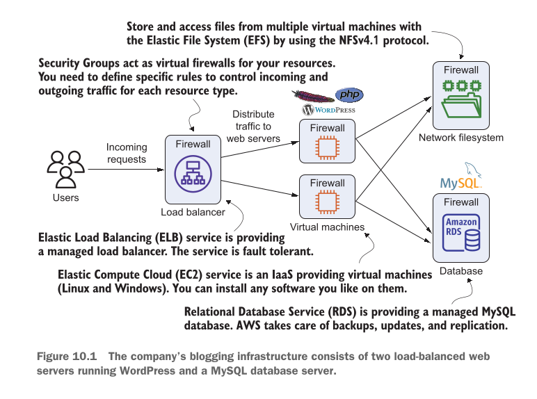
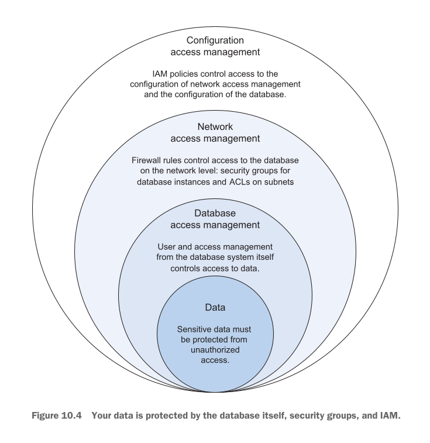

# sing a relational database service: RDS

## This chapter covers

* **Launching and initializing relational databases with RDS:** Amazon RDS (Relational Database Service) ka istemal karte hue ek nayi relational database ko shuru (launch) aur tayar (initialize) karna.
* **Creating and restoring database snapshots:** Database ka aik point-in-time photo ya backup (Snapshot) lena aur agar kabhi data kharab ho jaye ya delete ho jaye toh us snapshot se database ko wapis pehle jaisa (restore) karna.
* **Setting up a highly available database:** Aisa database system tayar karna jo kabhi bhi band (down) na ho. Agar aik jagah koi masla aaye bhi, toh doosri jagah se database baghair rukaawat ke chalta rahe.
* **Monitoring database metrics:** Database ki sehat, speed, memory, aur CPU ka lagatar jaiza lena taake pata chal sake ke system sahi tarah kaam kar raha hai ya nahi.
* **Tweaking database performance:** Database ki setting aur speed ko behtar banana taake queries tezi se run hon aur application fast chale.

---

### Relational Databases aur AWS ka Ta'aruf

**WordPress** aik aisi mashhoor website banana wali application (Content Management System ya CMS) hai jo pure internet ki aik bohot bari taaddad ko chalati hai. Internet par maujood bohot sari doosri applications ki tarah, WordPress bhi apne tamam articles, comments, user accounts, aur doosri information ko mehfooz rakhne ke liye ek **Relational Database** ka istemal karta hai.

Relational databases ko structured data (yaani aisa data jo rows aur columns ki shakal mein saaf suthra rakha gaya ho) ko store karne aur dhoondne (query karne) ke liye sab se ziada reliable aur standard zariya mana jata hai. Bohot sari mashhoor applications **MySQL** jaise relational database systems par chalti hain.

#### Relational Databases kis cheez par focus karte hain? (ACID Property)

Relational databases ka sab se bada maqsad **Data Consistency** (data ka har halat mein sahi aur mehfooz rehna) hota hai. Ye databases **ACID** guarantees dete hain:

* **Atomicity (A - Aisa kaam jo poora ho ya bilkul na ho):** Transaction ya toh poori tarah kamyab hogi ya phir bilkul nahi hogi. *Misaal ke taur par:* Agar aap bank app se apne dost ko Rs. 100 bhejte hain, toh aap ke account se paise katna aur dost ke account mein paise jama hona—dono kaam hone chahiye. Agar beech mein net kat jaye, toh paise wapis aap ke account mein hi rahenge, adhe raste mein ghayab nahi honge.
* **Consistency (C - Rules ka hamesha follow hona):** Database mein sirf wahi data save hoga jo us ke banaye gaye qawaneen (rules) par poora utarta ho.
* **Isolation (I - Aik doosre se alag rehna):** Agar aik waqt mein hazaron log database ko istemal kar rahe hain, toh aik bande ki transaction doosre bande ke kaam mein rukawat ya garbar paida nahi karegi.
* **Durability (D - Data ka hamesha ke liye mehfooz hona):** Ek baar jab transaction complete ho jaye aur data save ho jaye, toh chahe light chali jaye ya server crash ho jaye, data zaye (lost) nahi hoga.

Aise sakht usool accounting applications, bank accounts, aur e-commerce stores ke liye bohot zaroori hotay hain.

---

### AWS Par Relational Database Chalane Ke Do Raaste

Agar aap AWS cloud par relational database chalana chahte hain, toh aap ke paas do raste (options) hote hain:

1. **Amazon RDS (Managed Service):** AWS ki taraf se bani banayi database service istemal karein jahan hardware, updates, aur backups ki tension AWS khud leta hai.
2. **Self-Hosted (Virtual Machines par khud manage karna):** EC2 Virtual Machines le kar un par khud MySQL ya koi bhi database manual install karein aur khud manage karein.

#### Amazon RDS Kya Hai?

Amazon Relational Database Service (Amazon RDS) aik ready-to-use managed database service hai. Ye aam taur par istemal hone wale tamam bade database engines ko support karti hai:

* **PostgreSQL**
* **MySQL**
* **MariaDB**
* **Oracle Database**
* **Microsoft SQL Server**
* **Amazon Aurora:** Ye AWS ka apna cloud-native database engine hai jo MySQL aur PostgreSQL ke sath 100% compatible hai aur bohot ziada fast aur scalable hai.

Agar aap ki application pehle se in mein se koi database engine istemal kar rahi hai, toh RDS par shift hona bohot aasan hai. Sab se ziada dhyan data ko purane server se RDS par shift (migrate) karne mein dena hota hai.

---

### Managed Service RDS vs. Self-hosted on virtual machines

AWS mein **Managed Service** ka matlab hai ke service dene wala (AWS) system ko chalane, updates lagane, aur hardware ki dekh-bhal karne ki zimmedari leta hai.

Below diye gaye table mein RDS aur Virtual Machines (EC2) par khud database chalane ka mwaazna (comparison) kiya gaya hai:

| Comparison Feature | Amazon RDS | Self-hosted on virtual machines |
| --- | --- | --- |
| **Cost for AWS services** | Zyada hota hai kyunke RDS ki cost virtual machines (EC2) se zyada hoti hai. | Kam hota hai kyunke virtual machines (EC2) RDS ke muqablay mein sasti hoti hain. |
| **Total cost of ownership** | Kam hota hai kyunke operating costs bohot sare customers ke darmiyan split ho jati hain. | Bohat zyada hota hai kyunke apne database ko manage karne ke liye aap ko apni khud ki manpower ki zaroorat parti hai. |
| **Quality** | Managed service ki zimmedari AWS ke professionals ki hoti hai. | Aap ko professionals ki team banani parti hai aur khud quality control implement karna parta hai. |
| **Flexibility** | Zyada hoti hai, kyunke aap relational database system aur ziyadatar configuration parameters chun sakte hain. | Is se bhi zyada hoti hai, kyunke aap virtual machines par install kiye gaye relational database system ke har hissay ko control kar sakte hain. |

#### Is Table Ka Asan Matlab:

1. **AWS Service Bill (Service ki qeemat):** RDS ka monthly bill aik aam EC2 Virtual Machine se thoda ziada hota hai kyunke AWS aap ko auto-backup, security patches, aur management ki suhulat de raha hai.
2. **Total Cost of Ownership (TCO - Kul Kharcha):** Jab aap khud Virtual Machine par database chalate hain, toh aap ko system administrators aur database experts (DBAs) ko bari salaries deni parti hain taake wo database ko 24/7 manage karein. RDS mein AWS ye saara kaam khud karta hai, is liye overall kharcha (TCO) RDS par kam aata hai.
3. **Quality (Kaam ki behtari):** RDS ko AWS ke sab se experienced engineers manage kar rahe hote hain, jabke self-hosted mein aap ko khud experts dhoond kar team banani parti hai.
4. **Flexibility (Azaadi):** Self-hosted mein aap ke paas OS level ka full control hota hai, jabke RDS mein aap ko Operating System ka access nahi milta, lekin aap database ke tamam zaroori parameters ko asani se change kar sakte hain.

Virtual machines par apna database khareed kar zero se set karna bohot ziada waqt aur tajarba (know-how) maangta hai. Is liye AWS hamesha recommend karta hai ke **Amazon RDS** ka istemal kiya jaye taake aap ke kaam ki quality behtar ho aur operational kharcha kam ho.

---

## Figure 10.1 The company’s blogging infrastructure consists of two load-balanced web servers running WordPress and a MySQL database server.

Figure 10.1 mein ek mukammal production-ready WordPress architecture ko dikhaya gaya hai. Is architecture ke har aik hissaye aur request flow ko step-by-step samajhte hain:

<div align="center">
  
</div>

#### Request Ka Safar (Step-by-Step Flow):

1. **Step 1 (User Request):** User apne web browser se website open karta hai (HTTP Request bhejta hai). Ye request sab se pehle **Load Balancer** ke paas jaati hai.
2. **Step 2 (Traffic Distribution):** Load Balancer (ELB) us request ko pakad kar peeche maujood do Virtual Machines (EC2 instances) ke darmiyan barabar baant (distribute kar) deta hai.
3. **Step 3 (Processing & Storage Connection):** Har Virtual Machine par Web Server (WordPress + PHP) chal raha hota hai. Ye web servers do jagah connect hote hain:
* **Network Filesystem (Amazon EFS):** Tamam images, media files, aur uploaded files ko store aur access karne ke liye `NFSv4.1` protocol ke zariye EFS se connect hote hain. Is se dono virtual machines aik hi shared filesystem ko access karti hain.
* **Database (Amazon RDS):** Website ke articles, comments, user IDs, aur passwords ko query/store karne ke liye managed MySQL database (RDS) se connect hote hain.


#### Component Breakdown (Diagram Mein Maujood Har Component Ki Detail):

* **Elastic Load Balancing (ELB):** Ye AWS ki managed load balancer service hai jo **Fault Tolerant** hai (yaani agar traffic bohot ziada aa jaye ya koi issue ho jaye, toh ye khud ko sambhal leti hai).
* **Virtual Machines (EC2):** Infrastructure as a Service (IaaS) jo Linux ya Windows OS provide karti hai. Yahan par WordPress aur PHP code execute hota hai.
* **Network Filesystem (EFS):** Elastic File System multiple virtual machines ko ek sath files store aur read karne ki ijazat deta hai.
* **Amazon RDS (MySQL):** Managed MySQL database jahan data store hota hai. AWS is ke backups, security patches, aur replication ki zimmedari khud leta hai.
* **Security Groups (Firewalls):** Har component (Load Balancer, Web Servers, EFS, RDS) ke aage **Firewall** ka icon bana hai. Ye Security Groups hain jo ye tay karte hain ke kaun sa traffic andar aa sakta hai aur kaun sa bahar ja sakta hai (maslan: RDS sirf EC2 web servers se traffic accept karega, direct public internet se nahi).

---

> **Not all examples are covered by the Free Tier**
> Is chapter mein di gayi tamam misalein AWS Free Tier ke andar shamil nahi hain (kuch features ke extra charges lag sakte hain). Jab bhi koi aisa step aayega jiss par paise lag sakte hon, wahan warning message dikhaya jayega.
> **Paisa Bachane Ka Tarika:** Agar aap ne is book ke liye bilkul naya AWS account banaya hai aur aap is chapter ki saari exercises ko 2-3 dino mein mukammal kar ke saare resources ko delete (clean up) kar dete hain, toh aap ko koi extra charge nahi parega. Is liye zaroori hai ke aap is chapter ko kuch hi dino mein khatam karein aur aakhir mein saare banaye gaye resources ko delete kar dein.

---

## Starting a MySQL database

Aayein sab se pehle samajhte hain ke jab aap AWS par WordPress jaisi application chalate hain toh database ka kya kirdar hota hai. Is chapter mein hum ziada tar **MySQL** database par baat karenge jo RDS provide karta hai. Lekin achhi baat yeh hai ke jo baatein aap yahan seekhenge, wo bilkul waisi hi doosre database engines par bhi apply hoti hain—jaise ke Amazon Aurora, PostgreSQL, MariaDB, Oracle, aur Microsoft SQL Server.

### Purana Tarika vs AWS RDS (Ek Aasan Misaal)

Jab aap WordPress ki official tutorial dekhte hain, toh pehla step MySQL database ko set up karna hota hai.

* **Purana Tarika (Self-Hosted/Same Machine):** Pehle log kya karte the ke jis aik akeli Virtual Machine (EC2 Instance) par web server/website chal rahi hoti thi, usi machine ke andar MySQL database bhi install kar dete the.
* **Is mein masla kya tha?**
1. **Single Point of Failure (SPOF):** Is ka matlab hai ke aap ke poore system mein kamzori ki aik hi kadi hai. Agar wo aik Virtual Machine crash ho gayi ya band ho gayi, toh aap ki website aur database **dono aik sath thapp (down)** ho jayenge.
2. **Mushkil Management:** Database ka rozaana backup lena, usay kisi doosri jagah mehfooz rakhna, aur kharab hone par wapis sahi karna bohot ziada mushkil aur sar-dardi wala kaam hota tha.


* **Naya Tarika (AWS RDS Managed Database):** Is maslay ko hal karne ke liye hum AWS RDS ka fully managed MySQL database istemal karte hain.
* RDS aik aise hoshiyar aur zimmedar helper ki tarah hai jo database ke saare mushkil kaam khud sambhalti hai.
* AWS khud ba khud aap ke database ka **Backup** leta hai aur usay wapis pehle jaisa karne (**Restore**) ki suhulat deta hai.
* AWS aap ke database ko ek ke bajaye **do mukhtalif Data Centers (Multi-AZ)** mein baant kar rakhta hai. Agar aik Data Center mein koi masla (jaise light jana ya server crash) aa bhi jaye, toh system khud ba khud doosre data center se chalne lagta hai (Automatic Recovery).


---

## Launching a WordPress platform with an RDS database

AWS par RDS database launch karne ke mukhya taur par **2 aasan steps** hotay hain:

1. **Database Instance Launch Karna:** Cloud par database chalane ke liye aik dedicated virtual engine/server tayar karna.
2. **Application ko Endpoint se Connect Karna:** Application (WordPress) ko database ka address (Endpoint URL) dena taake wo data save aur read kar sake.

Is setup ko banane ke liye hum AWS **CloudFormation** ka istemal karenge. CloudFormation aik automatic script (template) hoti hai jo khud hi saara infrastructure tayar kar deti hai.

### Infrastructure Launch Karne Ki Command

Neeche di gayi command ko execute kar ke hum CloudFormation ke zariye RDS MySQL Database aur Web Server ka poora setup aik sath launch karte hain:

```bash
aws cloudformation create-stack --stack-name wordpress --template-url \
https://s3.amazonaws.com/awsinaction-code3/chapter10/template.yaml \
--parameters "ParameterKey=WordpressAdminPassword,ParameterValue=test1234" \
--capabilities CAPABILITY_IAM

```

#### Is Command Ki Har Ek Line Aur Parameter Ka Matlab:

* `aws cloudformation create-stack`: AWS CLI ko hukum diya ja raha hai ke CloudFormation ke zariye aik naya "Stack" (resources ka aik poora group) banaye.
* `--stack-name wordpress`: Is poore setup/stack ka naam "wordpress" rakha gaya hai.
* `--template-url [https://s3.amazonaws.com/.../template.yaml](https://s3.amazonaws.com/.../template.yaml)`: CloudFormation ko bataya ja raha hai ke blueprint (yaml file) AWS S3 bucket par parhi hui hai, wahan se parh kar saare resources banao.
* `--parameters "ParameterKey=WordpressAdminPassword,ParameterValue=test1234"`: Template ko WordPress Admin ka password (`test1234`) pass kiya ja raha hai.
* `--capabilities CAPABILITY_IAM`: Kyunke yeh template security permissions (IAM Roles) bhi banaye gi, is liye hum AWS ko pehle se ijazat (capability) de rahe hain ke wo IAM resources bana sake.

Command run karne ke baad stack banne mein kuch minute lagte hain. Tab tak aayein dekhte hain ke RDS database ke kon kon se main attributes hotay hain.

---

### Table 10.2 Attributes needed to connect to an RDS database

| Attribute | Description (Roman Urdu) |
| --- | --- |
| **AllocatedStorage** | Aap ke database ka storage size GBs mein. |
| **DBInstanceClass** | Neeche chalne wali virtual machine ka size (jise instance type bhi kehte hain). |
| **Engine** | Woh database engine jo aap istemal karna chahte hain (jaise Aurora, PostgreSQL, MySQL, MariaDB, Oracle Database, ya Microsoft SQL Server). |
| **DBName** | Database ke liye identifier ya naam. |
| **MasterUsername** | Admin user ka naam. |
| **MasterUserPassword** | Admin user ka password. |

#### Attributes Ka Aasan Matlab:

* **AllocatedStorage:** Database ke paas data save karne ke liye kitni jagah (hard disk space) hogi (maslan 5 GB).
* **DBInstanceClass:** Database ki taqat aur speed kitni hogi (jaise CPU aur RAM). High-traffic systems mein bade instance class use hotay hain.
* **Engine:** Aap kaun sa database software chalana chahte hain (maslan MySQL).
* **DBName:** Wo specific folder ya database jo engine ke andar bane ga.
* **MasterUsername & MasterUserPassword:** Super-admin user ki login details jo database par poora control rakhta hai.

---

### Security Concept: Public Access vs VPC Access (Ahem Design Decision)

AWS mein database ko **Publicly Accessible** (Internet se direct accessible) banaya ja sakta hai, lekin yeh **hargiz recommended nahi hai**.

* **Risk:** Agar aap database ko public kar dein ge, toh duniya ka koi bhi hacker internet se aap ke database par attacks kar sakta hai.
* **Best Practice:** Database ko HAMESHA **VPC (Virtual Private Cloud)** ke andar chupa kar rakha jata hai. Internet se direct access mukammal block hoti hai. Database tak sirf wahi EC2 Instance (Web Server) pohanch sakta hai jo usi VPC ke andar chal raha ho.

---

### Listing 10.1 Excerpt from the CloudFormation template for setting up an RDS database

Neeche CloudFormation YAML template ka wo hissa diya gaya hai jo RDS Database aur us ki Security tayar karta hai:

```yaml
Resources:
  # [...]
  DatabaseSecurityGroup: # Database instance ke liye security group, jo web servers ke liye MySQL default port par aane wale traffic ki ijazat deta hai
    Type: 'AWS::EC2::SecurityGroup'
    Properties:
      GroupDescription: 'awsinaction-db-sg'
      VpcId: !Ref VPC
      SecurityGroupIngress:
        - IpProtocol: tcp
          FromPort: 3306 # MySQL ka default port 3306 hai
          ToPort: 3306
          SourceSecurityGroupId: !Ref WebServerSecurityGroup # Web server chalane wale EC2 instances ki security group ka reference deta hai

  Database: # Amazon RDS ke sath aik database instance banata hai
    Type: 'AWS::RDS::DBInstance'
    DeletionPolicy: Delete
    Properties:
      AllocatedStorage: 5 # Ye database 5 GB ki storage provide karta hai
      BackupRetentionPeriod: 0 # Backups ko disable karta hai. (Production mein isay on kar dein)
      DBInstanceClass: 'db.t2.micro' # Database instance ka size t2.micro hai, jo sab se chhota available size hai
      DBName: wordpress # Wordpress ke naam se aik default database banata hai
      Engine: MySQL # Database engine ke tor par MySQL istemal karta hai
      MasterUsername: wordpress # MySQL database ke admin user ka username
      MasterUserPassword: wordpress # MySQL database ke admin user ka password
      VPCSecurityGroups:
        - !Sub ${DatabaseSecurityGroup.GroupId} # Database instance ke liye security group ka reference deta hai
      DBSubnetGroupName: !Ref DBSubnetGroup # Un subnets ko define karta hai jin mein RDS database instance launch hoga
    DependsOn: VPCGatewayAttachment

  DBSubnetGroup: # Subnet group ...
    Type: 'AWS::RDS::DBSubnetGroup'
    Properties:
      Description: DB subnet group
      SubnetIds:
        - Ref: SubnetA
        - Ref: SubnetB # Subnet A aur B par mushtamil hai, isliye RDS in subnets ke darmiyan database instances ko distribute karega

```

#### Code Ka Mukammal Breakdown:

1. **`DatabaseSecurityGroup` (Firewall Rule):**
* **`Type: 'AWS::EC2::SecurityGroup'`:** Yeh AWS ko bata raha hai ke ek virtual firewall banao.
* **`IpProtocol: tcp` & `FromPort: 3306 / ToPort: 3306`:** Port 3306 ko khol raha hai kyunke MySQL hamesha port 3306 par baat karta hai.
* **`SourceSecurityGroupId: !Ref WebServerSecurityGroup`:** Yeh sab se zaroori security rule hai! Yeh kehta hai ke port 3306 par **sirf aur sirf** hamare Web Server ki taraf se aane wali requests ko andar aane do, baaqi sab ko block kar do.


2. **`Database` (RDS Instance Component):**
* **`Type: 'AWS::RDS::DBInstance'`:** Amazon RDS database instance banane ka component.
* **`DeletionPolicy: Delete`:** Jab hum CloudFormation stack ko delete karenge, toh yeh database bhi delete ho jayega.
* **`AllocatedStorage: 5`:** Is database ko shuruat mein 5 Gigabytes (GB) ki disk space di ja rahi hai.
* **`BackupRetentionPeriod: 0`:** Backups ko **0 days** par set karke temporary disable kiya gaya hai (kyunke yeh seekhne/testing ke liye hai). Production systems mein isay hamesha `7` ya `30` din set kiya jata hai.
* **`DBInstanceClass: 'db.t2.micro'`:** Hardware ka size `db.t2.micro` hai. *(Note: Modern AWS environments mein t3.micro ya t4g.micro instance types use hote hain, lekin concept wahi hai ke yeh sab se sasta aur chhota testing size hai).*
* **`DBName: wordpress`:** Automatic 'wordpress' naam ka database create kar dega.
* **`Engine: MySQL`:** Database software MySQL hoga.
* **`MasterUsername: wordpress` & `MasterUserPassword: wordpress`:** Admin credentials.
* **`VPCSecurityGroups`:** Is database par upar banaya gaya firewall (`DatabaseSecurityGroup`) lago kar dega.
* **`DBSubnetGroupName: !Ref DBSubnetGroup`:** Yeh batata hai ke database VPC ke kin subnets mein chalega.
* **`DependsOn: VPCGatewayAttachment`:** Tab tak database mat banao jab tak VPC ka network rasta (Gateway) mukammal na ban jaye.


3. **`DBSubnetGroup` (High Availability Ki Buniyaad):**
* **`SubnetIds: [- Ref: SubnetA, - Ref: SubnetB]`:** Yeh database ko do mukhtalif Availability Zones (Datacenters) se jorta hai. Is se AWS ko pata chalta hai ke agar Multi-AZ setup banana ho toh database ko in do alag alag datacenters mein phailana hai.


---

### CloudFormation Stack Status Check Karna

Stack banne ke baad hum yeh command chala kar check karte hain ke kya poora infrastructure ban chuka hai ya nahi:

```bash
aws cloudformation describe-stacks --stack-name wordpress

```

#### Listing 10.2 Checking the state of the CloudFormation stack

Command ka output JSON format mein aisa dikhta hai:

```json
$ aws cloudformation describe-stacks --stack-name wordpress
{
  "Stacks": [{
    "StackId": "[...]",
    "Description": "AWS in Action: chapter 10",
    "Parameters": [...],
    "Tags": [],
    "Outputs": [
      {
        "Description": "WordPress URL",
        "OutputKey": "URL",
        "OutputValue": "http://[...].us-east-1.elb.amazonaws.com"
      }
    ],
    "CreationTime": "2017-10-19T07:12:28.694Z",
    "StackName": "wordpress",
    "NotificationARNs": [],
    "StackStatus": "CREATE_COMPLETE",
    "DisableRollback": false
  }]
}

```

#### JSON Output Ka Line-by-Line Breakdown:

* **`"StackName": "wordpress"`:** Hamare stack ka naam.
* **`"StackStatus": "CREATE_COMPLETE"`:** **Sab se ahem point!** Is ka matlab hai ke saara infrastructure (EC2, Load Balancer, Security Groups, aur RDS Database) kamyabi se ban chuka hai. (Agar yahan `CREATE_IN_PROGRESS` likha aaye toh aap ko thoda mazeed intezar karna hoga).
* **`"Outputs"`:** Job khatam hone ke baad CloudFormation jo kaam ki details return karta hai.
* **`"OutputKey": "URL"`** aur **`"OutputValue": "http://[...].us-east-1.elb.amazonaws.com"`:** Yeh Load Balancer ka public web address hai. Is URL ko copy karke browser mein open karenge toh aap ke samne live WordPress website khul jayegi jo peeche RDS MySQL database se judi hui hai.


* **`"DisableRollback": false`:** Agar stack banate waqt koi error aata toh CloudFormation automatic sab kuch saaf (rollback) kar deta.

---

### Database Chalane Ke Baad Admin Ki Zimmedariyan

Amazon RDS aik **Managed Service** hai, is liye OS updates, security patching, aur hardware maintenance sab AWS khud sambhalta hai. Database launch hone ke baad **System Administrator** ko sirf do main kaam karne hote hain:

1. **Storage ko Monitor Karna:** Yeh dekhna ke database ki storage (5 GB) bhar toh nahi rahi. Jab space kam parne lage toh Allocated Storage ko barha dena chahiye *(modern AWS setups mein auto-scaling enable ki ja sakti hai jo storage khud barha deti hai)*.
2. **Performance ko Monitor Karna:** Performance par nazar rakhna taake agar CPU usage ziada ho jaye ya Read/Write Speed (I/O) slow hone lage, toh Database Instance Class ko upgrade (bada) kiya ja sake.

---

## Exploring an RDS database instance with a MySQL engine

Previous section mein banaye gaye CloudFormation stack ne hamare liye MySQL engine ke sath ek **RDS database instance** tayar kar diya hai.

Jab bhi hum koi database banate hain, toh sab se pehla sawal yeh hota hai ke hamari application (jaise WordPress) us database ke sath baat kaise karegi? Data daalne, dhoondne, badalne ya delete karne ke liye application **SQL Queries** bhejti hai.

#### Endpoint Kya Hota Hai? (Bacho Ki Tarah Aasan Misaal)

> **Aasan Misaal:** Aise samjhein ke RDS database aap ke ghar ke andar rakha hua ek **Tijori (Safe)** hai. Is tijori tak pohanchne ke liye aap ko **Ghar ka Pata (Address)** aur **Main Darwaza (Port Number)** chahiye hota hai. Cloud ki duniya mein is poore patay (Address + Port) ko **Endpoint** kehte hain.

Jab WordPress ko database se saara data mangwana hota hai, toh wo SQL query bhejta hai:
`SELECT * FROM table;`

* **`SELECT`:** Dhoond kar laao ya nikalo.
* **`*` (Asterisk):** Saara ka saara data (tamam columns aur rows).
* **`FROM table`:** Is khas table (register/list) mein se.

---

### Command Line Breakdown: RDS Endpoint Ki Maloomat Nikalna

Neeche di gayi AWS CLI command ke zariye hum apne launched RDS database ka Endpoint address aur port pata karte hain:

```bash
aws rds describe-db-instances --query "DBInstances[0].Endpoint"

```

#### Command Ka Line-by-Line Breakdown:

* **`aws rds`:** AWS CLI ko hukum diya ja raha hai ke hum **Amazon RDS** service se baat karna chahte hain.
* **`describe-db-instances`:** Is command se AWS account mein chalne wale tamam RDS database instances ki mukammal tafseel (details) mangwai jati hain.
* **`--query "DBInstances[0].Endpoint"`:** Kyunke `describe-db-instances` ka response bohot bada hota hai, is liye hum query filter laga kar keh rahe hain ke: *"Mujhe baaqi saari details nahi chahiye, sirf pehle database (`DBInstances[0]`) ki `Endpoint` waali information dikhao."*

---

### JSON Output Ka Line-by-Line Breakdown

Jab aap yeh command chalate hain, toh AWS aap ko yeh JSON output deta hai:

```json
{
  "HostedZoneId": "Z2R2ITUGPM61AM",
  "Port": 3306,
  "Address": "wdwcoq2o8digyr.cqrxioeaavmf.us-east-1.rds.amazonaws.com"
}

```

#### Output Ki Har Ek Line Ka Matlab:

* **`"HostedZoneId": "Z2R2ITUGPM61AM"`:** Yeh AWS Amazon Route 53 (DNS Service) ka internal ID hai. AWS piche background mein is ID ko istemal karta hai taake is lambe web address ko network IP address mein connect kar sake.
* **`"Port": 3306"`:** **MySQL ka default Darwaza (Port Number)**. Computer networks par har service alag port par baat karti hai. MySQL hamesha port `3306` par hi listen karta hai.
* **`"Address": "wdwcoq2o8digyr.cqrxioeaavmf.us-east-1.rds.amazonaws.com"`:** Yeh aap ke database ka **Unique Domain Name (Address)** hai. WordPress ya kisi bhi client application mein hum IP address dene ke bajaye yeh DNS Address daalte hain.

---

## Pricing for Amazon RDS

RDS database ab chal raha hai, lekin is ka kharcha (cost) kitna aayega?

AWS par WordPress chalane ki kul cost hum pehle samajh chuke hain, lekin specifically RDS database ki pricing 2 mukhya chizon par depend karti hai:

1. **Underlying Virtual Machine ka Size (DB Instance Class):** Database ke piche jo server chal raha hai us mein CPU aur RAM kitni hai.
2. **Allocated Storage Ka Amount Aur Type:** Aap ne database ko kitni hard disk space (Gigabytes mein SSD storage) di hai aur us ki type kya hai.

---

### Plain EC2 vs Amazon RDS: Trade-off Aur Cost Ka Mawazna

| Database Option | Hourly Cost | Operational Effort (Mehnat) | DBA Requirements |
| --- | --- | --- | --- |
| **Plain EC2 VM (Self-Hosted)** | Kam (Sasta) | Bohat Zyada (Manual Management) | Dedicated Experts/DBAs chahiye |
| **Amazon RDS (Managed)** | Thodi Zyada | Zero (AWS Automate Karta hai) | Dedicated DBA ki zaroorat nahi |

#### RDS Ke Extra Paise Dena Kyun Faida-mand Hai?

Aam EC2 instance ki nisbat RDS ka hourly rate thoda ziada hota hai. Lekin RDS par extra paise dena bilkul **worth it** hai, kyunke agar aap EC2 par khud database chalayein toh aap ko **Database Administrator (DBA)** ke ye saare mushkil aur tiring kaam khud karne parenge:

* **Installation:** Software ko khud download aur configure karna.
* **Patching:** Security updates aur Operating System patches lagana.
* **Upgrades:** Database software ko naye versions par upgrade karna.
* **Migration:** Data ko ek jagah se doosri jagah safely shift karna.
* **Backups:** Rozaana aur har ghante ke backups khud manage karna.
* **Recovery:** Server crash hone par data ko dobara wapis lana.

RDS mein yeh tamam kaam AWS ka automated system khud ba khud background mein sambhal leta hai, jiss se aap ka waqt aur manpower ka kharcha dono bachte hain.

---

### Table 10.3 Monthly costs for a medium-sized RDS instance

Neeche ek medium-sized RDS database instance ki mahana (monthly) cost ki misaal di gayi hai (ye rates High Availability / Standby setup ke sath US East N. Virginia region ke hain):

| Description | Monthly price |
| --- | --- |
| **Database instance db.t4g.medium** | $94.17 USD |
| **50 GB general purpose (SSD) storage** | $11.50 USD |
| **Database snapshots ke liye mazeed storage (100 GB)** | $9.50 USD |
| **Kul (Total)** | $115.17 USD |

#### Table Ke Har Point Ki Detail Explanation:

* **Database instance db.t4g.medium ($94.17 USD):**
* Yeh RDS ka medium-sized server hai jo ARM-based AWS Graviton architecture par chalta hai (`t4g`).
* Yeh server 24/7 poora mahina chalne ke **$94.17 USD** leta hai. Is mein Standby instance ki cost bhi shamil hoti hai jo backup ke taur par doosre datacenter mein ready rehta hai.


* **50 GB general purpose (SSD) storage ($11.50 USD):**
* Database ki actual tables, text, aur rows ko save karne ke liye fast Solid State Drive (SSD) di jati hai.
* 50 GB storage ki mahana qeemat **$11.50 USD** banti hai.


* **Database snapshots ke liye mazeed storage (100 GB) ($9.50 USD):**
* AWS aap ke database ke jo automatic backups (Snapshots) leta hai, un backups ko Cloud par mehfooz rakhne ke liye 100 GB extra storage ka kharcha **$9.50 USD** aata hai.


* **Kul (Total) ($115.17 USD):**
* In teeno components ko milakar ek reliable, professional, aur high-availability database chalane ka kul mahana kharcha taqreeban **$115.17 USD** aata hai.


---

## Importing data into a database

Khali (empty) database kisi kaam ka nahi hota. Aam tor par jab aap koi naya database banate hain, toh aap ko apne purane database ka backup (jise hum **Database Dump** kehte hain) naye database ke andar daalna (import karna) parta hai.

### Real-World Scenario (Ek Aasan Misaal)

> **Misaal:** Farz karein aap ki ek WordPress website pehle se aap ke apne office ya ghar ke physical server (On-premises data center) par chal rahi thi. Ab aap ne faisla kiya hai ke aap is website ko AWS Cloud (Amazon RDS) par shift (migrate) karenge. Is ke liye aap ko apne office ke MySQL database se saara data RDS database ke andar shift karna hoga.

Yeh process har kisam ke database engine (Aurora, PostgreSQL, MySQL, MariaDB, Oracle, Microsoft SQL Server) ke liye taqreeban ek jaisa hi rehta hai.

---

### On-Premises se RDS mein Database Import karne ke 4 Main Steps

1. **Database Export:** Pehle purane database se saara data nikal kar ek `.sql` file (Dump file) banao.
2. **Virtual Machine Launch:** Same AWS Region aur Same VPC ke andar ek EC2 Virtual Machine chalao jahan aap ka RDS database chal raha hai.
3. **Dump File Upload:** Us `.sql` file ko apni local machine se us EC2 Virtual Machine par upload karo.
4. **RDS mein Import Execute:** EC2 Virtual Machine ke andar se command chala kar RDS database ke andar data import kar do.

---

## Exporting a MySQL database

MySQL (aur baaqi tamaam database systems) data ko export aur import karne ke liye built-in tools dete hain. Hum mashwera dete hain ke database ko export/import karne ke liye **MySQL Command-Line Tools** ka istemal kiya jaye. Is ke liye aap ke system par MySQL client install hona chahiye, jis ke sath `mysqldump` naam ka tool aata hai.

### 1. Tamaam Databases Export Karne Ki Command

```bash
mysqldump -u $UserName -p --all-databases > dump.sql

```

#### Command Breakdown:

* **`mysqldump`:** Yeh MySQL ka wo tool hai jo database ke tamam tables, schema, aur data ki SQL file banata hai.
* **`-u $UserName`:** Yeh database ke Admin User ka naam dene ke liye use hota hai (jaise `-u root` ya `-u admin`).
* **`-p`:** Yeh terminal se keh raha hai ke command run hone ke baad user se Password maango.
* **`--all-databases`:** Yeh flag database engine ke andar maujood tamaam databases ko ek sath export kar deta hai.
* **`>` (Redirection Operator):** Yeh operator terminal par output dikhane ke bajaye tamam data ko ek file mein bhej deta hai.
* **`dump.sql`:** Us output file ka naam jahan saara data save ho raha hai.

---

### 2. Kisi Ek Specific Database Ko Export Karne Ki Command

Agar aap poore server ke bajaye sirf kisi ek khas database (maslan `wordpress_db`) ko export karna chahte hain:

```bash
mysqldump -u $UserName -p $DatabaseName > dump.sql

```

#### Command Breakdown:

* **`$DatabaseName`:** Yahan par aap us makhsoos database ka naam likhte hain jise aap export karna chahte hain (maslan `mysqldump -u root -p wordpress > dump.sql`).

---

### 3. Network Ke Zariye Remote Server Se Export Karne Ki Command

Agar database aap ki apni machine par nahi balki kisi doosre server par chal raha hai:

```bash
mysqldump -u $UserName -p $DatabaseName --host $Host > dump.sql

```

#### Command Breakdown:

* **`--host $Host`:** Yahan us remote server ka IP address ya Domain Name diya jata hai jahan database maujood hai (maslan `--host 192.168.1.50`).

---

### Design Decision & Latency Trade-off (Ahem Concept)

Nazaaryati tor par (theoretically) aap apne ghar ya office ke computer se direct command chala kar AWS RDS mein data import kar sakte hain. Lekin **Internet ya VPN connection par Latency (Network Delay)** bohot ziada hoti hai.

* **Direct Import via Internet:** Internet slow hone ki waja se hazaron SQL queries jane mein ghanton lag jayenge.
* **EC2 Jump-box Solution (Recommended):** Is liye best practice yeh hai ke dump file ko pehle AWS ke andar maujood EC2 instance par upload kiya jaye, aur wahan se local AWS network ke zariye RDS mein import kiya jaye. AWS ke androoni network ki speed super-fast hoti hai, jiss se import seconds mein ho jata hai.

---

## AWS Database Migration Service (DMS)

Agar aap ka database **bohot bada (terabytes mein)** hai aur aap chahte hain ke website ek second ke liye bhi band na ho (Minimal Downtime), toh AWS ka ek khas tool **AWS Database Migration Service (AWS DMS)** istemal hota hai. Yeh live database se continuously data read kar ke RDS mein sync karta rehta hai.

---

## WordPress Database Import Hands-On Practice

Ab hum practical step-by-step tareeqay se ek tayar database dump ko RDS MySQL database mein import karenge:

### Step 1: EC2 Instance (WordPress Server) Se Connect Hona

Hum Session Manager ke zariye terminal kholenge:

1. AWS Management Console mein **EC2** service open karein.
2. Un do instances mein se kisi ek ko select karein jis ka naam `wordpress` hai.
3. Upar **Connect** button par click karein.
4. **Session Manager** tab select karein aur dobara **Connect** par click karein.

---

### Step 2: SSM User Ki Home Directory Mein Jaana

Terminal khulne ke baad, sab se pehle directory change karein:

```bash
cd /home/ssm-user/

```

#### Command Breakdown:

* **`cd` (Change Directory):** Folder badalney ki command.
* **`/home/ssm-user/`:** AWS Session Manager ke default user (`ssm-user`) ka home folder.

---

### Step 3: Sample Database Dump Download Karna

Hum ne pehle se ek WordPress blog ka sample database dump (jis mein posts aur comments shamil hain) S3 bucket par rakha hua hai. Isay download karne ke liye yeh command chalayein:

```bash
wget https://s3.amazonaws.com/awsinaction-code3/chapter10/wordpress-import.sql

```

#### Command Breakdown:

* **`wget`:** Internet se file download karne ka Linux tool.
* **`[https://s3.amazonaws](https://s3.amazonaws).../wordpress-import.sql`:** S3 Bucket par pari SQL dump file ka link.

---

### Step 4: Local Machine Se RDS Endpoint Pata Karna

Apne local terminal par yeh command chala kar RDS ka Endpoint address haasil karein:

```bash
aws rds describe-db-instances --query "DBInstances[0].Endpoint"

```

* Output mein aap ko `Address` milega (maslan: `wdtq7tf5caejft.cd0o57zo3ohr.us-east-1.rds.amazonaws.com`).

---

### Step 5: Dump File Ko RDS Database Mein Import Karna

Ab EC2 terminal (Session Manager) par wapis aakar yeh command chalayein. **`$DBAddress`** ki jagah apna nikaala hua RDS Address likhein:

```bash
mysql --host $DBAddress --user wordpress -p < wordpress-import.sql

```

When prompted for password, enter: `wordpress`

#### Command Breakdown:

* **`mysql`:** MySQL Database Client tool jo database se connect hone ke liye use hota hai.
* **`--host $DBAddress`:** RDS database ka DNS address (destination path).
* **`--user wordpress`:** Master Username jo hum ne stack banate waqt rakha tha.
* **`-p`:** System aap se password maangega (Password enter karte waqt screen par characters dikhai nahi denge, enter daba dein).
* **`<` (Input Redirection Operator):** Yeh operator `wordpress-import.sql` file ke saare SQL commands ko ek ek karke RDS database ke andar feed (run) kar deta hai.

---

### Step 6: WordPress Website Par Data Verify Karna

Database import hone ke baad, jab aap browser mein WordPress website kholein ge toh aap ko naye blog posts aur comments dikhai denge!

Website ka URL wapis hasil karne ke liye apne local machine terminal par yeh command chalaayein:

```bash
aws cloudformation describe-stacks --stack-name wordpress --query "Stacks[0].Outputs[0].OutputValue" --output text

```

#### Command Breakdown:

* **`aws cloudformation describe-stacks`:** Stack ki details check karne ki command.
* **`--stack-name wordpress`:** Stack ka naam.
* **`--query "Stacks[0].Outputs[0].OutputValue"`:** Output URL ko extract karne ke liye filtering.
* **`--output text`:** Response ko plain text format mein display karne ke liye flag.

---

## Backing up and restoring your database

Aap ki WordPress website par saalon mein hazaron blog posts, articles, aur user comments jama ho jatay hain. Yeh data aap ki website ka sab se qeemti sarmaya (asset) hota hai. Is liye is saare data ka **Backup** lena behad zaroori hai.

Chahe Amazon RDS ek **Managed Service** hai aur AWS khud bohot saari chizon ko dekhta hai, phir bhi aap ko apne database ke backups ki zaroorat hoti hai. Yeh backups 2 mukhya sooraton mein kaam aate hain:

1. **Data Recovery:** Agar galti se kisi user ya kisi galat query ne data delete ya kharab kar diya ho, toh aap database ko wapis puraani sahi halat mein restore kar sakein.
2. **Duplication & Disaster Recovery:** Agar aap ko waisa hi same database kisi doosri jagah ya doosre AWS Region mein chalana ho.

Amazon RDS hamein **Automated Snapshots** (khud-ba-khud banne waale backups) aur **Manual Snapshots** (khud apni marzi se banaye jaane waale backups) ki suhulat deta hai. Is section mein aap seekhenge:

* Automated snapshots ka retention period (kitne din backup mehfooz rahe) aur time frame (kis waqt backup bane) set karna.
* Apni marzi se Manual Snapshots create karna.
* Snapshots se naye database instances bana kar data Restore karna.
* Kisi snapshot ko doosre AWS Region mein Copy karna (Disaster Recovery ke liye).

---

## Configuring automated snapshots

#### Snapshot Kya Hota Hai? (Bacho Ki Tarah Aasan Misaal)

> **Aasan Misaal:** Aise samjhein ke aap apne mobile se kisi photo album ki bilkul waisi ki waisi ek **Photo (Snapshot)** khinch lete hain. Agar kal ko aap ka asli album ghum jaye ya kharab ho jaye, toh aap us photo ko dekh kar naya album bilkul waise ka waisa dubara bana sakte hain.

RDS database mein agar `BackupRetentionPeriod` ki value **1 se 35** ke darmiyan set ki jaye, toh RDS khud-ba-khud rozana database ka snapshot lena shuru kar deta hai:

* **Retention Period:** Is ka matlab hai ke backup kitne dino tak mehfooz rahega (Default value 1 din hoti hai).
* **Backup Window:** Automated snapshots 24 ghantay mein ek baar liye jaate hain. Agar aap koi khas time na batayein, toh AWS khud hi raat ke waqt ek random **30-minute ka time frame** chuntah hai aur har raat usi waqt backup leta hai.

#### Performance Trade-off Aur Time Choice (Zaroori Design Decision)

Jab RDS snapshot leta hai, toh us waqt database ki disk activity ko **kuch lamhon ke liye freeze (rokna)** parta hai taake storage ki exact photo li ja sake. Is freeze ki waja se:

* Users ki taraf se aane wali database queries late ho sakti hain.
* Kabhi kabhi timeout error bhi aa sakta hai.

**Best Practice:** Is liye hamesha automated backup ke liye aisa time select karein jab aap ki website par traffic sab se kam ho (maslan raat ke 3:00 baje ya subah 5:00 baje).

#### Automated Snapshots Kis Se Bachtay Hain?

1. **Accidental Deletion:** Kisi developer ya admin se galti se koi table drop/delete ho jaye.
2. **Hardware Failure:** AWS ke kisi physical server mein koi kharabi aa jaye aur data zaye hone ka khatra ho.

---

### CloudFormation Stack Update Karna

Automated backups ki settings ko change karne ke liye hum local terminal par yeh update command chalate hain:

```bash
aws cloudformation update-stack --stack-name wordpress --template-url \
https://s3.amazonaws.com/awsinaction-code3/chapter10/template-snapshot.yaml \
--parameters ParameterKey=WordpressAdminPassword,UsePreviousValue=true \
--capabilities CAPABILITY_IAM

```

#### Command Ka Line-by-Line Breakdown:

* **`aws cloudformation update-stack`:** Existing CloudFormation stack ki configurations ko badalne/update karne ki command.
* **`--stack-name wordpress`:** Us stack ka naam jise update karna hai (`wordpress`).
* **`--template-url https://.../template-snapshot.yaml`:** Naye updated blueprint (template) ka S3 link jis mein backup settings mojood hain.
* **`--parameters ParameterKey=WordpressAdminPassword,UsePreviousValue=true`:** Is ka matlab hai ke `WordpressAdminPassword` ke liye wahi purana password istemal karo jo pehle set kiya tha, naya dene ki zaroorat nahi hai.
* **`--capabilities CAPABILITY_IAM`:** Templates mein IAM security rules ki update ke liye AWS ko ijazat dena.

---

### Listing 10.3 Modifying an RDS database’s snapshot time frame and retention time

Neeche template waali YAML file ka excerpt diya gaya hai jo database ki snapshot timing aur retention period ko update karta hai:

```yaml
Database:
  Type: 'AWS::RDS::DBInstance'
  DeletionPolicy: Delete
  Properties:
    AllocatedStorage: 5
    BackupRetentionPeriod: 3 # Snapshots ko teen din tak mehfooz rakhta hai
    PreferredBackupWindow: '05:00-06:00' # UTC ke mutabiq subah 05:00 aur 06:00 ke darmiyan khud-ba-khud snapshots create karta hai
    DBInstanceClass: 'db.t2.micro'
    DBName: wordpress
    Engine: MySQL
    MasterUsername: wordpress
    MasterUserPassword: wordpress
    VPCSecurityGroups:
      - !Sub ${DatabaseSecurityGroup.GroupId}
    DBSubnetGroupName: !Ref DBSubnetGroup
  DependsOn: VPCGatewayAttachment

```

#### Code Ka Mukammal Breakdown:

* **`BackupRetentionPeriod: 3`:** Automated snapshots ab **3 dino tak** AWS mein mehfooz rahenge. 3 din purane snapshots khud-ba-khud delete ho jayenge. *(Agar aap automated backups band karna chahte hain toh isay `0` set kar dein)*.
* **`PreferredBackupWindow: '05:00-06:00'`:** Har roz UTC time ke mutabiq subah **05:00 se 06:00** ke darmiyan AWS automatic snapshot generate karega.

#### Automated vs Manual Snapshots Lifecycle Distinction (Khas Point)

> **Zaroori Baat:** Jab aap apna RDS Database Instance delete kar dete hain, toh us ke tamam **Automated Snapshots bhi automatic DELETE ho jaate hain**. Unhein bachaya nahi ja sakta! Lekin **Manual Snapshots** kabhi delete nahi hotay jab tak aap khud unhein delete na karein.

---

## Creating snapshots manually

Manual Snapshots aap khud apni marzi se kisi bhi waqt trigger kar sakte hain.

#### Manual Snapshot Kab Lena Chahiye?

* WordPress ko naye version par **Upgrade** karne se pehle.
* Database ka **Schema / Tables Structure** badalne se pehle.
* Kisi bhi aise khatarnak kaam se pehle jis se data kharab hone ka darr ho.

---

### Step 1: Database Instance Identifier Pata Karna

Manual snapshot banane ke liye aap ko apne RDS instance ka sahi naam (Identifier) maloom hona chahiye. Yeh command run karein:

```bash
aws rds describe-db-instances --output text --query "DBInstances[0].DBInstanceIdentifier"

```

#### Command Breakdown:

* **`aws rds describe-db-instances`:** RDS instances ki details mangwane ki command.
* **`--output text`:** Response ko saf-suthray plain text format mein convert karna.
* **`--query "DBInstances[0].DBInstanceIdentifier"`:** JSON response mein se pehle instance ka naam (DBInstanceIdentifier) nikal kar print karna.

---

### Step 2: Manual Snapshot Create Karna

Ab hum `wordpress-manual-snapshot` ke naam se ek manual backup create karne ki command chalate hain:

```bash
aws rds create-db-snapshot --db-snapshot-identifier wordpress-manual-snapshot --db-instance-identifier $DBInstanceIdentifier

```

#### Command Breakdown:

* **`aws rds create-db-snapshot`:** Naya manual snapshot banane ka hukum.
* **`--db-snapshot-identifier wordpress-manual-snapshot`:** Is naye banne waale snapshot ka naam.
* **`--db-instance-identifier $DBInstanceIdentifier`:** Us RDS database instance ka naam jis ka backup lena hai.

#### Error Handling Note:

> **Masla:** Agar aap ko yeh error aaye: `"Cannot create a snapshot because the database instance .. is not currently in the available state."`
> **Hal:** Ghabrane ki baat nahi hai. Is ka matlab hai ke aap ka database piche abhi initialize (tayar) ho raha hai. 5 minute intezar karein aur command dobara chalayein.

---

### Step 3: Snapshot Ka Status Check Karna

Snapshot banne mein kuch minute lagte hain. Us ka current status check karne ke liye yeh command chalayein:

```bash
aws rds describe-db-snapshots --db-snapshot-identifier wordpress-manual-snapshot

```

#### Command Breakdown:

* **`aws rds describe-db-snapshots`:** Snapshots ki details dekhne ki command.
* **`--db-snapshot-identifier wordpress-manual-snapshot`:** Makhsoos snapshot ki progress dekhna ke wo ban chuka hai ya abhi process mein hai (`creating` vs `available`).

*Yad rahe ke RDS manual snapshots ko kabhi khud delete nahi karta, inhein aap ko zaroorat khatam hone par khud delete karna parta hai.*

---

## Copying an automated snapshot as a manual snapshot

#### Masla Aur Us Ka Hal:

Automated snapshots un ke retention period (maslan 3 din) ke baad automatic delete ho jaate hain. Agar kisi automated snapshot mein koi bohot ahem data ho aur aap chahte hon ke **ye backup 3 din baad bhi delete na ho aur hamesha ke liye mehfooz ho jaye**, toh aap ko us Automated Snapshot ko **Copy kar ke Manual Snapshot** bana lena chahiye.

---

### Step 1: Automated Snapshot Ki ID Nikalna

Pehle se bane hue automated snapshot ki Identifier ID hasil karne ke liye local terminal par yeh command chalayein:

```bash
aws rds describe-db-snapshots --snapshot-type automated --db-instance-identifier $DBInstanceIdentifier --query "DBSnapshots[0].DBSnapshotIdentifier" --output text

```

#### Command Breakdown:

* **`--snapshot-type automated`:** Query filter jo sirf automatic banne waale snapshots ko dhoondta hai.
* **`--db-instance-identifier $DBInstanceIdentifier`:** Makhsoos database instance ke snapshots filter karna.
* **`--query "DBSnapshots[0].DBSnapshotIdentifier"`:** Pehle automated snapshot ki unique identifier string nikalna.
* **`--output text`:** Text format mein ID return karna.

---

### Step 2: Automated Snapshot Ko Copy Karna

Ab us automated snapshot ko copy kar ke `wordpress-copy-snapshot` ke naam se naya manual snapshot banate hain:

```bash
aws rds copy-db-snapshot --source-db-snapshot-identifier $SnapshotId --target-db-snapshot-identifier wordpress-copy-snapshot

```

#### Command Breakdown:

* **`aws rds copy-db-snapshot`:** AWS RDS ka snapshot copy karne ka tool.
* **`--source-db-snapshot-identifier $SnapshotId`:** Asli automated snapshot ki ID jo hum ne pichli command se nikaali thi.
* **`--target-db-snapshot-identifier wordpress-copy-snapshot`:** Naye banne waale copy snapshot ka naam.

#### Nateeja:

Yeh naya snapshot (`wordpress-copy-snapshot`) ab ek **Manual Snapshot** ban chuka hai. Yeh retention period khatam hone par ya RDS instance delete hone par bhi **DELETE NAHI HOGA** jab tak aap khud isay delete na karein.

---

## Restoring a database

Farz karein ek bohot scary (khaufnaak) situation paish aati hai: Aap se galti se WordPress site ke saare blog posts aur comments delete ho gaye! Aise waqt mein aap chahenge ke jitni jaldi ho sake saara data wapis aa jaye (restore ho jaye). Achhi baat yeh hai ke Amazon RDS ke paas is ka mukammal hal maujood hai.

Jab aap kisi automated ya manual snapshot se database ko restore karte hain, toh ek bohot zaroori rule samajhna zaroori hai.

---

### Figure 10.2 & Figure 10.3 Breakdown (Architecture Decision)

#### Figure 10.2: Existing Database Par Restore Nahi Ho Sakta

`image_4000e2.png` mein dikhaya gaya hai ke jab aap ke paas pehle se ek database chal raha hai (`Running DB instance`), toh aap us ke **andar direct snapshot restore NAHI kar sakte**.

> **Bacho Ki Tarah Aasan Misaal:** Farz karein aap ke paas ek mitti ka khiloona hai jo toot gaya hai. Aap us toote hue khiloone ke upar hi naya khiloona nahi dhaal sakte, balki aap ko bilkul naya khiloona shuru se dhalna padta hai.

#### Figure 10.3: Restore Hamesha Naya Instance Banata Hai

`image_4000a7.png` mein yeh process dikhaya gaya hai:

1. `Running DB instance` se pehle ek `Snapshot` (backup) banta hai.
2. Jab aap restore ki command chalate hain, toh AWS us snapshot se ek **`New DB instance` (bilkul naya database server)** khada kar deta hai.

#### Real-World Process (Web Server Ko Naye Database Par Shift Karna)

Jab naya database instance restore ho jata hai, toh us ka ek naya **Endpoint (Address)** milta hai. Apni website ko wapis chalane ke liye hum dono web servers (EC2 instances) par ja kar WordPress ki configuration file (`/var/www/html/wp-config.php`) mein purane endpoint ki jagah yeh **naya endpoint address** daal dete hain. Is tarah website naye restored database se connect ho jati hai.

---

### Step 1: Subnet Group Ka Naam Pata Karna

Naya database restore karne ke liye zaroori hai ke usay usi VPC aur network subnets mein banaya jaye jahan hamara WordPress chal raha hai. Is ke liye hum CloudFormation se subnet group ka naam pucha karte hain:

```bash
aws cloudformation describe-stack-resource --stack-name wordpress --logical-resource-id DBSubnetGroup --query "StackResourceDetail.PhysicalResourceId" --output text

```

#### Command Ka Breakdown:

* **`aws cloudformation describe-stack-resource`:** Stack ke andar maujood kisi ek makhsoos resource ki details nikalne ki command.
* **`--stack-name wordpress`:** Hamare stack ka naam.
* **`--logical-resource-id DBSubnetGroup`:** Template ke andar likha hua resource ID.
* **`--query "StackResourceDetail.PhysicalResourceId"`:** AWS mein actual baney hue Subnet Group ka asli naam (Physical ID) filter karke lana.
* **`--output text`:** Response ko plain text format mein display karna.

---

### Step 2: Snapshot Se Naya Database Restore Karna

Ab hum apne manual snapshot (`wordpress-manual-snapshot`) se ek naya database instance (`awsinaction-db-restore`) banane ki command chalate hain. **`$SubnetGroup`** ki jagah pichli command ka output use karein:

```bash
aws rds restore-db-instance-from-db-snapshot --db-instance-identifier awsinaction-db-restore --db-snapshot-identifier wordpress-manual-snapshot --db-subnet-group-name $SubnetGroup

```

#### Command Ka Breakdown:

* **`aws rds restore-db-instance-from-db-snapshot`:** Existing snapshot se naya RDS database instance restore karne ka tool.
* **`--db-instance-identifier awsinaction-db-restore`:** Is naye banne waale restored database server ka naam.
* **`--db-snapshot-identifier wordpress-manual-snapshot`:** Us snapshot ka naam jis se data utha kar naya database banana hai.
* **`--db-subnet-group-name $SubnetGroup`:** Subnet group ka naam taake naya database sahi network/VPC ke andar hi banay.

#### Error Handling Note:

> **Masla:** Agar terminal par error aaye: `"DBSnapshot must have state available but actually has creating"`
> **Hal:** Is ka matlab hai ke aap ka snapshot piche abhi ban raha tha. 5 minute intezar karein aur command dubara chala dein.

---

### Point-in-Time Restore (PITR) Kya Hota Hai?

Agar aap ne **Automated Snapshots** enable kiye hue hain, toh RDS ke paas ek magical power hoti hai jise **Point-in-Time Restore** kehte hain.

#### Yeh Kaise Kam Karta Hai? (Bacho Ki Tarah Aasan Misaal)

> **Aasan Misaal:** Aise samjhein ke RDS aap ke database ki ek **Dairy (Transaction Logs / Change Logs)** likhta rehta hai. Is dairy mein har ek second ka hisab hota hai ke kab kaun sa post add hua aur kab delete hua.

Is feature ki wajah se aap **pichle retention period ke andar kisi bhi minute ya second (jaise 'aaj subah 10 baje se 5 minute pehle')** par waqt ko peeche le ja kar database ko wapis us exact haalat mein restore kar sakte hain!

---

### Point-in-Time Restore Execute Karna

Neeche di gayi command se hum bilkul 5 minute pehle waale waqt (`$Time`) par ja kar ek naya database (`awsinaction-db-restore-time`) create karte hain:

```bash
aws rds restore-db-instance-to-point-in-time --target-db-instance-identifier awsinaction-db-restore-time --source-db-instance-identifier $DBInstanceIdentifier --restore-time $Time --db-subnet-group-name $SubnetGroup

```

#### Command Ka Breakdown:

* **`aws rds restore-db-instance-to-point-in-time`:** Waqt ke kisi makhsoos lamhay (timestamp) par database restore karne ki command.
* **`--target-db-instance-identifier awsinaction-db-restore-time`:** Naye banne waale restored database ka naam.
* **`--source-db-instance-identifier $DBInstanceIdentifier`:** Asli live database ka naam jis ki logs se data uthana hai.
* **`--restore-time $Time`:** Exact UTC time stamp jahan tak data restore karna hai (maslan: `2026-07-28T08:25:00Z`).
* **`--db-subnet-group-name $SubnetGroup`:** Network subnet group ka naam.

Naya database banne ke baad, aap `/var/www/html/wp-config.php` file mein naya endpoint update karke apni application ko 5 minute purane data par shift kar sakte hain.

---

## Copying a database to another region

Pehle jab hum ne WordPress ka infrastructure banaya tha, toh hum ne yeh socha tha ke hamare saare visitors America (US) se aayenge. Lekin baad mein pata chalta hai ke ziada tar visitors Europe se aa rahe hain. Is waja se website slow chal rahi hai (Latency ziada hai).

Aap snapshots ki madad se apne poore database ko ek AWS Region (e.g., `us-east-1` Virginia) se doosre AWS Region (e.g., `eu-west-1` Ireland) mein **copy** kar sakte hain.

#### Region Copy Karne Ke 2 Main Asbaab (Reasons):

1. **Disaster Recovery (DR):** Agar khuda-na-khasta poora ek AWS Region kisi disaster (jaise flood ya bijli ke bare breakdown) ki waja se band ho jaye, toh aap doosre region mein majood snapshot se apni website minute-on mein dobara chala sakte hain.
2. **Relocating (Doosri Jagah Shift Hona):** Apne infrastructure ko users ke ziada qareeb le jana taake unhein fast speed aur kam latency mile.

---

### Compliance Warning (Qanooni Hidayat)

> **Khas Khayal Rakhein:** Asli data (real customer data) ko ek mulk/region se doosre region mein shift karne se pehle **Data Privacy Laws (jaise Europe ka GDPR)** aur compliance rules ka dhyan rakhna behad zaroori hai. Kuch qawaneen ke mutabiq aap apne mulk ke citizens ka data mulk se bahar nahi bhej sakte.

---

### Step 1: Snapshot Ka Unique ARN Number Pata Karna

Snapshot ko doosre region mein copy karne ke liye us ka **ARN (Amazon Resource Name)** chahiye hota hai. ARN AWS mein har resource ka ek unique identity card number jaisa hota hai:

```bash
aws rds describe-db-snapshots --db-snapshot-identifier wordpress-manual-snapshot --query "DBSnapshots[0].DBSnapshotArn" --output text

```

#### Command Ka Breakdown:

* **`aws rds describe-db-snapshots`:** Snapshot ki details dekhna.
* **`--db-snapshot-identifier wordpress-manual-snapshot`:** Snapshot ka naam.
* **`--query "DBSnapshots[0].DBSnapshotArn"`:** Output mein se sirf snapshot ka ARN number filter karke lana (maslan: `arn:aws:rds:us-east-1:123456789012:snapshot:wordpress-manual-snapshot`).
* **`--output text`:** Text output.

---

### Step 2: Snapshot Ko Europe Region Mein Copy Karna

Ab hum us snapshot ko `us-east-1` se `eu-west-1` (Ireland) region mein copy karte hain:

```bash
aws rds copy-db-snapshot --source-db-snapshot-identifier $SourceSnapshotArn --target-db-snapshot-identifier wordpress-manual-snapshot --region eu-west-1

```

#### Command Ka Breakdown:

* **`aws rds copy-db-snapshot`:** Snapshot copy tool.
* **`--source-db-snapshot-identifier $SourceSnapshotArn`:** Original snapshot ka ARN number (jo pichli command se nikala tha).
* **`--target-db-snapshot-identifier wordpress-manual-snapshot`:** Naye region mein banne waale snapshot ka naam.
* **`--region eu-west-1`:** Destination region ka naam jahan snapshot copy karke bhejna hai.

Snapshot Europe (`eu-west-1`) mein copy hone ke baad, aap wahan par is snapshot se naya database restore kar sakte hain.

---

## Calculating the cost of snapshots

Snapshots ki pricing un ki istemal shuda storage space par li jati hai.

* **Free Storage Allowance:** Jitne GB ka aap ka RDS database instance hota hai, utni hi size ke **Snapshots aap ko BILKUL FREE** milte hain. (Hamare WordPress example mein database 5 GB ka tha, is liye 5 GB tak ke snapshots store karne ka koi kharcha nahi hai).
* **Extra Storage Charges:** Agar aap ke snapshots 5 GB se ziada space lene lagein, toh aap ko extra space ke hisab se mahana per GB charge Dena hota hai (maslan taqreeban **$0.095 USD per GB per month**).

---

## Cleaning up

Ab waqt aa gaya hai ke hum ne jitne bhi temporary snapshots aur restore kiye hue database instances banaye the un sab ko delete kar dein taake extra bill na aaye.

Neeche diye gaye tamam commands ko ek ek karke chalayein:

```bash
aws rds delete-db-instance --db-instance-identifier awsinaction-db-restore --skip-final-snapshot
aws rds delete-db-instance --db-instance-identifier awsinaction-db-restore-time --skip-final-snapshot
aws rds delete-db-snapshot --db-snapshot-identifier wordpress-manual-snapshot
aws rds delete-db-snapshot --db-snapshot-identifier wordpress-copy-snapshot
aws --region eu-west-1 rds delete-db-snapshot --db-snapshot-identifier wordpress-manual-snapshot

```

#### Commands Ka Line-by-Line Breakdown:

1. **`aws rds delete-db-instance --db-instance-identifier awsinaction-db-restore --skip-final-snapshot`:**
* Manual snapshot restore se banaye gaye database (`awsinaction-db-restore`) ko delete kar do.
* **`--skip-final-snapshot`:** Database delete karte waqt aakhri backup lene ki zaroorat nahi hai (is se deletion fast ho jati hai aur time bachta hai).


2. **`aws rds delete-db-instance --db-instance-identifier awsinaction-db-restore-time --skip-final-snapshot`:**
* Point-in-time restore se banaye gaye doosre database (`awsinaction-db-restore-time`) ko bhi aakhri snapshot liye baghair delete kar do.


3. **`aws rds delete-db-snapshot --db-snapshot-identifier wordpress-manual-snapshot`:**
* Primary region mein banaye gaye manual snapshot ko delete kar do.


4. **`aws rds delete-db-snapshot --db-snapshot-identifier wordpress-copy-snapshot`:**
* Automated snapshot se copy kiye gaye manual snapshot ko delete kar do.


5. **`aws --region eu-west-1 rds delete-db-snapshot --db-snapshot-identifier wordpress-manual-snapshot`:**
* Europe (`eu-west-1`) region mein copy kiye gaye snapshot ko delete kar do.


---

### Cleanup Ko Automated Bash Script Se Karna

Aap ko yeh saari commands aik aik karke manual type karne ki zaroorat nahi hai. Aap apne local machine par yeh single command chala kar automated cleanup script execute kar sakte hain:

```bash
curl -s https://raw.githubusercontent.com/AWSinAction/code3/main/chapter10/cleanup.sh | bash -ex

```

#### Command Ka Breakdown:

* **`curl -s https://.../cleanup.sh`:** Internet (GitHub) se `cleanup.sh` script ko silent mode (`-s` flag taake extra progress text na dikhay) mein download karna.
* **`|` (Pipe Operator):** Direct internet se aane waale script text ko aage bash shell ke paas bhej dena.
* **`bash -ex`:** Downlad shuda script ko execute karna:
* **`-e`:** Agar koi bhi command fail ho toh script wahein rok do.
* **`-x`:** Terminal par har ek command ko execute hone se pehle print karke dikhao.


*(Note: Baaqi main WordPress infrastructure ko abhi delete mat karein, kyunke usay hum agley sections mein istemal karenge).*

---

## Controlling access to a database

Aaye din news mein aata hai ke hazaron WordPress websites hack ho gayi hain. Apni WordPress site ko hackers se bachane ka sab se aham pehlu yeh hai ke aap apne cloud infrastructure aur database tak rasai (access) ko sakhti se control karein.

AWS mein **Shared Responsibility Model** (Aapas ki zimmedari ka usool) RDS service par bhi bilkul waise hi apply hota hai jaise baaqi AWS services par hota hai:

* **AWS Ki Zimmedari (Security OF the Cloud):** AWS cloud infrastructure ke piche chalne wale hardware, physical data centers, aur operating system ki security ka zimmedar hai.
* **Aap Ki Zimmedari (Security IN the Cloud):** Aap (customer) is baat ke zimmedar hain ke aap apne data aur RDS database tak pohnchne ke qawaneen (access rules) khud tay karein.

---

### Figure 10.4 Your data is protected by the database itself, security groups, and IAM.

Figure 10.4 (`image_3ffce3.png`) mein dekha ja sakta hai ke RDS database ko mehfooz rakhne ke liye security ki **3 Protective Layers (Hifazati Tehein)** hoti hain jo ek pyaz (onion) ki tarah data ko chaaron taraf se gher kar rakhti hain:


<div align="center">
  
</div>

#### Tehon Ki Aasan Detail Explanation:

1. **Outer Layer - Configuration Access Management (IAM):** Yeh sab se bahar wali hifazati deewar hai. IAM Policies yeh tay karti hain ke kaun sa banda ya script AWS console ya CLI ke zariye database ko create, modify, reboot, ya delete kar sakta hai.
2. **Middle Layer - Network Access Management (Security Groups):** Yeh network level ka darwaza hai. Firewalls aur Security Groups yeh check karte hain ke kis computer ya IP address se aane wala network traffic database ke port tak pohnch sakta hai.
3. **Inner Layer - Database Access Management (DB Engine Users):** Yeh database engine (MySQL/PostgreSQL) ke andar ka apna login system hai. Yeh username aur password check karta hai ke user ko tables se data parhne (SELECT) ya likhne (INSERT/UPDATE) ki ijazat hai ya nahi.
4. **Center Core - Sensitive Data:** Sab se andar aap ka ahem data mehfooz parha hota hai jise ghair-mutaaliqa (unauthorized) logon se bachana zaroori hai.

---

## Controlling access to the configuration of an RDS database

RDS service ki configurations ko control karne ke liye AWS ki **IAM (Identity and Access Management)** service istemal hoti hai.

#### Badi Wazahat: IAM vs Database Engine

> **Khas Point:** IAM sirf yeh control karta hai ke RDS instance ko **bana, badal, ya delete** kaun kar sakta hai. IAM database ke **andar ja kar tables, rows, ya posts** ko nahi dekh sakta aur na hi manage kar sakta hai! Wo kaam database engine ka apna hota hai.

IAM Policies ko aap IAM Users, Groups, ya Roles ke sath attach karte hain taake un ke powers ko limit kiya ja sake.

---

### Listing 10.4 Allowing access to all RDS service configuration and management actions

Neeche di gayi JSON IAM Policy user ko RDS ki tamam configurations par full control de deti hai. Is policy ko sirf unhi logon ko dena chahiye jin par aap ko mukammal bharosa ho:

```json
{
  "Version": "2012-10-17",
  "Statement": [{
    "Effect": "Allow",
    "Action": "rds:*",
    "Resource": "*"
  }]
}

```

#### Code Ka Mukammal Breakdown:

* **`"Version": "2012-10-17"`:** IAM policy ki language syntax ka standard version.
* **`"Statement": [...]`:** Rules ka group.
* **`"Effect": "Allow"`:** Yeh statement ijazat de raha hai.
* **`"Action": "rds:*"`:** Wildcard `*` ka matlab hai ke Amazon RDS service ke **tamaam actions** (jaise `CreateDBInstance`, `DeleteDBInstance`, `ModifyDBInstance`, `RebootDBInstance`) ki ijazat hai.
* **`"Resource": "*"`:** Wildcard `*` ka matlab hai ke yeh policy AWS account ke **har aik RDS database** par apply hoti hai.

---

### Listing 10.5 IAM policy denying destructive actions

Baqi tamaam kaam ki ijazat dena lekin **Tabah-kun / Destructive Actions (jaise Database Delete karna)** ko rokna ek bohot behtar security practice hai. Is se insani galti (Human Error) ki waja se hone waale data loss ko roka jata hai:

```json
{
  "Version": "2012-10-17",
  "Statement": [{
    "Effect": "Allow",
    "Action": "rds:*",
    "Resource": "*"
  }, {
    "Effect": "Deny",
    "Action": ["rds:Delete*", "rds:Remove*"],
    "Resource": "*"
  }]
}

```

#### Code Ka Mukammal Breakdown:

1. **Pehla Statement (`Allow`):**
* **`"Effect": "Allow"`, `"Action": "rds:*"`, `"Resource": "*"`:** User ko RDS ke saare aam kaam karne ki ijazat deta hai.


2. **Doosra Statement (`Deny`):**
* **`"Effect": "Deny"`:** Yeh sakhti se mana (block) kar raha hai.
* **`"Action": ["rds:Delete*", "rds:Remove*"]`:** Har wo action jis ke naam mein `Delete` ya `Remove` aata ho (maslan `DeleteDBInstance`, `DeleteDBSnapshot`, `RemoveTagsFromResource`), us par sakhti se rukaawat laga deta hai.
* **`"Resource": "*"`:** Tamam RDS resources par yeh pabandi lago hoti hai.


#### Architectural Trade-off & Decision Rule: Deny Overrides Allow

> **Khas Ussool:** IAM ka qanoon hai ke **Explicit Deny hamesha kisi bhi Allow par jeet jata hai (Deny Overrides Allow)**.
> Chahe pehle statement ne poori duniya khol di thi (`rds:*`), lekin jaise hi doosre statement ne `Delete*` ko `Deny` kiya, toh system delete ki request ko FORAN block kar dega. Is policy ke sath developer database mein changes toh kar sakta hai lekin galti se bhi kisi DB ko delete nahi kar sakta!

---

## Controlling network access to an RDS database

Database ko network level par safe rakhne ke liye RDS ko **Security Groups** ke sath joda jata hai. Security Group ek Virtual Firewall ka kaam karta hai jo yeh faisla karta hai ke kaun se network packets database ke andar aa sakte hain (Inbound) aur kaun se bahar ja sakte hain (Outbound).

---

### Listing 10.6 CloudFormation template extract: Firewall rules for an RDS database

Neeche CloudFormation template ka wo hissa hai jo hamare WordPress database ke liye network firewall rules tayar karta hai:

```yaml
DatabaseSecurityGroup: # Database instance ke liye security group, jo web servers ke liye MySQL default port par aane wale traffic ki ijazat deta hai
  Type: 'AWS::EC2::SecurityGroup'
  Properties:
    GroupDescription: 'awsinaction-db-sg'
    VpcId: !Ref VPC
    SecurityGroupIngress:
      - IpProtocol: tcp
        FromPort: 3306 # MySQL ka default port 3306 hai
        ToPort: 3306
        SourceSecurityGroupId: !Ref WebServerSecurityGroup # Web server ke liye security group ka reference deta hai

```

#### Code Ka Mukammal Breakdown:

* **`DatabaseSecurityGroup:`** Security Group resource ka naam.
* **`Type: 'AWS::EC2::SecurityGroup'`:** AWS ko bataya ja raha hai ke ek virtual firewall create karein.
* **`GroupDescription: 'awsinaction-db-sg'`:** Firewall ka maqsad.
* **`VpcId: !Ref VPC`:** Is firewall ko hamare private network (VPC) ke sath attach kar raha hai.
* **`SecurityGroupIngress:`** Inbound rules (andar aane waale traffic ke qawaneen).
* **`IpProtocol: tcp`:** Network communication ke liye TCP protocol use hoga.
* **`FromPort: 3306` & `ToPort: 3306`:** Port number 3306 ko target kiya ja raha hai jo MySQL database ka standard port hota hai.
* **`SourceSecurityGroupId: !Ref WebServerSecurityGroup`:** **Network Security Ka Sab Se Bada Rule!** Yahan hum ne koi IP address (`0.0.0.0/0`) nahi diya. Hum ne kaha ke sirf aur sirf wo virtual machines jin ke sath `WebServerSecurityGroup` laga hua hai, wahi port 3306 par database se baat kar sakti hain. Public Internet se aane wala har traffic network level par hi drop ho jayega!


---

## Controlling data access

Network aur IAM ke baad sab se androoni layer **Database Engine Ka Apna Access Control** hai.

* **DB User vs IAM User:** Database engine ke users (jaise MySQL user) ka IAM Users se koi talluq nahi hota. Database Engine ke users SQL commands ke zariye database ke andar hi create aur manage kiye jaate hain.
* **WordPress Example:** Application ke liye hum ne `wordpress` naam ka ek database user banaya. WordPress application is user aur password ka istemal karke MySQL engine se connect hoti hai.

---

### IAM database authentication

AWS ek modern aur secure feature deta hai jise **IAM Database Authentication** kehte hain (jo MariaDB, MySQL, aur PostgreSQL par chalta hai).

#### Yeh Kaise Kaam Karta Hai? (Zero Password Concept)

1. Aap ko database engine ke andar har user ka static password save karne ki zaroorat nahi hoti.
2. Database user ek khas plugin **`AWSAuthenticationPlugin`** istemal karta hai.
3. Jab user ya application database mein login hona chahti hai, toh wo AWS IAM service se ek temporary **Authentication Token** maangti hai.
4. Token password ki jagah use hota hai aur yeh token **sirf 15 minute ke liye valid hota hai**. 15 minute baad yeh khud hi expire ho jata hai.

> **2026 Modern Security Standard:** Static passwords (jo files mein hardcode hotay hain) leak hone ka khatra hota hai. IAM DB Auth se temporary tokens use hotay hain jiss se security 100x barh jaati hai.

---

### Typical Use Cases for Data Access Control

Database ke andar mukhtalif users aur un ke permissions ko limit karne ke teen main use cases hotay hain:

1. **Limiting write access to a few database users:** Sirf main application (e.g., WordPress) ko read aur write (INSERT/UPDATE/DELETE) dono ki ijazat dena, jabke reporting ya analytics wale users ko sirf read-only (SELECT) access dena.
2. **Limiting access to specific tables to a few users:** Organization ke makhsoos shobon ko un ki zaroorat ke tables tak mahdood rakhna (e.g., Finance team sirf `invoices` table dekhe, HR team sirf `employees` table dekhe).
3. **Limiting access to tables to isolate different applications:** Ek hi database server par multiple customers ya applications chalana aur un ke data ko aik doosre se alag (isolate) rakhna taake ek client doosre client ka data na dekh sake.

---