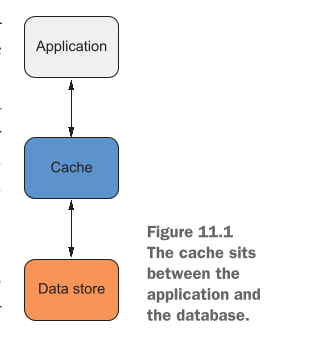
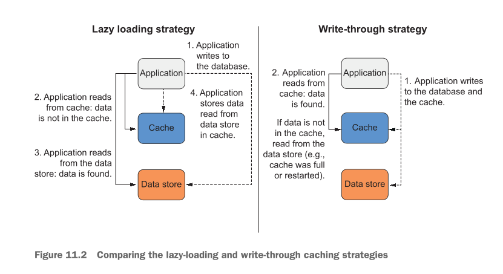
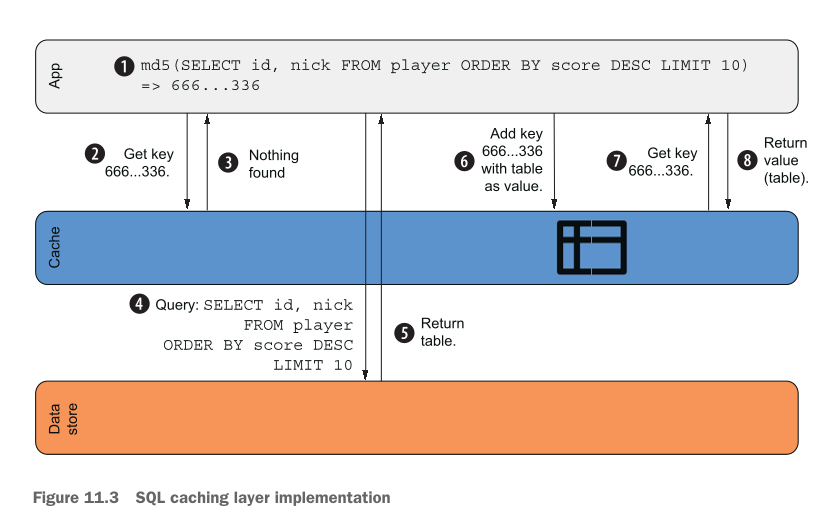

# Caching data in memory: Amazon ElastiCache and MemoryDB

## This chapter covers

* **Caching Layer ke Fawaid**: Aap ke application aur main data store (database) ke beech mein caching layer lagane ke kya benefits hote hain.
* **Ahem Terminology**: Cache cluster, node, shard, replication group, aur node group jaise ahem alfaz ki aasaan wazahat.
* **In-Memory Key-Value Store ka Istemal**: Fast in-memory database ko chalana aur operate karna.
* **Performance Tweaking aur Monitoring**: Cache ki speed ko mazeed behtar banana aur us par nazar rakhna.

---

## ElastiCache clusters

### Ek Real-World Game ki Misal (Mobile Game Leaderboard)

Socho ek bohot popular mobile game hai jahan millions of players live khel rahe hain. Unke scores aur ranks har second badal rahe hain aur woh leaderboard par apna rank baar baar check kar rahe hain.

* **Masla (Database Pressure)**: Agar har player ka score direct relational database (jaise MySQL ya PostgreSQL) mein write aur read hoga, toh DB par bohot heavy pressure aa jayega. Database ko bara (scale) karne se load shayad thoda sambhal jaye, lekin response tez (low latency) nahi hoga aur kharcha (cost) bohot ziada badh jayega. Relational database ko cache karna hamesha mehnga hota hai.
* **Hal (In-Memory Data Store - Redis)**: Gaming companies is maslay ko hal karne ke liye **Redis** jaisa in-memory data store istemal karti hain. Live leaderboard ko direct relational database se read karne ki bajaye, data ko Redis ke **Sorted Set** mein rakha jata hai. Sorted Set data insert hotay hi score ke mutabiq usay **automatically sort (tarteeb)** kar deta hai.
* **Speed ka Raz**: Kyunki yeh saara data computer ki super-fast **RAM (Memory)** mein hota hai aur isay sort karne ke liye koi heavy calculation nahi karni parti, is liye data seconds ke hazaarwein hisse mein mil jata hai. Client profile, game level, aur leaderboards ko RAM mein rakhne se main database par read traffic ka bhojh bilkul khatam ho jata hai.
* **Dono Data Stores ka Kirdar**: Relational database primary (permanent) record rakhta hai, jabke in-memory layer fast working memory ke taur par kaam karti hai.

---

### Figure 11.1 Ki Wazahat

Aap **Figure 11.1** mein dekh sakte hain:

<div align="center">
  
</div>

* **Application (Top)**: Aap ka mobile game ya web app.
* **Cache (Middle)**: Redis ya Memcached ki tez in-memory layer.
* **Data Store (Bottom)**: Main permanent database (jaise Relational DB).

Application direct Database ke paas jane ki bajaye pehle Cache se baat karti hai. Cache application aur main database ke bilkul beech mein baithta hai.

---

### Cache ke Main Fawaid (Benefits)

1. **Main DB ke Resources Azad Hote Hain**: Read requests ko cache khud handle kar leta hai, jiss se aap ka primary database bilkul free ho jata hai aur woh aasaani se write requests (naya data save karne) ko handle kar sakta hai.
2. **Application Super Fast Ho Jati Hai**: Cache RAM mein hone ki waja se hard disk wale database ke mukable hajaron guna tez jawab (response) deta hai.
3. **Paisa Bachta Hai (Cost Reduction)**: Primary database ko bara aur mehnga banane ke bajaye aap chota DB rakh sakte hain, kyunki ziada tar traffic sasta aur tez cache handle kar leta hai.

---

### Cache ka Nuqsan aur Security Measures

* **Volatility (Data Gumnay ka Khatra)**: In-memory cache RAM par chalta hai. Agar hardware kharab ho jaye ya server restart ho, toh RAM ka data urr sakta hai. Is liye hamesha permanent copy main database (disk storage) mein honi chahiye.
* **Redis Failover & Persistence**: Redis mein optional failover support hota hai. Agar primary node kharab ho jaye, toh replica node foran naya primary ban jata hai. Is ke alawa, modern Redis memory ke data ko disk par save (persistence) bhi kar sakta hai taake reboot ke baad data wapas restore ho sake.

---

### Caching Strategies (Data ko Cache mein Rakhne ke Tariqay)

#### 1. Lazy-Loading Strategy (Data Mangne Par Cache Mein Lana)

Is strategy mein data tabhi cache mein aata hai jab us ki zaroorat parti hai.

**Steps:**

1. Application naya data main **Data Store** (database) mein write karti hai.
2. Baad mein jab application ko data read karna hota hai, toh woh pehle **Caching Layer** se mangti hai.
3. Agar cache mein data **nahi** milta (Cache Miss), toh application direct main DB se data read karti hai, client ko wapas bhejti hai, aur sath hi us value ko cache mein bhi save kar deti hai.
4. Agli baar jab application ko dobara wohi data chahiye hoga, toh woh cache se poochti hai aur data foran mil jata hai (Cache Hit).

* **Pechidgi / Masla (Stale Data)**: Agar main DB mein data badal jaye, lekin cache mein abhi bhi purana data para ho, toh user ko galat data dikhega.
* **Hal (TTL - Time-To-Live)**: Is maslay ko hal karne ke liye hum data par **TTL** (Time-To-Live) set karte hain (maslan 5 minute). Iska matlab hai 5 minute baad cache wala data khud hi khatam ho jayega.
* **Trade-off**:
* **Short TTL**: Data hamesha taaza (fresh) rahega, lekin main DB par load thoda ziada hoga.
* **Long TTL**: Main DB bilkul free rahega, lekin data thoda out-of-sync hone ka chance hoga.
* **Note**: Aisa mat sochein ke 2-3 seconds ka TTL bekaar hai. Modern 2026 High-Scale Systems mein 2-3 seconds ke andar bhi millions of requests main DB se offload ho jati hain!


#### 2. Write-Through Strategy (Pehle se Data Cache Mein Likhna)

Is strategy mein data pehle se hi cache mein likh diya jata hai taake synchronization ka masla na aaye.

**Steps:**

1. Application jab bhi main DB mein data likhti hai, woh usi waqt cache mein bhi write kar deti hai (ya koi background job, AWS Lambda function, ya app khud yeh kaam karta hai).
2. Jab application ko read karna ho, woh cache se mangti hai jahan pehle se hi sab se taaza (latest) data majood hota hai.
3. Value client ko foran return kar di jati hai.

* **Pechidgi / Capacity Limit**: Main database ki disk storage bohot bari hoti hai, jabke cache RAM mein hone ki waja se chota hota hai. Agar cache full ho jaye toh woh naya data lena band kar dega ya purana data delete karega.
* **Hesab (Math Example)**:
* Agar 1 Global Leaderboard = `4 KB` hai aur Cache ki total capacity = `1 GB` (`1,048,576 KB`) hai.
* Toh aap sirf $\frac{1,048,576}{4} = 262,144$ leaderboards store kar sakte hain.
* Agar aap har team ke hisab se alag leaderboard rakhna shuru kar dein aur teams 262,144 se ziada ho jayein, toh cache memory full ho jayegi!


---

### Figure 11.2 Ki Wazahat

**Figure 11.2** Lazy-Loading aur Write-Through strategies ka amne-samne muqabla dikhati hai:

<div align="center">
  
</div>

* **Left (Lazy Loading)**: Read request pehle cache par gayi -> Data nahi mila -> Main DB se parha -> Client ko diya aur cache mein store kiya.
* **Right (Write-Through)**: Data write hotay hi DB aur Cache dono mein dala gaya -> Read request aane par hamesha direct cache se mil gaya.

---

### Eviction Strategy (LRU - Least Recently Used)

Jab cache memory full ho jati hai, toh usay purana data delete (evict) karna parta hai:

* **LRU (Least Recently Used)**: Is mein cache har item ka last access time (timestamp) note rakhta hai. Jab jagah khatam hoti hai, toh woh sab se purane timestamp wale data (jise sab se lambe arse se kisi ne use na kiya ho) ko delete kar deta hai.

---

### Key-Value Stores aur SQL Caching

Key-value stores (jaise Redis/Memcached) mein complex SQL queries (`WHERE`, `JOIN`) nahi chaltin. Yeh sirf simple Keys (strings) se Values return karte hain.

#### SQL Query Caching ka Tariqa:

Agar aap ko query chalani hai:

```sql
SELECT id, nickname FROM player ORDER BY score DESC LIMIT 10

```

Toh aap is SQL query ke text ko (ya uske **MD5 / SHA256 Hash** code ko) Cache ki **Key** bana dete hain (maslan `666...336`), aur query ke result (table) ko uski **Value** bana kar store karte hain.

---

### Figure 11.3 Ki Wazahat

**Figure 11.3** SQL Caching ke poore process ko 8 steps mein samjhati hai:

<div align="center">
  
</div>

1. **Step 1**: App SQL query `SELECT id, nick FROM player ORDER BY score DESC LIMIT 10` ka MD5 hash nikalta hai: `666...336`.
2. **Step 2**: App cache se poochta hai: "Kya key `666...336` ka data hai?"
3. **Step 3**: Cache jawab deta hai: "Nothing found" (Cache Miss).
4. **Step 4**: App main Relational Data Store (DB) par exact SQL query bhejta hai.
5. **Step 5**: Database result (table format mein) App ko wapas deta hai.
6. **Step 6**: App key `666...336` ke sath us result (table) ko Cache mein Add kar deta hai.
7. **Step 7**: Agli baar jab app ko dubara wohi query chahiye hoti hai, woh cache se Key `666...336` mangta hai.
8. **Step 8**: Cache foran stored Table (Value) app ko return kar deta hai (Cache Hit).

---

### Redis Sorted Set Command

Redis mein data ko aur efficient tarike se store karne ke liye Sorted Sets use hotay hain. Top 10 players nikalne ke liye SQL query ki jagah yeh command di jati hai:

```sql
ZREVRANGE "player-scores" 0 9

```

* **`ZREVRANGE`**: Redis ki built-in command jo Sorted Set ke elements ko highest score se lowest score ki taraf (descending order) read karti hai.
* **`"player-scores"`**: Redis mein bana hua Key name jahan tamam players aur unke scores ka data saved hai.
* **`0`**: Range ki shuruaat (0 index matlab 1st position / highest score).
* **`9`**: Range ka ikhtetam (9 index matlab 10th position).
* **Result**: Yeh command direct Top 10 highest score wale players return kar degi bina kisi heavy database calculation ke.

---

### Table 11.1 Comparing Memcached and Redis features

Below is the comparison table between Memcached and Redis:

| Comparison Feature | Memcached | Redis |
| --- | --- | --- |
| **Data types** | Sada (Simple) | Complex (Pechida) |
| **Data manipulation commands** | 12 | 125 |
| **Server-side scripting** | Nahi (No) | Haan (Yes - Lua) |
| **Transactions** | Nahi (No) | Haan (Yes) |

#### Table ki Asaan Wazahat:

* **Data Types**: Memcached sirf aam strings/numbers samajhta hai. Redis complex structures (Lists, Sets, Sorted Sets, Hashes) ko bhi handle karta hai.
* **Data Manipulation Commands**: Memcached mein sirf 12 basic commands hain, jabke Redis mein 125 advance commands hain jisse data ko bohot tarike se badla ja sakta hai.
* **Server-side Scripting**: Memcached mein koi code script nahi chal sakti. Redis ke andar aap custom Logic (Lua scripts) chala sakte hain.
* **Transactions**: Memcached mein ek sath multiple kaam (transactions) safe tarike se nahi ho sakte, jabke Redis mein Transactions ki poori support majood hai.

---

### Examples are 100% covered by the Free Tier

* Is chapter ke tamam practical examples **AWS Free Tier** ke andar bilkul muft (free) hain.
* Agar aap ka AWS account naya hai, toh aap kuch din tak in examples ko bina kisi kharche ke chala sakte hain. Bas practical khatam hotay hi resources ko delete (clean up) karna mat bhoolain.

---

### Amazon ElastiCache ke Fawaid (Fully Managed Service)

AWS **ElastiCache** ke zariye Memcached aur Redis clusters ko fully managed service ke taur par deta hai. AWS aap ke liye yeh tamaam heavy lifting karta hai:

* **Installation**: AWS khud aap ke liye software install aur engines ko optimize karta hai.
* **Administration**: Cluster ki dekh-bhal aur configuration AWS khud karta hai. Redis ke liye automated failovers bhi handle karta hai.
* **Monitoring**: Memory aur CPU ka data khud ba khud **Amazon CloudWatch** par monitor karne ke liye bhejta hai.
* **Patching**: Security upgrades aur updates aap ke diye gaye time window mein automatically apply kar deta hai.
* **Backups**: Redis data ke automatic backups leta hai.
* **Replication**: High availability ke liye automatic read-replicas set up kar deta hai.

---

## Creating a cache cluster

Is chapter mein hum zyada tar **Redis** engine par focus karenge kyunki Redis, Memcached ke muqabla mein zyada flexible hai aur is mein advance data structures chalane ki salahiyat hoti hai. Aap apni zarurat ke mutabiq engine chun sakte hain. Agar Memcached aur Redis mein koi bada farq hoga, toh hum usay sath sath highlight karte rahenge.

---

## Minimal CloudFormation template

### Real-World Mobile Game Example

Maan lijiye aap ek online multiplayer game bana rahe hain.

* **Zarurat**: Game mein har player ka live state (session) aur unka **highscore (leaderboard)** store karna hai.
* **Masla (Speed & Latency)**: Gamers ko behtareen experience dene ke liye game ka bilkul fast hona zaruri hai. Agar data aane mein thoda sa bhi delay (latency) hua, toh game lag karegi aur players disturb honge.
* **Hal**: Latency ko kam se kam rakhne ke liye hum **Redis** in-memory database ka istemal karenge.

---

### Cluster Banane Ke Tariqay Aur Properties

AWS par ElastiCache cluster banane ke 3 tariqay hain:

1. **AWS Management Console** (Buttons click karke)
2. **AWS CLI** (Commands likh kar)
3. **CloudFormation** (Code ke zariye infrastructure banana - Infra as Code)

Hum CloudFormation ka istemal karenge. CloudFormation mein ElastiCache cluster ka resource type `AWS::ElastiCache::CacheCluster` hota hai.

Ek basic cluster banane ke liye yeh **5 zaroori properties** chahiye hoti hain:

* **`Engine`**: Batana ke aap konsa database engine use kar rahe hain (`redis` ya `memcached`).
* **`CacheNodeType`**: Server ka size aur uski power, bilkul EC2 instance type ki tarah (maslan `cache.t2.micro`).
* **`NumCacheNodes`**: Cluster mein kitne servers (nodes) honge. Testing ya single-node ke liye `1` rakha jata hai.
* **`CacheSubnetGroupName`**: Subnets ka group jo batata hai ke cluster VPC ke kon se hissay mein chalega.
* **`VpcSecurityGroupIds`**: Network ki security ke liye attach kiya gaya Security Group (Virtual Firewall).

---

## Listing 11.1 Minimal CloudFormation template of an ElastiCache Redis single-node cluster

Yeh CloudFormation template ka pehla hissa hai jo ek single-node Redis cluster create karta hai:

```yaml
AWSTemplateFormatVersion: '2010-09-09'
Description: 'AWS in Action: chapter 11 (minimal)'
Parameters:
  VPC: # VPC aur subnets ko parameters ke tor par define karta hai
    Type: 'AWS::EC2::VPC::Id'
  SubnetA:
    Type: 'AWS::EC2::Subnet::Id'
  SubnetB:
    Type: 'AWS::EC2::Subnet::Id'
Resources:
  CacheSecurityGroup: # Cluster ke andar ya bahar jane wale traffic ko manage karne ke liye security group
    Type: 'AWS::EC2::SecurityGroup'
    Properties:
      GroupDescription: cache
      VpcId: !Ref VPC
      SecurityGroupIngress:
        - IpProtocol: tcp
          FromPort: 6379 # Redis port 6379 par listen karta hai. Ye tamam IP addresses se access ki ijazat deta hai, lekin kyunki cluster ke paas sirf private IP addresses hain, isliye access sirf VPC ke andar se mumkin hai. Aap section 11.3 mein isay behtar banayenge
          ToPort: 6379
          CidrIp: '0.0.0.0/0'
  CacheSubnetGroup: # Subnets ko aik subnet group ke andar define kiya gaya hai (wahi tareeqa RDS mein bhi istemal hota hai)
    Type: 'AWS::ElastiCache::SubnetGroup'
    Properties:
      Description: cache
      SubnetIds: # Subnets ki list jo cluster ke zariye istemal ho sakti hai
        - Ref: SubnetA
        - Ref: SubnetB
  Cache: # Redis cluster ko define karne ke liye resource
    Type: 'AWS::ElastiCache::CacheCluster'
    Properties:
      CacheNodeType: 'cache.t2.micro' # Node type cache.t2.micro ke paas 0.555 GiB memory hoti hai aur ye Free Tier ka hissa hai
      CacheSubnetGroupName: !Ref CacheSubnetGroup
      Engine: redis # ElastiCache redis aur memcached dono ko support karta hai. Hum redis istemal kar rahe hain kyunki hum aisi advanced data structures istemal karna chahte hain jo sirf Redis support karta hai
      NumCacheNodes: 1 # Testing ke liye aik single-node cluster banata hai, jis ki production workloads ke liye sifarish nahi ki jati kyunki ye aik single point of failure introduce karta hai
      VpcSecurityGroupIds:
        - !Ref CacheSecurityGroup

```

---

### Code Breakdown Aur Conceptual Wazahat

#### 1. Template Metadata & Parameters

* **`AWSTemplateFormatVersion: '2010-09-09'`**: CloudFormation template ki standard language version hai.
* **`Description: 'AWS in Action: chapter 11 (minimal)'`**: Code ka maqsad batata hai.
* **`Parameters`**: Jab yeh template chalega, toh yeh user se 3 inputs mangega:
* **`VPC`**: Main network jahan cluster banega.
* **`SubnetA`** aur **`SubnetB`**: Network ke do alag alag hisse (Availability Zones) taake high availability mil sake.


---

#### 2. Resource 1: Security Group (`CacheSecurityGroup`)

* **`Type: 'AWS::EC2::SecurityGroup'`**: Cluster ke gird ek digital boundary (firewall) banata hai.
* **`VpcId: !Ref VPC`**: Is firewall ko aap ke bataye gaye VPC se connect kar deta hai.
* **`SecurityGroupIngress`**: Bahar se aane wale traffic ke rules define karta hai:
* **`IpProtocol: tcp`**: Data transfer ke liye standard TCP protocol specify karta hai.
* **`FromPort: 6379` & `ToPort: 6379**`: Redis server by default **Port 6379** par kaam karta hai aur requests ka wait karta hai.
* **`CidrIp: '0.0.0.0/0'`**: Yeh puri dunya (`all IPs`) se aane walay traffic ko allow karta hai. Lekin kyunki ElastiCache ko AWS hamesha **Private IP** deta hai, is liye internet se koi direct connect nahi kar sakta; sirf VPC ke andar ke log hi is port par connect ho sakein ge.


---

#### 3. Resource 2: Subnet Group (`CacheSubnetGroup`)

* **`Type: 'AWS::ElastiCache::SubnetGroup'`**: Yeh wahi tareeqa hai jo AWS RDS databases mein use hota hai.
* **`SubnetIds`**: Is mein `SubnetA` aur `SubnetB` ko shamil kiya gaya hai. Iska matlab hai ke AWS aap ke Redis cluster ke nodes ko in subnets ke andar secure tareeqay se chalaye ga.

---

#### 4. Resource 3: Redis Cache Cluster (`Cache`)

* **`Type: 'AWS::ElastiCache::CacheCluster'`**: Main Redis server banana.
* **`Engine: redis`**: Hum ne Memcached ke bajaye Redis chun liya hai taake hum advanced data structures (jaise Sorted Sets) use kar sakein.
* **`CacheNodeType: 'cache.t2.micro'`**: Is server mein **0.555 GiB RAM** milti hai jo ke AWS Free Tier ke andar aati hai. *(Modern 2026 tech standard mein Graviton-based `cache.t4g.micro` ziada efficient aur cost-effective alternative mana jata hai)*.
* **`CacheSubnetGroupName: !Ref CacheSubnetGroup`**: Cluster ko upar banaye gaye Subnet Group se link karta hai.
* **`NumCacheNodes: 1`**: Is mein sirf 1 single node (server) hai.
* **Trade-off (Single Point of Failure - SPOF)**: Testing ke liye 1 node bilkul theek aur sasti hoti hai, lekin production ke liye yeh khatarnak hai. Agar yeh 1 node crash ho gayi toh pura cache down ho jayega kyunki koi backup (replica) majood nahi hai.


* **`VpcSecurityGroupIds`**: Pehle se banaye gaye `CacheSecurityGroup` ko is cluster ke sath attach karta hai.

---

### Private IP Access Architecture

* **Khas Baat**: ElastiCache nodes ke paas kabhi bhi Public IP address nahi hota, unhein sirf **Private IP address** milta hai.
* **Bacho Ki Tarah Samjiye**: Jaise aap ke ghar ke andar rakha hua fridge sirf ghar ke andar wale use kar sakte hain, raste se guzarta koi anjan banda bahar se fridge nahi khol sakta, waise hi yeh Redis cluster internet se chhupa hota hai.
* **Testing Ka Tariqa**: Is Redis cluster se connect hone ke liye aap ko usi VPC ke andar ek **EC2 Instance (Virtual Machine)** banana padega. Aap us EC2 instance ke andar login karenge aur wahan se Redis cluster ke Private IP address par connection banayenge.


---

## Test the Redis cluster

Pichle section mein hum ne Redis cluster create karne ki CloudFormation configuration ko dekha tha. Lekin kyunki ElastiCache cluster ko AWS secure rakhne ke liye sirf **Private IP Address** deta hai, is liye aap apne ghar ke internet ya laptop se direct us se connect nahi ho sakte.

Is maslay ko hal karne ke liye, hume usi VPC ke andar ek **Virtual Machine (EC2 Instance)** banani parti hai. Yeh Virtual Machine ek bridge (pulao) ka kaam karti hai: aap internet ke zariye is Virtual Machine mein enter hote hain, aur phir wahan se private network par Redis cluster ko test karte hain.

---

### CloudFormation Template Code Snippet

Neeche diya gaya CloudFormation template snippet humari Virtual Machine (EC2 Instance), uske Security Group, aur zaruri Outputs ko define karta hai:

```yaml
Resources:
  # [...]
  InstanceSecurityGroup: # Yeh security group sirf outbound traffic (bahar jaane wale traffic) ki ijazat deti hai
    Type: 'AWS::EC2::SecurityGroup'
    Properties:
      GroupDescription: 'vm'
      VpcId: !Ref VPC
  Instance: # Yeh woh virtual machine hai jiska istemal aap apne Redis cluster se connect karne ke liye karte hain
    Type: 'AWS::EC2::Instance'
    Properties:
      ImageId: !FindInMap [RegionMap, !Ref 'AWS::Region', AMI]
      InstanceType: 't2.micro'
      IamInstanceProfile: !Ref InstanceProfile
      NetworkInterfaces:
        - AssociatePublicIpAddress: true
          DeleteOnTermination: true
          DeviceIndex: 0
          GroupSet:
            - !Ref InstanceSecurityGroup
          SubnetId: !Ref SubnetA
Outputs:
  InstanceId:
    Value: !Ref Instance
    Description: 'EC2 Instance ID (connect via Session Manager)' # Session Manager ke zariye connect karne ke liye istemal hone wali instance ki ID
  CacheAddress:
    Value: !GetAtt 'Cache.RedisEndpoint.Address'
    Description: 'Redis DNS name (resolves to a private IP address)' # Redis cluster node ka DNS naam (jo aik private IP address par resolve hota hai)

```

---

### Code ka Asaan Breakdown

#### 1. Security Group (`InstanceSecurityGroup`)

* **`Type: 'AWS::EC2::SecurityGroup'`**: Yeh Virtual Machine ke chaugird ek digital guard (firewall) khada karta hai.
* **`GroupDescription: 'vm'`**: Firewall ka maqsad batata hai.
* **`VpcId: !Ref VPC`**: Is Security Group ko humare main VPC network ke sath jortaa hai.
* **Ahem Baat**: Is mein koi `Ingress` (andar aane wala) rule nahi hai, sirf `Outbound` (bahar jane wala) traffic allowed hai. Yeh VM ko secure rakhta hai taake bahar se koi direct attack na kar sake, jabke hum **AWS Systems Manager (SSM) Session Manager** ke zariye bina kisi SSH Port 22 open kiye is mein secure login kar sakte hain.

#### 2. Virtual Machine (`Instance`)

* **`Type: 'AWS::EC2::Instance'`**: Main Virtual Machine (server) create karta hai.
* **`ImageId: !FindInMap [RegionMap, !Ref 'AWS::Region', AMI]`**: Selected region ke mutabiq Amazon Linux ka sahi Operating System image pick karta hai.
* **`InstanceType: 't2.micro'`**: Small server size jo Free Tier ke andar aata hai. *(Modern 2026 tech standards mein `t3.micro` ya `t4g.micro` zyada use hotay hain, lekin `t2.micro` testing ke liye bilkul perfect hai)*.
* **`IamInstanceProfile: !Ref InstanceProfile`**: Is server ko AWS Systems Manager se baat karne ki ijazat (permissions) deta hai.
* **`NetworkInterfaces`**:
* **`AssociatePublicIpAddress: true`**: Is VM ko ek Public IP deta hai taake yeh internet se software packages download kar sake aur AWS SSM se connect ho sake.
* **`DeleteOnTermination: true`**: Jab hum is EC2 instance ko delete karenge, toh iski network card khud-ba-khud delete ho jayegi.
* **`DeviceIndex: 0`**: Is server ka pehla primary network card index.
* **`GroupSet`**: Is server par `InstanceSecurityGroup` firewall ko apply karta hai.
* **`SubnetId: !Ref SubnetA`**: Is VM ko pehle Subnet (`SubnetA`) mein place karta hai.


#### 3. Stack Outputs (`Outputs`)

* **`InstanceId`**:
* **`Value: !Ref Instance`**: Stack banne ke baad humein EC2 Machine ki unique ID batata hai taake hum Session Manager se is se connect ho sakein.


* **`CacheAddress`**:
* **`Value: !GetAtt 'Cache.RedisEndpoint.Address'`**: Redis cluster ka private DNS Address (endpoint) nikal kar deta hai (maslan `cluster-name.xxxx.cache.amazonaws.com`).


---

### Stack Create karne Ka Tariqa

AWS Management Console ke zariye stack banate waqt aap ko yeh 3 Parameters choose karne honge:

* **`SubnetA`**: Aap ke samne kam se kam do subnets aayenge, pehla wala select karein.
* **`SubnetB`**: Dusra wala subnet select karein.
* **`VPC`**: Aap ka standard **Default VPC** select karein.

---

### Where is the template located?

> **Template ki Location**:
> CloudFormation template GitHub par majood hai. Aap is Link se ZIP repository download kar sakte hain:
> `[https://github.com/AWSinAction/code3/archive/main.zip](https://github.com/AWSinAction/code3/archive/main.zip)`
> ZIP extract karne ke baad file aap ko is path par milegi: `chapter11/redis-minimal.yaml`.
> Is ke alawa yeh file S3 bucket par bhi available hai: `[http://mng.bz/9Vra](http://mng.bz/9Vra)`.

---

### Step-by-Step Redis Cluster Testing

Gamer ka session store karne aur highscore list (leaderboard) banane ke liye in steps ko follow karein:

1. **Step 1**: CloudFormation Console par stack status **`CREATE_COMPLETE`** hone ka intazaar karein.
2. **Step 2**: Stack par click karke **Outputs** tab mein jayein aur wahan se **`InstanceId`** aur **`CacheAddress`** ko copy kar lein.
3. **Step 3**: AWS Systems Manager **Session Manager** ke zariye EC2 Instance mein login karein.
4. **Step 4**: Terminal par neeche di gayi commands execute karein (`$CacheAddress` ki jagah apna actual copied DNS address dalein):

---

#### Terminal Commands & Redis CLI Execution

```bash
$ sudo amazon-linux-extras install -y redis6

```

* **Wazahat**: Yeh command Amazon Linux machine par **Redis 6 CLI tool** (command-line client) install karti hai taake hum terminal se Redis database ke sath baat kar sakein.

---

```bash
$ redis-cli -h $CacheAddress

```

* **Wazahat**: `redis-cli` tool ke zariye hum **Port 6379** par banay gaye Redis cluster endpoint (`$CacheAddress`) se connection establish karte hain.

---

```text
> SET session:gamer1 online EX 15
OK

```

* **Wazahat**:
* `SET`: Redis mein naya key-value pair save karne ke liye command.
* `session:gamer1`: Key ka naam.
* `online`: Value jo store ki ja rahi hai (player ka current status).
* `EX 15`: Time-To-Live (TTL) set karta hai **15 seconds** ke liye. Iska matlab hai 15 seconds baad yeh memory se auto-delete ho jayega.
* **Output `OK**`: Matleb Redis ne data kamyabi se RAM mein save kar liya hai.


---

```text
> GET session:gamer1
"online"

```

* **Wazahat**:
* `GET`: Key ki value read karne ke liye command.
* **Output `"online"**`: Kyunki 15 seconds abhi khatam nahi huay, Redis ne RAM se foran jawab de diya (**Cache Hit**).


---

```text
> GET session:gamer1
(nil)

```

* **Wazahat**:
* 15 seconds ka time guzarne ke baad jab dobara `GET session:gamer1` chalaya gaya, toh jawab mein `(nil)` aaya.
* **Output `(nil)**`: Nil ka matlab hai "Kuch nahi mila" (**Cache Miss**). Kyunki TTL khatam hotay hi Redis ne key ko RAM se delete kar diya tha.


---

```text
> ZADD highscore 100 "gamer1"
(integer) 1

```

* **Wazahat**: `ZADD` command **Sorted Set** data structure mein data add karti hai. Hum `highscore` naam ki list mein player `"gamer1"` ko **`100`** score ke sath add kar rahe hain. Response `(integer) 1` batata hai ke 1 naya member add ho gaya hai.

---

```text
> ZADD highscore 50 "gamer2"
(integer) 1

```

* **Wazahat**: `highscore` set mein `"gamer2"` ko **`50`** score ke sath add kiya gaya.

---

```text
> ZADD highscore 150 "gamer3"
(integer) 1

```

* **Wazahat**: `highscore` set mein `"gamer3"` ko **`150`** score ke sath add kiya gaya.

---

```text
> ZADD highscore 5 "gamer4"
(integer) 1

```

* **Wazahat**: `highscore` set mein `"gamer4"` ko **`5`** score ke sath add kiya gaya.

---

```text
> ZRANGE highscore -3 -1 WITHSCORES
1) "gamer2"
2) "50"
3) "gamer1"
4) "100"
5) "gamer3"
6) "150"

```

* **Wazahat**:
* `ZRANGE`: Sorted Set se Specific range ke elements nikalne ke liye use hoti hai.
* `highscore`: Target sorted set ka naam.
* `-3 -1`: Negative index ka matlab hai aakhri hisse se values uthana (`-3` teesra aakhri item, `-1` sab se aakhri item). Matlab top 3 high scores!
* `WITHSCORES`: Players ke naam ke sath unka score bhi print karne ke liye flag.
* **Output Breakdown**:
Redis Sorted Sets data ko automatically score ke mutabiq chote se bade (ascending order) mein arrange karte hain:
1. 3rd Highest: `"gamer2"` (Score: `50`)
2. 2nd Highest: `"gamer1"` (Score: `100`)
3. 1st Highest: `"gamer3"` (Score: `150`)


---

```text
> quit

```

* **Wazahat**: Redis CLI terminal session se bahar aane aur exit karne ke liye command.

---

Aap ne successfully ek real-world gaming backend ki tarah Redis cluster se connect karke user sessions aur fast highscore leaderboards ko test kar liya hai!

---

## Cleaning up

Lab complete hone ke baad resources ko delete karna bohot zaruri hota hai taake AWS account mein fuzool charges na aayein.

### Stack Delete karne ka Command

Aap CloudFormation Console se bhi stack delete kar sakte hain ya AWS CLI par yeh command chala sakte hain:

```bash
$ aws cloudformation delete-stack --stack-name redis-minimal

```

* **Wazahat**: Yeh command AWS CloudFormation ko instruction deti hai ke `redis-minimal` naam ke stack ke tehat banay gaye tamam resources (EC2 Instance, ElastiCache Redis Cluster, Security Groups, Subnet Groups) ko ek sath mukammal taur par delete kar de.

----