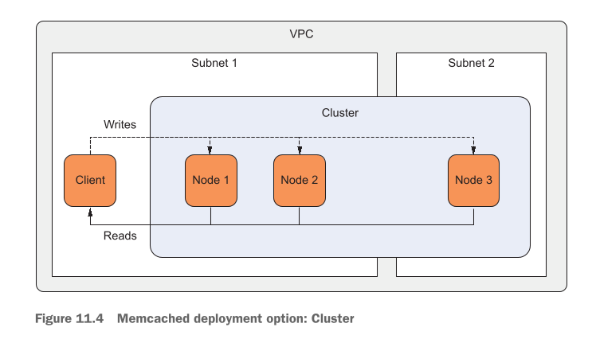
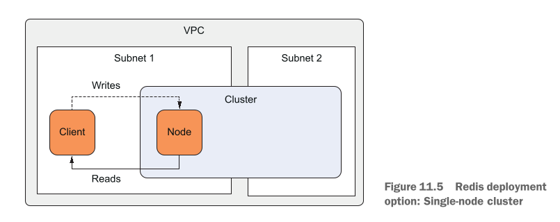
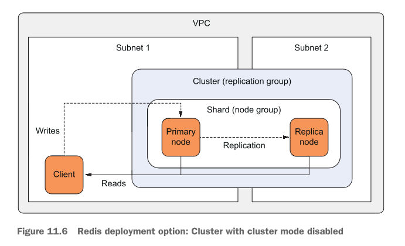
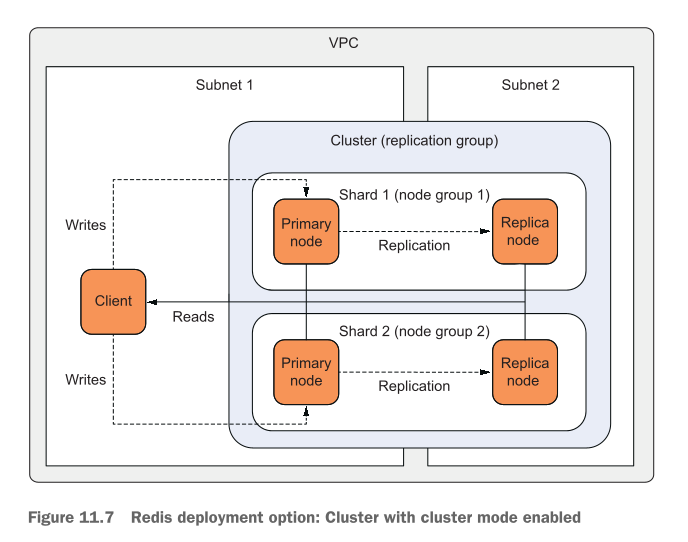
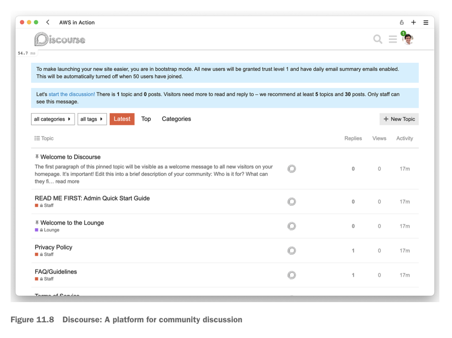
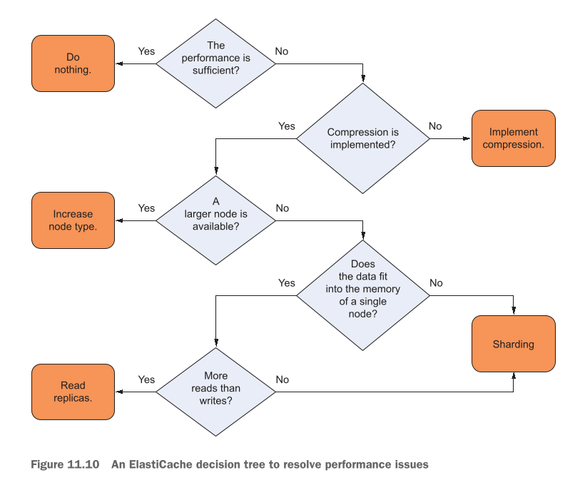

# Caching data in memory: Amazon ElastiCache and MemoryDB

<details open>
  <summary><strong>📚 Table of Contents</strong></summary>

  - [This chapter covers](#this-chapter-covers)
  - [ElastiCache clusters](#elasticache-clusters)
  - [Creating a cache cluster](#creating-a-cache-cluster)
  - [Minimal CloudFormation template](#minimal-cloudformation-template)
  - [Cache deployment options](#cache-deployment-options)
  - [Controlling cache access](#controlling-cache-access)
  - [Installing the sample application Discourse with CloudFormation](#installing-the-sample-application-discourse-with-cloudformation)
  - [Monitoring a cache](#monitoring-a-cache)
  - [Tweaking cache performance](#tweaking-cache-performance)
  - [Selecting the right cache node type](#selecting-the-right-cache-node-type)
  - [Selecting the right deployment option](#selecting-the-right-deployment-option)
  - [Compressing your data](#compressing-your-data)
  - [Summary](#summary)

</details>

## This chapter covers

* **Caching Layer ke Fawaid**: Aap ke application aur main data store (database) ke beech mein caching layer lagane ke kya benefits hote hain.
* **Ahem Terminology**: Cache cluster, node, shard, replication group, aur node group jaise ahem alfaz ki aasaan wazahat.
* **In-Memory Key-Value Store ka Istemal**: Fast in-memory database ko chalana aur operate karna.
* **Performance Tweaking aur Monitoring**: Cache ki speed ko mazeed behtar banana aur us par nazar rakhna.

---

## ElastiCache clusters

### Ek Real-World Game ki Misal (Mobile Game Leaderboard)

Socho ek bohot popular mobile game hai jahan millions of players live khel rahe hain. Unke scores aur ranks har second badal rahe hain aur woh leaderboard par apna rank baar baar check kar rahe hain.

* **Masla (Database Pressure)**: Agar har player ka score direct relational database (jaise MySQL ya PostgreSQL) mein write aur read hoga, toh DB par bohot heavy pressure aa jayega. Database ko bara (scale) karne se load shayad thoda sambhal jaye, lekin response tez (low latency) nahi hoga aur kharcha (cost) bohot ziada badh jayega. Relational database ko cache karna hamesha mehnga hota hai.
* **Hal (In-Memory Data Store - Redis)**: Gaming companies is maslay ko hal karne ke liye **Redis** jaisa in-memory data store istemal karti hain. Live leaderboard ko direct relational database se read karne ki bajaye, data ko Redis ke **Sorted Set** mein rakha jata hai. Sorted Set data insert hotay hi score ke mutabiq usay **automatically sort (tarteeb)** kar deta hai.
* **Speed ka Raz**: Kyunki yeh saara data computer ki super-fast **RAM (Memory)** mein hota hai aur isay sort karne ke liye koi heavy calculation nahi karni parti, is liye data seconds ke hazaarwein hisse mein mil jata hai. Client profile, game level, aur leaderboards ko RAM mein rakhne se main database par read traffic ka bhojh bilkul khatam ho jata hai.
* **Dono Data Stores ka Kirdar**: Relational database primary (permanent) record rakhta hai, jabke in-memory layer fast working memory ke taur par kaam karti hai.

---

### Figure 11.1 Ki Wazahat

Aap **Figure 11.1** mein dekh sakte hain:

<div align="center">
  
</div>

* **Application (Top)**: Aap ka mobile game ya web app.
* **Cache (Middle)**: Redis ya Memcached ki tez in-memory layer.
* **Data Store (Bottom)**: Main permanent database (jaise Relational DB).

Application direct Database ke paas jane ki bajaye pehle Cache se baat karti hai. Cache application aur main database ke bilkul beech mein baithta hai.

---

### Cache ke Main Fawaid (Benefits)

1. **Main DB ke Resources Azad Hote Hain**: Read requests ko cache khud handle kar leta hai, jiss se aap ka primary database bilkul free ho jata hai aur woh aasaani se write requests (naya data save karne) ko handle kar sakta hai.
2. **Application Super Fast Ho Jati Hai**: Cache RAM mein hone ki waja se hard disk wale database ke mukable hajaron guna tez jawab (response) deta hai.
3. **Paisa Bachta Hai (Cost Reduction)**: Primary database ko bara aur mehnga banane ke bajaye aap chota DB rakh sakte hain, kyunki ziada tar traffic sasta aur tez cache handle kar leta hai.

---

### Cache ka Nuqsan aur Security Measures

* **Volatility (Data Gumnay ka Khatra)**: In-memory cache RAM par chalta hai. Agar hardware kharab ho jaye ya server restart ho, toh RAM ka data urr sakta hai. Is liye hamesha permanent copy main database (disk storage) mein honi chahiye.
* **Redis Failover & Persistence**: Redis mein optional failover support hota hai. Agar primary node kharab ho jaye, toh replica node foran naya primary ban jata hai. Is ke alawa, modern Redis memory ke data ko disk par save (persistence) bhi kar sakta hai taake reboot ke baad data wapas restore ho sake.

---

### Caching Strategies (Data ko Cache mein Rakhne ke Tariqay)

#### 1. Lazy-Loading Strategy (Data Mangne Par Cache Mein Lana)

Is strategy mein data tabhi cache mein aata hai jab us ki zaroorat parti hai.

**Steps:**

1. Application naya data main **Data Store** (database) mein write karti hai.
2. Baad mein jab application ko data read karna hota hai, toh woh pehle **Caching Layer** se mangti hai.
3. Agar cache mein data **nahi** milta (Cache Miss), toh application direct main DB se data read karti hai, client ko wapas bhejti hai, aur sath hi us value ko cache mein bhi save kar deti hai.
4. Agli baar jab application ko dobara wohi data chahiye hoga, toh woh cache se poochti hai aur data foran mil jata hai (Cache Hit).

* **Pechidgi / Masla (Stale Data)**: Agar main DB mein data badal jaye, lekin cache mein abhi bhi purana data para ho, toh user ko galat data dikhega.
* **Hal (TTL - Time-To-Live)**: Is maslay ko hal karne ke liye hum data par **TTL** (Time-To-Live) set karte hain (maslan 5 minute). Iska matlab hai 5 minute baad cache wala data khud hi khatam ho jayega.
* **Trade-off**:
* **Short TTL**: Data hamesha taaza (fresh) rahega, lekin main DB par load thoda ziada hoga.
* **Long TTL**: Main DB bilkul free rahega, lekin data thoda out-of-sync hone ka chance hoga.
* **Note**: Aisa mat sochein ke 2-3 seconds ka TTL bekaar hai. Modern 2026 High-Scale Systems mein 2-3 seconds ke andar bhi millions of requests main DB se offload ho jati hain!


#### 2. Write-Through Strategy (Pehle se Data Cache Mein Likhna)

Is strategy mein data pehle se hi cache mein likh diya jata hai taake synchronization ka masla na aaye.

**Steps:**

1. Application jab bhi main DB mein data likhti hai, woh usi waqt cache mein bhi write kar deti hai (ya koi background job, AWS Lambda function, ya app khud yeh kaam karta hai).
2. Jab application ko read karna ho, woh cache se mangti hai jahan pehle se hi sab se taaza (latest) data majood hota hai.
3. Value client ko foran return kar di jati hai.

* **Pechidgi / Capacity Limit**: Main database ki disk storage bohot bari hoti hai, jabke cache RAM mein hone ki waja se chota hota hai. Agar cache full ho jaye toh woh naya data lena band kar dega ya purana data delete karega.
* **Hesab (Math Example)**:
* Agar 1 Global Leaderboard = `4 KB` hai aur Cache ki total capacity = `1 GB` (`1,048,576 KB`) hai.
* Toh aap sirf $\frac{1,048,576}{4} = 262,144$ leaderboards store kar sakte hain.
* Agar aap har team ke hisab se alag leaderboard rakhna shuru kar dein aur teams 262,144 se ziada ho jayein, toh cache memory full ho jayegi!


---

### Figure 11.2 Ki Wazahat

**Figure 11.2** Lazy-Loading aur Write-Through strategies ka amne-samne muqabla dikhati hai:

<div align="center">
  
</div>

* **Left (Lazy Loading)**: Read request pehle cache par gayi -> Data nahi mila -> Main DB se parha -> Client ko diya aur cache mein store kiya.
* **Right (Write-Through)**: Data write hotay hi DB aur Cache dono mein dala gaya -> Read request aane par hamesha direct cache se mil gaya.

---

### Eviction Strategy (LRU - Least Recently Used)

Jab cache memory full ho jati hai, toh usay purana data delete (evict) karna parta hai:

* **LRU (Least Recently Used)**: Is mein cache har item ka last access time (timestamp) note rakhta hai. Jab jagah khatam hoti hai, toh woh sab se purane timestamp wale data (jise sab se lambe arse se kisi ne use na kiya ho) ko delete kar deta hai.

---

### Key-Value Stores aur SQL Caching

Key-value stores (jaise Redis/Memcached) mein complex SQL queries (`WHERE`, `JOIN`) nahi chaltin. Yeh sirf simple Keys (strings) se Values return karte hain.

#### SQL Query Caching ka Tariqa:

Agar aap ko query chalani hai:

```sql
SELECT id, nickname FROM player ORDER BY score DESC LIMIT 10
```

Toh aap is SQL query ke text ko (ya uske **MD5 / SHA256 Hash** code ko) Cache ki **Key** bana dete hain (maslan `666...336`), aur query ke result (table) ko uski **Value** bana kar store karte hain.

---

### Figure 11.3 Ki Wazahat

**Figure 11.3** SQL Caching ke poore process ko 8 steps mein samjhati hai:

<div align="center">
  
</div>

1. **Step 1**: App SQL query `SELECT id, nick FROM player ORDER BY score DESC LIMIT 10` ka MD5 hash nikalta hai: `666...336`.
2. **Step 2**: App cache se poochta hai: "Kya key `666...336` ka data hai?"
3. **Step 3**: Cache jawab deta hai: "Nothing found" (Cache Miss).
4. **Step 4**: App main Relational Data Store (DB) par exact SQL query bhejta hai.
5. **Step 5**: Database result (table format mein) App ko wapas deta hai.
6. **Step 6**: App key `666...336` ke sath us result (table) ko Cache mein Add kar deta hai.
7. **Step 7**: Agli baar jab app ko dubara wohi query chahiye hoti hai, woh cache se Key `666...336` mangta hai.
8. **Step 8**: Cache foran stored Table (Value) app ko return kar deta hai (Cache Hit).

---

### Redis Sorted Set Command

Redis mein data ko aur efficient tarike se store karne ke liye Sorted Sets use hotay hain. Top 10 players nikalne ke liye SQL query ki jagah yeh command di jati hai:

```sql
ZREVRANGE "player-scores" 0 9
```

* **`ZREVRANGE`**: Redis ki built-in command jo Sorted Set ke elements ko highest score se lowest score ki taraf (descending order) read karti hai.
* **`"player-scores"`**: Redis mein bana hua Key name jahan tamam players aur unke scores ka data saved hai.
* **`0`**: Range ki shuruaat (0 index matlab 1st position / highest score).
* **`9`**: Range ka ikhtetam (9 index matlab 10th position).
* **Result**: Yeh command direct Top 10 highest score wale players return kar degi bina kisi heavy database calculation ke.

---

### Table 11.1 Comparing Memcached and Redis features

Below is the comparison table between Memcached and Redis:

| Comparison Feature | Memcached | Redis |
| --- | --- | --- |
| **Data types** | Sada (Simple) | Complex (Pechida) |
| **Data manipulation commands** | 12 | 125 |
| **Server-side scripting** | Nahi (No) | Haan (Yes - Lua) |
| **Transactions** | Nahi (No) | Haan (Yes) |

#### Table ki Asaan Wazahat:

* **Data Types**: Memcached sirf aam strings/numbers samajhta hai. Redis complex structures (Lists, Sets, Sorted Sets, Hashes) ko bhi handle karta hai.
* **Data Manipulation Commands**: Memcached mein sirf 12 basic commands hain, jabke Redis mein 125 advance commands hain jisse data ko bohot tarike se badla ja sakta hai.
* **Server-side Scripting**: Memcached mein koi code script nahi chal sakti. Redis ke andar aap custom Logic (Lua scripts) chala sakte hain.
* **Transactions**: Memcached mein ek sath multiple kaam (transactions) safe tarike se nahi ho sakte, jabke Redis mein Transactions ki poori support majood hai.

---

### Examples are 100% covered by the Free Tier

* Is chapter ke tamam practical examples **AWS Free Tier** ke andar bilkul muft (free) hain.
* Agar aap ka AWS account naya hai, toh aap kuch din tak in examples ko bina kisi kharche ke chala sakte hain. Bas practical khatam hotay hi resources ko delete (clean up) karna mat bhoolain.

---

### Amazon ElastiCache ke Fawaid (Fully Managed Service)

AWS **ElastiCache** ke zariye Memcached aur Redis clusters ko fully managed service ke taur par deta hai. AWS aap ke liye yeh tamaam heavy lifting karta hai:

* **Installation**: AWS khud aap ke liye software install aur engines ko optimize karta hai.
* **Administration**: Cluster ki dekh-bhal aur configuration AWS khud karta hai. Redis ke liye automated failovers bhi handle karta hai.
* **Monitoring**: Memory aur CPU ka data khud ba khud **Amazon CloudWatch** par monitor karne ke liye bhejta hai.
* **Patching**: Security upgrades aur updates aap ke diye gaye time window mein automatically apply kar deta hai.
* **Backups**: Redis data ke automatic backups leta hai.
* **Replication**: High availability ke liye automatic read-replicas set up kar deta hai.

---

## Creating a cache cluster

Is chapter mein hum zyada tar **Redis** engine par focus karenge kyunki Redis, Memcached ke muqabla mein zyada flexible hai aur is mein advance data structures chalane ki salahiyat hoti hai. Aap apni zarurat ke mutabiq engine chun sakte hain. Agar Memcached aur Redis mein koi bada farq hoga, toh hum usay sath sath highlight karte rahenge.

---

## Minimal CloudFormation template

### Real-World Mobile Game Example

Maan lijiye aap ek online multiplayer game bana rahe hain.

* **Zarurat**: Game mein har player ka live state (session) aur unka **highscore (leaderboard)** store karna hai.
* **Masla (Speed & Latency)**: Gamers ko behtareen experience dene ke liye game ka bilkul fast hona zaruri hai. Agar data aane mein thoda sa bhi delay (latency) hua, toh game lag karegi aur players disturb honge.
* **Hal**: Latency ko kam se kam rakhne ke liye hum **Redis** in-memory database ka istemal karenge.

---

### Cluster Banane Ke Tariqay Aur Properties

AWS par ElastiCache cluster banane ke 3 tariqay hain:

1. **AWS Management Console** (Buttons click karke)
2. **AWS CLI** (Commands likh kar)
3. **CloudFormation** (Code ke zariye infrastructure banana - Infra as Code)

Hum CloudFormation ka istemal karenge. CloudFormation mein ElastiCache cluster ka resource type `AWS::ElastiCache::CacheCluster` hota hai.

Ek basic cluster banane ke liye yeh **5 zaroori properties** chahiye hoti hain:

* **`Engine`**: Batana ke aap konsa database engine use kar rahe hain (`redis` ya `memcached`).
* **`CacheNodeType`**: Server ka size aur uski power, bilkul EC2 instance type ki tarah (maslan `cache.t2.micro`).
* **`NumCacheNodes`**: Cluster mein kitne servers (nodes) honge. Testing ya single-node ke liye `1` rakha jata hai.
* **`CacheSubnetGroupName`**: Subnets ka group jo batata hai ke cluster VPC ke kon se hissay mein chalega.
* **`VpcSecurityGroupIds`**: Network ki security ke liye attach kiya gaya Security Group (Virtual Firewall).

---

## Listing 11.1 Minimal CloudFormation template of an ElastiCache Redis single-node cluster

Yeh CloudFormation template ka pehla hissa hai jo ek single-node Redis cluster create karta hai:

```yaml
AWSTemplateFormatVersion: '2010-09-09'
Description: 'AWS in Action: chapter 11 (minimal)'
Parameters:
  VPC: # VPC aur subnets ko parameters ke tor par define karta hai
    Type: 'AWS::EC2::VPC::Id'
  SubnetA:
    Type: 'AWS::EC2::Subnet::Id'
  SubnetB:
    Type: 'AWS::EC2::Subnet::Id'
Resources:
  CacheSecurityGroup: # Cluster ke andar ya bahar jane wale traffic ko manage karne ke liye security group
    Type: 'AWS::EC2::SecurityGroup'
    Properties:
      GroupDescription: cache
      VpcId: !Ref VPC
      SecurityGroupIngress:
        - IpProtocol: tcp
          FromPort: 6379 # Redis port 6379 par listen karta hai. Ye tamam IP addresses se access ki ijazat deta hai, lekin kyunki cluster ke paas sirf private IP addresses hain, isliye access sirf VPC ke andar se mumkin hai. Aap section 11.3 mein isay behtar banayenge
          ToPort: 6379
          CidrIp: '0.0.0.0/0'
  CacheSubnetGroup: # Subnets ko aik subnet group ke andar define kiya gaya hai (wahi tareeqa RDS mein bhi istemal hota hai)
    Type: 'AWS::ElastiCache::SubnetGroup'
    Properties:
      Description: cache
      SubnetIds: # Subnets ki list jo cluster ke zariye istemal ho sakti hai
        - Ref: SubnetA
        - Ref: SubnetB
  Cache: # Redis cluster ko define karne ke liye resource
    Type: 'AWS::ElastiCache::CacheCluster'
    Properties:
      CacheNodeType: 'cache.t2.micro' # Node type cache.t2.micro ke paas 0.555 GiB memory hoti hai aur ye Free Tier ka hissa hai
      CacheSubnetGroupName: !Ref CacheSubnetGroup
      Engine: redis # ElastiCache redis aur memcached dono ko support karta hai. Hum redis istemal kar rahe hain kyunki hum aisi advanced data structures istemal karna chahte hain jo sirf Redis support karta hai
      NumCacheNodes: 1 # Testing ke liye aik single-node cluster banata hai, jis ki production workloads ke liye sifarish nahi ki jati kyunki ye aik single point of failure introduce karta hai
      VpcSecurityGroupIds:
        - !Ref CacheSecurityGroup

```

---

### Code Breakdown Aur Conceptual Wazahat

#### 1. Template Metadata & Parameters

* **`AWSTemplateFormatVersion: '2010-09-09'`**: CloudFormation template ki standard language version hai.
* **`Description: 'AWS in Action: chapter 11 (minimal)'`**: Code ka maqsad batata hai.
* **`Parameters`**: Jab yeh template chalega, toh yeh user se 3 inputs mangega:
* **`VPC`**: Main network jahan cluster banega.
* **`SubnetA`** aur **`SubnetB`**: Network ke do alag alag hisse (Availability Zones) taake high availability mil sake.


---

#### 2. Resource 1: Security Group (`CacheSecurityGroup`)

* **`Type: 'AWS::EC2::SecurityGroup'`**: Cluster ke gird ek digital boundary (firewall) banata hai.
* **`VpcId: !Ref VPC`**: Is firewall ko aap ke bataye gaye VPC se connect kar deta hai.
* **`SecurityGroupIngress`**: Bahar se aane wale traffic ke rules define karta hai:
* **`IpProtocol: tcp`**: Data transfer ke liye standard TCP protocol specify karta hai.
* **`FromPort: 6379` & `ToPort: 6379`**: Redis server by default **Port 6379** par kaam karta hai aur requests ka wait karta hai.
* **`CidrIp: '0.0.0.0/0'`**: Yeh puri dunya (`all IPs`) se aane walay traffic ko allow karta hai. Lekin kyunki ElastiCache ko AWS hamesha **Private IP** deta hai, is liye internet se koi direct connect nahi kar sakta; sirf VPC ke andar ke log hi is port par connect ho sakein ge.


---

#### 3. Resource 2: Subnet Group (`CacheSubnetGroup`)

* **`Type: 'AWS::ElastiCache::SubnetGroup'`**: Yeh wahi tareeqa hai jo AWS RDS databases mein use hota hai.
* **`SubnetIds`**: Is mein `SubnetA` aur `SubnetB` ko shamil kiya gaya hai. Iska matlab hai ke AWS aap ke Redis cluster ke nodes ko in subnets ke andar secure tareeqay se chalaye ga.

---

#### 4. Resource 3: Redis Cache Cluster (`Cache`)

* **`Type: 'AWS::ElastiCache::CacheCluster'`**: Main Redis server banana.
* **`Engine: redis`**: Hum ne Memcached ke bajaye Redis chun liya hai taake hum advanced data structures (jaise Sorted Sets) use kar sakein.
* **`CacheNodeType: 'cache.t2.micro'`**: Is server mein **0.555 GiB RAM** milti hai jo ke AWS Free Tier ke andar aati hai. *(Modern 2026 tech standard mein Graviton-based `cache.t4g.micro` ziada efficient aur cost-effective alternative mana jata hai)*.
* **`CacheSubnetGroupName: !Ref CacheSubnetGroup`**: Cluster ko upar banaye gaye Subnet Group se link karta hai.
* **`NumCacheNodes: 1`**: Is mein sirf 1 single node (server) hai.
* **Trade-off (Single Point of Failure - SPOF)**: Testing ke liye 1 node bilkul theek aur sasti hoti hai, lekin production ke liye yeh khatarnak hai. Agar yeh 1 node crash ho gayi toh pura cache down ho jayega kyunki koi backup (replica) majood nahi hai.


* **`VpcSecurityGroupIds`**: Pehle se banaye gaye `CacheSecurityGroup` ko is cluster ke sath attach karta hai.

---

### Private IP Access Architecture

* **Khas Baat**: ElastiCache nodes ke paas kabhi bhi Public IP address nahi hota, unhein sirf **Private IP address** milta hai.
* **Bacho Ki Tarah Samjiye**: Jaise aap ke ghar ke andar rakha hua fridge sirf ghar ke andar wale use kar sakte hain, raste se guzarta koi anjan banda bahar se fridge nahi khol sakta, waise hi yeh Redis cluster internet se chhupa hota hai.
* **Testing Ka Tariqa**: Is Redis cluster se connect hone ke liye aap ko usi VPC ke andar ek **EC2 Instance (Virtual Machine)** banana padega. Aap us EC2 instance ke andar login karenge aur wahan se Redis cluster ke Private IP address par connection banayenge.


---

## Test the Redis cluster

Pichle section mein hum ne Redis cluster create karne ki CloudFormation configuration ko dekha tha. Lekin kyunki ElastiCache cluster ko AWS secure rakhne ke liye sirf **Private IP Address** deta hai, is liye aap apne ghar ke internet ya laptop se direct us se connect nahi ho sakte.

Is maslay ko hal karne ke liye, hume usi VPC ke andar ek **Virtual Machine (EC2 Instance)** banani parti hai. Yeh Virtual Machine ek bridge (pulao) ka kaam karti hai: aap internet ke zariye is Virtual Machine mein enter hote hain, aur phir wahan se private network par Redis cluster ko test karte hain.

---

### CloudFormation Template Code Snippet

Neeche diya gaya CloudFormation template snippet humari Virtual Machine (EC2 Instance), uske Security Group, aur zaruri Outputs ko define karta hai:

```yaml
Resources:
  # [...]
  InstanceSecurityGroup: # Yeh security group sirf outbound traffic (bahar jaane wale traffic) ki ijazat deti hai
    Type: 'AWS::EC2::SecurityGroup'
    Properties:
      GroupDescription: 'vm'
      VpcId: !Ref VPC
  Instance: # Yeh woh virtual machine hai jiska istemal aap apne Redis cluster se connect karne ke liye karte hain
    Type: 'AWS::EC2::Instance'
    Properties:
      ImageId: !FindInMap [RegionMap, !Ref 'AWS::Region', AMI]
      InstanceType: 't2.micro'
      IamInstanceProfile: !Ref InstanceProfile
      NetworkInterfaces:
        - AssociatePublicIpAddress: true
          DeleteOnTermination: true
          DeviceIndex: 0
          GroupSet:
            - !Ref InstanceSecurityGroup
          SubnetId: !Ref SubnetA
Outputs:
  InstanceId:
    Value: !Ref Instance
    Description: 'EC2 Instance ID (connect via Session Manager)' # Session Manager ke zariye connect karne ke liye istemal hone wali instance ki ID
  CacheAddress:
    Value: !GetAtt 'Cache.RedisEndpoint.Address'
    Description: 'Redis DNS name (resolves to a private IP address)' # Redis cluster node ka DNS naam (jo aik private IP address par resolve hota hai)

```

---

### Code ka Asaan Breakdown

#### 1. Security Group (`InstanceSecurityGroup`)

* **`Type: 'AWS::EC2::SecurityGroup'`**: Yeh Virtual Machine ke chaugird ek digital guard (firewall) khada karta hai.
* **`GroupDescription: 'vm'`**: Firewall ka maqsad batata hai.
* **`VpcId: !Ref VPC`**: Is Security Group ko humare main VPC network ke sath jortaa hai.
* **Ahem Baat**: Is mein koi `Ingress` (andar aane wala) rule nahi hai, sirf `Outbound` (bahar jane wala) traffic allowed hai. Yeh VM ko secure rakhta hai taake bahar se koi direct attack na kar sake, jabke hum **AWS Systems Manager (SSM) Session Manager** ke zariye bina kisi SSH Port 22 open kiye is mein secure login kar sakte hain.

#### 2. Virtual Machine (`Instance`)

* **`Type: 'AWS::EC2::Instance'`**: Main Virtual Machine (server) create karta hai.
* **`ImageId: !FindInMap [RegionMap, !Ref 'AWS::Region', AMI]`**: Selected region ke mutabiq Amazon Linux ka sahi Operating System image pick karta hai.
* **`InstanceType: 't2.micro'`**: Small server size jo Free Tier ke andar aata hai. *(Modern 2026 tech standards mein `t3.micro` ya `t4g.micro` zyada use hotay hain, lekin `t2.micro` testing ke liye bilkul perfect hai)*.
* **`IamInstanceProfile: !Ref InstanceProfile`**: Is server ko AWS Systems Manager se baat karne ki ijazat (permissions) deta hai.
* **`NetworkInterfaces`**:
* **`AssociatePublicIpAddress: true`**: Is VM ko ek Public IP deta hai taake yeh internet se software packages download kar sake aur AWS SSM se connect ho sake.
* **`DeleteOnTermination: true`**: Jab hum is EC2 instance ko delete karenge, toh iski network card khud-ba-khud delete ho jayegi.
* **`DeviceIndex: 0`**: Is server ka pehla primary network card index.
* **`GroupSet`**: Is server par `InstanceSecurityGroup` firewall ko apply karta hai.
* **`SubnetId: !Ref SubnetA`**: Is VM ko pehle Subnet (`SubnetA`) mein place karta hai.


#### 3. Stack Outputs (`Outputs`)

* **`InstanceId`**:
* **`Value: !Ref Instance`**: Stack banne ke baad humein EC2 Machine ki unique ID batata hai taake hum Session Manager se is se connect ho sakein.


* **`CacheAddress`**:
* **`Value: !GetAtt 'Cache.RedisEndpoint.Address'`**: Redis cluster ka private DNS Address (endpoint) nikal kar deta hai (maslan `cluster-name.xxxx.cache.amazonaws.com`).


---

### Stack Create karne Ka Tariqa

AWS Management Console ke zariye stack banate waqt aap ko yeh 3 Parameters choose karne honge:

* **`SubnetA`**: Aap ke samne kam se kam do subnets aayenge, pehla wala select karein.
* **`SubnetB`**: Dusra wala subnet select karein.
* **`VPC`**: Aap ka standard **Default VPC** select karein.

---

### Where is the template located?

> **Template ki Location**:
> CloudFormation template GitHub par majood hai. Aap is Link se ZIP repository download kar sakte hain:
> `[https://github.com/AWSinAction/code3/archive/main.zip](https://github.com/AWSinAction/code3/archive/main.zip)`
> ZIP extract karne ke baad file aap ko is path par milegi: `chapter11/redis-minimal.yaml`.
> Is ke alawa yeh file S3 bucket par bhi available hai: `[http://mng.bz/9Vra](http://mng.bz/9Vra)`.

---

### Step-by-Step Redis Cluster Testing

Gamer ka session store karne aur highscore list (leaderboard) banane ke liye in steps ko follow karein:

1. **Step 1**: CloudFormation Console par stack status **`CREATE_COMPLETE`** hone ka intazaar karein.
2. **Step 2**: Stack par click karke **Outputs** tab mein jayein aur wahan se **`InstanceId`** aur **`CacheAddress`** ko copy kar lein.
3. **Step 3**: AWS Systems Manager **Session Manager** ke zariye EC2 Instance mein login karein.
4. **Step 4**: Terminal par neeche di gayi commands execute karein (`$CacheAddress` ki jagah apna actual copied DNS address dalein):

---

#### Terminal Commands & Redis CLI Execution

```bash
$ sudo amazon-linux-extras install -y redis6
```

* **Wazahat**: Yeh command Amazon Linux machine par **Redis 6 CLI tool** (command-line client) install karti hai taake hum terminal se Redis database ke sath baat kar sakein.

---

```bash
$ redis-cli -h $CacheAddress
```

* **Wazahat**: `redis-cli` tool ke zariye hum **Port 6379** par banay gaye Redis cluster endpoint (`$CacheAddress`) se connection establish karte hain.

---

```text
> SET session:gamer1 online EX 15
OK
```

* **Wazahat**:
* `SET`: Redis mein naya key-value pair save karne ke liye command.
* `session:gamer1`: Key ka naam.
* `online`: Value jo store ki ja rahi hai (player ka current status).
* `EX 15`: Time-To-Live (TTL) set karta hai **15 seconds** ke liye. Iska matlab hai 15 seconds baad yeh memory se auto-delete ho jayega.
* **`Output OK`**: Matleb Redis ne data kamyabi se RAM mein save kar liya hai.


---

```text
> GET session:gamer1
"online"
```

* **Wazahat**:
* `GET`: Key ki value read karne ke liye command.
* **`Output "online"`**: Kyunki 15 seconds abhi khatam nahi huay, Redis ne RAM se foran jawab de diya (**Cache Hit**).


---

```text
> GET session:gamer1
(nil)
```

* **Wazahat**:
* 15 seconds ka time guzarne ke baad jab dobara `GET session:gamer1` chalaya gaya, toh jawab mein `(nil)` aaya.
* **Output `(nil)**`: Nil ka matlab hai "Kuch nahi mila" (**Cache Miss**). Kyunki TTL khatam hotay hi Redis ne key ko RAM se delete kar diya tha.


---

```text
> ZADD highscore 100 "gamer1"
(integer) 1
```

* **Wazahat**: `ZADD` command **Sorted Set** data structure mein data add karti hai. Hum `highscore` naam ki list mein player `"gamer1"` ko **`100`** score ke sath add kar rahe hain. Response `(integer) 1` batata hai ke 1 naya member add ho gaya hai.

---

```text
> ZADD highscore 50 "gamer2"
(integer) 1
```

* **Wazahat**: `highscore` set mein `"gamer2"` ko **`50`** score ke sath add kiya gaya.

---

```text
> ZADD highscore 150 "gamer3"
(integer) 1
```

* **Wazahat**: `highscore` set mein `"gamer3"` ko **`150`** score ke sath add kiya gaya.

---

```text
> ZADD highscore 5 "gamer4"
(integer) 1
```

* **Wazahat**: `highscore` set mein `"gamer4"` ko **`5`** score ke sath add kiya gaya.

---

```text
> ZRANGE highscore -3 -1 WITHSCORES
1) "gamer2"
2) "50"
3) "gamer1"
4) "100"
5) "gamer3"
6) "150"
```

* **Wazahat**:
* `ZRANGE`: Sorted Set se Specific range ke elements nikalne ke liye use hoti hai.
* `highscore`: Target sorted set ka naam.
* `-3 -1`: Negative index ka matlab hai aakhri hisse se values uthana (`-3` teesra aakhri item, `-1` sab se aakhri item). Matlab top 3 high scores!
* `WITHSCORES`: Players ke naam ke sath unka score bhi print karne ke liye flag.
* **Output Breakdown**:
Redis Sorted Sets data ko automatically score ke mutabiq chote se bade (ascending order) mein arrange karte hain:
1. 3rd Highest: `"gamer2"` (Score: `50`)
2. 2nd Highest: `"gamer1"` (Score: `100`)
3. 1st Highest: `"gamer3"` (Score: `150`)


---

```text
> quit
```

* **Wazahat**: Redis CLI terminal session se bahar aane aur exit karne ke liye command.

---

Aap ne successfully ek real-world gaming backend ki tarah Redis cluster se connect karke user sessions aur fast highscore leaderboards ko test kar liya hai!

---

## Cleaning up

Lab complete hone ke baad resources ko delete karna bohot zaruri hota hai taake AWS account mein fuzool charges na aayein.

### Stack Delete karne ka Command

Aap CloudFormation Console se bhi stack delete kar sakte hain ya AWS CLI par yeh command chala sakte hain:

```bash
$ aws cloudformation delete-stack --stack-name redis-minimal
```

* **Wazahat**: Yeh command AWS CloudFormation ko instruction deti hai ke `redis-minimal` naam ke stack ke tehat banay gaye tamam resources (EC2 Instance, ElastiCache Redis Cluster, Security Groups, Subnet Groups) ko ek sath mukammal taur par delete kar de.

----

## Cache deployment options

Jab aap AWS par apna cache setup karne lagte hain, toh aap ko yeh tay karna hota hai ke aap ise kis tarah deploy (setup) karenge. Sahi deployment option chunne ke liye aap ko **4 ahem baaton (factors)** par ghour karna parta hai:

* **Engine**: Aap ko konsa in-memory database pasand hai—**Memcached** ya **Redis**?
* **Backup/Restore**: Kya aap ke kaam ke liye data ko save (persist) karna zaroori hai? Matlab agar server band ho jaye toh backup se data wapas laya ja sake?
* **Replication**: Kya high availability (system ka har waqt chalte rehna) zaroori hai? Agar haan, toh aap ko kam se kam ek aur backup node (server) par data copy (replicate) karna hoga.
* **Sharding**: Kya aap ka data itna bara hai ke woh ek single server ki memory (RAM) mein poora nahi aa raha? Ya aap ko apne system ki speed aur capacity (throughput) bohot ziada badhani hai?

---

## Table 11.2 Comparing ElastiCache and MemoryDB engines and deployment options

Neeche di gayi table ElastiCache aur MemoryDB ke tamaam deployment options ka aamne-saamne muqabla dikhati hai:

| Service | Engine | Deployment Option | Backup/Restore | Replication | Sharding |
| --- | --- | --- | --- | --- | --- |
| **ElastiCache** | Memcached | Default | Nahi (No) | Nahi (No) | Haan (Yes) |
| **ElastiCache** | Redis | Single Node | Haan (Yes) | Nahi (No) | Nahi (No) |
| **ElastiCache** | Redis | Cluster Mode **disabled** | Haan (Yes) | Haan (Yes) | Nahi (No) |
| **ElastiCache** | Redis | Cluster Mode **enabled** | Haan (Yes) | Haan (Yes) | Haan (Yes) |
| **MemoryDB** | Redis | Default | Haan (Yes) | Haan (Yes) | Haan (Yes) |

### Table Ki Asaan Wazahat:

* **Memcached (Default)**: Is mein sirf Sharding hoti hai. Backup aur Replication bilkul nahi hote.
* **Redis (Single Node)**: Is mein Backup hota hai, lekin Replication aur Sharding nahi hoti.
* **Redis (Cluster Mode disabled)**: Is mein Backup aur Replication dono hotay hain, lekin Sharding nahi hoti.
* **Redis (Cluster Mode enabled)**: Is mein Teeno cheezein (Backup, Replication, aur Sharding) majood hoti hain.
* **MemoryDB (Default)**: Is mein bhi Teeno features (Backup, Replication, aur Sharding) built-in hotay hain, lekin yeh primary database ke taur par use hota hai.

---

## Memcached: Cluster

Amazon ElastiCache for Memcached cluster mein **1 se le kar 40 nodes (servers)** ho sakte hain.

* **Client-side Sharding**: Memcached mein data ko alag alag servers par baantne (sharding) ka kaam server nahi karta, balki **Memcached Client** (aap ka application code) karta hai. Yeh ek khas formula use karta hai jise **Consistent Hashing Algorithm** kehte hain. Yeh algorithm ek gol ring ki tarah tamam keys ko nodes mein taqseem kar deta hai.
* **Data Loss Ka Khatra**: Har node ke paas memory ka ek alag hissa hota hai. Agar koi node kharab (fail) ho jaye, toh AWS us ki jagah naya node toh laga deta hai, lekin purane node ka data hamesha ke liye zaya (lost) ho jata hai. Memcached mein backup lene ka koi option nahi hota.

---

### Figure 11.4 Ki Wazahat

**Figure 11.4** Memcached Cluster ki deployment ko samjhati hai:

<div align="center">
  
</div>

* **VPC Boundary**: Poora setup ek secure private network (VPC) ke andar hai.
* **Subnets (Subnet 1 aur Subnet 2)**: Subnets ka matlab hai network ke alag alag kamray (Data Centers). High availability ke liye nodes ko alag alag subnets mein rakha gaya hai:
* **Subnet 1**: Is mein **Node 1** aur **Node 2** majood hain.
* **Subnet 2**: Is mein **Node 3** majood hai.


* **Client (Application)**: Client khud yeh faisla karta hai ke kaun sa data kis node par bhejnan hai. Writes dotted arrows se teenon nodes par baanti ja rahi hain, aur Read operations solid arrows se directly specific nodes se uthaye ja rahe hain.

#### Kab Use Karein?

Memcached cluster tab use karein jab aap ki app ko ek simple memory storage chahiye ho aur data gum jaane se koi bara nuqsan na ho. Jaise SQL query caching: agar cache se data urr bhi jaye, toh main database mein woh data pehle se majood hota hai aur sirf simple `GET` aur `SET` commands se kaam chal jata hai.

---

## Redis: Single-node cluster

ElastiCache for Redis Single-node cluster mein hamesha sirf **1 hi node (server)** hota hai.

* **Limitations**: Kyunki server sirf ek hai, is liye is mein Sharding aur High Availability bilkul nahi ho sakti.
* **Fayda**: Is mein aap apne data ke Snapshots/Backups le sakte hain aur zaroorat parne par restore bhi kar sakte hain.

---

### Figure 11.5 Ki Wazahat

**Figure 11.5** Single-node Redis Cluster dikhati hai:

<div align="center">
  
</div>

* **VPC Boundary**: Pura infrastructure VPC ke andar hai.
* **Subnet 1**: Cluster mein sirf ek hi **Node** hai jo Subnet 1 ke andar chal raha hai.
* **Client**: Client tamaam Writes (dash line) aur Reads (solid line) isi ek akeli node par bhejta hai.
* **Subnet 2**: Yeh subnet khali hai kyunki koi doosra node majood hi nahi hai.

#### Masla (Single Point of Failure - SPOF):

Agar yeh ek akele node kisi hardware maslay ki waja se band ho jaye, toh aap ki poori application ruk jayegi. Production systems ke liye yeh deployment kabhi recommend nahi ki jati.

---

## Redis: Cluster with cluster mode disabled

Is section ko samajhne ke liye pehle terminology ka farq samajhna zaroori hai. AWS Management Console aur CloudFormation mein alfaz thode alag use hote hain:

* **Console Terminology**: Cluster, Node, Shard
* **CLI / CloudFormation Terminology**: Replication Group, Node, Node Group

### Key Features:

* **No Sharding (1 Shard Only)**: Is configuration mein sirf **1 hi Shard** hota hai, matlab aap ka poora data ek hi jagah rehta hai.
* **Replication**: Is mein ek **Primary Node** (jo write aur read dono karta hai) hota hai, aur uske sath **1 se 5 Replica Nodes** (jo sirf read kar sakte hain) jude hote hain. Primary node apna data continuously replica nodes par copy karta rehta hai.

---

### Figure 11.6 Ki Wazahat

**Figure 11.6** Redis Cluster with cluster mode disabled ko samjhati hai:

<div align="center">
  
</div>

* **Cluster (Replication Group)**: Yeh poore setup ka outer box hai.
* **Shard (Node Group)**: Cluster ke andar sirf 1 hi shard hai.
* **Primary Node (Subnet 1)**: Application tamaam Write requests (dotted line) is Primary Node par bhejti hai.
* **Replication**: Primary node data ko auto-copy karke **Replica Node** par bhejta hai.
* **Replica Node (Subnet 2)**: Yeh doosre subnet mein hota hai taake agar Subnet 1 fail ho jaye toh yeh kaam sambhal le.
* **Reads**: Client Primary ya Replica dono mein se kisi se bhi data read kar sakta hai.

#### Kab Use Karein?

Tab use karein jab aap ko Data Replication (High Availability) chahiye ho, lekin aap ka poora data size itna chota ho ke ek hi server ki RAM mein aasaani se fit aa jaye (maslan 4 GB data, jo 6.38 GiB RAM wale `cache.m6g.large` node mein aram se aa jata hai).

---

## Redis: Cluster with cluster mode enabled

Yeh Redis ka sab se powerful setup hai. Is mein Backups, Replication, aur Sharding teeno ek sath milti hain.

* **Capacity**: Aap ek cluster mein **500 Shards** tak bana sakte hain. Har shard mein kam se kam ek Primary node aur optional Replica nodes hotay hain. Poore cluster mein total nodes ki tadad 500 se ziada nahi ho sakti.

---

### Figure 11.7 Ki Wazahat

**Figure 11.7** Redis Cluster with cluster mode enabled ko samjhati hai:

<div align="center">
  
</div>

* **Cluster (Replication Group)**: Poora cluster multiple shards mein baanta gaya hai.
* **Shard 1 (Node Group 1)**: Is mein apna **Primary Node** (Subnet 1 mein) aur **Replica Node** (Subnet 2 mein) hai.
* **Shard 2 (Node Group 2)**: Is mein bhi apna alag **Primary Node** aur **Replica Node** hai.
* **Client**: Client data ki key ke mutabiq sahi shard ke primary node par Writes bhejta hai aur tamaam nodes se Reads kar sakta hai. Data pure cluster mein distributed hota hai.

#### Memory Hesab (Math Calculation):

* Maan lijiye aap ka total dataset **22 GB** ka hai.
* Har cache node ki memory capacity **4 GB** hai.
* Toh aap ko total capacity banani padegi: $\frac{22\text{ GB}}{4\text{ GB}} = 5.5$, matlab aap ko **6 Shards** chahiye honge (6 shards × 4 GB = **24 GB** total memory).
* AWS ElastiCache mein ek single node 437 GB RAM tak de sakta hai, jis se max cluster capacity **6.5 TB** (15 × 437 GB) tak ja sakti hai.

---

### Additional benefits of enabling cluster mode

1. **Tez Failover Speed**: Cluster mode disabled mein jab primary fail hota hai, toh AWS DNS ko change karta hai jiss mein **1 se 1.5 minute** lag jate hain. Cluster mode enabled mein clients Smart Configuration Endpoints use karte hain, jiss se failover **30 seconds se kam** mein ho jata hai.
2. **High Throughput (Ziada Speed)**: Jab aap shards ki tadad badhate hain, toh traffic distribute ho jata hai. Do shards hone par har shard ko sirf 50% load milta hai.
3. **Chota Blast Radius (Kam Nuqsan)**: Agar aap ke paas 5 shards hain aur ek shard fail hota hai, toh sirf **20% data** par temporary asar parega (15-30 seconds ke liye write rukegi). Baqi 80% data bilkul normal chalta rahega. Cluster mode disabled mein ek node kharab hone par **100% data** affect ho jata tha.

---

## MemoryDB: Redis with persistence

ElastiCache for Redis caching ke liye behtareen hai, lekin AWS ise primary database ke taur par use karne ki sifarish nahi karta. Is ke liye AWS ne ek alag service banayi hai: **Amazon MemoryDB**.

* **MemoryDB Kya Hai?**: Yeh ek aisa in-memory database hai jo Redis ke commands ke sath 100% compatible hai, lekin is ke piche ek **Distributed Transaction Log** hota hai jo data ko permanent Disk par save karta hai.
* **Primary Database**: Data RAM se read hota hai aur permanent disk par write hota hai, is liye data kabhi gumb nahi hota. Is ko aap main database banayein.
* **Latency Trade-off**: MemoryDB mein data disk par save hone ki waja se Write Latency thodi badh jati hai—**milliseconds** (jabke ElastiCache microseconds mein kaam karta hai).

#### Main Use Cases:

1. **Shopping Cart**: E-commerce website par user ke add kiye gaye items store karna.
2. **Content Management System (CMS)**: Blog posts aur comments ko fast retrieve karna.
3. **Device Management Service**: IoT devices ka live status update rakhna.

---

### CloudFormation Code Snippet (MemoryDB Minimal)

Yeh CloudFormation template snippet ek basic MemoryDB cluster deploy karta hai:

```yaml
Resources:
  # [...]
  CacheSecurityGroup: # Cache cluster ke traffic ko control karne wala security group
    Type: 'AWS::EC2::SecurityGroup'
    Properties:
      GroupDescription: cache
      VpcId: !Ref VPC
  CacheParameterGroup: # Parameter group aapko cache cluster ko configure karne ki ijazat deta hai
    Type: 'AWS::MemoryDB::ParameterGroup'
    Properties:
      Description: String
      Family: 'memorydb_redis6' # Taham, hum yahan Redis 6-compatible cluster ke liye default values ke sath ja rahe hain
      ParameterGroupName: !Ref 'AWS::StackName'
      
  CacheSubnetGroup: # Subnet group un subnets ko specify karta hai jo cluster ko istemal karni chahiye
    Type: 'AWS::MemoryDB::SubnetGroup'
    Properties:
      SubnetGroupName: !Ref 'AWS::StackName'
      SubnetIds:
        - !Ref SubnetA # High availability ke liye hum do subnets istemal kar rahe hain
        - !Ref SubnetB

  CacheCluster: # Cache cluster ko create aur configure karta hai
    Type: 'AWS::MemoryDB::Cluster'
    Properties:
      ACLName: 'open-access' # Example ko asaan banane ke liye authentication aur authorization ko disable karta hai
      ClusterName: !Ref 'AWS::StackName'
      EngineVersion: '6.2' # Redis engine ka version
      NodeType: 'db.t4g.small' # Hum sab se chhota available node type istemal kar rahe hain
      NumReplicasPerShard: 0 # Example ke kharche ko kam karne ke liye hum replication ko disable kar rahe hain
      NumShards: 1 # Testing ke maqsad ke liye aik single shard kafi hai. Shards add karne se aap cluster mein available memory ko scale kar sakte hain
      ParameterGroupName: !Ref CacheParameterGroup
      SecurityGroupIds:
        - !Ref CacheSecurityGroup
      SubnetGroupName: !Ref CacheSubnetGroup
      TLSEnabled: false # Example ko asaan banane ke liye transit mein encryption ko disable karta hai

```

#### Code Breakdown:

* **`AWS::MemoryDB::ParameterGroup`**:
* **`Family: 'memorydb_redis6'`**: MemoryDB ko Redis 6 engine ke configurations aur engine rules par set karta hai.


* **`AWS::MemoryDB::SubnetGroup`**:
* **`SubnetIds`**: `SubnetA` aur `SubnetB` dono ko link karta hai taake cluster multi-AZ Network par phail sake.


* **`AWS::MemoryDB::Cluster`**:
* **`ACLName: 'open-access'`**: Security access control ko testing ke liye open karta hai (production mein proper username/password hona chahiye).
* **`EngineVersion: '6.2'`**: Redis engine ka version 6.2 specfiy karta hai.
* **`NodeType: 'db.t4g.small'`**: Cost-effective modern Graviton processor wala small server size.
* **`NumReplicasPerShard: 0`**: Testing mein paisa bachane ke liye backup replica nodes 0 rakhe gaye hain.
* **`NumShards: 1`**: Standard testing ke liye 1 Single shard rakha gaya hai.
* **`TLSEnabled: false`**: Example ko simple rakhne ke liye SSL/TLS encryption off rakha gaya hai.


---

### Where is the template located?

> **Template ki Location**:
> MemoryDB ka CloudFormation template GitHub par majood hai. Repository snapshot link:
> `[https://github.com/AWSinAction/code3/archive/main.zip](https://github.com/AWSinAction/code3/archive/main.zip)`
> Direct template file path: `chapter11/memorydb-minimal.yaml`.
> Direct S3 Bucket link: `[http://s3.amazonaws.com/awsinaction-code3/chapter11/memorydb-minimal.yaml](http://s3.amazonaws.com/awsinaction-code3/chapter11/memorydb-minimal.yaml)`.

---

### Testing MemoryDB Cluster

CloudFormation stack `memorydb-minimal` banne ke baad, aap Session Manager se EC2 instance mein login karke Redis CLI ke zariye isay test kar sakte hain:

```bash
$ sudo amazon-linux-extras install -y redis6

```

* **Wazahat**: EC2 instance par Redis 6 client tool install karta hai.

```bash
$ redis-cli -h $CacheAddress

```

* **Wazahat**: MemoryDB Cluster endpoint (`$CacheAddress`) se connection establish karta hai.

```text
> SET session:gamer1 online EX 15
OK

```

* **Wazahat**: Key `session:gamer1` mein value `online` save karta hai **15 seconds** TTL ke sath.

```text
> GET session:gamer1
"online"

```

* **Wazahat**: Key ki value fetch karta hai (Cache Hit).

```text
> GET session:gamer1
(nil)

```

* **Wazahat**: 15 seconds guzarne ke baad auto-expire hone par response `(nil)` aata hai.

```text
> ZADD highscore 100 "gamer1"
(integer) 1

```

* **Wazahat**: Sorted set `highscore` mein `gamer1` ko 100 score par add karta hai.

```text
> ZADD highscore 50 "gamer2"
(integer) 1

```

* **Wazahat**: `gamer2` ko 50 score par add karta hai.

```text
> ZADD highscore 150 "gamer3"
(integer) 1

```

* **Wazahat**: `gamer3` ko 150 score par add karta hai.

```text
> ZADD highscore 5 "gamer4"
(integer) 1

```

* **Wazahat**: `gamer4` ko 5 score par add karta hai.

```text
> ZRANGE highscore -3 -1 WITHSCORES
1) "gamer2"
2) "50"
3) "gamer1"
4) "100"
5) "gamer3"
6) "150"

```

* **Wazahat**: Top 3 high scores list ascending order mein return karta hai.

```text
> quit

```

* **Wazahat**: MemoryDB CLI session ko close karke terminal se exit karta hai.

---

### Cleaning up

Testing mukammal hone ke baad bill se bachne ke liye MemoryDB stack ko delete karein:

```bash
$ aws cloudformation delete-stack --stack-name memorydb-minimal

```

* **Wazahat**: Yeh command `memorydb-minimal` stack aur us se jude saare resources ko AWS account se permanently delete kar deti hai.

---

## Controlling cache access

ElastiCache mein rakhe gaye data ko secure aur safe rakhne ke liye AWS ne 4 majboot security layers (chaar chawkidar) banayi hain, bilkul waise hi jaise RDS database ki security kaam karti hai:

* **Identity and Access Management (IAM)**: Yeh pehli layer hai jo yeh check karti hai ke AWS ke kon se admin user, group, ya role ko ElastiCache cluster banane, badalne, ya delete karne ki ijazat hai.
* **Security groups**: Yeh network level par ek virtual firewall (security guard) ka kaam karta hai jo taay karta hai ke kon sa computer network traffic cache server tak pohoch sakta hai aur kon sa nahi.
* **Cache engine**: Database ke andar ki security. Redis (version 6.0 aur us ke baad) **Role-Based Access Control (RBAC)** ko support karta hai jiss se alag alag users aur passwords banaye ja sakte hain. Memcached mein authentication ka koi option nahi hota.
* **Encryption**: Data ko chori hone se bachane ke liye lock (encrypt) karna. Yeh data jab server par pada ho (**encryption at rest**) aur jab network par travel kar raha ho (**encryption in transit**), dono waqt lock kiya ja sakta hai.

---

## Controlling access to the configuration

AWS IAM service ka kaam ElastiCache ki administrative configurations ko control karna hai. Iska matlab hai ke IAM se aap yeh faisla karte hain ke kon cluster bana sakta hai, us ko upgrade kar sakta hai, ya delete kar sakta hai.

Lekin IAM ka kaam **database ke andar** ja kar data ko control karna **nahi** hai. Ek IAM policy sirf yeh batati hai ke user AWS ElastiCache service par kon se management actions chalaya sakta hai.

> ### SECURITY WARNING
> 
> 
> Is baat ko samajhna bohot zaroori hai ke aap IAM ke zariye cache nodes ke andar pare data ya traffic ko control **nahi** kar sakte. Ek baar jab cluster ban jata hai, toh network level par security groups control sambhalte hain, aur data level par Redis ka apna user authentication system kaam karta hai.

---

## Controlling network access

Network par access ko rokne ke liye hum Security Groups ka istemal karte hain.

### Puraani Approach (Single Security Group)

Pehle jo hum ne minimal CloudFormation template mein security group dekha tha, us mein port **6379** (Redis ki port) ko tamam IP addresses ke liye open kiya gaya tha:

```yaml
Resources:
  # [...]
  CacheSecurityGroup: # Cache cluster ke traffic ko control karne wala security group
    Type: 'AWS::EC2::SecurityGroup'
    Properties:
      GroupDescription: cache
      VpcId: !Ref VPC # VPC ka reference deta hai
      SecurityGroupIngress:
        - IpProtocol: tcp
          FromPort: 6379 # Redis port 6379 se shuru hota hai
          ToPort: 6379 # Redis port 6379 par khatam hota hai
          CidrIp: '0.0.0.0/0' # Tamam IP addresses se traffic ki ijazat deta hai

```

#### Code Breakdown:

* **`Type: 'AWS::EC2::SecurityGroup'`**: EC2 security group resource define karta hai.
* **`VpcId: !Ref VPC`**: Is security group ko humare private network (VPC) se link karta hai.
* **`IpProtocol: tcp`**: Data regular TCP protocol par aane ki ijazat deta hai.
* **`FromPort: 6379` & `ToPort: 6379**`: Specific Redis communication port specify karta hai.
* **`CidrIp: '0.0.0.0/0'`**: Dunya ke har IP address se traffic allow karta hai.
* *Wazahat*: Aisa lagta hai ke yeh dangerous hai, lekin kyunki ElastiCache ko AWS hamesha **Private IP** deta hai, is liye internet se koi aam banda connect nahi kar sakta; sirf VPC ke andar ke log hi access kar sakte hain.


---

### Behtareen Security Approach (Two Security Groups Pattern)

Tamam IP addresses ko khula chorne ke bajaye, sab se secure tareeqa yeh hai ke hum **Do (2) Security Groups** banayein. Yeh **Principle of Least Privilege** (sirf utni ijazat dena jitni sakht zaroorat ho) par kaam karta hai:

1. **`ClientSecurityGroup`**: Yeh firewall un sab EC2 instances (web servers / application servers) par lagaya jata hai jinhein cache se baat karni hoti hai.
2. **`CacheSecurityGroup`**: Yeh firewall ElastiCache cluster par lagaya jata hai, aur yeh sirf unhi servers ko andar aane deta hai jin ke paas `ClientSecurityGroup` ka badge (pass) ho.

Is ka CloudFormation code yeh hai:

```yaml
Resources:
  # [...]
  ClientSecurityGroup: # Client security group
    Type: 'AWS::EC2::SecurityGroup'
    Properties:
      GroupDescription: 'cache-client'
      VpcId: !Ref VPC # VPC ka reference deta hai
  CacheSecurityGroup: # Cache security group
    Type: 'AWS::EC2::SecurityGroup'
    Properties:
      GroupDescription: 'cache'
      VpcId: !Ref VPC # VPC ka reference deta hai
      SecurityGroupIngress:
        - IpProtocol: tcp
          FromPort: 6379 # Port 6379 se shuru hota hai
          ToPort: 6379 # Port 6379 par khatam hota hai
          SourceSecurityGroupId: !Ref ClientSecurityGroup # Sirf ClientSecurityGroup se access ki ijazat deta hai

```

#### Code Breakdown:

* **`ClientSecurityGroup`**:
* Is mein hum ne koi Ingress (inbound) rule nahi dala. Iska maqsad sirf ek **Identity Badge** ke taur par kaam karna hai jo humare web/app servers par lagega.


* **`CacheSecurityGroup`**:
* **`SecurityGroupIngress`**: Cache cluster ke andar aane wale traffic ke rules.
* **`FromPort: 6379` & `ToPort: 6379**`: Redis port 6379 par rasta kholta hai.
* **`SourceSecurityGroupId: !Ref ClientSecurityGroup`**: Yeh sab se ahem line hai! IP Address dene ke bajaye hum ne direct Security Group ka reference de diya. Ab chahay aap ke paas 1 web server ho ya Auto-Scaling se 100 web servers ban jayein, sirf wohi server Redis se connect ho payega jiss par `ClientSecurityGroup` laga hoga.


#### Private IP ki Guaranteed Security:

ElastiCache nodes ko AWS kabhi bhi Public IP nahi deta, hamesha Private IP deta hai. Iska matlab hai ke galti se bhi aap ka Redis ya Memcached cluster internet par nanga (expose) nahi ho sakta. Phir bhi network security groups lagana best practice hai taake VPC ke andar ke doosre faazool servers bhi cache se chher-chhar na kar sakein.

---

## Controlling cluster and data access

Jab koi server network boundary ko paar karke cache tak pohoch jaye, toh database level par authentication ki zaroorat hoti hai.

* **Memcached**: ElastiCache for Memcached mein user authentication ka koi feature nahi hota. Network se attach hone wala har banda saara data dekh sakta hai.
* **Redis**: ElastiCache for Redis mein user identify karne ke 2 tarike hotay hain:

### 1. Basic Token-Based Authentication (AUTH Token)

* **Asaan Wazahat**: Yeh ek universal password ki tarah hota hai.
* **Kab Use Karein?**: Jab aap ki tamaam applications (frontend, backend) ko poora authority ho ke woh cache ka sara data read aur write kar sakti hain.

### 2. Users with RBAC (Role-Based Access Control)

* **Asaan Wazahat**: Yeh har user ko uske uday (role) ke mutabiq alag username, password, aur permissions deta hai.
* **Kab Use Karein?**: Jab aap ko access ko alag alag karna ho. Maslan: Frontend app ko sirf specific keys read karne ki ijazat ho, jab ke Backend app ko saara data write aur read karne ka full control ho.

> **Encryption in Transit Warning**: Jab bhi aap Redis mein passwords ya tokens (Authentication) enable karein, toh sath mein **Encryption in Transit (TLS/SSL)** ko zaroor ON karein! Agar transit encryption ON nahi hogi, toh aap ka password network par bina kisi lock ke (plain text mein) travel karega aur koi bhi hacker usay raste se chura sakta hai.

---

## Installing the sample application Discourse with CloudFormation

### Real-World Example (Small Communities & Discourse Forum)

Socho aap ka ek chota sa group ya community hai—jaise ek **football club**, **reading circle (kitabein parhne walo ka group)**, ya **dog school (kutte sikhane wali academy)**. In sab members ko aapas mein ek doosre ke sath baatein karne, updates share karne, aur pooch-taach karne ke liye ek achhi jagah (forum) chahiye hoti hai.

**Discourse** ek aisa hi zabrdatast open-source forum software hai jahan communities aapas mein connect hoti hain. Yeh app **Ruby on Rails** framework par likhi gayi hai.

---

### Figure 11.8 Ki Wazahat

Aap **Figure 11.8** mein Discourse ka interface (UI) dekh sakte hain:

<div align="center">
  
</div>

* **Top Header**: Discourse ka logo, search icon, menu button, aur admin user profile dikhaye de rahe hain.
* **Welcome & Announcement Banner**: Naye users ke liye welcome messages, guidelines, aur trust levels ki detail majood hai.
* **Navigation Tabs**: Admin aur users topics ko explore karne ke liye `all categories`, `all tags`, `Latest`, `Top`, aur `Categories` ke buttons switch kar sakte hain.
* **Topic List**: Niche alag alag discussions chal rahi hain jaise *Welcome to Discourse*, *Admin Quick Start Guide*, *Privacy Policy*, wagaira. Har topic ke aage us ke replies, views, aur activity ka time (maslan `17m`) nazar aa raha hai.

---

### Discourse Aur ElastiCache Ka Taluq

Discourse humare is chapter ke liye ek perfect real-world project hai. Yeh app do databases par chalti hai:

1. **PostgreSQL (Primary Database)**: Is mein forum ka permanent data save hota hai (jaise user accounts, main posts, aur categories).
2. **Redis (In-Memory Cache Layer)**: Discourse Redis ko in-memory database ke taur par use karta hai. Yeh taaza data ko RAM mein cache karta hai aur transient ( temporary / jaldi badalney wala) data process karta hai taake website super-fast load ho.

---

### CloudFormation Template Ke 4 Main Components

Discourse ko AWS par chalane ke liye hum CloudFormation ke zariye 4 ahem hisse banayenge:

1. **VPC**: Poora network infrastructure jahan saare servers chalenge.
2. **Cache**: Redis cluster, us ka subnet group, aur security group.
3. **Database**: PostgreSQL database instance, us ka subnet group, aur security group.
4. **Virtual Machine**: EC2 instance (jahan Discourse ka main web application code chalega) aur us ka security group.

---

## VPC: Network configuration

VPC (Virtual Private Cloud) aap ke AWS account ke andar aap ka ek apna private digital network hota hai. Hum pehle network ki boundary aur raste set up karenge.

---

## Listing 11.1 CloudFormation template for Discourse: VPC

Neeche diya gaya CloudFormation template Discourse application ke liye basic VPC, Internet Gateway, Subnets, aur Route Tables create karta hai:

```yaml
AWSTemplateFormatVersion: '2010-09-09'
Description: 'AWS in Action: chapter 11'
Parameters:
  AdminEmailAddress: # Discourse admin ka email address valid hona chahiye
    Description: 'Email address of admin user'
    Type: 'String'
Resources:
  VPC: # 172.31.0.0/16 address range mein aik VPC banata hai
    Type: 'AWS::EC2::VPC'
    Properties:
      CidrBlock: '172.31.0.0/16'
      EnableDnsHostnames: true
  InternetGateway: # Hum internet se Discourse ko access karna chahte hain, isliye hamein aik internet gateway ki zaroorat hai
    Type: 'AWS::EC2::InternetGateway'
    Properties: {}
  VPCGatewayAttachment: # Internet gateway ko VPC ke sath attach karta hai
    Type: 'AWS::EC2::VPCGatewayAttachment'
    Properties:
      VpcId: !Ref VPC
      InternetGatewayId: !Ref InternetGateway
  SubnetA: # Pehli availability zone (array index 0) mein 172.31.38.0/24 address range ke sath aik subnet banata hai
    Type: 'AWS::EC2::Subnet'
    Properties:
      AvailabilityZone: !Select [0, !GetAZs '']
      CidrBlock: '172.31.38.0/24'
      VpcId: !Ref VPC
  SubnetB: # [...] # Dusri availability zone mein 172.31.37.0/24 address range ke sath dusra subnet banata hai (properties chhor di gayi hain)
  RouteTable: # Aik route table banata hai jo default route par mushtamil hoti hai, jo VPC ke tamam subnets ko route karti hai
    Type: 'AWS::EC2::RouteTable'
    Properties:
      VpcId: !Ref VPC
  SubnetRouteTableAssociationA: # Pehle subnet ko route table ke sath associate karta hai
    Type: 'AWS::EC2::SubnetRouteTableAssociation'
    Properties:
      SubnetId: !Ref SubnetA
      RouteTableId: !Ref RouteTable
  # [...]
  RouteToInternet: # Internet gateway ke zariye internet ke liye aik route add karta hai
    Type: 'AWS::EC2::Route'
    Properties:
      RouteTableId: !Ref RouteTable
      DestinationCidrBlock: '0.0.0.0/0'
      GatewayId: !Ref InternetGateway
    DependsOn: VPCGatewayAttachment

```

---

### Detailed Code Breakdown

#### 1. Template Metadata & Input Parameters

* **`AWSTemplateFormatVersion: '2010-09-09'`**: AWS CloudFormation language ka standard format version specification.
* **`Description: 'AWS in Action: chapter 11'`**: Stack ka maqsad batata hai.
* **`Parameters`**:
* **`AdminEmailAddress`**: Admin user ka email address lene ke liye input field. High quality setups mein Discourse deployment ke waqt is email ko forum admin profile setup ke liye use kiya jata hai.


---

#### 2. Virtual Private Cloud (`VPC`)

* **`Type: 'AWS::EC2::VPC'`**: Isolated virtual network create karta hai.
* **`CidrBlock: '172.31.0.0/16'`**: Network ki total IP range set karta hai. Is mein `65,536` IP addresses bante hain (`172.31.0.0` se `172.31.255.255`).
* **`EnableDnsHostnames: true`**: VPC ke andar chalne wale servers ko friendly DNS names (jaise `ec2-xx-xx-xx-xx.compute-1.amazonaws.com`) dene ki ijazat deta hai.

---

#### 3. Internet Connectivity (`InternetGateway` & `VPCGatewayAttachment`)

* **`InternetGateway` (`Type: 'AWS::EC2::InternetGateway'`)**: Yeh VPC ka **Main Gate** hai. Internet aur VPC ke beech traffic aane jaane ke liye yeh gateway zaroori hota hai.
* **`VPCGatewayAttachment` (`Type: 'AWS::EC2::VPCGatewayAttachment'`)**: Is gateway ko humare `VPC` ke sath physical hookup (attach) kar deta hai.

---

#### 4. Network Subnets (`SubnetA` & `SubnetB`)

* **`SubnetA` (`Type: 'AWS::EC2::Subnet'`)**:
* **`AvailabilityZone: !Select [0, !GetAZs '']`**: Region ke pehle Data Center (AZ 0) ko select karke subnet ko wahan rakhta hai.
* **`CidrBlock: '172.31.38.0/24'`**: Pehle kamray (subnet) ke liye `256` IP addresses allocate karta hai (`172.31.38.0` se `172.31.38.255`).
* **`VpcId: !Ref VPC`**: Subnet ko humare main VPC network se jorta hai.


* **`SubnetB`**:
* Region ke doosre Data Center (AZ 1) mein `172.31.37.0/24` range ke sath doosra subnet banata hai taake agar ek Data Center down ho, toh doosra chal sake (High Availability).


---

#### 5. Routing Infrastructure (`RouteTable`, `SubnetRouteTableAssociationA`, `RouteToInternet`)

* **`RouteTable` (`Type: 'AWS::EC2::RouteTable'`)**: Traffic ki direction tay karne ke liye signposts/maps ka collection.
* **`SubnetRouteTableAssociationA` (`Type: 'AWS::EC2::SubnetRouteTableAssociation'`)**: Is Traffic Map (`RouteTable`) ko `SubnetA` ke sath attach karta hai.
* **`RouteToInternet` (`Type: 'AWS::EC2::Route'`)**:
* **`DestinationCidrBlock: '0.0.0.0/0'`**: Dunya mein kisi bhi jagah (Internet) jaane wale traffic ka target.
* **`GatewayId: !Ref InternetGateway`**: Batata hai ke internet ka sara traffic `InternetGateway` se ho kar guzre.
* **`DependsOn: VPCGatewayAttachment`**: CloudFormation ko hukam deta hai ke pehle Internet Gateway ko VPC se attach hone do, us ke BAAD hi yeh route banao.


---

## Listing 11.3 CloudFormation template for Discourse: VPC NACLs

Network ACLs (Network Access Control Lists) Subnets ke level par pehredar hote hain jo andar aane wale (Ingress) aur bahar jaane wale (Egress) traffic par nazar rakhte hain.

```yaml
Resources:
  # [...]
  NetworkAcl: # Aik khali network ACL banata hai
    Type: AWS::EC2::NetworkAcl
    Properties:
      VpcId: !Ref VPC
  SubnetNetworkAclAssociationA: # Pehle subnet ko network ACL ke sath associate karta hai
    Type: 'AWS::EC2::SubnetNetworkAclAssociation'
    Properties:
      SubnetId: !Ref SubnetA
      NetworkAclId: !Ref NetworkAcl
  # [...]
  NetworkAclEntryIngress: # Network ACL par tamam aane wale (incoming) traffic ki ijazat deta hai. (Aap baad mein security groups ko firewall ke taur par istemal karenge.)
    Type: 'AWS::EC2::NetworkAclEntry'
    Properties:
      NetworkAclId: !Ref NetworkAcl
      RuleNumber: 100
      Protocol: -1
      RuleAction: allow
      Egress: false
      CidrBlock: '0.0.0.0/0'
  NetworkAclEntryEgress: # Network ACL par tamam bahar jane wale (outgoing) traffic ki ijazat deta hai
    Type: 'AWS::EC2::NetworkAclEntry'
    Properties:
      NetworkAclId: !Ref NetworkAcl
      RuleNumber: 100
      Protocol: -1
      RuleAction: allow
      Egress: true
      CidrBlock: '0.0.0.0/0'

```

---

### Detailed Code Breakdown

#### 1. Network ACL Creation & Subnet Link

* **`NetworkAcl` (`Type: 'AWS::EC2::NetworkAcl'`)**: Ek blank Network ACL container banata hai jo humare VPC se linked hota hai.
* **`SubnetNetworkAclAssociationA` (`Type: 'AWS::EC2::SubnetNetworkAclAssociation'`)**: Is Network ACL guard post ko `SubnetA` par apply kar deta hai.

---

#### 2. Network ACL Traffic Rules (`NetworkAclEntryIngress` & `NetworkAclEntryEgress`)

* **`NetworkAclEntryIngress`**:
* **`RuleNumber: 100`**: Rule ki priority set karta hai (kam number pehle check hota hai).
* **`Protocol: -1`**: `-1` ka matlab hai **All Protocols** (TCP, UDP, ICMP sab shamil hain).
* **`RuleAction: allow`**: Traffic ko aage jane ki ijazat (Allow) deta hai.
* **`Egress: false`**: `false` ka matlab hai yeh **Ingress (Incoming Traffic)** par lagu hoga.
* **`CidrBlock: '0.0.0.0/0'`**: Kisi bhi IP address se traffic accept karne deta hai.


* **`NetworkAclEntryEgress`**:
* **`Egress: true`**: `true` ka matlab hai yeh **Egress (Outgoing Traffic)** par lagu hoga.
* **`CidrBlock: '0.0.0.0/0'`**: Server se kisi bhi IP address par bahar data bhejne ki ijazat deta hai.


---

### Conceptual Architecture Wazahat

* **NACL Open Kyun Rakha Gaya?**: Aap sochte honge ke sab traffic Allow kyun kar diya? Architecture design pattern ke mutabiq, Subnet-level NACLs ko bilkul open rakha gaya hai kyunki asli granular security hum **Security Groups (Stateful Firewalls)** ke zariye handle karenge jo direct EC2, ElastiCache, aur RDS Database ke gird lagaye jayenge.
* **Current Status**: Ab humara network **2 Public Subnets** ke sath mukammal taur par setup ho chuka hai. Agle Step mein hum Discourse ke liye **Cache layer (ElastiCache Redis)** setup karenge.


---

## Cache: Security group, subnet group, cache cluster

Ab hum Discourse application ke liye **ElastiCache for Redis** cluster add karenge. Pehle hum ne basic cluster banana dekha tha, lekin is baar hum setup ko ziada secure aur behtar banane ke liye kuch zaroori extra properties shamil karenge.

Neeche diye gaye CloudFormation code mein cache se judi tamam resources define ki gayi hain:

```yaml
Resources:
  # [...]
  CacheSecurityGroup: # Cache ke aane aur jane wale traffic ko control karne ke liye security group
    Type: 'AWS::EC2::SecurityGroup'
    Properties:
      GroupDescription: cache
      VpcId: !Ref VPC
  CacheSecurityGroupIngress: # Cyclic dependency se bachne ke liye, ingress rule ko aik alag CloudFormation resource mein taqseem (split) kiya gaya hai
    Type: 'AWS::EC2::SecurityGroupIngress'
    Properties:
      GroupId: !Ref CacheSecurityGroup
      IpProtocol: tcp
      FromPort: 6379 # Redis port 6379 par chalta hai
      ToPort: 6379
      SourceSecurityGroupId: !Ref InstanceSecurityGroup # InstanceSecurityGroup resource abhi specify nahi ki gayi; aap isay baad mein add karenge jab aap web server chalane wali EC2 instance ko define karenge
  CacheSubnetGroup: # Cache subnet group VPC subnets ka reference deta hai
    Type: 'AWS::ElastiCache::SubnetGroup'
    Properties:
      Description: cache
      SubnetIds:
        - Ref: SubnetA
        - Ref: SubnetB
  Cache: # Aik single-node Redis cluster banata hai
    Type: 'AWS::ElastiCache::CacheCluster'
    Properties:
      CacheNodeType: 'cache.t2.micro'
      CacheSubnetGroupName: !Ref CacheSubnetGroup
      Engine: redis
      EngineVersion: '6.2' # Aap Redis ka woh exact version specify kar sakte hain jo aap chalana chahte hain. Warna, latest version istemal hota hai, jo mustaqbil mein incompatibility ke masail paida kar sakta hai. Hum hamesha version specify karne ki sifarish karte hain
      NumCacheNodes: 1
      VpcSecurityGroupIds:
        - !Ref CacheSecurityGroup

```

---

### Listing 11.4 Ki Asaan Wazahat

#### 1. Security Group (`CacheSecurityGroup`)

* **`Type: 'AWS::EC2::SecurityGroup'`**: Redis cluster ke chaugird ek digital boundary (firewall) banata hai.
* **`GroupDescription: cache`**: Security group ka naam ya maqsad batata hai.
* **`VpcId: !Ref VPC`**: Is security group ko pehle se bane hue VPC network se connect karta hai.

#### 2. Security Group Ingress Rule (`CacheSecurityGroupIngress`)

* **Cyclic Dependency Se Bachao**: Yahan hum ne `Ingress` (andar aane wale traffic ka rule) ko Security Group ke andar likhne ke bajaye ek **alag resource** banaya hai.
* **Bacho Ki Tarah Samjiye (Murghi Pehle Aayi Ya Anda?)**: Cache Security Group kehta hai *"Mujhe Web Server Instance ka Security Group chahiye"* aur Web Server kehta hai *"Mujhe Cache Security Group chahiye"*. Agar dono ko ek doosre ke andar likh dein toh CloudFormation confuse ho jayega. Is liye hum ne ingress rule ko alag se define kiya.


* **`GroupId: !Ref CacheSecurityGroup`**: Batata hai ke yeh rule `CacheSecurityGroup` par apply hoga.
* **`IpProtocol: tcp`**: Data transfer ke liye Standard TCP protocol specify karta hai.
* **`FromPort: 6379` & `ToPort: 6379**`: Redis server Port 6379 par communication ke liye tayyar hota hai.
* **`SourceSecurityGroupId: !Ref InstanceSecurityGroup`**: Sirf wohi EC2 Instance Redis se baat kar sakti hai jis par `InstanceSecurityGroup` ka badge (tag) laga hoga.

#### 3. Subnet Group (`CacheSubnetGroup`)

* **`Type: 'AWS::ElastiCache::SubnetGroup'`**: Cache ko hamare VPC ke private subnets ke sath jortaa hai.
* **`SubnetIds`**: `SubnetA` aur `SubnetB` dono ko list mein shamil kiya gaya hai taake cluster zaroorat parne par multi-AZ capability use kar sake.

#### 4. Redis Cache Cluster (`Cache`)

* **`Type: 'AWS::ElastiCache::CacheCluster'`**: Main Redis instance banata hai.
* **`CacheNodeType: 'cache.t2.micro'`**: AWS Free Tier wala small cache server size. *(Modern 2026 infrastructure mein Graviton-based `cache.t4g.micro` zyada efficient alternative mana jata hai)*.
* **`CacheSubnetGroupName: !Ref CacheSubnetGroup`**: Upay banaye gaye subnet group se link karta hai.
* **`Engine: redis`**: Redis in-memory data store specify karta hai.
* **`EngineVersion: '6.2'`**: Exact Redis engine version `6.2` specify karna zaroori hai. Agar version mention na kiya jaye toh AWS automatically newest version install kar deta hai, jiss se future mein aap ki application ka code incompatible (braking changes) ho sakta hai.
* **`NumCacheNodes: 1`**: Testing ke liye 1 Single node cluster banata hai.
* **`VpcSecurityGroupIds`**: `CacheSecurityGroup` ko is Redis cluster par attach kar deta hai.

---

## Database: Security group, subnet group, database instance

Discourse ko main data (jaise user profiles, posts, categories) permanently save karne ke liye **PostgreSQL** relational database ki zaroorat hoti hai. AWS par **RDS (Relational Database Service)** fully managed PostgreSQL database provide karta hai.

Neeche di gayi listing CloudFormation template ka woh hissa hai jo RDS PostgreSQL instance define karta hai:

```yaml
Resources:
  # [...]
  DatabaseSecurityGroup: # RDS instance tak aane aur wahan se jane wale traffic ko security group ke zariye protect kiya jata hai
    Type: 'AWS::EC2::SecurityGroup'
    Properties:
      GroupDescription: database
      VpcId: !Ref VPC
  DatabaseSecurityGroupIngress:
    Type: 'AWS::EC2::SecurityGroupIngress'
    Properties:
      GroupId: !Ref DatabaseSecurityGroup
      IpProtocol: tcp
      FromPort: 5432 # PostgreSQL by default port 5432 par chalta hai
      ToPort: 5432
      SourceSecurityGroupId: !Ref InstanceSecurityGroup # InstanceSecurityGroup resource abhi specify nahi ki gayi; aap isay baad mein add karenge jab aap web server chalane wali EC2 instance ko define karenge
  DatabaseSubnetGroup: # RDS bhi VPC subnets ka reference dene ke liye subnet group ka istemal karta hai
    Type: 'AWS::RDS::DBSubnetGroup'
    Properties:
      DBSubnetGroupDescription: database
      SubnetIds:
        - Ref: SubnetA
        - Ref: SubnetB
  Database: # Database resource hai
    Type: 'AWS::RDS::DBInstance'
    DeletionPolicy: Delete
    Properties:
      AllocatedStorage: 5
      BackupRetentionPeriod: 0 # Backups ko disable karta hai; production mein aap isay on karna chahenge (value > 0)
      DBInstanceClass: 'db.t2.micro'
      DBName: discourse # RDS ne aap ke liye PostgreSQL mein aik database create kar diya hai
      Engine: postgres # Discourse ko PostgreSQL ki zaroorat hoti hai
      EngineVersion: '12.10' # Hum hamesha engine ka version specify karne ki sifarish karte hain taake mustaqbil mein incompatibility ke masail se bacha ja sake
      MasterUsername: discourse # PostgreSQL ka admin username
      MasterUserPassword: discourse # PostgreSQL ka admin password; production mein aap isay tabdeel karna chahenge
      VPCSecurityGroups:
        - !Sub ${DatabaseSecurityGroup.GroupId}
      DBSubnetGroupName: !Ref DBSubnetGroup
    DependsOn: VPCGatewayAttachment

```

---

### Listing 11.5 Ki Asaan Wazahat

#### 1. Security Group & Ingress (`DatabaseSecurityGroup` & `DatabaseSecurityGroupIngress`)

* **`DatabaseSecurityGroup`**: Database ke gird virtual firewall khada karta hai.
* **`DatabaseSecurityGroupIngress`**: Ingress rule ko alag se define kiya gaya hai taake cyclic dependency ka issue na aye.
* **`FromPort: 5432` & `ToPort: 5432**`: PostgreSQL Database by default **Port 5432** par listen karta hai.
* **`SourceSecurityGroupId: !Ref InstanceSecurityGroup`**: Database mein entry ki ijazat sirf unhi EC2 instances ko milti hai jin ke paas `InstanceSecurityGroup` hoga.


#### 2. Subnet Group (`DatabaseSubnetGroup`)

* **`Type: 'AWS::RDS::DBSubnetGroup'`**: Relational Database ko `SubnetA` aur `SubnetB` ke sath attach karta hai.

#### 3. Database Instance (`Database`)

* **`Type: 'AWS::RDS::DBInstance'`**: Cloud par PostgreSQL Database Server create karta hai.
* **`DeletionPolicy: Delete`**: Agar hum CloudFormation stack delete karein, toh yeh database bhi sath hi delete ho jayega.
* **`AllocatedStorage: 5`**: Hard disk space `5 GB` allocate ki gayi hai.
* **`BackupRetentionPeriod: 0`**: Testing environment mein kharcha aur waqt bachane ke liye automatic backups `0` (disabled) kiye gaye hain. Production setups mein isay hamesha `1` ya us se ziada rakha jata hai.
* **`DBInstanceClass: 'db.t2.micro'`**: Small database server size jo Free Tier ka hissa hota hai. *(Modern 2026 tech standards mein `db.t3.micro` ya `db.t4g.micro` use kiya jata hai)*.
* **`DBName: discourse`**: AWS installation ke waqt hi automatic `discourse` naam ka default database create kar deta hai.
* **`Engine: postgres`**: Database Engine type PostgreSQL choose ki gayi hai.
* **`EngineVersion: '12.10'`**: PostgreSQL Engine ka exact version lock kar diya gaya hai taake updates ki waja se Discourse crash na ho.
* **`MasterUsername` & `MasterUserPassword**`: Database Admin login details (Dono `discourse` rakhe gaye hain). Production mein secure password istemal karna zaroori hota hai.
* **`VPCSecurityGroups`**: `!Sub ${DatabaseSecurityGroup.GroupId}` ke zariye database par security group apply karta hai.
* **`DependsOn: VPCGatewayAttachment`**: RDS ko tab tak nahi banata jab tak VPC ka Internet Gateway sahi tarah attach na ho jaye.

> **Similarity Note**: Notice karein ke RDS (Relational Database) aur ElastiCache (In-Memory Database) dono ka CloudFormation code kitna milti-julta hai! Dono Subnet Groups, Security Groups, aur Instance Types ka wahi pattern follow karte hain.

---

## Virtual machine: Security group, EC2 instance

Discourse ek **Ruby on Rails** application hai. Manual tareeqay se Ruby, environment variables, aur sub-dependencies install karna kafi pechida aur mushkil kaam hota hai. Is liye Discourse chalane ka official aur recommended tarika yeh hai ke usay **Docker Container** ke andar chalaya jaye.

---

### Discourse requires SMTP to send email

Discourse forum software ko chalane ke liye ek **SMTP Email Server** ki zarurat hoti hai taake users ko activation emails aur notifications bheje ja sakein. Apna email server khud chalana taqreeban namumkin hota hai kyunki baqi email providers un emails ko spam qarar de dete hain. Is liye hum **AWS SES (Simple Email Service)** use karte hain.

AWS SES Sandbox mode mein email verify karne ke steps:

1. AWS Management Console mein **SES (Simple Email Service)** kholain.
2. Menu se **Verified Identities** select karein.
3. **Create Identity** button par click karein.
4. Identity type **Email Address** chunain.
5. Apna valid email address type karein.
6. **Create Identity** par click karein.
7. Apne Email Inbox mein ja kar AWS ki verification link par click karke email verify karein.

---

Neeche di gayi listing Discourse Application host karne wali Virtual Machine (EC2 Instance) ko define karti hai:

```yaml
Resources:
  # [...]
  InstanceSecurityGroup:
    Type: 'AWS::EC2::SecurityGroup'
    Properties:
      GroupDescription: 'vm'
      SecurityGroupIngress:
        - CidrIp: '0.0.0.0/0' # Public internet se HTTP traffic ki ijazat deta hai
          FromPort: 80
          IpProtocol: tcp
          ToPort: 80
      VpcId: !Ref VPC
  Instance: # Woh virtual machine jo Discourse chalati hai
    Type: 'AWS::EC2::Instance'
    Properties:
      ImageId: !FindInMap [RegionMap, !Ref 'AWS::Region', AMI]
      InstanceType: 't2.micro'
      IamInstanceProfile: !Ref InstanceProfile
      NetworkInterfaces:
        - AssociatePublicIpAddress: true
          DeleteOnTermination: true
          DeviceIndex: 0
          GroupSet:
            - !Ref InstanceSecurityGroup
          SubnetId: !Ref SubnetA
      BlockDeviceMappings:
        - DeviceName: '/dev/xvda'
          Ebs:
            VolumeSize: 16 # Default volume size ko 8 GB se barhakar 16 GB kar deta hai
            VolumeType: gp2
      UserData:
        'Fn::Base64': !Sub |
          #!/bin/bash -x
          bash -ex << "TRY"
          # [...]
          # install and start docker # Docker ko install aur start karta hai
          yum install -y git
          amazon-linux-extras install docker -y
          systemctl start docker
          
          docker run --restart always -d -p 80:80 --name discourse \ # Docker container create aur launch karta hai
            -e "UNICORN_WORKERS=3" \
            # [...]
            -e "RUBY_ALLOCATOR=/usr/lib/libjemalloc.so.1" \
            public.ecr.aws/awsinaction/discourse:3rd /sbin/boot
            
          docker exec discourse /bin/sh -c \ # Database ko initialize ya migrate karne ke liye database migration script chalata hai
          "cd /var/www/discourse && rake db:migrate"
          docker restart discourse # Container ko restart karta hai taake yakeeni banaya ja sake ke database migration apply ho chuki hai
          TRY
          /opt/aws/bin/cfn-signal -e $? --stack ${AWS::StackName} \
          --resource Instance --region ${AWS::Region}
      CreationPolicy:
        ResourceSignal:
          Timeout: PT15M
    DependsOn:
      - VPCGatewayAttachment

```

---

### Listing 11.6 Ki Asaan Wazahat

#### 1. Instance Security Group (`InstanceSecurityGroup`)

* **`FromPort: 80` & `ToPort: 80**`: Standard Web Traffic (**HTTP Port 80**) ko allow karta hai.
* **`CidrIp: '0.0.0.0/0'`**: Dunya ke kisi bhi kone se users ko forum website open karne ki access deta hai.

#### 2. Virtual Machine Server (`Instance`)

* **`Type: 'AWS::EC2::Instance'`**: Main Web Server banana.
* **`InstanceType: 't2.micro'`**: Standard Free Tier Instance Type.
* **`AssociatePublicIpAddress: true`**: Server ko ek Public IP address deta hai taake web browser mein site khul sake.
* **`BlockDeviceMappings`**:
* **`VolumeSize: 16`**: Normal 8 GB disk size ke bajaye disk size ko **16 GB** kiya gaya hai taake Docker containers aur Discourse ka images scale aasaani se fit aa sake.


#### 3. Startup Script (`UserData` Line-by-Line Breakdown)

* **`yum install -y git`**: Amazon Linux par `git` version control tool install karta hai.
* **`amazon-linux-extras install docker -y`**: Server par Docker container engine install karta hai.
* **`systemctl start docker`**: Docker service ko start/activate kar deta hai.
* **`docker run --restart always -d -p 80:80 ...`**:
* AWS ECR (Elastic Container Registry) se Discourse ka official Docker Image pull karke chalata hai.
* `-p 80:80`: External Port 80 ko Docker Container ke internal Port 80 se jortaa hai.
* `--restart always`: Agar server restart bhi ho, toh Docker container automatically dobara chal parega.


* **`docker exec discourse ... rake db:migrate`**: Container ke andar ja kar Rails command `rake db:migrate` chalata hai jo RDS PostgreSQL database mein Discourse ke saare tables aur schema structure tayyar kar deta hai.
* **`docker restart discourse`**: Schema banne ke baad container ko restart karta hai taake saari new settings apply ho jayein.
* **`/opt/aws/bin/cfn-signal ...`**: CloudFormation ko signal bhejta hai ke installation kamyabi se poori ho chuki hai.
* **`CreationPolicy` (`Timeout: PT15M`)**: CloudFormation ko 15 minute tak wait karne ki ijazat deta hai. Agar 15 minute mein installation signal na aaye toh stack create failure mark ho jaye.

---

## Testing the CloudFormation template for Discourse

Ab hum AWS CLI ka istemal karte hue CloudFormation stack run karenge.

Terminal par yeh command chalaayein (`$AdminEmailAddress` ko apne verified email se replace karein):

```bash
$ aws cloudformation create-stack --stack-name discourse \
  --template-url https://s3.amazonaws.com/awsinaction-code3/chapter11/discourse.yaml \
  --parameters "ParameterKey=AdminEmailAddress,ParameterValue=$AdminEmailAddress" \
  --capabilities CAPABILITY_NAMED_IAM

```

* **Wazahat**: Yeh command AWS CloudFormation ko instruction deti hai ke woh S3 par majood `discourse.yaml` template utha kar `discourse` naam ka stack banaye. IAM roles banane ke liye `--capabilities CAPABILITY_NAMED_IAM` ka flag zaroori hota hai.

---

### Where is the template located?

> **Template ki Location**:
> GitHub repository: `[https://github.com/AWSinAction/code3/archive/main.zip](https://github.com/AWSinAction/code3/archive/main.zip)`
> Local File path: `chapter11/discourse.yaml`
> S3 URL: `[https://s3.amazonaws.com/awsinaction-code3/chapter11/discourse.yaml](https://s3.amazonaws.com/awsinaction-code3/chapter11/discourse.yaml)`

---

### Public IP Retrieve Karna

Stack banne mein **15 se 20 minute** tak lag sakte hain. Jab status `CREATE_COMPLETE` ho jaye, toh yeh command chala kar server ka Public IP Address hasil karein:

```bash
$ aws cloudformation describe-stacks --stack-name discourse \
  --query "Stacks[0].Outputs[1].OutputValue"

```

---

### Figure 11.9 Ki Wazahat

Obtain kiye gaye IP address ko apne browser ke address bar mein daalein. Aap ke samne **Figure 11.9** waali screen nazar aayegi:

<div align="center">
  
</div>

* **Screen Title**: **Discourse Setup** ("Congratulations, you installed Discourse!").
* **Center Graphic**: Party Popper graphic dikhayi de raha hai jo kamyab installation ko jahir karta hai.
* **Action Call**: Screen par `register a new account to get started` likha hua hai.
* **Register Button**: Niche neela **Register** button majood hai jis par click karke aap forum ka pehla Admin Account create kar sakte hain.

---

### Setup Completing Steps

1. Browser mein IP address kholain aur Screen par majood **Register** button par click karein.
2. Apni Admin Details fill karein. Aap ke email address par ek activation link aayega (Spam folder bhi check karein).
3. Email link par click karke account activate karein aur Setup Wizard complete karein.

> **Ahem Note**: Setup poora hone ke baad **CloudFormation stack ko delete mat kijiyega**, kyunki hum agle sections mein isi Discourse infrastructure ke ElastiCache Redis performance ki monitoring seekhenge!


---

## Monitoring a cache

AWS **Amazon CloudWatch** ek aisi centralized monitoring service hai jo AWS ke tamam resources ke metrics (performance record aur data points) ko jama karti hai. Bilkul baki services ki tarah, ElastiCache nodes bhi apna sara performance data CloudWatch ko bhejte hain.

Cache ki sehat aur speed par nazar rakhne ke liye yeh **4 sab se ahem metrics** hote hain:

* **`CPUUtilization`**: Machine ka processor kitne percent (%) busy hai aur kitna load utha raha hai.
* **`SwapUsage`**: Host machine par kitni **Swap Memory** (Hard Disk ka hissa jo RAM full hone par use hota hai) istemal ho rahi hai (bytes mein).
* **`Evictions`**: Memory full hone ki waja se kitni aisi valid keys ko cache ne dhakka de kar bahar (delete) nikala hai jo abhi expire nahi hui thin.
* **`ReplicationLag`**: Yeh metric sirf Redis ke **Read Replica** (backup reader node) par lagu hota hai. Yeh batata hai ke Primary (main) node par badlay gaye data ko Replica node tak pohochne mein kitne seconds ka delay (lag) aa raha hai. Aam taur par yeh value bohot kam (zero ke kareeb) honi chahiye.

---

## Monitoring host-level metrics

ElastiCache service ke piche chalne wali Virtual Machines (servers) apna CPU Utilization aur Swap Usage report karti hain.

* **CPU Utilization Ka Masla**: Jab CPU Utilization **80% se 90%** ko cross kar jati hai, toh severe performance issues aana shuru ho jate hain kyunki processing wait-time bohot ziada badh jata hai.
* **Redis Single-Threaded Nature (Ek Khas Pechidgi)**:
* Redis engine ek waqt mein CPU ka sirf **1 Core (Single Thread)** istemal karta hai.
* Socho aap ke server mein 4 CPU Cores hain. Agar Redis processor ke 1 Core ko 100% full utilize kar raha ho, toh overall system ka average CPU Utilization aap ko sirf **25%** dikhayi dega! Yeh aap ko galat-fehmi mein daal sakta hai ke server free hai.
* Is maslay se bachne ke liye AWS humein **`EngineCPUUtilization`** metric deta hai, jo khas taur par sirf Redis process ke CPU usage par nazar rakhta hai.


* **Swap Usage Ka Masla**: Cache ka pura maqsad super-fast RAM speed hasil karna hota hai. Agar server ki RAM khatam ho jaye aur Operating System memory ka data slow Hard Disk (Swap space) mein shift karne lage, toh cache ki speed bilkul slow ho jayegi.
* **Memory Management & Solutions**: AWS ElastiCache by default total RAM ka kuch hissa bacha kar rakhta hai (jaise System Kernel aur network sockets ke liye memory zaroori hoti hai). Lekin agar doosre internal processes ziada RAM khane lagein, toh is maslay ka hal yeh hai ke:
1. Cache Node ka Size badhayein (**Scale Up** - maslan larger instance class par jayein).
2. Ziada Shards add karein (**Scale Out** - data ko mazeed servers par baant dein).


---

## Queuing theory: Why 80–90%?

### Real-World Supermarket Cashier Example

Socho aap ek bohot bade Supermarket ke manager hain. Aap ke paas saman ke billing counter par **Cashiers** kaam kar rahe hain.

Aap sochte hain: *"Main cashiers se poora din 90% kaam karwaunga taake un ka aik minute bhi zaya na ho!"*

Lekin iska nateeja kya hoga? Customers ki lambi lines (queues) lag jayengi aur log ghussey mein intazaar karenge! Kyunki customers ek fix timetable ke mutabiq nahi aate; kabhi ek sath 10 log aa jate hain aur kabhi koi nahi aata.

Computer architecture mein isay **Queuing Theory (M/D/1 System)** kehte hain. Wait time resource ki utilization badhne ke sath linear tarike se nahi, balki **exponentially (bohot tezi se tez speed mein)** badhta hai. Yeh rule Supermarket ke cashiers par bhi lagu hota hai aur Computer ke Network Cards, CPU, aur Hard Disks par bhi.

### Wait Time Hesab (Math Breakdown):

* **0% se 60% Utilization**: Wait time **2 guna (double)** ho jata hai.
* **80% Utilization**: Wait time **3 guna (triple)** ho jata hai.
* **90% Utilization**: Wait time **6 guna** badh jata hai!

> **Khas Misal**: Agar 0% utilization par response time **100 ms** hai, toh 80% utilization par woh badh kar **300 ms** ho jayega—jo ek modern e-commerce application ya high-scale system ke liye kafi slow mana jata hai.

### Recommended Production Alarms:

Production system mein automated CloudWatch Alarms setup karne ke liye yeh thresholds recommended hain:

1. **`EngineCPUUtilization` Alarm**: Agar 10-minute ka average **80%** se uupar chala jaye (1 consecutive period ke liye), toh alarm trigger ho.
2. **`SwapUsage` Alarm**: Agar 10-minute ka average **67108864 bytes** (**64 MB**) se uupar chala jaye (1 consecutive period ke liye), toh alarm trigger ho.

---

## Is my memory sufficient?

**Evictions Metric** Memcached aur Redis dono report karte hain.

Jab cache ki RAM poori tarah bhar (full ho) jaye aur aap us mein ek naya key-value pair add karne ki koshish karein, toh cache ko naye data ke liye jagah banane ki waja se kisi purane key-value pair ko **delete (evict)** karna parta hai. Is process ko **Eviction** kehte hain.

By default, Redis **`volatile-lru`** policy istemal karta hai. Iska matlab hai ke Redis sirf un keys ko delete karta hai jin par **TTL (Time-To-Live)** set hota hai aur jo sab se kam istemal (Least Recently Used) hui hoti hain.

### 6 Eviction Strategies (Data Delete Karne Ke Tariqay):

1. **`volatile-lru`**: Sirf un keys mein se Least Recently Used key hatata hai jin par TTL set ho.
2. **`allkeys-lru`**: Tamam keys (chahay TTL set ho ya na ho) mein se sab se kam access hone wali key ko delete karta hai.
3. **`volatile-random`**: TTL wali keys mein se random (bina kisi tarteeb ke) koi bhi key uda deta hai.
4. **`allkeys-random`**: Tamam keys mein se random koi bhi key uda deta hai.
5. **`volatile-ttl`**: Un keys mein se sab se chote remaining TTL (jis ki expiry sab se kareeb ho) wali key ko pehle delete karta hai.
6. **`noeviction`**: Kisi bhi key ko delete nahi karta! Jab memory full hoti hai, toh naya data write karne par error return kar deta hai.

### Nuqsan aur Hal:

Agar aap ke system mein **High Eviction Rates** aa rahe hain, toh is ki do baray wajohat hain:

1. Aap ne keys par sahi **TTL set nahi kiya**, jis se purana data memory mein phasa rehta hai.
2. Aap ka **Cache Server size bohot chota hai**.

**Hal**: Node size ko bada karein (Scale Up) ya Shards add karein (Scale Out).

### Recommended Alarm Threshold:

* **`Evictions` Alarm**: Agar 10-minute ka average **1000 evictions** se ziada ho jaye (1 consecutive period ke liye), toh alarm trigger ho.

---

## Is my Redis replication up-to-date?

**`ReplicationLag` Metric** sirf un nodes par chalega jo **Read Replica** ke taur par configure hotay hain. Yeh batata hai ke Primary Node se data ko Sync karke Replica Node tak pohochne mein kitne seconds ka time delay aa raha hai.

### Real-World Gaming Example:

Maan lijiye gaming backend mein ek Primary Node hai (jo Writes handle kar raha hai) aur ek Replica Node hai (jo Reads handle kar raha hai).

* Player ne naya high-score banaya aur woh Primary Node par write ho gaya.
* Agar **`ReplicationLag = 600`** ho, iska matlab hai ke Replica Node Primary Node se **600 seconds (10 minutes)** pichhay chal raha hai!
* Ab jab player leaderboard dekhega aur us ki request Replica Node par jayegi, toh usay **10 minute purana purana score** dikhayi dega.

### High Replication Lag Ki Waja Aur Hal:

High replication lag tab aata hai jab cluster par capacity ka bhojh ziada ho aur server CPU process na kar pa raha ho.

* **Hal**: Capacity badhane ke liye naye **Shards** ya extra **Replicas** add karein.

### Recommended Alarm Threshold:

* **`ReplicationLag` Alarm**: Agar 10-minute ka average **30 seconds** se ziada ho jaye (1 consecutive period ke liye), toh alarm trigger ho.

---

## Cleaning up

Lab aur testing complete hone ke baad AWS bill se bachne ke liye Discourse stack ko delete kar dena chahiye.

Terminal par yeh command chalaayein:

```bash
$ aws cloudformation delete-stack --stack-name discourse

```

### Command ka Line-by-Line Breakdown:

* **`aws cloudformation`**: AWS CLI ko instruction deta hai ke CloudFormation service API ke sath interact karein.
* **`delete-stack`**: CloudFormation ko hukam deta hai ke specify kiye gaye stack aur us ke tehat bane tamam components ko permanently delete kar de.
* **`--stack-name discourse`**: Specific stack name define karta hai (`discourse`). Yeh command Discourse ke tehat banay gaye EC2 Instance, ElastiCache Redis Cluster, RDS PostgreSQL Database, Subnet Groups, aur Security Groups ko AWS account se safai ke sath terminate aur delete kar degi.

## Tweaking cache performance

Jab aap ka cache system heavy traffic ki waja se slow hone lage aur fast response (low latency) na de sake, toh woh pooray system ke liye ek bottleneck (rukwat) ban jata hai.

Agar CloudWatch monitoring metrics dikhayen ke cache par CPU utilization bohot ziada ho gayi hai ya network capacity phul chuki hai, toh performance ko behtar (tweak) karne ke liye **3 main strategies** istemal ki jati hain:

1. **Selecting the right cache node type (Vertical Scaling)**: Server ka size bara karna taake usay ziada CPU, Memory (RAM), aur tez Network bandwidth mil sake.
2. **Selecting the right deployment option (Horizontal Scaling)**: Traffic ko taqseem karne ke liye Read Replicas ya Sharding ka istemal karna.
3. **Compressing your data (Application-Level Optimization)**: Cache mein data bhejne se pehle usay compress (chota) karna taake memory aur network par bhojh kam ho.

---

### Figure 11.10 Ki Wazahat (Performance Decision Tree Breakdown)

**Figure 11.10** ek decision tree (faisla karne ka choktah) dikhata hai jise follow karke aap ElastiCache ke kisi bhi performance issue ko step-by-step hal kar sakte hain. Is chart ka breakdown yeh hai:

<div align="center">
  
</div>

#### Decision Flow Steps:

* **Step 1 (Performance Check)**: Kya aap ke cache ki performance filhal theek hai?
* **Haan (Yes)**: Kuch mat karein (**Do nothing**).
* **Nahi (No)**: Agle step par jayein.


* **Step 2 (Compression Check)**: Kya aap ne data compression implement ki hui hai?
* **Nahi (No)**: Pehle app level par data compression lagayein (**Implement compression**).
* **Haan (Yes)**: Agle step par jayein.


* **Step 3 (Node Size Check)**: Kya is se bara node size (instance type) market mein available hai?
* **Haan (Yes)**: Server size bada kar dein (**Increase node type**).
* **Nahi (No)**: Agle step par jayein.


* **Step 4 (Memory Fit Check)**: Kya aap ka poora dataset ek hi server ki RAM mein aasaani se fit aa sakta hai?
* **Nahi (No)**: Data ko multiple servers par baantne ke liye Sharding karein (**Sharding**).
* **Haan (Yes)**: Agle step par jayein.


* **Step 5 (Read/Write Ratio Check)**: Kya aap ki app mein Read traffic Write traffic se ziada hai?
* **Haan (Yes)**: Read traffic ko distribute karne ke liye Read Replicas lagayein (**Read replicas**).
* **Nahi (No)**: Writes ko handle karne ke liye Sharding karein (**Sharding**).


---

## Selecting the right cache node type

Pehle hum ne testing ke liye **`cache.t2.micro`** node type use kiya tha, jis mein sirf 1 vCPU, ~0.6 GB RAM, aur low-to-moderate network capacity hoti hai. Yeh sirf Free Tier testing ke liye hota hai.

AWS par bohot powerful servers majood hain, jaise **`cache.r6gd.16xlarge`** jis mein 64 vCPUs, ~419 GB RAM, aur 25 Gbps ki super-fast network speed milti hai.

### Production Node Selection Rule of Thumb:

1. **At least 2 vCPUs**: Production workload ke liye kam se kam 2 vCPUs hone chahiye taake real multi-threading aur background tasks ek sath chal sakein.
2. **20% Memory Buffer**: Apne data size se kam se kam 20% ziada RAM rakhein taake future growth sambhal sake aur **Memory Fragmentation** (RAM mein data bikharne se hone wali jagah ki zayai) se bacha ja sake.
3. **High Network Performance**: Cache server ke paas tez network card hona zaroori hai.

> **Recommended Baseline Node**: Production mein shuruat karne ke liye **`cache.r6g.large`** (2 vCPUs, ~13 GB RAM, aur 10 Gbps network) ek behtareen starting point hai.
> *(Modern 2026 Tech Standard: AWS ke naye Graviton3/Graviton4 processors par chalne wale nodes jaise **`cache.r7g.large`** ya **`cache.r8g.large`** kam qeemat mein ziada speed aur efficiency dete hain).*

---

## Selecting the right deployment option

Jab ek single node hardware ke lehaz se maximum limit tak pohoch jaye, toh hum Horizontal Scaling (Replication ya Sharding) ka sahara lete hain.

### 1. Replication (Redis)

* **Kaam Karne Ka Tariqa**: Is mein 1 **Primary Node** hota hai jo Read aur Write dono handle karta hai, aur baqi **Replica Nodes** hotay hain jo sirf Read requests ka jawab dete hain.
* **Asynchronous Synchronization**: Primary node apna naya data Replicas ko **Asynchronously** (piche se background mein) bhejta hai. Iska matlab hai ke replica par data pohochne mein fractions of a second (eventual consistency) ka time lag sakta hai.
* **Client Awareness**: Application ke Redis client code ko cluster topology ki samajh honi chahiye taake woh Write commands primary ko aur Read commands replicas ko bhej sake.
* **Benefits**: Read capacity multi-fold badh jati hai aur High Availability (HA) milti hai.

---

### 2. Sharding (Memcached aur Redis)

* **Kaam Karne Ka Tariqa**: Single cluster ke saare data ko chote buckets (shards) mein taqseem kar diya jata hai. Keys ko alag alag nodes par divide karne ke liye clients hashing algorithm ka istemal karte hain.
* **Benefits**: RAM Capacity aur Read/Write throughput dono ek sath scale ho jate hain.

---

### 3. Application Auto Scaling

ElastiCache mein hum **Application Auto Scaling** configure kar sakte hain. Yeh system ke CPU ya Memory utilization metrics ko dekh kar automatic shards ki tadad ko kam ya ziada (scale out / scale in) kar deta hai.

---

### 4. Multi-Region Scaling (ElastiCache Global Datastore)

Socho aap ka ek international online game hai jis ke players United States, Europe, aur Asia teeno jagah hain. Game latency ko zero karne ke liye infrastructure ko teeno continent mein lagana parta hai.

**ElastiCache Global Datastore** ke zariye aap Europe (Ireland) mein majood apne main Redis cluster ka data direct US East (N. Virginia) aur Asia (Singapore) ke regional clusters mein real-time replicate kar sakte hain.

---

## Compressing your data

Memory aur Network ka bhojh kam karne ka sab se sasta tarika application-level **Data Compression** hai.

* **Kaam Karne Ka Tariqa**: App data ko Redis/Memcached mein write karne se pehle compress karti hai, aur read karte waqt uncompress kar leti hai.
* **Nateeja (Performance Gain)**: Heavy JSON objects ya strings ko compress karne se memory consumption aur network transfer **75% tak kam** ho jata hai (data size original ka sirf **25%** reh jata hai).
* **Best Algorithms**: Data compression ke liye standard **`zlib`** library, ya modern high-speed algorithms (jaise **`zstd`** ya **`lz4`**) behtareen options hain.

---

### ElastiCache Data Tiering (Cost vs Latency Trade-Off)

ElastiCache for Redis mein **Data Tiering** ka option hota hai.

* **Mechanics**: Jab Data Tiering ON hota hai, toh Redis aksar use hone wale (Hot Data) ko fast **RAM** mein rakhta hai, jabke kam istemal hone wale (Cold Data) ko saste solid-state drives (**NVMe SSDs**) mein shift kar deta hai.
* **Trade-off**: SSD se data read karna RAM ke mukable thoda slow hota hai (microseconds ki jagah latency thodi badh jati hai), lekin is se server ka kharcha (cost) bohot kam ho jata hai.

---

## Summary

* **Cache Layer ke Fawaid**: Caching layer aap ki app ki speed ko bohot badha deti hai aur primary database ke kharche ko kam karti hai.
* **Data Freshness**: Cache aur DB ko sync rakhne ke liye keys par **TTL (Time-To-Live)** lagaya jata hai ya **Write-Through** strategy use ki jati hai.
* **Eviction**: Cache memory full hone par **LRU (Least Recently Used)** policy ke tehat purana data auto-delete hota hai.
* **Managed Engine Options**: AWS ElastiCache **Memcached** aur **Redis** dono ko fully-managed service ke taur par deta hai.
* **Memcached**: Simple key-value store hai jo **Sharding** ke zariye memory aur throughput scale karta hai.
* **Redis**: Advanced in-memory database hai jo **Sorted Sets**, Hashes, aur Lists jaise complex data structures ko support karta hai.
* **MemoryDB**: ElastiCache ka alternative in-memory database hai jo **100% Data Persistence** deta hai aur primary DB ke taur par use ho sakta hai.
* **CloudWatch Insights**: CloudWatch metric monitors ke zariye ElastiCache cluster ki CPU, Swap, Evictions, aur Replication Lag par mukammal nazar rakhi ja sakti hai.

----