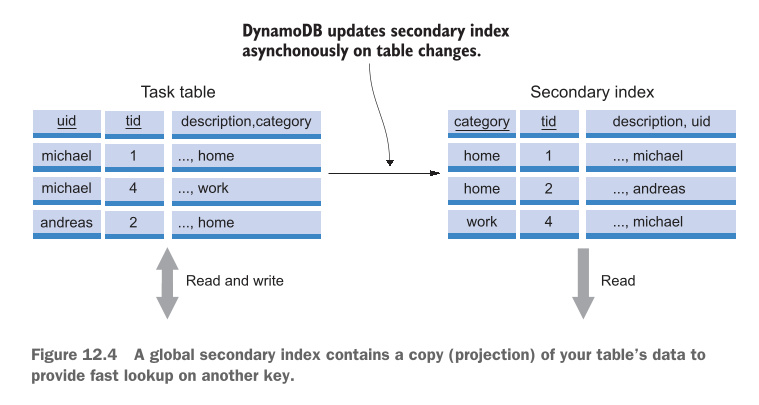
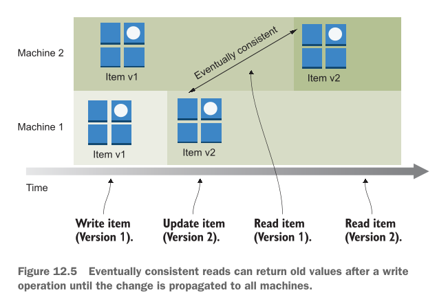

# Programming for the NoSQL database service: DynamoDB

Is chapter mein hum Amazon Web Services (AWS) ki sab se mashhoor NoSQL database service **DynamoDB** ke baare mein seekhenge. Pehle hum samajhte hain ke is chapter mein hum kya kya cover karne waale hain:

## This chapter covers

* **Advantages and disadvantages of the NoSQL service, DynamoDB:** DynamoDB istemal karne ke kya fayde hain aur kya nuksanat hain.
* **Creating tables and storing data:** DynamoDB mein tables kaise banaye jaate hain aur un mein data kaise store (save) kiya jata hai.
* **Adding secondary indexes to optimize data retrieval:** Data ko tezi se dhoondne (search karne) ke liye Secondary Indexes kaise add kiye jaate hain.
* **Designing a data model optimized for a key-value database:** Key-Value database ke mutabiq data ka structure (model) kaise design kiya jata hai.
* **Optimizing costs by choosing the best fitting capacity mode and storage type:** Apne kharcheon (costs) ko kam se kam rakhne ke liye sahi Capacity Mode (jaise On-Demand ya Provisioned) aur Storage Type chunna.

---

### Database Ko Scale Karne Ki Zarurat Kyun Parti Hai?

Is baat ko ek bilkul aasan misal se samajhte hain:

Socho aap ke paas ek **Warehouse (Bada Godown)** hai. Is godown mein daily kitna samaan aaya aur kitna gaya, yeh sab ek computer application record karti hai, aur wo application sara data ek **Database** mein save karti hai.

* Jab godown mein kam samaan hoga, toh kam log system istemal karenge aur database araam se kaam karega.
* Lekin jab business barhega aur hazaron items roz aayenge-jaayenge, toh database par load bohot zyada ho jayega.
* Is se database **slow (latency high)** ho jayega aur kam rukne lagega.

Is masley ko hal karne ke liye humein database ko **Scale (bada/kabootar ki tarah failana)** karna padta hai. Scale karne ke **2 tarike** hotay hain:

1. **Vertically (Ooper Ki Taraf Scale Karna):**
* **Simple Matlab:** Apne chalte hue ek hi computer/server mein zyada power daal dena. E.g., RAM barha dena, CPU zyaada tezz lagana, ya fast SSD storage laga dena.
* **Kharabi (Trade-off):** Yeh tarika shuru mein aasan lagta hai lekin bohot **mehanga** hota hai! Ek limit ke baad market mein itna shandar/bada computer milna hi band ho jata hai ke aap usay mazeed upgrade kar sakein.


2. **Horizontally (Sidhe Bazu Ki Taraf Scale Karna):**
* **Simple Matlab:** Ek computer par sara bojh daalne ke bajaye us ke sath 2, 3 ya hazaron aur chote chote computers (Nodes) jod dena. In sab computers ke group ko **Database Cluster** kehte hain.


---

### Traditional Relational Database Ko Horizontally Scale Karna Kyun Mushkil Hai?

Purane zamane ke Relational Databases (jaise MySQL, PostgreSQL) ko Horizontally scale karna bohot mushkil kaam hai. Is ki wajah hoti hai **ACID guarantees** (Atomicity, Consistency, Isolation, Durability)—yani data bilkul sahi aur accurate rahe, koi galti na ho.

ACID guarantees ko barkarar rakhne ke liye cluster ke sabhi computers (nodes) ko aapas mein ek doosre se har waqt poochhna aur baat karni parti hai. Is pooch-gach ko hum **Two-Phase Commit** kehte hain.

---

#### Figure 12.1 Detailed Breakdown (Two-Phase Commit Protocol)

Aap diye gaye **Figure 12.1** ko dekhein. Is mein dikhaya gaya hai ke jab 2 Nodes (computers) aapas mein data sync karte hain toh kitna communication overhead hota hai:

<div align="center">
  
</div>

* **Step 1:** Ek user ne Database Cluster ko data change karne ki request bheji (jaise data `INSERT`, `UPDATE`, ya `DELETE` karna). Yeh request ek main **Coordinator** computer ke paas jati hai.
* **Step 2 (Phase 1 - Prepare):** Coordinator dono computers (**Node 1** aur **Node 2**) ko ek "Commit Request" bhejta hai aur poochhta hai: *"Kya tum is data ko safe tarike se save kar sakte ho?"*
* **Step 3:** **Node 1** check karta hai aur Coordinator ko jawab (Acknowledge) bhejta hai ke *"Haan, main save kar sakta hoon."* Jab Node 1 haan keh de, toh wo apna waada tod nahi sakta.
* **Step 4:** **Node 2** bhi check karta hai aur Coordinator ko apna jawab bhejta hai ke *"Haan, main bhi tayar hoon."*
* **Step 5 (Phase 2 - Commit):** Coordinator dekhtah hai ke dono Nodes ne "HAAN" kaha hai, toh wo dono Nodes ko final order bhejta hai: *"Chalo ab finally data write (save) kar do!"*
* **Step 6:** **Node 1** aur **Node 2** dono exact ek hi time par data ko hard drive mein permanently save kar dete hain. Is step par koi galti ya failure allow nahi hota.

> **Sab Se Bada Masla (Trade-off):**
> Jaise jaise aap cluster mein mazeed computers (Nodes) add karenge (Node 3, Node 4, Node 10...), un sab ko aapas mein ek doosre se poochne aur confirm karne mein itna zyaada time lag jayega ke aap ka database tezz hone ke bajaye **bohot zyaada slow** ho jayega!

---

### NoSQL Aur DynamoDB Ka wajood

Is slow-down ke masley ko hal karne ke liye **NoSQL Databases** banaye gaye. NoSQL databases ACID guarantees ke sakht usoolon ko thoda naram (relax) kar dete hain taake hazaron computers ek sath mil kar tezi se kaam kar sakein.

#### NoSQL Database Ki 4 Badi Kismein (Types):

1. **Document Store** (E.g., MongoDB, AWS DocumentDB)
2. **Graph Store** (E.g., AWS Neptune)
3. **Columnar Store** (E.g., AWS Keyspaces)
4. **Key-Value Store** (E.g., AWS DynamoDB)

---

### AWS DynamoDB Kya Hai?

**Amazon DynamoDB** AWS ki taraf se di gayi ek NoSQL **Key-Value Store** service hai (jis mein Documents ka support bhi shamil hai).

* **Key-Value Store Ka Matlab:** Yeh bilkul ek Python Dictionary ya **Hash Table** ki tarah kaam karta hai. Har data object ki ek unique **Key** (ID) hoti hai, aur us Key ke zariye aap us ki poori **Value** (Data) haasil kar lete hain.
* **Fully Managed Service:** Is ka matlab yeh hai ke aap ko koi physical server, operating system, ya database software install ya maintain nahi karna padta. AWS piche sab kuch khud sambhalta hai.
* **High Availability & Durability:** Aap ka data automatic multiple data centers mein copy hota hai taake kabhi loss na ho.
* **Unlimited Scaling:** Aap is par 1 item store karein ya **arabon (billions)** items, 1 request per second bhejein ya **hazaron requests per second**, DynamoDB bina slow hue khud hi scale ho jata hai.

#### AWS Ke Doosre NoSQL Options:

* **Keyspaces:** Managed Apache Cassandra.
* **Neptune:** Graph databases ke liye.
* **DocumentDB:** MongoDB compatible database.
* **MemoryDB for Redis:** Super-fast in-memory database.

> **Mahaam Note:** Aap purani legacy applications (jaise MySQL par bani web apps) ko direct DynamoDB par nahi chala sakte. Is ke liye aap ko apni application ka code DynamoDB ke mutabiq naye tarike se likhna padta hai.

---

### DynamoDB Ke Real-World Use Cases (Kahan Istemal Hota Hai?)

1. **Massive & Spiky Workloads (Bohot Zyada Aur Achanak Aane Wala Traffic):**
* Jab aap aisi app bana rahe hoon jahan achanak millions of users aa jayein.
* *Writer ki real-world example:* Web applications par hone wale client-side errors ko real-time mein track karne ke liye unhone DynamoDB istemal kiya.


2. **Choti Applications Ya Simple Data Structures:**
* Jab aap Pay-Per-Request (On-Demand) pricing model chahte hain—jitna use karo bas utna bill do.
* *Writer ki real-world example:* Background mein chalne waale Batch Jobs ki progress tracking ke liye DynamoDB ka istemal kiya gaya.


---

### Hands-On Project: `nodetodo` Application

Is chapter mein hum ek simple Command-Line Tool banayege jiska naam **`nodetodo`** hai. Yeh Database duniya ka **"Hello World"** example hai.

#### Figure 12.2 Detailed Breakdown (nodetodo CLI App in Action)

Aap diye gaye **Figure 12.2** ki terminal screenshot ko dekhein. Is mein step-by-step commands chalai gayi hain:

<div align="center">
  
</div>

```bash
# Step 1: Naya User add karna
mwittig:chapter13 michael$ node index.js user-add michael michael@widdix.de +4971537507824
user added with uid michael

```

* **Explanation:** Command line se `user-add` run karke user `michael`, uska email `michael@widdix.de`, aur phone number add kiya gaya hai. System ne isay unique ID (`uid michael`) assign kar di.

```bash
# Step 2: Pehla Task (To-Do) add karna
mwittig:chapter13 michael$ node index.js task-add michael "book flight to AWS re:Invent"
task added with tid 1526650262330

```

* **Explanation:** `task-add` command chalakar `michael` user ke liye pehla kaam ("book flight to AWS re:Invent") add kiya gaya. System ne task ki ID (`tid: 1526650262330`) create ki.

```bash
# Step 3: Doosra Task add karna
mwittig:chapter13 michael$ node index.js task-add michael "revise chapter 10"
task added with tid 1526650265877

```

* **Explanation:** Ek aur task ("revise chapter 10") add kiya gaya. Iski alag Task ID (`tid: 1526650265877`) generate hui.

```bash
# Step 4: User ke sare Tasks ki list dekhna
mwittig:chapter13 michael$ node index.js task-ls michael
tasks [ { tid: '1526650262330',
    description: 'book flight to AWS re:Invent',
    created: '20180518',
    due: null,
    category: null,
    completed: null },
  { tid: '1526650265877',
    description: 'revise chapter 10',
    created: '20180518',
    due: null,
    category: null,
    completed: null } ]

```

* **Explanation:** `task-ls michael` chalane par DynamoDB se sara fetch kiya gaya data terminal par JSON array ki shakhal mein list ho jata hai.

```bash
# Step 5: Task ko Completed mark karna
mwittig:chapter13 michael$ node index.js task-done michael 1526650262330
task completed with tid 1526650262330

```

* **Explanation:** Specific Task ID (`1526650262330`) ko specify karke us task ka status complete mark kar diya gaya.

---

> ### Examples are 100% covered by the Free Tier
> 
> 
> Is chapter mein di gayi tamam practical exercise AWS ke **Free Tier** mein 100% free hain. Bas is baat ka dhyan rakhein ke aap ke AWS account mein koi aur heavy resources na chal rahe hoon. Chapter ke aakhir mein hum saare resources delete/clean up bhi karenge taake koi bill na aaye.

---

## Programming a to-do application

Aaiye ab dekhte hain ke DynamoDB ke sath kaam karne ke liye ek to-do application kaise program ki jati hai.

DynamoDB ek **Key-Value Store** hai jo aap ke data ko **Tables** (dabon ya registers) mein organize karta hai.

* **Example:** Aap ke paas ek table apne **Users** ka data store karne ke liye ho sakti hai aur doosri table un ke **Tasks** (kaam) ko store karne ke liye.
* **Item (Record):** Table ke andar mojood har record ko hum **Item** kehte hain. Isay aap aam relational database (jaise MySQL) ki ek **Row** (line) ki tarah samajh sakte hain. Har Item ki ek unique key hoti hai jisse uski pehchan hoti hai.

Kisi programming language ki ziyaada mushkilat se bachne ke liye, hum **Node.js/JavaScript** ka istemal karke ek choti si terminal app banayenge jiska naam **`nodetodo`** hai. Yeh app aap ke local machine ke terminal par chalti hai aur piche DynamoDB ko database ke tor par istemal karti hai.

Is `nodetodo` application ke andar yeh tamam features hain:

* Naye users banana aur purane users delete karna.
* Naye tasks banana aur unhein delete karna.
* Tasks ko "Done" (kam mukammal) mark karna.
* Alag alag filters ke sath sabhi tasks ki list nikalna.

Is app ka Command-Line Interface (CLI) bohot aasan aur samajhne mein easy banane ke liye **docopt** namak tool/language ka istemal kiya gaya hai. Below di gayi listing mein `nodetodo` ke supported commands aur unke parameters bataye gaye hain:

---

### Listing 12.1 CLI description language docopt: Using nodetodo (cli.txt)

```text
nodetodo

Usage:
  nodetodo user-add <uid> <email> <phone>
  nodetodo user-rm <uid>
  nodetodo user-ls [--limit=<limit>] [--next=<id>]
  nodetodo user <uid>
  nodetodo task-add <uid> <description> [<category>] [--dueat=<yyyymmdd>]
  nodetodo task-rm <uid> <tid>
  nodetodo task-ls <uid> [<category>] [--overdue|--due|--withoutdue|--futuredue]
  nodetodo task-la <category> [--overdue|--due|--withoutdue|--futuredue]
  nodetodo task-done <uid> <tid>
  nodetodo -h | --help
  nodetodo --version

Options:
  -h --help        Show this screen.
  --version        Show version.

```

#### Code aur Commands Ka Breakdown:

* **`nodetodo user-add <uid> <email> <phone>`:** Is command se naya user add hota hai. Is mein User ID (`uid`), Email, aur Phone number teeno dena compulsory hai.
* **`nodetodo user-rm <uid>`:** Kisi user ki `uid` de kar usay system se remove (delete) kiya jata hai.
* **`nodetodo user-ls [--limit=<limit>] [--next=<id>]`:** Sabhi users ki list dikhata hai. Square brackets `[...]` ka matlab hai ke `--limit` (kitne users dikhane hain) aur `--next` (aglay page par jane ke liye ID) optional parameters hain.
* **`nodetodo user <uid>`:** Specific user ki mukammal details dikhata hai.
* **`nodetodo task-add <uid> <description> [<category>] [--dueat=<yyyymmdd>]`:** User ke liye naya task add karta hai. User ID aur Task Description zaroori hain, jabke Category aur Due Date (`dueat`) optional hain.
* **`nodetodo task-rm <uid> <tid>`:** Specific User ID (`uid`) aur Task ID (`tid`) ke zariye task delete karta hai.
* **`nodetodo task-ls <uid> [<category>] [--overdue|--due|--withoutdue|--futuredue]`:** User ke tasks list karta hai. Pipe `|` ka matlab "Ya yeh, Ya woh" (either/or) hota hai, yani aap aik waqt par ek hi condition/filter laga sakte hain (jaise overdue tasks ya future due tasks).
* **`nodetodo task-la <category> [--overdue|--due|--withoutdue|--futuredue]`:** Kisi khaas category ke tamam tasks ko filters ke sath list karta hai.
* **`nodetodo task-done <uid> <tid>`:** Task ko complete mark kar deta hai.
* **`nodetodo -h | --help` aur `--version`:** Help menu aur app ka version dikhane ke liye options hain.

> **Mahaam Fark (DynamoDB vs SQL):** DynamoDB kisi traditional SQL database jaisa nahi hai jismein aap SQL queries (`SELECT * FROM...`) likhte hain. DynamoDB ke sath baat karne ke liye hum **AWS SDK** istemal karte hain jo AWS ke REST API par requests bhejta hai. Aap purani SQL app ko direct DynamoDB par nahi chala sakte; aap ko hamesha code likhna padta hai!

---

## Creating tables

DynamoDB mein har table ka ek unique naam hota hai aur us mein **Items** ka collection hota hai.

* **Attribute:** Item ke andar mojood alag alag data fields ko hum **Attribute** kehte hain. Yeh hamesha **Name-Value Pair** ki shakal mein hote hain (e.g., `Name: Emma`).
* **Attribute Values Ki Types:**
1. **Scalar (Single value):** Number, String, Binary, Boolean.
2. **Multivalued (Ek se zyada values):** Number Set, String Set, Binary Set.
3. **JSON Document:** Complex objects ya arrays.


Table ke alag alag items ke paas bilkul alag attributes ho sakte hain, kyun ke DynamoDB mein koi sakht (enforced) schema nahi hota.

---

### Figure 12.3 Detailed Breakdown

Figure 12.3 mein DynamoDB ke basic components ko visualize kiya gaya hai:

<div align="center">
  
</div>

* **Table Box:** Poori Table ko represent karta hai.
* **Horizontal Rows (Items):** Table mein mojood har horizontal line ek **Item** hai.
* **Columns (Primary Key & Attributes):**
* Sab se pehle column ko **Primary Key** mark kiya gaya hai, jo har item mein lazmi mojood hota hai.
* Baqi boxes **Attributes** ko zahir karte hain.


* **Items can have different attributes (Sab se zaroori point):** Figure mein wazeh dikhaya gaya hai ke pehle Item ke paas 3 extra attributes hain, doosre ke paas sirf 2 attributes hain, aur teesre ke paas alag attributes hain. Is ka matlab yeh hai ke DynamoDB mein fixed schema nahi hota—har item apne alag attributes rakh sakta hai.

> Bhalay DynamoDB mein fixed schema nahi hota, lekin table banate waqt aap ko yeh batana laazmi hota hai ke kaun sa attribute **Primary Key** ke taur par kaam karega.

---

## Users are identified by a partition key

User ka data save karne ke liye hum ne yeh simple JSON data structure choose kiya hai:

```json
{
  "uid": "emma",        // Unique user ID
  "email": "emma@widdix.de", // User ka email address
  "phone": "0123456789"    // User ka phone number
}

```

Is information ki bunyaad par DynamoDB table kaise banayein?

1. **Table Ka Naam:** Hamesha apni application ka naam prefix ke taur par lagana chahiye. Hum is table ka naam **`todo-user`** rakhte hain taake future mein kisi aur app ke table se name collision (naamon ka takraao) na ho.
2. **Primary Key Choosna:** Hum `uid` ko primary key chunte hain kyun ke har user ki `uid` unique hai.
3. **Partition Key Kya Hai?** Jab hum sirf ek hi attribute ko primary key ke taur par istemal karte hain, toh DynamoDB usay **Partition Key** kehta hai.

AWS CLI command `aws dynamodb create-table` chalate waqt **4 zaroori options** hote hain:

* **`table-name`:** Table ka naam (jo baad mein badla nahi ja sakta).
* **`attribute-definitions`:** Primary key mein istemal hone wale attributes ke naam aur unki types. Types yeh ho sakti hain: `S` (String), `N` (Number), ya `B` (Binary).
* **`key-schema`:** Primary key ke structure ki wazahat. `HASH` Partition Key ke liye hota hai aur `RANGE` Sort Key ke liye.
* **`provisioned-throughput`:** Table ki speed settings (`ReadCapacityUnits=5,WriteCapacityUnits=5`).

Execute karein yeh CLI command `todo-user` table banane ke liye:

```bash
aws dynamodb create-table --table-name todo-user \
  --attribute-definitions AttributeName=uid,AttributeType=S \
  --key-schema AttributeName=uid,KeyType=HASH \
  --provisioned-throughput ReadCapacityUnits=5,WriteCapacityUnits=5

```

Table banne mein kuch seconds ka time lagta hai. Jab tak status **ACTIVE** na ho jaye, hum table par kaam nahi kar sakte. Status check karne ki command neechay di gayi hai:

---

### Listing 12.2 Checking the status of the DynamoDB table

```bash
$ aws dynamodb describe-table --table-name todo-user

```

**Output JSON Breakdown:**

```json
{
  "Table": {
    "AttributeDefinitions": [
      {
        "AttributeName": "uid",
        "AttributeType": "S"
      }
    ],
    "TableName": "todo-user",
    "KeySchema": [
      {
        "AttributeName": "uid",
        "KeyType": "HASH"
      }
    ],
    "TableStatus": "ACTIVE",
    "CreationDateTime": "2022-01-24T16:00:29.105000+01:00",
    "ProvisionedThroughput": {
      "NumberOfDecreasesToday": 0,
      "ReadCapacityUnits": 5,
      "WriteCapacityUnits": 5
    },
    "TableSizeBytes": 0,
    "ItemCount": 0,
    "TableArn": "arn:aws:dynamodb:us-east-1:111111111111:table/todo-user",
    "TableId": "0697ea25-5901-421c-af29-8288a024392a"
  }
}

```

* **`AttributeDefinitions`:** Yeh batata hai ke table ki key ke taur par `uid` ek String (`S`) set hai.
* **`TableName`:** Table ka naam `todo-user` hai.
* **`KeySchema`:** Key type `HASH` hai, matlab `uid` humari Partition Key hai.
* **`TableStatus`:** Status `"ACTIVE"` dikha raha hai, matlab table ab istemal ke liye 100% tayar hai.
* **`CreationDateTime`:** Table kis date aur time par bani thi.
* **`ProvisionedThroughput`:** Read aur Write capacity units dono 5, 5 set hain.
* **`TableSizeBytes` & `ItemCount`:** Abhi table khali hai is liye bytes aur items ki tadaad 0 hai.
* **`TableArn` & `TableId`:** AWS ka Unique Resource Name aur Internal Identifier ID.

---

## Tasks are identified by a partition key and sort key

Users ki table banane ke baad, ab humein **Tasks** ko store karne ke liye ek table chahiye. Aise Task ka data structure yeh hai:

```json
{
  "uid": "emma",               // Kis user ka task hai
  "tid": 1645609847712,        // Task ID (Time in milliseconds)
  "description": "prepare lunch" // Task kya hai
}

```

### Partition Key + Sort Key (Composite Primary Key) Kyun Chuni?

Agar hum sirf `tid` (Task ID) ko primary key banate toh masla yeh hota ke hum `task-ls` (user ke saare tasks list karne waali command) tezi se nahi chala sakte the.

Is liye hum ne **`uid` aur `tid` ke combination** ko primary key banaya:

* **Partition Key (`HASH`):** `uid` (User ID).
* **Sort Key (`RANGE`):** `tid` (Task ID).

> **Niyam (Rule):** Partition key akele unique hona zaroori nahi, aur Sort key bhi akele unique hona zaroori nahi. Lekin **Partition Key + Sort Key ka jod (combination) 100% unique hona chahiye!**

> **Ahem Limitation (Pabandi):** Is design ki waja se ek user ek hi millisecond ke andar 2 tasks create nahi kar sakta, kyun ke `uid` + `tid` duplicate ho jayenge. Lekin chunke time milliseconds mein hai, toh aam use mein aisa masla nahi aata.

### Unordered Hash Index Aur Sorted Index Kaise Kaam Karte Hain?

DynamoDB internals ko bilkul aasan misal se samjhein:

1. **Partition Key (`uid`)** ka koi khas order nahi hota (Unordered Hash Index). Data alag alag partitions par bikhra hota hai.
2. **Sort Key (`tid`)** har Partition Key ke andar tartiib se (Sorted Order mein) arranged hoti hai.

Is ko is data set example se samjhein:

```text
["john", 1] => { "uid": "john", "tid": 1, "description": "prepare customer presentation" }
["john", 2] => { "uid": "john", "tid": 2, "description": "plan holidays" }
["emma", 1] => { "uid": "emma", "tid": 1, "description": "prepare lunch" }
["emma", 2] => { "uid": "emma", "tid": 2, "description": "buy nice flowers for mum" }
["emma", 3] => { "uid": "emma", "tid": 3, "description": "prepare talk for conference" }

```

* `"john"` ke bucket/partition mein Task 1 aur 2 ek line se sorted hain.
* `"emma"` ke bucket/partition mein Task 1, 2, aur 3 sorted hain.
* `"john"` aur `"emma"` ke partitions ka aapas mein koi tartiib (order) nahi hai.

### Table Create Karne Ki CLI Command:

Execute karein yeh command `todo-task` table banane ke liye:

```bash
aws dynamodb create-table --table-name todo-task \
  --attribute-definitions AttributeName=uid,AttributeType=S AttributeName=tid,AttributeType=N \
  --key-schema AttributeName=uid,KeyType=HASH AttributeName=tid,KeyType=RANGE \
  --provisioned-throughput ReadCapacityUnits=5,WriteCapacityUnits=5

```

#### Command Ka Breakdown:

* **`--table-name todo-task`:** Table ka naam `todo-task` set kiya.
* **`--attribute-definitions`:** Do attributes define kiye: `uid` (Type `S` = String) aur `tid` (Type `N` = Number).
* **`--key-schema`:** `uid` ko `HASH` (Partition Key) banaya aur `tid` ko `RANGE` (Sort Key) banaya.
* **`--provisioned-throughput`:** Performance limits 5 Read / 5 Write capacity units set ki.

Aap `aws dynamodb describe-table --table-name todo-task` chala kar tab tak wait karein jab tak is ka status **ACTIVE** na ho jaye. Ab humari dono tables (`todo-user` aur `todo-task`) tayar hain!

---

## Adding data

Aap ne users aur un ke tasks ko store karne ke liye do tables (`todo-user` aur `todo-task`) banaye hain. Ab in tables ko istemal karne ke liye in mein data add (write) karna lazmi hai.

DynamoDB ke sath baat karne aur data bhejne ke liye hum **Node.js SDK** ka istemal karenge. User aur task add karne ka code likhne se pehle, aaiye Node.js ko set up karte hain aur boilerplate (bunyaadi) code ko samajhte hain.

---

### Installing and getting started with Node.js

**Node.js kya hai?**
Ek aasan misal se samajhte hain: Normally, JavaScript sirf web browser (jaise Chrome) ke andar chalti hai. Lekin Node.js ek aisa platform hai jo JavaScript ko aap ke computer/server ke main system par chalne ki ijazat deta hai. Yeh event-driven model par kaam karta hai, jis ka matlab hai ke jab koi event (jaise request) aata hai, yeh us par turant action leta hai.

* **Installation:** Node.js ko install karne ke liye official website [https://nodejs.org](https://nodejs.org) par jaakar apne Operating System (Windows, Mac, ya Linux) ke mutabiq installer download karein.
* **Verification:** Install hone ke baad terminal (Command Prompt) khol kar yeh command likhein:

```bash
node --version

```

Aap ke terminal par output kuch is tarah dikhai dega: `v14.*` (ya 2026 mein modern Node.js versions jaise `v20.*` / `v22.*`). Is ka matlab hai ke Node.js sahi tarike se install ho chuka hai aur aap `nodetodo` app chalane ke liye tayar hain.

> **Ziyada Seekhne Ke Liye Resources:** Agar aap Node.js ko tafseel se seekhna chahte hain, toh Manning ki book *Node.js in Action (Second Edition)* by Alex Young ya unka video course *Node.js in Motion* by PJ Evans zaroor dekhein.

---

### Where is the code located?

Book ka tamam source code GitHub repository par mojood hai:
`[https://github.com/AWSinAction/code3](https://github.com/AWSinAction/code3)`

Aap apne terminal mein `/chapter12/` directory mein jayein aur yeh command chalayein:

```bash
npm install

```

**`npm install` kya karta hai?**
Yeh command `package.json` file ko parhti hai aur `nodetodo` app ke liye zaroori tamam external libraries/tools (jaise AWS SDK, docopt, moment) ko internet se download karke `node_modules` folder mein save kar deti hai.

---

### Listing 12.3 nodetodo: Using docopt in Node.js (index.js)

Docopt ka kaam user ke terminal par diye gaye input arguments ko parhna hai aur unhein ek JavaScript object mein convert karna hai.

```javascript
const fs = require('fs'); // Filesystem tak rasai ke liye fs module load karta hai
const docopt = require('docopt'); // Input arguments ko parhne ke liye docopt module load karta hai
const moment = require('moment'); // JavaScript mein temporal types ko asan banane ke liye moment module load karta hai
const AWS = require('aws-sdk'); // AWS SDK module load karta hai
const db = new AWS.DynamoDB({
  region: 'us-east-1'
});

const cli = fs.readFileSync('./cli.txt',
  {encoding: 'utf8'}); // File cli.txt se CLI description parhta hai
const input = docopt.docopt(cli, {
  version: '1.0',
  argv: process.argv.splice(2)
}); // Arguments ko parse karta hai, aur unhein aik input variable mein save karta hai

```

#### Code Breakdown:

* **`const fs = require('fs');`**
* `fs` (File System) Node.js ka built-in tool hai jo local drive se files ko read ya write karne ke kaam aata hai.


* **`const docopt = require('docopt');`**
* Terminal command parameters ko parsing (breakdown) karne waali library ko import kar raha hai.


* **`const moment = require('moment');`**
* Date aur Time ki formatting aur calculations ko aasan banane ke liye `moment` library ko load karta hai.


* **`const AWS = require('aws-sdk');`**
* AWS ki tamam services (jaise DynamoDB) ke sath connect hone ke liye official AWS SDK library ko load karta hai. *(Note: Yeh AWS SDK v2 Syntax hai; 2026 mein modern projects mein hum AWS SDK v3 `@aws-sdk/client-dynamodb` istemal karte hain, lekin kaam karne ka bunyaadi logic bilkul same rehta hai).*


* **`const db = new AWS.DynamoDB({ region: 'us-east-1' });`**
* DynamoDB ka client instance create kar raha hai aur batara ha hai ke hamari tables AWS ke `us-east-1` (N. Virginia) region mein hain.


* **`const cli = fs.readFileSync('./cli.txt', {encoding: 'utf8'});`**
* Pehle se bani hui `cli.txt` file (jismein tamam CLI rules aur options likhe hain) ko utf8 text format mein read karke `cli` variable mein store karta hai.


* **`const input = docopt.docopt(cli, { version: '1.0', argv: process.argv.splice(2) });`**
* Terminal par user ne jo bhi likha (maslan `user-add john john@widdix.de +11111111`), usay read karke breakdown karta hai aur `input` variable ke andar ek organized JavaScript object mein save kar deta hai.


---

### Listing 12.4 DynamoDB: Creating an item

Aaiye dekhte hain ke DynamoDB mein low-level API istemal karte hue item kaise add kiya jata hai (`putItem` method).

```javascript
const params = {
  Item: { // Tamam item attribute name-value pairs hain
    attr1: {S: 'val1'}, // Strings ko S se zahir kiya jata hai
    attr2: {N: '2'} // Numbers (floats aur integers) ko N se zahir kiya jata hai
  },
  TableName: 'app-entity' // app-entity table mein item add karta hai
};
db.putItem(params, (err) => { // DynamoDB par putItem operation invoke karta hai
  if (err) { // Errors ko handle karta hai
    console.error('error', err);
  } else {
    console.log('success');
  }
});

```

#### Code Breakdown:

* **`const params = { ... };`**
* AWS API ko bhejne waale settings aur data ka ek main JSON object.


* **`Item: { attr1: {S: 'val1'}, attr2: {N: '2'} }`**
* DynamoDB Low-Level API mein aap ko har value ke sath uski Data Type explicit tarike se batani parti hai:
* `{S: 'val1'}` ka matlab hai ke `attr1` ek **String (`S`)** hai aur uski value `'val1'` hai.
* `{N: '2'}` ka matlab hai ke `attr2` ek **Number (`N`)** hai aur uski value `2` hai (dhyan rahe ke number ko bhi quotes `'2'` mein pass kiya jata hai).


* **`TableName: 'app-entity'`**
* Yeh batata hai ke data kis table mein ja kar save hona chahiye.


* **`db.putItem(params, (err) => { ... });`**
* AWS ko network par request bhejta hai ke item store karo. Jab DynamoDB jawab deta hai, toh yeh callback function chalta hai:
* **`if (err)`**: Agar internet ka masla ho ya key ka issue aaye toh terminal par error print karega.
* **`else`**: Agar data kamyabi se save ho jaye toh terminal par `"success"` print hoga.


---

## Adding a user

Pehla qadam `todo-user` table mein user data add karna hai. Jab user terminal par `user-add` command chalata hai, toh neechay diya gaya code execute hota hai.

### Listing 12.5 nodetodo: Adding a user (index.js)

```javascript
if (input['user-add'] === true) {
  const params = {
    Item: { // Item mein tamam attributes shamil hote hain. Keys bhi attributes hoti hain, aur is wajah se jab aap data add karte hain toh aap ko DynamoDB ko yeh batane ki zaroorat nahi hoti ke konsa attribute key hai
      uid: {S: input['<uid>']}, // uid attribute string type ka hai aur is mein uid parameter value hoti hai
      email: {S: input['<email>']}, // email attribute string type ka hai aur is mein email parameter value hoti hai
      phone: {S: input['<phone>']} // phone attribute string type ka hai aur is mein phone parameter value hoti hai
    },
    TableName: 'todo-user', // User table ko specify karta hai
    ConditionExpression: 'attribute_not_exists(uid)' // Agar aik hi key par putItem do dafa call kiya jaye, toh data replace ho jata hai. ConditionExpression putItem ki tabhi ijazat deti hai jab key pehle se mojood na ho
  };
  db.putItem(params, (err) => { // DynamoDB par putItem operation ko invoke karta hai
    if (err) { // Errors ko handle karta hai
      console.error('error', err);
    } else {
      console.log('user added');
    }
  });
}

```

#### Code Breakdown:

* **`if (input['user-add'] === true)`**
* Yeh check karta hai ke kya user ne terminal par `user-add` command run ki hai? Agar haan, toh andar ka code chalega.


* **`Item: { uid: {S: ...}, email: {S: ...}, phone: {S: ...} }`**
* DynamoDB ko teeno attributes pass kar raha hai. Teeno ki data type String (`S`) hai.
* *Important Concept:* Key (`uid`) bhi baki attributes ki tarah hi likhi jati hai. DynamoDB khud pehchan leta hai ke yeh key hai kyun ke hum ne table banate waqt `uid` ko key set kiya tha.


* **`TableName: 'todo-user'`**
* Target table `todo-user` hai.


* **`ConditionExpression: 'attribute_not_exists(uid)'` (Mahaam Concept & Design Decision)**
* **Bacho Ki Tarah Samjhein:** Normally, DynamoDB mein agar aap ek hi User ID (`uid`) se dobara data bhejein, toh purana data bager kisi warning ke **delete (overwrite)** ho jata hai!
* Is khatre se bachne ke liye hum ne `ConditionExpression` lagaya hai. Yeh DynamoDB ko bolta hai: *"Pehle check karo! Agar yeh `uid` pehle se table mein exist karti hai, toh error de do aur naya data overwrite mat hone do!"*


* **`db.putItem(params, ...)`**
* Success par terminal par `"user added"` display hota hai.


#### Execution Commands (Users Add Karein):

Ab apne terminal par yeh do commands chala kar do users create karein:

```bash
node index.js user-add john john@widdix.de +11111111
node index.js user-add emma emma@widdix.de +22222222

```

---

## Adding a task

Users add karne ke baad, John aur Emma apne daily kaam organize karne ke liye tasks add karenge. Task add karne ka logic user add karne se milta julta hai, lekin is mein optional parameters aur composite keys handling shamil hain.

### Listing 12.6 nodetodo: Adding a task (index.js)

```javascript
if (input['task-add'] === true) {
  const tid = Date.now(); // Current timestamp ki buniyad par task ID (tid) create karta hai
  const params = {
    Item: {
      uid: {S: input['<uid>']},
      tid: {N: tid.toString()}, // tid attribute number type ka hai aur is mein tid ki value hoti hai
      description: {S: input['<description>']},
      created: {N: moment(tid).format('YYYYMMDD')} // Create kiya gaya attribute number type ka hota hai (format 20150525)
    },
    TableName: 'todo-task', // Task table ko specify karta hai
    ConditionExpression: 'attribute_not_exists(uid) ' +
      'and attribute_not_exists(tid)' // Yeh yakeeni banata hai ke koi mojooda item override na ho
  };
  if (input['--dueat'] !== null) { // Agar optional named parameter dueat set ho, toh yeh value item mein add kar deta hai
    params.Item.due = {N: input['--dueat']};
  }
  if (input['<category>'] !== null) { // Agar optional named parameter category set ho, toh yeh value item mein add kar deta hai
    params.Item.category = {S: input['<category>']};
  }
  db.putItem(params, (err) => { // DynamoDB par putItem operation ko invoke karta hai
    if (err) {
      console.error('error', err);
    } else {
      console.log('task added with tid ' + tid);
    }
  });
}

```

#### Code Breakdown:

* **`if (input['task-add'] === true)`**
* Check karta hai ke kya command `task-add` chali hai.


* **`const tid = Date.now();`**
* `Date.now()` Unix Timestamp generate karta hai (yani 1 Jan 1970 se lekar abhi tak ke total milliseconds). Is milli-second counter ko hum unique **Task ID (`tid`)** ke tor par istemal karte hain.


* **`Item: { ... }` Structure:**
* **`uid`**: User ID (`S` String).
* **`tid`**: Task ID (`N` Number format mein convert karke `tid.toString()`).
* **`description`**: Task ki tafseel (`S` String).
* **`created`**: Task banne ki tarikh (`N` Number format YYYYMMDD, e.g., 20260801).


* **`TableName: 'todo-task'`**
* Target table `todo-task` set karta hai.


* **`ConditionExpression: 'attribute_not_exists(uid) and attribute_not_exists(tid)'`**
* Kyun ke `todo-task` table ki Primary Key **Partition Key (`uid`) + Sort Key (`tid`)** donon se mil kar bani hai, is liye hum ne dono keys par condition lagai hai ke yeh jod (pair) pehle se table mein mojood nahi hona chahiye.


* **Optional Parameters Handling (Dynamic Attributes):**
* **`if (input['--dueat'] !== null)`**: Agar user ne CLI par task ki due date batayi hai (jaise `--dueat "20260224"`), toh code dynamically item ke andar `due` attribute add kar deta hai.
* **`if (input['<category>'] !== null)`**: Agar user ne category di hai (jaise `"shopping"`), toh `category` attribute bhi JSON Object mein add ho jata hai.
* *DynamoDB Schema-less Power:* Agar yeh attributes input mein nahi diye gaye, toh DynamoDB item mein yeh fields create hi nahi hotay!


#### Execution Commands (Tasks Add Karein):

Ab terminal par yeh commands chala kar Emma aur John ke tasks add karein:

1. **Emma ka Task (Bina Due Date Ke):**

```bash
node index.js task-add emma "buy milk" "shopping"

```

*Is command se Emma ke liye "shopping" category mein "buy milk" ka task add hoga.*

2. **Emma ka Task (Due Date Ke Sath):**

```bash
node index.js task-add emma "put out the garbage" "housekeeping" --dueat "20220224"

```

*Is command se "housekeeping" category wala task `--dueat` parameter ke sath add ho jayega.*


---

## Retrieving data

Aap ne pehle yeh seekha ke DynamoDB ki alag alag tables mein Users aur Tasks ka data kaise insert (save) kiya jata hai. Ab hum seekhenge ke us data ko wapas kaise nikala (query/read) jata hai—maslan, Emma ke tamam tasks ki list dekhna.

DynamoDB ek **Key-Value Store** hai. Is tarah ke database se data nikalne ka sab se aam aur main tarika us item ki **Key** istemal karna hai. Is limitation ko samajhna tabhi zaroori hota hai jab aap table design kar rahe hote hain. Agar aap sirf primary key se data dhoond sakte hain, toh aage chal kar aap ko maslay aa sakte hain.

Khush-qismati se, DynamoDB humein data dhoondne ke **2 mazeed tarike** bhi deta hai:

1. **Secondary Index Lookup** (Doosri key ke zariye search karna)
2. **Scan Operation** (Poori table ko ek ek karke dekhna)

Hum shuruat Primary Key ke zariye data retrieve karne se karenge aur phir aage advanced tarikon ko seekhenge.

---

### DynamoDB Streams

**DynamoDB Streams kya hai? (Bacho ki tarah samjhein):**
Socho aap ki class mein ek monitor baitha hai. Jab bhi koi bacha blackboard par koi naya labz likhta hai, mitaata hai, ya badalta hai, monitor fauran apni notebook mein record kar leta hai ke *"Aap ne yeh change kiya hai!"*

DynamoDB Streams bilkul wahi kaam karta hai:

* Jab bhi table mein koi naya data aata hai (`create`), update hota hai, ya delete hota hai, DynamoDB Stream us ki ek khabar (event) record kar leta hai.
* Yeh tamam changes usi tartiib (order) mein deta hai jis tartiib mein wo Partition Key par aaye the.

#### DynamoDB Streams Ke 2 Barray Faide:

1. **Polling Se Nijat:** Agar aap ki app baar baar database se poochti rehti thi ke *"Kya naya data aaya? Kya naya data aaya?"* (jise Polling kehte hain), toh DynamoDB Streams is masley ko bohot khubsurati se hal karta hai. Data badalte hi app ko automatic pata chal jata hai.
2. **Cache Ko Update Karna:** Agar aap ne fast speed ke liye koi Cache (jaise Redis) lagaya hua hai, toh table mein data change hote hi DynamoDB Streams ke zariye Cache ko fauran updated rakha ja sakta hai.

---

## Getting an item by key

Aaiye ek bilkul simple misal se shuru karte hain. Aap Emma ki contact details dekhna chahte hain jo `todo-user` table mein store hain.

Data retrieve karne ka sab se simple tarika yeh hai ke aap us item ki **Primary Key** (User ID) batayein aur DynamoDB se us single item ki tafseel maang lein. SDK ka **`getItem`** operation is kaam ke liye istemal hota hai.

---

### Listing 12.7 DynamoDB: Query a single item (index.js)

```javascript
const params = {
  Key: { // Primary key ke attributes ko specify karta hai
    attr1: {S: 'val1'}
  },
  TableName: 'app-entity'
};
db.getItem(params, (err, data) => { // DynamoDB par getItem operation ko invoke karta hai
  if (err) {
    console.error('error', err);
  } else {
    if (data.Item) { // Check karta hai ke item mila ya nahi
      console.log('item', data.Item);
    } else {
      console.error('no item found');
    }
  }
});

```

#### Code Breakdown:

* **`const params = { ... };`**
* `getItem` request ke parameters setup karta hai.


* **`Key: { attr1: {S: 'val1'} }`**
* Target item ki Primary Key batata hai. `attr1` attribute ki value `'val1'` hai aur type String (`S`) hai.


* **`TableName: 'app-entity'`**
* Us table ka naam jisse data retrieve karna hai.


* **`db.getItem(params, (err, data) => { ... });`**
* DynamoDB ko `getItem` request bhejta hai.


* **`if (err)`**
* Agar network issue ya koi error aaye toh error print karega.


* **`if (data.Item)`**
* Agar key table mein mil gayi, toh DynamoDB `data.Item` mein wo record wapas bhejta hai.


* **`else { console.error('no item found'); }`**
* Agar us primary key se koi record match nahi hua, toh `data.Item` empty (`undefined`) hota hai aur code "no item found" print karta hai.


---

### Listing 12.8 nodetodo: Retrieving a user (index.js)

`user <uid>` command user ki ID ke zariye uski mukammal details fetch karti hai.

```javascript
const mapUserItem = (item) => { // DynamoDB result ko transform karne ke liye helper function
  return {
    uid: item.uid.S,
    email: item.email.S,
    phone: item.phone.S
  };
};

if (input['user'] === true) {
  const params = {
    Key: {
      uid: {S: input['<uid>']} // Primary key ke zariye user ko talaash karta hai
    },
    TableName: 'todo-user' // User table ko specify karta hai
  };
  db.getItem(params, (err, data) => { // DynamoDB par getItem operation ko invoke karta hai
    if (err) {
      console.error('error', err);
    } else {
      if (data.Item) { // Check karta hai ke primary key ke liye data mila ya nahi
        console.log('user', mapUserItem(data.Item));
      } else {
        console.error('user not found');
      }
    }
  });
}

```

#### Code Breakdown:

* **`const mapUserItem = (item) => { ... }`**
* Yeh ek chota helper function hai. DynamoDB ka raw output complex hota hai (jaise `{ uid: { S: 'emma' } }`). Yeh function us complex structure ko clean JavaScript Object (`{ uid: 'emma', email: '...', phone: '...' }`) mein convert kar deta hai.


* **`if (input['user'] === true)`**
* Check karta hai ke kya user ne CLI par `user <uid>` command chalai hai.


* **`Key: { uid: {S: input['<uid>']} }`**
* Command line par di gayi User ID (`<uid>`) ko Partition Key ke tor par pass karta hai.


* **`TableName: 'todo-user'`**
* Target table set karta hai.


* **`db.getItem(...)`**
* DynamoDB se query karta hai. Agar Emma mil jaye toh `mapUserItem` function us ka data clean format mein print kar deta hai.


#### Execution Command Example:

Emma ki details nikalne ke liye terminal par yeh command chalayein:

```bash
node index.js user emma

```

> **Mahaam Note:** Agar aap kisi aisi table se single item fetch karna chahte hain jis mein Composite Primary Key (**Partition Key + Sort Key**) ho, toh `getItem` mein aap ko dono keys deni padengi. `getItem` hamesha **sirf ek item (1 item ya 0 item)** wapas karta hai. Agar aap ek se zyada items (collection) nikalna chahte hain, toh aap ko `query` operation istemal karna padega!

---

## Querying items by key and filter

Emma apne to-do tasks dekhna chahti hai. Is ke liye hum `todo-task` table ko query karenge taake Emma ko assign kiye gaye **tamam tasks** mil sakein.

Agar aap single item ke bajaye items ka ek poora group/collection nikalna chahte hain, toh aap ko **`query`** operation chalana padta hai. Multi-item retrieval tabhi possible hota hai jab aap ki table mein **Partition Key aur Sort Key dono** hon.

---

### Listing 12.9 DynamoDB: Querying a table

```javascript
const params = {
  KeyConditionExpression: 'attr1 = :attr1val AND attr2 = :attr2val',
  ExpressionAttributeValues: {
    ':attr1val': {S: 'val1'},
    ':attr2val': {N: '2'}
  },
  TableName: 'app-entity'
};
db.query(params, (err, data) => { // DynamoDB par query operation ko invoke karta hai
  if (err) {
    console.error('error', err);
  } else {
    console.log('items', data.Items);
  }
});

```

#### Code Breakdown:

* **`KeyConditionExpression: 'attr1 = :attr1val AND attr2 = :attr2val'`**
* Yeh wo shart (condition) hai jiske mutabiq keys ko dhoonda jaye.
* **Partition Key Rule:** Partition Key ke liye **sirf `=` (Equal)** operator use ho sakta hai.
* **Sort Key Rule:** Sort Key ke liye aap `=`, `>`, `<`, `>=`, `<=`, `BETWEEN x AND y`, aur `begins_with` operators use kar sakte hain. Sort Key ke queries fast hotay hain kyun ke data pehle se sorted hota hai.


* **`ExpressionAttributeValues`**
* Expression ke andar placeholders (jaise `:attr1val`) ko actual values aur data types se replace karta hai (`:attr1val` = String `'val1'`, `:attr2val` = Number `2`).


* **`db.query(...)`**
* Operation run hone par `data.Items` (array of items) wapas milta hai.


---

### Listing 12.10 nodetodo: Retrieving tasks (index.js)

Tasks nikalne se pehle do chote helper functions samjhein:

```javascript
const getValue = (attribute, type) => { // Optional attributes ko access karne ke liye helper function
  if (attribute === undefined) {
    return null;
  }
  return attribute[type];
};

const mapTaskItem = (item) => { // DynamoDB result ko transform karne ke liye helper function
  return {
    tid: item.tid.N,
    description: item.description.S,
    created: item.created.N,
    due: getValue(item.due, 'N'),
    category: getValue(item.category, 'S'),
    completed: getValue(item.completed, 'N')
  };
};

```

#### Code Breakdown:

* **`getValue(attribute, type)`:** DynamoDB mein optional attributes (jaise `due` date ya `category`) har task mein hona zaroori nahi hain. Agar attribute missing ho (`undefined`), toh yeh function application ko crash hone se bachata hai aur `null` return karta hai.
* **`mapTaskItem(item)`:** Task item ke JSON structure ko simplified JavaScript Object mein convert karta hai.

---

### Listing 12.11 nodetodo: Retrieving tasks (index.js)

Is listing mein `task-ls` command ka poora logic implement kiya gaya hai:

```javascript
if (input['task-ls'] === true) {
  const yyyymmdd = moment().format('YYYYMMDD');
  const params = {
    KeyConditionExpression: 'uid = :uid', // Primary key query. Task table partition key aur sort key ka istemal karti hai. Query mein sirf partition key define ki gayi hai, is liye user se talluq rakhne wale tamam tasks wapas mil jate hain
    ExpressionAttributeValues: {
      ':uid': {S: input['<uid>']} // Query attributes ko is tareeqay se pass kiya jana chahiye
    },
    TableName: 'todo-task',
    Limit: input['--limit']
  };
  if (input['--next'] !== null) {
    params.KeyConditionExpression += ' AND tid > :next';
    params.ExpressionAttributeValues[':next'] = {N: input['--next']};
  }
  if (input['--overdue'] === true) { // Filter attributes ko is tareeqay se pass kiya jana chahiye
    params.FilterExpression = 'due < :yyyymmdd'; // Filtering kisi index ka istemal nahi karti; yeh primary key query se wapas milne wale tamam elements par apply hoti hai
    params.ExpressionAttributeValues[':yyyymmdd'] = {N: yyyymmdd};
  } else if (input['--due'] === true) {
    params.FilterExpression = 'due = :yyyymmdd';
    params.ExpressionAttributeValues[':yyyymmdd'] = {N: yyyymmdd};
  } else if (input['--withoutdue'] === true) {
    params.FilterExpression =
      'attribute_not_exists(due)'; // attribute_not_exists(due) us waqt true hota hai jab attribute mojood na ho (attribute_exists ke bar aks)
  } else if (input['--futuredue'] === true) {
    params.FilterExpression = 'due > :yyyymmdd';
    params.ExpressionAttributeValues[':yyyymmdd'] = {N: yyyymmdd};
  } else if (input['--dueafter'] !== null) {
    params.FilterExpression = 'due > :yyyymmdd';
    params.ExpressionAttributeValues[':yyyymmdd'] =
      {N: input['--dueafter']};
  } else if (input['--duebefore'] !== null) {
    params.FilterExpression = 'due < :yyyymmdd';
    params.ExpressionAttributeValues[':yyyymmdd'] =
      {N: input['--duebefore']};
  }
  if (input['<category>'] !== null) {
    if (params.FilterExpression === undefined) {
      params.FilterExpression = '';
    } else {
      params.FilterExpression += ' AND '; // Multiple filters ko logical operators ke sath combine kiya ja sakta hai
    }
    params.FilterExpression += 'category = :category';
    params.ExpressionAttributeValues[':category'] =
      {S: input['<category>']};
  }
  db.query(params, (err, data) => { // DynamoDB par query operation ko invoke karta hai
    if (err) {
      console.error('error', err);
    } else {
      console.log('tasks', data.Items.map(mapTaskItem));
      if (data.LastEvaluatedKey !== undefined) {
        console.log('more tasks available with --next=' +
          data.LastEvaluatedKey.tid.N);
      }
    }
  });
}

```

#### Code Breakdown:

* **`KeyConditionExpression: 'uid = :uid'`**
* Chunke hum ne Sort Key (`tid`) par koi condition nahi lagai, is liye DynamoDB us specific User ID (`uid`) ke saare tasks fetch kar ke le aayega.


* **Paging (`Limit` aur `ExclusiveStartKey / --next`):**
* `params.Limit`: Ek waqt par kitne tasks laane hain.
* `params.KeyConditionExpression += ' AND tid > :next'`: Paging ke liye aglay task par jane ki ID set karta hai.


* **`FilterExpression` Logic (Bache Ki Tarah Samjhein):**
* **Mahaam Concept:** `FilterExpression` kisi Index ka istemal **nahi** karta. Pehle DynamoDB Primary Key ki madad se tamam tasks memory mein lata hai, aur us ke baad un sab par Filters apply karta hai!
* `--overdue`: Due date aaj ki date se purani ho (`due < :yyyymmdd`).
* `--due`: Due date aaj hi ki date ho (`due = :yyyymmdd`).
* `--withoutdue`: Task mein due date attribute set hi na ho (`attribute_not_exists(due)`).
* `--futuredue`: Due date aane wale dino ki ho (`due > :yyyymmdd`).


* **Category Combine Filter:**
* Agar user ne category bhi select ki hai, toh code `AND category = :category` jod deta hai.


* **`LastEvaluatedKey`:**
* Agar tasks zyada hain, toh DynamoDB `data.LastEvaluatedKey` bhejta hai taake terminal par user ko agla page dekhne ki info di ja sake (`--next=...`).


#### Command Example:

Emma ke shopping wale tasks list karne ke liye:

```bash
node index.js task-ls emma shopping

```

---

### Primary Key Querying Aur Filtering Ke 2 Barray Maslay (Trade-offs):

1. **Filtering Slow Aur Expensive Hai:**
* Filter lagane se pehle DynamoDB tamam primary key matching elements read karta hai.
* *Stock Prices Example:* Farz karein DynamoDB mein Apple stock (`AAPL`) ke 5 saal ka data hai. Aap 2010 se 2015 ke sare prices query karte hain lekin filter lagate hain *"Only Mondays"*. DynamoDB pehle 100% data read karega aur phir us mein se 80% reject karke sirf 20% (Mondays) wapas karega. Is se aap ki read capacity (paisa) aur time zaya hota hai!


2. **Aap Sirf Primary Key Par Query Kar Sakte Hain:**
* Aap poori app se yeh nahi pooch sakte ke *"Tamam users ke shopping tasks dikhao"*, kyun ke `category` primary key nahi hai.


Is masley ka hal **Secondary Indexes** hain!

---

## Using global secondary indexes for more flexible queries

**Global Secondary Index (GSI) Kya Hai? (Bacho ki tarah samjhein):**
Socho aap ke paas ek kitaab hai jis ke aakhir mein ek Index page hota hai. Kitaab ke aam pages User ID ke hisab se lage hain. Lekin Index page par Category ke hisab se sabhi topics listed hain.

GSI bilkul wahi kaam karta hai! Yeh aap ki asal table ka ek **chota/shadow copy (Projection)** hota hai jisko DynamoDB khud background mein sambhalta hai.

* **Non-Unique Keys:** GSI mein Primary key ki tarah unique hona lazmi nahi hai. Jaise ek `country` attribute par agar GSI banayein toh bohot se users ka country Same ("Pakistan") ho sakta hai.
* **Asynchronous Updates:** Jab bhi aap original table mein koi data change karte hain, DynamoDB background mein GSI ko bhi update kar deta hai (**Eventually Consistent**).

---

### Figure 12.4 Detailed Breakdown

Diye gaye **Figure 12.4** ko dekhein:

```text
               Original Task Table
┌──────────┬─────┬──────────────────────┐
│   uid    │ tid │ description,category │
├──────────┼─────┼──────────────────────┤
│ michael  │  1  │ ..., home            │
│ michael  │  4  │ ..., work            │
│ andreas  │  2  │ ..., home            │
└──────────┴─────┴──────────────────────┘
                   │
                   │ (DynamoDB updates secondary index
                   │  asynchronously on table changes)
                   ▼
             Secondary Index (GSI)
┌──────────┬─────┬──────────────────────┐
│ category │ tid │   description, uid   │
├──────────┼─────┼──────────────────────┤
│   home   │  1  │ ..., michael         │
│   home   │  2  │ ..., andreas         │
│   work   │  4  │ ..., michael         │
└──────────┴─────┴──────────────────────┘

```

<div align="center">
  
</div>

* **Left Side (Task Table):** Primary Key `uid` (Partition Key) aur `tid` (Sort Key) se bani hai. Is table par Read aur Write dono kaam hotay hain.
* **Right Side (Secondary Index):** Ab hum ne Partition Key `category` ko banaya aur Sort Key `tid` ko banaya. Is GSI par **sirf Read operations** hotay hain.
* **Data Flow:** Asal table mein data "home" category ka store hua, DynamoDB ne aapas mein connect karke GSI mein categories ko ek sath group (home: tid 1, tid 2) karke arrange kar diya!

#### GSI Ki Keemat (Cost & Trade-offs):

GSI muft nahi milta!

1. **Extra Storage Cost:** GSI storage ki jagah leta hai (utni hi cost jitni original table ki hoti hai).
2. **Extra Write Capacity Units:** Original table mein data add karne par GSI mein bhi background write hota hai, is liye GSI ke liye alag se Write Capacity Units buy karni parti hain.

---

### Local Secondary Index (LSI)

GSI ke ilawa DynamoDB mein **Local Secondary Index (LSI)** bhi hota hai:

* LSI mein **Partition Key wahi rehni chahiye** jo table ki hoti hai (`uid`).
* Aap sirf **Sort Key** ko badal sakte hain (jaise `tid` ki jagah `due` date ko sort key banana).
* LSI alag capacity nahi leta, balki original table ki Read/Write capacity hi share karta hai.

---

## Creating and querying a global secondary index

John shahhar ja raha hai aur usay Emma aur apna shopping list ek sath dekhna hai. Is ke liye hum `todo-task` table par **`category-index`** naam ka GSI banayenge.

Is GSI ka structure:

* **Partition Key:** `category`
* **Sort Key:** `tid`

### GSI Create Karne Ki AWS CLI Command:

```bash
aws dynamodb update-table --table-name todo-task \
  --attribute-definitions AttributeName=uid,AttributeType=S \
  AttributeName=tid,AttributeType=N \
  AttributeName=category,AttributeType=S \
  --global-secondary-index-updates '[{
  "Create": {
  "IndexName": "category-index",
  "KeySchema": [{"AttributeName": "category", "KeyType": "HASH"},
  {"AttributeName": "tid", "KeyType": "RANGE"}],
  "Projection": {"ProjectionType": "ALL"},
  "ProvisionedThroughput": {"ReadCapacityUnits": 5, "WriteCapacityUnits": 5}
  }}]'

```

#### Command Breakdown:

* **`update-table`:** Pehle se bani `todo-task` table ko modify kar raha hai.
* **`AttributeName=category,AttributeType=S`:** `category` ko naye string attribute ke tor par declare kar raha hai.
* **`IndexName: "category-index"`:** GSI ka naam rakha gaya.
* **`KeySchema`:** `category` ko `HASH` (Partition Key) aur `tid` ko `RANGE` (Sort Key) set kiya.
* **`Projection: {"ProjectionType": "ALL"}`:** Table ke tamam attributes ko Index mein copy (project) karne ka hukam diya.
* **`ProvisionedThroughput`:** GSI ke liye separate 5 Read / 5 Write capacity units assign ki gain.

Index banne mein taqriban **5 minutes** lagte hain. Status check karne ke liye yeh command chalayein:

```bash
aws dynamodb describe-table --table-name=todo-task --query "Table.GlobalSecondaryIndexes"

```

---

### Listing 12.12 nodetodo: Retrieving tasks from a global secondary index (index.js)

`task-la` command GSI ko query karke kisi khas category ke sabhi tasks list karti hai.

```javascript
if (input['task-la'] === true) {
  const yyyymmdd = moment().format('YYYYMMDD');
  const params = {
    KeyConditionExpression: 'category = :category', // Index ke khilaf query karna waise hi kaam karta hai jaise table ke khilaf query karna...
    ExpressionAttributeValues: {
      ':category': {S: input['<category>']}
    },
    TableName: 'todo-task',
    IndexName: 'category-index', // ...lekin aap ko woh index specify karna lazmi hai jo aap istemal karna chahte hain
    Limit: input['--limit']
  };
  if (input['--next'] !== null) {
    params.KeyConditionExpression += ' AND tid > :next';
    params.ExpressionAttributeValues[':next'] = {N: input['--next']};
  }
  if (input['--overdue'] === true) {
    params.FilterExpression = 'due < :yyyymmdd';
    params.ExpressionAttributeValues[':yyyymmdd'] = {N: yyyymmdd}; // Filtering waise hi kaam karti hai jaise tables ke sath hoti hai
  }
  // [...]
  db.query(params, (err, data) => {
    if (err) {
      console.error('error', err);
    } else {
      console.log('tasks', data.Items.map(mapTaskItem));
      if (data.LastEvaluatedKey !== undefined) {
        console.log('more tasks available with --next=' +
          data.LastEvaluatedKey.tid.N);
      }
    }
  });
}

```

#### Code Breakdown:

* **`IndexName: 'category-index'` (Sab Se Main Point):**
* Table query karne aur GSI query karne ke code mein sirf ek hi bada farq hota hai: Aap ko `IndexName` parameter mein batana padta hai ke aap Table par query nahi kar rahe, balki **GSI (`category-index`)** par query kar rahe hain.


* **`KeyConditionExpression: 'category = :category'`**
* Ab Query User ID par nahi, balki Category par ho rahi hai.


#### Execution Command Example:

Shopping category ke sare users ke tasks list karne ke liye run karein:

```bash
node index.js task-la shopping

```

---

## Scanning and filtering all of your table’s data

Pura data nikalne ka ek situation aisa hota hai jahan aap ke paas koi key nahi hoti aur aap ko poori table ka ek ek item parhna padta hai. Is operation ko **`scan`** kehte hain.

Scan bilkul bhi efficient nahi hai, lekin aam taur par daily batch jobs ya rare administrative requests ke liye yeh istemal hota hai.

---

### Listing 12.13 DynamoDB: Scan through all items in a table

```javascript
const params = {
  TableName: 'app-entity',
  Limit: 50 // Wapas karne ke liye items ki ziyada se ziyada tadad specify karta hai
};
db.scan(params, (err, data) => { // DynamoDB par scan operation ko invoke karta hai
  if (err) {
    console.error('error', err);
  } else {
    console.log('items', data.Items);
    if (data.LastEvaluatedKey !== undefined) { // Yeh check karta hai ke mazeed items mojood hain jinhein scan kiya ja sake
      console.log('more items available');
    }
  }
});

```

#### Code Breakdown:

* **`db.scan(params, ...)`**: Key condition ke bager poori table ko pehli line se aakhir tak read karta hai.
* **`Limit: 50`**: Ek bar mein max 50 items laaye ga taake memory overflow na ho.

---

### Listing 12.14 nodetodo: Retrieving all users with paging (index.js)

`user-ls` command sabhi users ki list dikhane ke liye `scan` istemal karti hai:

```javascript
if (input['user-ls'] === true) {
  const params = {
    TableName: 'todo-user',
    Limit: input['--limit'] // Wapas milne wale items ki ziyada se ziyada tadad
  };
  if (input['--next'] !== null) {
    params.ExclusiveStartKey = {
      uid: {S: input['--next']} // Named parameter next mein aakhri evaluated key hoti hai
    };
  }
  db.scan(params, (err, data) => { // DynamoDB par scan operation ko invoke karta hai
    if (err) {
      console.error('error', err);
    } else {
      console.log('users', data.Items.map(mapUserItem));
      if (data.LastEvaluatedKey !== undefined) { // Yeh check karta hai ke aakhri item tak pohanch gaye hain ya nahi
        console.log('page with --next=' + data.LastEvaluatedKey.uid.S);
      }
    }
  });
}

```

#### Code Breakdown:

* **`params.ExclusiveStartKey`**: Page break ke liye last scan ki gayi User ID pass ki jati hai taake agli baar scan wahan se aage shuru ho.
* **`LastEvaluatedKey`**: Agar data mazeed baki ho toh aglay page ki key batata hai.

#### Execution Command Example:

Subhi users ko fetch karne ke liye command run karein:

```bash
node index.js user-ls

```

> **Warning:** Scan operation ko zyada use mat karein. Yeh flexible toh hai lekin aap ke AWS bill ko bohot tezi se barha deta hai!

---

## Eventually consistent data retrieval

Default taur par, DynamoDB se data read karna **Eventually Consistent** hota hai.

**Eventually Consistent Kya Hota Hai? (Bacho Ki Tarah Samjhein):**
Farz karein aap ne apni class ke aik dost (Machine 1) ko bataya ke *"Mera naya phone number 123 hai"*. Abhi us ne doosre dost (Machine 2) ko yeh baat nahi batayi.

Agar koi teesra bacha fauran Machine 2 se poocha ga, toh usay purana number hi milega. Lekin 1 second baad jab Machine 1 sab ko update kar dega, toh sab ke paas naya number aajaye ga. Is late synchronization ko **Eventually Consistent** kehte hain.

---

### Figure 12.5 Detailed Breakdown

Diye gaye **Figure 12.5** ko dekhein:

```text
Machine 2  │ [Item v1] ────────────── Eventually consistent ─────────────► [Item v2]
           │                                 ▲
Machine 1  │ [Item v1] ───► [Item v2] ───────┤
           └─────────────────────────────────┴──────────────────────────────────────►
 Time ────►  Write item     Update item     Read item                   Read item
             (Version 1)    (Version 2)    (Returns Version 1!)        (Returns Version 2)

```

<div align="center">
  
</div>

* **Step 1:** Data Version 1 save hua.
* **Step 2:** User ne Machine 1 par data update karke Version 2 kar diya.
* **Step 3 (Immediate Read):** User ne fauran read request bheji. Request Machine 2 ke paas gayi (jis ke paas abhi tak sync nahi hua tha). Machine 2 ne **Purana Data (Version 1)** wapas bhej diya!
* **Step 4 (Later Read):** Kuch milliseconds baad jab background synchronization mukammal ho gayi, toh dobara read karne par **Naya Data (Version 2)** mil gaya.

---

### Strongly Consistent Reads

Agar aap chahte hain ke hamesha *latest update* hi mile, toh aap request mein `"ConsistentRead": true` add kar sakte hain. Isay **Strongly Consistent Read** kehte hain.

#### Consistent Reads Ke Trade-offs:

* **getItem, query, scan** par Strongly Consistent Read mil sakta hai.
* **Mehanga & Slow:** Strongly Consistent Read zyada Read Capacity Units consume karta hai aur thoda slow hota hai.
* **GSI Limitation:** Global Secondary Index (GSI) se read hamesha **Eventually Consistent** hi hota hai, us par Strongly Consistent Read kaam nahi karta.

---

### DynamoDB Transactions (`TransactWriteItems` / `TransactGetItems`)

Aam taur par NoSQL databases mein ACID Transactions nahi hoti. Lekin DynamoDB aap ko **Transactions** ki sahoolat deta hai:

* **`TransactWriteItems`**: Multiple write requests ko ek group mein bundle karta hai (jaise Bank Transfer: Ek account se paise deduct hon aur doosre mein add hon—dono ek sath honge ya dono fail honge).
* **`TransactGetItems`**: Multiple read requests ko group karta hai.
* **Pabandi:** Aap reads aur writes ko aapas mein mix nahi kar sakte.
* **Trade-off:** Transactions bohot mehangi hoti hain aur latency (time) barhati hain, is liye jab tak bohot zaroori na ho unhein avoid karna chahiye.

---

## Removing data

John ko internet par ek aur nayi aur acchi to-do application mil gayi hai, is liye us ne faisla kiya hai ke wo `nodetodo` app se apna user account remove (delete) kar de.

DynamoDB se kisi data ya item ko delete karne ke liye hum **`deleteItem`** operation ka istemal karte hain.

> **Bacho Ki Tarah Samjhein:** Jaise `getItem` (data dekhne) ke liye aap ko dukan ka address (Primary Key) dena padta hai, bilkul waise hi `deleteItem` ke liye bhi DynamoDB ko us item ki Primary Key batana zaroori hota hai.
> * Agar table mein sirf **Partition Key** hai, toh ek attribute dena hoga.
> * Agar table mein **Partition Key aur Sort Key dono** hain, toh item ko mitaane ke liye dono attributes batane honge.
> 
> 

---

### Listing 12.15 nodetodo: Removing a user (index.js)

Yeh listing batati hai ke `user-rm` command chalane par background mein Node.js ka code user ko kaise delete karta hai:

```javascript
if (input['user-rm'] === true) {
  const params = {
    Key: {
      uid: {S: input['<uid>']} // Partition key ke zariye item ki pehchan karta hai
    },
    TableName: 'todo-user' // User table ko specify karta hai
  };
  db.deleteItem(params, (err) => { // DynamoDB par deleteItem operation ko invoke karta hai
    if (err) {
      console.error('error', err);
    } else {
      console.log('user removed');
    }
  });
}

```

#### Code Breakdown:

* **`if (input['user-rm'] === true)`**
* Check karta hai ke kya user ne terminal par `user-rm` command run ki hai.


* **`const params = { ... }`**
* Delete operation ki details set karta hai.


* **`Key: { uid: {S: input['<uid>']} }`**
* Targeted user ki Primary Key (`uid`) pass karta hai. Chunke `todo-user` table mein sirf Partition Key hai, is liye hum ne sirf `uid` di hai.


* **`TableName: 'todo-user'`**
* Target table `todo-user` ko set karta hai.


* **`db.deleteItem(params, (err) => { ... })`**
* AWS DynamoDB API ko request bhejta hai ke is `uid` wale user ko permanently delete kar do.
* **`if (err)`**: Agar deleting mein koi masla aaya (jaise network error), toh error console par print hota hai.
* **`else`**: Agar user kamyabi se delete ho jaye, toh terminal par `"user removed"` likha aata hai.


#### Execution Command Example:

John ko `todo-user` table se delete karne ke liye terminal par yeh command run karein:

```bash
node index.js user-rm john

```

---

Lekin John na sirf apna account balki apne saare tasks bhi delete karna chahta hai. Task ko remove karne ka tarika bhi user remove karne jaisa hi hai, bas farq sirf itna hai ke `todo-task` table mein **Partition Key (`uid`) aur Sort Key (`tid`) dono** majood hain, is liye dono keys specify karni padengi.

---

### Listing 12.16 nodetodo: Removing a task (index.js)

`task-rm` command ke liye istemal hone wala code neechay diya gaya hai:

```javascript
if (input['task-rm'] === true) {
  const params = {
    Key: {
      uid: {S: input['<uid>']},
      tid: {N: input['<tid>']} // Partition key aur sort key ke zariye item ki pehchan karta hai
    },
    TableName: 'todo-task' // Task table ko specify karta hai
  };
  db.deleteItem(params, (err) => { // DynamoDB par deleteItem operation ko invoke karta hai
    if (err) {
      console.error('error', err);
    } else {
      console.log('task removed');
    }
  });
}

```

#### Code Breakdown:

* **`if (input['task-rm'] === true)`**
* Check karta hai ke kya user ne `task-rm` command chalai hai.


* **`Key: { uid: {S: input['<uid>']}, tid: {N: input['<tid>']} }`**
* Yahan Partition Key (`uid` - String) aur Sort Key (`tid` - Number) dono bhej rahe hain kyun ke single key se task identify nahi ho sakta.


* **`TableName: 'todo-task'`**
* Target table ka naam `todo-task` specify karta hai.


* **`db.deleteItem(params, ...)`**
* Execution hone ke baad terminal par `"task removed"` display ho jata hai.


---

## Modifying data

Ab aap DynamoDB mein items Create, Read, aur Delete karna seekh chuke hain. Ab aakhri buniyaadi operation **Update (Data Modify karna)** baki hai.

Emma `nodetodo` app ki bohot bari fan hai aur usay rozmarra istemal karti hai. Us ne abhi dukan se doodh khariid liya hai aur wo apne "buy milk" wale task ko **"Done" (Complete)** mark karna chahti hai.

DynamoDB mein kisi pehle se mojood item ko update karne ke liye **`updateItem`** operation istemal hota hai.

---

### Update Expressions Aur Update Actions

Item ko identify karne ke liye us ki Primary Key di jati hai, aur yeh batane ke liye ke data mein kya badlao karna hai, hum **`UpdateExpression`** ka istemal karte hain. Is ke andar 2 main actions hotay hain:

1. **`SET`**: Kisi attribute ki value ko badalne (override karne) ya bilkul naya attribute jodne ke liye istemal hota hai.
* *Examples:*
* `SET attr1 = :attr1val` (Naye attribute mein value set karna)
* `SET attr1 = attr2 + :attr2val` (Kisi existing value mein addition karna)
* `SET attr1 = :attr1val, attr2 = :attr2val` (Ek sath multiple attributes set karna)


2. **`REMOVE`**: Kisi item ke andar se kisi attribute ko mukammal taur par mitaane/khatam karne ke liye istemal hota hai.
* *Examples:*
* `REMOVE attr1` (Ek attribute delete karna)
* `REMOVE attr1, attr2` (Ek se zyada attributes delete karna)


---

### Listing 12.17 nodetodo: Updating a task as done (index.js)

Task ko "Done" (complete) mark karne ka code neechay diya gaya hai:

```javascript
if (input['task-done'] === true) {
  const yyyymmdd = moment().format('YYYYMMDD');
  const params = {
    Key: {
      uid: {S: input['<uid>']},
      tid: {N: input['<tid>']} // Partition key aur sort key ke zariye item ki pehchan karta hai
    },
    UpdateExpression: 'SET completed = :yyyymmdd', // Yeh define karta hai ke konsa attribute update hona chahiye
    ExpressionAttributeValues: {
      ':yyyymmdd': {N: yyyymmdd} // Attribute values ko is tareeqay se pass kiya jana chahiye
    },
    TableName: 'todo-task'
  };
  db.updateItem(params, (err) => { // DynamoDB par updateItem operation ko invoke karta hai
    if (err) {
      console.error('error', err);
    } else {
      console.log('task completed');
    }
  });
}

```

#### Code Breakdown:

* **`if (input['task-done'] === true)`**
* Yeh check karta hai ke terminal par `task-done` command execute hui hai ya nahi.


* **`const yyyymmdd = moment().format('YYYYMMDD');`**
* Aaj ki tarikh (date) ko YYYYMMDD format mein get karta hai (maslan `20260801`).


* **`Key: { uid: {S: ...}, tid: {N: ...} }`**
* Task ko dhoondne ke liye specific User ID (`uid`) aur Task ID (`tid`) pass ki jati hai.


* **`UpdateExpression: 'SET completed = :yyyymmdd'`**
* Dynamically item mein ek naya attribute `completed` add kar raha hai (ya pehle se majood ho toh override kar raha hai) aur us ki value aaj ki date set kar raha hai.


* **`ExpressionAttributeValues: { ':yyyymmdd': {N: yyyymmdd} }`**
* Placeholder `:yyyymmdd` ki jagah actual date Number (`N`) format mein pass kar raha hai.


* **`db.updateItem(params, ...)`**
* Update successful hone par terminal par `"task completed"` show kar deta hai.


#### Execution Command Example:

Emma ke "buy milk" wale task ko complete mark karne ke liye terminal par yeh command chalayein:

```bash
node index.js task-done emma 1643037541999

```

> **Note:** Task ID (`tid`) har user ke liye different hogi. Aap apni exact Task ID maloom karne ke liye pehle `node index.js task-ls emma` run karke ID dekh sakte hain.

---

## Recap primary key

Aaiye DynamoDB ke sab se ahem architectural concept **Primary Key** ko dubara acchi tarah revise kar lete hain:

* Primary Key poori table ke andar hamesha **Unique** hoti hai aur kisi bhi single Item ki pehchan banti hai.
* Update karna ho, Delete karna ho, ya Get karna ho—DynamoDB ko HAMESHA Primary Key ki zaroorat hoti hai.
* Primary Key ki **2 Badi Types** hoti hain:
1. Sirf Ek Attribute (**Partition Key**).
2. Do Attributes ka Jod (**Partition Key + Sort Key**).


---

### Partition key

**Bacho Ki Tarah Samjhein:**
Socho aap ke school mein har bache ko ek unique Roll Number diya gaya hai. Agar aap ko Roll Number pata hai, toh aap fauran us bache tak pahunch sakte hain.

* Partition Key item ke kisi ek single attribute par **Hash-based Index** banati hai.
* Agar aap Partition Key ke zariye data dhoondna chahte hain, toh aap ko **EXACT (poori aur sahi)** Partition Key pata honi chahiye.
* **Example:** Ek User table mein user ka **Email Address** Partition Key ho sakta hai. Aap user ka data sirf tabhi nikal sakte hain jab aap ke paas bilkul sahi Email address majood ho.

---

### Partition key and sort key

Jab aap Partition Key aur Sort Key dono ko ek sath mila kar istemal karte hain, toh aap ek zyada powerful aur flexible Index banate hain.

* **Exact Partition Key Lazmi Hai:** Item tak pahunche ke liye aap ko exact Partition Key ka pata hona zaroori hai.
* **Sort Key Ki Flexibility:** Lekin aap ko Sort Key exact pata hona zaroori nahi hai! Aap Sort Key par range/comparison query chala sakte hain.
* **Same Partition Key Ke Multiple Items:** Ek hi Partition Key ke andar multiple items ho sakte hain, aur wo sab ke sab apne **Sort Key** ke hisab se line mein (sorted order mein) arranged hote hain.

#### Query Operators Comparison Rules:

* **Partition Key Par Allowed Operator:**
* Sirf **`=` (Equal)** operator chalta hai. Exact match ke bina search nahi ho sakta.


* **Sort Key Par Allowed Operators:**
* Aap **`=`, `>`, `<`, `>=`, `<=`, aur `BETWEEN x AND y**` jaise saare operators istemal kar sakte hain.


> **Sab Se Bada Niyam (Golden Rule):** Aap **SIRF Sort Key** ke zariye kabhi bhi direct search/query nahi kar sakte! Aap ko HAMESHA pehle Partition Key batani hi padegi, us ke baad hi Sort Key par filtering ya range query lag sakti hai.

#### Real-World Example (Messages Table):

Farz karein aap ek Chat Application ki Messages Table bana rahe hain:

* **Partition Key:** User Ka Email (`user@example.com`).
* **Sort Key:** Message Ka Timestamp (`1643037541999`).

Is design ka fayda yeh hoga ke aap user ke tamam messages nikal sakte hain, ya specific tarikh ke baad ke purane/naye messages range query (`>` ya `<`) karke mangwa sakte hain, aur saare messages time ke mutabiq automatic sorted milenge!

---

## SQL-like queries with PartiQL

`nodetodo` application ke developer ke tor par, hum yeh samajhna chahte hain ke users is app ko kis tarah istemal kar rahe hain. Is ke liye humein DynamoDB par majood data ko on-the-fly (fauran/kisi bhi waqt) query karne ka ek flexible tarika chahiye.

Chunke **SQL (Structured Query Language)** duniya mein sab se zyada istemal hone waali database language hai, is liye taqriban har database system SQL interface dene ki koshish karta hai—bhalay NoSQL databases mein SQL ke tamam features ki bajaye sirf ek chota hissa (subset) hi support hota ho.

AWS ne **PartiQL** banaya hai, jo ek aisi query language hai jiska maqsad tamam kism ke data stores ko ek hi tarike ki SQL-like queries se access karna hai.

DynamoDB mein PartiQL ko aap in tarikon se chala sakte hain:

* AWS Management Console
* NoSQL Workbench
* AWS CLI
* DynamoDB APIs / SDKs

> **Mahaam Note & Trade-off:** DynamoDB PartiQL language ka sirf ek bohot **chota subset (limit) support** karta hai. SQL ke saare complex features yahan nahi chalte.

Aaiye pehle ek simple statement dekhte hain jo `todo-task` table ke saare items ko fetch karti hai:

```bash
aws dynamodb execute-statement \
  --statement "SELECT * FROM \"todo-task\""

```

#### Code Breakdown:

* **`aws dynamodb execute-statement`**: Yeh AWS CLI ki command hai jo PartiQL statements ko execute karne ke liye istemal hoti hai.
* **`--statement`**: Is parameter mein hum apni PartiQL query pass karte hain.
* **`"SELECT * FROM \"todo-task\""`**: Yeh ek simple SQL SELECT statement hai jo `todo-task` table se saare attributes fetch kar ke laati hai.
* *Note:* Table ke naam ke gird backslash escaped quotes `\"todo-task\"` lagana zaroori hota hai kyun ke table ke naam mein hyphen (`-`) shamil hai.


---

### Index Ko Query Karna (PartiQL Ke Sath)

PartiQL ke zariye aap kisi Global Secondary Index (GSI) ko bhi direct query kar sakte hain. Neechay di gayi statement `category-index` se un tamam tasks ko fetch karti hai jin ki category `'shopping'` hai:

```bash
aws dynamodb execute-statement --statement \
  "SELECT * FROM \"todo-task\".\"category-index\" WHERE category = 'shopping'"

```

#### Code Breakdown:

* **`\"todo-task\".\"category-index\"`**: Is syntax ka matlab hai ke `todo-task` table ke andar majood `category-index` naam ke GSI par query chalao.
* **`WHERE category = 'shopping'`**: Yeh condition set kar raha hai ke sirf wahi records laaye jayein jahan category attribute ki value exact `'shopping'` se match hoti ho.

> **Sab Se Badi Restriction (Trade-off):** DynamoDB mein PartiQL ke zariye do alag tables ko aapas mein jodhna (**`JOIN` operation**) bilkul **support nahi hota**!

---

### Data Modify Karna (UPDATE / DELETE)

PartiQL sirf data parhne ke liye nahi, balki data badalney ya delete karne ke liye bhi istemal hota hai. Neechay di gayi command Emma ka phone number update karti hai:

```bash
aws dynamodb execute-statement --statement \
  "UPDATE \"todo-user\" SET phone='+33333333' WHERE uid='emma'"

```

#### Code Breakdown:

* **`UPDATE \"todo-user\"`**: Batata hai ke `todo-user` table mein badlao karna hai.
* **`SET phone='+33333333'`**: `phone` attribute ki nayi value `+33333333` set kar raha hai.
* **`WHERE uid='emma'`**: Target record ki pehchan User ID (`uid`) se kar raha hai.

---

> ### Mahaam Chetawni (Important Warning & Limitation):
> 
> 
> PartiQL mein jab bhi aap **`UPDATE`** ya **`DELETE`** statement chalayein, us mein **`WHERE` clause hona SAKHT LAZMI hai** jo kisi ek single item ko us ki Partition Key (ya Partition Key + Sort Key) se identify kartay ho.
> Is ka matlab hai ke aap PartiQL se **ek waqt mein ek se zyada (bulk/batch) items ko update ya delete NAHI kar sakte!**

---

### Writer Ki Rai (Opinion & Comparison):

Writer ke mutabiq, DynamoDB mein PartiQL istemal karna thoda **confusing** hai. Yeh dikhne mein toh SQL jaisi lagti hai, lekin asliyat mein bohot zyada limited hai (bina JOINs aur bulk operations ke). Is liye PartiQL ke bajaye **DynamoDB ke Native APIs aur SDK** istemal karna zyada behtar, wazeh (descriptive), aur reliable hai.

---

## DynamoDB Local

**Bacho Ki Tarah Samjhein:**
Farz karein aap aur aap ke 5 dost mil kar ek project par kaam kar rahe hain. Agar sab ek hi notebook par ek sath likhna shuru kar dein, toh ek doosre ka kaam kharab ho jayega aur galti se kisi aur ka likha hua mit jayega. Is se bachne ke liye har dosti ko alag rough copy chahiye hoti hai.

Jab developers ki team DynamoDB par app banati hai, toh unhein testing aur development ke liye ek alag/isolated database chahiye hota hai taake doosron ka data kharab na ho.

Is masley ke **2 Hal** hain:

1. Har developer ke liye CloudFormation stack ke zariye AWS Cloud par alag tables ka set banaya jaye.
2. **DynamoDB Local** istemal kiya jaye jo bina internet ke offline aap ke apne laptop par chalta hai.

AWS ne ek downloadable tool banaya hai jise aap apne local system par chala sakte hain. Yeh local computer par chalte hue bilkul asli DynamoDB jaisi APIs provide karta hai.

> **GOLDEN RULE (Pabandi):** **DynamoDB Local ko Production environment mein KABHI mat chalayein!** Yeh sirf testing aur development ke liye hai. Background mein is ka internal system alag hota hai, bas is ki APIs DynamoDB jaisi hoti hain.

---

## NoSQL Workbench for DynamoDB

Agar aap ko Command Line Interface (CLI) ke bajaye ek visual **Graphical User Interface (GUI)** tool pasand hai, toh AWS ne **NoSQL Workbench for DynamoDB** banaya hai.

Yeh desktop tool aap ko neechay diye gaye kaam karne mein madad deta hai:

* **Data Modeling:** Visual tarike se tables aur indexes ka structure design karna.
* **Data Visualization & Analysis:** Tables ke andar majood data ko dekhna aur query karna.
* **Import & Export:** Data ko baahir se laana ya save karke export karna.

Is ke sath hum ne `nodetodo` application ke tamam features kamyabi se samajh liye hain!

---

## Operating DynamoDB

Purane traditional relational databases (jaise MySQL ya Oracle) ko chalane ke liye ek Dedicated Database Administrator (DBA) ki zaroorat hoti thi jo servers install kare, updates lagaye, aur hardware sambhale.

DynamoDB ek **Fully Managed Service (NoSQL Database as a Service)** hai, jiska matlab hai ke AWS piche ki tamam mushkilaat khud sambhalta hai.

---

### Jo Kam AWS Aap Ke Liye Khud Karta Hai (Zero Maintenance):

1. **No Installation & Updates:** DynamoDB koi aisa software nahi jise aap download karke install karein (jaise MySQL ya MongoDB). Chunke yeh Cloud Service hai, is liye is ki tamam software updates aur maintenance AWS khud karta hai.
2. **No Hardware or OS Management:** Hardware badalna, Operating System ki security patches lagana sab AWS ki zimmedari hai. Security ke lehaz se aap ka kaam sirf **AWS IAM (Identity and Access Management)** ke zariye apne data ke access ko restrict/control karna hai.
3. **High Durability & Replication:** DynamoDB aap ke data ko automatic multiple physical machines aur multiple Data Centers (Availability Zones) par copy (replicate) kar deta hai. Hardware kharab hone par data loss ka koi khatra nahi hota.

---

### Production Mein Aap Ko Kitni Cheezon Ka Dhyan Rakhna Pata Hai?

Bhalay AWS baqi sab sambhalta hai, lekin Production mein aap ko in 3 cheezon par nazar rakhni parti hai:

1. **Capacity Usage Monitoring:** Yeh dekhna ke aap ki app kitna read/write load daal rahi hai.
2. **Capacity Provisioning:** Sahi capacity modes (On-Demand ya Provisioned) ko set karna.
3. **Backups:** Accidental data deletion se bachne ke liye backups create karna.

---

## Backups

DynamoDB ki durability bohot zyada high hai (yaani hardware crash hone se data zaya nahi hota). Lekin is sawal par ghor karein:

> *"Agar kisi Database Administrator se galti se saari tables delete ho jayein, ya application ke kisi naye buggy code ki waja se sara data corrupt ho jaye, toh kya hoga?"*

Hardware ki durability aap ko insani galtiyon (Human Errors) ya code ke bugs se nahi bacha sakti! Is ke liye aap ko **Backups** ki zaroorat parti hai taake aap purani sahi condition par data wapas laa (restore kar) sakein.

AWS DynamoDB mein **On-Demand Backup and Restore** (aur Point-in-Time Recovery - PITR) ki sahoolat deta hai. Is feature ke zariye aap jab chahay apni table ka ek **Snapshot (Instant Photo Copy)** le sakte hain aur zaroorat padne par us snapshot se poori nayi table restore kar sakte hain. Production environments mein On-Demand Backups istemal karna **sakht recommended** hai.

---