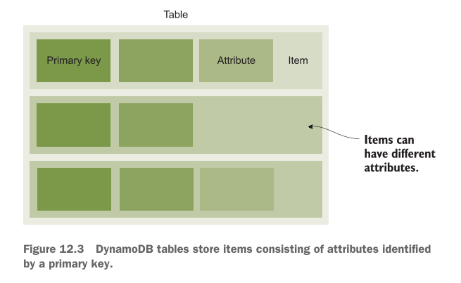

# Programming for the NoSQL database service: DynamoDB

Is chapter mein hum Amazon Web Services (AWS) ki sab se mashhoor NoSQL database service **DynamoDB** ke baare mein seekhenge. Pehle hum samajhte hain ke is chapter mein hum kya kya cover karne waale hain:

## This chapter covers

* **Advantages and disadvantages of the NoSQL service, DynamoDB:** DynamoDB istemal karne ke kya fayde hain aur kya nuksanat hain.
* **Creating tables and storing data:** DynamoDB mein tables kaise banaye jaate hain aur un mein data kaise store (save) kiya jata hai.
* **Adding secondary indexes to optimize data retrieval:** Data ko tezi se dhoondne (search karne) ke liye Secondary Indexes kaise add kiye jaate hain.
* **Designing a data model optimized for a key-value database:** Key-Value database ke mutabiq data ka structure (model) kaise design kiya jata hai.
* **Optimizing costs by choosing the best fitting capacity mode and storage type:** Apne kharcheon (costs) ko kam se kam rakhne ke liye sahi Capacity Mode (jaise On-Demand ya Provisioned) aur Storage Type chunna.

---

### Database Ko Scale Karne Ki Zarurat Kyun Parti Hai?

Is baat ko ek bilkul aasan misal se samajhte hain:

Socho aap ke paas ek **Warehouse (Bada Godown)** hai. Is godown mein daily kitna samaan aaya aur kitna gaya, yeh sab ek computer application record karti hai, aur wo application sara data ek **Database** mein save karti hai.

* Jab godown mein kam samaan hoga, toh kam log system istemal karenge aur database araam se kaam karega.
* Lekin jab business barhega aur hazaron items roz aayenge-jaayenge, toh database par load bohot zyada ho jayega.
* Is se database **slow (latency high)** ho jayega aur kam rukne lagega.

Is masley ko hal karne ke liye humein database ko **Scale (bada/kabootar ki tarah failana)** karna padta hai. Scale karne ke **2 tarike** hotay hain:

1. **Vertically (Ooper Ki Taraf Scale Karna):**
* **Simple Matlab:** Apne chalte hue ek hi computer/server mein zyada power daal dena. E.g., RAM barha dena, CPU zyaada tezz lagana, ya fast SSD storage laga dena.
* **Kharabi (Trade-off):** Yeh tarika shuru mein aasan lagta hai lekin bohot **mehanga** hota hai! Ek limit ke baad market mein itna shandar/bada computer milna hi band ho jata hai ke aap usay mazeed upgrade kar sakein.


2. **Horizontally (Sidhe Bazu Ki Taraf Scale Karna):**
* **Simple Matlab:** Ek computer par sara bojh daalne ke bajaye us ke sath 2, 3 ya hazaron aur chote chote computers (Nodes) jod dena. In sab computers ke group ko **Database Cluster** kehte hain.


---

### Traditional Relational Database Ko Horizontally Scale Karna Kyun Mushkil Hai?

Purane zamane ke Relational Databases (jaise MySQL, PostgreSQL) ko Horizontally scale karna bohot mushkil kaam hai. Is ki wajah hoti hai **ACID guarantees** (Atomicity, Consistency, Isolation, Durability)—yani data bilkul sahi aur accurate rahe, koi galti na ho.

ACID guarantees ko barkarar rakhne ke liye cluster ke sabhi computers (nodes) ko aapas mein ek doosre se har waqt poochhna aur baat karni parti hai. Is pooch-gach ko hum **Two-Phase Commit** kehte hain.

---

#### Figure 12.1 Detailed Breakdown (Two-Phase Commit Protocol)

Aap diye gaye **Figure 12.1** ko dekhein. Is mein dikhaya gaya hai ke jab 2 Nodes (computers) aapas mein data sync karte hain toh kitna communication overhead hota hai:

<div align="center">
  
</div>

* **Step 1:** Ek user ne Database Cluster ko data change karne ki request bheji (jaise data `INSERT`, `UPDATE`, ya `DELETE` karna). Yeh request ek main **Coordinator** computer ke paas jati hai.
* **Step 2 (Phase 1 - Prepare):** Coordinator dono computers (**Node 1** aur **Node 2**) ko ek "Commit Request" bhejta hai aur poochhta hai: *"Kya tum is data ko safe tarike se save kar sakte ho?"*
* **Step 3:** **Node 1** check karta hai aur Coordinator ko jawab (Acknowledge) bhejta hai ke *"Haan, main save kar sakta hoon."* Jab Node 1 haan keh de, toh wo apna waada tod nahi sakta.
* **Step 4:** **Node 2** bhi check karta hai aur Coordinator ko apna jawab bhejta hai ke *"Haan, main bhi tayar hoon."*
* **Step 5 (Phase 2 - Commit):** Coordinator dekhtah hai ke dono Nodes ne "HAAN" kaha hai, toh wo dono Nodes ko final order bhejta hai: *"Chalo ab finally data write (save) kar do!"*
* **Step 6:** **Node 1** aur **Node 2** dono exact ek hi time par data ko hard drive mein permanently save kar dete hain. Is step par koi galti ya failure allow nahi hota.

> **Sab Se Bada Masla (Trade-off):**
> Jaise jaise aap cluster mein mazeed computers (Nodes) add karenge (Node 3, Node 4, Node 10...), un sab ko aapas mein ek doosre se poochne aur confirm karne mein itna zyaada time lag jayega ke aap ka database tezz hone ke bajaye **bohot zyaada slow** ho jayega!

---

### NoSQL Aur DynamoDB Ka wajood

Is slow-down ke masley ko hal karne ke liye **NoSQL Databases** banaye gaye. NoSQL databases ACID guarantees ke sakht usoolon ko thoda naram (relax) kar dete hain taake hazaron computers ek sath mil kar tezi se kaam kar sakein.

#### NoSQL Database Ki 4 Badi Kismein (Types):

1. **Document Store** (E.g., MongoDB, AWS DocumentDB)
2. **Graph Store** (E.g., AWS Neptune)
3. **Columnar Store** (E.g., AWS Keyspaces)
4. **Key-Value Store** (E.g., AWS DynamoDB)

---

### AWS DynamoDB Kya Hai?

**Amazon DynamoDB** AWS ki taraf se di gayi ek NoSQL **Key-Value Store** service hai (jis mein Documents ka support bhi shamil hai).

* **Key-Value Store Ka Matlab:** Yeh bilkul ek Python Dictionary ya **Hash Table** ki tarah kaam karta hai. Har data object ki ek unique **Key** (ID) hoti hai, aur us Key ke zariye aap us ki poori **Value** (Data) haasil kar lete hain.
* **Fully Managed Service:** Is ka matlab yeh hai ke aap ko koi physical server, operating system, ya database software install ya maintain nahi karna padta. AWS piche sab kuch khud sambhalta hai.
* **High Availability & Durability:** Aap ka data automatic multiple data centers mein copy hota hai taake kabhi loss na ho.
* **Unlimited Scaling:** Aap is par 1 item store karein ya **arabon (billions)** items, 1 request per second bhejein ya **hazaron requests per second**, DynamoDB bina slow hue khud hi scale ho jata hai.

#### AWS Ke Doosre NoSQL Options:

* **Keyspaces:** Managed Apache Cassandra.
* **Neptune:** Graph databases ke liye.
* **DocumentDB:** MongoDB compatible database.
* **MemoryDB for Redis:** Super-fast in-memory database.

> **Mahaam Note:** Aap purani legacy applications (jaise MySQL par bani web apps) ko direct DynamoDB par nahi chala sakte. Is ke liye aap ko apni application ka code DynamoDB ke mutabiq naye tarike se likhna padta hai.

---

### DynamoDB Ke Real-World Use Cases (Kahan Istemal Hota Hai?)

1. **Massive & Spiky Workloads (Bohot Zyada Aur Achanak Aane Wala Traffic):**
* Jab aap aisi app bana rahe hoon jahan achanak millions of users aa jayein.
* *Writer ki real-world example:* Web applications par hone wale client-side errors ko real-time mein track karne ke liye unhone DynamoDB istemal kiya.


2. **Choti Applications Ya Simple Data Structures:**
* Jab aap Pay-Per-Request (On-Demand) pricing model chahte hain—jitna use karo bas utna bill do.
* *Writer ki real-world example:* Background mein chalne waale Batch Jobs ki progress tracking ke liye DynamoDB ka istemal kiya gaya.


---

### Hands-On Project: `nodetodo` Application

Is chapter mein hum ek simple Command-Line Tool banayege jiska naam **`nodetodo`** hai. Yeh Database duniya ka **"Hello World"** example hai.

#### Figure 12.2 Detailed Breakdown (nodetodo CLI App in Action)

Aap diye gaye **Figure 12.2** ki terminal screenshot ko dekhein. Is mein step-by-step commands chalai gayi hain:

<div align="center">
  
</div>

```bash
# Step 1: Naya User add karna
mwittig:chapter13 michael$ node index.js user-add michael michael@widdix.de +4971537507824
user added with uid michael

```

* **Explanation:** Command line se `user-add` run karke user `michael`, uska email `michael@widdix.de`, aur phone number add kiya gaya hai. System ne isay unique ID (`uid michael`) assign kar di.

```bash
# Step 2: Pehla Task (To-Do) add karna
mwittig:chapter13 michael$ node index.js task-add michael "book flight to AWS re:Invent"
task added with tid 1526650262330

```

* **Explanation:** `task-add` command chalakar `michael` user ke liye pehla kaam ("book flight to AWS re:Invent") add kiya gaya. System ne task ki ID (`tid: 1526650262330`) create ki.

```bash
# Step 3: Doosra Task add karna
mwittig:chapter13 michael$ node index.js task-add michael "revise chapter 10"
task added with tid 1526650265877

```

* **Explanation:** Ek aur task ("revise chapter 10") add kiya gaya. Iski alag Task ID (`tid: 1526650265877`) generate hui.

```bash
# Step 4: User ke sare Tasks ki list dekhna
mwittig:chapter13 michael$ node index.js task-ls michael
tasks [ { tid: '1526650262330',
    description: 'book flight to AWS re:Invent',
    created: '20180518',
    due: null,
    category: null,
    completed: null },
  { tid: '1526650265877',
    description: 'revise chapter 10',
    created: '20180518',
    due: null,
    category: null,
    completed: null } ]

```

* **Explanation:** `task-ls michael` chalane par DynamoDB se sara fetch kiya gaya data terminal par JSON array ki shakhal mein list ho jata hai.

```bash
# Step 5: Task ko Completed mark karna
mwittig:chapter13 michael$ node index.js task-done michael 1526650262330
task completed with tid 1526650262330

```

* **Explanation:** Specific Task ID (`1526650262330`) ko specify karke us task ka status complete mark kar diya gaya.

---

> ### Examples are 100% covered by the Free Tier
> 
> 
> Is chapter mein di gayi tamam practical exercise AWS ke **Free Tier** mein 100% free hain. Bas is baat ka dhyan rakhein ke aap ke AWS account mein koi aur heavy resources na chal rahe hoon. Chapter ke aakhir mein hum saare resources delete/clean up bhi karenge taake koi bill na aaye.

---

## Programming a to-do application

Aaiye ab dekhte hain ke DynamoDB ke sath kaam karne ke liye ek to-do application kaise program ki jati hai.

DynamoDB ek **Key-Value Store** hai jo aap ke data ko **Tables** (dabon ya registers) mein organize karta hai.

* **Example:** Aap ke paas ek table apne **Users** ka data store karne ke liye ho sakti hai aur doosri table un ke **Tasks** (kaam) ko store karne ke liye.
* **Item (Record):** Table ke andar mojood har record ko hum **Item** kehte hain. Isay aap aam relational database (jaise MySQL) ki ek **Row** (line) ki tarah samajh sakte hain. Har Item ki ek unique key hoti hai jisse uski pehchan hoti hai.

Kisi programming language ki ziyaada mushkilat se bachne ke liye, hum **Node.js/JavaScript** ka istemal karke ek choti si terminal app banayenge jiska naam **`nodetodo`** hai. Yeh app aap ke local machine ke terminal par chalti hai aur piche DynamoDB ko database ke tor par istemal karti hai.

Is `nodetodo` application ke andar yeh tamam features hain:

* Naye users banana aur purane users delete karna.
* Naye tasks banana aur unhein delete karna.
* Tasks ko "Done" (kam mukammal) mark karna.
* Alag alag filters ke sath sabhi tasks ki list nikalna.

Is app ka Command-Line Interface (CLI) bohot aasan aur samajhne mein easy banane ke liye **docopt** namak tool/language ka istemal kiya gaya hai. Below di gayi listing mein `nodetodo` ke supported commands aur unke parameters bataye gaye hain:

---

### Listing 12.1 CLI description language docopt: Using nodetodo (cli.txt)

```text
nodetodo

Usage:
  nodetodo user-add <uid> <email> <phone>
  nodetodo user-rm <uid>
  nodetodo user-ls [--limit=<limit>] [--next=<id>]
  nodetodo user <uid>
  nodetodo task-add <uid> <description> [<category>] [--dueat=<yyyymmdd>]
  nodetodo task-rm <uid> <tid>
  nodetodo task-ls <uid> [<category>] [--overdue|--due|--withoutdue|--futuredue]
  nodetodo task-la <category> [--overdue|--due|--withoutdue|--futuredue]
  nodetodo task-done <uid> <tid>
  nodetodo -h | --help
  nodetodo --version

Options:
  -h --help        Show this screen.
  --version        Show version.

```

#### Code aur Commands Ka Breakdown:

* **`nodetodo user-add <uid> <email> <phone>`:** Is command se naya user add hota hai. Is mein User ID (`uid`), Email, aur Phone number teeno dena compulsory hai.
* **`nodetodo user-rm <uid>`:** Kisi user ki `uid` de kar usay system se remove (delete) kiya jata hai.
* **`nodetodo user-ls [--limit=<limit>] [--next=<id>]`:** Sabhi users ki list dikhata hai. Square brackets `[...]` ka matlab hai ke `--limit` (kitne users dikhane hain) aur `--next` (aglay page par jane ke liye ID) optional parameters hain.
* **`nodetodo user <uid>`:** Specific user ki mukammal details dikhata hai.
* **`nodetodo task-add <uid> <description> [<category>] [--dueat=<yyyymmdd>]`:** User ke liye naya task add karta hai. User ID aur Task Description zaroori hain, jabke Category aur Due Date (`dueat`) optional hain.
* **`nodetodo task-rm <uid> <tid>`:** Specific User ID (`uid`) aur Task ID (`tid`) ke zariye task delete karta hai.
* **`nodetodo task-ls <uid> [<category>] [--overdue|--due|--withoutdue|--futuredue]`:** User ke tasks list karta hai. Pipe `|` ka matlab "Ya yeh, Ya woh" (either/or) hota hai, yani aap aik waqt par ek hi condition/filter laga sakte hain (jaise overdue tasks ya future due tasks).
* **`nodetodo task-la <category> [--overdue|--due|--withoutdue|--futuredue]`:** Kisi khaas category ke tamam tasks ko filters ke sath list karta hai.
* **`nodetodo task-done <uid> <tid>`:** Task ko complete mark kar deta hai.
* **`nodetodo -h | --help` aur `--version`:** Help menu aur app ka version dikhane ke liye options hain.

> **Mahaam Fark (DynamoDB vs SQL):** DynamoDB kisi traditional SQL database jaisa nahi hai jismein aap SQL queries (`SELECT * FROM...`) likhte hain. DynamoDB ke sath baat karne ke liye hum **AWS SDK** istemal karte hain jo AWS ke REST API par requests bhejta hai. Aap purani SQL app ko direct DynamoDB par nahi chala sakte; aap ko hamesha code likhna padta hai!

---

## Creating tables

DynamoDB mein har table ka ek unique naam hota hai aur us mein **Items** ka collection hota hai.

* **Attribute:** Item ke andar mojood alag alag data fields ko hum **Attribute** kehte hain. Yeh hamesha **Name-Value Pair** ki shakal mein hote hain (e.g., `Name: Emma`).
* **Attribute Values Ki Types:**
1. **Scalar (Single value):** Number, String, Binary, Boolean.
2. **Multivalued (Ek se zyada values):** Number Set, String Set, Binary Set.
3. **JSON Document:** Complex objects ya arrays.


Table ke alag alag items ke paas bilkul alag attributes ho sakte hain, kyun ke DynamoDB mein koi sakht (enforced) schema nahi hota.

---

### Figure 12.3 Detailed Breakdown

Figure 12.3 mein DynamoDB ke basic components ko visualize kiya gaya hai:

<div align="center">
  
</div>

* **Table Box:** Poori Table ko represent karta hai.
* **Horizontal Rows (Items):** Table mein mojood har horizontal line ek **Item** hai.
* **Columns (Primary Key & Attributes):**
* Sab se pehle column ko **Primary Key** mark kiya gaya hai, jo har item mein lazmi mojood hota hai.
* Baqi boxes **Attributes** ko zahir karte hain.


* **Items can have different attributes (Sab se zaroori point):** Figure mein wazeh dikhaya gaya hai ke pehle Item ke paas 3 extra attributes hain, doosre ke paas sirf 2 attributes hain, aur teesre ke paas alag attributes hain. Is ka matlab yeh hai ke DynamoDB mein fixed schema nahi hota—har item apne alag attributes rakh sakta hai.

> Bhalay DynamoDB mein fixed schema nahi hota, lekin table banate waqt aap ko yeh batana laazmi hota hai ke kaun sa attribute **Primary Key** ke taur par kaam karega.

---

## Users are identified by a partition key

User ka data save karne ke liye hum ne yeh simple JSON data structure choose kiya hai:

```json
{
  "uid": "emma",        // Unique user ID
  "email": "emma@widdix.de", // User ka email address
  "phone": "0123456789"    // User ka phone number
}

```

Is information ki bunyaad par DynamoDB table kaise banayein?

1. **Table Ka Naam:** Hamesha apni application ka naam prefix ke taur par lagana chahiye. Hum is table ka naam **`todo-user`** rakhte hain taake future mein kisi aur app ke table se name collision (naamon ka takraao) na ho.
2. **Primary Key Choosna:** Hum `uid` ko primary key chunte hain kyun ke har user ki `uid` unique hai.
3. **Partition Key Kya Hai?** Jab hum sirf ek hi attribute ko primary key ke taur par istemal karte hain, toh DynamoDB usay **Partition Key** kehta hai.

AWS CLI command `aws dynamodb create-table` chalate waqt **4 zaroori options** hote hain:

* **`table-name`:** Table ka naam (jo baad mein badla nahi ja sakta).
* **`attribute-definitions`:** Primary key mein istemal hone wale attributes ke naam aur unki types. Types yeh ho sakti hain: `S` (String), `N` (Number), ya `B` (Binary).
* **`key-schema`:** Primary key ke structure ki wazahat. `HASH` Partition Key ke liye hota hai aur `RANGE` Sort Key ke liye.
* **`provisioned-throughput`:** Table ki speed settings (`ReadCapacityUnits=5,WriteCapacityUnits=5`).

Execute karein yeh CLI command `todo-user` table banane ke liye:

```bash
aws dynamodb create-table --table-name todo-user \
  --attribute-definitions AttributeName=uid,AttributeType=S \
  --key-schema AttributeName=uid,KeyType=HASH \
  --provisioned-throughput ReadCapacityUnits=5,WriteCapacityUnits=5

```

Table banne mein kuch seconds ka time lagta hai. Jab tak status **ACTIVE** na ho jaye, hum table par kaam nahi kar sakte. Status check karne ki command neechay di gayi hai:

---

### Listing 12.2 Checking the status of the DynamoDB table

```bash
$ aws dynamodb describe-table --table-name todo-user

```

**Output JSON Breakdown:**

```json
{
  "Table": {
    "AttributeDefinitions": [
      {
        "AttributeName": "uid",
        "AttributeType": "S"
      }
    ],
    "TableName": "todo-user",
    "KeySchema": [
      {
        "AttributeName": "uid",
        "KeyType": "HASH"
      }
    ],
    "TableStatus": "ACTIVE",
    "CreationDateTime": "2022-01-24T16:00:29.105000+01:00",
    "ProvisionedThroughput": {
      "NumberOfDecreasesToday": 0,
      "ReadCapacityUnits": 5,
      "WriteCapacityUnits": 5
    },
    "TableSizeBytes": 0,
    "ItemCount": 0,
    "TableArn": "arn:aws:dynamodb:us-east-1:111111111111:table/todo-user",
    "TableId": "0697ea25-5901-421c-af29-8288a024392a"
  }
}

```

* **`AttributeDefinitions`:** Yeh batata hai ke table ki key ke taur par `uid` ek String (`S`) set hai.
* **`TableName`:** Table ka naam `todo-user` hai.
* **`KeySchema`:** Key type `HASH` hai, matlab `uid` humari Partition Key hai.
* **`TableStatus`:** Status `"ACTIVE"` dikha raha hai, matlab table ab istemal ke liye 100% tayar hai.
* **`CreationDateTime`:** Table kis date aur time par bani thi.
* **`ProvisionedThroughput`:** Read aur Write capacity units dono 5, 5 set hain.
* **`TableSizeBytes` & `ItemCount`:** Abhi table khali hai is liye bytes aur items ki tadaad 0 hai.
* **`TableArn` & `TableId`:** AWS ka Unique Resource Name aur Internal Identifier ID.

---

## Tasks are identified by a partition key and sort key

Users ki table banane ke baad, ab humein **Tasks** ko store karne ke liye ek table chahiye. Aise Task ka data structure yeh hai:

```json
{
  "uid": "emma",               // Kis user ka task hai
  "tid": 1645609847712,        // Task ID (Time in milliseconds)
  "description": "prepare lunch" // Task kya hai
}

```

### Partition Key + Sort Key (Composite Primary Key) Kyun Chuni?

Agar hum sirf `tid` (Task ID) ko primary key banate toh masla yeh hota ke hum `task-ls` (user ke saare tasks list karne waali command) tezi se nahi chala sakte the.

Is liye hum ne **`uid` aur `tid` ke combination** ko primary key banaya:

* **Partition Key (`HASH`):** `uid` (User ID).
* **Sort Key (`RANGE`):** `tid` (Task ID).

> **Niyam (Rule):** Partition key akele unique hona zaroori nahi, aur Sort key bhi akele unique hona zaroori nahi. Lekin **Partition Key + Sort Key ka jod (combination) 100% unique hona chahiye!**

> **Ahem Limitation (Pabandi):** Is design ki waja se ek user ek hi millisecond ke andar 2 tasks create nahi kar sakta, kyun ke `uid` + `tid` duplicate ho jayenge. Lekin chunke time milliseconds mein hai, toh aam use mein aisa masla nahi aata.

### Unordered Hash Index Aur Sorted Index Kaise Kaam Karte Hain?

DynamoDB internals ko bilkul aasan misal se samjhein:

1. **Partition Key (`uid`)** ka koi khas order nahi hota (Unordered Hash Index). Data alag alag partitions par bikhra hota hai.
2. **Sort Key (`tid`)** har Partition Key ke andar tartiib se (Sorted Order mein) arranged hoti hai.

Is ko is data set example se samjhein:

```text
["john", 1] => { "uid": "john", "tid": 1, "description": "prepare customer presentation" }
["john", 2] => { "uid": "john", "tid": 2, "description": "plan holidays" }
["emma", 1] => { "uid": "emma", "tid": 1, "description": "prepare lunch" }
["emma", 2] => { "uid": "emma", "tid": 2, "description": "buy nice flowers for mum" }
["emma", 3] => { "uid": "emma", "tid": 3, "description": "prepare talk for conference" }

```

* `"john"` ke bucket/partition mein Task 1 aur 2 ek line se sorted hain.
* `"emma"` ke bucket/partition mein Task 1, 2, aur 3 sorted hain.
* `"john"` aur `"emma"` ke partitions ka aapas mein koi tartiib (order) nahi hai.

### Table Create Karne Ki CLI Command:

Execute karein yeh command `todo-task` table banane ke liye:

```bash
aws dynamodb create-table --table-name todo-task \
  --attribute-definitions AttributeName=uid,AttributeType=S AttributeName=tid,AttributeType=N \
  --key-schema AttributeName=uid,KeyType=HASH AttributeName=tid,KeyType=RANGE \
  --provisioned-throughput ReadCapacityUnits=5,WriteCapacityUnits=5

```

#### Command Ka Breakdown:

* **`--table-name todo-task`:** Table ka naam `todo-task` set kiya.
* **`--attribute-definitions`:** Do attributes define kiye: `uid` (Type `S` = String) aur `tid` (Type `N` = Number).
* **`--key-schema`:** `uid` ko `HASH` (Partition Key) banaya aur `tid` ko `RANGE` (Sort Key) banaya.
* **`--provisioned-throughput`:** Performance limits 5 Read / 5 Write capacity units set ki.

Aap `aws dynamodb describe-table --table-name todo-task` chala kar tab tak wait karein jab tak is ka status **ACTIVE** na ho jaye. Ab humari dono tables (`todo-user` aur `todo-task`) tayar hain!

---

## Adding data

Aap ne users aur un ke tasks ko store karne ke liye do tables (`todo-user` aur `todo-task`) banaye hain. Ab in tables ko istemal karne ke liye in mein data add (write) karna lazmi hai.

DynamoDB ke sath baat karne aur data bhejne ke liye hum **Node.js SDK** ka istemal karenge. User aur task add karne ka code likhne se pehle, aaiye Node.js ko set up karte hain aur boilerplate (bunyaadi) code ko samajhte hain.

---

### Installing and getting started with Node.js

**Node.js kya hai?**
Ek aasan misal se samajhte hain: Normally, JavaScript sirf web browser (jaise Chrome) ke andar chalti hai. Lekin Node.js ek aisa platform hai jo JavaScript ko aap ke computer/server ke main system par chalne ki ijazat deta hai. Yeh event-driven model par kaam karta hai, jis ka matlab hai ke jab koi event (jaise request) aata hai, yeh us par turant action leta hai.

* **Installation:** Node.js ko install karne ke liye official website [https://nodejs.org](https://nodejs.org) par jaakar apne Operating System (Windows, Mac, ya Linux) ke mutabiq installer download karein.
* **Verification:** Install hone ke baad terminal (Command Prompt) khol kar yeh command likhein:

```bash
node --version

```

Aap ke terminal par output kuch is tarah dikhai dega: `v14.*` (ya 2026 mein modern Node.js versions jaise `v20.*` / `v22.*`). Is ka matlab hai ke Node.js sahi tarike se install ho chuka hai aur aap `nodetodo` app chalane ke liye tayar hain.

> **Ziyada Seekhne Ke Liye Resources:** Agar aap Node.js ko tafseel se seekhna chahte hain, toh Manning ki book *Node.js in Action (Second Edition)* by Alex Young ya unka video course *Node.js in Motion* by PJ Evans zaroor dekhein.

---

### Where is the code located?

Book ka tamam source code GitHub repository par mojood hai:
`[https://github.com/AWSinAction/code3](https://github.com/AWSinAction/code3)`

Aap apne terminal mein `/chapter12/` directory mein jayein aur yeh command chalayein:

```bash
npm install

```

**`npm install` kya karta hai?**
Yeh command `package.json` file ko parhti hai aur `nodetodo` app ke liye zaroori tamam external libraries/tools (jaise AWS SDK, docopt, moment) ko internet se download karke `node_modules` folder mein save kar deti hai.

---

### Listing 12.3 nodetodo: Using docopt in Node.js (index.js)

Docopt ka kaam user ke terminal par diye gaye input arguments ko parhna hai aur unhein ek JavaScript object mein convert karna hai.

```javascript
const fs = require('fs'); // Filesystem tak rasai ke liye fs module load karta hai
const docopt = require('docopt'); // Input arguments ko parhne ke liye docopt module load karta hai
const moment = require('moment'); // JavaScript mein temporal types ko asan banane ke liye moment module load karta hai
const AWS = require('aws-sdk'); // AWS SDK module load karta hai
const db = new AWS.DynamoDB({
  region: 'us-east-1'
});

const cli = fs.readFileSync('./cli.txt',
  {encoding: 'utf8'}); // File cli.txt se CLI description parhta hai
const input = docopt.docopt(cli, {
  version: '1.0',
  argv: process.argv.splice(2)
}); // Arguments ko parse karta hai, aur unhein aik input variable mein save karta hai

```

#### Code Breakdown:

* **`const fs = require('fs');`**
* `fs` (File System) Node.js ka built-in tool hai jo local drive se files ko read ya write karne ke kaam aata hai.


* **`const docopt = require('docopt');`**
* Terminal command parameters ko parsing (breakdown) karne waali library ko import kar raha hai.


* **`const moment = require('moment');`**
* Date aur Time ki formatting aur calculations ko aasan banane ke liye `moment` library ko load karta hai.


* **`const AWS = require('aws-sdk');`**
* AWS ki tamam services (jaise DynamoDB) ke sath connect hone ke liye official AWS SDK library ko load karta hai. *(Note: Yeh AWS SDK v2 Syntax hai; 2026 mein modern projects mein hum AWS SDK v3 `@aws-sdk/client-dynamodb` istemal karte hain, lekin kaam karne ka bunyaadi logic bilkul same rehta hai).*


* **`const db = new AWS.DynamoDB({ region: 'us-east-1' });`**
* DynamoDB ka client instance create kar raha hai aur batara ha hai ke hamari tables AWS ke `us-east-1` (N. Virginia) region mein hain.


* **`const cli = fs.readFileSync('./cli.txt', {encoding: 'utf8'});`**
* Pehle se bani hui `cli.txt` file (jismein tamam CLI rules aur options likhe hain) ko utf8 text format mein read karke `cli` variable mein store karta hai.


* **`const input = docopt.docopt(cli, { version: '1.0', argv: process.argv.splice(2) });`**
* Terminal par user ne jo bhi likha (maslan `user-add john john@widdix.de +11111111`), usay read karke breakdown karta hai aur `input` variable ke andar ek organized JavaScript object mein save kar deta hai.


---

### Listing 12.4 DynamoDB: Creating an item

Aaiye dekhte hain ke DynamoDB mein low-level API istemal karte hue item kaise add kiya jata hai (`putItem` method).

```javascript
const params = {
  Item: { // Tamam item attribute name-value pairs hain
    attr1: {S: 'val1'}, // Strings ko S se zahir kiya jata hai
    attr2: {N: '2'} // Numbers (floats aur integers) ko N se zahir kiya jata hai
  },
  TableName: 'app-entity' // app-entity table mein item add karta hai
};
db.putItem(params, (err) => { // DynamoDB par putItem operation invoke karta hai
  if (err) { // Errors ko handle karta hai
    console.error('error', err);
  } else {
    console.log('success');
  }
});

```

#### Code Breakdown:

* **`const params = { ... };`**
* AWS API ko bhejne waale settings aur data ka ek main JSON object.


* **`Item: { attr1: {S: 'val1'}, attr2: {N: '2'} }`**
* DynamoDB Low-Level API mein aap ko har value ke sath uski Data Type explicit tarike se batani parti hai:
* `{S: 'val1'}` ka matlab hai ke `attr1` ek **String (`S`)** hai aur uski value `'val1'` hai.
* `{N: '2'}` ka matlab hai ke `attr2` ek **Number (`N`)** hai aur uski value `2` hai (dhyan rahe ke number ko bhi quotes `'2'` mein pass kiya jata hai).


* **`TableName: 'app-entity'`**
* Yeh batata hai ke data kis table mein ja kar save hona chahiye.


* **`db.putItem(params, (err) => { ... });`**
* AWS ko network par request bhejta hai ke item store karo. Jab DynamoDB jawab deta hai, toh yeh callback function chalta hai:
* **`if (err)`**: Agar internet ka masla ho ya key ka issue aaye toh terminal par error print karega.
* **`else`**: Agar data kamyabi se save ho jaye toh terminal par `"success"` print hoga.


---

## Adding a user

Pehla qadam `todo-user` table mein user data add karna hai. Jab user terminal par `user-add` command chalata hai, toh neechay diya gaya code execute hota hai.

### Listing 12.5 nodetodo: Adding a user (index.js)

```javascript
if (input['user-add'] === true) {
  const params = {
    Item: { // Item mein tamam attributes shamil hote hain. Keys bhi attributes hoti hain, aur is wajah se jab aap data add karte hain toh aap ko DynamoDB ko yeh batane ki zaroorat nahi hoti ke konsa attribute key hai
      uid: {S: input['<uid>']}, // uid attribute string type ka hai aur is mein uid parameter value hoti hai
      email: {S: input['<email>']}, // email attribute string type ka hai aur is mein email parameter value hoti hai
      phone: {S: input['<phone>']} // phone attribute string type ka hai aur is mein phone parameter value hoti hai
    },
    TableName: 'todo-user', // User table ko specify karta hai
    ConditionExpression: 'attribute_not_exists(uid)' // Agar aik hi key par putItem do dafa call kiya jaye, toh data replace ho jata hai. ConditionExpression putItem ki tabhi ijazat deti hai jab key pehle se mojood na ho
  };
  db.putItem(params, (err) => { // DynamoDB par putItem operation ko invoke karta hai
    if (err) { // Errors ko handle karta hai
      console.error('error', err);
    } else {
      console.log('user added');
    }
  });
}

```

#### Code Breakdown:

* **`if (input['user-add'] === true)`**
* Yeh check karta hai ke kya user ne terminal par `user-add` command run ki hai? Agar haan, toh andar ka code chalega.


* **`Item: { uid: {S: ...}, email: {S: ...}, phone: {S: ...} }`**
* DynamoDB ko teeno attributes pass kar raha hai. Teeno ki data type String (`S`) hai.
* *Important Concept:* Key (`uid`) bhi baki attributes ki tarah hi likhi jati hai. DynamoDB khud pehchan leta hai ke yeh key hai kyun ke hum ne table banate waqt `uid` ko key set kiya tha.


* **`TableName: 'todo-user'`**
* Target table `todo-user` hai.


* **`ConditionExpression: 'attribute_not_exists(uid)'` (Mahaam Concept & Design Decision)**
* **Bacho Ki Tarah Samjhein:** Normally, DynamoDB mein agar aap ek hi User ID (`uid`) se dobara data bhejein, toh purana data bager kisi warning ke **delete (overwrite)** ho jata hai!
* Is khatre se bachne ke liye hum ne `ConditionExpression` lagaya hai. Yeh DynamoDB ko bolta hai: *"Pehle check karo! Agar yeh `uid` pehle se table mein exist karti hai, toh error de do aur naya data overwrite mat hone do!"*


* **`db.putItem(params, ...)`**
* Success par terminal par `"user added"` display hota hai.


#### Execution Commands (Users Add Karein):

Ab apne terminal par yeh do commands chala kar do users create karein:

```bash
node index.js user-add john john@widdix.de +11111111
node index.js user-add emma emma@widdix.de +22222222

```

---

## Adding a task

Users add karne ke baad, John aur Emma apne daily kaam organize karne ke liye tasks add karenge. Task add karne ka logic user add karne se milta julta hai, lekin is mein optional parameters aur composite keys handling shamil hain.

### Listing 12.6 nodetodo: Adding a task (index.js)

```javascript
if (input['task-add'] === true) {
  const tid = Date.now(); // Current timestamp ki buniyad par task ID (tid) create karta hai
  const params = {
    Item: {
      uid: {S: input['<uid>']},
      tid: {N: tid.toString()}, // tid attribute number type ka hai aur is mein tid ki value hoti hai
      description: {S: input['<description>']},
      created: {N: moment(tid).format('YYYYMMDD')} // Create kiya gaya attribute number type ka hota hai (format 20150525)
    },
    TableName: 'todo-task', // Task table ko specify karta hai
    ConditionExpression: 'attribute_not_exists(uid) ' +
      'and attribute_not_exists(tid)' // Yeh yakeeni banata hai ke koi mojooda item override na ho
  };
  if (input['--dueat'] !== null) { // Agar optional named parameter dueat set ho, toh yeh value item mein add kar deta hai
    params.Item.due = {N: input['--dueat']};
  }
  if (input['<category>'] !== null) { // Agar optional named parameter category set ho, toh yeh value item mein add kar deta hai
    params.Item.category = {S: input['<category>']};
  }
  db.putItem(params, (err) => { // DynamoDB par putItem operation ko invoke karta hai
    if (err) {
      console.error('error', err);
    } else {
      console.log('task added with tid ' + tid);
    }
  });
}

```

#### Code Breakdown:

* **`if (input['task-add'] === true)`**
* Check karta hai ke kya command `task-add` chali hai.


* **`const tid = Date.now();`**
* `Date.now()` Unix Timestamp generate karta hai (yani 1 Jan 1970 se lekar abhi tak ke total milliseconds). Is milli-second counter ko hum unique **Task ID (`tid`)** ke tor par istemal karte hain.


* **`Item: { ... }` Structure:**
* **`uid`**: User ID (`S` String).
* **`tid`**: Task ID (`N` Number format mein convert karke `tid.toString()`).
* **`description`**: Task ki tafseel (`S` String).
* **`created`**: Task banne ki tarikh (`N` Number format YYYYMMDD, e.g., 20260801).


* **`TableName: 'todo-task'`**
* Target table `todo-task` set karta hai.


* **`ConditionExpression: 'attribute_not_exists(uid) and attribute_not_exists(tid)'`**
* Kyun ke `todo-task` table ki Primary Key **Partition Key (`uid`) + Sort Key (`tid`)** donon se mil kar bani hai, is liye hum ne dono keys par condition lagai hai ke yeh jod (pair) pehle se table mein mojood nahi hona chahiye.


* **Optional Parameters Handling (Dynamic Attributes):**
* **`if (input['--dueat'] !== null)`**: Agar user ne CLI par task ki due date batayi hai (jaise `--dueat "20260224"`), toh code dynamically item ke andar `due` attribute add kar deta hai.
* **`if (input['<category>'] !== null)`**: Agar user ne category di hai (jaise `"shopping"`), toh `category` attribute bhi JSON Object mein add ho jata hai.
* *DynamoDB Schema-less Power:* Agar yeh attributes input mein nahi diye gaye, toh DynamoDB item mein yeh fields create hi nahi hotay!


#### Execution Commands (Tasks Add Karein):

Ab terminal par yeh commands chala kar Emma aur John ke tasks add karein:

1. **Emma ka Task (Bina Due Date Ke):**

```bash
node index.js task-add emma "buy milk" "shopping"

```

*Is command se Emma ke liye "shopping" category mein "buy milk" ka task add hoga.*

2. **Emma ka Task (Due Date Ke Sath):**

```bash
node index.js task-add emma "put out the garbage" "housekeeping" --dueat "20220224"

```

*Is command se "housekeeping" category wala task `--dueat` parameter ke sath add ho jayega.*


---