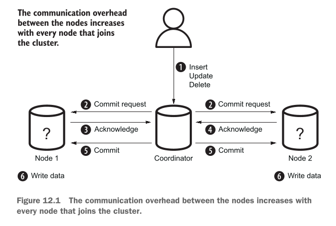
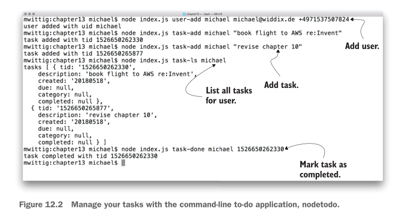

# Programming for the NoSQL database service: DynamoDB

Is chapter mein hum Amazon Web Services (AWS) ki sab se mashhoor NoSQL database service **DynamoDB** ke baare mein seekhenge. Pehle hum samajhte hain ke is chapter mein hum kya kya cover karne waale hain:

## This chapter covers

* **Advantages and disadvantages of the NoSQL service, DynamoDB:** DynamoDB istemal karne ke kya fayde hain aur kya nuksanat hain.
* **Creating tables and storing data:** DynamoDB mein tables kaise banaye jaate hain aur un mein data kaise store (save) kiya jata hai.
* **Adding secondary indexes to optimize data retrieval:** Data ko tezi se dhoondne (search karne) ke liye Secondary Indexes kaise add kiye jaate hain.
* **Designing a data model optimized for a key-value database:** Key-Value database ke mutabiq data ka structure (model) kaise design kiya jata hai.
* **Optimizing costs by choosing the best fitting capacity mode and storage type:** Apne kharcheon (costs) ko kam se kam rakhne ke liye sahi Capacity Mode (jaise On-Demand ya Provisioned) aur Storage Type chunna.

---

### Database Ko Scale Karne Ki Zarurat Kyun Parti Hai?

Is baat ko ek bilkul aasan misal se samajhte hain:

Socho aap ke paas ek **Warehouse (Bada Godown)** hai. Is godown mein daily kitna samaan aaya aur kitna gaya, yeh sab ek computer application record karti hai, aur wo application sara data ek **Database** mein save karti hai.

* Jab godown mein kam samaan hoga, toh kam log system istemal karenge aur database araam se kaam karega.
* Lekin jab business barhega aur hazaron items roz aayenge-jaayenge, toh database par load bohot zyada ho jayega.
* Is se database **slow (latency high)** ho jayega aur kam rukne lagega.

Is masley ko hal karne ke liye humein database ko **Scale (bada/kabootar ki tarah failana)** karna padta hai. Scale karne ke **2 tarike** hotay hain:

1. **Vertically (Ooper Ki Taraf Scale Karna):**
* **Simple Matlab:** Apne chalte hue ek hi computer/server mein zyada power daal dena. E.g., RAM barha dena, CPU zyaada tezz lagana, ya fast SSD storage laga dena.
* **Kharabi (Trade-off):** Yeh tarika shuru mein aasan lagta hai lekin bohot **mehanga** hota hai! Ek limit ke baad market mein itna shandar/bada computer milna hi band ho jata hai ke aap usay mazeed upgrade kar sakein.


2. **Horizontally (Sidhe Bazu Ki Taraf Scale Karna):**
* **Simple Matlab:** Ek computer par sara bojh daalne ke bajaye us ke sath 2, 3 ya hazaron aur chote chote computers (Nodes) jod dena. In sab computers ke group ko **Database Cluster** kehte hain.


---

### Traditional Relational Database Ko Horizontally Scale Karna Kyun Mushkil Hai?

Purane zamane ke Relational Databases (jaise MySQL, PostgreSQL) ko Horizontally scale karna bohot mushkil kaam hai. Is ki wajah hoti hai **ACID guarantees** (Atomicity, Consistency, Isolation, Durability)—yani data bilkul sahi aur accurate rahe, koi galti na ho.

ACID guarantees ko barkarar rakhne ke liye cluster ke sabhi computers (nodes) ko aapas mein ek doosre se har waqt poochhna aur baat karni parti hai. Is pooch-gach ko hum **Two-Phase Commit** kehte hain.

---

#### Figure 12.1 Detailed Breakdown (Two-Phase Commit Protocol)

Aap diye gaye **Figure 12.1** ko dekhein. Is mein dikhaya gaya hai ke jab 2 Nodes (computers) aapas mein data sync karte hain toh kitna communication overhead hota hai:

<div align="center">
  
</div>

* **Step 1:** Ek user ne Database Cluster ko data change karne ki request bheji (jaise data `INSERT`, `UPDATE`, ya `DELETE` karna). Yeh request ek main **Coordinator** computer ke paas jati hai.
* **Step 2 (Phase 1 - Prepare):** Coordinator dono computers (**Node 1** aur **Node 2**) ko ek "Commit Request" bhejta hai aur poochhta hai: *"Kya tum is data ko safe tarike se save kar sakte ho?"*
* **Step 3:** **Node 1** check karta hai aur Coordinator ko jawab (Acknowledge) bhejta hai ke *"Haan, main save kar sakta hoon."* Jab Node 1 haan keh de, toh wo apna waada tod nahi sakta.
* **Step 4:** **Node 2** bhi check karta hai aur Coordinator ko apna jawab bhejta hai ke *"Haan, main bhi tayar hoon."*
* **Step 5 (Phase 2 - Commit):** Coordinator dekhtah hai ke dono Nodes ne "HAAN" kaha hai, toh wo dono Nodes ko final order bhejta hai: *"Chalo ab finally data write (save) kar do!"*
* **Step 6:** **Node 1** aur **Node 2** dono exact ek hi time par data ko hard drive mein permanently save kar dete hain. Is step par koi galti ya failure allow nahi hota.

> **Sab Se Bada Masla (Trade-off):**
> Jaise jaise aap cluster mein mazeed computers (Nodes) add karenge (Node 3, Node 4, Node 10...), un sab ko aapas mein ek doosre se poochne aur confirm karne mein itna zyaada time lag jayega ke aap ka database tezz hone ke bajaye **bohot zyaada slow** ho jayega!

---

### NoSQL Aur DynamoDB Ka wajood

Is slow-down ke masley ko hal karne ke liye **NoSQL Databases** banaye gaye. NoSQL databases ACID guarantees ke sakht usoolon ko thoda naram (relax) kar dete hain taake hazaron computers ek sath mil kar tezi se kaam kar sakein.

#### NoSQL Database Ki 4 Badi Kismein (Types):

1. **Document Store** (E.g., MongoDB, AWS DocumentDB)
2. **Graph Store** (E.g., AWS Neptune)
3. **Columnar Store** (E.g., AWS Keyspaces)
4. **Key-Value Store** (E.g., AWS DynamoDB)

---

### AWS DynamoDB Kya Hai?

**Amazon DynamoDB** AWS ki taraf se di gayi ek NoSQL **Key-Value Store** service hai (jis mein Documents ka support bhi shamil hai).

* **Key-Value Store Ka Matlab:** Yeh bilkul ek Python Dictionary ya **Hash Table** ki tarah kaam karta hai. Har data object ki ek unique **Key** (ID) hoti hai, aur us Key ke zariye aap us ki poori **Value** (Data) haasil kar lete hain.
* **Fully Managed Service:** Is ka matlab yeh hai ke aap ko koi physical server, operating system, ya database software install ya maintain nahi karna padta. AWS piche sab kuch khud sambhalta hai.
* **High Availability & Durability:** Aap ka data automatic multiple data centers mein copy hota hai taake kabhi loss na ho.
* **Unlimited Scaling:** Aap is par 1 item store karein ya **arabon (billions)** items, 1 request per second bhejein ya **hazaron requests per second**, DynamoDB bina slow hue khud hi scale ho jata hai.

#### AWS Ke Doosre NoSQL Options:

* **Keyspaces:** Managed Apache Cassandra.
* **Neptune:** Graph databases ke liye.
* **DocumentDB:** MongoDB compatible database.
* **MemoryDB for Redis:** Super-fast in-memory database.

> **Mahaam Note:** Aap purani legacy applications (jaise MySQL par bani web apps) ko direct DynamoDB par nahi chala sakte. Is ke liye aap ko apni application ka code DynamoDB ke mutabiq naye tarike se likhna padta hai.

---

### DynamoDB Ke Real-World Use Cases (Kahan Istemal Hota Hai?)

1. **Massive & Spiky Workloads (Bohot Zyada Aur Achanak Aane Wala Traffic):**
* Jab aap aisi app bana rahe hoon jahan achanak millions of users aa jayein.
* *Writer ki real-world example:* Web applications par hone wale client-side errors ko real-time mein track karne ke liye unhone DynamoDB istemal kiya.


2. **Choti Applications Ya Simple Data Structures:**
* Jab aap Pay-Per-Request (On-Demand) pricing model chahte hain—jitna use karo bas utna bill do.
* *Writer ki real-world example:* Background mein chalne waale Batch Jobs ki progress tracking ke liye DynamoDB ka istemal kiya gaya.


---

### Hands-On Project: `nodetodo` Application

Is chapter mein hum ek simple Command-Line Tool banayege jiska naam **`nodetodo`** hai. Yeh Database duniya ka **"Hello World"** example hai.

#### Figure 12.2 Detailed Breakdown (nodetodo CLI App in Action)

Aap diye gaye **Figure 12.2** ki terminal screenshot ko dekhein. Is mein step-by-step commands chalai gayi hain:

<div align="center">
  
</div>

```bash
# Step 1: Naya User add karna
mwittig:chapter13 michael$ node index.js user-add michael michael@widdix.de +4971537507824
user added with uid michael

```

* **Explanation:** Command line se `user-add` run karke user `michael`, uska email `michael@widdix.de`, aur phone number add kiya gaya hai. System ne isay unique ID (`uid michael`) assign kar di.

```bash
# Step 2: Pehla Task (To-Do) add karna
mwittig:chapter13 michael$ node index.js task-add michael "book flight to AWS re:Invent"
task added with tid 1526650262330

```

* **Explanation:** `task-add` command chalakar `michael` user ke liye pehla kaam ("book flight to AWS re:Invent") add kiya gaya. System ne task ki ID (`tid: 1526650262330`) create ki.

```bash
# Step 3: Doosra Task add karna
mwittig:chapter13 michael$ node index.js task-add michael "revise chapter 10"
task added with tid 1526650265877

```

* **Explanation:** Ek aur task ("revise chapter 10") add kiya gaya. Iski alag Task ID (`tid: 1526650265877`) generate hui.

```bash
# Step 4: User ke sare Tasks ki list dekhna
mwittig:chapter13 michael$ node index.js task-ls michael
tasks [ { tid: '1526650262330',
    description: 'book flight to AWS re:Invent',
    created: '20180518',
    due: null,
    category: null,
    completed: null },
  { tid: '1526650265877',
    description: 'revise chapter 10',
    created: '20180518',
    due: null,
    category: null,
    completed: null } ]

```

* **Explanation:** `task-ls michael` chalane par DynamoDB se sara fetch kiya gaya data terminal par JSON array ki shakhal mein list ho jata hai.

```bash
# Step 5: Task ko Completed mark karna
mwittig:chapter13 michael$ node index.js task-done michael 1526650262330
task completed with tid 1526650262330

```

* **Explanation:** Specific Task ID (`1526650262330`) ko specify karke us task ka status complete mark kar diya gaya.

---

> ### Examples are 100% covered by the Free Tier
> 
> 
> Is chapter mein di gayi tamam practical exercise AWS ke **Free Tier** mein 100% free hain. Bas is baat ka dhyan rakhein ke aap ke AWS account mein koi aur heavy resources na chal rahe hoon. Chapter ke aakhir mein hum saare resources delete/clean up bhi karenge taake koi bill na aaye.