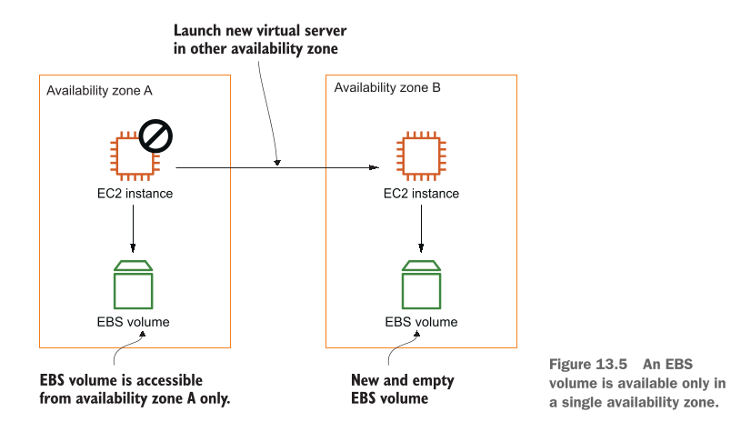
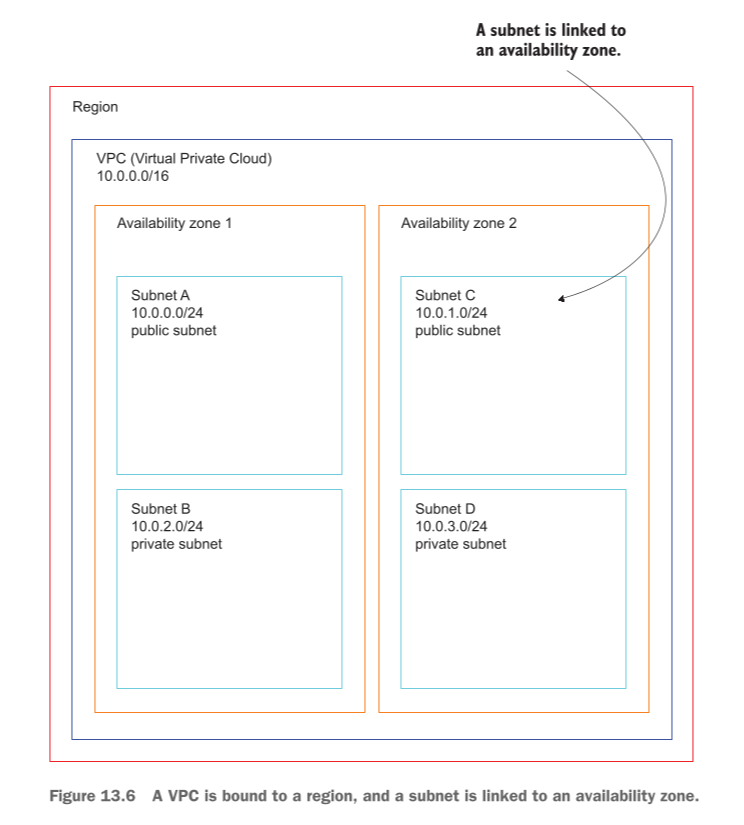
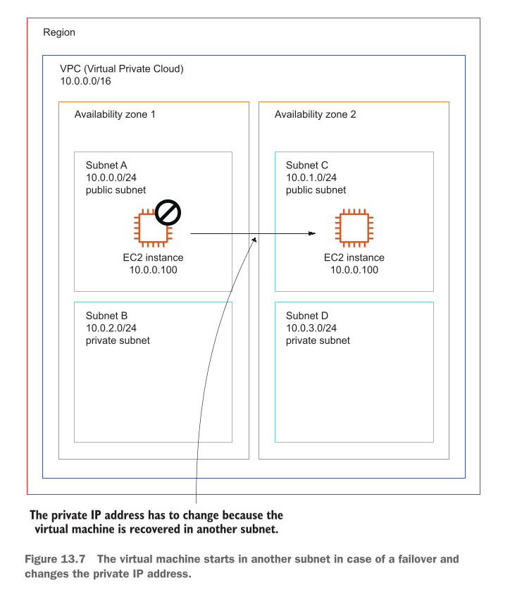
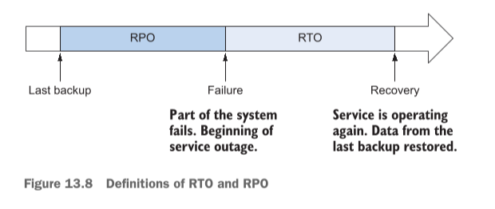
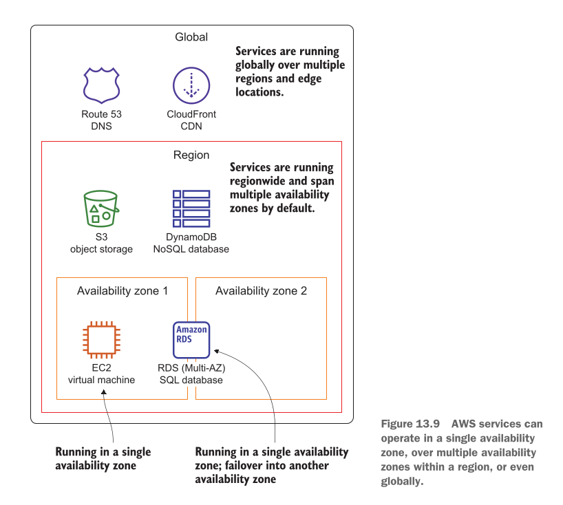

# Achieving high availability: Availability zones, autoscaling, and CloudWatch

## This chapter covers

Is chapter mein hum cloud engineering aur AWS ke sab se aham hissay ko samajhne wale hain. Writer batata hai ke is chapter mein hum char (4) mukhya (main) cheezein seekhenge:

* **CloudWatch alarm ki madad se kharab hone wali virtual machine ko dobara sahi karna (Recovering a failed virtual machine with a CloudWatch alarm):** Jab aap ki Virtual Machine (EC2 instance) kisi maslay ki wajah se band ya kharab ho jaye, toh CloudWatch naam ka chokidaar (monitoring tool) usay dekhte hi khud hi dobara restart aur recover kar deta hai.
* **Autoscaling ka istemal karke virtual machines ko lagataar chalate rehna (Using autoscaling to guarantee your virtual machines keep running):** Ek aisa automatic system banana jo hamesha yeh yakeeni banaye ke aap ki zaroorat ke mutabaq virtual machines hamesha chal rahi hain aur koi kharab ho toh usay replace kar de.
* **AWS Region mein Availability Zones ko samajhna (Understanding availability zones in an AWS region):** Yeh samajhna ke AWS ne alag alag shahron (Regions) mein bijli aur internet se azad alag alag data centers (Availability Zones) kaise banaye hain.
* **Disaster-recovery ki zarooriyat ka tajziya karna (Analyzing disaster-recovery requirements):** Jab koi bari tabahi (jaise bijli ka poora fail hona ya data center doobna) aaye, toh us se apne system ko bachane ke tareeqay samajhna.

---

### Real-World Example: Dukaan Ki Misaal (Online Shop)

Writer humein ek bohat aasan misaal se samjhata hai:

* **Purana / Kharab Tareeqah (Failure Scenario):** Farz karein aap ki internet par ek dukan (e-commerce web shop) hai jo ek computer (Virtual Machine) par chal rahi hai. Raat ke waqt jab aap so rahe hote hain, us computer ka koi hissa (hardware) kharab ho jata hai. Ab aap ki dukaan band ho gayi! Grahak (users) dukan par aate hain lekin cheezein nahi khareed paate. Woh subah hone tak 8 ghante intezar karne ke bajaye kisi doosri dukan par chale jaate hain. Yeh aap ke karobar (business) ke liye ek bohat bara nuqsan hai.
* **Naya / Aala Tareeqah (Highly Available Scenario):** Ab farz karein aap ne apna system "Highly Available" banaya hua hai. Raat ko hardware kharab hota hai, lekin **bina kisi insaan ke button dabaye**, system khud hi 2-3 minto mein samajh jata hai ke masla aaya hai. Woh kharab computer ko chor kar ek naye sahi computer par dukan ko dobara start kar deta hai. Grahak bina kisi rukawat ke khareedari jari rakhte hain!

Writer yahan ek bohat **ahem sachai** batata hai:

> **Virtual Machines (EC2 instances) by default "Highly Available" nahi hoti.** Is ka matlab hai ke agar aap khud kuch settings nahi karenge, toh cloud par bhi computer kharab ho sakta hai.

---

### Virtual Machine Kharab Hone Ki 4 Badi Wajahein (System Failure Scenarios)

Ek Virtual Machine ke band hone ya kharab hone ki writer ne 4 aasan wajahein batayi hain:

1. **Virtual Machine ke Operating System (OS) ka fail hona:** Jaise aap ke computer ki Windows ya Linux crash ho jaye (Software Problem).
2. **Main Computer (Host Machine) ke Software ka fail hona:** Jis bare asli physical computer par aap ki choti virtual machine chal rahi hai, uska apna OS ya virtualization software (Hypervisor) crash ho jaye.
3. **Physical Hardware ka tootna ya kharab hona:** Physical computer ka Processor (Compute), Hard Disk (Storage), ya Networking Wire/Card kharab ho jaye.
4. **Data Center ka fail hona:** Jis building (Data Center) mein woh computer rakha hai, wahan ki bijli (power) chali jaye, internet kat jaye, ya cooling system (ACs) band hone se computers garam ho kar band ho jayein.

---

### AWS Kya Karta Hai Aur Aap Ki Kya Zimmedari Hai?

* **Chota Masla (Small Outage):** Agar sirf ek physical computer kharab hota hai, toh AWS khud hi aap ki EC2 instance ko reboot kar ke kisi doosre sahi physical computer par chala deta hai.
* **Bara Masla (Larger Outage):** Agar poora ka poora computer rack ya data center ka hissa band ho jaye, toh AWS yeh kaam khud nahi karega! **Aap khud zimmedar hain** ke aap apne system ko auto-recovery par lagayein (CloudWatch Alarms ke zariye) ya apne kaam ko ek se zyada machines par taqseem (distribute) karein.

---

## Examples are 100% covered by the Free Tier

* **Bilkul Muft (Free Tier):** Is chapter mein jitni bhi practical misalein di gayi hain, woh AWS ke Free Tier mein aati hain. Aap ko koi paise nahi dene parenge.
* **Shart (Condition):** Shart yeh hai ke aap ne AWS ka naya account banaya ho aur is chapter ki practice khatam karne ke baad resources ko delete (clean up) kar dein. Inhein hafton tak chalte mat chhoriyega.

---

### High Availability Kya Hai? (Definition)

**High Availability (HA)** ka matlab hai ek aisa system jo **bina kisi rukawat ke lagataar chalta rahe (almost zero downtime)**. Agar koi kharabi aa bhi jaye, toh system khud hi usay theek kar le aur users ko pata bhi na chale.

Writer ne **Harvard Research Group (HRG)** ki ek standard classification batayi hai jisay **AEC-2** kehte hain:

* **99.99% Uptime:** Iska matlab hai ke poore saal (365 dino) mein aap ka system 99.99% time chalna chahiye.
* **Downtime Limit:** Poore saal mein aap ka system **zyada se zyada 52 minute aur 35.7 seconds** ke liye hi band ho sakta hai, us se zyada nahi!
* Jab aap EC2 instances ko is chapter ke tareeqon se set karenge, toh aap yeh 99.99% ka target haasil kar sakte hain bina kisi insaani madad (human intervention) ke.

---

## High availability vs. fault tolerance

In dono lafzon mein bohat barik aur ahem farq hai jisay writer ne bohat khoobsurat tareeqay se samjhaya hai:

| Feature | High Availability (HA) | Fault Tolerance (FT) |
| --- | --- | --- |
| **Aasan Misaal** | Gari ka tyre puncture ho jaye, toh gari 2 minute ke liye ruke aur automatic jack lag kar naya tyre lag jaye. | Gari ke 8 wheels hoon, agar 1 puncture ho bhi jaye toh gari bina ruke usi speed se chalti rahe. |
| **Downtime (Rukawat)** | Is mein **chota sa downtime (kuch minto ki rukawat)** aata hai jab tak system recover hota hai. | Is mein **ZERO downtime (koi rukawat nahi)** hoti. System bina ruke chalta rehta hai. |
| **Kharabi par Reaction** | Kharabi ke baad automatic recovery hoti hai. | Kharabi ke dauran bhi service mein koi farq nahi aata. |

*(Note: Fault-tolerant systems banana hum chapter 16 mein seekhenge).*

---

### AWS ke Building Blocks (HA Banane Ke Zariye)

AWS humein High Availability banane ke liye 3 mukhya tools/building blocks deta hai:

1. **Availability Zones (AZs):** Ek hi region mein alag alag, azad data centers ka istemal karna taake agar ek data center doob bhi jaye toh doosra chalta rahe.
2. **CloudWatch Monitoring & Auto-Recovery:** Virtual Machine ki sehat par nazar rakhna. Agar machine kharab ho, toh CloudWatch alarm bajaye aur auto-recovery trigger kare. *(Yeh un kaam-kaaj ke liye behtareen hai jo sirf ek hi machine par chal sakte hain)*.
3. **Autoscaling:** Yeh guarantee dena ke farz karein hamesha 3 machines chalni chahiye. Agar 1 kharab ho jaye toh Autoscaling khud hi purani ko mita kar nayi machine khari kar deta hai. *(Yeh un kaam-kaaj ke liye behtareen hai jo ek se zyada machines par taqseem ho sakte hain)*.

Is chapter ke agle hisso mein hum pehle single-machine ki auto-recovery seekhenge, phir data center outage se bachna, aur aakhir mein disaster recovery plans ko AWS architecture mein badalna seekhenge.

---

## Recovering from EC2 instance failure with CloudWatch

AWS system default taur par har kism ki kharabi par aap ki Virtual Machine (EC2 instance) ko khud se recover (thik) nahi karta. Misaal ke taur par, agar poora ka poora server rack (jahan computer rakha hai) kharab ho jaye, toh AWS aap ke EC2 instance ko khud se recover nahi karega. Is maslay ka sab se asaan hal yeh hai ke aap **CloudWatch Alarm** bana kar EC2 instance ki recovery ko automatic (swayanchalit) banayein.

---

### Real-World Scenario: Agile Team Aur Jenkins CI Server

Is concept ko samajhne ke liye writer ek real-world misaal deta hai:

* **Agile Team & Automation:** Farz karein aap ki software team **Agile development process** par kaam kar rahi hai. Kaam ko tez banane ke liye team ne faisla kiya hai ke software ki testing, building, aur deployment (server par chalane) ke kaam ko automatic kar diya jaye. Is ke liye aap ko ek **Continuous Integration (CI) Server** set karne ko kaha gaya hai.
* **Jenkins Kya Hai?** Aap ne Jenkins ko chuna hai. Jenkins ek open-source software hai jo Java mein likha gaya hai aur Apache Tomcat jaise servlet container mein chalta hai. Kyunki aap **Infrastructure as Code (IaC)** ka istemal kar rahe hain, aap apne cloud infrastructure ke changes bhi Jenkins ke zariye hi deploy karenge.
* **Jenkins Kyun Zaroori Hai? (High Availability Use Case):**
* Jenkins aap ke poore system ka ek ahem hissa hai. Agar Jenkins band ho gaya, toh aap ke saathiyan (developers) naye software ko na test kar sakenge aur na hi deploy.
* Lekin Jenkins ke mamlay mein agar kharabi ke waqt **chota sa downtime (kuch minto ki rukawat)** aaye aur system khud hi recover ho jaye, toh business ko koi bara nuqsan nahi hoga. Is liye yahan **Fault-Tolerant (zero downtime)** system ki zaroorat nahi hai, balki **High-Availability (auto recovery)** kafi hai.


* **Doosri Misaalein:** Writer batata hai ke Jenkins sirf ek misaal hai. Aap yahi tareeqah **FTP servers** ya **VPN servers** chalane ke liye bhi istemal kar sakte hain jahan thoda sa downtime bardasht kiya ja sakta hai lekin hardware fail hone par automatic recovery chahiye hoti hai.

---

### Hum Is Example Mein Kya Karenge? (3 Steps)

1. Cloud mein ek Virtual Private Network (**VPC**) banayein ge.
2. VPC ke andar ek Virtual Machine (EC2 instance) launch karenge aur computer start hote waqt (**bootstrapping**) us par automatically Jenkins install karenge.
3. Ek **CloudWatch Alarm** banayein ge jo virtual machine ki sehat (health) par nazar rakhega aur zaroorat parne par usay automatic replace / recover karega.

---

## AWS CloudWatch

**AWS CloudWatch** ek monitoring aur management service hai jo AWS resources ke metrics (performance data), events, logs, aur alarms faraham karti hai.

Is example ko chalane ke liye AWS humein ek **CloudFormation Template** deta hai.

### Stack Create Karne Ki Command

Neeche di gayi command se hum CloudFormation template chalate hain jo EC2 instance launch karta hai aur saath hi CloudWatch Alarm set karta hai:

```bash
aws cloudformation create-stack --stack-name jenkins-recovery \
  --template-url https://s3.amazonaws.com/awsinaction-code3/chapter13/recovery.yaml \
  --parameters "ParameterKey=JenkinsAdminPassword,ParameterValue=$Password" \
  --capabilities CAPABILITY_IAM

```

#### Command Ka Deep Breakdown:

* `aws cloudformation create-stack`: CloudFormation ko naya resource stack banane ka hukum deta hai.
* `--stack-name jenkins-recovery`: Is stack ka naam `jenkins-recovery` rakhta hai.
* `--template-url ...`: S3 bucket mein majood `recovery.yaml` file ka link jahan poora architecture likha hai.
* `--parameters "ParameterKey=JenkinsAdminPassword,ParameterValue=$Password"`: Jenkins ke admin password ke liye aap ka diya hua password pass karta hai (8 se 40 characters ka password `$Password` ki jagah likhna hota hai).
* `--capabilities CAPABILITY_IAM`: CloudFormation ko IAM roles/profiles banane ki ijazat deta hai.

---

### CloudFormation Template Ke Mukhya Hissay

Template ke andar 3 ahem cheezein hain:

1. Virtual Machine jiske **User Data** mein ek Bash script chal rahi hai jo machine start hote hi Jenkins install kar deti hai.
2. Ek **Public IP (Elastic IP)** address jo EC2 ko milta hai, taake agar machine kharab ho kar recover bhi ho, toh public IP change na ho.
3. Ek **CloudWatch Alarm** jo EC2 service ke system status metric ko monitor karta hai.

---

### Elastic IP Main Properties

#### 1. Public IP Address (`PublicIp`)
- **Kya hai:** Yeh woh asal public IPv4 address hota hai (misal ke tor par `54.213.14.22`), jo internet par dikhta hai aur jiske zariye duniya ka koi bhi banda aapke server tak access kar sakta hai.
#### 2. Allocation ID (`AllocationId`)
- **Kya hai:** Jab aap EIP allocate karte hain, toh AWS background mein usay ek unique system ID deta hai (jaise `eipalloc-0123456789abcdef0`).
**Kahan use hoti hai:** Jab aap Infrastructure as Code (jaise CloudFormation ya Terraform) likhte hain, toh EIP ko reference ya manage karne ke liye is **Allocation ID** ki zaroorat parti hai.
#### 3. Association ID (`AssociationId`)
- **Kya hai:** Jab aap EIP ko kisi EC2 instance ya Elastic Network Interface (ENI) ke sath link (attach) kar dete hain, toh AWS ek connection ID generate karta hai (jaise `eipassoc-abcdef123456`).
**Kaha use hoti hai:** Yeh batati hai ke EIP kis waqt kis resource ke sath successfully bound hai. Agar aap EIP ko detach kar dein, toh yeh ID khatam ho jati hai.
#### 4. Instance ID / Network Interface ID
- **Kya hai:** Yeh property batati hai ke current mein yeh EIP kis EC2 instance (`i-0123456789abcdef`) ya kis Network Interface (`eni-0123456789abcdef`) ke sath attach hai. Agar EIP free (unattached) hai, toh yeh field khali hogi.
#### 5. Domain / Scope (`Domain`)
- **Kya hai:** Yeh batata hai ke EIP kis network environment ke liye banaya gaya hai. Modern AWS accounts mein yeh hamesha **`vpc`** hota hai (purane waqt mein EC2-Classic ka option bhi hota tha jo ab band ho chuka hai).
#### 6. Network Border Group
- **Kya hai:** Yeh specify karta hai ke EIP ka data kis local zone, wavelength zone, ya AWS Region ke data center se bind hai. Is se yeh tay hota hai ke IP kis physical network location se traffic route karega.
#### 7. Public DNS (`PublicDnsName`)
- **Kya hai:** Kuch cases mein EIP ke sath ek standard AWS domain name bhi mil jata hai (jaise `ec2-54-213-14-22.compute-1.amazonaws.com`), jiska istemal IP address ki jagah kiya ja sakta hai.
#### 8. Tags
- **Kya hai:** User-defined **Key-Value pairs** hote hain (jaise `Name: AppServer-EIP` ya `Environment: Production`). Tags ki madad se aap apni EIPs ko asani se pehchan sakte hain aur cost/billing track kar sakte hain.

---

### EC2 Instance Properties

#### 1. ImageId (AMI ID)

- **Kya hai:** Yeh batati hai ke server par kaun sa operating system (OS) install hoga (misal ke tor par Ubuntu, Amazon Linux, ya Windows). Isme AMI ki ID di jati hai (jaise `ami-0c73cd1c5347436f3`).

#### 2. InstanceType

- **Kya hai:** Yeh server ka size aur power decide karta hai ke usko kitni RAM aur kitne CPU cores chahiye (misal ke tor par `t3.micro`, `t3.medium`, ya `c5.xlarge`).

#### 3. KeyName

- **Kya hai:** Yeh aapki SSH key ka naam hota hai jiske zariye aap baad mein server ke andar secure tareeqay se login karte hain.

#### 4. SubnetId

- **Kya hai:** Yeh batati hai ke aapka EC2 instance VPC ke kis specific Subnet (jaise public subnet ya private subnet) ke andar launch hoga.

#### 5. SecurityGroupIds (ya SecurityGroups)

- **Kya hai:** Yeh server ki firewall hoti hai jo tay karti hai ke server par kaun sa traffic aa sakta hai aur kaun sa ja sakta hai. Isme hum security groups ki IDs provide karte hain (jaise `sg-0123456789`).

#### 6. UserData (Bootstrapping Script)

- **Kya hai:** Yeh woh code ya script hoti hai jo server pehli baar start (boot) hote hi automatically run ho jati hai (misal ke tor par Jenkins ya Docker install karne ki script). Isko base64 format mein bhi likha ja sakta hai.

#### 7. IamInstanceProfile

- **Kya hai:** Yeh EC2 instance ko ek IAM role assign karta hai taake instance baki AWS services (jaise S3, SSM, ya DynamoDB) ke sath secure tareeqay se baat kar sake.

#### 8. BlockDeviceMappings (Hard Disks / Storage)

Yeh property server ki hard disks (EBS Volumes) ko define karti hai. Iske andar yeh **nested properties** hoti hain:

- **`DeviceName`**: Hard disk ka system naam (jaise `/dev/xvda` ya `/dev/sda1`).
- **`Ebs` (Nested Object):** Iske andar hard disk ki mazeed tafseel hoti hai:
- **`VolumeSize`**: Hard disk ka size GBs mein (misal ke tor par `30` GB).
- **`VolumeType`**: Disk ki type (jaise `gp2`, `gp3`, ya `io1` SSD).
- **`DeleteOnTermination`**: Agar true ho, toh instance delete hone par hard disk bhi khud-b-khud delete ho jayegi (`true` / `false`).
- **`Encrypted`**: Kya hard disk encrypt karni hai ya nahi (`true` / `false`).
- **`Iops`**: Agar high-performance disk ho, toh Input/Output operations per second ki limit.
- **`Throughput`**: gp3 volumes ke liye data transfer speed (MB/s mein).


#### 9. NetworkInterfaces (Advanced Network Settings)

Agar aapko aik se ziada network cards ya khas IP settings karni hon, toh yeh property use hoti hai. Iske andar yeh **nested properties** hain:

- **`DeviceIndex`**: Network card ka number (jaise `0` matlab primary network card).
- **`SubnetId`**: Kis subnet mein card lagana hai.
- **`GroupIds`**: Is network interface ke apne security groups.
- **`AssociatePublicIpAddress`**: Kya is interface ko public IP dena hai ya nahi (`true` / `false`).
- **`PrivateIpAddress`**: Agar aapko apni marzi ka koi specific private IP dena ho.
- **`DeleteOnTermination`**: Instance delete hone par network interface delete ho ya nahi.

#### 10. Tags

- **Kya hai:** Server par naam ya labels lagane ke liye. Iske andar **Key-Value pairs** ki nested properties hoti hain:
- **`Key`**: Label ka naam (misal ke tor par `Name`).
- **`Value`**: Label ki value (misal ke tor par `Jenkins-Server`).


#### 11. Baqi Tamam Advanced Properties (Single-Level)

- **`AvailabilityZone`**: Khas data center ya zone batane ke liye jahan instance banana hai.
- **`CpuOptions`**: CPU ke cores aur threads ki tadad ko manually control karne ke liye.
* *Nested:* `CoreCount` aur `ThreadsPerCore`.


- **`CreditSpecification`**: T-series instances ke liye CPU credits ka mode set karne ke liye (`standard` ya `unlimited`).
- **`DisableApiTermination`**: Ghalati se server delete hone se bachane ke liye protection (`true` / `false`).
- **`EbsOptimized`**: Kya instance aur EBS storage ke darmiyan dedicated fast network channel chahiye (`true` / `false`).
- **`InstanceInitiatedShutdownBehavior`**: Jab aap anjamn andar se shutdown command chalayein, toh kya ho (`stop` ho ya `terminate` ho jaye).
- **`Monitoring`**: Detailed CloudWatch monitoring on karni hai ya nahi (`true` / `false`).
- **`PlacementGroupName`**: Agar servers ko kisi specific placement group (spread, partition, ya cluster) mein rakhna ho.
- **`PrivateIpAddress`**: Instance ko direct default private IP dene ke liye.
- **`SourceDestCheck`**: Network packets ki source/destination checking enable ya disable karne ke liye (NAT instances ke liye zaroori hota hai).
- **`Tenancy`**: Kya server dedicated physical hardware par chalega ya shared hardware par (`default`, `dedicated`, ya `host`).

---

### CreationPolicy Property

**`CreationPolicy`** AWS CloudFormation ka ek bohot hi ahem feature hai. Iska buniyadi maqsad CloudFormation ko yeh batana hota hai ke resource (jaise EC2 instance) banne ke foran baad aagey na barhe, balkay server ke andar software (jaise Jenkins ya Java) mukammal taur par install hone ka **intezar** kare.

#### Yeh Kyun Zaroori Hai?

Jab hum EC2 instance ke andar `UserData` script chalate hain jo software download aur install karti hai, toh is poore process mein 5 se 10 minute lag sakte hain.
- Agar `CreationPolicy` na ho, toh CloudFormation sirf itna dekhega ke EC2 instance AWS par launch ho gaya hai, aur stack ko foran **"Create Complete"*- declare kar dega—jabke andar software abhi install ho raha hoga!
- `CreationPolicy` CloudFormation ko rok kar rakhti hai aur kehti hai: *"Tab tak aage mat barho jab tak server khud code ke zariye signal (`cfn-signal`) na bhej de ke mera saara software install ho chuka hai."*

#### CreationPolicy ki Properties

`CreationPolicy` ke andar makhsoos properties hoti hain. Iski main aur sirf ek hi major property block **`ResourceSignal`** hota hai, aur uske andar mazeed do sub-properties hoti hain:

##### ResourceSignal

Yeh main property hai jo batati hai ke CloudFormation ne external signal ka intezar karna hai. Iske andar yeh do ahem cheezein aati hain:

- **`Timeout`**
  - **Kya hai:** Yeh CloudFormation ko batata hai ke server ke signal bhejne ka **zyada se zyada kitni der tak intezar karna hai**.
  - **Format:** Yeh ISO 8601 duration format mein likha jata hai (misal ke tor par `PT10M` ka matlab hai **10 Minutes**).
  - **Agar Timeout ho jaye:** Agar mukarrar waqt (jaise 10 minute) ke andar andar server se success signal na aaye, toh CloudFormation samajhta hai ke installation fail ho gayi hai, aur woh poora stack rollback (cancel) kar deta hai

- **`Count`** *(Aam tor par Auto Scaling Groups ke liye)*
  - **Kya hai:** Yeh batati hai ke CloudFormation ko aage barhne ke liye **kitne successful signals ki zaroorat hai**.
  - **Misal:** Agar aapke Auto Scaling Group mein 3 instances ban rahe hain, toh aap `Count: 3` set karenge taake jab tak teeno instances apna installation mukammal kar ke signal na bhej dein, stack complete na ho. (Agar single EC2 instance ho toh yeh likhne ki zaroorat nahi parti).

---

## Listing 13.1 Starting an EC2 instance using a Jenkins CI server with recovery alarm

Writer ka diya gaya CloudFormation template ka code as-it-is neeche maujood hai:

```yaml
#[...]
ElasticIP:
  Type: 'AWS::EC2::EIP' # Elastic IP address istemal karte waqt recovery ke baad public IP address wahi rehta hai
  Properties:
    InstanceId: !Ref Instance
    Domain: vpc
    DependsOn: VPCGatewayAttachment
Instance:
  Type: 'AWS::EC2::Instance' # Jenkins server chalane ke liye aik virtual machine launch karta hai
  Properties:
    ImageId: !FindInMap [RegionMap, !Ref 'AWS::Region', AMI] # AMI select karta hai (is mamlay mein, Amazon Linux)
    InstanceType: 't2.micro' # t2 instance types ke liye recovery supported hoti hai
    IamInstanceProfile: !Ref IamInstanceProfile
    NetworkInterfaces:
      - AssociatePublicIpAddress: true
        DeleteOnTermination: true
        DeviceIndex: 0
        GroupSet:
          - !Ref SecurityGroup
        SubnetId: !Ref Subnet
    UserData:
      'Fn::Base64': !Sub |
        #!/bin/bash -ex
        trap '/opt/aws/bin/cfn-signal -e 1 --stack ${AWS::StackName} \
        --resource Instance --region ${AWS::Region}' ERR
        
        # Installing Jenkins
        amazon-linux-extras enable epel=7.11 && yum -y clean metadata # Jenkins ko download aur install karta hai
        yum install -y epel-release && yum -y clean metadata
        yum install -y java-11-amazon-corretto-headless daemonize
        wget -q -T 60 http://.../jenkins-2.319.1-1.1.noarch.rpm
        rpm --install jenkins-2.319.1-1.1.noarch.rpm
        
        # Configuring Jenkins
        # ...
        
        # Starting Jenkins # Jenkins ko start karta hai
        systemctl enable jenkins.service
        systemctl start jenkins.service
        /opt/aws/bin/cfn-signal -e $? --stack ${AWS::StackName} \
        --resource Instance --region ${AWS::Region}
Tags:
  - Key: Name
    Value: 'jenkins-recovery'
CreationPolicy:
  ResourceSignal:
    Timeout: PT10M
DependsOn: VPCGatewayAttachment

```

### Listing 13.1 Ka Deep Detail Breakdown:

#### 1. `ElasticIP` Resource:

* **`Type: 'AWS::EC2::EIP'`:** Yeh AWS ko ek static (pakka) IP address allocate karne ko kehta hai.
* **`InstanceId: !Ref Instance`:** Is Static IP ko niche banaye gaye EC2 `Instance` ke sath jor (link) deta hai.
* **`Domain: vpc`:** Yeh IP VPC network ke andar istemal hoga.
* **`DependsOn: VPCGatewayAttachment`:** Jab tak Internet Gateway VPC se connect na ho jaye, tab tak IP attach na karein.

#### 2. `Instance` Resource:

* **`Type: 'AWS::EC2::Instance'`:** Virtual machine banane ka main block.
* **`ImageId: !FindInMap [...]`:** Current AWS region ke mutabaq Amazon Linux ki sahi image (AMI ID) chunata hai.
* **`InstanceType: 't2.micro'`:** Machine ka size `t2.micro` rakhta hai (jo Free Tier mein aata hai aur auto-recovery support karta hai).
* **`IamInstanceProfile`:** Instance ko AWS services se baat karne ke liye permissions role deta hai.
* **`NetworkInterfaces`:**
* `AssociatePublicIpAddress: true`: Machine ko public IP dena.
* `DeleteOnTermination: true`: Agar machine delete ho toh network interface bhi delete ho jaye.
* `GroupSet`: Security group attach karta hai.
* `SubnetId`: VPC ke kis subnet mein machine rakhni hai.


#### 3. `UserData` Script (Bootstrapping Steps):

* **`Fn::Base64`:** Code ko Base64 format mein encode karta hai kyunki EC2 User Data isi format ko samajhta hai.
* **`#!/bin/bash -ex`:** Linux ko batata hai ke yeh ek Bash script hai. `-e` ka matlab hai koi error aaye toh script foran ruk jaye, aur `-x` ka matlab har command terminal par print ho.
* **`trap '/opt/aws/bin/cfn-signal -e 1 ...' ERR`:** Agar script mein kahin bhi koi error aaye (`ERR`), toh yeh CloudFormation ko failure signal (`-e 1`) bhej dega.
* **`amazon-linux-extras enable epel=7.11 ...` & `yum install ...`:** Software packages (EPEL repository) ko enable aur update karta hai.
* **`yum install -y java-11-amazon-corretto-headless daemonize`:** Jenkins ke chalne ke liye Java 11 runtime environment install karta hai.
* **`wget ...` & `rpm --install ...`:** Official Jenkins RPM package download karke install karta hai.
* **`systemctl enable jenkins.service` & `systemctl start jenkins.service`:** Jenkins service ko background mein hamesha chalne ke liye enable aur start karta hai.
* **`/opt/aws/bin/cfn-signal -e $? ...`:** CloudFormation ko kamyabi ka signal (`-e 0`) bhejta hai ke Jenkins successfully setup ho chuka hai.

#### 4. `CreationPolicy` & `DependsOn`:

* **`Timeout: PT10M`:** CloudFormation 10 minute tak intezar karega. Agar 10 minute mein Jenkins se success signal nahi mila, toh deployment fail mani jayegi.

---

### CloudWatch Alarm Ke 3 Component Aur 3 States

CloudWatch Alarm 3 cheezon se mil kar banta hai:

1. **Metric (Paimaana):** Data ko dekhta hai (jaise CPU usage, health check).
2. **Rule (Usool):** Ek threshold (hadd) set karta hai.
3. **Actions (Action):** Agar alarm trigger ho jaye, toh kya karna hai (jaise EC2 recovery start karna).

**CloudWatch Alarm ki 3 States hoti hain:**

* **`OK`:** Sub kuch theek hai, threshold cross nahi hua.
* **`INSUFFICIENT_DATA`:** Alarm ka faisla karne ke liye kafi data maujood nahi hai.
* **`ALARM`:** Masla aa gaya hai, threshold cross ho chuka hai!

---

### CloudWatch Alarm Properties

AWS CloudFormation mein `AWS::CloudWatch::Alarm` resource ki tamam top-level properties, unki sub-properties, aur unke **Required** ya **Optional** hone ki tafseel neechay di gayi hai:

1. **`AlarmName`** *(Optional)*
* **Kya hai:** Alarm ka makhsoos naam. Agar aap yeh nahi dete, toh AWS khud-b-khud ek unique naam generate kar deta hai.
2. **`AlarmDescription`** *(Optional)*
* **Kya hai:** Alarm ki wazahat ya tafseel ke yeh alarm kis maqsad ke liye banaya gaya hai.
3. **`ActionsEnabled`** *(Optional)*
* **Kya hai:** Kya alarm trigger hone par actions (jaise email bhejna ya auto recovery karna) run hon ya nahi (`true` ya `false`). Default value `true` hoti hai.
4. **`AlarmActions`** *(Optional)*
* **Kya hai:** Jab alarm "ALARM" state mein jaye (yani masla paida ho jaye), toh kaun se actions run hon (jaise SNS topic ka ARN ya auto scaling action).
5. **`OKActions`** *(Optional)*
* **Kya hai:** Jab alarm wapas "OK" state mein aa jaye (yani masla hal ho jaye), tab kaun se actions run hon.
6. **`InsufficientDataActions`** *(Optional)*
* **Kya hai:** Jab data poora na ho ya available na ho, tab kya action liya jaye.
7. **`MetricName`** *(Conditional / Required for standard metrics)*
* **Kya hai:** Jis metric par aap nazar rakh rahe hain uska naam (misal ke tor par `CPUUtilization`).
8. **`Namespace`** *(Conditional / Required for standard metrics)*
* **Kya hai:** Metric kis AWS service ka hai uska namespace (misal ke tor par `AWS/EC2`).
9. **`Statistic`** *(Conditional)*
* **Kya hai:** Data ko calculate karne ka tareeqa (misal ke tor par `Average`, `Sum`, `Maximum`, `Minimum`, `SampleCount`).
10. **`ExtendedStatistic`** *(Optional)*
* **Kya hai:** Percentile-based statistics ke liye (jaise `p99` ya `p95`).
11. **`Period`** *(Conditional)*
* **Kya hai:** Kitne seconds ke interval par metric check hoga (misal ke tor par `60` ya `300`).
12. **`EvaluationPeriods`** *(Required)*
* **Kya hai:** Kitne consecutive periods tak condition match hone par alarm trigger hoga (misal ke tor par `2` matlab pichle 2 checks mein condition poori honi chahiye).
13. **`DatapointsToAlarm`** *(Optional)*
* **Kya hai:** Jitne evaluation periods hain unme se kitne datapoints par condition poori honi chahiye taake alarm trigger ho.
14. **`Threshold`** *(Conditional)*
* **Kya hai:** Wo limit ya value jis par alarm trigger hona chahiye (misal ke tor par `80` agar CPU 80% se ooper jaye).
15. **`ComparisonOperator`** *(Required)*
* **Kya hai:** Threshold ke sath comparison ka rule (misal ke tor par `GreaterThanOrEqualToThreshold`, `LessThanThreshold` waghera).
16. **`TreatMissingData`** *(Optional)*
* **Kya hai:** Agar metric ka data na mile toh CloudWatch kya samjhe (`breaching`, `notBreaching`, `ignore`, `missing`).
17. **`EvaluateLowSampleCountPercentile`** *(Optional)*
* **Kya hai:** Low sample count evaluation ke liye setting (`evaluate` ya `ignore`).
18. **`Dimensions`** *(Optional)*
* **Kya hai:** Metric ke sath mazeed filters lagane ke liye (jaise kis specific EC2 instance ka CPU check karna hai).
19. **`Metrics`** *(Optional)*
* **Kya hai:** Agar aap ek se zyada metrics ko mila kar koi mathematical expression (Math alarms) banana chahte hain.
#### Sub-Properties (Nested Properties)
##### 1. `Dimensions` ke andar wali properties:
Agar aap `Dimensions` use kar rahe hain, toh uske andar yeh sub-properties hoti hain:
* **`Name`** *(Required)*: Dimension ki key (misal ke tor par `InstanceId`).
* **`Value`** *(Required)*: Dimension ki value (misal ke tor par `i-0123456789abcdef0`).
##### 2. `Metrics` / `MetricDataQuery` ke andar wali properties (Math Alarms ke liye):
Agar aap complex mathematical alarms bana rahe hain, toh `Metrics` list ke andar yeh sub-properties hoti hain:
* **`Id`** *(Required)*: Is query ke liye ek unique ID.
* **`Label`** *(Optional)*: Graph ya description ke liye label.
* **`ReturnData`** *(Optional)*: Kya yeh data final alarm evaluation mein return karna hai ya nahi (`true` ya `false`).
* **`Expression`** *(Optional)*: Math expression agar multiple metrics ko combine karna ho.
* **`MetricStat`** *(Optional sub-object)*: Iske andar mazeed yeh properties hoti hain:
* **`Metric`** *(Required)*: Asal metric ki details (iske andar mazeed sub-properties hain: `MetricName`, `Namespace`, `Dimensions` — yeh sab iske andar *Optional* hoti hain).
* **`Period`** *(Required)*: Kitne seconds ka period hai.
* **`Stat`** *(Required)*: Statistic type (jaise `Average`).
* **`Unit`** *(Optional)*: Data ki unit (jaise `Seconds`, `Bytes`).
---

## Listing 13.2 Creating a CloudWatch alarm to recover a failed EC2 instanc

Neeche CloudWatch Alarm ka YAML code diya gaya hai jo underlying hardware fail hone par machine ko recover karta hai:

```yaml
RecoveryAlarm:
  Type: 'AWS::CloudWatch::Alarm' # Virtual machine ki health ko monitor karne ke liye CloudWatch alarm create karta hai
  Properties:
    AlarmDescription: 'Recover EC2 instance when underlying hardware fails.'
    Namespace: 'AWS/EC2' # Monitor kiya jane wala metric EC2 service ki taraf se namespace AWS/EC2 ke sath provide kiya jata hai
    MetricName: 'StatusCheckFailed_System' # Metric ka naam
    Statistic: Maximum # Metric par apply hone wala statistical function. Minimum ka maqsad agar aik bhi status check fail ho jaye toh aap ko notify karna hai
    Period: 60 # Woh duration jis ke liye statistical function apply hota hai, seconds mein. 60 ka multiple hona lazmi hai
    EvaluationPeriods: 5 # Woh time periods ki tadad jin par data ko threshold ke sath compare kiya jata hai
    ComparisonOperator: GreaterThanThreshold # Statistical function ke output ko threshold ke sath compare karne ke liye operator
    Threshold: 0 # Woh threshold jo alarm trigger karta hai
    AlarmActions:
      - !Sub 'arn:aws:automate:${AWS::Region}:ec2:recover' # Alarm ki soorat mein perform kiye jane wala action. EC2 instances ke liye predefined recovery action ka istemal karta hai
    Dimensions:
      - Name: InstanceId # Virtual machine metric ka aik dimension hai
        Value: !Ref Instance

```

### Listing 13.2 Ka Deep Detail Breakdown:

* **`Namespace: 'AWS/EC2'`:** CloudWatch mein metrics alag alag category (Namespace) mein hote hain. EC2 se mutalliq status checks `AWS/EC2` namespace mein aate hain.
* **`MetricName: 'StatusCheckFailed_System'`:** Yeh sab se ahem metric hai. EC2 service har minute physical host hardware, network, aur power ko check karti hai. Agar check fail ho jaye, toh value `1` recorded hoti hai, warna `0`.
* **`Statistic: Maximum`:** Data par Maximum ka formula lagaya jata hai taake agar 60 seconds mein ek baar bhi `1` (failure) aaye, toh maximum value `1` hi count ho.
* **`Period: 60`:** Har 60 seconds (1 minute) ka ek time slot/period hoga.
* **`EvaluationPeriods: 5`:** Alarm pichle **5 consecutive periods (yaani lagataar 5 minute)** ke data ko check karega.
* **`ComparisonOperator: GreaterThanThreshold` & `Threshold: 0`:** Agar 5 minute tak value threshold (`0`) se badi rahi (yaani value `1` rahi), toh iska matlab hai ke system lagataar 5 minute se fail hai.
* **`AlarmActions` (`arn:aws:automate:${AWS::Region}:ec2:recover`):** Jab alarm state `ALARM` mein badalti hai, toh AWS ka built-in EC2 recovery action trigger hota hai jo kharab computer se Virtual Machine ko hata kar naye physical computer par shuru kar deta hai.
* **`Dimensions` (`InstanceId`):** Alarm ko batata hai ke specifically kis EC2 `Instance` ko monitor karna hai.

---

### Stack Outputs Check Karne Ki Command

Stack complete hone ke baad output dekhne ke liye yeh command chalaayein:

```bash
aws cloudformation describe-stacks --stack-name jenkins-recovery \
  --query "Stacks[0].Outputs"

```

#### JSON Output:

```json
[
  {
    "Description": "URL to access web interface of Jenkins server.",
    "OutputKey": "JenkinsURL",
    "OutputValue": "http://54.152.240.91:8080"
  },
  {
    "Description": "Administrator user for Jenkins.",
    "OutputKey": "User",
    "OutputValue": "admin"
  },
  {
    "Description": "Password for Jenkins administrator user.",
    "OutputKey": "Password",
    "OutputValue": "*********"
  }
]

```

* `JenkinsURL`: Browser mein Jenkins kholne ke liye Public IP aur Port `8080` (e.g., `[http://54.152.240.91:8080](http://54.152.240.91:8080)`).
* `User`: Login karne ke liye username (`admin`).
* `Password`: Stack banate waqt aap ne jo password dia tha.

---

### Figure 13.1 Analysis & Jenkins Project Setup Steps

Referencing **Figure 13.1** (`image_c20459.png`):

<div align="center">
  
</div>

**Figure 13.1** mein Jenkins ka standard login form dikhaya gaya hai jahan top par Jenkins butler logo, "Welcome to Jenkins!" ki heading, Username aur Password ke input fields, aur blue rang ka "Sign in" button hai.

#### Jenkins Project Banane Ke 8 Steps:

1. Browser mein `http://$PublicIP:8080` kholein (`$PublicIP` ki jagah apna Elastic IP likhein).
2. User `admin` aur apna password daal kar log in karein (**Figure 13.1** ke mutabaq).
3. **Install Suggested Plugins** par click karein.
4. Jenkins URL ko default rehne dein aur **Save and Finish** par click karein.
5. **Start Using Jenkins** par click karein.
6. Naya project banane ke liye **New Item** par click karein.
7. Project ka naam **AWS in Action** type karein.
8. Job type mein **Freestyle Project** select karein aur **OK** daba dein.

#### Machine Recover Hone Par Data Kyun Nahi Khota?

* **Elastic IP:** Machine replace hone par bhi IP address wahi rehta hai kyunki Elastic IP fixed hoti hai.
* **EBS Volume:** Jenkins ka sara data (jobs, configuration) EBS Volume (cloud hard disk) mein save hota hai. Jab nayi machine banti hai, toh wahi EBS volume naye EC2 se jor diya jata hai.
* **Limitation Note:** Aap is recovery process ko khud manual test nahi kar sakte kyunki host system hardware ko sirf AWS control karta hai.

---

## How does a CloudWatch alarm recover an EC2 instance?

EC2 service har minute Virtual Machines ka status check karti hai. System status check batata hai ke physical hardware, network connectivity, power, ya host OS mein koi kharabi toh nahi aayi.

Referencing **Figure 13.2** (`image_c203e3.png`):

<div align="center">
  
</div>

**Figure 13.2** batata hai ke jab koi hardware fail hota hai toh recovery process step-by-step kaise kaam karta hai:

1. **Physical Hardware Fail:** Physical host computer par hardware ya software crash hota hai, jisse EC2 instance fail ho jata hai.
2. **CloudWatch Metric Update:** EC2 status check system kharabi ko detect karta hai aur `AWS/EC2` namespace ke `StatusCheckFailed_System` metric mein `1` send karta hai.
3. **CloudWatch Alarm Trigger:** Lagataar 5 minute tak checks fail hone par CloudWatch Alarm active (`ALARM` state) hota hai aur Built-in EC2 Recovery Action trigger kar deta hai.
4. **Launch on New Host:** AWS isi EC2 instance ko bilkul naye physical host computer par launch/restart kar deta hai.
5. **Re-attaching Assets:** Naya EC2 instance purane same Instance ID, Same Private IP, Same Elastic IP (Public IP), aur Same EBS Volume (Storage Disk) ke saath attach ho jata hai. Is waja se koi data ya configuration zaya (lost) nahi hoti!

---

## Requirements for recovering EC2 instances

Agar aap chahte hain ke aap ka EC2 instance CloudWatch Alarm se recover ho sake, toh us ke liye **3 shartain (requirements)** pori hona lazmi hain:

1. **VPC Network:** Instance laazmi taur par Virtual Private Cloud (VPC) network ke andar chal raha ho.
2. **Supported Instance Families:** Instance type niche di gayi families mein se honi chahiye:
* A1, C3, C4, C5, C5a, C5n, C6g, C6gn, Inf1, C6i, M3, M4, M5, M5a, M5n, M5zn, M6g, M6i, P3, R3, R4, R5, R5a, R5b, R5n, R6g, R6i, T2, T3, T3a, T4g, X1, ya X1e.
*(Inke ilawa doosri instance families auto-recovery support nahi karti).*


3. **Only EBS Volumes:** EC2 instance mein sirf **EBS Volumes** ka istemal hona chahiye. Agar instance mein local disks (**Instance Store**) hongi, toh recovery support nahi hogi kyunki physical machine fail hone par Instance Store ka data hamesha ke liye khatam ho jata hai.

---

## Cleaning up

Apne AWS account ko extra charges (paise katne) se bachane ke liye practice khatam hone par niche di gayi commands se banaye gaye tamam resources ko delete kar dein:

```bash
aws cloudformation delete-stack --stack-name jenkins-recovery
aws cloudformation wait stack-delete-complete --stack-name jenkins-recovery

```

* `delete-stack`: CloudFormation stack aur uske tamam resources (EC2, Elastic IP, CloudWatch Alarm, VPC components) ko delete karna shuru karta hai.
* `wait stack-delete-complete`: Terminal ko roke rakhta hai jab tak poora stack mukammal taur par delete na ho jaye.

---

### Important Limitation (Badi Had/Rukawat)

Is tareeqay (CloudWatch Alarm Auto-Recovery) mein ek bohat ahem limitation hai:

> **CloudWatch Alarm kharab hone wali Virtual Machine ko sirf usi exact Availability Zone (AZ) / Data Center ke andar recover kar sakta hai.**

Agar poora ka poora Availability Zone ya Data Center hi doob jaye / fail ho jaye, toh aap ka Jenkins server aur Virtual Machine recover nahi ho sake gi aur service band ho jayegi. Is maslay ko hal karne ke liye hum agle section mein multi-AZ setup seekhenge.


----

## Recovering from a data center outage with an Auto Scaling group

Pichle section mein hum ne dekha tha ke agar Virtual Machine ka hardware ya software fail ho jaye, toh system status checks aur CloudWatch Alarm ki madad se hum usay recover kar sakte hain. Lekin sochein agar **poora ka poora Data Center hi band ho jaye** (jaise bijli chali jaye, aag lag jaye, ya koi qudrati aafat aa jaye)?

Puraana recovery method yahan **fail** ho jayega! Kyunki CloudWatch Alarm us Virtual Machine ko usi same data center mein dobara launch karne ki koshish karta hai jo pehle se kharab ho chuka hai.

AWS ko is tarah design kiya gaya hai ke agar poora data center bhi baith jaye, tab bhi aap ka system chalta rahe. Is ke liye AWS Regions ke andar multiple Data Centers hote hain jinhein **Availability Zones (AZs)** kaha jata hai. Agar aap apna kaam (workload) ek se zyada Availability Zones par taqseem (distribute) kar dein, toh aap poore data center ke fail hone par bhi bach sakte hain.

### Multi-AZ Setup Ki 2 Badi Mushkilein (Pitfalls)

Jab hum ek se zyada Availability Zones mein apna system banate hain, toh 2 bari mushkilein samne aati hain:

1. **EBS Data Access Problem:** Network-attached storage (EBS Volume) par save kiya gaya data doosre Availability Zone mein switch hote hi default taur par available nahi hota. Jab tak purana Availability Zone wapas sahi nahi hota, aap ka data EBS volume par mehfooz toh rehta hai lekin aap usay use nahi kar sakte.
2. **IP Address Change Problem:** Aap naye Availability Zone mein purane same **Private IP address** ke sath machine start nahi kar sakte. Wajah yeh hai ke Network Subnets hamesha kisi ek AZ ke sath munsalik (bound) hote hain aur har subnet ka apna IP range hota hai. Is ke ilawa aap ka **Public IP address** bhi automatic purane wala nahi rehta.

Is section mein hum pichle Jenkins setup ko behtar banayein ge taake woh poore Availability Zone ke fail hone par bhi recover ho sake, aur baad mein in dono pitfalls ka hal bhi dekhenge.

---

## Availability zones: Groups of isolated data centers

AWS ke duniya bhar mein mukhtalif muqamaat par **Regions** bane hue hain. Misaal ke taur par US East (N. Virginia) region, jisay `us-east-1` kaha jata hai. Poori duniya mein AWS ke 23 se zyada public regions maujood hain.

Har Region ke andar **multiple Availability Zones (AZs)** hote hain.

* Aap ek AZ ko **azad data centers ka ek giroh (isolated group of data centers)** samajh sakte hain.
* Region woh bara ilaqah hota hai jahan yeh AZs ek doosre se munasib fasle par waqay hote hain.
* Misaal ke taur par, `us-east-1` region mein 6 Availability Zones hain (`us-east-1a` se `us-east-1f` tak).
* Ek AZ ke andar ek data center bhi ho sakta hai ya ek se zyada bhi. AWS ne apne data centers ki confidential detail kabhi public nahi ki.

### Network Connectivity Aur Speed

* Tamam AZs ek doosre ke sath **bohat tez aur low-latency fiber links** se jure hote hain. Is liye do AZs ke darmeyan request bhejna internet jitna sust nahi hota.
* Ek hi AZ ke andar (ek EC2 se doosri EC2) ki speed/latency sab se tez hoti hai.
* AWS har Region mein kam se kam **3 ya us se zyada Availability Zones** deta hai.
* **Kharach (Cost Note):** AWS do alag AZs ke darmeyan hone wale network traffic par **$0.01 per GB** charge karta hai.

---

### Figure 13.3 Analysis

Referencing **Figure 13.3** (`image_c1fcf6.png`):

<div align="center">
  
</div>

**Figure 13.3** mein AWS Region aur Availability Zones ka mazaajah (structure) dikhaya gaya hai:

* Bahar wala bara box **Region `us-east-1**` ko zahir karta hai.
* Is Region ke andar 4 alag alag boxes **Availability Zones** (`us-east-1a`, `us-east-1b`, `us-east-1c`, `us-east-1e`) ko darshate hain.
* Center mein bane arrows batate hain ke yeh tamam AZs aapas mein high-speed **low-latency links** ke zariye jure hue hain.

---

## Recovering a failed virtual machine to another availability zone with the help of autoscaling

Pehle section mein hum ne dekha ke CloudWatch Alarm se machine usi same AZ mein recover hoti thi kyunki Private IP aur EBS volume ek hi subnet/AZ se jure hote hain. Lekin agar poora AZ hi baith jaye, toh humein ek aisa tool chahiye jo virtual machine ko **doosre Availability Zone mein recover** kar sake.

Yeh kaam **Auto Scaling** ke zariye hota hai.

### Auto Scaling Kya Hai?

Auto Scaling EC2 service ka ek hissa hai. Iska kaam yeh guarantee dena hai ke aap ki batayi hui tadad ke mutabaq EC2 instances hamesha chalte rahein, chahe koi poora Availability Zone hi kyun na kharab ho jaye. Agar original instance fail hota hai, toh Auto Scaling doosre Availability Zone ke subnet mein naya instance launch kar deta hai.

### CloudFormation Stack Create Karne Ki Command

Command chala kar Multi-AZ setup create karein ($Password ki jagah apna password likhein):

```bash
aws cloudformation create-stack --stack-name jenkins-multiaz \
  --template-url https://s3.amazonaws.com/awsinaction-code3/chapter13/multiaz.yaml \
  --parameters "ParameterKey=JenkinsAdminPassword,ParameterValue=$Password" \
  --capabilities CAPABILITY_IAM

```

#### Command Breakdown:

* `aws cloudformation create-stack`: Naya CloudFormation stack banata hai.
* `--stack-name jenkins-multiaz`: Stack ka naam `jenkins-multiaz` rakhta hai.
* `--template-url ...`: S3 par rakhi hui `multiaz.yaml` file ka link.
* `--parameters ...`: Jenkins admin password set karta hai.
* `--capabilities CAPABILITY_IAM`: CloudFormation ko IAM roles/permissions banane ki permission deta hai.

---

### Auto Scaling Ke 2 Main Components

Auto Scaling ko chalane ke liye 2 cheezein configure karni padti hain:

1. **Launch Template:** Yeh EC2 instance ka blueprint (naksha) hota hai. Is mein likha hota hai ke konsi AMI image use karni hai, machine ka size (Instance Type) kya hoga, security groups aur UserData script kya hogi.
2. **Auto Scaling Group (ASG):** Yeh rules set karta hai ke kitni virtual machines chalani hain, inhein monitor kaise karna hai, aur inhein **kins subnets/AZs** mein launch karna hai.

---

### Figure 13.4 Analysis

Referencing **Figure 13.4** (`image_c1fc7a.png`):

<div align="center">
  
</div>

**Figure 13.4** batata hai ke Auto Scaling kaise kaam karta hai:

1. **Monitoring:** Auto Scaling Group chalte hue EC2 instances ki sehat (health check) ko continuously dekhta rehta hai.
2. **Auto Replacement:** Agar koi instance fail ho jaye ya kam ho jaye, toh Auto Scaling Group **Launch Template** ke blueprint ko istemal kar ke naya EC2 instance automatically launch kar deta hai.

---

### Table 13.1 Required parameters for the launch template and Auto Scaling group

| Context | Property | Description (Roman Urdu) | Values (Roman Urdu) |
| --- | --- | --- | --- |
| **LaunchTemplate** | `ImageId` | Woh AMI ID jis se virtual machine shuru ki jani chahiye. | Aap ke account se accessible koi bhi AMI ID. |
| **LaunchTemplate** | `InstanceType` | Virtual machine ka size. | Tamam available instance sizes, jaise t2.micro, m3.medium, aur c3.large. |
| **LaunchTemplate** | `SecurityGroupIds` | EC2 instance ke liye security groups ko reference karta hai. | Isi VPC se talluq rakhne wala koi bhi security group. |
| **LaunchTemplate** | `UserData` | Jenkins CI server install karne ke liye bootstrap ke dauran chalne wali script. | Koi bhi bash script. |
| **AutoScalingGroup** | `MinSize` | DesiredCapacity ke liye minimum value. | Koi bhi positive integer—agar aap launch template ki buniyad par aik single virtual machine shuru karna chahte hain toh 1 istemal karein. |
| **AutoScalingGroup** | `MaxSize` | DesiredCapacity ke liye maximum value. | Koi bhi positive integer (jo MinSize value se bara ya barabar ho); agar aap launch template ki buniyad par aik single virtual machine shuru karna chahte hain toh 1 istemal karein. |
| **AutoScalingGroup** | `VPCZoneIdentifier` | Woh subnet IDs jin mein aap virtual machines shuru karna chahte hain. | Aap ke account ke kisi VPC ki koi bhi subnet ID. Subnets ka aik hi VPC se talluq hona lazmi hai. |
| **AutoScalingGroup** | `HealthCheckType` | Nakam virtual machines ki shanakht ke liye istemal hone wala health check. Agar health check fail ho jaye, toh Auto Scaling group virtual machine ko nayi se replace kar deta hai. | Virtual machine ke status checks istemal karne ke liye `EC2`, ya load balancer ka health check istemal karne ke liye `ELB` (chapter 16 dekhein). |

#### Single EC2 Aur Launch Template Mein Bada Farq:

Single EC2 instance mein Subnet ID instance ke andar define hoti thi. Lekin Launch Template mein Subnet **define nahi hota**; Subnets ki list Auto Scaling Group ke `VPCZoneIdentifier` mein di jaati hai taake ASG faisla kar sake ke machine kis AZ/Subnet mein chalani hai.

Kyunki humein sirf **ek hi machine** chalani hai, hum ne `MinSize: 1` aur `MaxSize: 1` set kiya hai.

---

## Listing 13.3 Launching a Jenkins virtual machine with autoscaling in two AZs

Neeche Multi-AZ Auto Scaling ka CloudFormation YAML code diya gaya hai:

```yaml
# [...]
LaunchTemplate:
  Type: 'AWS::EC2::LaunchTemplate' # Auto Scaling group jab EC2 instance launch karta hai toh yeh blueprint istemal karta hai
  Properties:
    LaunchTemplateData:
      IamInstanceProfile:
        Name: !Ref IamInstanceProfile # Session Manager ke liye access dene ke liye EC2 instance ke sath IAM role attach karta hai
      ImageId: !FindInMap [RegionMap, !Ref 'AWS::Region', AMI] # AMI select karta hai (is mamlay mein, Amazon Linux 2)
      Monitoring:
        Enabled: false # By default, EC2 har paanch minute baad CloudWatch ko metrics bhejta hai. Aap additional cost par har minute metrics hasil karne ke liye detailed instance monitoring enable kar sakte hain.
      InstanceType: 't2.micro' # Virtual machine ke liye instance type
      NetworkInterfaces:
        - AssociatePublicIpAddress: true # Instance launch karte waqt public IP address associate karta hai
          DeleteOnTermination: true
          DeviceIndex: 0
          Groups:
            - !Ref SecurityGroup # Instance par port 8080 par ingress ki ijazat dene wala security group attach karta hai
          SubnetId: !Ref Subnet # EC2 instance ki network interface (ENI) ko configure karta hai
      UserData:
        'Fn::Base64': !Sub |
          #!/bin/bash -ex
          trap '/opt/aws/bin/cfn-signal -e 1 --stack ${AWS::StackName} \
          --resource AutoScalingGroup --region ${AWS::Region}' ERR
          
          # Installing Jenkins
          amazon-linux-extras enable epel=7.11 && yum -y clean metadata
          yum install -y epel-release && yum -y clean metadata
          yum install -y java-11-amazon-corretto-headless daemonize
          wget -q -T 60 http://ftp-chi.osuosl.org/pub/jenkins/redhat-stable/jenkins-2.319.1-1.1.noarch.rpm
          rpm --install jenkins-2.319.1-1.1.noarch.rpm

          # Configuring Jenkins
          # [...]

          # Starting Jenkins
          systemctl enable jenkins.service
          systemctl start jenkins.service
          /opt/aws/bin/cfn-signal -e $? --stack ${AWS::StackName} \
          --resource AutoScalingGroup --region ${AWS::Region}
AutoScalingGroup:
  Type: 'AWS::AutoScaling::AutoScalingGroup' # Auto Scaling group jo virtual machine launch karne ki zimmedar hoti hai
  Properties:
    LaunchTemplate:
      LaunchTemplateId: !Ref LaunchTemplate # Launch template ko refer karta hai
      Version: !GetAtt 'LaunchTemplate.LatestVersionNumber'
    Tags:
      - Key: Name
        Value: 'jenkins-multiaz'
        PropagateAtLaunch: true # Yeh tags Auto Scaling group ke sath sath Auto Scaling group ke zariye launch hone wale tamam EC2 instances par bhi add kar deta hai
    MinSize: 1 # EC2 instances ki kam se kam tadad
    MaxSize: 1 # EC2 instances ki ziyada se ziyada tadad
    VPCZoneIdentifier:
      - !Ref SubnetA # Virtual machines ko subnet A (availability zone A mein create kiya gaya) aur subnet B mein launch karta hai
      - !Ref SubnetB
    HealthCheckGracePeriod: 600 # Naye launch hone wale instance ke health check ko consider karne se pehle 10 minute intezar karta hai
    HealthCheckType: EC2 # Virtual machine ke sath masail daryaft karne ke liye EC2 service ke internal health check ka istemal karta hai
    # [...]

```

### Listing 13.3 Ka Deep Detail Breakdown:

#### 1. `LaunchTemplate` Resource:

* **`Type: 'AWS::EC2::LaunchTemplate'`:** Machine ka master blueprint banata hai.
* **`IamInstanceProfile`:** EC2 instance par AWS SSM Session Manager chalane ke liye permissions deta hai.
* **`Monitoring: Enabled: false`:** Basic monitoring (har 5 minute baad metrics) enable rehti hai. Agar `true` karte toh extra paise de kar 1 minute wali detailed monitoring milti.
* **`InstanceType: 't2.micro'`:** Free tier support karne wala instance size.
* **`UserData` (Script Execution):**
* `trap ... ERR`: Koi error aane par AutoScalingGroup ko failure signal bhejta hai.
* `amazon-linux-extras` & `yum`: EPEL repository, Java 11 Corretto, aur daemonize tools install karta hai.
* `wget ...` & `rpm --install`: Jenkins redhat-stable RPM package download karke install karta hai.
* `systemctl enable & start`: Jenkins service ko background mein hamesha ke liye chala deta hai.
* `/opt/aws/bin/cfn-signal`: CloudFormation ko batata hai ke machine aur Jenkins successfully tayyar hain.


#### 2. `AutoScalingGroup` Resource:

* **`Type: 'AWS::AutoScaling::AutoScalingGroup'`:** Auto Scaling controller.
* **`LaunchTemplateId` & `Version`:** Upar wale Launch Template ka latest version jortay hain.
* **`PropagateAtLaunch: true`:** Tag `Name: jenkins-multiaz` Auto Scaling Group ke sath sath uske zariye banne wale har EC2 instance par bhi lag jata hai.
* **`MinSize: 1` & `MaxSize: 1`:** Yakeeni banata hai ke exact **1 machine** chal rahi ho.
* **`VPCZoneIdentifier` (`SubnetA`, `SubnetB`):** Yeh sab se ahem hissa hai! Yeh ASG ko **do alag alag Availability Zones (Subnet A aur Subnet B)** ke subnets deta hai. Agar Subnet A / AZ A baith jaye, toh ASG foran Subnet B / AZ B mein machine shuru kar dega.
* **`HealthCheckGracePeriod: 600`:** Nayi machine ko start aur Jenkins install hone ke liye 600 seconds (10 minute) ka waqt deta hai. 10 minute se pehle ASG usay kharab declare karke terminate nahi karega.
* **`HealthCheckType: EC2`:** EC2 ke internal status check monitoring ka istemal karta hai.

---

## Testing Auto Scaling Recovery & Verification Commands

### 1. Instance Detail Check Karne Ki Command

Command chala kar EC2 instance ki Public IP, Private IP, aur Subnet ID dekhein:

```bash
aws ec2 describe-instances --filters "Name=tag:Name,Values=jenkins-multiaz" "Name=instance-state-code,Values=16" \
  --query "Reservations[0].Instances[0].[InstanceId, PublicIpAddress, PrivateIpAddress, SubnetId]"

```

#### Expected Output (Pehli Machine):

```json
[
    "i-0cff527cda42afbcc", 
    "34.235.131.229",     
    "172.31.38.173",     
    "subnet-28933375"    
]

```

* **Instance ID:** `i-0cff527cda42afbcc`
* **Public IP:** `34.235.131.229`
* **Private IP:** `172.31.38.173`
* **Subnet ID:** `subnet-28933375`

Aap browser mein `[http://34.235.131.229:8080](http://34.235.131.229:8080)` khol kar Jenkins chalte hue dekh sakte hain.

---

### 2. Failure Simulation (Machine Discard Karna)

Aap manual machine terminate kar ke Auto Scaling recovery test karein ($InstanceId ki jagah apni instance ID likhein):

```bash
aws ec2 terminate-instances --instance-ids $InstanceId

```

Kuch minto baad Auto Scaling Group detect karega ke machine khatam ho chuki hai aur naye Subnet/AZ mein nayi machine khari kar dega.

---

### 3. Verification Command (Nayi Machine)

Dobara describe-instances command chalaayein:

```bash
aws ec2 describe-instances --filters "Name=tag:Name,Values=jenkins-multiaz" "Name=instance-state-code,Values=16" \
  --query "Reservations[0].Instances[0].[InstanceId, PublicIpAddress, PrivateIpAddress, SubnetId]"

```

#### Expected Output (Nayi Recovered Machine):

```json
[
 "i-0293522fad287bdd4",
 "52.3.222.162",
 "172.31.37.78",
 "subnet-45b8c921"
]

```

#### Result Analysis:

Nayi machine bante hi har cheez badal gayi:

1. **Instance ID:** `i-0293522fad287bdd4` (Badal gayi)
2. **Public IP:** `52.3.222.162` (Badal gayi)
3. **Private IP:** `172.31.37.78` (Badal gayi)
4. **Subnet ID:** `subnet-45b8c921` (Doosre AZ/Subnet mein chali gayi)

---

### Multi-AZ Auto Scaling Ke 2 Bade Maslay (Drawbacks)

Bhalay hum ne High Availability haasil kar li hai, lekin is setup mein 2 bade maslay hain:

1. **Data Loss (Data Ka Zaya Hona):** Jenkins ka data local disk par save hota hai. Jab purani machine delete ho kar nayi machine banti hai, toh ek **naya blank disk** lagta hai aur purana sara data zaya ho jata hai.
2. **IP Endpoint Change:** Recover hone ke baad Public aur Private IP badal jaata hai. Purana URL kaam karna chor deta hai.

---

## Cleaning up

Extra charges se bachane ke liye stack ko delete karein:

```bash
aws cloudformation delete-stack --stack-name jenkins-multiaz
aws cloudformation wait stack-delete-complete --stack-name jenkins-multiaz

```

* `delete-stack`: Multi-AZ Auto Scaling group, launch template, aur EC2 instances ko delete karna shuru karta hai.
* `wait stack-delete-complete`: Deletion poori hone tak terminal ko hold rakhta hai.


----

## Pitfall: Recovering network-attached storage

EBS (Elastic Block Store) service virtual machines ke liye network-attached storage (yaani cloud wali hard disk) faraham karti hai. Hum ne pehle seekha tha ke:

* EC2 instance ek **Subnet** se jura hota hai.
* Subnet ek specific **Availability Zone (AZ)** se jura hota hai.
* **EBS Volumes (hard disks) bhi sirf ek hi single Availability Zone mein maujood hote hain.**

Agar aap ka EC2 instance kisi data center outage (kharaabi) ki wajah se kisi doosre Availability Zone mein start hota hai, toh woh purane Availability Zone mein rakhi hui EBS volume ko access (istemal) **nahi kar sakta**.

### Real-World Example: Jenkins Data Aur EBS Ka Masla

Writer ek bohat aasan misaal se samjhata hai:
Farz karein aap ka Jenkins server `us-east-1a` naam ke Availability Zone mein chal raha hai aur uska sara data isi AZ-A ki EBS volume mein save ho raha hai.

* **Jab tak machine AZ-A mein hai:** Aap ka EC2 instance is EBS volume ko aasaani se attach aur read/write kar sakta hai.
* **Jab AZ-A doob jaye / kharab ho jaye:** Auto Scaling aap ki virtual machine ko doosre Availability Zone `us-east-1b` mein start kar dega. Lekin masla yeh hai ke `us-east-1b` se aap `us-east-1a` wali EBS volume ko attach **nahi kar sakte**! Iska matlab hai ke Jenkins recover toh ho jayega lekin uske paas apna puraana data nahi hoga.

---

### Figure 13.5 Analysis

Referencing **Figure 13.5** (`image_c1f156.png`):

<div align="center">
  
</div>

**Figure 13.5** batata hai ke EBS volume single AZ tak kyun mehdood (limit) hota hai:

1. **AZ-A (Bayein Taraf):** EC2 instance fail ho jata hai. Iska EBS volume `us-east-1a` mein hi phansa reh jata hai kyunki yeh volume sirf AZ-A se access ho sakta hai.
2. **AZ-B (Daayein Taraf):** Auto Scaling naye AZ-B mein naya EC2 instance launch karta hai. Lekin kyunki purana volume yahan nahi aa sakta, is liye ek **naya aur bilkul khali (empty) EBS volume** attach hota hai, jis se purana data zaya lagne lagta hai.

---

### Don’t mix availability and durability guarantees

Writer yahan 2 confusing lafzon (**Availability** aur **Durability**) ka farq samjhata hai taake hum inhein aapas mein mix na karein:

* **Availability (99.999% Guarantee):** Iska matlab hai ke disk har waqt chalne ke liye dastiyab hai. Agar koi Availability Zone outage hota hai, toh volume temporary taur par "Unavailable" ho jata hai. **Lekin iska matlab yeh hargiz nahi ke aap ka data zaya ho gaya hai.** Jaise hi woh AZ wapas online aayega, aap ka EBS volume apne poore data ke sath wapas mil jayega.
* **Durability (99.9% Guarantee):** Iska matlab hai data ke mehfuz hone aur kabhi na khone ki guarantee. 99.9% durability ka matlab hai ke agar aap 1,000 EBS volumes chalate hain, toh saal mein ausatan (on average) sirf 1 volume ka data hamesha ke liye khone (lose hone) ka imkaan hota hai.

---

### EBS Limitation Ke 3 Solutions

EBS volume ke sirf ek AZ mein hone ke maslay ko hal karne ke 3 tareeqay hain:

1. **Managed Multi-AZ Services Ka Istemal:** Apne system ka data/state kisi aise managed service ko de dein jo default taur par multi-AZ hoti hain:
* **RDS** (Relational Database)
* **DynamoDB** (NoSQL Database)
* **EFS** (Network File Storage)
* **S3** (Object Storage)


2. **Regular EBS Snapshots Banayein:** EBS volume ke snapshots regularly lein. Snapshots AWS **S3** par save hote hain aur S3 poore region ke tamam Availability Zones mein available hota hai. Agar root volume ho toh Snapshot ki jagah **AMI** banayein.
3. **Distributed Third-Party Storage:** Apni virtual machines ke andar distributed software use karein jo data ko khud multiple AZs mein sync rakhe (jaise GlusterFS, DRBD, ya MongoDB).

---

### Jenkins Ke Liye EFS Ka Chunaaw

Jenkins server data ko direct disk / file system par save karta hai. Is liye hum RDS, DynamoDB, ya S3 istemal nahi kar sakte; humein **file-level storage** chahiye.

AWS **EFS (Elastic File System)** NFSv4.1 protocol par kaam karta hai aur aap ke data ko ek region ke tamam Availability Zones ke darmeyan **automatically replicate (sync)** karta hai.

EFS ko Jenkins setup mein shamil karne ke liye hum CloudFormation template mein 3 tabdeeliya (modifications) karenge:

1. Ek **EFS FileSystem** banayein ge.
2. Har Availability Zone mein **EFS Mount Targets** banayein ge.
3. User Data script ko update karenge taake woh boot hote hi EFS volume ko `/var/lib/jenkins` directory par mount kar de.

---

## Listing 13.4 Storing Jenkins state on EFS

Neeche EFS ke sath Multi-AZ Jenkins setup ka CloudFormation YAML code diya gaya hai:

```yaml
# [...]
FileSystem:
  Type: 'AWS::EFS::FileSystem' # Elastic File System (EFS) create karta hai, jo NFS (network filesystem) faraham karta hai
  Properties: {}
MountTargetSecurityGroup:
  Type: 'AWS::EC2::SecurityGroup' # EC2 instance se EFS tak network traffic ki ijazat dene ke liye security group create karta hai
  Properties:
    GroupDescription: 'EFS Mount target'
    SecurityGroupIngress:
      - FromPort: 2049
        IpProtocol: tcp
        SourceSecurityGroupId: !Ref SecurityGroup
        ToPort: 2049 # NFS ke zariye istemal hone wale port 2049 par aane wale traffic ki ijazat deta hai
        VpcId: !Ref VPC
MountTargetA:
  Type: 'AWS::EFS::MountTarget' # Mount target filesystem ke liye network interface faraham karta hai
  Properties:
    FileSystemId: !Ref FileSystem
    SecurityGroups:
      - !Ref MountTargetSecurityGroup
    SubnetId: !Ref SubnetA # Mount target aik subnet ke sath attached hota hai
MountTargetB:
  Type: 'AWS::EFS::MountTarget' # Is liye, aap ko har subnet ke liye aik mount target ki zaroorat hoti hai
  Properties:
    FileSystemId: !Ref FileSystem
    SecurityGroups:
      - !Ref MountTargetSecurityGroup
    SubnetId: !Ref SubnetB
# [...]
LaunchTemplate:
  Type: 'AWS::EC2::LaunchTemplate' # Auto Scaling group ke zariye virtual machines launch karne ke liye istemal hone wala blueprint
  Properties:
    LaunchTemplateData:
      # [...]
      UserData:
        'Fn::Base64': !Sub |
          #!/bin/bash -ex
          trap '/opt/aws/bin/cfn-signal -e 1 --stack ${AWS::StackName} \
          --resource AutoScalingGroup --region ${AWS::Region}' ERR
          
          # Installing Jenkins
          # [...]
          
          # Mounting EFS volume
          mkdir -p /var/lib/jenkins # Agar folder pehle se mojood na ho toh Jenkins ke data ko store karne ke liye aik folder create karta hai
          echo "${FileSystem}: /var/lib/jenkins efs tls,_netdev 0 0" \
          >> /etc/fstab # Volumes ke configuration file mein aik entry add karta hai
          while ! (echo > /dev/tcp/${FileSystem}.efs.${AWS::Region}.amazonaws.com/2049) >/dev/null 2>&1; do sleep 5; done # EFS filesystem ke dastiyab (available) hone tak intezar karta hai
          mount -a -t efs # EFS filesystem ko mount karta hai
          chown -R jenkins:jenkins /var/lib/jenkins # Yeh yakeeni banane ke liye ke Jenkins files ko read aur write kar sake, mounted directory ki ownership tabdeel karta hai
          
          # Configuring Jenkins
          # [...]
          
          # Starting Jenkins
          systemctl enable jenkins.service
          systemctl start jenkins.service
          /opt/aws/bin/cfn-signal -e $? --stack ${AWS::StackName} \
          --resource AutoScalingGroup --region ${AWS::Region}
AutoScalingGroup:
  Type: 'AWS::AutoScaling::AutoScalingGroup' # Auto Scaling group create karta hai
  Properties:
    LaunchTemplate:
      LaunchTemplateId: !Ref LaunchTemplate # Upar define kiye gaye launch template ko refer karta hai
      Version: !GetAtt 'LaunchTemplate.LatestVersionNumber'
    Tags:
      - Key: Name
        Value: 'jenkins-multiaz-efs'
        PropagateAtLaunch: true
    MinSize: 1
    MaxSize: 1
    VPCZoneIdentifier:
      - !Ref SubnetA
      - !Ref SubnetB
    HealthCheckGracePeriod: 600
    HealthCheckType: EC2
    # [...]

```

### Listing 13.4 Ka Deep Detail Breakdown:

#### 1. `FileSystem` Resource:

* **`Type: 'AWS::EFS::FileSystem'`:** Main EFS storage drive banata hai jo multi-AZ replication support karta hai.

#### 2. Security Group (`MountTargetSecurityGroup`):

* **`FromPort: 2049` & `ToPort: 2049`:** NFS (Network File System) protocol hamesha **Port 2049** par kaam karta hai. Is liye ingress rule lagaya gaya hai ke EC2 instance se Port 2049 par aane wali traffic EFS tak pahunch sake.

#### 3. Mount Targets (`MountTargetA` aur `MountTargetB`):

* **`Type: 'AWS::EFS::MountTarget'`:** EFS storage ko kisi subnet ke sath jorne ke liye Mount Target (network endpoint) chahiye hota hai.
* Kyunki hum 2 Subnets (`SubnetA` aur `SubnetB`) use kar rahe hain, is liye har AZ/Subnet ke liye alag Mount Target banaya gaya hai.

#### 4. `UserData` Script Breakdown (EFS Mounting Steps):

* **`mkdir -p /var/lib/jenkins`:** System mein `/var/lib/jenkins` directory banata hai jahan Jenkins apna data rakhta hai.
* **`echo "${FileSystem}: /var/lib/jenkins efs tls,_netdev 0 0" >> /etc/fstab`:** Linux ki `/etc/fstab` file mein EFS mounting configuration add karta hai. `tls` encryption aur `_netdev` option batata hai ke network chalu hone ke baad hi is drive ko mount karna hai.
* **`while ! (echo > /dev/tcp/.../2049) ... sleep 5; done`:** Script ruk kar check karti hai ke EFS ka Port 2049 active hua ya nahi. Jab tak EFS ready nahi hota, har 5 second baad check karti rehti hai.
* **`mount -a -t efs`:** `/etc/fstab` mein likhi gayi entry ke mutabaq EFS drive ko `/var/lib/jenkins` par mount (connect) kar deta hai.
* **`chown -R jenkins:jenkins /var/lib/jenkins`:** Mounted folder ki ownership `jenkins` user ko de deta hai taake Jenkins service files read/write kar sake.

#### 5. `AutoScalingGroup`:

* `Name: 'jenkins-multiaz-efs'`: Instance tag ka naam set karta hai.
* `VPCZoneIdentifier`: `SubnetA` aur `SubnetB` dono mein se kisi bhi AZ mein machine launch kar sakta hai.

---

### CloudFormation Stack Run Karne Ki Command

EFS wala Jenkins setup create karne ke liye command chalayein ($Password ki jagah apna password likhein):

```bash
aws cloudformation create-stack --stack-name jenkins-multiaz-efs \
  --template-url https://s3.amazonaws.com/awsinaction-code3/chapter13/multiaz-efs.yaml \
  --parameters "ParameterKey=JenkinsAdminPassword,ParameterValue=$Password" \
  --capabilities CAPABILITY_IAM

```

---

### Instance Details Retrieve Karne Ki Command

EC2 instance ki public aur private details dekhne ke liye:

```bash
aws ec2 describe-instances --filters "Name=tag:Name,Values=jenkins-multiaz-efs" "Name=instance-state-code,Values=16" \
  --query "Reservations[0].Instances[0].[InstanceId, PublicIpAddress, PrivateIpAddress, SubnetId]"

```

#### Output (Pehli Virtual Machine):

```json
[
    "i-0efcd2f01a3e3af1d", 
    "34.236.255.218",     
    "172.31.37.225",     
    "subnet-0997e66d"    
]

```

* **Instance ID:** `i-0efcd2f01a3e3af1d`
* **Public IP:** `34.236.255.218`

---

### Jenkins Project Banane Ke Steps (Data Test Karne Ke Liye)

1. Browser mein `http://$PublicIP:8080/newJob` kholein (`$PublicIP` ki jagah `34.236.255.218` likhein).
2. Admin credentials se log in karein.
3. **Install Suggested Plugins** chunein.
4. Default URL rakh kar **Save and Finish** dabaayein.
5. **Start Using Jenkins** par click karein.
6. **New Item** par click karein.
7. Project ka naam **AWS in Action** rakhein.
8. **Freestyle Project** chun kar **OK** daba dein.

Aap ne EFS par Jenkins state change kar ke ek naya job bana diya hai.

---

### Data Recovery Test Karne Ki Command

Puraane EC2 instance ko kill / terminate kar ke dekhein ke data bachhta hai ya nahi ($InstanceId ki jagah `i-0efcd2f01a3e3af1d` likhein):

```bash
aws ec2 terminate-instances --instance-ids $InstanceId

```

Kuch minto baad Auto Scaling nayi machine start kar dega. Dobara describe command chalaayein:

```bash
aws ec2 describe-instances --filters "Name=tag:Name,Values=jenkins-multiaz-efs" "Name=instance-state-code,Values=16" \
  --query "Reservations[0].Instances[0].[InstanceId, PublicIpAddress, PrivateIpAddress, SubnetId]"

```

#### Output (Nayi Virtual Machine):

```json
[
  "i-07ce0865adf50cccf",
  "34.200.225.247",
  "172.31.37.199",
  "subnet-0997e66d"
]

```

#### Verification Result:

* **Instance ID, Public IP, Private IP sab badal chuke hain.**
* Naye Public IP `[http://34.200.225.247:8080](http://34.200.225.247:8080)` ko browser mein kholein.
* Aap dekhenge ke aap ka banaya hua **AWS in Action** job abhi bhi wahan maujood hai! Iska matlab hai ke EFS ki wajah se data zaya nahi hua!

---

### Aakhri Bacha Hua Masla (Remaining Pitfall)

Hum ne **Multi-AZ Availability** haasil kar li aur **Data Loss** ka masla EFS se hal kar diya. Lekin abhi bhi ek **aakhri masla** bacha hai:

> **Recover hone ke baad Jenkins server ka Public aur Private IP address badal jata hai.** Is ka matlab hai ke aap ka Jenkins server hamesha same URL / endpoint par dastiyab nahi rehta.

Is IP address change hone ke maslay ka hal hum agle section mein seekhenge.

---

## Cleaning up

Apne AWS account ko extra billing se bachane ke liye saaf-safai (cleanup) karein:

```bash
aws cloudformation delete-stack --stack-name jenkins-multiaz-efs
aws cloudformation wait stack-delete-complete --stack-name jenkins-multiaz-efs

```

* `delete-stack`: EFS, Auto Scaling Group, Launch Template, aur EC2 instances samet tamam resources ko delete karna shuru karta hai.
* `wait stack-delete-complete`: Stack ki deletion poori hone tak terminal ko roke rakhta hai.


---


## Pitfall: Network interface recovery

Pehle wale setup mein jab hum ne **CloudWatch Alarm** ke zariye Virtual Machine ko recover kiya tha, toh IP address ka koi masla nahi hua tha kyunki machine **usi same Availability Zone (AZ)** mein wapas start hoti thi. Is wajah se Private IP aur Public IP dono automatic wahi rehte the aur hum usi purane address par EC2 instance ko access kar pate the.

Lekin jab hum AWS VPC (Virtual Private Cloud) mein network banate hain, toh AWS ke 3 buniyadi usool (dependencies) samajhna bohat zaroori hain:

1. **VPC hamesha ek poore Region se jura hota hai.**
2. **VPC ke andar ka Subnet hamesha kisi ek specific Availability Zone (AZ) se jura hota hai.**
3. **Virtual Machine (EC2 instance) hamesha kisi ek Subnet ke andar launch hoti hai.**

---

### Network IP Badalne Ka Masla (The Core Problem)

Jab hum **Auto Scaling** ka istemal karke Virtual Machine ko kisi poore Data Center / AZ outage se bachane ke liye doosre Availability Zone mein bhejte hain, toh:

* Virtual Machine ko doosre AZ mein start hone ke liye **doosre Subnet** mein launch hona padta hai.
* Subnet badalane ki wajah se purana Private IP address naye subnet mein kaam nahi kar sakta. Is liye **Private IP address laazmi badal jata hai**.
* Default taur par Auto Scaling ke zariye launch hone wali nayi machine par purana **Elastic IP (Public IP)** bhi automatic attach nahi hota.

#### Real-World Requirement (Dukaan / Office Ka Masla)

Developers ko Jenkins server chalane ke liye ek fix (static) IP address ya Web URL chahiye hota hai taake woh usay apne browser mein bookmark kar sakein aur baar baar naya IP dhoondna na pade.

---

### Static Endpoint Faraham Karne Ke 3 Hal (Solutions)

Auto Scaling ke sath ek fix (static) IP/endpoint rakhne ke 3 tareeqay hain:

1. **Elastic IP (EIP) Allocate Karein:** Ek static public Elastic IP khareedein/allocate karein aur machine jab bhi shuru (bootstrap) ho, User Data script ke zariye woh IP automatic apne sath associate kar le. *(Hum is section mein yahi tareeqah istemal karenge)*.
2. **Route 53 (DNS) Entry Update Karein:** Region ke DNS service mein domain ko naye public/private IP par point kar dein. *(Is ke liye registered domain name chahiye hota hai, is liye hum isay yahan skip kar rahe hain)*.
3. **Elastic Load Balancer (ELB) Use Karein:** Ek Load Balancer aage laga dein jo static endpoint ke taur par kaam kare aur saara traffic neeche majood virtual machine par bhej de. *(Yeh hum Chapter 14 mein seekhenge)*.

---

### Figure 13.6 Analysis

Referencing **Figure 13.6** (`image_c18cd1.png`):

```
+-------------------------------------------------------------------+
| Region                                                            |
|  +-------------------------------------------------------------+  |
|  | VPC (Virtual Private Cloud) 10.0.0.0/16                     |  |
|  |                                                             |  |
|  | +-----------------------+       +-------------------------+ |  |
|  | | Availability zone 1   |       | Availability zone 2     | |  |
|  | |                       |       |                         | |  |
|  | | +-------------------+ |       | +---------------------+ | |  |
|  | | | Subnet A          | |       | | Subnet C            | | |  |
|  | | | 10.0.0.0/24       | |       | | 10.0.1.0/24         |<----+ A subnet is linked
|  | | | public subnet     | |       | | public subnet       | | |  | to an availability
|  | | +-------------------+ |       | +---------------------+ | |  | zone.
|  | |                       |       |                         | |  |
|  | | +-------------------+ |       | +---------------------+ | |  |
|  | | | Subnet B          | |       | | Subnet D            | | |  |
|  | | | 10.0.2.0/24       | |       | | 10.0.3.0/24         | | |  |
|  | | | private subnet    | |       | | private subnet      | | |  |
|  | | +-------------------+ |       | +---------------------+ | |  |
|  | +-----------------------+       +-------------------------+ |  |
|  +-------------------------------------------------------------+  |
+-------------------------------------------------------------------+
Figure 13.6 A VPC is bound to a region, and a subnet is linked to an availability zone.

```

<div align="center">
  
</div>

**Figure 13.6** network ki hierarchy darshata hai:

* **Sab se bahar Region box hai**, jiske andar ek VPC (IP Range `10.0.0.0/16`) maujood hai.
* VPC ke andar **Availability Zone 1** aur **Availability Zone 2** hain.
* AZ 1 ke andar Subnet A (`10.0.0.0/24` Public) aur Subnet B (`10.0.2.0/24` Private) hain.
* AZ 2 ke andar Subnet C (`10.0.1.0/24` Public) aur Subnet D (`10.0.3.0/24` Private) hain.
* Yeh saaf zahir karta hai ke har Subnet sirf ek hi specific Availability Zone se jura hota hai.

---

### Figure 13.7 Analysis

Referencing **Figure 13.7** (`image_c18c9a.png`):

```
+-------------------------------------------------------------------+
| Region                                                            |
|  +-------------------------------------------------------------+  |
|  | VPC 10.0.0.0/16                                             |  |
|  |                                                             |  |
|  | +-----------------------+       +-------------------------+ |  |
|  | | Availability zone 1   |       | Availability zone 2     | |  |
|  | |                       |       |                         | |  |
|  | | +-------------------+ |       | +---------------------+ | |  |
|  | | | Subnet A          | |       | | Subnet C            | | |  |
|  | | | 10.0.0.0/24       | |       | | 10.0.1.0/24         | | |  |
|  | | | [EC2 Fail X]      |-------->| | [EC2 Instance]      | | |  |
|  | | | 10.0.0.100        | | Shift | | 10.0.0.100 (INVALID) | | |  |
|  | | +-------------------+ |       | +---------------------+ | |  |
|  | +-----------------------+       +-------------------------+ |  |
|  +-------------------------------------------------------------+  |
+-------------------------------------------------------------------+
The private IP address has to change because the virtual machine is recovered in another subnet.
Figure 13.7 The virtual machine starts in another subnet in case of a failover and changes the private IP address.

```

<div align="center">
  
</div>

**Figure 13.7** batata hai ke IP address badalna kyun laazmi hai:

1. Virtual Machine Subnet A (AZ 1) mein running thi aur uska Private IP `10.0.0.100` tha.
2. Outage aane par Auto Scaling ne machine ko Subnet C (AZ 2) mein recover kiya.
3. Subnet C ka apna IP range `10.0.1.0/24` hai, is liye purana IP (`10.0.0.100`) is naye subnet mein chal hi nahi sakta! Is wajah se Private IP ka badalna na-guzer (unavoidable) hai.

---

### CloudFormation Stack Run Karne Ki Command

Neeche di gayi command chala kar Auto Scaling, EFS, aur Elastic IP wala setup tayyar karein ($Password ki jagah apna password likhein):

```bash
aws cloudformation create-stack --stack-name jenkins-multiaz-efs-eip \
  --template-url https://s3.amazonaws.com/awsinaction-code3/chapter13/multiaz-efs-eip.yaml \
  --parameters "ParameterKey=JenkinsAdminPassword,ParameterValue=$Password" \
  --capabilities CAPABILITY_IAM

```

#### Template Mein Kitni Nayi Cheezein Shamil Ki Gayi Hain?

1. Ek **Elastic IP (EIP)** allocate kiya gaya hai.
2. User Data script mein Elastic IP attach/associate karne ki AWS CLI commands dali gayi hain.
3. EC2 instance ke liye ek **IAM Role aur Policy** banai gayi hai taake EC2 instance AWS API ko call karke Elastic IP apne sath attach kar sake.

---

## Listing 13.5 Using an EIP as a static endpoint for a virtual machine

Neeche CloudFormation template ka YAML code aur uski mukammal detail di gayi hai:

```yaml
# [...]
ElasticIP:
  Type: 'AWS::EC2::EIP' # Static public IP address create karta hai
  Properties:
    Domain: vpc
    DependsOn: VPCGatewayAttachment
IamRole:
  Type: 'AWS::IAM::Role' # EC2 instance ko AWS services tak access dene wala IAM role create karta hai
  Properties:
    AssumeRolePolicyDocument:
      Version: '2012-10-17'
      Statement:
        - Effect: Allow
          Principal:
            Service: 'ec2.amazonaws.com' # Yeh IAM role sirf EC2 instances ke zariye istemal kiya ja sakta hai
          Action: 'sts:AssumeRole'
    Policies:
      - PolicyName: ec2
        PolicyDocument:
          Version: '2012-10-17'
          Statement:
            - Action: 'ec2:AssociateAddress' # Yeh IAM policy EC2 API action AssociateAddress tak access ki ijazat deti hai, jo Elastic IP ko EC2 instance ke sath associate karne ke liye istemal hota hai
              Resource: '*'
              Effect: Allow
      - PolicyName: ssm # Doosri IAM policy Session Manager tak access enable karti hai, jis se aap EC2 instance ke sath terminal connection khol sakte hain
        PolicyDocument:
          Version: '2012-10-17'
          Statement:
            - Effect: Allow
              Action:
                - 'ssmmessages:*'
                - 'ssm:UpdateInstanceInformation'
                - 'ec2messages:*'
              Resource: '*'
IamInstanceProfile:
  Type: 'AWS::IAM::InstanceProfile' # EC2 instance ke sath IAM role attach karne ke liye IAM instance profile ki zaroorat hoti hai
  Properties:
    Roles:
      - !Ref IamRole
LaunchTemplate:
  Type: 'AWS::EC2::LaunchTemplate' # Launch template EC2 instance launch karne ke liye blueprint define karta hai
  Properties:
    LaunchTemplateData:
      IamInstanceProfile:
        Name: !Ref IamInstanceProfile # Virtual machine start karte waqt define ki gayi IAM instance profile ko attach karta hai
      ImageId: !FindInMap [RegionMap, !Ref 'AWS::Region', AMI]
      Monitoring:
        Enabled: false
      InstanceType: 't2.micro'
      NetworkInterfaces:
        - AssociatePublicIpAddress: true
          DeleteOnTermination: true
          DeviceIndex: 0
          Groups:
            - !Ref SecurityGroup
      UserData:
        'Fn::Base64': !Sub |
          #!/bin/bash -ex
          trap '/opt/aws/bin/cfn-signal -e 1 --stack ${AWS::StackName} \
          --resource AutoScalingGroup --region ${AWS::Region}' ERR
          
          # Attaching EIP
          INSTANCE_ID="$(curl \
            -s http://169.254.169.254/latest/meta-data/instance-id)" # Metadata service se chalne wali instance ki ID haasil karta hai
          aws --region ${AWS::Region} ec2 associate-address \
            --instance-id $INSTANCE_ID \
            --allocation-id ${ElasticIP.AllocationId} \
            --allow-reassociation # EC2 instance AWS CLI ka istemal karte hue Elastic IP address ko apne sath associate karta hai
          sleep 30
          
          # Installing Jenkins [...]
          # Mounting EFS volume [...]
          # Configuring Jenkins [...]
          
          # Starting Jenkins
          systemctl enable jenkins.service
          systemctl start jenkins.service
          /opt/aws/bin/cfn-signal -e $? --stack ${AWS::StackName} \
            --resource AutoScalingGroup --region ${AWS::Region}

```

### Listing 13.5 Ka Deep Detail Breakdown:

#### 1. `ElasticIP` Resource:

* **`Type: 'AWS::EC2::EIP'`:** Ek static public IP address allocate karta hai.
* **`Domain: vpc`:** Batata hai ke yeh Elastic IP VPC network mein istemal hone ke liye hai.

#### 2. `IamRole` Resource:

* **`AssumeRolePolicyDocument`:** Is mein `ec2.amazonaws.com` ko trust Principal banaya gaya hai taake sirf EC2 instances is role ko pehan (assume kar) sakein.
* **`PolicyName: ec2` (`ec2:AssociateAddress`):** EC2 instance ko permission deta hai ke woh AWS CLI chala kar Elastic IP ko apne sath attach kar sake.
* **`PolicyName: ssm`:** AWS Systems Manager (SSM) Session Manager ko enable karta hai taake bina SSH key ke browser/terminal se instance mein log in kiya ja sake.

#### 3. `IamInstanceProfile` Resource:

* EC2 instance direct IAM Role ko accept nahi karti, is liye `AWS::IAM::InstanceProfile` banaya jata hai jo role ko EC2 instance ke sath container ke taur par attach karta hai.

#### 4. `UserData` Script Breakdown (Auto EIP Attaching Logic):

* **`INSTANCE_ID="$(curl -s [http://169.254.169.254/latest/meta-data/instance-id](http://169.254.169.254/latest/meta-data/instance-id))"`:** Machine boot hone par AWS ke internal Metadata IP (`169.254.169.254`) ko call karti hai aur apni khud ki `Instance ID` haasil karke variable mein save karti hai.
* **`aws --region ... ec2 associate-address --instance-id $INSTANCE_ID --allocation-id ${ElasticIP.AllocationId} --allow-reassociation`:** EC2 instance AWS CLI chala kar pehle se allocated Elastic IP (`AllocationId`) ko zبردsti (forcefully with `--allow-reassociation`) apne sath associate kar leta hai. Purani kharab machine se IP kat kar naye instance par lag jata hai.
* **`sleep 30`:** Network interface par IP re-association hone ke baad system ko 30 seconds ka pause deta hai taake network routing settle ho jaye.

---

### Stack Outputs Check Karne Ki Command

Stack complete hone ke baad Outputs dekhne ke liye yeh command chalayein:

```bash
aws cloudformation describe-stacks --stack-name jenkins-multiaz-efs-eip \
  --query "Stacks[0].Outputs"

```

Aap ko Output mein **JenkinsURL** (jo Elastic IP par chal raha hoga), **User** (`admin`), aur **Password** mil jayega. Browser mein yeh URL khol kar log in karein.

---

### Auto Scaling Recovery Test Karne Ka Tareeqah

Aap test karein ke instance tabah (terminate) hone par bhi IP badalta hai ya nahi:

1. Running machine ki Instance ID haasil karein:

```bash
aws ec2 describe-instances --filters "Name=tag:Name,Values=jenkins-multiaz-efs-eip" "Name=instance-state-code,Values=16" \
  --query "Reservations[0].Instances[0].InstanceId" --output text

```

2. Machine ko terminate (kill) karein ($InstanceId ki meqdar set karein):

```bash
aws ec2 terminate-instances --instance-ids $InstanceId

```

3. Kuch minto ka intezar karein. Auto Scaling kisi bhi doosre AZ mein naye subnet ke andar naya EC2 instance shuru kar dega.
4. Kyunki naya instance apne User Data script ke zariye startup par wahi Elastic IP dobara attach kar leta hai, **aap browser mein bilkul usi same URL/IP ko refresh karenge toh Jenkins open ho jayega!** Public IP address kabhi change nahi hoga!

---

## Cleaning up

Resource delete karne ke liye commands chalaayein:

```bash
aws cloudformation delete-stack --stack-name jenkins-multiaz-efs-eip
aws cloudformation wait stack-delete-complete --stack-name jenkins-multiaz-efs-eip

```

* `delete-stack`: EIP, Auto Scaling Group, EFS, aur Launch Template samet tamam resources delete kar deta hai.
* `wait stack-delete-complete`: Stack Deletion mukammal hone tak wait karta hai.

---

## Insights into availability zones

Aakhir mein writer Availability Zones ki gehrai (internals) par baat karta hai:

* Har Region mein multiple AZs hote hain (jaise `us-east-1a`, `us-east-1b`, wagaira).
* **Random Account Mapping (Bohat Ahem Concept):** Jab aap naya AWS account banate hain, toh AWS **Zone Names** (jaise `us-east-1a`) ko physical data centers ke sath randomly map kar deta hai. Iska matlab hai ke aap ke account mein `us-east-1a` jis asli physical building ko ishara kar raha hai, ho sakta hai mere account mein `us-east-1a` kisi doosri physical building ko point kar raha ho! AWS aisa load balance karne ke liye karta hai.

---

### Regions Ki List Dekhne Ki Command

Apne AWS account ke tamam available regions dekhne ke liye CLI command:

```bash
aws ec2 describe-regions

```

#### Command Ka JSON Output:

```json
{
    "Regions": [
        {
            "Endpoint": "ec2.eu-north-1.amazonaws.com",
            "RegionName": "eu-north-1",
            "OptInStatus": "opt-in-not-required"
        },
        {
            "Endpoint": "ec2.ap-south-1.amazonaws.com",
            "RegionName": "ap-south-1",
            "OptInStatus": "opt-in-not-required"
        },
        {
            "Endpoint": "ec2.us-west-2.amazonaws.com",
            "RegionName": "us-west-2",
            "OptInStatus": "opt-in-not-required"
        }
    ]
}

```

* `Endpoint`: Is specific region ki EC2 service se baat karne ke liye URL endpoint.
* `RegionName`: Region ka unique code (jaise `ap-south-1` for Mumbai).
* `OptInStatus`: Batata hai ke is region ko use karne ke liye alag se permissions (`opt-in`) chahiye ya nahi.

---

### Availability Zones Ki List Dekhne Ki Command

Kisi specific region (e.g., `us-east-1`) ke Availability Zones dekhne ke liye command:

```bash
aws ec2 describe-availability-zones --region us-east-1

```

#### Command Ka JSON Output Breakdown:

```json
{
    "AvailabilityZones": [
        {
            "State": "available",
            "OptInStatus": "opt-in-not-required",
            "Messages": [],
            "RegionName": "us-east-1",
            "ZoneName": "us-east-1a",
            "ZoneId": "use1-az1",
            "GroupName": "us-east-1",
            "NetworkBorderGroup": "us-east-1",
            "ZoneType": "availability-zone"
        },
        {
            "State": "available",
            "OptInStatus": "opt-in-not-required",
            "Messages": [],
            "RegionName": "us-east-1",
            "ZoneName": "us-east-1b",
            "ZoneId": "use1-az2",
            "GroupName": "us-east-1",
            "NetworkBorderGroup": "us-east-1",
            "ZoneType": "availability-zone"
        },
        {
            "Messages": [],
            "RegionName": "us-east-1",
            "ZoneName": "us-east-1f",
            "ZoneId": "use1-az5",
            "GroupName": "us-east-1",
            "NetworkBorderGroup": "us-east-1",
            "ZoneType": "availability-zone"
        }
    ]
}

```

#### Key Output Parameters Explained:

* **`ZoneName` (`us-east-1a`):** Yeh account-level naam hai jo alag alag accounts mein alag physical data centers ko point kar sakta hai.
* **`ZoneId` (`use1-az1`):** **Yeh sab se zaroori field hai!** `ZoneId` duniya bhar ke tamam AWS accounts mein **hamesha ek hi exact physical data center building** ko point karti hai. Agar do alag accounts ke darmeyan exact physical location verify karni ho, toh `ZoneId` milaayi jaati hai.


----


## Architecting for high availability

Pehle is se pehle ke aap AWS par High Availability (HA) ya Fault-Tolerant systems banana shuru karein, aap ko apne karobar (business) ki **Disaster-Recovery (aafat se bachne ki) zarooriyat** ka tajziya (analysis) karna chahiye.

Cloud mein disaster recovery purane zamaane ke traditional data centers ki nisbat bohat aasan aur sasti hai. Lekin system ko Highly Available banane se uski complexity (mushkilat) barh jati hai, jis se shuruaati kharcha (initial cost) aur chalane ka kharcha (operating cost) dono barh jaate hain.

Karobar (business) ke nuqte-nazar se Disaster Recovery ki ehammiyat ko naapne ke liye 2 standard metrics istemal hote hain:

1. **RTO (Recovery Time Objective)**
2. **RPO (Recovery Point Objective)**

---

### 1. Recovery Time Objective (RTO) Kya Hai?

**RTO** woh waqt (duration) hai jo kisi system ko kharab hone ke baad dobara pehle ki tarah sahi chalne mein lagta hai. Simple lafzon mein: **"Downtime kitna lamba raha?"**

* **Aasan Misaal:** Jenkins server ke mamlay mein, jab machine ya poora availability zone baith jata hai, toh naye Virtual Machine ke launch hone, Jenkins ke install hone, aur service ke wapas online aane mein jo **10 minute** lagte hain, woh aap ka **RTO** hai.

---

### 2. Recovery Point Objective (RPO) Kya Hai?

**RPO** data ke zaya (loss) hone ka woh waqt hai jo karobar bardasht kar sakta hai. Isay waqt (time) mein naapa jata hai. Simple lafzon mein: **"Aafat aane par aap ka data kitna piche (purana) chala gaya?"**

* **Aasan Misaal 1:** Agar subah 10:00 baje system crash ho jaye aur aap backup snapshot se data wapas layein jo subah 09:00 baje liya gaya tha, toh aap ka 1 ghante ka data zaya hua. Yahan **RPO = 1 Ghanta** hai.
* **Aasan Misaal 2:** Auto Scaling ke sath EFS storage use karne wale Jenkins setup mein, data live EFS par save ho raha hota hai jo AZ outage par bhi zaya nahi hota. Is liye wahan **RPO = 0 (Zero)** hai.

---

### Figure 13.8 Analysis

Referencing **Figure 13.8** (`image_c1883b.png`):

<div align="center">
  
</div>

**Figure 13.8** RTO aur RPO ke darmeyan farq ko ek time-line ke zariye darshata hai:

* **Last Backup:** Woh aakhri waqt jab data ka backup liya gaya tha.
* **Failure (System Outage):** Jab system crash hua. Last Backup aur Failure ke darmeyan ka jo fasla hai woh **RPO** hai (yaani kitne waqt ka data zaya hua).
* **Recovery:** Jab system dobara chal para. Failure aur Recovery ke darmeyan ka jo fasla hai woh **RTO** hai (yaani kitne waqt tak service band rahi).

---

## RTO and RPO comparison for a single EC2 instance

Ek single EC2 instance ko Highly Available banane ke alag alag tareeqay hain. Sahi tareeqah chunne ke liye aap ko apne karobar ki zarooriyat dekhni hongi:

* Kya aap ka karobar Data Center / AZ baithne par thodi der band rehna bardasht kar sakta hai? Agar haan, toh **CloudWatch Alarm Auto-Recovery** sab se aasan hal hai jahan koi data loss nahi hota.
* Agar aap ke system ka AZ outage se bachna lazmi hai, toh **Autoscaling + EFS** sab se safe tareeqah hai (lekin EFS ki performance EBS se thodi mukhtalif hoti hai).

Cloud mein koi ek aisa solution nahi hai jo har jagah fit aaye ("no one-size-fits-all"). Aap ko apne business maslay ke mutabaq sahi hal chunna padta hai.

---

### Table 13.2 Comparison of high availability for a single EC2 instance

Neeche di gayi table tamam scenarios ke RTO, RPO, aur Availability ka muqabla karti hai:

| Setup / Scenario | RTO | RPO | Availability |
| --- | --- | --- | --- |
| **EC2 instance, data stored on EBS root volume: recovery triggered by a CloudWatch alarm** | Taqreeban 10 minat | Koi data loss nahi (RPO = 0) | Virtual machine ke failure se recover kar leta hai lekin poori availability zone ke outage se nahi. |
| **EC2 instance, data stored on EBS root volume: recovery triggered by autoscaling** | Taqreeban 10 minat | Sara data zaya (loss) ho jata hai | Virtual machine ke failure aur poori availability zone ke outage dono se recover kar leta hai. |
| **EC2 instance, data stored on EBS root volume with regular snapshots: recovery triggered by autoscaling** | Taqreeban 10 minat | Snapshots ke liye realistic time span: 30 minat se 24 ghante ke darmiyan | Virtual machine ke failure aur poori availability zone ke outage dono se recover kar leta hai. |
| **EC2 instance, data stored on EFS filesystem: recovery triggered by autoscaling** | Taqreeban 10 minat | Koi data loss nahi (RPO = 0) | Virtual machine ke failure aur poori availability zone ke outage dono se recover kar leta hai. |

#### Table 13.2 Ka Deep Breakdown:

1. **CloudWatch Alarm (Row 1):** Single AZ ke andar hardware fail hone par machine 10 minute mein wahi EBS volume attach karke recover ho jati hai (Zero Data Loss). Lekin agar poora AZ doob jaye toh yeh kaam nahi karega.
2. **Autoscaling + Plain EBS (Row 2):** AZ outage par Auto Scaling doosre AZ mein naye blank disk ke sath machine khari kar dega (10 min RTO), lekin purana sara data lost ho jayega.
3. **Autoscaling + EBS Snapshots (Row 3):** Outage hone par naye AZ mein aakhri EBS snapshot se disk bana li jaye gi. Data sirf utna lose hoga jitna purana snapshot tha (30 min se 24 ghante).
4. **Autoscaling + EFS (Row 4):** Sab se best setup! AZ outage par machine doosre AZ mein launch hoti hai aur wahi EFS network drive dobara connect kar leti hai. Zero Data Loss aur Full Multi-AZ Recovery!

---

### Stateless Server Strategy

Agar aap AZ Outage se bachna chahte hain aur RPO ko zero ke kareeb lana chahte hain, toh aap ko apne server ko **Stateless** (yaani bina local state wala) banana chahiye. Server ka sara data managed storage services mein rakhein jaise:

* **RDS** (Databases ke liye)
* **EFS** (Network Filesystem ke liye)
* **S3** (Files & Objects ke liye)
* **DynamoDB** (Fast NoSQL ke liye)

---

## AWS services come with different high availability guarantees

AWS ki tamam services ek jaisi nahi hoti. Kuch services **by default** pehle se High Available ya Fault-Tolerant hoti hain, jabke kuch services humein "Building Blocks" deti hain jinhein jor kar humein khud HA system banana padta hai.

---

### Figure 13.9 Analysis

Referencing **Figure 13.9** (`image_c18819.png`):

<div align="center">
  
</div>

**Figure 13.9** batata hai ke konsi AWS service kis level par High Availability deti hai:

1. **Global Level (Multiple Regions):**
* **Route 53 (DNS)** aur **CloudFront (CDN)** poori duniya ke tamaam regions aur edge locations par chalte hain. Yeh default taur par highly available aur fault-tolerant hote hain.


2. **Region Level (Multi-AZ by Default):**
* **S3** (Object Store), **EFS** (Network Filesystem), aur **DynamoDB** (NoSQL Database) ek region ke tamaam Availability Zones mein data ko automatically copy (replicate) rakhte hain. Is liye yeh data center outage se khud hi bach jaate hain.


3. **Regional Failover (Multi-AZ Setup):**
* **RDS (Relational Database Service):** Multi-AZ deployment option ke sath Primary-Standby setup banata hai. Agar AZ 1 wala main database fail ho jaye, toh auto-failover ho kar AZ 2 wala Standby database active ho jata hai.


4. **Single Availability Zone Level:**
* **EC2 Virtual Machines:** Single EC2 instance sirf ek hi Availability Zone mein chalta hai. Multi-AZ recovery ke liye humein **Auto Scaling** ka zariya istemal karna padta hai.


---

### Service-Level Agreements (SLA) Aur SLO

Cloud architecture banate waqt AWS ki taraf se di gayi **SLA (Service-Level Agreement)** aur **SLO (Service-Level Objective)** ko dekhna zaroori hai. SLA yeh batata hai ke AWS kitne percent uptime ki qanooni guarantee deta hai (jaise 99.9% ya 99.99%). AWS documentation mein har service ke resilience aur SLA specifications maujood hote hain.

---

## Summary

* **Virtual Machine Failures:** Ek Virtual Machine tab fail hoti hai jab piche maujood physical hardware ya virtualization layer crash ho jaye.
* **CloudWatch Alarm Recovery:** Aap CloudWatch alarm ke zariye failed virtual machine ko recover kar sakte hain. Default taur par EBS volume ka data, Private IP, aur Public IP wahi rehta hai.
* **Availability Zones (AZs):** AWS Region azad data centers ke giroh se mil kar banta hai jinhein Availability Zones kehte hain.
* **Multi-AZ Recovery:** Multiple availability zones ka istemal kar ke poore data center outage se bacha ja sakta hai.
* **Autoscaling Role:** Auto Scaling group failed Virtual Machine ko replace kar deta hai, chahe poora data center hi kyun na baith jaye. Iske do main maslay (pitfalls) yeh hain ke EBS volume direct doosre AZ mein access nahi hota aur IP address change ho jata hai.
* **Storage Challenges:** EBS volumes par rakha data doosre AZ mein recover karna mushkil hota hai; is liye RDS, EFS, S3, ya DynamoDB jaise managed services istemal kiye jaate hain.
* **AWS Service Behavior:** Kuch AWS services default taur par multiple availability zones istemal karti hain, jabke virtual machines (EC2) sirf single availability zone mein chalti hain.


----

