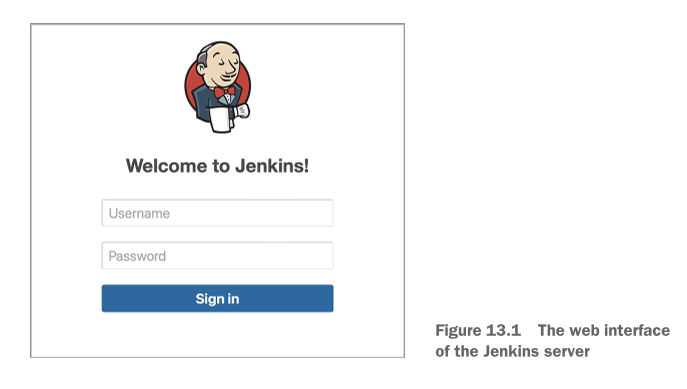
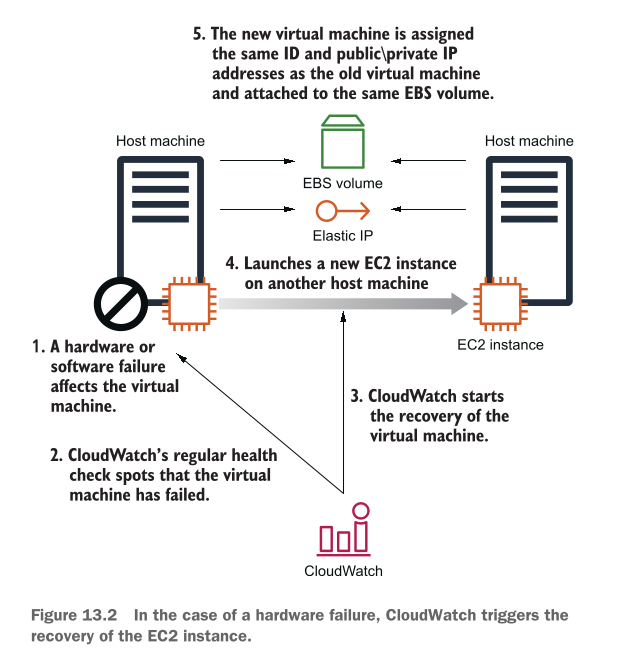
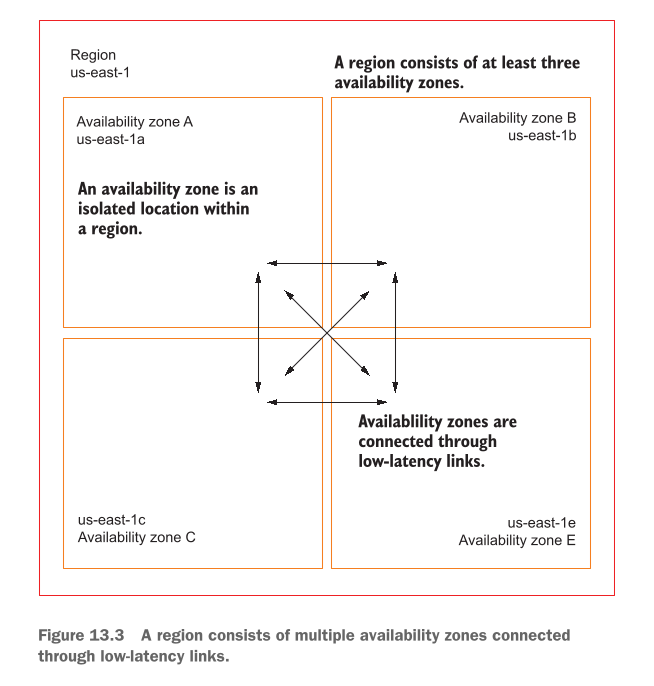
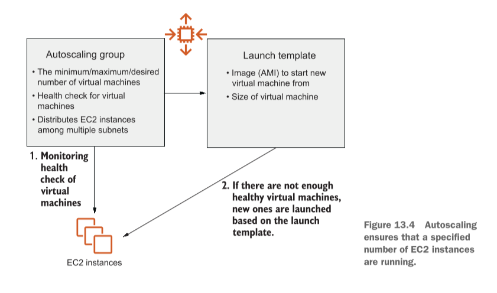

# Achieving high availability: Availability zones, autoscaling, and CloudWatch

## This chapter covers

Is chapter mein hum cloud engineering aur AWS ke sab se aham hissay ko samajhne wale hain. Writer batata hai ke is chapter mein hum char (4) mukhya (main) cheezein seekhenge:

* **CloudWatch alarm ki madad se kharab hone wali virtual machine ko dobara sahi karna (Recovering a failed virtual machine with a CloudWatch alarm):** Jab aap ki Virtual Machine (EC2 instance) kisi maslay ki wajah se band ya kharab ho jaye, toh CloudWatch naam ka chokidaar (monitoring tool) usay dekhte hi khud hi dobara restart aur recover kar deta hai.
* **Autoscaling ka istemal karke virtual machines ko lagataar chalate rehna (Using autoscaling to guarantee your virtual machines keep running):** Ek aisa automatic system banana jo hamesha yeh yakeeni banaye ke aap ki zaroorat ke mutabaq virtual machines hamesha chal rahi hain aur koi kharab ho toh usay replace kar de.
* **AWS Region mein Availability Zones ko samajhna (Understanding availability zones in an AWS region):** Yeh samajhna ke AWS ne alag alag shahron (Regions) mein bijli aur internet se azad alag alag data centers (Availability Zones) kaise banaye hain.
* **Disaster-recovery ki zarooriyat ka tajziya karna (Analyzing disaster-recovery requirements):** Jab koi bari tabahi (jaise bijli ka poora fail hona ya data center doobna) aaye, toh us se apne system ko bachane ke tareeqay samajhna.

---

### Real-World Example: Dukaan Ki Misaal (Online Shop)

Writer humein ek bohat aasan misaal se samjhata hai:

* **Purana / Kharab Tareeqah (Failure Scenario):** Farz karein aap ki internet par ek dukan (e-commerce web shop) hai jo ek computer (Virtual Machine) par chal rahi hai. Raat ke waqt jab aap so rahe hote hain, us computer ka koi hissa (hardware) kharab ho jata hai. Ab aap ki dukaan band ho gayi! Grahak (users) dukan par aate hain lekin cheezein nahi khareed paate. Woh subah hone tak 8 ghante intezar karne ke bajaye kisi doosri dukan par chale jaate hain. Yeh aap ke karobar (business) ke liye ek bohat bara nuqsan hai.
* **Naya / Aala Tareeqah (Highly Available Scenario):** Ab farz karein aap ne apna system "Highly Available" banaya hua hai. Raat ko hardware kharab hota hai, lekin **bina kisi insaan ke button dabaye**, system khud hi 2-3 minto mein samajh jata hai ke masla aaya hai. Woh kharab computer ko chor kar ek naye sahi computer par dukan ko dobara start kar deta hai. Grahak bina kisi rukawat ke khareedari jari rakhte hain!

Writer yahan ek bohat **ahem sachai** batata hai:

> **Virtual Machines (EC2 instances) by default "Highly Available" nahi hoti.** Is ka matlab hai ke agar aap khud kuch settings nahi karenge, toh cloud par bhi computer kharab ho sakta hai.

---

### Virtual Machine Kharab Hone Ki 4 Badi Wajahein (System Failure Scenarios)

Ek Virtual Machine ke band hone ya kharab hone ki writer ne 4 aasan wajahein batayi hain:

1. **Virtual Machine ke Operating System (OS) ka fail hona:** Jaise aap ke computer ki Windows ya Linux crash ho jaye (Software Problem).
2. **Main Computer (Host Machine) ke Software ka fail hona:** Jis bare asli physical computer par aap ki choti virtual machine chal rahi hai, uska apna OS ya virtualization software (Hypervisor) crash ho jaye.
3. **Physical Hardware ka tootna ya kharab hona:** Physical computer ka Processor (Compute), Hard Disk (Storage), ya Networking Wire/Card kharab ho jaye.
4. **Data Center ka fail hona:** Jis building (Data Center) mein woh computer rakha hai, wahan ki bijli (power) chali jaye, internet kat jaye, ya cooling system (ACs) band hone se computers garam ho kar band ho jayein.

---

### AWS Kya Karta Hai Aur Aap Ki Kya Zimmedari Hai?

* **Chota Masla (Small Outage):** Agar sirf ek physical computer kharab hota hai, toh AWS khud hi aap ki EC2 instance ko reboot kar ke kisi doosre sahi physical computer par chala deta hai.
* **Bara Masla (Larger Outage):** Agar poora ka poora computer rack ya data center ka hissa band ho jaye, toh AWS yeh kaam khud nahi karega! **Aap khud zimmedar hain** ke aap apne system ko auto-recovery par lagayein (CloudWatch Alarms ke zariye) ya apne kaam ko ek se zyada machines par taqseem (distribute) karein.

---

## Examples are 100% covered by the Free Tier

* **Bilkul Muft (Free Tier):** Is chapter mein jitni bhi practical misalein di gayi hain, woh AWS ke Free Tier mein aati hain. Aap ko koi paise nahi dene parenge.
* **Shart (Condition):** Shart yeh hai ke aap ne AWS ka naya account banaya ho aur is chapter ki practice khatam karne ke baad resources ko delete (clean up) kar dein. Inhein hafton tak chalte mat chhoriyega.

---

### High Availability Kya Hai? (Definition)

**High Availability (HA)** ka matlab hai ek aisa system jo **bina kisi rukawat ke lagataar chalta rahe (almost zero downtime)**. Agar koi kharabi aa bhi jaye, toh system khud hi usay theek kar le aur users ko pata bhi na chale.

Writer ne **Harvard Research Group (HRG)** ki ek standard classification batayi hai jisay **AEC-2** kehte hain:

* **99.99% Uptime:** Iska matlab hai ke poore saal (365 dino) mein aap ka system 99.99% time chalna chahiye.
* **Downtime Limit:** Poore saal mein aap ka system **zyada se zyada 52 minute aur 35.7 seconds** ke liye hi band ho sakta hai, us se zyada nahi!
* Jab aap EC2 instances ko is chapter ke tareeqon se set karenge, toh aap yeh 99.99% ka target haasil kar sakte hain bina kisi insaani madad (human intervention) ke.

---

## High availability vs. fault tolerance

In dono lafzon mein bohat barik aur ahem farq hai jisay writer ne bohat khoobsurat tareeqay se samjhaya hai:

| Feature | High Availability (HA) | Fault Tolerance (FT) |
| --- | --- | --- |
| **Aasan Misaal** | Gari ka tyre puncture ho jaye, toh gari 2 minute ke liye ruke aur automatic jack lag kar naya tyre lag jaye. | Gari ke 8 wheels hoon, agar 1 puncture ho bhi jaye toh gari bina ruke usi speed se chalti rahe. |
| **Downtime (Rukawat)** | Is mein **chota sa downtime (kuch minto ki rukawat)** aata hai jab tak system recover hota hai. | Is mein **ZERO downtime (koi rukawat nahi)** hoti. System bina ruke chalta rehta hai. |
| **Kharabi par Reaction** | Kharabi ke baad automatic recovery hoti hai. | Kharabi ke dauran bhi service mein koi farq nahi aata. |

*(Note: Fault-tolerant systems banana hum chapter 16 mein seekhenge).*

---

### AWS ke Building Blocks (HA Banane Ke Zariye)

AWS humein High Availability banane ke liye 3 mukhya tools/building blocks deta hai:

1. **Availability Zones (AZs):** Ek hi region mein alag alag, azad data centers ka istemal karna taake agar ek data center doob bhi jaye toh doosra chalta rahe.
2. **CloudWatch Monitoring & Auto-Recovery:** Virtual Machine ki sehat par nazar rakhna. Agar machine kharab ho, toh CloudWatch alarm bajaye aur auto-recovery trigger kare. *(Yeh un kaam-kaaj ke liye behtareen hai jo sirf ek hi machine par chal sakte hain)*.
3. **Autoscaling:** Yeh guarantee dena ke farz karein hamesha 3 machines chalni chahiye. Agar 1 kharab ho jaye toh Autoscaling khud hi purani ko mita kar nayi machine khari kar deta hai. *(Yeh un kaam-kaaj ke liye behtareen hai jo ek se zyada machines par taqseem ho sakte hain)*.

Is chapter ke agle hisso mein hum pehle single-machine ki auto-recovery seekhenge, phir data center outage se bachna, aur aakhir mein disaster recovery plans ko AWS architecture mein badalna seekhenge.

---

## Recovering from EC2 instance failure with CloudWatch

AWS system default taur par har kism ki kharabi par aap ki Virtual Machine (EC2 instance) ko khud se recover (thik) nahi karta. Misaal ke taur par, agar poora ka poora server rack (jahan computer rakha hai) kharab ho jaye, toh AWS aap ke EC2 instance ko khud se recover nahi karega. Is maslay ka sab se asaan hal yeh hai ke aap **CloudWatch Alarm** bana kar EC2 instance ki recovery ko automatic (swayanchalit) banayein.

---

### Real-World Scenario: Agile Team Aur Jenkins CI Server

Is concept ko samajhne ke liye writer ek real-world misaal deta hai:

* **Agile Team & Automation:** Farz karein aap ki software team **Agile development process** par kaam kar rahi hai. Kaam ko tez banane ke liye team ne faisla kiya hai ke software ki testing, building, aur deployment (server par chalane) ke kaam ko automatic kar diya jaye. Is ke liye aap ko ek **Continuous Integration (CI) Server** set karne ko kaha gaya hai.
* **Jenkins Kya Hai?** Aap ne Jenkins ko chuna hai. Jenkins ek open-source software hai jo Java mein likha gaya hai aur Apache Tomcat jaise servlet container mein chalta hai. Kyunki aap **Infrastructure as Code (IaC)** ka istemal kar rahe hain, aap apne cloud infrastructure ke changes bhi Jenkins ke zariye hi deploy karenge.
* **Jenkins Kyun Zaroori Hai? (High Availability Use Case):**
* Jenkins aap ke poore system ka ek ahem hissa hai. Agar Jenkins band ho gaya, toh aap ke saathiyan (developers) naye software ko na test kar sakenge aur na hi deploy.
* Lekin Jenkins ke mamlay mein agar kharabi ke waqt **chota sa downtime (kuch minto ki rukawat)** aaye aur system khud hi recover ho jaye, toh business ko koi bara nuqsan nahi hoga. Is liye yahan **Fault-Tolerant (zero downtime)** system ki zaroorat nahi hai, balki **High-Availability (auto recovery)** kafi hai.


* **Doosri Misaalein:** Writer batata hai ke Jenkins sirf ek misaal hai. Aap yahi tareeqah **FTP servers** ya **VPN servers** chalane ke liye bhi istemal kar sakte hain jahan thoda sa downtime bardasht kiya ja sakta hai lekin hardware fail hone par automatic recovery chahiye hoti hai.

---

### Hum Is Example Mein Kya Karenge? (3 Steps)

1. Cloud mein ek Virtual Private Network (**VPC**) banayein ge.
2. VPC ke andar ek Virtual Machine (EC2 instance) launch karenge aur computer start hote waqt (**bootstrapping**) us par automatically Jenkins install karenge.
3. Ek **CloudWatch Alarm** banayein ge jo virtual machine ki sehat (health) par nazar rakhega aur zaroorat parne par usay automatic replace / recover karega.

---

## AWS CloudWatch

**AWS CloudWatch** ek monitoring aur management service hai jo AWS resources ke metrics (performance data), events, logs, aur alarms faraham karti hai.

Is example ko chalane ke liye AWS humein ek **CloudFormation Template** deta hai.

### Stack Create Karne Ki Command

Neeche di gayi command se hum CloudFormation template chalate hain jo EC2 instance launch karta hai aur saath hi CloudWatch Alarm set karta hai:

```bash
aws cloudformation create-stack --stack-name jenkins-recovery \
  --template-url https://s3.amazonaws.com/awsinaction-code3/chapter13/recovery.yaml \
  --parameters "ParameterKey=JenkinsAdminPassword,ParameterValue=$Password" \
  --capabilities CAPABILITY_IAM

```

#### Command Ka Deep Breakdown:

* `aws cloudformation create-stack`: CloudFormation ko naya resource stack banane ka hukum deta hai.
* `--stack-name jenkins-recovery`: Is stack ka naam `jenkins-recovery` rakhta hai.
* `--template-url ...`: S3 bucket mein majood `recovery.yaml` file ka link jahan poora architecture likha hai.
* `--parameters "ParameterKey=JenkinsAdminPassword,ParameterValue=$Password"`: Jenkins ke admin password ke liye aap ka diya hua password pass karta hai (8 se 40 characters ka password `$Password` ki jagah likhna hota hai).
* `--capabilities CAPABILITY_IAM`: CloudFormation ko IAM roles/profiles banane ki ijazat deta hai.

---

### CloudFormation Template Ke Mukhya Hissay

Template ke andar 3 ahem cheezein hain:

1. Virtual Machine jiske **User Data** mein ek Bash script chal rahi hai jo machine start hote hi Jenkins install kar deti hai.
2. Ek **Public IP (Elastic IP)** address jo EC2 ko milta hai, taake agar machine kharab ho kar recover bhi ho, toh public IP change na ho.
3. Ek **CloudWatch Alarm** jo EC2 service ke system status metric ko monitor karta hai.

---

## Listing 13.1 Starting an EC2 instance using a Jenkins CI server with recovery alarm

Writer ka diya gaya CloudFormation template ka code as-it-is neeche maujood hai:

```yaml
#[...]
ElasticIP:
  Type: 'AWS::EC2::EIP' # Elastic IP address istemal karte waqt recovery ke baad public IP address wahi rehta hai
  Properties:
    InstanceId: !Ref Instance
    Domain: vpc
    DependsOn: VPCGatewayAttachment
Instance:
  Type: 'AWS::EC2::Instance' # Jenkins server chalane ke liye aik virtual machine launch karta hai
  Properties:
    ImageId: !FindInMap [RegionMap, !Ref 'AWS::Region', AMI] # AMI select karta hai (is mamlay mein, Amazon Linux)
    InstanceType: 't2.micro' # t2 instance types ke liye recovery supported hoti hai
    IamInstanceProfile: !Ref IamInstanceProfile
    NetworkInterfaces:
      - AssociatePublicIpAddress: true
        DeleteOnTermination: true
        DeviceIndex: 0
        GroupSet:
          - !Ref SecurityGroup
        SubnetId: !Ref Subnet
    UserData:
      'Fn::Base64': !Sub |
        #!/bin/bash -ex
        trap '/opt/aws/bin/cfn-signal -e 1 --stack ${AWS::StackName} \
        --resource Instance --region ${AWS::Region}' ERR
        
        # Installing Jenkins
        amazon-linux-extras enable epel=7.11 && yum -y clean metadata # Jenkins ko download aur install karta hai
        yum install -y epel-release && yum -y clean metadata
        yum install -y java-11-amazon-corretto-headless daemonize
        wget -q -T 60 http://.../jenkins-2.319.1-1.1.noarch.rpm
        rpm --install jenkins-2.319.1-1.1.noarch.rpm
        
        # Configuring Jenkins
        # ...
        
        # Starting Jenkins # Jenkins ko start karta hai
        systemctl enable jenkins.service
        systemctl start jenkins.service
        /opt/aws/bin/cfn-signal -e $? --stack ${AWS::StackName} \
        --resource Instance --region ${AWS::Region}
Tags:
  - Key: Name
    Value: 'jenkins-recovery'
CreationPolicy:
  ResourceSignal:
    Timeout: PT10M
DependsOn: VPCGatewayAttachment

```

### Listing 13.1 Ka Deep Detail Breakdown:

#### 1. `ElasticIP` Resource:

* **`Type: 'AWS::EC2::EIP'`:** Yeh AWS ko ek static (pakka) IP address allocate karne ko kehta hai.
* **`InstanceId: !Ref Instance`:** Is Static IP ko niche banaye gaye EC2 `Instance` ke sath jor (link) deta hai.
* **`Domain: vpc`:** Yeh IP VPC network ke andar istemal hoga.
* **`DependsOn: VPCGatewayAttachment`:** Jab tak Internet Gateway VPC se connect na ho jaye, tab tak IP attach na karein.

#### 2. `Instance` Resource:

* **`Type: 'AWS::EC2::Instance'`:** Virtual machine banane ka main block.
* **`ImageId: !FindInMap [...]`:** Current AWS region ke mutabaq Amazon Linux ki sahi image (AMI ID) chunata hai.
* **`InstanceType: 't2.micro'`:** Machine ka size `t2.micro` rakhta hai (jo Free Tier mein aata hai aur auto-recovery support karta hai).
* **`IamInstanceProfile`:** Instance ko AWS services se baat karne ke liye permissions role deta hai.
* **`NetworkInterfaces`:**
* `AssociatePublicIpAddress: true`: Machine ko public IP dena.
* `DeleteOnTermination: true`: Agar machine delete ho toh network interface bhi delete ho jaye.
* `GroupSet`: Security group attach karta hai.
* `SubnetId`: VPC ke kis subnet mein machine rakhni hai.


#### 3. `UserData` Script (Bootstrapping Steps):

* **`Fn::Base64`:** Code ko Base64 format mein encode karta hai kyunki EC2 User Data isi format ko samajhta hai.
* **`#!/bin/bash -ex`:** Linux ko batata hai ke yeh ek Bash script hai. `-e` ka matlab hai koi error aaye toh script foran ruk jaye, aur `-x` ka matlab har command terminal par print ho.
* **`trap '/opt/aws/bin/cfn-signal -e 1 ...' ERR`:** Agar script mein kahin bhi koi error aaye (`ERR`), toh yeh CloudFormation ko failure signal (`-e 1`) bhej dega.
* **`amazon-linux-extras enable epel=7.11 ...` & `yum install ...`:** Software packages (EPEL repository) ko enable aur update karta hai.
* **`yum install -y java-11-amazon-corretto-headless daemonize`:** Jenkins ke chalne ke liye Java 11 runtime environment install karta hai.
* **`wget ...` & `rpm --install ...`:** Official Jenkins RPM package download karke install karta hai.
* **`systemctl enable jenkins.service` & `systemctl start jenkins.service`:** Jenkins service ko background mein hamesha chalne ke liye enable aur start karta hai.
* **`/opt/aws/bin/cfn-signal -e $? ...`:** CloudFormation ko kamyabi ka signal (`-e 0`) bhejta hai ke Jenkins successfully setup ho chuka hai.

#### 4. `CreationPolicy` & `DependsOn`:

* **`Timeout: PT10M`:** CloudFormation 10 minute tak intezar karega. Agar 10 minute mein Jenkins se success signal nahi mila, toh deployment fail mani jayegi.

---

### CloudWatch Alarm Ke 3 Component Aur 3 States

CloudWatch Alarm 3 cheezon se mil kar banta hai:

1. **Metric (Paimaana):** Data ko dekhta hai (jaise CPU usage, health check).
2. **Rule (Usool):** Ek threshold (hadd) set karta hai.
3. **Actions (Action):** Agar alarm trigger ho jaye, toh kya karna hai (jaise EC2 recovery start karna).

**CloudWatch Alarm ki 3 States hoti hain:**

* **`OK`:** Sub kuch theek hai, threshold cross nahi hua.
* **`INSUFFICIENT_DATA`:** Alarm ka faisla karne ke liye kafi data maujood nahi hai.
* **`ALARM`:** Masla aa gaya hai, threshold cross ho chuka hai!

---

## Listing 13.2 Creating a CloudWatch alarm to recover a failed EC2 instanc

Neeche CloudWatch Alarm ka YAML code diya gaya hai jo underlying hardware fail hone par machine ko recover karta hai:

```yaml
RecoveryAlarm:
  Type: 'AWS::CloudWatch::Alarm' # Virtual machine ki health ko monitor karne ke liye CloudWatch alarm create karta hai
  Properties:
    AlarmDescription: 'Recover EC2 instance when underlying hardware fails.'
    Namespace: 'AWS/EC2' # Monitor kiya jane wala metric EC2 service ki taraf se namespace AWS/EC2 ke sath provide kiya jata hai
    MetricName: 'StatusCheckFailed_System' # Metric ka naam
    Statistic: Maximum # Metric par apply hone wala statistical function. Minimum ka maqsad agar aik bhi status check fail ho jaye toh aap ko notify karna hai
    Period: 60 # Woh duration jis ke liye statistical function apply hota hai, seconds mein. 60 ka multiple hona lazmi hai
    EvaluationPeriods: 5 # Woh time periods ki tadad jin par data ko threshold ke sath compare kiya jata hai
    ComparisonOperator: GreaterThanThreshold # Statistical function ke output ko threshold ke sath compare karne ke liye operator
    Threshold: 0 # Woh threshold jo alarm trigger karta hai
    AlarmActions:
      - !Sub 'arn:aws:automate:${AWS::Region}:ec2:recover' # Alarm ki soorat mein perform kiye jane wala action. EC2 instances ke liye predefined recovery action ka istemal karta hai
    Dimensions:
      - Name: InstanceId # Virtual machine metric ka aik dimension hai
        Value: !Ref Instance

```

### Listing 13.2 Ka Deep Detail Breakdown:

* **`Namespace: 'AWS/EC2'`:** CloudWatch mein metrics alag alag category (Namespace) mein hote hain. EC2 se mutalliq status checks `AWS/EC2` namespace mein aate hain.
* **`MetricName: 'StatusCheckFailed_System'`:** Yeh sab se ahem metric hai. EC2 service har minute physical host hardware, network, aur power ko check karti hai. Agar check fail ho jaye, toh value `1` recorded hoti hai, warna `0`.
* **`Statistic: Maximum`:** Data par Maximum ka formula lagaya jata hai taake agar 60 seconds mein ek baar bhi `1` (failure) aaye, toh maximum value `1` hi count ho.
* **`Period: 60`:** Har 60 seconds (1 minute) ka ek time slot/period hoga.
* **`EvaluationPeriods: 5`:** Alarm pichle **5 consecutive periods (yaani lagataar 5 minute)** ke data ko check karega.
* **`ComparisonOperator: GreaterThanThreshold` & `Threshold: 0`:** Agar 5 minute tak value threshold (`0`) se badi rahi (yaani value `1` rahi), toh iska matlab hai ke system lagataar 5 minute se fail hai.
* **`AlarmActions` (`arn:aws:automate:${AWS::Region}:ec2:recover`):** Jab alarm state `ALARM` mein badalti hai, toh AWS ka built-in EC2 recovery action trigger hota hai jo kharab computer se Virtual Machine ko hata kar naye physical computer par shuru kar deta hai.
* **`Dimensions` (`InstanceId`):** Alarm ko batata hai ke specifically kis EC2 `Instance` ko monitor karna hai.

---

### Stack Outputs Check Karne Ki Command

Stack complete hone ke baad output dekhne ke liye yeh command chalaayein:

```bash
aws cloudformation describe-stacks --stack-name jenkins-recovery \
  --query "Stacks[0].Outputs"

```

#### JSON Output:

```json
[
  {
    "Description": "URL to access web interface of Jenkins server.",
    "OutputKey": "JenkinsURL",
    "OutputValue": "http://54.152.240.91:8080"
  },
  {
    "Description": "Administrator user for Jenkins.",
    "OutputKey": "User",
    "OutputValue": "admin"
  },
  {
    "Description": "Password for Jenkins administrator user.",
    "OutputKey": "Password",
    "OutputValue": "*********"
  }
]

```

* `JenkinsURL`: Browser mein Jenkins kholne ke liye Public IP aur Port `8080` (e.g., `[http://54.152.240.91:8080](http://54.152.240.91:8080)`).
* `User`: Login karne ke liye username (`admin`).
* `Password`: Stack banate waqt aap ne jo password dia tha.

---

### Figure 13.1 Analysis & Jenkins Project Setup Steps

Referencing **Figure 13.1** (`image_c20459.png`):

<div align="center">
  
</div>

**Figure 13.1** mein Jenkins ka standard login form dikhaya gaya hai jahan top par Jenkins butler logo, "Welcome to Jenkins!" ki heading, Username aur Password ke input fields, aur blue rang ka "Sign in" button hai.

#### Jenkins Project Banane Ke 8 Steps:

1. Browser mein `http://$PublicIP:8080` kholein (`$PublicIP` ki jagah apna Elastic IP likhein).
2. User `admin` aur apna password daal kar log in karein (**Figure 13.1** ke mutabaq).
3. **Install Suggested Plugins** par click karein.
4. Jenkins URL ko default rehne dein aur **Save and Finish** par click karein.
5. **Start Using Jenkins** par click karein.
6. Naya project banane ke liye **New Item** par click karein.
7. Project ka naam **AWS in Action** type karein.
8. Job type mein **Freestyle Project** select karein aur **OK** daba dein.

#### Machine Recover Hone Par Data Kyun Nahi Khota?

* **Elastic IP:** Machine replace hone par bhi IP address wahi rehta hai kyunki Elastic IP fixed hoti hai.
* **EBS Volume:** Jenkins ka sara data (jobs, configuration) EBS Volume (cloud hard disk) mein save hota hai. Jab nayi machine banti hai, toh wahi EBS volume naye EC2 se jor diya jata hai.
* **Limitation Note:** Aap is recovery process ko khud manual test nahi kar sakte kyunki host system hardware ko sirf AWS control karta hai.

---

## How does a CloudWatch alarm recover an EC2 instance?

EC2 service har minute Virtual Machines ka status check karti hai. System status check batata hai ke physical hardware, network connectivity, power, ya host OS mein koi kharabi toh nahi aayi.

Referencing **Figure 13.2** (`image_c203e3.png`):

<div align="center">
  
</div>

**Figure 13.2** batata hai ke jab koi hardware fail hota hai toh recovery process step-by-step kaise kaam karta hai:

1. **Physical Hardware Fail:** Physical host computer par hardware ya software crash hota hai, jisse EC2 instance fail ho jata hai.
2. **CloudWatch Metric Update:** EC2 status check system kharabi ko detect karta hai aur `AWS/EC2` namespace ke `StatusCheckFailed_System` metric mein `1` send karta hai.
3. **CloudWatch Alarm Trigger:** Lagataar 5 minute tak checks fail hone par CloudWatch Alarm active (`ALARM` state) hota hai aur Built-in EC2 Recovery Action trigger kar deta hai.
4. **Launch on New Host:** AWS isi EC2 instance ko bilkul naye physical host computer par launch/restart kar deta hai.
5. **Re-attaching Assets:** Naya EC2 instance purane same Instance ID, Same Private IP, Same Elastic IP (Public IP), aur Same EBS Volume (Storage Disk) ke saath attach ho jata hai. Is waja se koi data ya configuration zaya (lost) nahi hoti!

---

## Requirements for recovering EC2 instances

Agar aap chahte hain ke aap ka EC2 instance CloudWatch Alarm se recover ho sake, toh us ke liye **3 shartain (requirements)** pori hona lazmi hain:

1. **VPC Network:** Instance laazmi taur par Virtual Private Cloud (VPC) network ke andar chal raha ho.
2. **Supported Instance Families:** Instance type niche di gayi families mein se honi chahiye:
* A1, C3, C4, C5, C5a, C5n, C6g, C6gn, Inf1, C6i, M3, M4, M5, M5a, M5n, M5zn, M6g, M6i, P3, R3, R4, R5, R5a, R5b, R5n, R6g, R6i, T2, T3, T3a, T4g, X1, ya X1e.
*(Inke ilawa doosri instance families auto-recovery support nahi karti).*


3. **Only EBS Volumes:** EC2 instance mein sirf **EBS Volumes** ka istemal hona chahiye. Agar instance mein local disks (**Instance Store**) hongi, toh recovery support nahi hogi kyunki physical machine fail hone par Instance Store ka data hamesha ke liye khatam ho jata hai.

---

## Cleaning up

Apne AWS account ko extra charges (paise katne) se bachane ke liye practice khatam hone par niche di gayi commands se banaye gaye tamam resources ko delete kar dein:

```bash
aws cloudformation delete-stack --stack-name jenkins-recovery
aws cloudformation wait stack-delete-complete --stack-name jenkins-recovery

```

* `delete-stack`: CloudFormation stack aur uske tamam resources (EC2, Elastic IP, CloudWatch Alarm, VPC components) ko delete karna shuru karta hai.
* `wait stack-delete-complete`: Terminal ko roke rakhta hai jab tak poora stack mukammal taur par delete na ho jaye.

---

### Important Limitation (Badi Had/Rukawat)

Is tareeqay (CloudWatch Alarm Auto-Recovery) mein ek bohat ahem limitation hai:

> **CloudWatch Alarm kharab hone wali Virtual Machine ko sirf usi exact Availability Zone (AZ) / Data Center ke andar recover kar sakta hai.**

Agar poora ka poora Availability Zone ya Data Center hi doob jaye / fail ho jaye, toh aap ka Jenkins server aur Virtual Machine recover nahi ho sake gi aur service band ho jayegi. Is maslay ko hal karne ke liye hum agle section mein multi-AZ setup seekhenge.


----

## Recovering from a data center outage with an Auto Scaling group

Pichle section mein hum ne dekha tha ke agar Virtual Machine ka hardware ya software fail ho jaye, toh system status checks aur CloudWatch Alarm ki madad se hum usay recover kar sakte hain. Lekin sochein agar **poora ka poora Data Center hi band ho jaye** (jaise bijli chali jaye, aag lag jaye, ya koi qudrati aafat aa jaye)?

Puraana recovery method yahan **fail** ho jayega! Kyunki CloudWatch Alarm us Virtual Machine ko usi same data center mein dobara launch karne ki koshish karta hai jo pehle se kharab ho chuka hai.

AWS ko is tarah design kiya gaya hai ke agar poora data center bhi baith jaye, tab bhi aap ka system chalta rahe. Is ke liye AWS Regions ke andar multiple Data Centers hote hain jinhein **Availability Zones (AZs)** kaha jata hai. Agar aap apna kaam (workload) ek se zyada Availability Zones par taqseem (distribute) kar dein, toh aap poore data center ke fail hone par bhi bach sakte hain.

### Multi-AZ Setup Ki 2 Badi Mushkilein (Pitfalls)

Jab hum ek se zyada Availability Zones mein apna system banate hain, toh 2 bari mushkilein samne aati hain:

1. **EBS Data Access Problem:** Network-attached storage (EBS Volume) par save kiya gaya data doosre Availability Zone mein switch hote hi default taur par available nahi hota. Jab tak purana Availability Zone wapas sahi nahi hota, aap ka data EBS volume par mehfooz toh rehta hai lekin aap usay use nahi kar sakte.
2. **IP Address Change Problem:** Aap naye Availability Zone mein purane same **Private IP address** ke sath machine start nahi kar sakte. Wajah yeh hai ke Network Subnets hamesha kisi ek AZ ke sath munsalik (bound) hote hain aur har subnet ka apna IP range hota hai. Is ke ilawa aap ka **Public IP address** bhi automatic purane wala nahi rehta.

Is section mein hum pichle Jenkins setup ko behtar banayein ge taake woh poore Availability Zone ke fail hone par bhi recover ho sake, aur baad mein in dono pitfalls ka hal bhi dekhenge.

---

## Availability zones: Groups of isolated data centers

AWS ke duniya bhar mein mukhtalif muqamaat par **Regions** bane hue hain. Misaal ke taur par US East (N. Virginia) region, jisay `us-east-1` kaha jata hai. Poori duniya mein AWS ke 23 se zyada public regions maujood hain.

Har Region ke andar **multiple Availability Zones (AZs)** hote hain.

* Aap ek AZ ko **azad data centers ka ek giroh (isolated group of data centers)** samajh sakte hain.
* Region woh bara ilaqah hota hai jahan yeh AZs ek doosre se munasib fasle par waqay hote hain.
* Misaal ke taur par, `us-east-1` region mein 6 Availability Zones hain (`us-east-1a` se `us-east-1f` tak).
* Ek AZ ke andar ek data center bhi ho sakta hai ya ek se zyada bhi. AWS ne apne data centers ki confidential detail kabhi public nahi ki.

### Network Connectivity Aur Speed

* Tamam AZs ek doosre ke sath **bohat tez aur low-latency fiber links** se jure hote hain. Is liye do AZs ke darmeyan request bhejna internet jitna sust nahi hota.
* Ek hi AZ ke andar (ek EC2 se doosri EC2) ki speed/latency sab se tez hoti hai.
* AWS har Region mein kam se kam **3 ya us se zyada Availability Zones** deta hai.
* **Kharach (Cost Note):** AWS do alag AZs ke darmeyan hone wale network traffic par **$0.01 per GB** charge karta hai.

---

### Figure 13.3 Analysis

Referencing **Figure 13.3** (`image_c1fcf6.png`):

<div align="center">
  
</div>

**Figure 13.3** mein AWS Region aur Availability Zones ka mazaajah (structure) dikhaya gaya hai:

* Bahar wala bara box **Region `us-east-1**` ko zahir karta hai.
* Is Region ke andar 4 alag alag boxes **Availability Zones** (`us-east-1a`, `us-east-1b`, `us-east-1c`, `us-east-1e`) ko darshate hain.
* Center mein bane arrows batate hain ke yeh tamam AZs aapas mein high-speed **low-latency links** ke zariye jure hue hain.

---

## Recovering a failed virtual machine to another availability zone with the help of autoscaling

Pehle section mein hum ne dekha ke CloudWatch Alarm se machine usi same AZ mein recover hoti thi kyunki Private IP aur EBS volume ek hi subnet/AZ se jure hote hain. Lekin agar poora AZ hi baith jaye, toh humein ek aisa tool chahiye jo virtual machine ko **doosre Availability Zone mein recover** kar sake.

Yeh kaam **Auto Scaling** ke zariye hota hai.

### Auto Scaling Kya Hai?

Auto Scaling EC2 service ka ek hissa hai. Iska kaam yeh guarantee dena hai ke aap ki batayi hui tadad ke mutabaq EC2 instances hamesha chalte rahein, chahe koi poora Availability Zone hi kyun na kharab ho jaye. Agar original instance fail hota hai, toh Auto Scaling doosre Availability Zone ke subnet mein naya instance launch kar deta hai.

### CloudFormation Stack Create Karne Ki Command

Command chala kar Multi-AZ setup create karein ($Password ki jagah apna password likhein):

```bash
aws cloudformation create-stack --stack-name jenkins-multiaz \
  --template-url https://s3.amazonaws.com/awsinaction-code3/chapter13/multiaz.yaml \
  --parameters "ParameterKey=JenkinsAdminPassword,ParameterValue=$Password" \
  --capabilities CAPABILITY_IAM

```

#### Command Breakdown:

* `aws cloudformation create-stack`: Naya CloudFormation stack banata hai.
* `--stack-name jenkins-multiaz`: Stack ka naam `jenkins-multiaz` rakhta hai.
* `--template-url ...`: S3 par rakhi hui `multiaz.yaml` file ka link.
* `--parameters ...`: Jenkins admin password set karta hai.
* `--capabilities CAPABILITY_IAM`: CloudFormation ko IAM roles/permissions banane ki permission deta hai.

---

### Auto Scaling Ke 2 Main Components

Auto Scaling ko chalane ke liye 2 cheezein configure karni padti hain:

1. **Launch Template:** Yeh EC2 instance ka blueprint (naksha) hota hai. Is mein likha hota hai ke konsi AMI image use karni hai, machine ka size (Instance Type) kya hoga, security groups aur UserData script kya hogi.
2. **Auto Scaling Group (ASG):** Yeh rules set karta hai ke kitni virtual machines chalani hain, inhein monitor kaise karna hai, aur inhein **kins subnets/AZs** mein launch karna hai.

---

### Figure 13.4 Analysis

Referencing **Figure 13.4** (`image_c1fc7a.png`):

<div align="center">
  
</div>

**Figure 13.4** batata hai ke Auto Scaling kaise kaam karta hai:

1. **Monitoring:** Auto Scaling Group chalte hue EC2 instances ki sehat (health check) ko continuously dekhta rehta hai.
2. **Auto Replacement:** Agar koi instance fail ho jaye ya kam ho jaye, toh Auto Scaling Group **Launch Template** ke blueprint ko istemal kar ke naya EC2 instance automatically launch kar deta hai.

---

### Table 13.1 Required parameters for the launch template and Auto Scaling group

| Context | Property | Description (Roman Urdu) | Values (Roman Urdu) |
| --- | --- | --- | --- |
| **LaunchTemplate** | `ImageId` | Woh AMI ID jis se virtual machine shuru ki jani chahiye. | Aap ke account se accessible koi bhi AMI ID. |
| **LaunchTemplate** | `InstanceType` | Virtual machine ka size. | Tamam available instance sizes, jaise t2.micro, m3.medium, aur c3.large. |
| **LaunchTemplate** | `SecurityGroupIds` | EC2 instance ke liye security groups ko reference karta hai. | Isi VPC se talluq rakhne wala koi bhi security group. |
| **LaunchTemplate** | `UserData` | Jenkins CI server install karne ke liye bootstrap ke dauran chalne wali script. | Koi bhi bash script. |
| **AutoScalingGroup** | `MinSize` | DesiredCapacity ke liye minimum value. | Koi bhi positive integer—agar aap launch template ki buniyad par aik single virtual machine shuru karna chahte hain toh 1 istemal karein. |
| **AutoScalingGroup** | `MaxSize` | DesiredCapacity ke liye maximum value. | Koi bhi positive integer (jo MinSize value se bara ya barabar ho); agar aap launch template ki buniyad par aik single virtual machine shuru karna chahte hain toh 1 istemal karein. |
| **AutoScalingGroup** | `VPCZoneIdentifier` | Woh subnet IDs jin mein aap virtual machines shuru karna chahte hain. | Aap ke account ke kisi VPC ki koi bhi subnet ID. Subnets ka aik hi VPC se talluq hona lazmi hai. |
| **AutoScalingGroup** | `HealthCheckType` | Nakam virtual machines ki shanakht ke liye istemal hone wala health check. Agar health check fail ho jaye, toh Auto Scaling group virtual machine ko nayi se replace kar deta hai. | Virtual machine ke status checks istemal karne ke liye `EC2`, ya load balancer ka health check istemal karne ke liye `ELB` (chapter 16 dekhein). |

#### Single EC2 Aur Launch Template Mein Bada Farq:

Single EC2 instance mein Subnet ID instance ke andar define hoti thi. Lekin Launch Template mein Subnet **define nahi hota**; Subnets ki list Auto Scaling Group ke `VPCZoneIdentifier` mein di jaati hai taake ASG faisla kar sake ke machine kis AZ/Subnet mein chalani hai.

Kyunki humein sirf **ek hi machine** chalani hai, hum ne `MinSize: 1` aur `MaxSize: 1` set kiya hai.

---

## Listing 13.3 Launching a Jenkins virtual machine with autoscaling in two AZs

Neeche Multi-AZ Auto Scaling ka CloudFormation YAML code diya gaya hai:

```yaml
# [...]
LaunchTemplate:
  Type: 'AWS::EC2::LaunchTemplate' # Auto Scaling group jab EC2 instance launch karta hai toh yeh blueprint istemal karta hai
  Properties:
    LaunchTemplateData:
      IamInstanceProfile:
        Name: !Ref IamInstanceProfile # Session Manager ke liye access dene ke liye EC2 instance ke sath IAM role attach karta hai
      ImageId: !FindInMap [RegionMap, !Ref 'AWS::Region', AMI] # AMI select karta hai (is mamlay mein, Amazon Linux 2)
      Monitoring:
        Enabled: false # By default, EC2 har paanch minute baad CloudWatch ko metrics bhejta hai. Aap additional cost par har minute metrics hasil karne ke liye detailed instance monitoring enable kar sakte hain.
      InstanceType: 't2.micro' # Virtual machine ke liye instance type
      NetworkInterfaces:
        - AssociatePublicIpAddress: true # Instance launch karte waqt public IP address associate karta hai
          DeleteOnTermination: true
          DeviceIndex: 0
          Groups:
            - !Ref SecurityGroup # Instance par port 8080 par ingress ki ijazat dene wala security group attach karta hai
          SubnetId: !Ref Subnet # EC2 instance ki network interface (ENI) ko configure karta hai
      UserData:
        'Fn::Base64': !Sub |
          #!/bin/bash -ex
          trap '/opt/aws/bin/cfn-signal -e 1 --stack ${AWS::StackName} \
          --resource AutoScalingGroup --region ${AWS::Region}' ERR
          
          # Installing Jenkins
          amazon-linux-extras enable epel=7.11 && yum -y clean metadata
          yum install -y epel-release && yum -y clean metadata
          yum install -y java-11-amazon-corretto-headless daemonize
          wget -q -T 60 http://ftp-chi.osuosl.org/pub/jenkins/redhat-stable/jenkins-2.319.1-1.1.noarch.rpm
          rpm --install jenkins-2.319.1-1.1.noarch.rpm

          # Configuring Jenkins
          # [...]

          # Starting Jenkins
          systemctl enable jenkins.service
          systemctl start jenkins.service
          /opt/aws/bin/cfn-signal -e $? --stack ${AWS::StackName} \
          --resource AutoScalingGroup --region ${AWS::Region}
AutoScalingGroup:
  Type: 'AWS::AutoScaling::AutoScalingGroup' # Auto Scaling group jo virtual machine launch karne ki zimmedar hoti hai
  Properties:
    LaunchTemplate:
      LaunchTemplateId: !Ref LaunchTemplate # Launch template ko refer karta hai
      Version: !GetAtt 'LaunchTemplate.LatestVersionNumber'
    Tags:
      - Key: Name
        Value: 'jenkins-multiaz'
        PropagateAtLaunch: true # Yeh tags Auto Scaling group ke sath sath Auto Scaling group ke zariye launch hone wale tamam EC2 instances par bhi add kar deta hai
    MinSize: 1 # EC2 instances ki kam se kam tadad
    MaxSize: 1 # EC2 instances ki ziyada se ziyada tadad
    VPCZoneIdentifier:
      - !Ref SubnetA # Virtual machines ko subnet A (availability zone A mein create kiya gaya) aur subnet B mein launch karta hai
      - !Ref SubnetB
    HealthCheckGracePeriod: 600 # Naye launch hone wale instance ke health check ko consider karne se pehle 10 minute intezar karta hai
    HealthCheckType: EC2 # Virtual machine ke sath masail daryaft karne ke liye EC2 service ke internal health check ka istemal karta hai
    # [...]

```

### Listing 13.3 Ka Deep Detail Breakdown:

#### 1. `LaunchTemplate` Resource:

* **`Type: 'AWS::EC2::LaunchTemplate'`:** Machine ka master blueprint banata hai.
* **`IamInstanceProfile`:** EC2 instance par AWS SSM Session Manager chalane ke liye permissions deta hai.
* **`Monitoring: Enabled: false`:** Basic monitoring (har 5 minute baad metrics) enable rehti hai. Agar `true` karte toh extra paise de kar 1 minute wali detailed monitoring milti.
* **`InstanceType: 't2.micro'`:** Free tier support karne wala instance size.
* **`UserData` (Script Execution):**
* `trap ... ERR`: Koi error aane par AutoScalingGroup ko failure signal bhejta hai.
* `amazon-linux-extras` & `yum`: EPEL repository, Java 11 Corretto, aur daemonize tools install karta hai.
* `wget ...` & `rpm --install`: Jenkins redhat-stable RPM package download karke install karta hai.
* `systemctl enable & start`: Jenkins service ko background mein hamesha ke liye chala deta hai.
* `/opt/aws/bin/cfn-signal`: CloudFormation ko batata hai ke machine aur Jenkins successfully tayyar hain.


#### 2. `AutoScalingGroup` Resource:

* **`Type: 'AWS::AutoScaling::AutoScalingGroup'`:** Auto Scaling controller.
* **`LaunchTemplateId` & `Version`:** Upar wale Launch Template ka latest version jortay hain.
* **`PropagateAtLaunch: true`:** Tag `Name: jenkins-multiaz` Auto Scaling Group ke sath sath uske zariye banne wale har EC2 instance par bhi lag jata hai.
* **`MinSize: 1` & `MaxSize: 1`:** Yakeeni banata hai ke exact **1 machine** chal rahi ho.
* **`VPCZoneIdentifier` (`SubnetA`, `SubnetB`):** Yeh sab se ahem hissa hai! Yeh ASG ko **do alag alag Availability Zones (Subnet A aur Subnet B)** ke subnets deta hai. Agar Subnet A / AZ A baith jaye, toh ASG foran Subnet B / AZ B mein machine shuru kar dega.
* **`HealthCheckGracePeriod: 600`:** Nayi machine ko start aur Jenkins install hone ke liye 600 seconds (10 minute) ka waqt deta hai. 10 minute se pehle ASG usay kharab declare karke terminate nahi karega.
* **`HealthCheckType: EC2`:** EC2 ke internal status check monitoring ka istemal karta hai.

---

## Testing Auto Scaling Recovery & Verification Commands

### 1. Instance Detail Check Karne Ki Command

Command chala kar EC2 instance ki Public IP, Private IP, aur Subnet ID dekhein:

```bash
aws ec2 describe-instances --filters "Name=tag:Name,Values=jenkins-multiaz" "Name=instance-state-code,Values=16" \
  --query "Reservations[0].Instances[0].[InstanceId, PublicIpAddress, PrivateIpAddress, SubnetId]"

```

#### Expected Output (Pehli Machine):

```json
[
    "i-0cff527cda42afbcc", 
    "34.235.131.229",     
    "172.31.38.173",     
    "subnet-28933375"    
]

```

* **Instance ID:** `i-0cff527cda42afbcc`
* **Public IP:** `34.235.131.229`
* **Private IP:** `172.31.38.173`
* **Subnet ID:** `subnet-28933375`

Aap browser mein `[http://34.235.131.229:8080](http://34.235.131.229:8080)` khol kar Jenkins chalte hue dekh sakte hain.

---

### 2. Failure Simulation (Machine Discard Karna)

Aap manual machine terminate kar ke Auto Scaling recovery test karein ($InstanceId ki jagah apni instance ID likhein):

```bash
aws ec2 terminate-instances --instance-ids $InstanceId

```

Kuch minto baad Auto Scaling Group detect karega ke machine khatam ho chuki hai aur naye Subnet/AZ mein nayi machine khari kar dega.

---

### 3. Verification Command (Nayi Machine)

Dobara describe-instances command chalaayein:

```bash
aws ec2 describe-instances --filters "Name=tag:Name,Values=jenkins-multiaz" "Name=instance-state-code,Values=16" \
  --query "Reservations[0].Instances[0].[InstanceId, PublicIpAddress, PrivateIpAddress, SubnetId]"

```

#### Expected Output (Nayi Recovered Machine):

```json
[
 "i-0293522fad287bdd4",
 "52.3.222.162",
 "172.31.37.78",
 "subnet-45b8c921"
]

```

#### Result Analysis:

Nayi machine bante hi har cheez badal gayi:

1. **Instance ID:** `i-0293522fad287bdd4` (Badal gayi)
2. **Public IP:** `52.3.222.162` (Badal gayi)
3. **Private IP:** `172.31.37.78` (Badal gayi)
4. **Subnet ID:** `subnet-45b8c921` (Doosre AZ/Subnet mein chali gayi)

---

### Multi-AZ Auto Scaling Ke 2 Bade Maslay (Drawbacks)

Bhalay hum ne High Availability haasil kar li hai, lekin is setup mein 2 bade maslay hain:

1. **Data Loss (Data Ka Zaya Hona):** Jenkins ka data local disk par save hota hai. Jab purani machine delete ho kar nayi machine banti hai, toh ek **naya blank disk** lagta hai aur purana sara data zaya ho jata hai.
2. **IP Endpoint Change:** Recover hone ke baad Public aur Private IP badal jaata hai. Purana URL kaam karna chor deta hai.

---

## Cleaning up

Extra charges se bachane ke liye stack ko delete karein:

```bash
aws cloudformation delete-stack --stack-name jenkins-multiaz
aws cloudformation wait stack-delete-complete --stack-name jenkins-multiaz

```

* `delete-stack`: Multi-AZ Auto Scaling group, launch template, aur EC2 instances ko delete karna shuru karta hai.
* `wait stack-delete-complete`: Deletion poori hone tak terminal ko hold rakhta hai.


----


