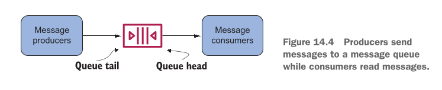
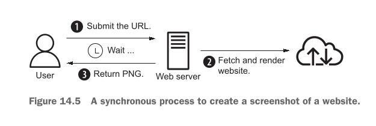
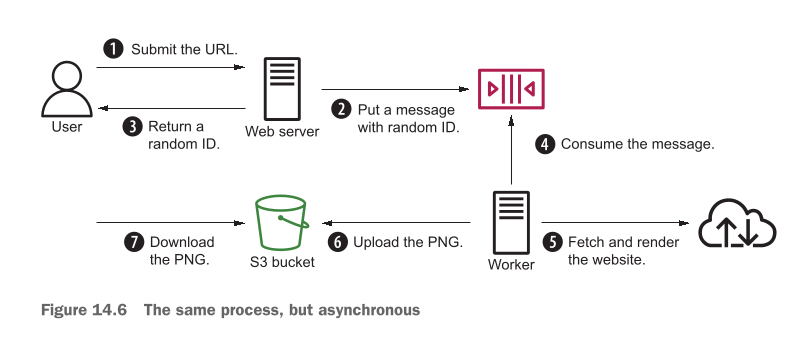
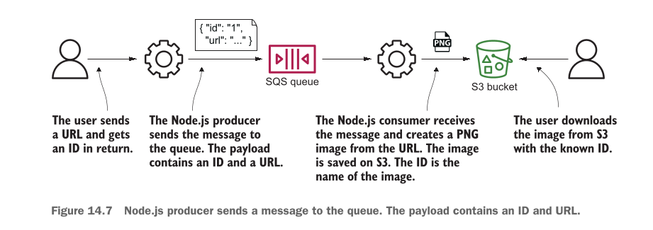

# Decoupling your infrastructure: Elastic Load Balancing and Simple Queue Service

## This chapter covers

Is chapter mein hum chaar (4) main cheezein seekhenge:

* **System ko decouple karne ki wajohat (The reasons for decoupling a system):** Software ke alag-alag hisson ko ek doosre par zyaada dependent (joda hua) na rakhne ke fayde.
* **Load balancers ke sath synchronous decoupling (Synchronous decoupling with load balancers to distribute requests):** Incoming user traffic ko alag-alag backend servers par barabar baantna taake kisi ek server par zyaada bojh na pare.
* **Backend ko users aur message producers se chupana (Hiding your backend from users and message producers):** Security aur flexibility ke liye andar ke servers ko bahar ki dunya se chupana.
* **Message queues ke sath asynchronous decoupling (Asynchronous decoupling with message queues to buffer message peaks):** Jab ek sath hazaron-lakhon requests aayein, toh unhein ek "queue" (line) mein jama karke flexible tarike se process karna.

---

### Real-World Example: Meeting in a Café (Tightly Coupled System)

Writer humein Decoupling ka concept samjhane ke liye ek bohot hi pyari real-world example deta hai:

Maan lijiye aap writer se AWS ke baare mein kuch mashwara (advice) lene ke liye ek café mein milne ka plan banate hain. Is meeting ko safal (successful) banane ke liye 3 shartein zaroori hain:

1. Aap aur writer **dono ek hi waqt par free hon** (Be available at the same time).
2. Aap aur writer **dono ek hi jagah par majood hon** (Be at the same place).
3. Aap dono ek doosre ko **café mein dhoond lein** (Find each other at the café) — jaise writer ke kaale baal hain aur usne white shirt pehni hui hai.

**Is meeting ka masala (Problem):**
Ye meeting **location (jagah)** aur **time (waqt)** ke sath **tightly coupled** (bohot sakhti se judi hui) hai. Agar writer Germany mein rehta hai aur aap Pakistan mein, toh jagah ki is sakht shart ki wajah se meeting hona taqreeban namumkin ho jayegi!

---

### Solution 1: Synchronous Decoupling (Google Hangouts / Video Call)

Ab hum jagah (location) ki shart ko khatam kar dete hain aur milne ka plan change karke **Google Hangouts ya Video Call** par shift ho jaate hain.

Ab meeting ke liye sirf 2 cheezon ki zaroorat hai:

1. Dono ka **ek hi waqt par online hona** (Be available at the same time).
2. Ek doosre ko **Google Hangouts / Skype par dhoondna** (Find each other via ID).

> **Concept:** Google Hangouts ya Video call **Synchronous Decoupling** karti hai. Isne **jagah (Location)** ki zaroorat ko toh khatam kar diya (aap Pakistan mein hon aur writer Germany mein, koi farq nahi padta), lekin **waqt (Time)** ki shart abhi bhi baqi hai — dono ko 3 baje ek sath online aana hi parega.

---

### Solution 2: Asynchronous Decoupling (Email)

Ab hum waqt (time) ki shart ko bhi khatam kar dete hain aur **Email** ka istemal karte hain.

Ab meeting ke liye sirf 1 cheez zaroori hai:

1. Ek doosre ko **Email address par dhoondna** (Find each other via email).

> **Concept:** Email **Asynchronous Decoupling** karti hai. Yahan jagah (location) aur waqt (time) **dono se azaadi** mil jaati hai. Aap raat ke 2 baje email bhej sakte hain jab writer so raha ho, aur writer agle din jaag kar aamne-saamne aaye bagair apna jawab bhej sakta hai.

---

## Decoupling in Software Systems

Bilkul insani meeting ki tarah, software systems mein bhi components aapas mein **tightly coupled** hote hain. Writer do bari misalein deta hai:

1. **Public IP Address ka Tightly Coupled hona:**
* *Problem:* Jaise Café ki location fix thi, waise hi kisi web server tak pohochne ke liye client ko server ka Public IP address pata hona chahiye. Agar aap wo IP address badalte hain, toh client ka connection toot jayega. IP address aur server aapas mein sakhti se jude hue (tightly coupled) hain.


2. **Server ke Online hone par Tightly Coupled hona:**
* *Problem:* Client jab bhi request bhejega, server ko **usi exact waqt par online aur working** hona chahiye. Agar server update ho raha hai, crash ho gaya hai, ya hardware fail ho gaya hai, toh client ki request reject ho jayegi.


Is masala ko hal karne ke liye AWS do tarah ki decoupling services deta hai:

---

### 1. AWS Synchronous Decoupling: Elastic Load Balancing (ELB)

* **Kab use hota hai?** Jab client ko **fawran jawab (immediate response)** chahiye ho. For example, jab koi user browser mein website open karta hai, toh wo chahta hai ke ek second ke andar HTML page load ho jaye.
* **Kaise kaam karta hai?** Client aur Web Servers ke beech mein ek **Elastic Load Balancer (ELB)** baith jata hai.
* Client apni request **server ko nahi, balki ELB ko bhejta hai**.
* ELB us request ko peeche majood kisi bhi chalte hue Virtual Machine (EC2 Instance) ko forward kar deta hai.
* **Fayda:** Client ko andar ke servers ka IP address janne ki zaroorat nahi hoti. Client sirf ELB ko jaanta hai. Agar peeche koi ek server kharab bhi ho jaye, toh ELB request ko doosre sahi server par bhej deta hai — user ko pata bhi nahi chalta!

*(Note: Modern 2026 AWS cloud environments mein hum ELB ki modern types jaise Application Load Balancer (ALB) microservices ke liye aur Network Load Balancer (NLB) ultra-high performance ke liye use karte hain).*

---

### 2. AWS Asynchronous Decoupling: Simple Queue Service (SQS)

* **Kab use hota hai?** Jab client ko **fawran jawab ki zaroorat na ho**. For example, jab user koi badi pic/image upload karta hai, toh website user ko fawran bata deti hai "Image Received", aur background mein us image ko crop ya resize karne ka kaam chalta rehta hai.
* **Kaise kaam karta hai?** AWS ki service **SQS (Simple Queue Service)** ek message queue (chithiyon ka dabba/line) deti hai.
* **Producer** (request bhejne wala) apna message queue mein daal deta hai.
* **Receiver** (kam karne wala server) apni marzi aur speed se queue se message uthata hai aur us par kaam karta hai.

---

## Examples are 100% covered by the Free Tier

Writer yahan ek bohot achi khushkhabri deta hai ke is chapter mein jitne bhi practical kaam aur examples bataye jayenge, wo AWS ke **Free Tier** mein 100% free aate hain.

* **Shart:** Aapko koi extra charges nahi lagenge, jab tak aap in examples ko kuch dino se zyaada chalata na chhor dein.
* **Rule:** Ye tabhi apply hota hai agar aapne book ke liye naya AWS account banaya ho. Chapter khatam karne ke baad sabhi banaye hue resources ko **Clean up (delete)** karna zaroori hai.

---

## NOTE

> **Prerequisite:** Is chapter ke concepts ko poori tarah samajhne ke liye aapko **Chapter 13 (Autoscaling)** ka concept pata hona chahiye.
> *(Simple shafaf wazahat: Autoscaling ka matlab hota hai traffic barhne par khud-ba-khud naye servers ka ban jana, aur traffic kam hone par unka delete ho jana).*


----

## Synchronous decoupling with load balancers

Jab aap apne web server walay EC2 instance ko direct internet par expose (khol) dete hain aur usko ek Public IP address de dete hain, toh aapke tamam users us specific Public IP par fully dependent ho jate hain.

Jab ek baar aap wo Public IP apne users mein baant (distribute) dete hain, toh uske baad aap us IP ko asani se badal nahi sakte. Is waja se aapko 2 bare masle samne aate hain:

1. **Public IP change karna namumkin ho jata hai:** Kyunki hazaron clients aur browsers us puraani IP ko yaad rakh kar requests bhej rahe hote hain.
2. **Traffic distribution ka na hona:** Agar aap traffic ka bojh kam karne ke liye ek aur naya EC2 instance (aur uski nayi Public IP) system mein add bhi kar lein, toh purane users us naye instance ko bilkul ignore kar denge! Wo apni saari requests pehle walay server ki Public IP par hi bhejte rahenge.

### DNS Name use karne ka masla

Aap soch sakte hain ke hum IP address ki jagah ek **DNS name** (jaise `example.com`) use kar lein jo server ki IP par point kare. Lekin DNS poori tarah aapke control mein nahi hota.

* **DNS Caching Ka Masla:** Internet par majood DNS servers aur resolvers IP addresses ki mappings ko cache (save) kar lete hain.
* **TTL (Time-To-Live) Ignore Hona:** Agar aap DNS server ko bolein bhi sahi ke "is IP mapping ko sirf 1 minute ke liye cache karo" (TTL = 1 min), tab bhi bohot se DNS servers is shart ko ignore kar ke us mapping ko poore 1 din ke liye cache kar ke baith jate hain.

### Hal (Solution): Load Balancer

Synchronous decoupling ke liye — jahan user ko instant (fawri) response chahiye hota hai — sab se behtareen hal **Load Balancer** hai.

Aap apne EC2 instances ko direct internet par nahi kholte, balki sirf Load Balancer ko internet par expose karte hain. User ki request pehle Load Balancer par aati hai, aur Load Balancer us request ko peeche majood kisi bhi EC2 instance ko forward kar deta hai.

---

### Figure 14.1 ka Breakdown

<div align="center">
  
</div>

**Figure 14.1** mein clear dikhaya gaya hai ke kis tarah Load Balancer EC2 instances ko synchronously decouple karta hai:


#### 1. VPC aur Subnet ka Mahol

* **`VPC 10.0.0.0/16`:** Yeh poora bada network hai jo aapke virtual ghar ko zahir karta hai.
* **`Subnet 10.0.1.0/24`:** VPC ke andar aik subnet (chota kamra) banaya gaya hai jiske andar Load Balancer aur Web Servers rakhe gaye hain.

#### 2. Internet aur Load Balancer ka Pehla Rabta

* **Public Access:** Tasveer ke upar note mein likha hai: *"The load balancer is accessible from the internet with a public name."*
* **Iska Matlab:** Jab dunya (internet) se koi user aapki website kholne ki koshish karta hai, toh wo seedha aapke servers tak nahi jata, balke sabse pehle **Load Balancer** ke public address ya naam par apni request bhejta hai.

#### 3. Load Balancer ka Asal Kaam (Traffic Routing)
* **Traffic Ki Taqseem:** Load balancer ke paas jab internet se requests aati hain, toh beech wale note ke mutabiq: *"The load balancer routes incoming requests to one of the two targets."*
* **Kaam karne ka tareeqa:** Load balancer traffic ka bojh akelay bardasht nahi karta, balke aane wali requests ko barabar taqseem kar ke aage bhej deta hai.

#### 4. EC2 Instances (Web Servers) aur Security
Subnet ke andar do servers chal rahe hain:
* **`EC2 instance 1 (running a web server)`** (Left side par)
* **`EC2 instance 2 (running a web server)`** (Right side par)
* **Security ka Sabse Ahem Point:** Right side ke note mein saaf likha hai: *"The EC2 instance is accessible only through the load balancer."*
* **Nateeja:** Iska matlab yeh hai ke yeh dono backend web servers dunya ki nazar se chup kar mehfooz jagah par baithe hain. Internet ka koi bhi user seedha in servers tak nahi pahunch sakta; jo bhi request aayegi, wo pehle Load Balancer ke paas aayegi aur phir Load Balancer tay karega ke usay kis server par bhejna hai.

---

### AWS Elastic Load Balancing (ELB) ki Types

AWS mein **ELB (Elastic Load Balancing)** service milti hai jo fully fault-tolerant (kabhi fail na hone wali) aur scalable (traffic ke sath khud barhne wali) hoti hai. Iski 3 main types hain:

* **Application Load Balancer (ALB):** Ye HTTP aur HTTPS traffic ke liye best hai. Ye Layer 7 (Application Layer) par kaam karta hai aur modern web apps ke liye use hota hai.
* **Network Load Balancer (NLB):** Ye ultra-high performance, low latency, aur TCP / TCP TLS protocols ke liye use hota hai. Ye millions of requests per second handle kar sakta hai.
* **Classic Load Balancer (CLB):** Ye AWS ka purana load balancer hai aur ab **Deprecated** ho chuka hai. *(Modern 2026 deployment mein hum CLB use nahi karte).*

> **Rule of Thumb (Sunehra Usool):** Agar aapko sirf HTTP/HTTPS traffic handle karna hai toh **ALB** use karein, aur baaqi tamam high-performance TCP traffic ke liye **NLB** use karein.

> **Important Note:** ELB Service ka AWS Console mein koi alag se (independent) page nahi hota, ye aapko **EC2 Management Console** ke andar hi milta hai. Load balancers ko kisi bhi TCP-based request/response system ke aage lagaya ja sakta hai, sirf web servers zaroori nahi hain.

---

## Setting up a load balancer with virtual machines

AWS ki sab se bari taqat ye hai ke iski services aapas mein bohot khubsurti se connect (integrate) ho jati hain. Hum ek **ALB (Application Load Balancer)** ko ek **Auto Scaling Group** ke aage lagate hain.

* **Auto Scaling Group (ASG):** Ye confirm karta hai ke 2 web servers hamesha active rahne chahiye taake agar ek server crash bhi ho jaye, toh website band na ho.
* **Automatic Registration:** ASG ke andar jab bhi naya EC2 instance launch hoga, wo khud-ba-khud ALB ke sath register ho jayega.

---

### Figure 14.2 ka Breakdown

<div align="center">
  
</div>

**Figure 14.2** mein bataya gaya hai ke:

#### 1. VPC aur Subnet ka Mahol

* **`VPC 10.0.0.0/16` aur `Subnet 10.0.1.0/24`:** Yeh poora virtual network aur uske andar ka subnet hai jahan poora system setup kiya gaya hai.


#### 2. Step 1: Internet se Request ka Aana

* **Note 1:** *"The user sends a request to the load balancer."*
* **Wazahat:** Jab dunya (internet) se koi user website kholne ki koshish karta hai, toh uski request seedhi internet se hoti hui sabse pehle **ELB (Elastic Load Balancer)** tak aati hai. User direct kisi EC2 server se rabta nahi karta.


#### 3. Step 2: Load Balancer ka Traffic Forward Karna

* **Note 2:** *"The ELB forwards the request to one of the EC2 instances."*
* **Wazahat:** Subnet ke andar do web servers hain: **`EC2 instance 1`** aur **`EC2 instance 2`**. Load Balancer aane wali request ko dekhta hai aur usay in dono mein se kisi aik active web server par bhej deta hai taake kisi aik server par zyada bojh na pare.

#### 4. Auto Scaling Group aur ALB ki Integration (Bohot Ahem Point)

Tasveer ke neechay jo bara note likha hai, uska matlab yeh hai:

> *"The Auto Scaling group manages two EC2 instances. If a new instance is started, the Auto Scaling group registers the instance with the ALB."*

* **Iska Maqsad:** Auto Scaling group in servers ka manager hai jo filhal 2 instances ko sambhal raha hai.
* Agar achanak traffic barh jaye aur Auto Scaling group ek naya server (EC2 instance) chalu kare, toh woh naya server fouri tor par Load Balancer (ALB) ke sath **register** ho jata hai. Iska faida yeh hota hai ke Load Balancer ko pata chal jata hai ke ab aik naya server bhi aa gaya hai, aur woh us naye server par bhi aane wala traffic bhejna shuru kar deta hai!

---

### ALB ke 4 Main Components (Hisse)

Ek Application Load Balancer (ALB) ke **3 lazmi (required)** aur **1 ikhtiyaari (optional)** hissey hote hain:

1. **Load Balancer (Required):** Ye core configuration hai jo ye batati hai ke load balancer kin subnets mein chalega, public IP milega ya nahi, aur IPv4 use hoga ya IPv4+IPv6 dono.
2. **Listener (Required):** Ye port aur protocol set karta hai (maslan Port 80 HTTP) jahan ALB requests ka intezar karta hai. Ye TLS/SSL encryption ko terminate bhi kar sakta hai.
3. **Target Group (Required):** Ye aapke backend servers ka group hota hai. Target Group ka kaam har thori der baad servers par **Health Checks** bhejna hota hai taake pata chal sake ke server zinda hai ya kharab ho chuka hai. Backends mein EC2 instances, ECS/EKS containers, Lambda functions, ya aapke apna office data center ho sakta hai.
4. **Listener Rule (Optional):** Ye rules tay karte hain ke URL path (jaise `/api/*`) ke mutabiq request kis Target Group par bhejni hai.

---

### **Application Load Balancer (ALB) Components and their Properties** 

#### 1. Load Balancer (`AWS::ElasticLoadBalancingV2::LoadBalancer`)

Yeh ALB ka core resource hai jo khud ek entry point banta hai jahan clients ki requests aati hain.

**Top-Level Properties:**

* **`Name`** *(Optional)*: Load Balancer ka apna makhsoos naam.
* **`Scheme`** *(Optional)*: Traffic kahan se aayega:
* `internet-facing`: Public internet se requests lene ke liye.
* `internal`: Sirf private network ya VPC ke andar traffic route karne ke liye.


* **`Type`** *(Optional)*: Load balancer ki kism (ALB ke liye value **`application`** hoti hai).
* **`Subnets`** ya **`SubnetMappings`** *(Conditional)*: Subnet IDs ki list jahan-jahan load balancer deploy hoga (kam az kam 2 alag Availability Zones ke subnets zaroori hote hain).
* **`SecurityGroups`** *(Optional)*: ALB par lagne wali firewall security groups ki IDs.
* **`LoadBalancerAttributes`** *(Optional - Nested List)*: Extra settings enable karne ke liye, jaise:
* `idle_timeout.timeout_seconds` (connection kitni der khali rehne par drop ho).
* `deletion_protection.enabled` (galti se delete hone se bachane ke liye `true`/`false`).


* **`IpAddressType`** *(Optional)*: IP version support (`ipv4` ya `dualstack`).
* **`Tags`** *(Optional)*: Key-Value pairs labels ke liye.

#### 2. Listener (`AWS::ElasticLoadBalancingV2::Listener`)

Listener wo component hai jo Load Balancer par aane wale traffic ko sunta (listen karta) hai ke kis port aur protocol par request aayi hai.

**Top-Level Properties:**

* **`LoadBalancerArn`** *(Required)*: Kis Load Balancer ke sath yeh listener jurha hai uska address.
* **`Port`** *(Required)*: Kis port par traffic sunna hai (misal ke tor par HTTP ke liye `80` ya HTTPS ke liye `443`).
* **`Protocol`** *(Required)*: Protocol ka naam (`HTTP`, `HTTPS`, `TCP`, etc.).
* **`DefaultActions`** *(Required - Nested List)*: Agar koi specific rule match na ho, toh default mein traffic kahan bhejna hai. Iske andar yeh sub-properties hoti hain:
* `Type`: Action ki kism (misal ke tor par `forward`).
* `TargetGroupArn`: Kis Target Group par traffic forward karna hai.
* `FixedResponseConfig` / `RedirectConfig` (agar seedha error ya redirection deni ho).
* **`Certificates`** *(Optional - Nested List)*: Agar protocol HTTPS ho, toh SSL certificates ka ARN yahan diya jata hai.
* **`SslPolicy`** *(Optional)*: HTTPS connections ke liye security encryption policies ka version.


#### 3. Target Group (`AWS::ElasticLoadBalancingV2::TargetGroup`)

Target Group woh group hota hai jismein aapke backend servers (jaise EC2 instances, IP addresses, ya Lambda functions) registered hote hain jinhe ALB ne traffic bhejna hota hai.

**Top-Level Properties:**

* **`Name`** *(Optional)*: Target Group ka naam.
* **`Port`** *(Required)*: Backend servers kis port par chal rahe hain (misal ke tor par WordPress ke liye `80` ya Node.js ke liye `3000`).
* **`Protocol`** *(Required)*: Backend servers ka protocol (`HTTP` ya `HTTPS`).
* **`VpcId`** *(Required)*: Kis VPC ke andar yeh targets maujood hain.
* **`TargetType`** *(Optional)*: Targets ki kism:
* `instance` (EC2 instance IDs ke zariye).
* `ip` (Direct private IPs ke zariye).
* `lambda` (AWS Lambda function).
* `alb` (Doosra Load Balancer).
* **`HealthCheckEnabled`** *(Optional)*: Kya health checks on karni hain (`true` / `false`).
* **`HealthCheckPath`** *(Optional)*: Servers ki sehat check karne ke liye URL path (misal ke tor par `/health` ya `/index.html`).
* **`HealthCheckProtocol`** / **`HealthCheckPort`** *(Optional)*: Health check ke liye alag protocol ya port dena ho toh.
* **`HealthCheckIntervalSeconds`** *(Optional)*: Har health check ke darmiyan kitne seconds ka waqfa hoga (jaise `30`).
* **`HealthCheckTimeoutSeconds`** *(Optional)*: Response ka kitne seconds tak intezar karna hai.
* **`HealthyThresholdCount`** *(Optional)*: Server ko healthy declare karne se pehle kitni consecutive successful checks darkar hain.
* **`UnhealthyThresholdCount`** *(Optional)*: Server ko dead declare karne se pehle kitni failed checks darkar hain.
* **`Matcher`** *(Optional - Nested)*: Success HTTP status codes ki range (jaise `HttpCode: '200,301'`).
* **`Targets`** *(Optional - Nested List)*: Agar aap static tareeqay se target IDs aur ports assign karna chahein.
* **`Tags`** *(Optional)*: Key-Value pairs.

#### 4. Listener Rule (`AWS::ElasticLoadBalancingV2::ListenerRule`)

Agar aap chhate hain ke URL ke mutabiq traffic alag-alag target groups mein jaye (misal ke tor par agar koi `/images` khole toh doosra server chale aur agar `/api` khole toh teesra server chale), toh yeh rules use hote hain.

**Top-Level Properties:**

* **`ListenerArn`** *(Required)*: Kis listener par yeh rule apply karna hai.
* **`Priority`** *(Required)*: Rule ki tarjeeh number (jaise `1`, `2`, `3`). Chota number pehle evaluate hota hai.
* **`Actions`** *(Required - Nested List)*: Condition match hone par kya karna hai (misal ke tor par `forward` to a specific `TargetGroupArn`).
* **`Conditions`** *(Required - Nested List)*: Rule kab trigger hoga, iski conditions. Iske andar yeh hota hai:
* `Field`: Kis cheez ko check karna hai (jaise `path-pattern`, `host-header`, `http-header`, ya `query-string`).
* `Values`: Kya value match honi chahiye (jaise `['/images/*']`).

---

### Figure 14.3 ka Breakdown

<div align="center">
  
</div>

**Figure 14.3** mein rule-based routing dikhai gayi hai:


#### 1. Request ka Aana (Step 1)

* **Note 1:** *"The user sends a request to the load balancer."*
* **Wazahat:** Internet se jab koi user request bhejta hai, toh woh sabse pehle **Load Balancer** ke paas pahunchti hai.

#### 2. Listeners aur Rules (Step 2)

Load Balancer ke andar **Listeners** (`port 80` aur `port 443`) hote hain jo aane wali requests ke raste (paths) ko check karte hain. Iske liye do main rules banaye gaye hain:

* **Rule A (Target Group 2 ke liye):**
* *Note:* *"If path starts with /api/*, the request is forwarded to target group 2."*
* *Wazahat:* Agar user ki request ka URL `/api/` se shuru hota hai (jaise `/api/users` ya `/api/login`), toh Load Balancer us request ko foran **Target Group 2** ki taraf bhej deta hai.
* **Rule B (Default / Target Group 1 ke liye):**
* *Note:* *"Otherwise, the request is forwarded to target group 1."*
* *Wazahat:* Agar request mein `/api/` nahi hai (yani aam website ka page hai), toh default rule ke tehat woh request **Target Group 1** ko bhej di jati hai.

#### 3. Load Balancer ka Faisla aur Forwarding (Step 2 & 3)

* **Step 2:** Load balancer aane wali request ke path ko dekhta hai aur rules ke mutabiq faisla karta hai ke request kis target group ko deni hai.
* **Step 3:** *"The load balancer forwards the request to a target."*—Faisla karne ke baad load balancer us request ko sahi target server ke hawale kar deta hai.

#### 4. Target Groups ki Taqseem

Nechay do alag-alag groups banaye gaye hain:

* **Target Group 1:** Iske andar **`EC2 instance 1`** aur **`EC2 instance 2`** hain (jo aam web server ka kaam sambhal rahe hain). Default requests yahan aati hain.
* **Target Group 2:** Iske andar **`EC2 instance 3`** aur **`EC2 instance 4`** hain. Jin requests ke shuru mein `/api/*` hota hai, woh yahan backend/API servers par jati hain.

---

### Code Analysis & Detail Breakdown

Peeche bataye gaye architecture ko CloudFormation ke zariye 3 parts (listings) mein code kiya gaya hai:

#### Listing 14.1: Creating a load balancer and connecting it to an Auto Scaling group A

```yaml
LoadBalancerSecurityGroup:
  Type: 'AWS::EC2::SecurityGroup'
  Properties:
    GroupDescription: 'alb-sg'
    VpcId: !Ref VPC
    SecurityGroupIngress:
      - CidrIp: '0.0.0.0/0'
        FromPort: 80
        IpProtocol: tcp
        ToPort: 80 # Sirf internet se port 80 par aane wala traffic load balancer tak pohnch sakega

LoadBalancer:
  Type: 'AWS::ElasticLoadBalancingV2::LoadBalancer'
  Properties:
    Scheme: 'internet-facing' # ALB publicly accessible hai (private network ke liye internal use karein)
    SecurityGroups:
      - !Ref LoadBalancerSecurityGroup # Security group ko load balancer ke sath assign karta hai
    Subnets:
      - !Ref SubnetA # ALB ko subnets ke sath attach karta hai
      - !Ref SubnetB
    Type: application
    DependsOn: 'VPCGatewayAttachment'

```

* `LoadBalancerSecurityGroup`: Ek Security Group (firewall rule) banata hai.
* `CidrIp: '0.0.0.0/0'`: Poori dunya (kisi bhi IP) se traffic allow karta hai.
* `FromPort: 80` & `ToPort: 80`: Sirf HTTP port 80 ke traffic ko ijazat di gayi hai.
* `LoadBalancer`: Actual ALB resource create kar raha hai.
* `Scheme: 'internet-facing'`: Batata hai ke ALB ko public IP milegi taake internet se access ho sake.
* `Subnets`: High availability ke liye ALB ko do alag subnets (`SubnetA` aur `SubnetB`) mein rakha gaya hai.
* `Type: application`: Batata hai ke ye ek Application Load Balancer hai.

---

#### Listing 14.2: Creating a load balancer and connecting it to an Auto Scaling group B

```yaml
Listener:
  Type: 'AWS::ElasticLoadBalancingV2::Listener'
  Properties:
    DefaultActions:
      - TargetGroupArn: !Ref TargetGroup # Load balancer tamam requests ko default target group par forward karta hai
        Type: forward
    LoadBalancerArn: !Ref LoadBalancer
    Port: 80
    Protocol: HTTP # Load balancer HTTP requests ke liye port 80 par listen karta hai

TargetGroup:
  Type: 'AWS::ElasticLoadBalancingV2::TargetGroup'
  Properties:
    HealthCheckIntervalSeconds: 10 # Har 10 seconds ke baad...
    HealthCheckPath: '/index.html' # .../index.html par HTTP requests ki jati hain
    HealthCheckProtocol: HTTP
    HealthCheckTimeoutSeconds: 5
    HealthyThresholdCount: 3
    UnhealthyThresholdCount: 2
    Matcher:
      HttpCode: '200-299' # Agar HTTP status code 2XX ho, toh backend ko healthy consider kiya jata hai
    Port: 80 # EC2 instances par web server port 80 par listen karta hai
    Protocol: HTTP
    VpcId: !Ref VPC

```

* `Listener`: Port 80 par HTTP traffic ko listen karta hai.
* `DefaultActions`: Aane wali har request ko `TargetGroup` par `forward` kar deta hai.
* `TargetGroup`: Backend EC2 instances ka group aur unka health test setup karta hai.
* `HealthCheckIntervalSeconds: 10`: ALB har 10 seconds baad server ki sehat check karega.
* `HealthCheckPath: '/index.html'`: ALB server ke `/index.html` page ko request karke check karta hai.
* `HealthyThresholdCount: 3`: Agar continuous 3 baar success (status code 200-299) mile, toh server ko healthy mana jata hai.
* `UnhealthyThresholdCount: 2`: Agar continuous 2 baar check fail ho jaye, toh server ko unhealthy Ghoshit kar ke traffic rok di jati hai.

---

#### Listing 14.3: Creating a load balancer and connecting it to an Auto Scaling group C

```yaml
LaunchTemplate:
  Type: 'AWS::EC2::LaunchTemplate'
  Properties:
    LaunchTemplateData:
      IamInstanceProfile:
        Name: !Ref InstanceProfile
      ImageId: !FindInMap [RegionMap, !Ref 'AWS::Region', AMI]
      Monitoring:
        Enabled: false
      InstanceType: 't2.micro'
      NetworkInterfaces:
        - AssociatePublicIpAddress: true
          DeviceIndex: 0
          Groups:
            - !Ref WebServerSecurityGroup
      UserData: # [...]

AutoScalingGroup:
  Type: 'AWS::AutoScaling::AutoScalingGroup'
  Properties:
    LaunchTemplate:
      LaunchTemplateId: !Ref LaunchTemplate
      Version: !GetAtt 'LaunchTemplate.LatestVersionNumber'
    MinSize: !Ref NumberOfVirtualMachines # Do EC2 instances ko chalte hue rakhta hai
    MaxSize: !Ref NumberOfVirtualMachines
    DesiredCapacity: !Ref NumberOfVirtualMachines
    TargetGroupARNs:
      - !Ref TargetGroup # Auto Scaling group naye EC2 instances ko default target group ke sath register karta hai
    VPCZoneIdentifier:
      - !Ref SubnetA
      - !Ref SubnetB
    CreationPolicy:
      ResourceSignal:
        Timeout: 'PT10M'
    DependsOn: 'VPCGatewayAttachment'

```

* `LaunchTemplate`: Batata hai ke naya EC2 instance kis type ka (`t2.micro`) aur kis AMI image se banega.
* `AutoScalingGroup`: ASG create kar raha hai jo target capacity ko 2 EC2 instances par maintain rakhta hai.
* `TargetGroupARNs`: **Ye sab se aham line hai!** Yahan ASG ko Target Group ke sath joda gaya hai. Iska matlab hai ke jab bhi ASG naya instance banayega, wo automatically Target Group ke sath attach ho jayega.

---

### Output Test Karna aur Management Console

CloudFormation stack deploy hone ke baad jab aap browser mein ALB ka DNS address refresh karenge, toh har refresh par aapko backend ke kisi alag EC2 instance ka **Private IP Address** screen par nazar aayega. Ye is baat ka suboot hai ke Load Balancer dono servers ke beech traffic distribution kar raha hai.

#### Monitoring:

1. AWS EC2 Console par jayein.
2. Left menu se **Load Balancing -> Load Balancers** par click karein.
3. Apne ALB ko select karein aur neeche **Monitoring** tab par jayein.
4. Yahan aapko Request Count, Latency, aur Health status ke real-time graphs milenge. *(Dhyan rahe ke ye charts 1 minute late update hote hain).*

---

## Cleaning up

Jab aap ka practical complete ho jaye, toh extra billing se bachne ke liye CloudFormation Console par ja kar banaya gaya **CloudFormation Stack delete** kar dein. Stack delete hone se ALB, Target Groups, Auto Scaling Groups, aur EC2 Instances automatically clean up (delete) ho jayenge.


----

## Asynchronous decoupling with message queues

Synchronous decoupling (load balancers ke sath) karna bohot asaan hota hai kyunki iske liye aapko apne application ka code badalne ki zaroorat nahi hoti. Lekin **Asynchronous decoupling** ke liye aapko apna application code badalna parta hai taake wo **Message Queue** ke sath kaam kar sake.

Message Queue ke do sirey (ends) hote hain:

1. **Tail (Peeche wala hissa):** Naye messages yahan add kiye jate hain.
2. **Head (Aagay wala hissa):** Messages ko yahan se read / consume kiya jata hai.

Is tarah messages ko **Banana (Production)** aur **Istemal karna (Consumption)** bilkul alag alag (decouple) ho jatay hain.

### Decoupling ke Faide:

* **Queue ek Buffer ka kaam karti hai:** Producers aur Consumers ko ek hi speed par chalne ki zaroorat nahi hoti. Misal ke taur par, agar 1 minute mein 1,000 messages aayein lekin aapka consumer sirf 10 messages per second hi process kar sakta ho, toh baki saare messages queue mein safe rehenge aur consumer ahista ahista unhein process karke queue khali kar dega.
* **Backend ko Chupana (Hiding the Backend):** Load balancer ki tarah, message bhejne walon (producers) ko ye pata nahi hota ke background mein kaam kaun kar raha hai (consumers). Aap chaho toh maintenance ke liye saare consumers ko rok bhi do, tab bhi producers messages bhejte rahenge aur koi data lost nahi hoga.

---

### Figure 14.4 ka Breakdown

<div align="center">
  
</div>

**Figure 14.4** ye dikhata hai ke:

* Producers messages ko queue ke **Tail** par daalte hain.
* Consumers messages ko queue ke **Head** se nikaal kar process karte hain.
* Dono ek doosre se completely alag (decoupled) hain, unhein sirf Queue ka pata hota hai.

Messages ko hamesha ke liye queue mein jama hone se bachane ke liye unka ek retention period (muqarrar waqt) hota hai. Jab consumer kisi message ko kamyabi se process kar leta hai, toh usko queue se **Acknowledge (Delete)** karna parta hai.

---

### AWS Simple Queue Service (SQS)

AWS par asynchronous decoupling ke liye **SQS (Simple Queue Service)** ka istemal kiya jata hai. Ye ek highly scalable aur reliable message queue service hai jo **At-least-once delivery** guarantee karti hai.

#### SQS ki Khasosiyat:

* **Duplicate Messages (Kamyab Rare Cases):** Kabhi kabhar ek hi message do baar deliver ho sakta hai.
* **No Guaranteed Order:** SQS messages ki tarrteeb (order) ki guarantee nahi deta, yaani message jis tarteeb se aaye hain us se alag order mein read ho sakte hain.

#### SQS ke Faide aur Pricing:

* Unlimited messages add kiye ja sakte hain.
* Message volume ke sath khud-ba-khud scale hoti hai.
* Default taur par Highly Available hai.
* **Pricing Model:** Aap sirf istemal par pay karte hain ($0.24 se $0.40 per million requests). Free Tier mein **Har mahine pehle 1 Million requests bilkul free** hoti hain! (Yaad rahe: Message daalna 1 request hai aur nikalna doosri request hai. 64 KB se bara payload ho toh har 64 KB ka chunk alag request count hota hai).

---

## Turning a synchronous process into an asynchronous one

Bohot se log default taur par Synchronous system banate hain kyunki hum Request-Response model ke aadi hote hain. Lekin cloud mein system ko Synchronous se Asynchronous banana scale karne ko bohot aasan bana deta hai.

### Synchronous Process (Puraana Tarika)

---

### Figure 14.5 ka Breakdown

<div align="center">
  
</div>

**Figure 14.5** mein URL se Screenshot (PNG) banane ka Synchronous tarika bataya gaya hai:

1. User web server ko URL bhejta hai.
2. Web server poori website download karta hai, screenshot leta hai aur PNG banata hai. Is doran User **Intezar (Wait)** karta rehta hai.
3. Web server PNG wapas User ko bhejta hai.

*Masla:* Agar server par bojh barh jaye ya website slow ho, toh User ki request timeout ho jayegi!

---

### Asynchronous Process (Naya Behtareen Tarika)

---

### Figure 14.6 ka Breakdown

<div align="center">
  
</div>
```

**Figure 14.6** mein usi kaam ko Asynchronous tarike se dikhaya gaya hai:

1. User web server ko URL bhejta hai.
2. Web Server fawran ek **Random ID** generate karta hai aur message (ID + URL) **Queue** mein daal deta hai.
3. Web Server User ko fawran bolta hai: "Aap ka kaam ho raha hai, aap is link par baad mein image dekh sakte hain" (maslan `[http://Bucket.s3.amazonaws.com/RandomID.png](http://Bucket.s3.amazonaws.com/RandomID.png)`).
4. Background mein **Worker** (consumer) queue se message uthata hai.
5. Worker website ka screenshot bana kar PNG file tayar karta hai.
6. Worker image ko **S3 Bucket** mein upload kar deta hai.
7. User di gayi link se S3 se image download kar leta hai.

---

## Architecture of the URL2PNG application

Hum Node.js aur SQS ka istemal karke ek **URL2PNG** naam ka application banayenge.

---

### Figure 14.7 ka Breakdown

<div align="center">
  
</div>

**Figure 14.7** ke mutabiq:

* **Producer side:** Node.js script ID generate karegi, SQS mein message daalegi aur User ko ID wapas kar degi.
* **Consumer side:** Node.js script SQS se message uthayegi, Puppeteer browser se screenshot legi aur S3 Bucket mein image upload karegi.

---

### Setup Instructions (S3 & SQS)

Sab se pehle, S3 bucket aur SQS queue banayein:

1. **S3 Bucket Banayein:**

```bash
aws s3 mb s3://url2png-$yourname

```

2. **SQS Queue Banayein:**

```bash
aws sqs create-queue --queue-name url2png

```

*Output:*

```json
{
 "QueueUrl": "https://queue.amazonaws.com/878533158213/url2png"
}

```

*(Is `QueueUrl` ko note kar lein, ye aagay code mein use hogi).*

---

## Producing messages programmatically

Producer side par hum Node.js aur AWS SDK ka istemal karke SQS ko message bhejenge.

### Node.js Install Karna:

* Node.js download karke install karein. Version verify karne ke liye terminal par `node --version` chalayein (v14 ya updated modern version).

---

### Listing 14.4: index.js - Sending a message to the queue

```javascript
const AWS = require('aws-sdk');
var { v4: uuidv4 } = require('uuid');
const config = require('./config.json');
const sqs = new AWS.SQS({}); // SQS client create karta hai

if (process.argv.length !== 3) { // Check karta hai ke URL faraham kiya gaya hai ya nahi
  console.log('URL missing');
  process.exit(1);
}

const id = uuidv4(); // Ek random unique ID create karta hai
const body = {
  id: id,
  url: process.argv[2] // Payload mein random ID aur URL shamil hota hai
};

sqs.sendMessage({ // SQS par sendMessage operation ko invoke karta hai
  MessageBody: JSON.stringify(body), // Payload ko JSON string mein convert karta hai
  QueueUrl: config.QueueUrl // Queue ka URL (config.json se)
}, (err) => {
  if (err) {
    console.log('error', err);
  } else {
    console.log('PNG will be soon available at http://' + config.Bucket
      + '.s3.amazonaws.com/' + id + '.png');
  }
});

```

#### Code Explanation:

1. `AWS.SQS()`: AWS SQS service se connect karne ke liye client banata hai.
2. `uuidv4()`: Har request ke liye ek bilkul unique ID banata hai.
3. `sqs.sendMessage()`: SQS queue mein message bhejta hai. `MessageBody` mein hum `id` aur `url` ko JSON string bana kar bhejte hain.

#### Script Chalane ka Tarika:

1. Dependencies install karein: `npm install`
2. `config.json` mein apna `QueueUrl` aur `Bucket` name set karein.
3. Script chalayein:

```bash
node index.js "http://aws.amazon.com"

```

*Output:* `PNG will be soon available at http://url2png-$[yourname.s3.amazonaws.com/XYZ.png](https://yourname.s3.amazonaws.com/XYZ.png)`

#### Queue mein Message Check Karna:

```bash
aws sqs get-queue-attributes \
--queue-url "$QueueUrl" \
--attribute-names ApproximateNumberOfMessages

```

*Output:* `"ApproximateNumberOfMessages": "1"` (SQS distributed nature ki waja se approximate count batata hai).

---

## Consuming messages programmatically

Message process karne ke 3 steps hote hain:

1. **Receive:** Queue se message hasil karna.
2. **Process:** Message par kaam karna (Screenshot lena aur S3 par upload karna).
3. **Acknowledge:** Kamyabi ke baad message ko Queue se Delete karna.

---

### Listing 14.5: worker.js - Receiving a message from the queue

```javascript
const fs = require('fs');
const AWS = require('aws-sdk');
const puppeteer = require('puppeteer');
const config = require('./config.json');
const sqs = new AWS.SQS();
const s3 = new AWS.S3();

async function receive() {
  const result = await sqs.receiveMessage({
    QueueUrl: config.QueueUrl,
    MaxNumberOfMessages: 1, // Ek waqt mein ek message consume karta hai
    VisibilityTimeout: 120, // Message ko queue se 120 seconds ke liye chhupa deta hai
    WaitTimeSeconds: 10 // Long polling: Naye messages ka 10 seconds tak intezar karta hai
  }).promise(); // SQS par receiveMessage operation ko invoke karta hai

  if (result.Messages) { // Check karta hai ke message mila ya nahi
    return result.Messages[0]; // Message wapas karta hai
  } else {
    return null;
  }
};

```

#### Key Terms Explanation:

* `MaxNumberOfMessages`: Maximum 10 messages ek sath le sakte hain, humne 1 rakha hai.
* `VisibilityTimeout`: 120 seconds. Is dauran ye message kisi aur worker ko nazar nahi aayega. Agar 120s mein delete na hua toh SQS isey wapas active kar dega taake koi aur worker kar sake.
* `WaitTimeSeconds`: 10 seconds (Long Polling). Agar queue khali ho toh 10 sec tak wait karega, fawran khali response bhej kar billing nahi barhayega.

---

### Listing 14.6: worker.js - Processing a message (take screenshot and upload to S3)

```javascript
async function process(message) {
  const body = JSON.parse(message.Body); // Message body (JSON string) ko JS Object mein convert karta hai
  const browser = await puppeteer.launch(); // Headless browser launch karta hai
  const page = await browser.newPage();

  await page.goto(body.url);
  page.setViewport({ width: 1024, height: 768});
  const screenshot = await page.screenshot(); // Screenshot leta hai

  await s3.upload({
    Bucket: config.Bucket, // Target S3 Bucket
    Key: `${body.id}.png`, // File ka naam unique ID hoga
    Body: screenshot,
    ContentType: 'image/png', // Browser mein sahi display hone ke liye
    ACL: 'public-read', // Image ko publicly readable banata hai
  }).promise();

  await browser.close();
};

```

#### Code Explanation:

1. `JSON.parse()`: SQS se aaye hue JSON text ko wapas JavaScript object banata hai taake `body.url` nikaala ja sake.
2. `puppeteer`: Background mein Chrome browser open karke URL par jata hai aur screenshot capture karta hai.
3. `s3.upload()`: Screenshot image ko S3 bucket mein Save (Upload) kar deta hai.

---

### Listing 14.7: worker.js - Acknowledging a message (deletes the message from the queue)

```javascript
async function acknowledge(message) {
  await sqs.deleteMessage({
    QueueUrl: config.QueueUrl,
    ReceiptHandle: message.ReceiptHandle // Message ki unique receipt handle ID
  }).promise(); // Queue se message delete kar deta hai
};

```

#### Code Explanation:

* `ReceiptHandle`: SQS har baar message receive hone par ek unique token (ReceiptHandle) deta hai. Ye token de kar `sqs.deleteMessage` call karne se SQS samajhta hai ke kaam complete ho gaya hai aur message ko permanent delete kar deta hai.

---

### Listing 14.8: worker.js - Connecting the parts

```javascript
async function run() {
  while(true) { // Endless loop (Hamesha chaltay rehne wala loop)
    const message = await receive(); // Step 1: Receive
    if (message) {
      console.log('Processing message', message);
      await process(message); // Step 2: Process
      await acknowledge(message); // Step 3: Delete / Acknowledge
    }
    await new Promise(r => setTimeout(r, 1000)); // 1 second sleep (SQS requests/billing kam rakhne ke liye)
  }
};

run(); // Loop start karta hai

```

#### Worker Chalana:

Terminal mein run karein:

```bash
node worker.js

```

Worker message uthayega, screenshot banaye ga, S3 par daale ga aur queue se delete kar dega. Phir aap browser mein wahi S3 link open karke screenshot dekh sakte hain!

---

### Scalability aur Fault Tolerance ka Jadoo

* **Easy Scaling:** Agar URL2PNG service bohot popular ho jaye aur millions of requests aane lagein, toh aap **1 ki bajaye 10 ya 100 Workers** chala sakte hain. SQS sab mein kaam baant dega.
* **Fault Tolerance:** Agar screenshot banate waqt worker crash/die ho jaye, toh 2 minutes (`VisibilityTimeout`) baad wo message dobara SQS mein visible ho jayega aur koi doosra zinda worker us par kaam shuru kar dega. Koi request fail nahi hogi!

---

## Cleaning up

Practical complete hone ke baad resources delete kar ke cleanup karein:

1. **SQS Queue Delete Karein:**

```bash
aws sqs delete-queue --queue-url "$QueueUrl"

```

2. **S3 Bucket Delete Karein:**

```bash
aws s3 rb --force s3://url2png-$yourname

```

---

## Limitations of messaging with SQS

### SQS DOESN’T GUARANTEE THAT A MESSAGE IS DELIVERED ONLY ONCE

SQS is baat ki **100% guarantee nahi deta** ke ek message sirf ek hi baar deliver hoga. Is model ko cloud architecture mein **"At-least-once delivery"** (kam se kam ek baar delivery) kehte hain. Iska matlab hai ke message ek baar toh zaroor milega, lekin kabhi kabhar do (2) baar bhi mil sakta hai!

Is ke do (2) main wajohat hote hain:

1. **Aam Wajah (Common Reason):** Jab aapka worker queue se message uthata hai, toh SQS us message ko `VisibilityTimeout` ke mutabiq dusre workers se chhupa deta hai. Agar aapka worker slow ho jaye ya crash ho jaye aur us waqt ke andar message ko **delete** na kar paaye, toh SQS samajhta hai ke kaam nahi hua. SQS us message ko dobara active kar deta hai aur koi doosra worker usay fir se receive kar leta hai.
2. **Nadir / Khas Wajah (Rare Reason):** SQS ka apna system hazaron servers par phaila hua hai. Jab aap message delete karne ke liye `DeleteMessage` ki request bhejte hain, toh ho sakta hai ke us waqt SQS ka koi ek server temporary network issue ki waja se update na ho sakay. Jab wo server wapas zinda hota hai, toh uske paas message ki purani copy bachi hoti hai jo wo dobara deliver kar deta hai.

#### Is Masle Ka Hal: Idempotent Processing

Is masle ko hal karne ke liye hum apne message processing logic ko **Idempotent** banate hain.

> **Idempotent ka matlab (Bacho ki tarah):** Chahe ek hi kaam ko 1 baar karo ya 100 baar karo, aakhri result hamesha bilkul EK HI rahega!

* **URL2PNG ki Example (Idempotent Design):** URL2PNG application mein agar ek hi message 2 baar process ho jaye, toh worker 2 baar screenshot le kar S3 bucket par daale ga. S3 par nayi image purani image ko **replace (overwrite)** kar de gi. User ko aakhri file bilkul same milegi! Is liye ye system idempotent hai.
* **Non-Idempotent Example:** Email bhej na! Agar kisi order ka message SQS ne 2 baar deliver kar diya aur aapka worker har baar email bhej deta hai, toh customer ko 2 martaba "Order Confirmed" ki email chali jayegi jo ke kharab baat hai.

> **Design Decision:** SQS use karne se pehle hamesha check karein ke kya aap ka kaam duplicate processing handle kar sakta hai ya nahi.

---

### SQS DOESN’T GUARANTEE THE MESSAGE ORDER

SQS Standard Queue mein messages us tarteeb (sequence) mein nahi milte jis tarteeb mein bhejey gaye the.

* **Example:** Agar aapne Message 1, Phir Message 2, Phir Message 3 bheja... Toh SQS se read karte waqt aapko pehle Message 2, phir Message 1, aur phir Message 3 mil sakta hai.

#### Design Decision / Advice:

1. Apne application ka architecture aisa banayein ke usko **order (sequence) ki zaroorat hi na rahe**.
2. Ya phir **Client Side (Worker Code)** par aisa logic likhein jo aage piche aane wale messages ko unki IDs ke mutabiq khud sahi tarteeb mein jod le.

---

### SQS FIFO (first in, first out) queues

Agar aapko strict order (sahi tarteeb) aur duplicate-detection (kisi message ka repeat na hona) lazmi chahiye, toh SQS aapko **FIFO Queue** ki option deta hai.

FIFO ka matlab hota hai **"First In, First Out"** (jo pehle aayega, wahi pehle niklega).

#### FIFO Queue Ke Trade-offs (Kamzoriyan):

* **Price:** FIFO queues Standard queues se thori mehngi hoti hain.
* **Throughput Limitation:** Standard SQS queue mein unlimited messages per second ki capacity hoti hai, jabke FIFO queues par limit hoti hai (batching ke sath maximum **3,000 operations per second**).

---

### SQS DOESN’T REPLACE A MESSAGE BROKER

SQS ek simple **Message Queue** hai, ye koi full-fledged **Message Broker** (jaise Apache ActiveMQ ya RabbitMQ) nahi hai.

* SQS mein aapko advance features nahi miltay — jaise ke **Message Routing** (messages ko alag alag rasto par bhejna) ya **Message Priorities** (khas message ko pehle process karna).
* SQS aur ActiveMQ ka muqabla karna bilkul aisa hi hai jaise **DynamoDB ka muqabla MySQL se karna**. Both ka kaam aur architecture alag hai.

---

### Amazon MQ

AWS ne un logon ke liye **Amazon MQ** service launch ki hai jo traditional message brokers ka istemal karna chahte hain.

* **Amazon MQ:** Ye AWS ki ek managed service hai jo **Apache ActiveMQ** aur **RabbitMQ** ko cloud par chalti hai.
* **Protocols Support:** Ye enterprise protocols ko support karti hai jaise: `JMS`, `NMS`, `AMQP`, `STOMP`, `MQTT`, aur `WebSocket`.
* **Kabh use karein?** Agar aapke paas koi purana legacy application hai jo in protocols par chalta hai aur aap usay AWS cloud par shift kar rahe hain, toh SQS ke bajaye Amazon MQ best option hai.

---

## Summary

* **Decoupling se cheezein asaan hoti hain:** System ke hisson ki aapas mein dependency kam ho jati hai.
* **Synchronous Decoupling:** Dono sides (client aur server) ka **ek hi waqt par online hona** zaroori hai, lekin unka ek doosre ka IP address janna zaroori nahi hota.
* **Asynchronous Decoupling:** Client aur server ke **online hone ka time alag ho sakta hai**, dono aamne-saamne aaye bagair communicate kar sakte hain.
* **ELB Load Balancer:** Modern web applications ko bina code badle **ELB (Elastic Load Balancing)** ke zariye synchronously decouple kiya ja sakta hai.
* **Health Checks:** Load balancer lagataar backend servers par health checks bhejta hai taake pata chal sakay ke server chal raha hai ya kharab ho chuka hai.
* **Asynchronous Process Adaptation:** Aap aksar synchronous processes ko asynchronous process mein badal sakte hain (jaise humne URL2PNG mein Random ID de kar kiya).
* **SQS SDK Programming:** SQS ke sath asynchronously decouple karne ke liye AWS SDKs ke zariye code likhna parta hai.

---