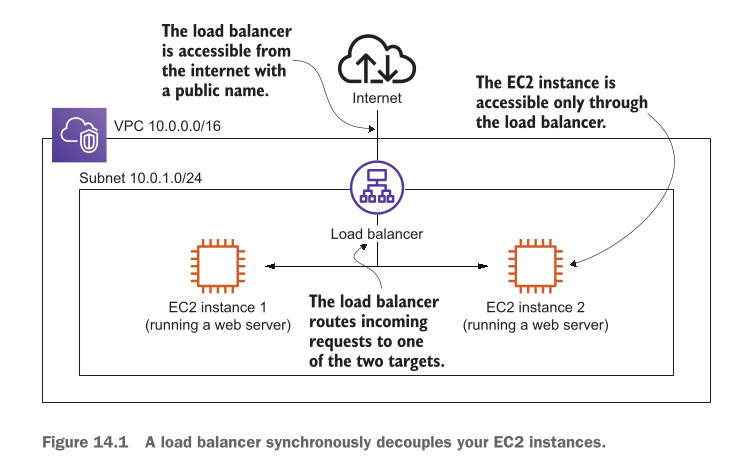
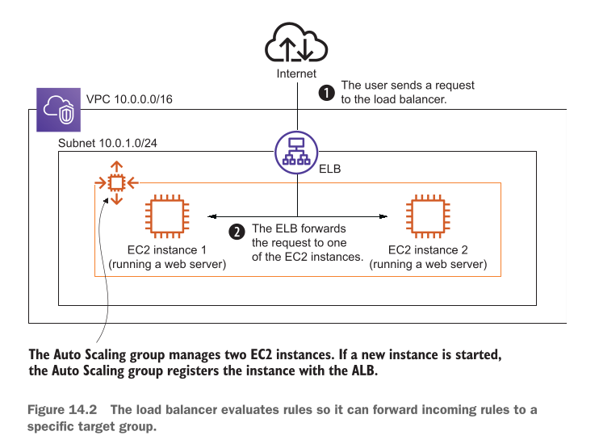
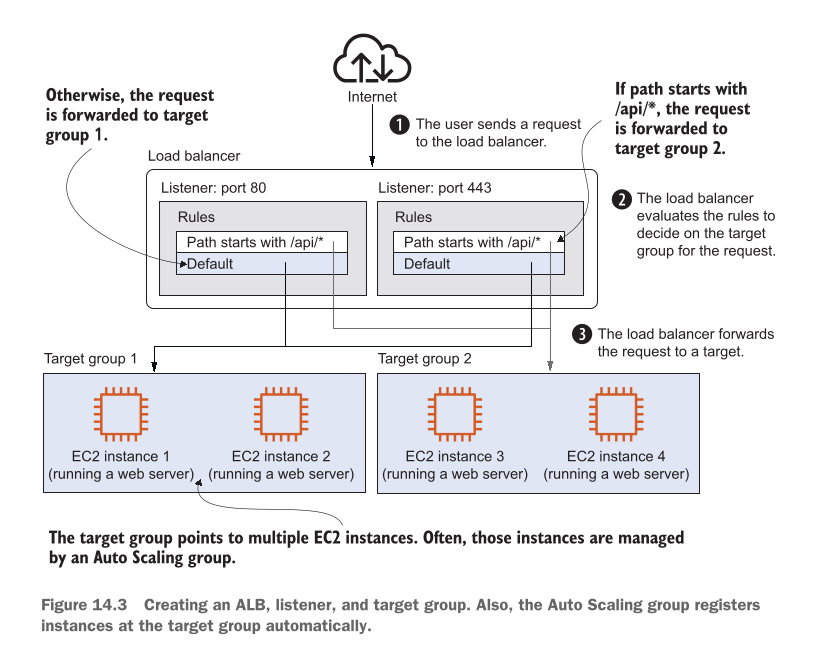

# Decoupling your infrastructure: Elastic Load Balancing and Simple Queue Service

## This chapter covers

Is chapter mein hum chaar (4) main cheezein seekhenge:

* **System ko decouple karne ki wajohat (The reasons for decoupling a system):** Software ke alag-alag hisson ko ek doosre par zyaada dependent (joda hua) na rakhne ke fayde.
* **Load balancers ke sath synchronous decoupling (Synchronous decoupling with load balancers to distribute requests):** Incoming user traffic ko alag-alag backend servers par barabar baantna taake kisi ek server par zyaada bojh na pare.
* **Backend ko users aur message producers se chupana (Hiding your backend from users and message producers):** Security aur flexibility ke liye andar ke servers ko bahar ki dunya se chupana.
* **Message queues ke sath asynchronous decoupling (Asynchronous decoupling with message queues to buffer message peaks):** Jab ek sath hazaron-lakhon requests aayein, toh unhein ek "queue" (line) mein jama karke flexible tarike se process karna.

---

### Real-World Example: Meeting in a Café (Tightly Coupled System)

Writer humein Decoupling ka concept samjhane ke liye ek bohot hi pyari real-world example deta hai:

Maan lijiye aap writer se AWS ke baare mein kuch mashwara (advice) lene ke liye ek café mein milne ka plan banate hain. Is meeting ko safal (successful) banane ke liye 3 shartein zaroori hain:

1. Aap aur writer **dono ek hi waqt par free hon** (Be available at the same time).
2. Aap aur writer **dono ek hi jagah par majood hon** (Be at the same place).
3. Aap dono ek doosre ko **café mein dhoond lein** (Find each other at the café) — jaise writer ke kaale baal hain aur usne white shirt pehni hui hai.

**Is meeting ka masala (Problem):**
Ye meeting **location (jagah)** aur **time (waqt)** ke sath **tightly coupled** (bohot sakhti se judi hui) hai. Agar writer Germany mein rehta hai aur aap Pakistan mein, toh jagah ki is sakht shart ki wajah se meeting hona taqreeban namumkin ho jayegi!

---

### Solution 1: Synchronous Decoupling (Google Hangouts / Video Call)

Ab hum jagah (location) ki shart ko khatam kar dete hain aur milne ka plan change karke **Google Hangouts ya Video Call** par shift ho jaate hain.

Ab meeting ke liye sirf 2 cheezon ki zaroorat hai:

1. Dono ka **ek hi waqt par online hona** (Be available at the same time).
2. Ek doosre ko **Google Hangouts / Skype par dhoondna** (Find each other via ID).

> **Concept:** Google Hangouts ya Video call **Synchronous Decoupling** karti hai. Isne **jagah (Location)** ki zaroorat ko toh khatam kar diya (aap Pakistan mein hon aur writer Germany mein, koi farq nahi padta), lekin **waqt (Time)** ki shart abhi bhi baqi hai — dono ko 3 baje ek sath online aana hi parega.

---

### Solution 2: Asynchronous Decoupling (Email)

Ab hum waqt (time) ki shart ko bhi khatam kar dete hain aur **Email** ka istemal karte hain.

Ab meeting ke liye sirf 1 cheez zaroori hai:

1. Ek doosre ko **Email address par dhoondna** (Find each other via email).

> **Concept:** Email **Asynchronous Decoupling** karti hai. Yahan jagah (location) aur waqt (time) **dono se azaadi** mil jaati hai. Aap raat ke 2 baje email bhej sakte hain jab writer so raha ho, aur writer agle din jaag kar aamne-saamne aaye bagair apna jawab bhej sakta hai.

---

## Decoupling in Software Systems

Bilkul insani meeting ki tarah, software systems mein bhi components aapas mein **tightly coupled** hote hain. Writer do bari misalein deta hai:

1. **Public IP Address ka Tightly Coupled hona:**
* *Problem:* Jaise Café ki location fix thi, waise hi kisi web server tak pohochne ke liye client ko server ka Public IP address pata hona chahiye. Agar aap wo IP address badalte hain, toh client ka connection toot jayega. IP address aur server aapas mein sakhti se jude hue (tightly coupled) hain.


2. **Server ke Online hone par Tightly Coupled hona:**
* *Problem:* Client jab bhi request bhejega, server ko **usi exact waqt par online aur working** hona chahiye. Agar server update ho raha hai, crash ho gaya hai, ya hardware fail ho gaya hai, toh client ki request reject ho jayegi.


Is masala ko hal karne ke liye AWS do tarah ki decoupling services deta hai:

---

### 1. AWS Synchronous Decoupling: Elastic Load Balancing (ELB)

* **Kab use hota hai?** Jab client ko **fawran jawab (immediate response)** chahiye ho. For example, jab koi user browser mein website open karta hai, toh wo chahta hai ke ek second ke andar HTML page load ho jaye.
* **Kaise kaam karta hai?** Client aur Web Servers ke beech mein ek **Elastic Load Balancer (ELB)** baith jata hai.
* Client apni request **server ko nahi, balki ELB ko bhejta hai**.
* ELB us request ko peeche majood kisi bhi chalte hue Virtual Machine (EC2 Instance) ko forward kar deta hai.
* **Fayda:** Client ko andar ke servers ka IP address janne ki zaroorat nahi hoti. Client sirf ELB ko jaanta hai. Agar peeche koi ek server kharab bhi ho jaye, toh ELB request ko doosre sahi server par bhej deta hai — user ko pata bhi nahi chalta!

*(Note: Modern 2026 AWS cloud environments mein hum ELB ki modern types jaise Application Load Balancer (ALB) microservices ke liye aur Network Load Balancer (NLB) ultra-high performance ke liye use karte hain).*

---

### 2. AWS Asynchronous Decoupling: Simple Queue Service (SQS)

* **Kab use hota hai?** Jab client ko **fawran jawab ki zaroorat na ho**. For example, jab user koi badi pic/image upload karta hai, toh website user ko fawran bata deti hai "Image Received", aur background mein us image ko crop ya resize karne ka kaam chalta rehta hai.
* **Kaise kaam karta hai?** AWS ki service **SQS (Simple Queue Service)** ek message queue (chithiyon ka dabba/line) deti hai.
* **Producer** (request bhejne wala) apna message queue mein daal deta hai.
* **Receiver** (kam karne wala server) apni marzi aur speed se queue se message uthata hai aur us par kaam karta hai.

---

## Examples are 100% covered by the Free Tier

Writer yahan ek bohot achi khushkhabri deta hai ke is chapter mein jitne bhi practical kaam aur examples bataye jayenge, wo AWS ke **Free Tier** mein 100% free aate hain.

* **Shart:** Aapko koi extra charges nahi lagenge, jab tak aap in examples ko kuch dino se zyaada chalata na chhor dein.
* **Rule:** Ye tabhi apply hota hai agar aapne book ke liye naya AWS account banaya ho. Chapter khatam karne ke baad sabhi banaye hue resources ko **Clean up (delete)** karna zaroori hai.

---

## NOTE

> **Prerequisite:** Is chapter ke concepts ko poori tarah samajhne ke liye aapko **Chapter 13 (Autoscaling)** ka concept pata hona chahiye.
> *(Simple shafaf wazahat: Autoscaling ka matlab hota hai traffic barhne par khud-ba-khud naye servers ka ban jana, aur traffic kam hone par unka delete ho jana).*


----

## Synchronous decoupling with load balancers

Jab aap apne web server walay EC2 instance ko direct internet par expose (khol) dete hain aur usko ek Public IP address de dete hain, toh aapke tamam users us specific Public IP par fully dependent ho jate hain.

Jab ek baar aap wo Public IP apne users mein baant (distribute) dete hain, toh uske baad aap us IP ko asani se badal nahi sakte. Is waja se aapko 2 bare masle samne aate hain:

1. **Public IP change karna namumkin ho jata hai:** Kyunki hazaron clients aur browsers us puraani IP ko yaad rakh kar requests bhej rahe hote hain.
2. **Traffic distribution ka na hona:** Agar aap traffic ka bojh kam karne ke liye ek aur naya EC2 instance (aur uski nayi Public IP) system mein add bhi kar lein, toh purane users us naye instance ko bilkul ignore kar denge! Wo apni saari requests pehle walay server ki Public IP par hi bhejte rahenge.

### DNS Name use karne ka masla

Aap soch sakte hain ke hum IP address ki jagah ek **DNS name** (jaise `example.com`) use kar lein jo server ki IP par point kare. Lekin DNS poori tarah aapke control mein nahi hota.

* **DNS Caching Ka Masla:** Internet par majood DNS servers aur resolvers IP addresses ki mappings ko cache (save) kar lete hain.
* **TTL (Time-To-Live) Ignore Hona:** Agar aap DNS server ko bolein bhi sahi ke "is IP mapping ko sirf 1 minute ke liye cache karo" (TTL = 1 min), tab bhi bohot se DNS servers is shart ko ignore kar ke us mapping ko poore 1 din ke liye cache kar ke baith jate hain.

### Hal (Solution): Load Balancer

Synchronous decoupling ke liye — jahan user ko instant (fawri) response chahiye hota hai — sab se behtareen hal **Load Balancer** hai.

Aap apne EC2 instances ko direct internet par nahi kholte, balki sirf Load Balancer ko internet par expose karte hain. User ki request pehle Load Balancer par aati hai, aur Load Balancer us request ko peeche majood kisi bhi EC2 instance ko forward kar deta hai.

---

### Figure 14.1 ka Breakdown

<div align="center">
  
</div>

**Figure 14.1** mein clear dikhaya gaya hai ke kis tarah Load Balancer EC2 instances ko synchronously decouple karta hai:

1. **User (Web Browser):** Internet ke zariye ek HTTP request Load Balancer ke Public DNS Name par bhejta hai.
2. **Load Balancer:** Request receive karta hai, peeche majood healthy EC2 instances (EC2 Instance 1 aur EC2 Instance 2) mein se kisi ek ko chunta hai, aur original HTTP request ki copy us instance ko bhej deta hai.
3. **EC2 Instance:** Request par kaam karta hai aur response Load Balancer ko wapas bhejta hai.
4. **Load Balancer:** Wo response original user/browser tak pohncha deta hai.

> **Sab se bara fayda:** User ko kabhi pata hi nahi chalta ke request kis specific EC2 instance ne process ki hai!

---

### AWS Elastic Load Balancing (ELB) ki Types

AWS mein **ELB (Elastic Load Balancing)** service milti hai jo fully fault-tolerant (kabhi fail na hone wali) aur scalable (traffic ke sath khud barhne wali) hoti hai. Iski 3 main types hain:

* **Application Load Balancer (ALB):** Ye HTTP aur HTTPS traffic ke liye best hai. Ye Layer 7 (Application Layer) par kaam karta hai aur modern web apps ke liye use hota hai.
* **Network Load Balancer (NLB):** Ye ultra-high performance, low latency, aur TCP / TCP TLS protocols ke liye use hota hai. Ye millions of requests per second handle kar sakta hai.
* **Classic Load Balancer (CLB):** Ye AWS ka purana load balancer hai aur ab **Deprecated** ho chuka hai. *(Modern 2026 deployment mein hum CLB use nahi karte).*

> **Rule of Thumb (Sunehra Usool):** Agar aapko sirf HTTP/HTTPS traffic handle karna hai toh **ALB** use karein, aur baaqi tamam high-performance TCP traffic ke liye **NLB** use karein.

> **Important Note:** ELB Service ka AWS Console mein koi alag se独立 (independent) page nahi hota, ye aapko **EC2 Management Console** ke andar hi milta hai. Load balancers ko kisi bhi TCP-based request/response system ke aage lagaya ja sakta hai, sirf web servers zaroori nahi hain.

---

## Setting up a load balancer with virtual machines

AWS ki sab se bari taqat ye hai ke iski services aapas mein bohot khubsurti se connect (integrate) ho jati hain. Hum ek **ALB (Application Load Balancer)** ko ek **Auto Scaling Group** ke aage lagate hain.

* **Auto Scaling Group (ASG):** Ye confirm karta hai ke 2 web servers hamesha active rahne chahiye taake agar ek server crash bhi ho jaye, toh website band na ho.
* **Automatic Registration:** ASG ke andar jab bhi naya EC2 instance launch hoga, wo khud-ba-khud ALB ke sath register ho jayega.

---

### Figure 14.2 ka Breakdown

<div align="center">
  
</div>

**Figure 14.2** mein bataya gaya hai ke:

1. User internet ke zariye pehle request Load Balancer ko bhejta hai (Step 1).
2. Load Balancer us request ko kisi ek backend EC2 instance par forward karta hai (Step 2).
3. Public internet se koi bhi insaan EC2 instances ko direct access nahi kar sakta. User ko ye bhi nahi pata hota ke peeche 2 instances chal rahe hain ya 20!
4. ALB aur EC2 instances ke darmiyan traffic ko **Security Groups** ke zariye control kiya jata hai.

---

### ALB ke 4 Main Components (Hisse)

Ek Application Load Balancer (ALB) ke **3 lazmi (required)** aur **1 ikhtiyaari (optional)** hissey hote hain:

1. **Load Balancer (Required):** Ye core configuration hai jo ye batati hai ke load balancer kin subnets mein chalega, public IP milega ya nahi, aur IPv4 use hoga ya IPv4+IPv6 dono.
2. **Listener (Required):** Ye port aur protocol set karta hai (maslan Port 80 HTTP) jahan ALB requests ka intezar karta hai. Ye TLS/SSL encryption ko terminate bhi kar sakta hai.
3. **Target Group (Required):** Ye aapke backend servers ka group hota hai. Target Group ka kaam har thori der baad servers par **Health Checks** bhejna hota hai taake pata chal sake ke server zinda hai ya kharab ho chuka hai. Backends mein EC2 instances, ECS/EKS containers, Lambda functions, ya aapke apna office data center ho sakta hai.
4. **Listener Rule (Optional):** Ye rules tay karte hain ke URL path (jaise `/api/*`) ke mutabiq request kis Target Group par bhejni hai.

---

### Figure 14.3 ka Breakdown

<div align="center">
  
</div>

**Figure 14.3** mein rule-based routing dikhai gayi hai:

1. Client request Port 80 ya Port 443 listener par aati hai.
2. Listener rules check hote hain: Agar URL path `/api/*` se shuru hota hai, toh request **Target Group 2** ko jati hai.
3. Agar koi rule match na ho, toh request default **Target Group 1** par bhej di jati hai.

---

### Code Analysis & Detail Breakdown

Peeche bataye gaye architecture ko CloudFormation ke zariye 3 parts (listings) mein code kiya gaya hai:

#### Listing 14.1: Creating a load balancer and connecting it to an Auto Scaling group A

```yaml
LoadBalancerSecurityGroup:
  Type: 'AWS::EC2::SecurityGroup'
  Properties:
    GroupDescription: 'alb-sg'
    VpcId: !Ref VPC
    SecurityGroupIngress:
      - CidrIp: '0.0.0.0/0'
        FromPort: 80
        IpProtocol: tcp
        ToPort: 80 # Sirf internet se port 80 par aane wala traffic load balancer tak pohnch sakega

LoadBalancer:
  Type: 'AWS::ElasticLoadBalancingV2::LoadBalancer'
  Properties:
    Scheme: 'internet-facing' # ALB publicly accessible hai (private network ke liye internal use karein)
    SecurityGroups:
      - !Ref LoadBalancerSecurityGroup # Security group ko load balancer ke sath assign karta hai
    Subnets:
      - !Ref SubnetA # ALB ko subnets ke sath attach karta hai
      - !Ref SubnetB
    Type: application
    DependsOn: 'VPCGatewayAttachment'

```

* `LoadBalancerSecurityGroup`: Ek Security Group (firewall rule) banata hai.
* `CidrIp: '0.0.0.0/0'`: Poori dunya (kisi bhi IP) se traffic allow karta hai.
* `FromPort: 80` & `ToPort: 80`: Sirf HTTP port 80 ke traffic ko ijazat di gayi hai.
* `LoadBalancer`: Actual ALB resource create kar raha hai.
* `Scheme: 'internet-facing'`: Batata hai ke ALB ko public IP milegi taake internet se access ho sake.
* `Subnets`: High availability ke liye ALB ko do alag subnets (`SubnetA` aur `SubnetB`) mein rakha gaya hai.
* `Type: application`: Batata hai ke ye ek Application Load Balancer hai.

---

#### Listing 14.2: Creating a load balancer and connecting it to an Auto Scaling group B

```yaml
Listener:
  Type: 'AWS::ElasticLoadBalancingV2::Listener'
  Properties:
    DefaultActions:
      - TargetGroupArn: !Ref TargetGroup # Load balancer tamam requests ko default target group par forward karta hai
        Type: forward
    LoadBalancerArn: !Ref LoadBalancer
    Port: 80
    Protocol: HTTP # Load balancer HTTP requests ke liye port 80 par listen karta hai

TargetGroup:
  Type: 'AWS::ElasticLoadBalancingV2::TargetGroup'
  Properties:
    HealthCheckIntervalSeconds: 10 # Har 10 seconds ke baad...
    HealthCheckPath: '/index.html' # .../index.html par HTTP requests ki jati hain
    HealthCheckProtocol: HTTP
    HealthCheckTimeoutSeconds: 5
    HealthyThresholdCount: 3
    UnhealthyThresholdCount: 2
    Matcher:
      HttpCode: '200-299' # Agar HTTP status code 2XX ho, toh backend ko healthy consider kiya jata hai
    Port: 80 # EC2 instances par web server port 80 par listen karta hai
    Protocol: HTTP
    VpcId: !Ref VPC

```

* `Listener`: Port 80 par HTTP traffic ko listen karta hai.
* `DefaultActions`: Aane wali har request ko `TargetGroup` par `forward` kar deta hai.
* `TargetGroup`: Backend EC2 instances ka group aur unka health test setup karta hai.
* `HealthCheckIntervalSeconds: 10`: ALB har 10 seconds baad server ki sehat check karega.
* `HealthCheckPath: '/index.html'`: ALB server ke `/index.html` page ko request karke check karta hai.
* `HealthyThresholdCount: 3`: Agar continuous 3 baar success (status code 200-299) mile, toh server ko healthy mana jata hai.
* `UnhealthyThresholdCount: 2`: Agar continuous 2 baar check fail ho jaye, toh server ko unhealthy Ghoshit kar ke traffic rok di jati hai.

---

#### Listing 14.3: Creating a load balancer and connecting it to an Auto Scaling group C

```yaml
LaunchTemplate:
  Type: 'AWS::EC2::LaunchTemplate'
  Properties:
    LaunchTemplateData:
      IamInstanceProfile:
        Name: !Ref InstanceProfile
      ImageId: !FindInMap [RegionMap, !Ref 'AWS::Region', AMI]
      Monitoring:
        Enabled: false
      InstanceType: 't2.micro'
      NetworkInterfaces:
        - AssociatePublicIpAddress: true
          DeviceIndex: 0
          Groups:
            - !Ref WebServerSecurityGroup
      UserData: # [...]

AutoScalingGroup:
  Type: 'AWS::AutoScaling::AutoScalingGroup'
  Properties:
    LaunchTemplate:
      LaunchTemplateId: !Ref LaunchTemplate
      Version: !GetAtt 'LaunchTemplate.LatestVersionNumber'
    MinSize: !Ref NumberOfVirtualMachines # Do EC2 instances ko chalte hue rakhta hai
    MaxSize: !Ref NumberOfVirtualMachines
    DesiredCapacity: !Ref NumberOfVirtualMachines
    TargetGroupARNs:
      - !Ref TargetGroup # Auto Scaling group naye EC2 instances ko default target group ke sath register karta hai
    VPCZoneIdentifier:
      - !Ref SubnetA
      - !Ref SubnetB
    CreationPolicy:
      ResourceSignal:
        Timeout: 'PT10M'
    DependsOn: 'VPCGatewayAttachment'

```

* `LaunchTemplate`: Batata hai ke naya EC2 instance kis type ka (`t2.micro`) aur kis AMI image se banega.
* `AutoScalingGroup`: ASG create kar raha hai jo target capacity ko 2 EC2 instances par maintain rakhta hai.
* `TargetGroupARNs`: **Ye sab se aham line hai!** Yahan ASG ko Target Group ke sath joda gaya hai. Iska matlab hai ke jab bhi ASG naya instance banayega, wo automatically Target Group ke sath attach ho jayega.

---

### Output Test Karna aur Management Console

CloudFormation stack deploy hone ke baad jab aap browser mein ALB ka DNS address refresh karenge, toh har refresh par aapko backend ke kisi alag EC2 instance ka **Private IP Address** screen par nazar aayega. Ye is baat ka suboot hai ke Load Balancer dono servers ke beech traffic distribution kar raha hai.

#### Monitoring:

1. AWS EC2 Console par jayein.
2. Left menu se **Load Balancing -> Load Balancers** par click karein.
3. Apne ALB ko select karein aur neeche **Monitoring** tab par jayein.
4. Yahan aapko Request Count, Latency, aur Health status ke real-time graphs milenge. *(Dhyan rahe ke ye charts 1 minute late update hote hain).*

---

## Cleaning up

Jab aap ka practical complete ho jaye, toh extra billing se bachne ke liye CloudFormation Console par ja kar banaya gaya **CloudFormation Stack delete** kar dein. Stack delete hone se ALB, Target Groups, Auto Scaling Groups, aur EC2 Instances automatically clean up (delete) ho jayenge.


----