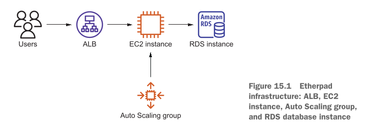
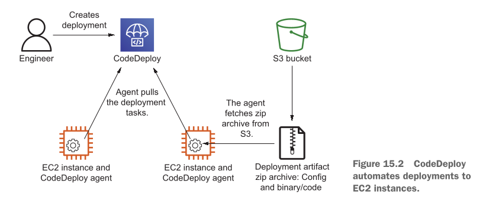

# Automating deployment: CodeDeploy, CloudFormation, and Packer

## Deploying Software in the Cloud

Writer batata hai ke taqriban 20 saal pehle hum ne apni pehli Virtual Machine (VM) rent ki thi. Humara maqsad **WordPress** (jo ke ek content management system hai) ko chalana tha.

Us waqt hum ne yeh kaam manually (khud haath se) kiya tha:

1. Virtual Machine mein **SSH** ke zariye login hue.
2. Internet se **WordPress** download kiya.
3. Scripting language **PHP** aur web server **Apache** install kiya.
4. Configuration files ko edit kiya taake settings sahi ho sakein.
5. Web server ko start kar diya.

Writer samjhata hai ke chahe 20 saal pehle ka waqt ho ya aaj ka daor, chahe software open-source ho, kisi company ka ho, ya aapka apna banaya hua ho—software ko deploy karne ke 4 bunyadi steps hamesha wahi rehte hain:

1. **Fetch source code or binaries:** Software ka code ya binary files (tayyar files) haasil karna.
2. **Install dependencies:** Software ko chalane ke liye jo doosri cheezein chahiye (jaise PHP, database, etc.) unhein install karna.
3. **Edit configuration files:** Software ki settings wali files ko zaroorat ke mutabiq badalna.
4. **Start services:** Main software ya service ko chala dena.

In tamam steps ko mila kar hum **Configuration Management** kehte hain.

---

### Cloud mein Deployments ko Automate karna kyun Zaroori hai?

Writer cloud ke andar automation ke 2 sab se bare karano (reasons) ko bacho ki tarah asaan karke samjhata hai:

* **High Availability aur Scalability ke liye:** Cloud mein jab users barhte hain, toh **Auto Scaling group** khud-ba-khud nayi EC2 instances (virtual machines) chalata hai. Aab sochiyay, agar koi nayi machine kisi bhi waqt khud hi start ho sakti hai, toh kya aap har baar haath se login karke 4 steps perform karenge? Bilkul nahi! Is liye manual deployment ka option cloud mein chal hi nahi sakta.
* **Manual kaam mein ghaltyon ka hatra (Error-prone) aur mehenga hona:** Jab insaan khud haath se setting karta hai toh ghalat-fahaamiyon aur mistakes ke chances ziada hotay hain, aur bar bar wahi kaam haath se karne mein waqt aur paisa zaya hota hai. Automation se reliability (bharosa) barhta hai aur har deployment ki cost kam hoti hai.

Writer apne consulting experience se batata hai ke jo companies cloud mein apne deployments ko automate kar leti hain, unke kamyab hone ke chances bohot ziada hote hain.

---

### Is Chapter mein hum kya seekhein ge?

Is chapter mein hum app deployment ko automate karne ke **3 alag alag tareeqay** seekhein ge taake aap apni zaroorat ke mutabiq behtareen tareeqa chun sakein:

1. **AWS CodeDeploy:** Chalne wali (running) EC2 instances par code deploy karne ke liye.
2. **AWS CloudFormation, Auto Scaling groups, aur user data:** Rolling update karne ke liye.
3. **Customized AMI bundling:** Packer (HashiCorp) ke zariye immutable (jinhein badla na ja sake) deployments karne ke liye.

---

## Examples are 100% covered by the Free Tier

Writer yahan ek bohot achi khushkhabri deta hai ke is chapter ke jitne bhi practical examples hain, woh AWS ke **Free Tier** ke andar aate hain.

> **Bacho ki tarah samajhne wali baat:** Agar aap ne is book ke liye bilkul naya AWS account banaya hai aur aap in examples ko kuch dinon se ziada nahi chalate (yaani practical khatam hone par delete kar dete hain), toh aap ko $1 bhi dene ki zaroorat nahi pare gi. Bas har section ke baad apne account ko clean up (resources delete) karna zaroori hai.

---

## Chapter requirements

Is chapter ke practical ko samajhne ke liye aap ko pehle se in baaton ka pata hona chahiye:

* **Auto Scaling Group** se EC2 instances chalana (Chapter 13).
* **Elastic Load Balancing (ELB)** ke zariye traffic ko alag alag machines par divide karna (Chapter 14).
* **CloudFormation** ke zariye poore cloud infrastructure ko automate karna (Chapter 4).

---

## Real-World Example: Etherpad Application

Writer ek bohot pyari real-world example deta hai:

Sochiyay ke aap apne elaqay ke **AWS Meetup** ke organizer hain. Aap chahte hain ke community members ek sath mil kar documents edit kar sakein. Is ke liye aap ne **Etherpad** naam ki ek web application ko EC2 par deploy karne ka faisla kiya.

Iska architecture bohot simple hai, jise **Figure 15.1** mein dikhaya gaya hai.

### Deploying Software in the Cloud

Writer batata hai ke taqriban 20 saal pehle hum ne apni pehli Virtual Machine (VM) rent ki thi. Humara maqsad **WordPress** (jo ke ek content management system hai) ko deploy karna tha.

Us waqt hum ne yeh kaam manually (khud haath se) kiya tha:

1. Virtual Machine mein **SSH** ke zariye login hue.
2. Internet se **WordPress** download kiya.
3. Scripting language **PHP** aur web server **Apache** install kiya.
4. Configuration files ko edit kiya taake settings sahi ho sakein.
5. Web server ko start kar diya.

Writer samjhata hai ke chahe 20 saal pehle ka waqt ho ya aaj ka daor, chahe software open-source ho, kisi company ka ho, ya aapka apna banaya hua ho—software ko deploy karne ke 4 bunyadi steps hamesha wahi rehte hain:

1. **Fetch source code or binaries:** Software ka code ya tayyar files (binaries) haasil karna.
2. **Install dependencies:** Software ko chalane ke liye zaroori cheezein (jaise PHP, database) install karna.
3. **Edit configuration files:** Software ki settings wali files ko zaroorat ke mutabiq badalna.
4. **Start services:** Main software ya service ko chala dena.

In tamam activities ko mila kar hum **Configuration Management** kehte hain.

---

#### Cloud mein Deployments ko Automate karna kyun Zaroori hai?

Writer cloud ke andar automation ke 2 sab se bare karano (reasons) ko bacho ki tarah asaan karke samjhata hai:

* **To ensure high availability and scalability:** Cloud mein jab traffic barhta hai, toh **Auto Scaling group** khud-ba-khud nayi EC2 instances (virtual machines) chalata hai. Aab sochiyay, agar koi nayi machine kisi bhi waqt khud hi start ho sakti hai, toh kya aap har baar haath se login karke 4 steps perform karenge? Bilkul nahi! Is liye manual deployment ka option cloud mein chal hi nahi sakta.
* **Manual changes are error prone and expensive to reproduce:** Jab insaan khud haath se setting karta hai toh ghalat-fahaamiyon aur mistakes ke chances ziada hotay hain, aur bar bar wahi kaam haath se karne mein waqt aur paisa zaya hota hai. Automating se reliability (bharosa) barhta hai aur har deployment ki cost kam hoti hai.

Writer apne consulting clients ke tajurbe se batata hai ke jo organizations cloud mein automated deployments implement karti hain, unke kamyab hone ke chances bohot ziada hote hain.

---

#### Is Chapter mein hum kya seekhein ge?

Is chapter mein hum app deployment ko automate karne ke **3 alag alag approaches** seekhein ge taake aap apni zaroorat ke mutabiq behtareen solution chun sakein:

1. **AWS CodeDeploy:** Chalne wali (running) EC2 instances par code deploy karne ke liye.
2. **AWS CloudFormation, Auto Scaling groups, aur user data:** Rolling update karne ke liye.
3. **Bundling an application into a customized AMI:** Packer (by HashiCorp) ke zariye immutable deployments karne ke liye.

---

### Examples are 100% covered by the Free Tier

Writer yahan batata hai ke is chapter ke jitne bhi practical examples hain, woh AWS ke **Free Tier** ke andar aate hain.

> **Asaan Samajh:** Agar aap ne is book ke liye fresh AWS account banaya hai aur aap in examples ko kuch dinon se ziada nahi chalate, toh aap ko kuch bhi pay nahi karna parega. Bas har section ke khatam hone par apne resources delete (clean up) karna zaroori hai.

---

### Chapter requirements

Is chapter ke practical ko samajhne ke liye aap ko pehle se in baaton ka pata hona chahiye:

* **Auto Scaling group** se EC2 instances chalana (Chapter 13).
* **Elastic Load Balancing (ELB)** ke zariye traffic ko distribute karna (Chapter 14).
* **CloudFormation** ke zariye cloud infrastructure ko automate karna (Chapter 4).

---

#### Real-World Example: Etherpad Application

Writer ek real-world example deta hai: Imagine karein aap ek local AWS meetup ke organizer hain, aur aap community members ko ek aisa tool dena chahte hain jahan sab mil kar real-time mein documents edit kar sakein. Is ke liye aap ne **Etherpad** web application ko EC2 par deploy karne ka faisla kiya.

### Figure 15.1 Breakdown

Writer figure 15.1 ke zariye Etherpad ke simple architecture ko samjhata hai:

<div align="center">
  
</div>

* **Users:** Traffic sab se pehle users se aati hai.
* **ALB (Application Load Balancer):** Traffic ko receive karta hai aur aage forward karta hai.
* **Auto Scaling group:** Yeh ensure karta hai ke exact 1 virtual machine (EC2 instance) hamesha chalti rahe.
* **EC2 instance:** Is ke upar Etherpad application run ho rahi hai.
* **RDS instance:** Amazon RDS database instance ke andar Etherpad ke tamam documents store hote hain.

> **Trade-off / Limitation:** Writer batata hai ke Etherpad clustering ko support nahi karta. Iska matlab hai ke hum Etherpad ko ek waqt mein ek se ziada machines par parallel nahi chala sakte.

---

### In-place deployment with AWS CodeDeploy

Writer batata hai ke **In-place deployment** ke 2 main reasons hain:

1. **Speed:** Deployment ki speed bohot fast hoti hai.
2. **State retention:** Aap ki application agar virtual machine par koi state (data) save karti hai (jaise database-like system jo disk par data likhta hai), toh aap machine ko replace karne se bachtay hain.

**AWS CodeDeploy** ek fully managed deployment service hai jo **EC2, Fargate, Lambda**, aur yahan tak ke **on-premises** (aap ke apne physical servers) par bhi deployment automate karti hai.

> **Cost factor:** EC2, Fargate, aur Lambda ke liye CodeDeploy **100% Free** hai. On-premises physical machine update ke liye yeh $0.02 per update charge karta hai.

---

### Figure 15.2 Breakdown: CodeDeploy Kaise Kaam Karta Hai?

Figure 15.2 mein CodeDeploy ka step-by-step working mechanism dikhaya gaya hai:

<div align="center">
  
</div>

1. **Engineer uploads archive:** Engineer deployment instructions, code, aur binaries ko ek `.zip` archive mein pack karke AWS S3 bucket par upload karta hai.
2. **Creates deployment:** Engineer CodeDeploy mein revision aur target instances select karke deployment create karta hai.
3. **Agent pulls tasks:** EC2 instance ke andar ek chota sa software running hota hai jise **CodeDeploy Agent** kehte hain. Yeh agent CodeDeploy service se poochta rehta hai ke "kya mere liye koi naya deployment task hai?".
4. **Downloads zip from S3:** CodeDeploy Agent S3 bucket se zip archive ko download karta hai.
5. **Executes instructions & copies code:** Agent zip file ke andar di gayi instructions ko execute karta hai aur code ko sahi jaga copy kar deta hai.
6. **Sends status update:** Agent CodeDeploy service ko bata deta hai ke deployment successful hua ya fail.

---

#### CodeDeploy ke Main Components

Writer in key terms ko bacho ki tarah clarify karta hai:

* **Application:** Is mein application ka naam aur compute platform (EC2/on-premises, ECS, ya Lambda) decide hota hai.
* **Deployment group:** Yeh batata hai ke deployment kis target par karni hai (humari example mein Auto Scaling group).
* **Revision:** Yeh S3 ya GitHub par pare hue actual code aur AppSpec file ka reference hota hai.
* **Deployment:** Kisi specific revision ko target group par roll out (deploy) karne ke action ko deployment kehte hain.

---

#### Setting up the Infrastructure with CloudFormation

Etherpad aur CodeDeploy ka setup karne ke liye hum pehle CloudFormation template chalayen ge.

Terminal par yeh command run karein:

```bash
aws cloudformation deploy --stack-name etherpad-codedeploy \
  --template-file chapter15/codedeploy.yaml --capabilities CAPABILITY_IAM

```

* **`aws cloudformation deploy`**: CloudFormation stack create ya update karne ki command.
* **`--stack-name etherpad-codedeploy`**: AWS mein stack ko "etherpad-codedeploy" ka naam deta hai.
* **`--template-file chapter15/codedeploy.yaml`**: Local system par mojood YAML template file ka path.
* **`--capabilities CAPABILITY_IAM`**: AWS ko ijazat deta hai ke yeh template naye IAM roles create kar sakta hai.

---

#### Listing 15.1 The CodeDeploy application and deployment group

CloudFormation template (`/chapter15/codedeploy.yaml`) ka code aur uska step-by-step breakdown:

```yaml
# [...]
ArtifactBucket: # Deployment artifacts ko store karne ke liye S3 bucket
  Type: 'AWS::S3::Bucket'
  Properties: {}
Application: # CodeDeploy application—deployment groups aur revisions ka collection
  Type: 'AWS::CodeDeploy::Application'
  Properties:
    ApplicationName: 'etherpad-codedeploy'
    ComputePlatform: 'Server'
DeploymentGroup: # CodeDeploy deployment group deployment ke liye targets specify karta hai
  Type: 'AWS::CodeDeploy::DeploymentGroup'
  Properties:
    ApplicationName: !Ref Application
    DeploymentGroupName: 'etherpad-codedeploy'
    AutoScalingGroups:
      - !Ref AutoScalingGroup # Deployment group Auto Scaling group ki taraf ishara karta hai
    DeploymentConfigName: 'CodeDeployDefault.AllAtOnce' # Kyunki sirf aik EC2 instance chal rahi hai, tamam instances par aik sath deploy karta hai
    LoadBalancerInfo: # Deployments karte waqt load balancer ke target group ko consider karta hai
      TargetGroupInfoList:
        - Name: !GetAtt LoadBalancerTargetGroup.GroupName
    ServiceRoleArn: !GetAtt CodeDeployRole.Arn
CodeDeployRole: # Deployments ke liye istemal hone wala IAM role
  Type: 'AWS::IAM::Role'
  Properties:
    AssumeRolePolicyDocument:
      Version: '2012-10-17'
      Statement:
        - Effect: Allow
          Principal:
            Service: 'codedeploy.amazonaws.com'
          Action: 'sts:AssumeRole'
    ManagedPolicyArns:
      - 'arn:aws:iam::aws:policy/service-role/AWSCodeDeployRole' # IAM role autoscaling, load balancing, aur deployment ke liye mutaliqa doosri services ko access grant karta hai
DatabaseHostParameter: # Database hostname ko Systems Manager ke Parameter Store mein store karta hai
  Type: 'AWS::SSM::Parameter'
  Properties:
    Name: '/etherpad-codedeploy/database_host'
    Type: 'String'
    Value: !GetAtt 'Database.Endpoint.Address'
# [...]

```

##### Code Line-by-Line Breakdown:

1. `ArtifactBucket:`: Zip files (code) ko store karne ke liye AWS S3 bucket banati hai.
2. `Application:`: AWS CodeDeploy Application resource create kar rahi hai jiska naam `etherpad-codedeploy` aur platform `Server` (EC2/On-Premises) hai.
3. `DeploymentGroup:`: Deployment targets define karta hai.
* `AutoScalingGroups`: Refers to our Auto Scaling Group.
* `DeploymentConfigName: 'CodeDeployDefault.AllAtOnce'`: Target ki tamam instances par ek hi waqt mein code push kar deta hai.
* `LoadBalancerInfo`: Deployment ke waqt ALB Target Group ko associate rakhtar hai taake traffic drop na ho.
* `ServiceRoleArn`: CodeDeploy service ko AWS resources access karne ka IAM Role deta hai.


4. `CodeDeployRole:`: AWS IAM Role jo `codedeploy.amazonaws.com` service ko permissions (`AWSCodeDeployRole` policy) deta hai.
5. `DatabaseHostParameter:`: AWS Systems Manager (SSM) Parameter Store mein RDS Database ka Endpoint IP/DNS `/etherpad-codedeploy/database_host` ke name se safe karta hai.

---

#### Table 15.1 The predefined deployment configurations for CodeDeploy

CodeDeploy mein pehle se tayyar ki hui yeh deployment configurations milti hain:

| Name | Description (Roman Urdu) |
| --- | --- |
| **CodeDeployDefault.AllAtOnce** | Tamam targets par ek hi waqt mein deploy karta hai. (Sab se fast, lekin downtime aa sakta hai) |
| **CodeDeployDefault.HalfAtATime** | Total targets mein se adhy (50%) par ek waqt mein deploy karta hai aur baki adhy par baad mein. |
| **CodeDeployDefault.OneAtATime** | Targets par ek ek karke (one-by-one) deploy karta hai taake service hamesha up rahe. |

> **Note:** CodeDeploy aap ko custom rules (jaise 25% at a time) banane ki bhi ijazat deta hai.

---

#### Stack Outputs Fetch Karna

CloudFormation deployment ke baad, outputs check karne ke liye yeh command run karein:

```bash
aws cloudformation describe-stacks --stack-name etherpad-codedeploy \
  --query "Stacks[0].Outputs"

```

**JSON Output:**

```json
[
  {
    "OutputKey": "ArtifactBucket",
    "OutputValue": "etherpad-codedeploy-artifactbucket-12vahlx44tpg7",
    "Description": "Name of the artifact bucket"
  },
  {
    "OutputKey": "URL",
    "OutputValue": "http://ether-LoadB-...us-east-1.elb.amazonaws.com",
    "Description": "The URL of the Etherpad application"
  }
]

```

* **`ArtifactBucket`**: Is S3 bucket ka naam (`etherpad-codedeploy-artifactbucket-12vahlx44tpg7`) agle step ke liye copy kar lein.
* **`URL`**: Jab aap is URL ko browser mein kholein ge toh shuru mein ALB error page dikhaye ga, kyun ke abhi tak app deploy nahi hui.

---

#### Listing 15.2 The AppSpec file used to deploy Etherpad with the help of CodeDeploy

CodeDeploy ko yeh batane ke liye ke deployment ke waqt kya kya karna hai, ek configuration file zaroori hoti hai jise **AppSpec file (`appspec.yml`)** kehte hain.

```yaml
version: 0.0 # Ajeeb lekin sach hai: AppSpec file format ka latest version 0.0 hai
os: linux # CodeDeploy Linux aur Windows ko support karta hai
files:
  - source: .
    destination: /etherpad # Archive se tamam files ko /etherpad mein copy karta hai
hooks: # Hooks aap ko deployment process ke doran scripts chalane ki ijazat dete hain
  BeforeInstall:
    - location: hook_before_install.sh
      timeout: 60 # CodeDeploy ke source files copy karne se pehle trigger hota hai
  AfterInstall:
    - location: hook_after_install.sh
      timeout: 60 # CodeDeploy ke source files copy karne ke baad trigger hota hai
  ApplicationStart:
    - location: hook_application_start.sh
      timeout: 180
      runas: ec2-user # Application ko start karne ke liye trigger hota hai
  ValidateService:
    - location: hook_validate_service.sh
      timeout: 300
      runas: ec2-user # Application start karne ke baad service ko validate karne ke liye trigger hota hai

```

##### Line-by-Line Breakdown:

* `version: 0.0`: AppSpec Specification ka standard version identifier.
* `os: linux`: Target operating system set kar raha hai.
* `files`:
* `source: .`: Zip file ke andar ki tamam files.
* `destination: /etherpad`: Server ke `/etherpad` directory mein save hongi.


* `hooks`: Life-cycle events jahan hum apne custom scripts chalate hain:
* `BeforeInstall`: Code copy hone se pehle `hook_before_install.sh` chalta hai (Timeout: 60 seconds).
* `AfterInstall`: Code copy hone ke baad `hook_after_install.sh` chalta hai (Timeout: 60 seconds).
* `ApplicationStart`: Etherpad app ko start karne ke liye `hook_application_start.sh` ko `ec2-user` as user chalata hai (Timeout: 180 seconds).
* `ValidateService`: App chalne ke baad check karta hai ke service healthy hai ya nahi via `hook_validate_service.sh` (Timeout: 300 seconds).


---

#### Listing 15.3 Executing the script after the install step

`hook_after_install.sh` script ka code aur breakdown:

```bash
#!/bin/bash -ex

TOKEN=`curl -X PUT "http://169.254.169.254/latest/api/token" \
  -H "X-aws-ec2-metadata-token-ttl-seconds: 60"` # EC2 metadata service ko access karne ke liye token haasil karta hai
AZ=`curl -H "X-aws-ec2-metadata-token: $TOKEN" -v \
  http://169.254.169.254/latest/meta-data/placement/availability-zone` # Metadata service se EC2 instance ki availability zone fetch karta hai
REGION=${AZ::-1} # Region haasil karne ke liye availability zone ka aakhri character remove kar deta hai
DATABASE_HOST=$(aws ssm get-parameter --region ${REGION} \
  --name "/etherpad-codedeploy/database_host" \
  --query "Parameter.Value" --output text) # Systems Manager Parameter Store se database host ka naam fetch karta hai

chown -R ec2-user:ec2-user /etherpad/ # Yeh yakeeni banata hai ke tamam files root ke bajaye ec2-user ki hain
cd /etherpad/
rm -fR node_modules/ # Etherpad ke zariye istemal hone wale Node.js modules ko clean karta hai
echo "
{
  \"title\": \"Etherpad\",
  \"dbType\": \"mysql\",
  \"dbSettings\": {
    \"host\": \"${DATABASE_HOST}\",
    \"port\": \"3306\",
    \"database\": \"etherpad\",
    \"user\": \"etherpad\",
    \"password\": \"etherpad\"
  },
  \"exposeVersion\": true
}
" > settings.json # Database host par mushtamil Etherpad ke liye settings.json file generate karta hai

```

##### Line-by-Line Breakdown:

1. `#!/bin/bash -ex`: Bash script header. `-e` ghalti par script rok deta hai, `-x` har command ko terminal par print karta hai.
2. `TOKEN=...`: IMDSv2 (EC2 Instance Metadata Service) se secure access token request karta hai.
3. `AZ=...`: Token use kar ke current EC2 instance ki Availability Zone (e.g., `us-east-1a`) fetch karta hai.
4. `REGION=${AZ::-1}`: String se last letter ('a') hata kar actual AWS Region (`us-east-1`) alag karta hai.
5. `DATABASE_HOST=...`: AWS SSM Parameter Store se `/etherpad-codedeploy/database_host` ki value (RDS Endpoint) fetch karta hai.
6. `chown -R ec2-user:ec2-user /etherpad/`: `/etherpad` folder ka owner `ec2-user` banata hai taake permissions issue na aayein.
7. `cd /etherpad/`: Directory change karta hai.
8. `rm -fR node_modules/`: Purane node dependencies ko delete karta hai.
9. `echo "{...}" > settings.json`: Etherpad ke liye MySQL database configuration dynamic variables ke sath generate karke `settings.json` file mein write kar deta hai.

---

### Application Deploy Karna (Step-by-Step)

#### Step 1: Zip file ko S3 Bucket par upload karein

`$BucketName` ko apne actual S3 bucket name se replace karein:

```bash
aws s3 cp chapter15/etherpad-lite-1.8.17.zip \
  s3://$BucketName/etherpad-lite-1.8.17.zip

```

#### Step 2: Deployment Create Karein

```bash
aws deploy create-deployment --application-name etherpad-codedeploy \
  --deployment-group-name etherpad-codedeploy \
  --revision "revisionType=S3,s3Location={bucket=$BucketName,key=etherpad-lite-1.8.17.zip,bundleType=zip}"

```

#### Step 3: Deployment Status Check Karein

`$DeploymentId` ko pichli command ke output mein aane wali ID se replace karein:

```bash
aws deploy get-deployment --deployment-id $DeploymentId

```

Jab deployment successful ho jaye, ALB ka URL browser mein kholein. Version setting check karne par **`c85ab49`** (Etherpad v1.8.17) nazar aaye ga.

---

### Version Update (Security Fix 1.8.18 Deploy Karna)

Agar v1.8.18 par update karna ho toh:

1. Naya zip S3 par upload karein:

```bash
aws s3 cp chapter15/etherpad-lite-1.8.18.zip \
  s3://$BucketName/etherpad-lite-1.8.18.zip

```

2. Naya Deployment create karein:

```bash
aws deploy create-deployment --application-name etherpad-codedeploy \
  --deployment-group-name etherpad-codedeploy \
  --revision "revisionType=S3,s3Location={bucket=$BucketName,key=etherpad-lite-1.8.18.zip,bundleType=zip}"

```

3. Deployment status verify karein:

```bash
aws deploy get-deployment --deployment-id $DeploymentId

```

Deployment ke baad web application refresh karein. Ab version **`4b96ff6`** dikhayi dega.

---

### Cleaning up

Kaam khatam hone par AWS resources ko delete karne ke liye commands:

```bash
aws s3 rm --recursive s3://${BucketName}
aws cloudformation delete-stack --stack-name etherpad-codedeploy

```

* **`aws s3 rm --recursive`**: Bucket mein maujood tamaam zip files aur objects ko pehle safa karta hai.
* **`aws cloudformation delete-stack`**: CloudFormation stack aur us ke zariye bani tamaam EC2, RDS, ALB instances ko delete kar deta hai.

> **Auto-healing Feature:** Agar Auto Scaling group kisi kharab EC2 instance ko replace karke nayi instance chalata hai, toh CodeDeploy Agent khud-ba-khud latest code revision ko nayi machine par deploy kar dega.

---

#### Snowflake Servers Trade-off vs. New Approach

Writer yahan ek important architectural concept samjhata hai:

In-place deployment tez hoti hai, lekin hafton aur mahinon se chalne wali machines (**Snowflake Servers**) par changes apply karna khatarnak hota hai. Ho sakta hai pehle ki gayi kisi manual change ki wajah se naya deployment fail ho jaye.

Is liye hum **Immutable Infrastructure / Rolling Update** ko prefer karte hain jahan purani machine ko update karne ke bajaye **nayi Virtual Machine** chala kar deployment kiya jata hai.

---

### Blue-green deployments with CodeDeploy

Writer batata hai ke CodeDeploy **Blue-Green deployments** ko bhi support karta hai jahan in-place ke bajaye nayi machines start ki jati hain. Lekin hum **CloudFormation** ko rolling updates ke liye uski sadgi (simplicity) ki wajah se prefer karte hain.


---

## Rolling update with AWS CloudFormation and user data

**CloudFormation** ek **Infrastructure as Code (IaC)** tool hai jise AWS resources ko automated tareeqay se manage karne ke liye design kiya gaya hai. Is ke alawa, aap CloudFormation ko Auto Scaling group mein EC2 instances ke **rolling update** ko orchestrate (manage) karne ke liye bhi istemal kar sakte hain.

In-place update ke muqable mein, **rolling update** mein users ke liye **zero downtime** hota hai (yaani app ek second ke liye bhi band nahi hoti).

> **Bacho ki tarah samajhne wali baat:**
> Sochiyay aap ki ek dukan hai jise aap ne renovate karna hai.
> * **In-place update:** Aap dukan ka shutter gira kar andar kaam karte hain, jisse customers wapas chale jatay hain (downtime).
> * **Rolling update:** Aap barabar mein ek nayi dukan kholte hain, naya samaan wahan shift karte hain, customers ko wahan bhejna shuru karte hain, aur phir purani dukan ko band kar dete hain. Customer ko pata bhi nahi chalta ke peeche kya badla!
> 
> 

Hum yeh rolling update wala tareeqa tab istemal karte hain jab humari Virtual Machines **disposable** (kisi bhi waqt delete hone wali) hon. Yaani jab humari application local disk ya memory mein koi data permanent save na karti ho.
For example: **WordPress, Jenkins**, ya web scrape karne wale custom worker scripts.

---

### Process Breakdown & Figure 15.3 Detailed Breakdown

Figure 15.3 mein CloudFormation aur user data ke zariye hone wale rolling update ko step-by-step samjhaya gaya hai:

<div align="center">
  
</div>

1. **Updates stack:** Engineer CloudFormation stack ka update initiate (shuru) karta hai.
2. **Orchestrates rolling update:** CloudFormation Auto Scaling group ko nayi machine launch karne ka hukam deta hai.
3. **Launches EC2 instance:** Auto Scaling group updated launch template ke mutabiq ek **nayi EC2 instance** launch karta hai, jis mein naya deployment script hota hai.
4. **Fetches and executes User data:** Nayi EC2 instance boot (start) hotay hi user data script ko fetch aur run karti hai.
5. **Fetches Source code:** User data script **GitHub** se source code fetch karti hai, `settings.json` file banati hai, aur Etherpad application ko start kar deti hai.
6. **Terminates old EC2 instance:** Jab nayi instance sahi tarah chal padti hai aur CloudFormation ko signal mil jata hai, toh Auto Scaling group **purani EC2 instance ko terminate (delete)** kar deta hai.

---

### Deploying Etherpad via CloudFormation

Etherpad ko deploy karne ke liye pehle terminal par yeh command chalayein:

```bash
aws cloudformation deploy --stack-name etherpad-cloudformation \
  --template-file chapter15/cloudformation.yaml \
  --parameter-overrides EtherpadVersion=1.8.17 \
  --capabilities CAPABILITY_IAM

```

##### Command Breakdown:

* **`aws cloudformation deploy`**: CloudFormation stack create ya update karne ki command.
* **`--stack-name etherpad-cloudformation`**: Stack ko `etherpad-cloudformation` ka naam deta hai.
* **`--template-file chapter15/cloudformation.yaml`**: Local system par maujood YAML template file.
* **`--parameter-overrides EtherpadVersion=1.8.17`**: Template ko batata hai ke Etherpad ka kaun sa version (`1.8.17`) install karna hai.
* **`--capabilities CAPABILITY_IAM`**: AWS ko IAM roles create karne ki permission deta hai.

Is command ko complete hone aur stack create hone mein taqriban **10 minute** lagen ge. Stack create hone ke baad app ka URL haasil karne ke liye yeh command run karein:

```bash
aws cloudformation describe-stacks --stack-name etherpad-cloudformation \
  --query "Stacks[0].Outputs[0].OutputValue" --output text

```

Is URL ko browser mein kholein, ek naya pad banayein, aur settings icon par click karke version check karein. Version **`c85ab49`** hoga, jo ke v1.8.17 ka latest Git commit ID hai.

---

#### Listing 15.4 Adding a bash script to the user data

CloudFormation template (`chapter15/cloudformation.yaml`) ka yeh hissa dikhata hai ke EC2 instance boot hote hi user data script kaise chalata hai:

```yaml
# [...]
LaunchTemplate: # Auto Scaling group EC2 instances launch karte waqt launch template ko aik blueprint ke taur par istemal karta hai
  Type: 'AWS::EC2::LaunchTemplate'
  Properties:
    LaunchTemplateData:
      # [...]
      ImageId: !FindInMap [RegionMap, !Ref 'AWS::Region', AMI] # Maujuda region par munhasir Amazon Linux 2 AMI ko select karta hai
      InstanceType: 't2.micro' # Free Tier ke liye qabil-e-amal instance type ko select karta hai
      UserData: # Yahan jadoo hota hai: yahan define ki gayi user data runtime ke doran EC2 instance ke zariye accessible hoti hai
        'Fn::Base64': !Sub |
          #!/bin/bash -ex
          trap '/opt/aws/bin/cfn-signal -e 1 --stack ${AWS::StackName} \
          --resource AutoScalingGroup --region ${AWS::Region}' ERR # Agar koi bhi step fail ho jaye, toh script abort ho jayegi aur cfn-signal ko call kar ke CloudFormation ko notify karegi
          
          # Install nodejs and git
          curl -fsSL https://rpm.nodesource.com/setup_14.x | bash -
          yum install -y nodejs git
          
          # Fetch, configure, and start Etherpad as non-root user
          su ec2-user -c '
          cd /home/ec2-user/
          git clone --depth 1 --branch ${EtherpadVersion} \
            https://github.com/AWSInAction/etherpad-lite.git # GitHub repository se Etherpad ko fetch karta hai
          cd etherpad-lite/
          echo "
          {
            \"title\": \"Etherpad\",
            \"dbType\": \"mysql\",
            \"dbSettings\": {
              \"host\": \"${Database.Endpoint.Address}\",
              \"port\": \"3306\",
              \"database\": \"etherpad\",
              \"user\": \"etherpad\",
              \"password\": \"etherpad\"
            },
            \"exposeVersion\": true
          }
          " > settings.json # Database host name par mushtamil Etherpad ke liye aik settings file create karta hai
          ./src/bin/run.sh &' # Etherpad ko start karta hai
          
          /opt/aws/bin/cfn-signal -e 0 --stack ${AWS::StackName} \
            --resource AutoScalingGroup --region ${AWS::Region} # Kamyab deployment ke baray mein CloudFormation ko notify karta hai
# [...]

```

##### Detailed Code Breakdown:

1. **`LaunchTemplate:`**: EC2 instance launch karne ka blueprint/map.
2. **`ImageId: !FindInMap [...]`**: Region ke hisab se sahi Amazon Linux 2 AMI select karta hai.
3. **`InstanceType: 't2.micro'`**: Free Tier mein aane wali basic instance type.
4. **`UserData: 'Fn::Base64': !Sub |`**: User data script ko Base64 encoding mein convert karta hai aur variables ko inject karne ki permission deta hai.
5. **`#!/bin/bash -ex`**: Shell script header (`-e` error aane par ruko, `-x` har command print karo).
6. **`trap '... cfn-signal -e 1 ...' ERR`**: **(Bacho ki tarah samajhein)** Yeh ek guard-dog ki tarah hai. Agar script mein koi bhi error aati hai (`ERR`), toh yeh foran CloudFormation ko paigham bhejta hai ke `-e 1` (Error Code 1) hua hai, deployment fail ho gaya hai.
7. **`curl ... | bash -` aur `yum install -y nodejs git**`: Node.js package repository add karke runtime dependencies (Node.js aur Git) install karta hai.
8. **`su ec2-user -c '...'`**: Security ke liye root (admin) account ke bajaye aam user (`ec2-user`) ban kar aglay commands chalata hai.
9. **`git clone --depth 1 --branch ${EtherpadVersion} ...`**: GitHub se required version ka code download karta hai.
10. **`echo "{...}" > settings.json`**: RDS Database host endpoint (`${Database.Endpoint.Address}`) ke sath configuration file generate karta hai.
11. **`./src/bin/run.sh &`**: Application ko background mein execute karta hai.
12. **`/opt/aws/bin/cfn-signal -e 0 ...`**: CloudFormation ko paigham bhejta hai ke `-e 0` (Exit Code 0 = Everything Success), deployment successfully mukammal ho gayi hai!

---

### User Data Deployment Summary

Yeh deployment 4 steps mein kaam karti hai:

1. Launch template EC2 instance launch karte waqt user data script attach karta hai.
2. Auto Scaling group Amazon Linux 2 image se EC2 instance chalata hai.
3. Server boot hone ke bilkul aakhri step par EC2 user data wala bash script run karta hai.
4. Bash script Etherpad ko GitHub se lata hai, configure karta hai, aur start kar deta hai.

> **Important Note:** User data script **sirf pehli baar boot hone par (first boot only)** chalta hai. Is liye agar server restart ho jaye, toh yeh script dobara nahi chalega. Services ko restart karne ke liye is script par depend na karein!

---

## Debugging a user data script

Agar aap ka user data script fail ho jaye ya sahi kaam na kar raha ho, toh debug karne ke liye:

1. **AWS Systems Manager (SSM) Session Manager** ke zariye EC2 instance se connect karein.
2. Termial par log file check karein jahan user data script ke saare outputs save hote hain:

```bash
less /var/log/cloud-init-output.log

```

---

#### Listing 15.5 Updating the Auto Scaling group or the referenced launch template

Jab hum Etherpad ko v1.8.17 se v1.8.18 par update karte hain, toh CloudFormation ka Auto Scaling Group aur UpdatePolicy yeh kaam sambhalti hai:

```yaml
AutoScalingGroup:
  Type: 'AWS::AutoScaling::AutoScalingGroup' # Yeh resource Auto Scaling group ko define karta hai
  Properties:
    TargetGroupARNs:
      - !Ref LoadBalancerTargetGroup
    LaunchTemplate:
      LaunchTemplateId: !Ref LaunchTemplate
      Version: !GetAtt 'LaunchTemplate.LatestVersionNumber' # Hum ne jo launch template pehle dekha tha usay refer karta hai
    MinSize: '1' # Etherpad clustering ko support nahi karta; is liye hum aik single machine launch kar rahe hain
    MaxSize: '2' # Zero-downtime deployments enable karne ke liye, hamein deployment process ke doran doosri machine launch karni parti hai
    HealthCheckGracePeriod: 300
    HealthCheckType: ELB
    VPCZoneIdentifier:
      - !Ref SubnetA
      - !Ref SubnetB
    Tags:
      - PropagateAtLaunch: true
        Value: etherpad
        Key: Name
    CreationPolicy:
      ResourceSignal:
        Timeout: 'PT10M' # Auto Scaling group 10 minutes ke andar EC2 instance launch hone ka success signal expect karta hai (user data script mein cfn-signal dekhein)
    UpdatePolicy: # Update policy launch template mein tabdeeliyon ki soorat mein CloudFormation ke behavior ko specify karti hai
      AutoScalingRollingUpdate: # Yahan jadoo hota hai: rolling update ki configuration
        PauseTime: PT10M
        WaitOnResourceSignals: true # Auto Scaling group EC2 instance ki taraf se signal ka intezar karta hai
        MinInstancesInService: 1 # Yeh yakeeni banata hai ke zero downtime deployment ko ensure karne ke liye update ke doran instance up aur running ho

```

##### Detailed Code Breakdown:

* **`TargetGroupARNs`**: Load Balancer ke Target Group ka reference deta hai.
* **`Version: !GetAtt 'LaunchTemplate.LatestVersionNumber'`**: Hamesha Launch Template ke sab se naye version ko pick karta hai.
* **`MinSize: '1'` & `MaxSize: '2'**`:
* **Trade-off:** Etherpad clustering support nahi karta, is liye normal waqt mein `MinSize: 1` rahega.
* Deployment ke dauran `MaxSize: 2` allow karta hai taake zero-downtime rolling update ke liye doosri nayi machine chal sake.


* **`HealthCheckGracePeriod: 300`**: Nayi machine ko start hone aur app set up karne ke liye 300 seconds (5 minute) deta hai, is se pehle ELB use unhealthy mark nahi karega.
* **`CreationPolicy / ResourceSignal / Timeout: 'PT10M'`**: Instance banne par 10 minutes tak `cfn-signal` ka intezar karta hai.
* **`UpdatePolicy / AutoScalingRollingUpdate`**:
* **`PauseTime: PT10M`**: Suspend time limit 10 minutes.
* **`WaitOnResourceSignals: true`**: Nayi machine se `cfn-signal -e 0` milne tak purani machine ko nahi maarta.
* **`MinInstancesInService: 1`**: Update ke dauran kam az kam 1 machine hamesha running rahe gi taake users ko downtime ka samna na karna pare.


---

### Step-by-Step Update Execution (v1.8.17 to v1.8.18)

Etherpad ko v1.8.18 par update karne ke liye terminal par yeh command run karein:

```bash
aws cloudformation deploy --stack-name etherpad-cloudformation \
  --template-file cloudformation.yaml \
  --parameter-overrides EtherpadVersion=1.8.18 \
  --capabilities CAPABILITY_IAM

```

#### Backstage Sequence:

1. CloudFormation ek nayi EC2 instance chalaye ga.
2. Nayi EC2 instance user data ke zariye v1.8.18 download kare gi aur run kare gi.
3. Nayi instance CloudFormation ko success signal (`cfn-signal`) bheje gi.
4. CloudFormation purani v1.8.17 wali instance ko delete/terminate kar dega.

Update hone ke baad browser mein URL refresh karein aur version check karein. Ab commit ID **`4b96ff6`** hoga. Congratulations! Aap ne bina kisi downtime ke naya version deploy kar liya hai.

---

## Cleaning up

Practical khatam hone ke baad apne AWS account se CloudFormation stack aur resources delete karne ke liye yeh command run karein:

```bash
aws cloudformation delete-stack --stack-name etherpad-cloudformation

```

---

### Architectural Flaw & Trade-off (Limitations of User Data)

Writer ek bohot aham architectural khami (flaw) ki taraf ishara karta hai:

Base OS image (jaise Amazon Linux 2) se EC2 instance chala kar user data script par poora deployment chorna **100% reliable (qabil-e-itmaad) nahi hai**.

* **Kyun?** User data script run hotay waqt agar internet par mojood koi external dependency down ho jaye (jaise GitHub down ho jaye ya Node.js/RPM repository responsive na ho), toh script fail ho jaye gi aur aap ki EC2 instance launch nahi ho paye gi.

#### Agla Solution (Preview):

Is risk ko khatam karne ke liye hum aglay section mein **Custom AMIs (using Packer)** banana seekhein ge. Jis mein hum pehle se sab kuch (Node.js, Etherpad source code, dependencies) install karke image tayyar kar lete hain. Is se external dependencies khatam ho jati hain aur EC2 instance ka boot time bhi bohot fast ho jata hai.


---