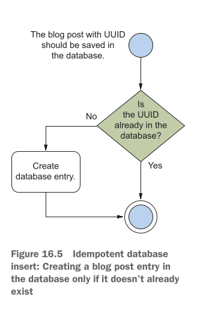
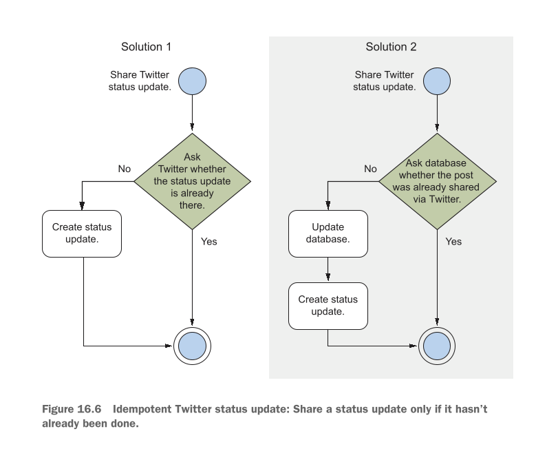
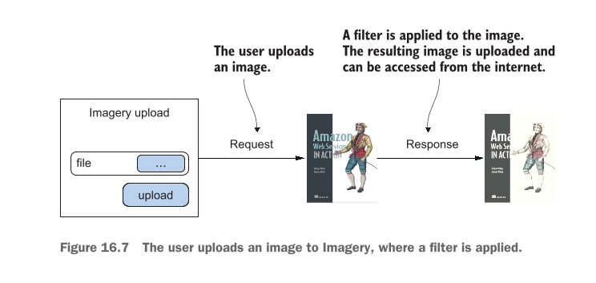
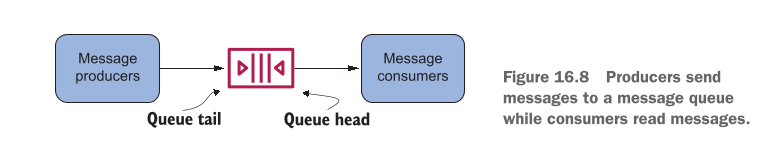
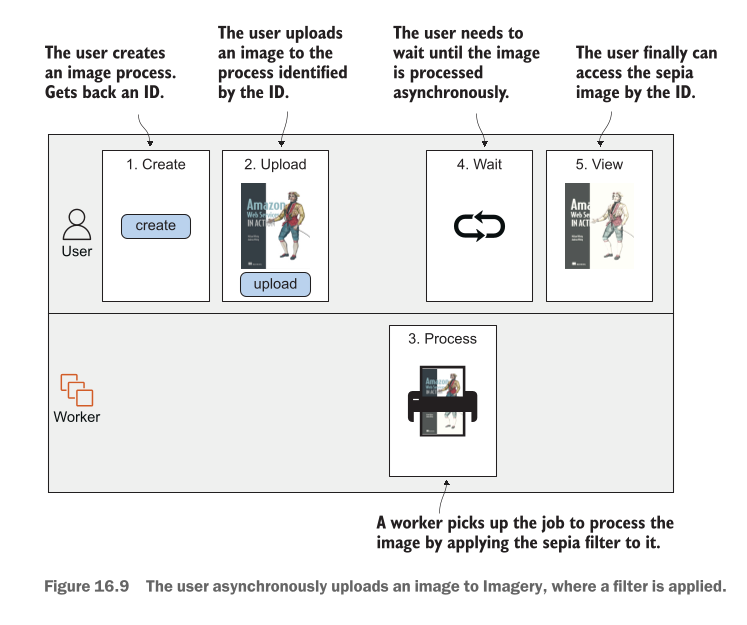
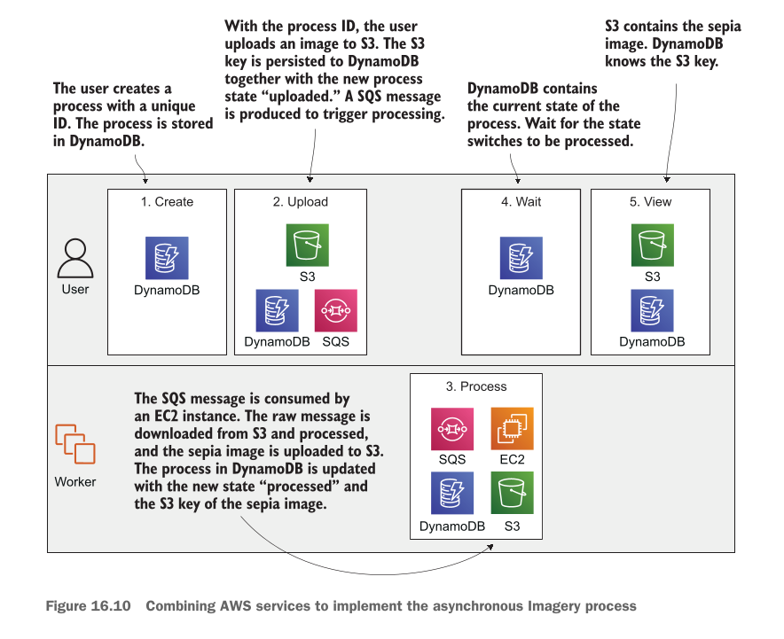

# Designing for fault tolerance

## This chapter covers

* **What fault-tolerance is and why you need it** (Fault tolerance kya hoti hai aur aap ko is ki kyun zaroorat hai)
* **Using redundancy to remove single points of failure** (Redundancy ka istemal karke Single Points of Failure ko khatam karna)
* **Improving fault tolerance by retrying on failure** (Kharabi aane par retries ki madad se fault tolerance ko behtar banana)
* **Using idempotent operations to retry on failure** (Kharabi par bina kisi double effect ke retries ke liye Idempotent operations ka istemal karna)
* **AWS service guarantees** (AWS ki mukhtalif services ki resilience aur availability ki guarantees)

---

### Failure Is Inevitable: Build for Failure

Kainat ka usool hai ke hardware toot sakta hai, network cut sakta hai, aur electricity band ho sakti hai. Software ki dunya mein bhi hard disks ka kharab hona, cables ka tootna ya power supply ka jana aik aam baat hai. Lekin ek zabardast system ka matlab yeh hota hai ke **andar chahe kitni bhi kharabi aaye, bahar baithe user ko pata tak na chale**.

Aik **Fault-Tolerant System** aap ke users ko sab se behtareen quality aur experience deta hai. Aap ke system ke pichay chahe koi server phat jaye ya network down ho jaye, user bilkul be-khauf hokar apna kaam karta rehta hai, videos dekhta rehta hai, online shopping karta hai ya doston se baatein karta rehta hai.

Purane zamane mein (kuch saal pehle) aisa system banana bohot mehnga aur azaab ka kaam hota tha kyunki aap ko duplicate physical servers khareed kar rakhne parhte thay. Lekin **AWS Cloud** ki wajah se ab fault-tolerant systems banana sasta aur ek aam standard ban chuka hai. Phir bhi, cloud computing mein fault-tolerant systems design karna sab se uonchi category (top tier) ka kaam hai aur shuruat mein yeh thoda challenging ho sakta hai.

Fault tolerance ke liye design karne ka matlab hai ke **pehle se yeh maan kar chalna ke har cheez kharab hogi (Build for Failure)** aur system ko aisa banana ke wo kharabi aane par khud hi usay **automatically theek (Self-Heal)** kar le.

---

### Core Architectural Concepts (Pehlu)

#### 1. Avoiding Single Points of Failure (SPOF)

* **SPOF Kya Hai?** Aisa samjhein ke ek cycle ka aik hi chain hai. Agar wo chain toot jaye toh poori cycle ruk jati hai. System mein bhi agar koi aik aisa component ho jiske kharab hone se poora system baith jaye, toh usay Single Point of Failure kehte hain. Fault tolerance ka pehla usool hai ke SPOF ko har keemat par khatam kiya jaye.

#### 2. Redundancy (Duplication)

* Redundancy ka matlab hai **ek ki bajaye ek se zyada ek jaisay components lagana**.
* *Misaal:* Agar aap gaadi mein lambay safar par ja rahe hain, toh aap aik extra spare tyre (stepney) sath rakhte hain. Agar ek tyre puncture ho jaye, toh doosra kaam aata hai. EC2 mein hum apni app ko sirf ek single machine par chalane ke bajaye **multiple machines (fleet)** par baant (distribute) dete hain.

#### 3. Decoupling (Components ko Azaad Karna)

* Architecture ke hissno ko ek doosre se is tarah alag (decouple) karna ke ek hissa agar down bhi ho jaye, toh doosra hissa rukay nahi balkey chalta rahay.
* *Writer ki Example:* Agar aap ka **Database down** ho chuka hai, tab bhi aap ka **Web Server** crash hone ki bajaye user ko purana saved (cached) content dikha de taake screen blank na ho.

---

### AWS Resilience Categories

**Resilience (Muqabla Karne Ki Salahiyat):** Kharabi ka muqabla karne ki aisi salahiyat jisse user par zero ya bohot kam asar pare.

AWS ki tamam services ko un ki resilience aur failure handling ke lehaz se 3 mukhtalif darjo (categories) mein baanta gaya hai:

| Resilience Level | Kharabi Aane Par Kya Hota Hai? | User Par Asar | Recovery Time |
| --- | --- | --- | --- |
| **No Guarantees (SPOF)** | Service mukammal taur par kaam karna band kar deti hai. | Request fail ho jati hai, app band ho jati hai. | Manual intervention zaroori hai. |
| **High Availability (HA)** | Service mein chota sa jhatka lagta hai, lekin system khud ko recover kar leta hai. | Thoda sa interruption/delay aa sakta hai. | Kuch seconds se 1 minute. |
| **Fault Tolerant (FT)** | System ke andar kharabi aane ke bawajood service bilkul pehle ki tarah chalti rehti hai. | **Zero Asar!** User ko pata tak nahi chalta. | Immediate (Instant smooth failover). |

> **Zaroori Mashwara:** Apne system ko fault-tolerant banane ka sab se aasan tareeqaa yeh hai ke aap shuru se hi sirf un AWS services ko use karein jo **by default Fault Tolerant** hain. Agar aap ke tamam building blocks fault tolerant honge, toh aap ka poora system automatically fault tolerant ban jayega.

---

### AWS Services Classification Breakdown

Writer ne AWS ki tamam key services ko un ki resilience capability ke hisab se alag alag divide kiya hai:

#### Category 1: Neither Highly Available nor Fault Tolerant (Single Point of Failure)

Jab aap in services ko akele use karte hain, toh aap apne infrastructure mein SPOF add kar rahe hote hain:

* **Single Amazon EC2 Instance:** Single Virtual Machine kisi bhi waqt hardware issue, network fail, ya Availability Zone (AZ) outage ki wajah se band ho sakti hai.
* *Solution:* Single instance ke bajaye **Auto Scaling groups** ke zariye EC2 instances ka redundant fleet banayein.


* **Single Amazon RDS Instance:** Single database instance bhi EC2 ki tarah crash ho sakta hai.
* *Solution:* High Availability hasil karne ke liye **Multi-AZ mode** enable karein.


#### Category 2: Highly Available (HA) by Default

Yeh services kharabi ke waqt thoda sa downtime leti hain lekin khud hi recover ho jati hain:

* **Elastic Network Interface (ENI):** Network interface ek specific AZ se bound hota hai. Agar wo AZ down ho jaye toh ENI bhi unavailable ho jata hai. Lekin chote outage mein aap ENI ko kisi doosri virtual machine ke sath dobara attach kar sakte hain.
* **Amazon VPC Subnet:** Subnet ek AZ tak mehdood hoti hai. Agar AZ down hua toh subnet tak pohnch band ho jayegi. Is se bachne ke liye multiple AZs mein subnets banayi jati hain.
* **Amazon EBS Volume:** EBS volume ka data ek AZ ke andar multiple storage systems par duplicate hota hai. Lekin agar poora AZ hi fail ho jaye toh volume unavailable ho jayega (data safe rehta hai). Is se bachne ke liye periodic **EBS Snapshots** liye jaate hain taake kisi doosre AZ mein volume recreate kiya ja sake.
* **Amazon RDS Multi-AZ Instance:** Jab RDS Multi-AZ mode mein chalta hai, toh master database fail hone par standby database active hota hai aur DNS records change hone mein lagbhag **1 minute ka chota sa downtime** ata hai.

#### Category 3: Fault Tolerant (FT) by Default

In services ko use karte waqt aap ko kisi failure ka pata tak nahi chalta:

* **Elastic Load Balancing (ELB)** (Kam az kam 2 AZs mein deployed ho)
* **Amazon EC2 Security Groups**
* **Amazon VPC** (Network ACL aur Route Table ke sath)
* **Elastic IP Addresses (EIP)**
* **Amazon Simple Storage Service (S3)**
* **Amazon EBS Snapshots**
* **Amazon DynamoDB**
* **Amazon CloudWatch**
* **Auto Scaling Groups**
* **Amazon Simple Queue Service (SQS)**
* **AWS CloudFormation**
* **AWS Identity and Access Management (IAM)** (Yeh global service hai; ek jagah user banao toh poore dunya ke regions mein milta hai).

---

## Chapter requirements

Is chapter ke practical aur theoretical concepts ko samajhne ke liye aap ko pehle se in baato ka pata hona zaroori hai:

* **Amazon EC2** (Virtual Machines ki basics)
* **Auto Scaling** (Instances ko automatically kam ya zyada karna)
* **Elastic Load Balancing (ELB)** (Traffic ko distribute karna)
* **Simple Queue Service (SQS)** (Messages aur tasks ko queue mein rakhna)

Is chapter ke hands-on project mein hum in tools ka intensive istemal karenge:

* **Amazon DynamoDB** (NoSQL Database)
* **Express Framework** (Node.js par bani hui web application framework)

---

### The Practical Hands-on Application Overview

Is chapter mein aap EC2 instances (jo ke by default fault tolerant nahi hotay) par mabni aik **100% Fault-Tolerant Web Application** design karna seekhein ge.

#### Application Ka Maqsad:

1. User aik image upload karega.
2. System us image par **Sepia Filter** (purana/vintage photo effect) apply karega.
3. User process hui image ko download kar sakega.

#### System Ka Design Step-by-Step:

1. **Workload Distribution:** Task ko aik single machine par chalane ke bajaye hum multiple EC2 instances par baant denge jo alag alag Data Centers (**Availability Zones**) mein chal rahe honge.
2. **Resilience in Code:** Code ko aisa banayein ge ke agar koi task fail ho toh wo crash na ho balkey retries aur idempotent mechanisms ke zariye recover ho.
3. **Complete Fault-Tolerant Infrastructure:** Hum in components ko aapas mein jodein ge:
* **SQS (Queue):** Upload hone walay tasks ko safely manage karne ke liye.
* **ALB (Application Load Balancer):** Traffic ko healthy EC2 instances par bhejne ke liye.
* **Auto Scaling Groups:** Kharab hone walay EC2 instances ko automatically khatam karke naye instances khade karne ke liye.
* **DynamoDB:** Data ko highly available aur fault-tolerant tareeqay se store karne ke liye.

---

## Using redundant EC2 instances to increase availability

Virtual machine (EC2 instance) ke kharab ya crash hone ki do bari wajaat hoti hain: aik hardware/infrastructure ka masla aur doosra aap ke apne application code ka masla.

### 1. Hardware Aur Infrastructure Level Ki Wajaat:

Aap ki virtual machine in wajaat se fail ho sakti hai:

* **Host Hardware Failure:** Jis physical server (computer) par aap ki virtual machine (EC2) chal rahi hai, agar us ka hardware (processor, RAM, motherboard) kharab ho jaye, toh wo aap ki virtual machine ko mazeed nahi chala sakta.
* **Network Interruption:** Physical host computer ka network connection toot jaye ya wire cut jaye, toh virtual machine ka bahar ki dunya se rabta khatam ho jata hai.
* **Power Failure:** Agar physical server ki bijli chali jaye ya power supply phat jaye, toh us par chalne wali virtual machine bhi fauran band ho jati hai.

### 2. Software Aur Application Level Ki Wajaat:

Hardware bilkul theek ho tab bhi aap ka apna software application crash ho sakta hai:

* **Memory Leak (RAM Ka Bhar Jana):** Agar aap ke application code mein aisa bug hai jo RAM use toh karta hai lekin kaam hone ke baad usay khaali (free) nahi karta, toh ahista ahista saari RAM bhar jaye gi. Chahe is mein ek din lage, ek mahina lage ya ek saal, aik din RAM poori tarah khatam ho jaye gi aur EC2 instance crash ho jaye ga.
* **Disk Space Full (Hard Disk Ka Bhar Jana):** Agar aap ka application hard disk par data ya log files write karta rehta hai aur purana data kabhi delete nahi karta, toh jald ya baqaddar hard disk full ho jaye gi aur aap ki app chalna band ho jaye gi.
* **Unhandled Edge Cases:** Software mein koi aisa unexpected error ya unique situation aa jaye jise code mein handle na kiya gaya ho, toh app achanak se crash ho jati hai.

> **Sab Se Bada Decision Aur Conclusion:** Chahe masla physical server ka ho ya aap ke code ka, **aik single EC2 instance hamesha Single Point of Failure (SPOF) hota hai**. Agar aap poore system ke liye sirf ek EC2 par bharosa karenge, toh aap ka system har haal mein fail hoga—yeh sirf waqt ki baat hai ke kab hota hai.

---

## Redundancy can remove a single point of failure

SPOF ko khatam karne ke liye hum **Redundancy** (yaani ek se zyada duplicate components) ka istemal karte hain.

### Real-World Example: Fluffy Cloud Pies Ki Factory

Bacho ki tarah samajhne ke liye aik bakery ki misaal lete hain jo "Fluffy Cloud Pies" (halke phulke cloud wale cake) banati hai. Is pie ko banane ke 5 aasan steps hain:

1. Pie ki crust (neeche wali biscuit layer) banana.
2. Crust ko thanda (cool down) karna.
3. Crust ke upar fluffy cloud mass (cream/topping) lagana.
4. Poore pie ko dobara thanda karna.
5. Pie ko pack (package) karna.

#### Masla (Single Production Line):

Pehle se setup mein bakery ke paas sirf **aik hi production line** hai. Masla yeh hai ke agar is poore process mein koi aik step bhi kharab ho jaye, toh poori bakery ka kaam ruk jata hai.

* **Figure 16.1 Ka Hawala Aur Breakdown:**

<div align="center">
  
</div>

* `Figure 16.1` mein dekhein, yahan "Production line 1" dikhayi gayi hai.
* Step 2 (Cool down machine) par laal rang ka cross ($X$) laga hai, jis ka matlab hai ke machine kharab ho gayi hai ("The cool-down machine is broken").
* Is ke waja se aage laal arrows aur akhir mein ek laal toota hua dil (broken heart) dikhaya gaya hai, jiska matlab hai ke poori chain toot chuki hai ("The complete chain is broken"). Aage wale steps 3, 4, aur 5 ko thandi crust milegi hi nahi, toh wo aage kaam hi nahi kar sakte.


#### Hal (Multiple Production Lines / Redundancy):

Aik line lagane ke bajaye bakery mein **3 alag alag production lines** laga di jayein, jo shuru se lekar packing tak alag alag kaam karein. Agar aik line ki machine kharab bhi ho jaye, toh baqi 2 lines chalti rahegi aur dunya bhar ke bhooke customers ko pies milti rahegi.

* **Figure 16.2 Ka Hawala Aur Breakdown:**

<div align="center">
  
</div>

* `Figure 16.2` mein dekhein, yahan 3 lines hain: Production line 1, Production line 2, aur Production line 3.
* Production line 2 mein Step 2 (cool down) kharab ho gaya hai (laal cross aur broken heart).
* Lekin Production line 1 aur Production line 3 bilkul sahi chal rahi hain (kaala dil = success). System abhi bhi chal raha hai!
* **Trade-off (Nuksan/Kharach):** Is ka aik hi chota sa nuksan hai ke aap ko 3 guna zyada machines khareedni parhti hain.


#### EC2 Par Redundancy Kaise Apply Hoti Hai?

Bilkul bakery ki tarah, aik EC2 instance chalane ke bajaye aap **3 EC2 instances** chalayein. Agar aik instance fail bhi ho jaye, toh baqi 2 instances aane wali requests ko sambhaalte rahenge.

**Kharchay (Cost) Ka Smart Decision:**
3 instances ka kharcha bachane ke liye aap aik bara (large) EC2 instance chalane ke bajaye **3 chote (small) EC2 instances** chalayein. Is se aap ka kharcha taqreeban utna hi rahega lekin system highly available ho jaye ga!

**Naya Challenge:** Jab 3 virtual machines chal rahi hongi, toh user/client ko kaise pata chalega ke kis EC2 se baat karni hai? Is ka jawab hai **Decoupling** (yaani client aur EC2 ke beech mein Load Balancer ya Message Queue lagana).

---

## Redundancy requires decoupling

Client aur EC2 instances ke darmiyan direct rishta khatam karne (decouple karne) ke do sab se behtareen tareeqay hain: **Elastic Load Balancing (ELB)** aur **Simple Queue Service (SQS)**.

### Model 1: Synchronous Decoupling (Load Balancer Ke Sath)

* **Figure 16.3 Ka Hawala Aur Complete Breakdown:**

<div align="center">
  
</div>

* Yahan `Figure 16.3` mein aik VPC (`10.0.0.0/16`) ke andar system ka architecture dikhaya gaya hai.
* Internet se aane waali tamaam traffic sab se pehle **Load Balancer** par aati hai.
* System do alag alag **Availability Zones (AZ A aur AZ B)** par phaila hua hai.
* AZ A ke andar Subnet `10.0.1.0/24` hai aur AZ B ke andar Subnet `10.0.2.0/24` hai.
* Dono subnets ke andar **Web Servers (EC2 instances)** chal rahe hain jo ek **Auto Scaling group** ke under manage ho rahe hain.


#### Jab Koi EC2 Instance Crash Hota Hai Toh Kya Hota Hai? (Step-by-Step):

1. Jab aik EC2 instance crash hota hai, **Load Balancer** fauran detection (health check) karta hai aur us kharab instance ko traffic bhejna **band (stop)** kar deta hai.
2. **Auto Scaling group** fauran us kharab EC2 ko terminate karta hai aur kuch hi minto (minutes) mein aik **naya EC2 instance** create kar deta hai.
3. Jaise hi naya EC2 ready hota hai, **Load Balancer** us naye instance ko requests bhejna shuru kar deta hai.

#### Figure 16.3 Mein Kitni Redundancy Hai?

* **Availability Zones (AZs):** Yahan 2 AZs use ho rahe hain. Agar aik poora Data Center (AZ) bhi kisi wajah se band ho jaye, tab bhi doosre AZ mein hamare EC2 instances chal rahe hote hain.
* **Subnets:** Subnet hamesha aik specific AZ se judi hoti hai, is liye hum ne har AZ mein alag subnet banayi hai (`10.0.1.0/24` aur `10.0.2.0/24`).
* **EC2 Instances:** Multiple subnets mein multiple instances chalne se AZ level par redundancy milti hai.
* **Load Balancer:** Load balancer multiple subnets aur multiple AZs par phaila hota hai.

---

### Model 2: Asynchronous Decoupling (SQS Queue Ke Sath)

* **Figure 16.4 Ka Hawala Aur Breakdown:**

<div align="center">
  
</div>

* `Figure 16.4` mein EC2 instances ko asynchronous tareeqay se SQS Queue ke sath joda gaya hai.
* Client ki request seedha EC2 par nahi jati balkey **SQS Queue** mein jama hoti hai.
* VPC ke andar, Auto Scaling Group dono AZs (Subnet `10.0.1.0/24` aur Subnet B) mein **Worker EC2 instances** ko manage kar raha hai.
* Yahan Workers queue se akele akele messages utha kar process karte hain. Agar koi Worker EC2 crash bhi ho jaye, toh message SQS queue mein safe rehta hai aur doosra worker usay utha kar process kar leta hai.


---

### Ek Bohot Zaroori Architectural Point

Agar aap `Figure 16.3` aur `Figure 16.4` ko ghaor se dekhein, toh Load Balancer aur SQS Queue ki aik aik hi icon/box dikhayi gayi hai.

Is ka yeh matlab bilkul nahi hai ke Load Balancer ya SQS khud Single Point of Failure (SPOF) hain. **ELB aur SQS AWS ki taraf se default taur par Fault-Tolerant services hain**. AWS background mein inhein multiple AZs par khud hi highly available rakhta hai, is liye aap ko in ki kharabi ki fikar karne ki zaroorat nahi hoti.


---

## Considerations for making your code fault tolerant

Agar aap apne poore system ko **fault-tolerant** (kharabi ke bawajood chalne wala) banana chahte hain, toh sirf infrastructure (servers) redundant karna kaafi nahi hai. Aap ko apna **application code** bhi usi hisab se design karna padega.

Code ko fault-tolerant banane ke liye writer ne **2 sab se zaroori usool (rules)** bataye hain:

1. **Failure aane par code ko crash hone do, lekin retries (dobara koshish) bhi karo.**
2. **Jahan tak ho sake, hamesha Idempotent Code likho.**

---

## Let it crash, but also retry

Programming ki dunya mein **Erlang** naam ki language apne ek mashhoor concept **"Let it crash"** (jaise hi koi masala aaye, program ko crash hone do / Fail Fast) ki wajah se jani jati hai. Is ka matlab hai ke jab program ko samajh na aaye ke aage kya karna hai, toh wo zabardasti chalne ke bajaye fauran crash ho jaye.

Lekin log sab se bari ghalti yeh karte hain ke wo sirf "crash" ko yaad rakhte hain aur **"retry"** (dobara koshish karne) ko bhool jaate hain!

* **Masla:** Agar aap ka system crash hone ke baad dobara koshish (retry) nahi karega, toh aap ka poora system down ho jaye ga—jo ke fault tolerance ke bilkul khilaf hai.

Writer ne is concept ko **Synchronous** aur **Asynchronous** dono tareeqon mein samjhaya hai:

### 1. Synchronous Decoupled Scenario Mein Retry:

Is scenario mein request bhejney walay (Sender/Client) ko khud retry ki logic likhni parhti hai. Agar aik makhsoos waqt (timeout) tak response na aaye ya error milay, toh sender dobara wahi request bhejta hai.

### 2. Asynchronous Decoupled Scenario Mein Retry:

Is scenario mein retries ka kaam bohot aasan hota hai kyunki yeh **default taur par built-in** hota hai!

* *Misaal:* Jab queue (jaise SQS) se koi worker message uthata hai, agar wo worker crash ho jaye aur aik makhsoos waqt tak queue ko kamyabi ka ishara (acknowledgement) na de, toh message automatic wapas queue mein chala jata hai. Is ke baad agla worker us message ko utha kar dobara process (retry) kar leta hai.

### Crash Kab Karwana Chahiye Aur Kab Nahi? (Bacho Ki Tarah Aasaan Samjhein)

* **Jab Crash NAHI Karwana Chahiye:** Agar user ne galat data bhej diya hai (jaise form mein email ki jagah naam likh diya), toh server ko crash karne ka koi faida nahi! Aap chahe 100 baar retry kar lein, user ka galat data sahi nahi ho jaye ga.
* **Jab Crash Karwana CHAHIYE:** Agar aap ka server Database se connect nahi ho pa raha (network issue ki wajah se), toh server ko crash hone do aur retry karo. Kyunki 2-3 seconds baad jab network theek hoga, toh retry hone par request successfully process ho jaye gi.

### Retry Ka Sab Se Bada Khatra (The Danger of Retries):

Aap ek blog post create kar rahe hain. Pehli baar request gayi, database mein post save ho gayi, lekin response raste mein network issue ki wajah se zaya ho gaya. Client ko laga request fail ho gayi, us ne **Retry** kar diya.

* **Natija:** Database mein ek hi blog post do (2) baar duplicate ho jaye gi!
Is duplicates ke maslay ko hal karne ke liye hum **Idempotent Retry** ka istemal karte hain.

---

## Idempotent retry makes fault tolerance possible

**Idempotency (Aisa Kaam Jo Bar Bar Karne Se Badal Na Jaye):**
Idempotent ka matlab hai ke aap kisi action ko **aik baar karein ya 100 baar karein, us ka aakhri outcome/natija hamesha bilkul SEHSAM (SAME) hi rahega**.

* **Nadan/Aasan Tareeqaa (Naive Approach):** Blog post ke **Title** ko database ki Primary Key bana do. Jab retry hoga, toh database dekhega ke is title ki post pehle se majood hai, toh wo doosri post insert karne ke bajaye skip kar dega.

Lekin asal dunya mein blog post create karne ka process thoda complex hota hai aur us mein **3 steps** hotay hain. Aayein in teeno steps ko aik aik kar ke detail se samjhte hain:

---

### 1. CREATE A BLOG POST ENTRY IN THE DATABASE

Title ko primary key banane ke bajaye hum client side par ek **UUID (Universally Unique Identifier)** generate karte hain (jaise: `550e8400-e29b-11d4-a716-446655440000`). UUID ek aisa unique random code hota hai ke dunya mein do sehnay jaisay UUID banne ka chance lagbhag zero hota hai.

Client request bhejte waqt UUID, Title, aur Text bhejta hai. Server DB mein check karta hai ke kya yeh UUID pehle se majood hai?

* Agar nahi hai -> Nayi entry add kar do.
* Agar pehle se hai -> Insertion skip kar ke aage barh jao.

#### Figure 16.5 Ka Hawala Aur Step-by-Step Breakdown:

`Figure 16.5` mein idempotent database insert ka poora flow dikhaya gaya hai:

<div align="center">
  
</div>

1. **Initial Event:** Blog post jiske sath UUID majood hai, wo database mein save hone ke liye aati hai.
2. **Decision Box (Is the UUID already in the database?):**
* **NO:** Agar UUID pehle se majood nahi hai, toh flowchart **"Create database entry"** wale box par jata hai aur entry save karke process khatam (**End**) ho jata hai.
* **YES:** Agar UUID pehle se database mein majood hai (kyunki yeh retry request hai), toh flowchart bina koi duplicate entry banaye seedha **End** (double circle) par chala jata hai.


#### Database Ke Zariye Idempotency Handle Karna (3 Options):

Code mein logic likhne ke bajaye aap seedha Database ko insert command bhej kar bhi yeh handle kar sakte hain. Jab aap Insert ki command bhejenge toh 3 cheezein ho sakti hain:

1. **Database data insert kar deta hai:** Operation kamyab ho gaya!
2. **Database primary key duplicate hone ka error deta hai:** Is ka matlab hai pehle hi insert ho chuka tha, operation kamyab samjha jaye ga!
3. **Database koi aur maslay ka error deta hai:** Application crash ho jaye gi aur retry karegi.

---

### 2. INVALIDATE THE CACHE

Jab naya blog post ban jata hai, toh puranay saved data (cache) ko khatam (invalidate) karna parhta hai taake users ko naya post nazar aaye.

Is step mein idempotency ki zyada fikar karne ki zaroorat nahi hoti:

* Agar retry ki wajah se cache **ek se zyada baar bhi clear/invalidate ho jaye**, toh is se koi nuksan nahi hota.
* Agli baar jab koi user request karega, toh cache khaali milegi, system database se naya data utha kar dobara cache mein rakh dega.
* **Trade-off / Bura se bura outcome:** Zyada se zyada database par do teen extra queries parh jayengi, jo ke koi bara masla nahi hai.

---

### 3. POST TO THE BLOG'S TWITTER FEED

Sab se mushkil kaam kisi teesri party (Third-Party API jaise Twitter/X) ke sath deal karna hai, kyunki un ke paas built-in idempotency ki guarantees nahi hoti.

Dunya ka koi aisa solution nahi hai jo 100% guarantee de ke Twitter par **exact ek (1) baar** hi tweet post hogi. Aap ko do mein se kisi ek option ko chunna padega:

* **At least once (Kam az kam ek baar):** 1 ya 1 se zyada tweets ho sakti hain.
* **At most most once (Zyada se zyada ek baar):** 1 tweet hogi ya shayad 0 (bilkul nahi) hogi.

#### Figure 16.6 Ka Hawala Aur Breakdown (Dono Solutions Ka Muqabla):

`Figure 16.6` mein Twitter par status share karne ke 2 mukhtalif solutions ka flow chart dikhaya gaya hai:

<div align="center">
  
</div>
```

* **Solution 1 (Twitter API se poochna):**
* Flowchart mein dekhein: Pehle Twitter API se pucha jata hai ke kya yeh status pehle se majood hai? Agar `No`, toh status create kar do. Agar `Yes`, toh skip kar do.
* **Khamiyan (The Problem):** Twitter aik **Eventually Consistent** system hai. Is ka matlab hai ke tweet karne ke fauran baad agar aap Twitter se poochhenge, toh shayad Twitter boley ke "nahi hai status" (kyunki data sync hone mein kuch milliseconds lagte hain). Is chakkar mein duplicate tweet post ho sakti hai.


* **Solution 2 (Local Database se poochna):**
* Flowchart mein dekhein: Pehle apne Database se pucha jata hai ke kya yeh post share ho chuki hai? Agar `No`, toh pehle **Database update** karo ke tweet ho gayi hai, aur us ke BAAD Twitter API ko request bhejo.
* **Khamiyan (The Problem):** Agar aap ne Database mein save kar diya ke "Tweet ho gayi hai", aur abhi Twitter API ko request bhejni hi thi ke **system crash ho gaya!** Ab database bolega ke Tweet ho chuki hai, lekin sach mein Twitter par tweet nahi hui hogi!


#### Design Decision (Business Ka Faisla):

Aap ko yeh **Business Decision** lena padega ke aap ka business kis cheez ko bardasht kar sakta hai:

1. **Kya aap aik missing tweet bardasht kar sakte hain?** (At-most-once)
2. **Ya aap multiple (duplicate) tweets bardasht kar sakte hain?** (At-least-once)


---


## Building a fault-tolerant web application: Imagery

Pehle is se pehle ke hum **Imagery** naam ki fault-tolerant application ki architecture aur design shuru karein, aaein aasaan alfaz mein samajhte hain ke yeh application asal mein karegi kya:

1. User apni koi bhi aam photo (raw image) upload karega.
2. System us image par **Sepia Filter** (vintage/brownish purana effect) apply karega taake photo khoobsoorat lagay.
3. User us sepia photo ko dekh aur download kar sakega.

* **Figure 16.7 Ka Hawala Aur Breakdown:**

<div align="center">
  
</div>

`Figure 16.7` mein is process ko **Synchronous** tareeqay se dikhaya gaya hai:
* User request bhejta hai aur image upload karta hai.
* Web server request ke dauran hi filter apply karta hai aur response mein sepia image wapas bhejta hai.
* **Sab Se Bada Masla:** Yeh process **Synchronous** hai. Agar image process hone ke dauran web server crash ho jaye, toh user ki tasveer zaya ho jaye gi. Is ke ilawa jab aik sath bohot saare users app use karenge, toh server par bojh barh jaye ga, system slow ho jaye ga ya crash ho jaye ga.


Is maslay ko hal karne ke liye hum is process ko **Asynchronous** banayein ge.

* **Figure 16.8 Ka Hawala Aur Breakdown:**

<div align="center">
  
</div>

`Figure 16.8` mein SQS Queue ke zariye **Asynchronous Decoupling** ka bunyadi usool dikhaya gaya hai:
* **Message Producers** (Web servers) request ko **SQS Queue** ke pichle hisse (Queue tail) mein daalte hain.
* **Message Consumers** (Worker machines) SQS Queue ke aglay hisse (Queue head) se messages utha kar azaadana tareeqay se process karti hain.


### Asynchronous Process Kaise Kaam Karta Hai?

Jab process asynchronous hota hai, toh har kaam par nazar rakhna zaroori hota hai. Is ke liye hum har process ko aik **Unique Identifier (Process ID)** dete hain.

* **Figure 16.9 Ka Hawala Aur Step-by-Step Breakdown:**

<div align="center">
  
</div>

`Figure 16.9` mein asynchronous process ke 5 steps ko do hisson (User aur Worker) mein baanta gaya hai:
1. **1. Create (User):** User sab se pehle image process create karta hai aur usay aik Unique ID milti hai.
2. **2. Upload (User):** Us Unique ID ke sath user apni raw image upload karta hai.
3. **3. Process (Worker):** Background mein **Worker** us job ko uthata hai aur image par sepia filter apply karta hai.
4. **4. Wait (User):** Jab tak background mein worker kaam kar raha hota hai, user us Unique ID ke zariye status check karta hai (wait karta hai).
5. **5. View (User):** Jaise hi processing 100% khatam hoti hai, lookup request user ko final sepia image dikha deti hai.


### Process Ko AWS Services Par Map Karna

Ab hum is asynchronous process ko AWS ki services par map karenge. Kyunki AWS ki aksar services by default fault-tolerant hain, hum unka bharpoor faida uthayein ge.

* **Figure 16.10 Ka Hawala Aur AWS Service Breakdown:**

<div align="center">
  
</div>

`Figure 16.10` mein poora system AWS services ke sath joda gaya hai:
1. **1. Create:** User Unique ID ke sath process create karta hai. Yeh entry **DynamoDB** table mein save hoti hai.
2. **2. Upload:** Process ID ka istemal karke user raw image ko **Amazon S3** bucket mein upload karta hai. S3 ki key DynamoDB mein update hoti hai aur **SQS Queue** mein aik message trigger hota hai.
3. **3. Process:** Aik **EC2 instance (Worker)** SQS message ko consume karta hai, S3 se raw image download karta hai, sepia filter apply karta hai, aur new sepia image ko dobara S3 mein upload kar deta hai. Phir DynamoDB mein state ko `"processed"` set kar deta hai.
4. **4. Wait:** User DynamoDB se continuous polling karke state change hone ka intizar karta hai.
5. **5. View:** State `"processed"` hote hi user S3 se sepia image hasil kar leta hai.


Tamam actions **REST API** ke zariye accessible honge jo EC2 instances par chal rahe honge. EC2 instances by default fault-tolerant nahi hotay, is liye hum **Idempotent State Machine** ka istemal karenge.

### Example is 100% covered by the Free Tier

Yeh poora chapter project **AWS Free Tier** ke andar aata hai. Agar aap ka AWS account naya hai aur aap 2-3 din ke andar practice mukammal karke resources delete kar dete hain, toh aap ko aik rupeya bhi pay nahi karna parega.

---

## The idempotent state machine

"Idempotent State Machine" ka naam sun kar ghabrana nahi hai! Yeh Imagery application ka **dil (heart)** hai. Aaein isay bilkul aasaan alfaz mein samajhte hain.

### THE FINITE STATE MACHINE

Finite State Machine ko aap aik seedhi (ladder) ya game ke levels ki tarah samjhne ki koshish karein:

* Is mein kam az kam aik **Start State** (shuruat) aur aik **End State** (aakhir) hoti hai.
* In ke darmiyan baqi states aur un ke darmiyan aage barhne ke raste (**Transitions**) tay hotay hain.

*Misaal:* `(A) -> (B) -> (C)`
Is ka matlab hai aap A se B par ja sakte hain, B se C par ja sakte hain. Lekin aap A se seedha C par nahi phand sakte, na hi B se wapas A par aa sakte hain.

#### Imagery Application Ki State Machine:

$$\text{(Created)} \longrightarrow \text{(Uploaded)} \longrightarrow \text{(Processed)}$$

1. **Created:** Naya process bana.
2. **Uploaded:** Raw image S3 par upload hui. Is transition ke liye hum $uploaded(s3Key)$ function chalate hain.
3. **Processed:** Sepia image S3 par save hui. Is transition ke liye hum $processed(s3Key)$ function chalate hain.

> **Ghaor Talab Baat:** State machine ko is se koi lene dena nahi ke 10% image upload hui hai ya 30% filter apply hua hai. Isay sirf is baat se matlab hai ke kaam **100% Complete** hua hai ya nahi.

---

### IDEMPOTENT STATE TRANSITIONS

Idempotent State Transition ka matlab hai ke **kisi transition ko chahe 1 baar chalao ya 100 baar, natija hamesha aik hi nikle**. Agar transition idempotent ho, toh failure aane par hum bina kisi dar ke poori transition ko dobara **Retry** kar sakte hain.

#### Pseudocode 1: Non-Idempotent Transition (Kharab Code)

```javascript
uploaded(s3Key) {
 process = DynamoDB.getItem(processId)
 if (process.state !== 'Created') {
   throw new Error('transition not allowed')
 }
 DynamoDB.updateItem(processId, {'state': 'Uploaded', 'rawS3Key': s3Key})
 SQS.sendMessage({'processId': processId, 'action': 'process'});
}

```

* **Masla:** Farz karein pehli baar code chala, `DynamoDB.updateItem` kamyab ho gaya lekin `SQS.sendMessage` network issue ki wajah se fail ho gaya.
* Phir system ne **Retry** kiya. Retry par jab code dubara chala, toh `process.state` pehle hi `'Uploaded'` ho chuka hai. Code `if (process.state !== 'Created')` par aakar ruk jaye ga aur `"transition not allowed"` ka error phenk dega! Target SQS message kabhi bhej hi nahi payega.

#### Pseudocode 2: Idempotent Transition Fix (Behtar Code)

```javascript
uploaded(s3Key) {
 process = DynamoDB.getItem(processId)
 if (process.state !== 'Created' && process.state !== 'Uploaded') {
   throw new Error('transition not allowed')
 }
 DynamoDB.updateItem(processId, {'state': 'Uploaded', 'rawS3Key': s3Key})
 SQS.sendMessage({'processId': processId, 'action': 'process'});
}

```

* **Yeh Kyun Kamyab Hai?:** Ab hum ne `if` condition mein `'Uploaded'` state ko bhi allow kar diya hai. Agar pehli baar DynamoDB update hone ke baad system crash hua tha, toh retry karne par error nahi aayega balkey code aage barh kar SQS message bhej dega! DynamoDB par dobara update hone se koi nuksan nahi hoga.

#### Pseudocode 3: DynamoDB Conditional Update (Professional Solution)

Puraane code mein aik masla yeh tha ke wo pehle `getItem` karta tha aur phir `updateItem`. Is beech mein kisi doosre process ne state badal di toh panga ho sakta hai. DynamoDB atomic conditional updates support karta hai, jisse hum poori logic ko aik single DB request mein samet sakte hain:

```javascript
uploaded(s3Key) {
 process = DynamoDB.getItem(processId)
 DynamoDB.updateItem(processId, {
   'state': 'Uploaded',
   'rawS3Key': s3Key,
   condition: 'NOT state IN(Created, Uploaded)'
 })
 SQS.sendMessage({'processId': processId, 'action': 'process'});
}

```

* **Aasaan Samjh:** DynamoDB khud hi pehle check karega ke agar state `Created` ya `Uploaded` ke alawa koi aur hai toh error de, warna aik hi jatke mein item update kar de.

---

## Implementing a fault-tolerant web service

Imagery application ko do (2) mukhya hisson mein baanta gaya hai:

1. **Web Servers:** Jo user ko REST API ki sahulat dete hain.
2. **Workers:** Jo background mein images ko process karte hain.

* **Figure 16.11 Ka Hawala Aur Breakdown:**
`Figure 16.11` mein architecture ke do mukhya hisse dikhaye gaye hain:
* **User** Application Load Balancer (**ALB**) ke zariye **Web servers** se connect hota hai (jo REST API aur static assets provide karte hain).
* Web servers **SQS queue** mein task bhejte hain jahan se **Workers** (EC2 instances) tasks utha kar images process karte hain.


---

### Where is the code located?

Is book ka tamaam code official GitHub repository par majood hai:
`[https://github.com/AWSinAction/code3](https://github.com/AWSinAction/code3)` -> Folder: `/chapter16/`.

#### Web Server Ki REST API Routes Table:

| HTTP Method | Route Endpoint | Description / Maqsad |
| --- | --- | --- |
| **POST** | `/image` | Image processing ka aik naya process create karta hai. |
| **GET** | `/image/:id` | Specific ID wale process ki maujuda state wapas karta hai. |
| **POST** | `/image/:id/upload` | Specific process ID ke liye file upload ki sahulat deta hai. |

---

### SETTING UP THE WEB SERVER PROJECT

Web server banane ke liye hum **Node.js** aur **Express framework** ka istemal karenge.

#### Listing 16.1 Initializing the Imagery server (`server/server.js`)

```javascript
const express = require('express');
const bodyParser = require('body-parser');
const AWS = require('aws-sdk');
const { v4: uuidv4 } = require('uuid');
const multiparty = require('multiparty');

const db = new AWS.DynamoDB({});
const sqs = new AWS.SQS({});
const s3 = new AWS.S3({});

const app = express();
app.use(bodyParser.json());

// [...]

app.listen(process.env.PORT || 8080, function() {
  console.log('Server started. Open http://localhost:' 
    + (process.env.PORT || 8080) + ' with browser.');
});

```

#### Code Ki Line-By-Line Detail Explanation:

* `const express = require('express');`: Express web framework ko project mein import karta hai taake HTTP routes banaye ja sakein.
* `const bodyParser = require('body-parser');`: Incoming JSON request bodies ko parse karne ke liye middleware import karta hai.
* `const AWS = require('aws-sdk');`: Official AWS SDK import karta hai taake AWS services se communicate kiya ja sake.
* `const { v4: uuidv4 } = require('uuid');`: Unique IDs generate karne ke liye UUID library v4 import karta hai.
* `const multiparty = require('multiparty');`: Multipart form data (file uploads) ko handle karne wali library load karta hai.
* `const db = new AWS.DynamoDB({});`: DynamoDB service se rabtay ke liye client object tayar karta hai.
* `const sqs = new AWS.SQS({});`: SQS queue service ka client object create karta hai.
* `const s3 = new AWS.S3({});`: Amazon S3 storage service ka client object create karta hai.
* `const app = express();`: Express application ka aik instance banata hai.
* `app.use(bodyParser.json());`: Express ko bolta hai ke aane waali tamaam Requests ki JSON body ko automatically read aur parse kare.
* `app.listen(process.env.PORT || 8080, ...)`: Web server ko port 8080 (ya environment variable PORT) par start karta hai aur terminal par message print karta hai.

---

### CREATING A NEW IMAGERY PROCESS

Naya process banane ke liye Node.js application Load Balancer ke pichay EC2 instances par chalay gi aur data DynamoDB mein store hoga.

* **Figure 16.12 Ka Hawala Aur Step-by-Step Breakdown:**
`Figure 16.12` mein `POST /image` request ka pura flow dikhaya gaya hai:
1. User `POST /image` request bhejta hai.
2. **ALB (Application Load Balancer)** request ko kisi aik healthy EC2 instance par bhejtay hain.
3. EC2 instance par chalne wala **Node.js code** execute hota hai aur Unique UUID banata hai.
4. Code **DynamoDB table** mein naya item add karta hai aur user ko Process ID wapas lauta deta hai.


#### Listing 16.2 Creating an image process with `POST /image`

```javascript
app.post('/image', function(request, response) {
  const id = uuidv4();
  db.putItem({
    'Item': {
      'id': {
        'S': id
      },
      'version': {
        'N': '0'
      },
      'created': {
        'N': Date.now().toString()
      },
      'state': {
        'S': 'created'
      }
    },
    'TableName': 'imagery-image',
    'ConditionExpression': 'attribute_not_exists(id)'
  }, function(err, data) {
    if (err) {
      throw err;
    } else {
      response.json({'id': id, 'state': 'created'});
    }
  });
});

```

#### Code Ki Line-By-Line Detail Explanation:

* `app.post('/image', function(request, response) {`: `/image` path par HTTP POST request ke liye route handler register karta hai.
* `const id = uuidv4();`: Naye image process ke liye aik bilkul unique random UUID (`id`) generate karta hai.
* `db.putItem({`: DynamoDB table mein naya record (Item) daalne ke liye method call karta hai.
* `'id': { 'S': id }`: Process ID ko String (`S`) format mein DynamoDB ki Primary Key set karta hai.
* `'version': { 'N': '0' }`: Version number ko Number (`N`) format mein `'0'` set karta hai (jo Optimistic Locking ke liye istemal hoga).
* `'created': { 'N': Date.now().toString() }`: Process banne ka current timestamp Store karta hai.
* `'state': { 'S': 'created' }`: Initial state ko String format mein `'created'` set karta hai.
* `'TableName': 'imagery-image'`: Target DynamoDB table ka naam batata hai.
* `'ConditionExpression': 'attribute_not_exists(id)'`: **Ahem Security Check!** Agar yeh ID pehle se DB mein majood ho toh insertion roak deta hai taake data overwrite na ho.
* `if (err) { throw err; }`: Agar DynamoDB mein write karte hue koi masla aaye toh error throw karta hai.
* `else { response.json({'id': id, 'state': 'created'}); }`: Kamyabi par user ko JSON response bhejta hai jismein Process ID aur state hoti hai.

---

### Optimistic locking

Data ko ek hi waqt mein do mukhtalif jagaho se overwrite hone se bachane ke liye hum **Optimistic Locking** ka istemal karte hain.

#### Bacho Ki Tarah Aasaan Misaal:

Maan lijiye do dost (Ali aur Bilal) aik hi notebook ke page par likhna chahte hain.

1. Notebook ke page par likha hai **"Version 0"**.
2. Ali aur Bilal dono ne page par "Version 0" dekha.
3. Ali ne apna sentence likha aur page ka version badal kar **"Version 1"** kar diya aur notebook band kar di.
4. Ab Bilal "Version 0" samajh kar likhne laga, lekin system ne dekh liya ke ab toh page "Version 1" ban chuka hai! System Bilal ko roak dega ke *"Ruko! Aap purane version par kaam kar rahe thay, pehle naya version parho!"*
5. Bilal **Retry** karega, naya Version 1 parhega aur phir apna update karega.

#### Optimistic Locking vs Pessimistic Locking:

```
+-------------------------------------------------------------------------------------------------+
|                                    LOCKING STRATEGIES COMPARISON                                |
+------------------------------------+------------------------------------------------------------+
| Optimistic Locking                 | Pessimistic Locking                                        |
+------------------------------------+------------------------------------------------------------+
| • Assume karta hai ke conflict     | • Assume karta hai ke conflict ZAROOR aayega.              |
|   bohot kam aayega.                |                                                            |
| • Pehle koi lock nahi lagata,      | • Data touch karne se pehle poore record ko Lock           |
|   sirf Version match karta hai.    |   (Semaphore) kar deta hai.                                |
| • Conflict aane par RETRY karta    | • Doosre processes ko wait karna parhta hai jab tak        |
|   hai.                             |   lock khule na.                                           |
| • Low-concurrency ke liye best hai.| • High-concurrency write heavy systems ke liye hota hai.   |
+------------------------------------+------------------------------------------------------------+

```

Imagery application mein ek item par bohot zyada concurrent writes nahi hote, is liye **Optimistic Locking** sab se best choice hai!


----