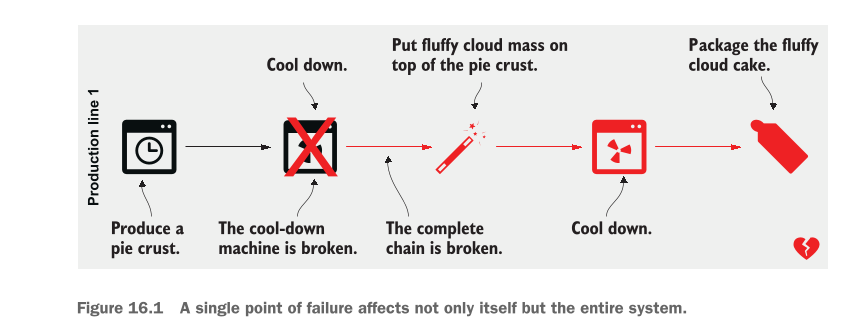
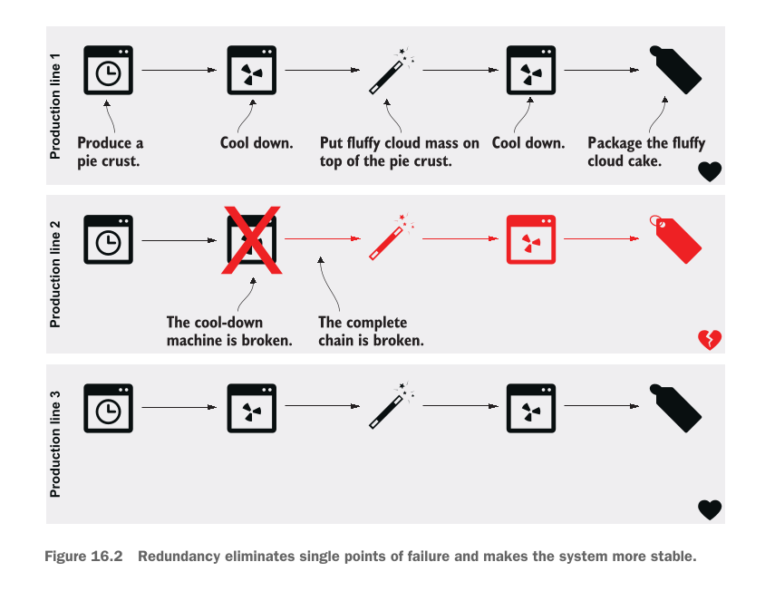
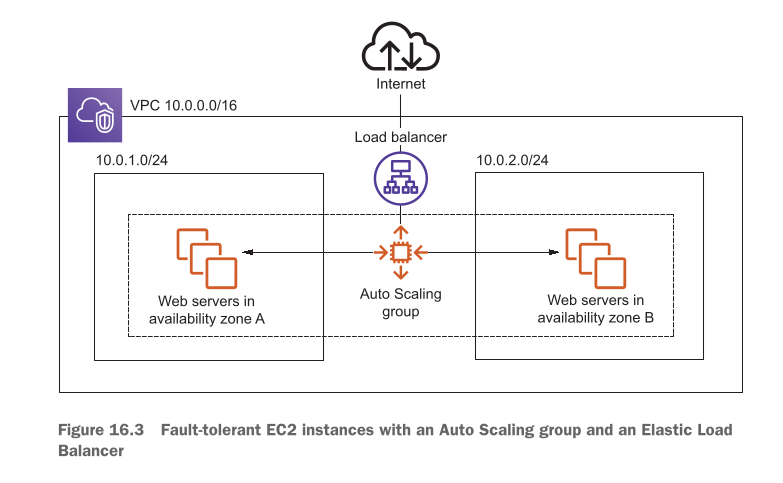
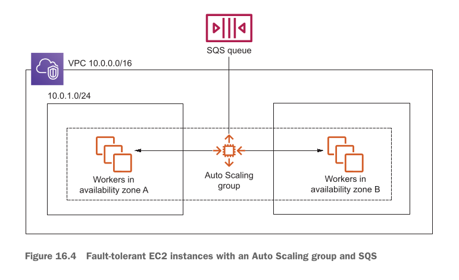

# Designing for fault tolerance

## This chapter covers

* **What fault-tolerance is and why you need it** (Fault tolerance kya hoti hai aur aap ko is ki kyun zaroorat hai)
* **Using redundancy to remove single points of failure** (Redundancy ka istemal karke Single Points of Failure ko khatam karna)
* **Improving fault tolerance by retrying on failure** (Kharabi aane par retries ki madad se fault tolerance ko behtar banana)
* **Using idempotent operations to retry on failure** (Kharabi par bina kisi double effect ke retries ke liye Idempotent operations ka istemal karna)
* **AWS service guarantees** (AWS ki mukhtalif services ki resilience aur availability ki guarantees)

---

### Failure Is Inevitable: Build for Failure

Kainat ka usool hai ke hardware toot sakta hai, network cut sakta hai, aur electricity band ho sakti hai. Software ki dunya mein bhi hard disks ka kharab hona, cables ka tootna ya power supply ka jana aik aam baat hai. Lekin ek zabardast system ka matlab yeh hota hai ke **andar chahe kitni bhi kharabi aaye, bahar baithe user ko pata tak na chale**.

Aik **Fault-Tolerant System** aap ke users ko sab se behtareen quality aur experience deta hai. Aap ke system ke pichay chahe koi server phat jaye ya network down ho jaye, user bilkul be-khauf hokar apna kaam karta rehta hai, videos dekhta rehta hai, online shopping karta hai ya doston se baatein karta rehta hai.

Purane zamane mein (kuch saal pehle) aisa system banana bohot mehnga aur azaab ka kaam hota tha kyunki aap ko duplicate physical servers khareed kar rakhne parhte thay. Lekin **AWS Cloud** ki wajah se ab fault-tolerant systems banana sasta aur ek aam standard ban chuka hai. Phir bhi, cloud computing mein fault-tolerant systems design karna sab se uonchi category (top tier) ka kaam hai aur shuruat mein yeh thoda challenging ho sakta hai.

Fault tolerance ke liye design karne ka matlab hai ke **pehle se yeh maan kar chalna ke har cheez kharab hogi (Build for Failure)** aur system ko aisa banana ke wo kharabi aane par khud hi usay **automatically theek (Self-Heal)** kar le.

---

### Core Architectural Concepts (Pehlu)

#### 1. Avoiding Single Points of Failure (SPOF)

* **SPOF Kya Hai?** Aisa samjhein ke ek cycle ka aik hi chain hai. Agar wo chain toot jaye toh poori cycle ruk jati hai. System mein bhi agar koi aik aisa component ho jiske kharab hone se poora system baith jaye, toh usay Single Point of Failure kehte hain. Fault tolerance ka pehla usool hai ke SPOF ko har keemat par khatam kiya jaye.

#### 2. Redundancy (Duplication)

* Redundancy ka matlab hai **ek ki bajaye ek se zyada ek jaisay components lagana**.
* *Misaal:* Agar aap gaadi mein lambay safar par ja rahe hain, toh aap aik extra spare tyre (stepney) sath rakhte hain. Agar ek tyre puncture ho jaye, toh doosra kaam aata hai. EC2 mein hum apni app ko sirf ek single machine par chalane ke bajaye **multiple machines (fleet)** par baant (distribute) dete hain.

#### 3. Decoupling (Components ko Azaad Karna)

* Architecture ke hissno ko ek doosre se is tarah alag (decouple) karna ke ek hissa agar down bhi ho jaye, toh doosra hissa rukay nahi balkey chalta rahay.
* *Writer ki Example:* Agar aap ka **Database down** ho chuka hai, tab bhi aap ka **Web Server** crash hone ki bajaye user ko purana saved (cached) content dikha de taake screen blank na ho.

---

### AWS Resilience Categories

**Resilience (Muqabla Karne Ki Salahiyat):** Kharabi ka muqabla karne ki aisi salahiyat jisse user par zero ya bohot kam asar pare.

AWS ki tamam services ko un ki resilience aur failure handling ke lehaz se 3 mukhtalif darjo (categories) mein baanta gaya hai:

| Resilience Level | Kharabi Aane Par Kya Hota Hai? | User Par Asar | Recovery Time |
| --- | --- | --- | --- |
| **No Guarantees (SPOF)** | Service mukammal taur par kaam karna band kar deti hai. | Request fail ho jati hai, app band ho jati hai. | Manual intervention zaroori hai. |
| **High Availability (HA)** | Service mein chota sa jhatka lagta hai, lekin system khud ko recover kar leta hai. | Thoda sa interruption/delay aa sakta hai. | Kuch seconds se 1 minute. |
| **Fault Tolerant (FT)** | System ke andar kharabi aane ke bawajood service bilkul pehle ki tarah chalti rehti hai. | **Zero Asar!** User ko pata tak nahi chalta. | Immediate (Instant smooth failover). |

> **Zaroori Mashwara:** Apne system ko fault-tolerant banane ka sab se aasan tareeqaa yeh hai ke aap shuru se hi sirf un AWS services ko use karein jo **by default Fault Tolerant** hain. Agar aap ke tamam building blocks fault tolerant honge, toh aap ka poora system automatically fault tolerant ban jayega.

---

### AWS Services Classification Breakdown

Writer ne AWS ki tamam key services ko un ki resilience capability ke hisab se alag alag divide kiya hai:

#### Category 1: Neither Highly Available nor Fault Tolerant (Single Point of Failure)

Jab aap in services ko akele use karte hain, toh aap apne infrastructure mein SPOF add kar rahe hote hain:

* **Single Amazon EC2 Instance:** Single Virtual Machine kisi bhi waqt hardware issue, network fail, ya Availability Zone (AZ) outage ki wajah se band ho sakti hai.
* *Solution:* Single instance ke bajaye **Auto Scaling groups** ke zariye EC2 instances ka redundant fleet banayein.

* **Single Amazon RDS Instance:** Single database instance bhi EC2 ki tarah crash ho sakta hai.
* *Solution:* High Availability hasil karne ke liye **Multi-AZ mode** enable karein.

#### Category 2: Highly Available (HA) by Default

Yeh services kharabi ke waqt thoda sa downtime leti hain lekin khud hi recover ho jati hain:

* **Elastic Network Interface (ENI):** Network interface ek specific AZ se bound hota hai. Agar wo AZ down ho jaye toh ENI bhi unavailable ho jata hai. Lekin chote outage mein aap ENI ko kisi doosri virtual machine ke sath dobara attach kar sakte hain.
* **Amazon VPC Subnet:** Subnet ek AZ tak mehdood hoti hai. Agar AZ down hua toh subnet tak pohnch band ho jayegi. Is se bachne ke liye multiple AZs mein subnets banayi jati hain.
* **Amazon EBS Volume:** EBS volume ka data ek AZ ke andar multiple storage systems par duplicate hota hai. Lekin agar poora AZ hi fail ho jaye toh volume unavailable ho jayega (data safe rehta hai). Is se bachne ke liye periodic **EBS Snapshots** liye jaate hain taake kisi doosre AZ mein volume recreate kiya ja sake.
* **Amazon RDS Multi-AZ Instance:** Jab RDS Multi-AZ mode mein chalta hai, toh master database fail hone par standby database active hota hai aur DNS records change hone mein lagbhag **1 minute ka chota sa downtime** ata hai.

#### Category 3: Fault Tolerant (FT) by Default

In services ko use karte waqt aap ko kisi failure ka pata tak nahi chalta:

* **Elastic Load Balancing (ELB)** (Kam az kam 2 AZs mein deployed ho)
* **Amazon EC2 Security Groups**
* **Amazon VPC** (Network ACL aur Route Table ke sath)
* **Elastic IP Addresses (EIP)**
* **Amazon Simple Storage Service (S3)**
* **Amazon EBS Snapshots**
* **Amazon DynamoDB**
* **Amazon CloudWatch**
* **Auto Scaling Groups**
* **Amazon Simple Queue Service (SQS)**
* **AWS CloudFormation**
* **AWS Identity and Access Management (IAM)** (Yeh global service hai; ek jagah user banao toh poore dunya ke regions mein milta hai).

---

## Chapter requirements

Is chapter ke practical aur theoretical concepts ko samajhne ke liye aap ko pehle se in baato ka pata hona zaroori hai:

* **Amazon EC2** (Virtual Machines ki basics)
* **Auto Scaling** (Instances ko automatically kam ya zyada karna)
* **Elastic Load Balancing (ELB)** (Traffic ko distribute karna)
* **Simple Queue Service (SQS)** (Messages aur tasks ko queue mein rakhna)

Is chapter ke hands-on project mein hum in tools ka intensive istemal karenge:

* **Amazon DynamoDB** (NoSQL Database)
* **Express Framework** (Node.js par bani hui web application framework)

---

### The Practical Hands-on Application Overview

Is chapter mein aap EC2 instances (jo ke by default fault tolerant nahi hotay) par mabni aik **100% Fault-Tolerant Web Application** design karna seekhein ge.

#### Application Ka Maqsad:

1. User aik image upload karega.
2. System us image par **Sepia Filter** (purana/vintage photo effect) apply karega.
3. User process hui image ko download kar sakega.

#### System Ka Design Step-by-Step:

1. **Workload Distribution:** Task ko aik single machine par chalane ke bajaye hum multiple EC2 instances par baant denge jo alag alag Data Centers (**Availability Zones**) mein chal rahe honge.
2. **Resilience in Code:** Code ko aisa banayein ge ke agar koi task fail ho toh wo crash na ho balkey retries aur idempotent mechanisms ke zariye recover ho.
3. **Complete Fault-Tolerant Infrastructure:** Hum in components ko aapas mein jodein ge:
* **SQS (Queue):** Upload hone walay tasks ko safely manage karne ke liye.
* **ALB (Application Load Balancer):** Traffic ko healthy EC2 instances par bhejne ke liye.
* **Auto Scaling Groups:** Kharab hone walay EC2 instances ko automatically khatam karke naye instances khade karne ke liye.
* **DynamoDB:** Data ko highly available aur fault-tolerant tareeqay se store karne ke liye.

---

## Using redundant EC2 instances to increase availability

Virtual machine (EC2 instance) ke kharab ya crash hone ki do bari wajaat hoti hain: aik hardware/infrastructure ka masla aur doosra aap ke apne application code ka masla.

### 1. Hardware Aur Infrastructure Level Ki Wajaat:

Aap ki virtual machine in wajaat se fail ho sakti hai:

* **Host Hardware Failure:** Jis physical server (computer) par aap ki virtual machine (EC2) chal rahi hai, agar us ka hardware (processor, RAM, motherboard) kharab ho jaye, toh wo aap ki virtual machine ko mazeed nahi chala sakta.
* **Network Interruption:** Physical host computer ka network connection toot jaye ya wire cut jaye, toh virtual machine ka bahar ki dunya se rabta khatam ho jata hai.
* **Power Failure:** Agar physical server ki bijli chali jaye ya power supply phat jaye, toh us par chalne wali virtual machine bhi fauran band ho jati hai.

### 2. Software Aur Application Level Ki Wajaat:

Hardware bilkul theek ho tab bhi aap ka apna software application crash ho sakta hai:

* **Memory Leak (RAM Ka Bhar Jana):** Agar aap ke application code mein aisa bug hai jo RAM use toh karta hai lekin kaam hone ke baad usay khaali (free) nahi karta, toh ahista ahista saari RAM bhar jaye gi. Chahe is mein ek din lage, ek mahina lage ya ek saal, aik din RAM poori tarah khatam ho jaye gi aur EC2 instance crash ho jaye ga.
* **Disk Space Full (Hard Disk Ka Bhar Jana):** Agar aap ka application hard disk par data ya log files write karta rehta hai aur purana data kabhi delete nahi karta, toh jald ya baqaddar hard disk full ho jaye gi aur aap ki app chalna band ho jaye gi.
* **Unhandled Edge Cases:** Software mein koi aisa unexpected error ya unique situation aa jaye jise code mein handle na kiya gaya ho, toh app achanak se crash ho jati hai.

> **Sab Se Bada Decision Aur Conclusion:** Chahe masla physical server ka ho ya aap ke code ka, **aik single EC2 instance hamesha Single Point of Failure (SPOF) hota hai**. Agar aap poore system ke liye sirf ek EC2 par bharosa karenge, toh aap ka system har haal mein fail hoga—yeh sirf waqt ki baat hai ke kab hota hai.

---

## Redundancy can remove a single point of failure

SPOF ko khatam karne ke liye hum **Redundancy** (yaani ek se zyada duplicate components) ka istemal karte hain.

### Real-World Example: Fluffy Cloud Pies Ki Factory

Bacho ki tarah samajhne ke liye aik bakery ki misaal lete hain jo "Fluffy Cloud Pies" (halke phulke cloud wale cake) banati hai. Is pie ko banane ke 5 aasan steps hain:

1. Pie ki crust (neeche wali biscuit layer) banana.
2. Crust ko thanda (cool down) karna.
3. Crust ke upar fluffy cloud mass (cream/topping) lagana.
4. Poore pie ko dobara thanda karna.
5. Pie ko pack (package) karna.

#### Masla (Single Production Line):

Pehle se setup mein bakery ke paas sirf **aik hi production line** hai. Masla yeh hai ke agar is poore process mein koi aik step bhi kharab ho jaye, toh poori bakery ka kaam ruk jata hai.

* **Figure 16.1 Ka Hawala Aur Breakdown:**

  

* `Figure 16.1` mein dekhein, yahan "Production line 1" dikhayi gayi hai.
* Step 2 (Cool down machine) par laal rang ka cross ($X$) laga hai, jis ka matlab hai ke machine kharab ho gayi hai ("The cool-down machine is broken").
* Is ke waja se aage laal arrows aur akhir mein ek laal toota hua dil (broken heart) dikhaya gaya hai, jiska matlab hai ke poori chain toot chuki hai ("The complete chain is broken"). Aage wale steps 3, 4, aur 5 ko thandi crust milegi hi nahi, toh wo aage kaam hi nahi kar sakte.

#### Hal (Multiple Production Lines / Redundancy):

Aik line lagane ke bajaye bakery mein **3 alag alag production lines** laga di jayein, jo shuru se lekar packing tak alag alag kaam karein. Agar aik line ki machine kharab bhi ho jaye, toh baqi 2 lines chalti rahegi aur dunya bhar ke bhooke customers ko pies milti rahegi.

* **Figure 16.2 Ka Hawala Aur Breakdown:**

  

* `Figure 16.2` mein dekhein, yahan 3 lines hain: Production line 1, Production line 2, aur Production line 3.
* Production line 2 mein Step 2 (cool down) kharab ho gaya hai (laal cross aur broken heart).
* Lekin Production line 1 aur Production line 3 bilkul sahi chal rahi hain (kaala dil = success). System abhi bhi chal raha hai!
* **Trade-off (Nuksan/Kharach):** Is ka aik hi chota sa nuksan hai ke aap ko 3 guna zyada machines khareedni parhti hain.

#### EC2 Par Redundancy Kaise Apply Hoti Hai?

Bilkul bakery ki tarah, aik EC2 instance chalane ke bajaye aap **3 EC2 instances** chalayein. Agar aik instance fail bhi ho jaye, toh baqi 2 instances aane wali requests ko sambhaalte rahenge.

**Kharchay (Cost) Ka Smart Decision:**
3 instances ka kharcha bachane ke liye aap aik bara (large) EC2 instance chalane ke bajaye **3 chote (small) EC2 instances** chalayein. Is se aap ka kharcha taqreeban utna hi rahega lekin system highly available ho jaye ga!

**Naya Challenge:** Jab 3 virtual machines chal rahi hongi, toh user/client ko kaise pata chalega ke kis EC2 se baat karni hai? Is ka jawab hai **Decoupling** (yaani client aur EC2 ke beech mein Load Balancer ya Message Queue lagana).

---

## Redundancy requires decoupling

Client aur EC2 instances ke darmiyan direct rishta khatam karne (decouple karne) ke do sab se behtareen tareeqay hain: **Elastic Load Balancing (ELB)** aur **Simple Queue Service (SQS)**.

### Model 1: Synchronous Decoupling (Load Balancer Ke Sath)

* **Figure 16.3 Ka Hawala Aur Complete Breakdown:**

  

* Yahan `Figure 16.3` mein aik VPC (`10.0.0.0/16`) ke andar system ka architecture dikhaya gaya hai.
* Internet se aane waali tamaam traffic sab se pehle **Load Balancer** par aati hai.
* System do alag alag **Availability Zones (AZ A aur AZ B)** par phaila hua hai.
* AZ A ke andar Subnet `10.0.1.0/24` hai aur AZ B ke andar Subnet `10.0.2.0/24` hai.
* Dono subnets ke andar **Web Servers (EC2 instances)** chal rahe hain jo ek **Auto Scaling group** ke under manage ho rahe hain.

#### Jab Koi EC2 Instance Crash Hota Hai Toh Kya Hota Hai? (Step-by-Step):

1. Jab aik EC2 instance crash hota hai, **Load Balancer** fauran detection (health check) karta hai aur us kharab instance ko traffic bhejna **band (stop)** kar deta hai.
2. **Auto Scaling group** fauran us kharab EC2 ko terminate karta hai aur kuch hi minto (minutes) mein aik **naya EC2 instance** create kar deta hai.
3. Jaise hi naya EC2 ready hota hai, **Load Balancer** us naye instance ko requests bhejna shuru kar deta hai.

#### Figure 16.3 Mein Kitni Redundancy Hai?

* **Availability Zones (AZs):** Yahan 2 AZs use ho rahe hain. Agar aik poora Data Center (AZ) bhi kisi wajah se band ho jaye, tab bhi doosre AZ mein hamare EC2 instances chal rahe hote hain.
* **Subnets:** Subnet hamesha aik specific AZ se judi hoti hai, is liye hum ne har AZ mein alag subnet banayi hai (`10.0.1.0/24` aur `10.0.2.0/24`).
* **EC2 Instances:** Multiple subnets mein multiple instances chalne se AZ level par redundancy milti hai.
* **Load Balancer:** Load balancer multiple subnets aur multiple AZs par phaila hota hai.

---

### Model 2: Asynchronous Decoupling (SQS Queue Ke Sath)

* **Figure 16.4 Ka Hawala Aur Breakdown:**

  

* `Figure 16.4` mein EC2 instances ko asynchronous tareeqay se SQS Queue ke sath joda gaya hai.
* Client ki request seedha EC2 par nahi jati balkey **SQS Queue** mein jama hoti hai.
* VPC ke andar, Auto Scaling Group dono AZs (Subnet `10.0.1.0/24` aur Subnet B) mein **Worker EC2 instances** ko manage kar raha hai.
* Yahan Workers queue se akele akele messages utha kar process karte hain. Agar koi Worker EC2 crash bhi ho jaye, toh message SQS queue mein safe rehta hai aur doosra worker usay utha kar process kar leta hai.

---

### Ek Bohot Zaroori Architectural Point

Agar aap `Figure 16.3` aur `Figure 16.4` ko ghaor se dekhein, toh Load Balancer aur SQS Queue ki aik aik hi icon/box dikhayi gayi hai.

Is ka yeh matlab bilkul nahi hai ke Load Balancer ya SQS khud Single Point of Failure (SPOF) hain. **ELB aur SQS AWS ki taraf se default taur par Fault-Tolerant services hain**. AWS background mein inhein multiple AZs par khud hi highly available rakhta hai, is liye aap ko in ki kharabi ki fikar karne ki zaroorat nahi hoti.

---