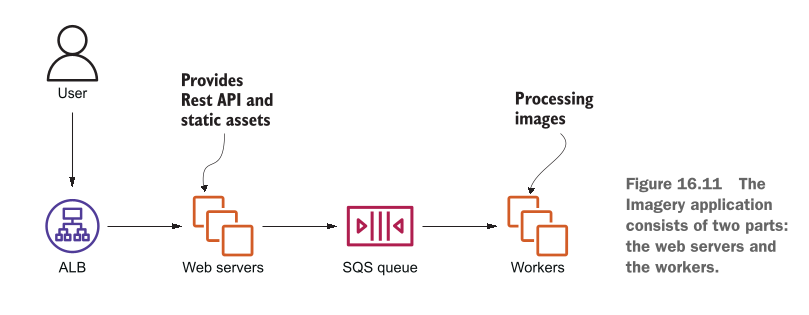
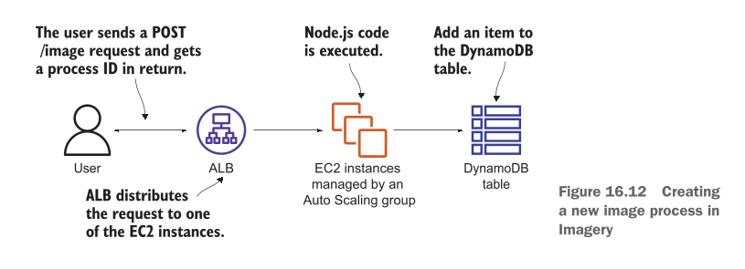
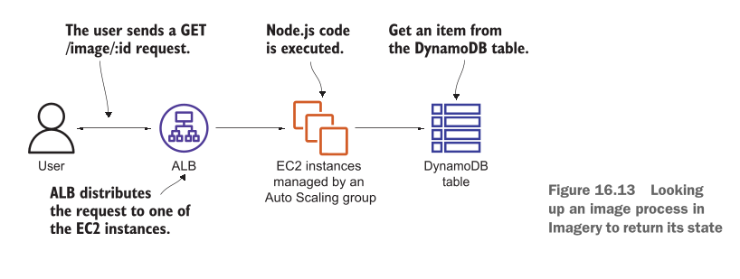
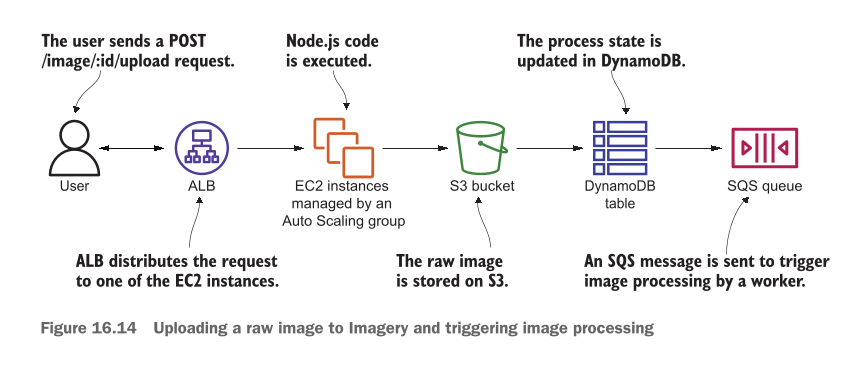
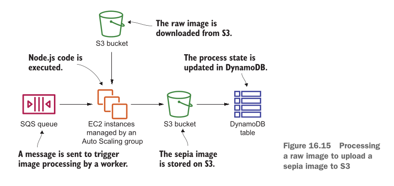
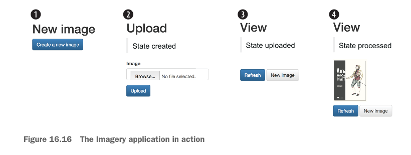

# Designing for fault tolerance

## This chapter covers

* **What fault-tolerance is and why you need it** (Fault tolerance kya hoti hai aur aap ko is ki kyun zaroorat hai)
* **Using redundancy to remove single points of failure** (Redundancy ka istemal karke Single Points of Failure ko khatam karna)
* **Improving fault tolerance by retrying on failure** (Kharabi aane par retries ki madad se fault tolerance ko behtar banana)
* **Using idempotent operations to retry on failure** (Kharabi par bina kisi double effect ke retries ke liye Idempotent operations ka istemal karna)
* **AWS service guarantees** (AWS ki mukhtalif services ki resilience aur availability ki guarantees)

---

### Failure Is Inevitable: Build for Failure

Kainat ka usool hai ke hardware toot sakta hai, network cut sakta hai, aur electricity band ho sakti hai. Software ki dunya mein bhi hard disks ka kharab hona, cables ka tootna ya power supply ka jana aik aam baat hai. Lekin ek zabardast system ka matlab yeh hota hai ke **andar chahe kitni bhi kharabi aaye, bahar baithe user ko pata tak na chale**.

Aik **Fault-Tolerant System** aap ke users ko sab se behtareen quality aur experience deta hai. Aap ke system ke pichay chahe koi server phat jaye ya network down ho jaye, user bilkul be-khauf hokar apna kaam karta rehta hai, videos dekhta rehta hai, online shopping karta hai ya doston se baatein karta rehta hai.

Purane zamane mein (kuch saal pehle) aisa system banana bohot mehnga aur azaab ka kaam hota tha kyunki aap ko duplicate physical servers khareed kar rakhne parhte thay. Lekin **AWS Cloud** ki wajah se ab fault-tolerant systems banana sasta aur ek aam standard ban chuka hai. Phir bhi, cloud computing mein fault-tolerant systems design karna sab se uonchi category (top tier) ka kaam hai aur shuruat mein yeh thoda challenging ho sakta hai.

Fault tolerance ke liye design karne ka matlab hai ke **pehle se yeh maan kar chalna ke har cheez kharab hogi (Build for Failure)** aur system ko aisa banana ke wo kharabi aane par khud hi usay **automatically theek (Self-Heal)** kar le.

---

### Core Architectural Concepts (Pehlu)

#### 1. Avoiding Single Points of Failure (SPOF)

* **SPOF Kya Hai?** Aisa samjhein ke ek cycle ka aik hi chain hai. Agar wo chain toot jaye toh poori cycle ruk jati hai. System mein bhi agar koi aik aisa component ho jiske kharab hone se poora system baith jaye, toh usay Single Point of Failure kehte hain. Fault tolerance ka pehla usool hai ke SPOF ko har keemat par khatam kiya jaye.

#### 2. Redundancy (Duplication)

* Redundancy ka matlab hai **ek ki bajaye ek se zyada ek jaisay components lagana**.
* *Misaal:* Agar aap gaadi mein lambay safar par ja rahe hain, toh aap aik extra spare tyre (stepney) sath rakhte hain. Agar ek tyre puncture ho jaye, toh doosra kaam aata hai. EC2 mein hum apni app ko sirf ek single machine par chalane ke bajaye **multiple machines (fleet)** par baant (distribute) dete hain.

#### 3. Decoupling (Components ko Azaad Karna)

* Architecture ke hissno ko ek doosre se is tarah alag (decouple) karna ke ek hissa agar down bhi ho jaye, toh doosra hissa rukay nahi balkey chalta rahay.
* *Writer ki Example:* Agar aap ka **Database down** ho chuka hai, tab bhi aap ka **Web Server** crash hone ki bajaye user ko purana saved (cached) content dikha de taake screen blank na ho.

---

### AWS Resilience Categories

**Resilience (Muqabla Karne Ki Salahiyat):** Kharabi ka muqabla karne ki aisi salahiyat jisse user par zero ya bohot kam asar pare.

AWS ki tamam services ko un ki resilience aur failure handling ke lehaz se 3 mukhtalif darjo (categories) mein baanta gaya hai:

| Resilience Level | Kharabi Aane Par Kya Hota Hai? | User Par Asar | Recovery Time |
| --- | --- | --- | --- |
| **No Guarantees (SPOF)** | Service mukammal taur par kaam karna band kar deti hai. | Request fail ho jati hai, app band ho jati hai. | Manual intervention zaroori hai. |
| **High Availability (HA)** | Service mein chota sa jhatka lagta hai, lekin system khud ko recover kar leta hai. | Thoda sa interruption/delay aa sakta hai. | Kuch seconds se 1 minute. |
| **Fault Tolerant (FT)** | System ke andar kharabi aane ke bawajood service bilkul pehle ki tarah chalti rehti hai. | **Zero Asar!** User ko pata tak nahi chalta. | Immediate (Instant smooth failover). |

> **Zaroori Mashwara:** Apne system ko fault-tolerant banane ka sab se aasan tareeqaa yeh hai ke aap shuru se hi sirf un AWS services ko use karein jo **by default Fault Tolerant** hain. Agar aap ke tamam building blocks fault tolerant honge, toh aap ka poora system automatically fault tolerant ban jayega.

---

### AWS Services Classification Breakdown

Writer ne AWS ki tamam key services ko un ki resilience capability ke hisab se alag alag divide kiya hai:

#### Category 1: Neither Highly Available nor Fault Tolerant (Single Point of Failure)

Jab aap in services ko akele use karte hain, toh aap apne infrastructure mein SPOF add kar rahe hote hain:

* **Single Amazon EC2 Instance:** Single Virtual Machine kisi bhi waqt hardware issue, network fail, ya Availability Zone (AZ) outage ki wajah se band ho sakti hai.
* *Solution:* Single instance ke bajaye **Auto Scaling groups** ke zariye EC2 instances ka redundant fleet banayein.


* **Single Amazon RDS Instance:** Single database instance bhi EC2 ki tarah crash ho sakta hai.
* *Solution:* High Availability hasil karne ke liye **Multi-AZ mode** enable karein.


#### Category 2: Highly Available (HA) by Default

Yeh services kharabi ke waqt thoda sa downtime leti hain lekin khud hi recover ho jati hain:

* **Elastic Network Interface (ENI):** Network interface ek specific AZ se bound hota hai. Agar wo AZ down ho jaye toh ENI bhi unavailable ho jata hai. Lekin chote outage mein aap ENI ko kisi doosri virtual machine ke sath dobara attach kar sakte hain.
* **Amazon VPC Subnet:** Subnet ek AZ tak mehdood hoti hai. Agar AZ down hua toh subnet tak pohnch band ho jayegi. Is se bachne ke liye multiple AZs mein subnets banayi jati hain.
* **Amazon EBS Volume:** EBS volume ka data ek AZ ke andar multiple storage systems par duplicate hota hai. Lekin agar poora AZ hi fail ho jaye toh volume unavailable ho jayega (data safe rehta hai). Is se bachne ke liye periodic **EBS Snapshots** liye jaate hain taake kisi doosre AZ mein volume recreate kiya ja sake.
* **Amazon RDS Multi-AZ Instance:** Jab RDS Multi-AZ mode mein chalta hai, toh master database fail hone par standby database active hota hai aur DNS records change hone mein lagbhag **1 minute ka chota sa downtime** ata hai.

#### Category 3: Fault Tolerant (FT) by Default

In services ko use karte waqt aap ko kisi failure ka pata tak nahi chalta:

* **Elastic Load Balancing (ELB)** (Kam az kam 2 AZs mein deployed ho)
* **Amazon EC2 Security Groups**
* **Amazon VPC** (Network ACL aur Route Table ke sath)
* **Elastic IP Addresses (EIP)**
* **Amazon Simple Storage Service (S3)**
* **Amazon EBS Snapshots**
* **Amazon DynamoDB**
* **Amazon CloudWatch**
* **Auto Scaling Groups**
* **Amazon Simple Queue Service (SQS)**
* **AWS CloudFormation**
* **AWS Identity and Access Management (IAM)** (Yeh global service hai; ek jagah user banao toh poore dunya ke regions mein milta hai).

---

## Chapter requirements

Is chapter ke practical aur theoretical concepts ko samajhne ke liye aap ko pehle se in baato ka pata hona zaroori hai:

* **Amazon EC2** (Virtual Machines ki basics)
* **Auto Scaling** (Instances ko automatically kam ya zyada karna)
* **Elastic Load Balancing (ELB)** (Traffic ko distribute karna)
* **Simple Queue Service (SQS)** (Messages aur tasks ko queue mein rakhna)

Is chapter ke hands-on project mein hum in tools ka intensive istemal karenge:

* **Amazon DynamoDB** (NoSQL Database)
* **Express Framework** (Node.js par bani hui web application framework)

---

### The Practical Hands-on Application Overview

Is chapter mein aap EC2 instances (jo ke by default fault tolerant nahi hotay) par mabni aik **100% Fault-Tolerant Web Application** design karna seekhein ge.

#### Application Ka Maqsad:

1. User aik image upload karega.
2. System us image par **Sepia Filter** (purana/vintage photo effect) apply karega.
3. User process hui image ko download kar sakega.

#### System Ka Design Step-by-Step:

1. **Workload Distribution:** Task ko aik single machine par chalane ke bajaye hum multiple EC2 instances par baant denge jo alag alag Data Centers (**Availability Zones**) mein chal rahe honge.
2. **Resilience in Code:** Code ko aisa banayein ge ke agar koi task fail ho toh wo crash na ho balkey retries aur idempotent mechanisms ke zariye recover ho.
3. **Complete Fault-Tolerant Infrastructure:** Hum in components ko aapas mein jodein ge:
* **SQS (Queue):** Upload hone walay tasks ko safely manage karne ke liye.
* **ALB (Application Load Balancer):** Traffic ko healthy EC2 instances par bhejne ke liye.
* **Auto Scaling Groups:** Kharab hone walay EC2 instances ko automatically khatam karke naye instances khade karne ke liye.
* **DynamoDB:** Data ko highly available aur fault-tolerant tareeqay se store karne ke liye.

---

## Using redundant EC2 instances to increase availability

Virtual machine (EC2 instance) ke kharab ya crash hone ki do bari wajaat hoti hain: aik hardware/infrastructure ka masla aur doosra aap ke apne application code ka masla.

### 1. Hardware Aur Infrastructure Level Ki Wajaat:

Aap ki virtual machine in wajaat se fail ho sakti hai:

* **Host Hardware Failure:** Jis physical server (computer) par aap ki virtual machine (EC2) chal rahi hai, agar us ka hardware (processor, RAM, motherboard) kharab ho jaye, toh wo aap ki virtual machine ko mazeed nahi chala sakta.
* **Network Interruption:** Physical host computer ka network connection toot jaye ya wire cut jaye, toh virtual machine ka bahar ki dunya se rabta khatam ho jata hai.
* **Power Failure:** Agar physical server ki bijli chali jaye ya power supply phat jaye, toh us par chalne wali virtual machine bhi fauran band ho jati hai.

### 2. Software Aur Application Level Ki Wajaat:

Hardware bilkul theek ho tab bhi aap ka apna software application crash ho sakta hai:

* **Memory Leak (RAM Ka Bhar Jana):** Agar aap ke application code mein aisa bug hai jo RAM use toh karta hai lekin kaam hone ke baad usay khaali (free) nahi karta, toh ahista ahista saari RAM bhar jaye gi. Chahe is mein ek din lage, ek mahina lage ya ek saal, aik din RAM poori tarah khatam ho jaye gi aur EC2 instance crash ho jaye ga.
* **Disk Space Full (Hard Disk Ka Bhar Jana):** Agar aap ka application hard disk par data ya log files write karta rehta hai aur purana data kabhi delete nahi karta, toh jald ya baqaddar hard disk full ho jaye gi aur aap ki app chalna band ho jaye gi.
* **Unhandled Edge Cases:** Software mein koi aisa unexpected error ya unique situation aa jaye jise code mein handle na kiya gaya ho, toh app achanak se crash ho jati hai.

> **Sab Se Bada Decision Aur Conclusion:** Chahe masla physical server ka ho ya aap ke code ka, **aik single EC2 instance hamesha Single Point of Failure (SPOF) hota hai**. Agar aap poore system ke liye sirf ek EC2 par bharosa karenge, toh aap ka system har haal mein fail hoga—yeh sirf waqt ki baat hai ke kab hota hai.

---

## Redundancy can remove a single point of failure

SPOF ko khatam karne ke liye hum **Redundancy** (yaani ek se zyada duplicate components) ka istemal karte hain.

### Real-World Example: Fluffy Cloud Pies Ki Factory

Bacho ki tarah samajhne ke liye aik bakery ki misaal lete hain jo "Fluffy Cloud Pies" (halke phulke cloud wale cake) banati hai. Is pie ko banane ke 5 aasan steps hain:

1. Pie ki crust (neeche wali biscuit layer) banana.
2. Crust ko thanda (cool down) karna.
3. Crust ke upar fluffy cloud mass (cream/topping) lagana.
4. Poore pie ko dobara thanda karna.
5. Pie ko pack (package) karna.

#### Masla (Single Production Line):

Pehle se setup mein bakery ke paas sirf **aik hi production line** hai. Masla yeh hai ke agar is poore process mein koi aik step bhi kharab ho jaye, toh poori bakery ka kaam ruk jata hai.

* **Figure 16.1 Ka Hawala Aur Breakdown:**

<div align="center">
  
</div>

* `Figure 16.1` mein dekhein, yahan "Production line 1" dikhayi gayi hai.
* Step 2 (Cool down machine) par laal rang ka cross ($X$) laga hai, jis ka matlab hai ke machine kharab ho gayi hai ("The cool-down machine is broken").
* Is ke waja se aage laal arrows aur akhir mein ek laal toota hua dil (broken heart) dikhaya gaya hai, jiska matlab hai ke poori chain toot chuki hai ("The complete chain is broken"). Aage wale steps 3, 4, aur 5 ko thandi crust milegi hi nahi, toh wo aage kaam hi nahi kar sakte.


#### Hal (Multiple Production Lines / Redundancy):

Aik line lagane ke bajaye bakery mein **3 alag alag production lines** laga di jayein, jo shuru se lekar packing tak alag alag kaam karein. Agar aik line ki machine kharab bhi ho jaye, toh baqi 2 lines chalti rahegi aur dunya bhar ke bhooke customers ko pies milti rahegi.

* **Figure 16.2 Ka Hawala Aur Breakdown:**

<div align="center">
  
</div>

* `Figure 16.2` mein dekhein, yahan 3 lines hain: Production line 1, Production line 2, aur Production line 3.
* Production line 2 mein Step 2 (cool down) kharab ho gaya hai (laal cross aur broken heart).
* Lekin Production line 1 aur Production line 3 bilkul sahi chal rahi hain (kaala dil = success). System abhi bhi chal raha hai!
* **Trade-off (Nuksan/Kharach):** Is ka aik hi chota sa nuksan hai ke aap ko 3 guna zyada machines khareedni parhti hain.


#### EC2 Par Redundancy Kaise Apply Hoti Hai?

Bilkul bakery ki tarah, aik EC2 instance chalane ke bajaye aap **3 EC2 instances** chalayein. Agar aik instance fail bhi ho jaye, toh baqi 2 instances aane wali requests ko sambhaalte rahenge.

**Kharchay (Cost) Ka Smart Decision:**
3 instances ka kharcha bachane ke liye aap aik bara (large) EC2 instance chalane ke bajaye **3 chote (small) EC2 instances** chalayein. Is se aap ka kharcha taqreeban utna hi rahega lekin system highly available ho jaye ga!

**Naya Challenge:** Jab 3 virtual machines chal rahi hongi, toh user/client ko kaise pata chalega ke kis EC2 se baat karni hai? Is ka jawab hai **Decoupling** (yaani client aur EC2 ke beech mein Load Balancer ya Message Queue lagana).

---

## Redundancy requires decoupling

Client aur EC2 instances ke darmiyan direct rishta khatam karne (decouple karne) ke do sab se behtareen tareeqay hain: **Elastic Load Balancing (ELB)** aur **Simple Queue Service (SQS)**.

### Model 1: Synchronous Decoupling (Load Balancer Ke Sath)

* **Figure 16.3 Ka Hawala Aur Complete Breakdown:**

<div align="center">
  
</div>

* Yahan `Figure 16.3` mein aik VPC (`10.0.0.0/16`) ke andar system ka architecture dikhaya gaya hai.
* Internet se aane waali tamaam traffic sab se pehle **Load Balancer** par aati hai.
* System do alag alag **Availability Zones (AZ A aur AZ B)** par phaila hua hai.
* AZ A ke andar Subnet `10.0.1.0/24` hai aur AZ B ke andar Subnet `10.0.2.0/24` hai.
* Dono subnets ke andar **Web Servers (EC2 instances)** chal rahe hain jo ek **Auto Scaling group** ke under manage ho rahe hain.


#### Jab Koi EC2 Instance Crash Hota Hai Toh Kya Hota Hai? (Step-by-Step):

1. Jab aik EC2 instance crash hota hai, **Load Balancer** fauran detection (health check) karta hai aur us kharab instance ko traffic bhejna **band (stop)** kar deta hai.
2. **Auto Scaling group** fauran us kharab EC2 ko terminate karta hai aur kuch hi minto (minutes) mein aik **naya EC2 instance** create kar deta hai.
3. Jaise hi naya EC2 ready hota hai, **Load Balancer** us naye instance ko requests bhejna shuru kar deta hai.

#### Figure 16.3 Mein Kitni Redundancy Hai?

* **Availability Zones (AZs):** Yahan 2 AZs use ho rahe hain. Agar aik poora Data Center (AZ) bhi kisi wajah se band ho jaye, tab bhi doosre AZ mein hamare EC2 instances chal rahe hote hain.
* **Subnets:** Subnet hamesha aik specific AZ se judi hoti hai, is liye hum ne har AZ mein alag subnet banayi hai (`10.0.1.0/24` aur `10.0.2.0/24`).
* **EC2 Instances:** Multiple subnets mein multiple instances chalne se AZ level par redundancy milti hai.
* **Load Balancer:** Load balancer multiple subnets aur multiple AZs par phaila hota hai.

---

### Model 2: Asynchronous Decoupling (SQS Queue Ke Sath)

* **Figure 16.4 Ka Hawala Aur Breakdown:**

<div align="center">
  
</div>

* `Figure 16.4` mein EC2 instances ko asynchronous tareeqay se SQS Queue ke sath joda gaya hai.
* Client ki request seedha EC2 par nahi jati balkey **SQS Queue** mein jama hoti hai.
* VPC ke andar, Auto Scaling Group dono AZs (Subnet `10.0.1.0/24` aur Subnet B) mein **Worker EC2 instances** ko manage kar raha hai.
* Yahan Workers queue se akele akele messages utha kar process karte hain. Agar koi Worker EC2 crash bhi ho jaye, toh message SQS queue mein safe rehta hai aur doosra worker usay utha kar process kar leta hai.


---

### Ek Bohot Zaroori Architectural Point

Agar aap `Figure 16.3` aur `Figure 16.4` ko ghaor se dekhein, toh Load Balancer aur SQS Queue ki aik aik hi icon/box dikhayi gayi hai.

Is ka yeh matlab bilkul nahi hai ke Load Balancer ya SQS khud Single Point of Failure (SPOF) hain. **ELB aur SQS AWS ki taraf se default taur par Fault-Tolerant services hain**. AWS background mein inhein multiple AZs par khud hi highly available rakhta hai, is liye aap ko in ki kharabi ki fikar karne ki zaroorat nahi hoti.


---

## Considerations for making your code fault tolerant

Agar aap apne poore system ko **fault-tolerant** (kharabi ke bawajood chalne wala) banana chahte hain, toh sirf infrastructure (servers) redundant karna kaafi nahi hai. Aap ko apna **application code** bhi usi hisab se design karna padega.

Code ko fault-tolerant banane ke liye writer ne **2 sab se zaroori usool (rules)** bataye hain:

1. **Failure aane par code ko crash hone do, lekin retries (dobara koshish) bhi karo.**
2. **Jahan tak ho sake, hamesha Idempotent Code likho.**

---

## Let it crash, but also retry

Programming ki dunya mein **Erlang** naam ki language apne ek mashhoor concept **"Let it crash"** (jaise hi koi masala aaye, program ko crash hone do / Fail Fast) ki wajah se jani jati hai. Is ka matlab hai ke jab program ko samajh na aaye ke aage kya karna hai, toh wo zabardasti chalne ke bajaye fauran crash ho jaye.

Lekin log sab se bari ghalti yeh karte hain ke wo sirf "crash" ko yaad rakhte hain aur **"retry"** (dobara koshish karne) ko bhool jaate hain!

* **Masla:** Agar aap ka system crash hone ke baad dobara koshish (retry) nahi karega, toh aap ka poora system down ho jaye ga—jo ke fault tolerance ke bilkul khilaf hai.

Writer ne is concept ko **Synchronous** aur **Asynchronous** dono tareeqon mein samjhaya hai:

### 1. Synchronous Decoupled Scenario Mein Retry:

Is scenario mein request bhejney walay (Sender/Client) ko khud retry ki logic likhni parhti hai. Agar aik makhsoos waqt (timeout) tak response na aaye ya error milay, toh sender dobara wahi request bhejta hai.

### 2. Asynchronous Decoupled Scenario Mein Retry:

Is scenario mein retries ka kaam bohot aasan hota hai kyunki yeh **default taur par built-in** hota hai!

* *Misaal:* Jab queue (jaise SQS) se koi worker message uthata hai, agar wo worker crash ho jaye aur aik makhsoos waqt tak queue ko kamyabi ka ishara (acknowledgement) na de, toh message automatic wapas queue mein chala jata hai. Is ke baad agla worker us message ko utha kar dobara process (retry) kar leta hai.

### Crash Kab Karwana Chahiye Aur Kab Nahi? (Bacho Ki Tarah Aasaan Samjhein)

* **Jab Crash NAHI Karwana Chahiye:** Agar user ne galat data bhej diya hai (jaise form mein email ki jagah naam likh diya), toh server ko crash karne ka koi faida nahi! Aap chahe 100 baar retry kar lein, user ka galat data sahi nahi ho jaye ga.
* **Jab Crash Karwana CHAHIYE:** Agar aap ka server Database se connect nahi ho pa raha (network issue ki wajah se), toh server ko crash hone do aur retry karo. Kyunki 2-3 seconds baad jab network theek hoga, toh retry hone par request successfully process ho jaye gi.

### Retry Ka Sab Se Bada Khatra (The Danger of Retries):

Aap ek blog post create kar rahe hain. Pehli baar request gayi, database mein post save ho gayi, lekin response raste mein network issue ki wajah se zaya ho gaya. Client ko laga request fail ho gayi, us ne **Retry** kar diya.

* **Natija:** Database mein ek hi blog post do (2) baar duplicate ho jaye gi!
Is duplicates ke maslay ko hal karne ke liye hum **Idempotent Retry** ka istemal karte hain.

---

## Idempotent retry makes fault tolerance possible

**Idempotency (Aisa Kaam Jo Bar Bar Karne Se Badal Na Jaye):**
Idempotent ka matlab hai ke aap kisi action ko **aik baar karein ya 100 baar karein, us ka aakhri outcome/natija hamesha bilkul SEHSAM (SAME) hi rahega**.

* **Nadan/Aasan Tareeqaa (Naive Approach):** Blog post ke **Title** ko database ki Primary Key bana do. Jab retry hoga, toh database dekhega ke is title ki post pehle se majood hai, toh wo doosri post insert karne ke bajaye skip kar dega.

Lekin asal dunya mein blog post create karne ka process thoda complex hota hai aur us mein **3 steps** hotay hain. Aayein in teeno steps ko aik aik kar ke detail se samjhte hain:

---

### 1. CREATE A BLOG POST ENTRY IN THE DATABASE

Title ko primary key banane ke bajaye hum client side par ek **UUID (Universally Unique Identifier)** generate karte hain (jaise: `550e8400-e29b-11d4-a716-446655440000`). UUID ek aisa unique random code hota hai ke dunya mein do sehnay jaisay UUID banne ka chance lagbhag zero hota hai.

Client request bhejte waqt UUID, Title, aur Text bhejta hai. Server DB mein check karta hai ke kya yeh UUID pehle se majood hai?

* Agar nahi hai -> Nayi entry add kar do.
* Agar pehle se hai -> Insertion skip kar ke aage barh jao.

#### Figure 16.5 Ka Hawala Aur Step-by-Step Breakdown:

`Figure 16.5` mein idempotent database insert ka poora flow dikhaya gaya hai:

<div align="center">
  
</div>

1. **Initial Event:** Blog post jiske sath UUID majood hai, wo database mein save hone ke liye aati hai.
2. **Decision Box (Is the UUID already in the database?):**
* **NO:** Agar UUID pehle se majood nahi hai, toh flowchart **"Create database entry"** wale box par jata hai aur entry save karke process khatam (**End**) ho jata hai.
* **YES:** Agar UUID pehle se database mein majood hai (kyunki yeh retry request hai), toh flowchart bina koi duplicate entry banaye seedha **End** (double circle) par chala jata hai.


#### Database Ke Zariye Idempotency Handle Karna (3 Options):

Code mein logic likhne ke bajaye aap seedha Database ko insert command bhej kar bhi yeh handle kar sakte hain. Jab aap Insert ki command bhejenge toh 3 cheezein ho sakti hain:

1. **Database data insert kar deta hai:** Operation kamyab ho gaya!
2. **Database primary key duplicate hone ka error deta hai:** Is ka matlab hai pehle hi insert ho chuka tha, operation kamyab samjha jaye ga!
3. **Database koi aur maslay ka error deta hai:** Application crash ho jaye gi aur retry karegi.

---

### 2. INVALIDATE THE CACHE

Jab naya blog post ban jata hai, toh puranay saved data (cache) ko khatam (invalidate) karna parhta hai taake users ko naya post nazar aaye.

Is step mein idempotency ki zyada fikar karne ki zaroorat nahi hoti:

* Agar retry ki wajah se cache **ek se zyada baar bhi clear/invalidate ho jaye**, toh is se koi nuksan nahi hota.
* Agli baar jab koi user request karega, toh cache khaali milegi, system database se naya data utha kar dobara cache mein rakh dega.
* **Trade-off / Bura se bura outcome:** Zyada se zyada database par do teen extra queries parh jayengi, jo ke koi bara masla nahi hai.

---

### 3. POST TO THE BLOG'S TWITTER FEED

Sab se mushkil kaam kisi teesri party (Third-Party API jaise Twitter/X) ke sath deal karna hai, kyunki un ke paas built-in idempotency ki guarantees nahi hoti.

Dunya ka koi aisa solution nahi hai jo 100% guarantee de ke Twitter par **exact ek (1) baar** hi tweet post hogi. Aap ko do mein se kisi ek option ko chunna padega:

* **At least once (Kam az kam ek baar):** 1 ya 1 se zyada tweets ho sakti hain.
* **At most most once (Zyada se zyada ek baar):** 1 tweet hogi ya shayad 0 (bilkul nahi) hogi.

#### Figure 16.6 Ka Hawala Aur Breakdown (Dono Solutions Ka Muqabla):

`Figure 16.6` mein Twitter par status share karne ke 2 mukhtalif solutions ka flow chart dikhaya gaya hai:

<div align="center">
  
</div>
```

* **Solution 1 (Twitter API se poochna):**
* Flowchart mein dekhein: Pehle Twitter API se pucha jata hai ke kya yeh status pehle se majood hai? Agar `No`, toh status create kar do. Agar `Yes`, toh skip kar do.
* **Khamiyan (The Problem):** Twitter aik **Eventually Consistent** system hai. Is ka matlab hai ke tweet karne ke fauran baad agar aap Twitter se poochhenge, toh shayad Twitter boley ke "nahi hai status" (kyunki data sync hone mein kuch milliseconds lagte hain). Is chakkar mein duplicate tweet post ho sakti hai.


* **Solution 2 (Local Database se poochna):**
* Flowchart mein dekhein: Pehle apne Database se pucha jata hai ke kya yeh post share ho chuki hai? Agar `No`, toh pehle **Database update** karo ke tweet ho gayi hai, aur us ke BAAD Twitter API ko request bhejo.
* **Khamiyan (The Problem):** Agar aap ne Database mein save kar diya ke "Tweet ho gayi hai", aur abhi Twitter API ko request bhejni hi thi ke **system crash ho gaya!** Ab database bolega ke Tweet ho chuki hai, lekin sach mein Twitter par tweet nahi hui hogi!


#### Design Decision (Business Ka Faisla):

Aap ko yeh **Business Decision** lena padega ke aap ka business kis cheez ko bardasht kar sakta hai:

1. **Kya aap aik missing tweet bardasht kar sakte hain?** (At-most-once)
2. **Ya aap multiple (duplicate) tweets bardasht kar sakte hain?** (At-least-once)


---


## Building a fault-tolerant web application: Imagery

Pehle is se pehle ke hum **Imagery** naam ki fault-tolerant application ki architecture aur design shuru karein, aaein aasaan alfaz mein samajhte hain ke yeh application asal mein karegi kya:

1. User apni koi bhi aam photo (raw image) upload karega.
2. System us image par **Sepia Filter** (vintage/brownish purana effect) apply karega taake photo khoobsoorat lagay.
3. User us sepia photo ko dekh aur download kar sakega.

* **Figure 16.7 Ka Hawala Aur Breakdown:**

<div align="center">
  
</div>

`Figure 16.7` mein is process ko **Synchronous** tareeqay se dikhaya gaya hai:
* User request bhejta hai aur image upload karta hai.
* Web server request ke dauran hi filter apply karta hai aur response mein sepia image wapas bhejta hai.
* **Sab Se Bada Masla:** Yeh process **Synchronous** hai. Agar image process hone ke dauran web server crash ho jaye, toh user ki tasveer zaya ho jaye gi. Is ke ilawa jab aik sath bohot saare users app use karenge, toh server par bojh barh jaye ga, system slow ho jaye ga ya crash ho jaye ga.


Is maslay ko hal karne ke liye hum is process ko **Asynchronous** banayein ge.

* **Figure 16.8 Ka Hawala Aur Breakdown:**

<div align="center">
  
</div>

`Figure 16.8` mein SQS Queue ke zariye **Asynchronous Decoupling** ka bunyadi usool dikhaya gaya hai:
* **Message Producers** (Web servers) request ko **SQS Queue** ke pichle hisse (Queue tail) mein daalte hain.
* **Message Consumers** (Worker machines) SQS Queue ke aglay hisse (Queue head) se messages utha kar azaadana tareeqay se process karti hain.


### Asynchronous Process Kaise Kaam Karta Hai?

Jab process asynchronous hota hai, toh har kaam par nazar rakhna zaroori hota hai. Is ke liye hum har process ko aik **Unique Identifier (Process ID)** dete hain.

* **Figure 16.9 Ka Hawala Aur Step-by-Step Breakdown:**

<div align="center">
  
</div>

`Figure 16.9` mein asynchronous process ke 5 steps ko do hisson (User aur Worker) mein baanta gaya hai:
1. **1. Create (User):** User sab se pehle image process create karta hai aur usay aik Unique ID milti hai.
2. **2. Upload (User):** Us Unique ID ke sath user apni raw image upload karta hai.
3. **3. Process (Worker):** Background mein **Worker** us job ko uthata hai aur image par sepia filter apply karta hai.
4. **4. Wait (User):** Jab tak background mein worker kaam kar raha hota hai, user us Unique ID ke zariye status check karta hai (wait karta hai).
5. **5. View (User):** Jaise hi processing 100% khatam hoti hai, lookup request user ko final sepia image dikha deti hai.


### Process Ko AWS Services Par Map Karna

Ab hum is asynchronous process ko AWS ki services par map karenge. Kyunki AWS ki aksar services by default fault-tolerant hain, hum unka bharpoor faida uthayein ge.

* **Figure 16.10 Ka Hawala Aur AWS Service Breakdown:**

<div align="center">
  
</div>

`Figure 16.10` mein poora system AWS services ke sath joda gaya hai:
1. **1. Create:** User Unique ID ke sath process create karta hai. Yeh entry **DynamoDB** table mein save hoti hai.
2. **2. Upload:** Process ID ka istemal karke user raw image ko **Amazon S3** bucket mein upload karta hai. S3 ki key DynamoDB mein update hoti hai aur **SQS Queue** mein aik message trigger hota hai.
3. **3. Process:** Aik **EC2 instance (Worker)** SQS message ko consume karta hai, S3 se raw image download karta hai, sepia filter apply karta hai, aur new sepia image ko dobara S3 mein upload kar deta hai. Phir DynamoDB mein state ko `"processed"` set kar deta hai.
4. **4. Wait:** User DynamoDB se continuous polling karke state change hone ka intizar karta hai.
5. **5. View:** State `"processed"` hote hi user S3 se sepia image hasil kar leta hai.


Tamam actions **REST API** ke zariye accessible honge jo EC2 instances par chal rahe honge. EC2 instances by default fault-tolerant nahi hotay, is liye hum **Idempotent State Machine** ka istemal karenge.

### Example is 100% covered by the Free Tier

Yeh poora chapter project **AWS Free Tier** ke andar aata hai. Agar aap ka AWS account naya hai aur aap 2-3 din ke andar practice mukammal karke resources delete kar dete hain, toh aap ko aik rupeya bhi pay nahi karna parega.

---

## The idempotent state machine

"Idempotent State Machine" ka naam sun kar ghabrana nahi hai! Yeh Imagery application ka **dil (heart)** hai. Aaein isay bilkul aasaan alfaz mein samajhte hain.

### THE FINITE STATE MACHINE

Finite State Machine ko aap aik seedhi (ladder) ya game ke levels ki tarah samjhne ki koshish karein:

* Is mein kam az kam aik **Start State** (shuruat) aur aik **End State** (aakhir) hoti hai.
* In ke darmiyan baqi states aur un ke darmiyan aage barhne ke raste (**Transitions**) tay hotay hain.

*Misaal:* `(A) -> (B) -> (C)`
Is ka matlab hai aap A se B par ja sakte hain, B se C par ja sakte hain. Lekin aap A se seedha C par nahi phand sakte, na hi B se wapas A par aa sakte hain.

#### Imagery Application Ki State Machine:

$$\text{(Created)} \longrightarrow \text{(Uploaded)} \longrightarrow \text{(Processed)}$$

1. **Created:** Naya process bana.
2. **Uploaded:** Raw image S3 par upload hui. Is transition ke liye hum $uploaded(s3Key)$ function chalate hain.
3. **Processed:** Sepia image S3 par save hui. Is transition ke liye hum $processed(s3Key)$ function chalate hain.

> **Ghaor Talab Baat:** State machine ko is se koi lene dena nahi ke 10% image upload hui hai ya 30% filter apply hua hai. Isay sirf is baat se matlab hai ke kaam **100% Complete** hua hai ya nahi.

---

### IDEMPOTENT STATE TRANSITIONS

Idempotent State Transition ka matlab hai ke **kisi transition ko chahe 1 baar chalao ya 100 baar, natija hamesha aik hi nikle**. Agar transition idempotent ho, toh failure aane par hum bina kisi dar ke poori transition ko dobara **Retry** kar sakte hain.

#### Pseudocode 1: Non-Idempotent Transition (Kharab Code)

```javascript
uploaded(s3Key) {
 process = DynamoDB.getItem(processId)
 if (process.state !== 'Created') {
   throw new Error('transition not allowed')
 }
 DynamoDB.updateItem(processId, {'state': 'Uploaded', 'rawS3Key': s3Key})
 SQS.sendMessage({'processId': processId, 'action': 'process'});
}

```

* **Masla:** Farz karein pehli baar code chala, `DynamoDB.updateItem` kamyab ho gaya lekin `SQS.sendMessage` network issue ki wajah se fail ho gaya.
* Phir system ne **Retry** kiya. Retry par jab code dubara chala, toh `process.state` pehle hi `'Uploaded'` ho chuka hai. Code `if (process.state !== 'Created')` par aakar ruk jaye ga aur `"transition not allowed"` ka error phenk dega! Target SQS message kabhi bhej hi nahi payega.

#### Pseudocode 2: Idempotent Transition Fix (Behtar Code)

```javascript
uploaded(s3Key) {
 process = DynamoDB.getItem(processId)
 if (process.state !== 'Created' && process.state !== 'Uploaded') {
   throw new Error('transition not allowed')
 }
 DynamoDB.updateItem(processId, {'state': 'Uploaded', 'rawS3Key': s3Key})
 SQS.sendMessage({'processId': processId, 'action': 'process'});
}

```

* **Yeh Kyun Kamyab Hai?:** Ab hum ne `if` condition mein `'Uploaded'` state ko bhi allow kar diya hai. Agar pehli baar DynamoDB update hone ke baad system crash hua tha, toh retry karne par error nahi aayega balkey code aage barh kar SQS message bhej dega! DynamoDB par dobara update hone se koi nuksan nahi hoga.

#### Pseudocode 3: DynamoDB Conditional Update (Professional Solution)

Puraane code mein aik masla yeh tha ke wo pehle `getItem` karta tha aur phir `updateItem`. Is beech mein kisi doosre process ne state badal di toh panga ho sakta hai. DynamoDB atomic conditional updates support karta hai, jisse hum poori logic ko aik single DB request mein samet sakte hain:

```javascript
uploaded(s3Key) {
 process = DynamoDB.getItem(processId)
 DynamoDB.updateItem(processId, {
   'state': 'Uploaded',
   'rawS3Key': s3Key,
   condition: 'NOT state IN(Created, Uploaded)'
 })
 SQS.sendMessage({'processId': processId, 'action': 'process'});
}

```

* **Aasaan Samjh:** DynamoDB khud hi pehle check karega ke agar state `Created` ya `Uploaded` ke alawa koi aur hai toh error de, warna aik hi jatke mein item update kar de.

---

## Implementing a fault-tolerant web service

Imagery application ko do (2) mukhya hisson mein baanta gaya hai:

1. **Web Servers:** Jo user ko REST API ki sahulat dete hain.
2. **Workers:** Jo background mein images ko process karte hain.

* **Figure 16.11 Ka Hawala Aur Breakdown:**

<div align="center">
  
</div>

`Figure 16.11` mein architecture ke do mukhya hisse dikhaye gaye hain:
* **User** Application Load Balancer (**ALB**) ke zariye **Web servers** se connect hota hai (jo REST API aur static assets provide karte hain).
* Web servers **SQS queue** mein task bhejte hain jahan se **Workers** (EC2 instances) tasks utha kar images process karte hain.


---

### Where is the code located?

Is book ka tamaam code official GitHub repository par majood hai:
`[https://github.com/AWSinAction/code3](https://github.com/AWSinAction/code3)` -> Folder: `/chapter16/`.

#### Web Server Ki REST API Routes Table:

| HTTP Method | Route Endpoint | Description / Maqsad |
| --- | --- | --- |
| **POST** | `/image` | Image processing ka aik naya process create karta hai. |
| **GET** | `/image/:id` | Specific ID wale process ki maujuda state wapas karta hai. |
| **POST** | `/image/:id/upload` | Specific process ID ke liye file upload ki sahulat deta hai. |

---

### SETTING UP THE WEB SERVER PROJECT

Web server banane ke liye hum **Node.js** aur **Express framework** ka istemal karenge.

#### Listing 16.1 Initializing the Imagery server (`server/server.js`)

```javascript
const express = require('express');
const bodyParser = require('body-parser');
const AWS = require('aws-sdk');
const { v4: uuidv4 } = require('uuid');
const multiparty = require('multiparty');

const db = new AWS.DynamoDB({});
const sqs = new AWS.SQS({});
const s3 = new AWS.S3({});

const app = express();
app.use(bodyParser.json());

// [...]

app.listen(process.env.PORT || 8080, function() {
  console.log('Server started. Open http://localhost:' 
    + (process.env.PORT || 8080) + ' with browser.');
});

```

#### Code Ki Line-By-Line Detail Explanation:

* `const express = require('express');`: Express web framework ko project mein import karta hai taake HTTP routes banaye ja sakein.
* `const bodyParser = require('body-parser');`: Incoming JSON request bodies ko parse karne ke liye middleware import karta hai.
* `const AWS = require('aws-sdk');`: Official AWS SDK import karta hai taake AWS services se communicate kiya ja sake.
* `const { v4: uuidv4 } = require('uuid');`: Unique IDs generate karne ke liye UUID library v4 import karta hai.
* `const multiparty = require('multiparty');`: Multipart form data (file uploads) ko handle karne wali library load karta hai.
* `const db = new AWS.DynamoDB({});`: DynamoDB service se rabtay ke liye client object tayar karta hai.
* `const sqs = new AWS.SQS({});`: SQS queue service ka client object create karta hai.
* `const s3 = new AWS.S3({});`: Amazon S3 storage service ka client object create karta hai.
* `const app = express();`: Express application ka aik instance banata hai.
* `app.use(bodyParser.json());`: Express ko bolta hai ke aane waali tamaam Requests ki JSON body ko automatically read aur parse kare.
* `app.listen(process.env.PORT || 8080, ...)`: Web server ko port 8080 (ya environment variable PORT) par start karta hai aur terminal par message print karta hai.

---

### CREATING A NEW IMAGERY PROCESS

Naya process banane ke liye Node.js application Load Balancer ke pichay EC2 instances par chalay gi aur data DynamoDB mein store hoga.

* **Figure 16.12 Ka Hawala Aur Step-by-Step Breakdown:**

<div align="center">
  
</div>

`Figure 16.12` mein `POST /image` request ka pura flow dikhaya gaya hai:
1. User `POST /image` request bhejta hai.
2. **ALB (Application Load Balancer)** request ko kisi aik healthy EC2 instance par bhejtay hain.
3. EC2 instance par chalne wala **Node.js code** execute hota hai aur Unique UUID banata hai.
4. Code **DynamoDB table** mein naya item add karta hai aur user ko Process ID wapas lauta deta hai.


#### Listing 16.2 Creating an image process with `POST /image`

```javascript
app.post('/image', function(request, response) {
  const id = uuidv4();
  db.putItem({
    'Item': {
      'id': {
        'S': id
      },
      'version': {
        'N': '0'
      },
      'created': {
        'N': Date.now().toString()
      },
      'state': {
        'S': 'created'
      }
    },
    'TableName': 'imagery-image',
    'ConditionExpression': 'attribute_not_exists(id)'
  }, function(err, data) {
    if (err) {
      throw err;
    } else {
      response.json({'id': id, 'state': 'created'});
    }
  });
});

```

#### Code Ki Line-By-Line Detail Explanation:

* `app.post('/image', function(request, response) {`: `/image` path par HTTP POST request ke liye route handler register karta hai.
* `const id = uuidv4();`: Naye image process ke liye aik bilkul unique random UUID (`id`) generate karta hai.
* `db.putItem({`: DynamoDB table mein naya record (Item) daalne ke liye method call karta hai.
* `'id': { 'S': id }`: Process ID ko String (`S`) format mein DynamoDB ki Primary Key set karta hai.
* `'version': { 'N': '0' }`: Version number ko Number (`N`) format mein `'0'` set karta hai (jo Optimistic Locking ke liye istemal hoga).
* `'created': { 'N': Date.now().toString() }`: Process banne ka current timestamp Store karta hai.
* `'state': { 'S': 'created' }`: Initial state ko String format mein `'created'` set karta hai.
* `'TableName': 'imagery-image'`: Target DynamoDB table ka naam batata hai.
* `'ConditionExpression': 'attribute_not_exists(id)'`: **Ahem Security Check!** Agar yeh ID pehle se DB mein majood ho toh insertion roak deta hai taake data overwrite na ho.
* `if (err) { throw err; }`: Agar DynamoDB mein write karte hue koi masla aaye toh error throw karta hai.
* `else { response.json({'id': id, 'state': 'created'}); }`: Kamyabi par user ko JSON response bhejta hai jismein Process ID aur state hoti hai.

---

### Optimistic locking

Data ko ek hi waqt mein do mukhtalif jagaho se overwrite hone se bachane ke liye hum **Optimistic Locking** ka istemal karte hain.

#### Bacho Ki Tarah Aasaan Misaal:

Maan lijiye do dost (Ali aur Bilal) aik hi notebook ke page par likhna chahte hain.

1. Notebook ke page par likha hai **"Version 0"**.
2. Ali aur Bilal dono ne page par "Version 0" dekha.
3. Ali ne apna sentence likha aur page ka version badal kar **"Version 1"** kar diya aur notebook band kar di.
4. Ab Bilal "Version 0" samajh kar likhne laga, lekin system ne dekh liya ke ab toh page "Version 1" ban chuka hai! System Bilal ko roak dega ke *"Ruko! Aap purane version par kaam kar rahe thay, pehle naya version parho!"*
5. Bilal **Retry** karega, naya Version 1 parhega aur phir apna update karega.

#### Optimistic Locking vs Pessimistic Locking:

```
+-------------------------------------------------------------------------------------------------+
|                                    LOCKING STRATEGIES COMPARISON                                |
+------------------------------------+------------------------------------------------------------+
| Optimistic Locking                 | Pessimistic Locking                                        |
+------------------------------------+------------------------------------------------------------+
| • Assume karta hai ke conflict     | • Assume karta hai ke conflict ZAROOR aayega.              |
|   bohot kam aayega.                |                                                            |
| • Pehle koi lock nahi lagata,      | • Data touch karne se pehle poore record ko Lock           |
|   sirf Version match karta hai.    |   (Semaphore) kar deta hai.                                |
| • Conflict aane par RETRY karta    | • Doosre processes ko wait karna parhta hai jab tak        |
|   hai.                             |   lock khule na.                                           |
| • Low-concurrency ke liye best hai.| • High-concurrency write heavy systems ke liye hota hai.   |
+------------------------------------+------------------------------------------------------------+

```

Imagery application mein ek item par bohot zyada concurrent writes nahi hote, is liye **Optimistic Locking** sab se best choice hai!


----


## LOOKING UP AN IMAGERY PROCESS

Jab user apni upload ki gayi image ka status (state) dekhna chahta hai, toh wo Express application ke route `GET /image/:id` par request bhejta hai. Express framework URL ke andar se `:id` ko nikaal kar `request.params.id` mein store kar leta hai.

* **Figure 16.13 Ka Hawala Aur Breakdown:**
* `Figure 16.13` mein `GET /image/:id` request ka poora flow dikhaya gaya hai:

<div align="center">
  
</div>


1. **User** apne browser se `GET /image/:id` request bhejta hai.
2. **ALB (Application Load Balancer)** is request ko Auto Scaling group mein majood kisi aik **EC2 instance** par forward kar deta hai.
3. EC2 instance par chalne wala **Node.js code** execute hota hai.
4. Node.js code **DynamoDB table** se us ID ke mutabiq item fetch (Get) karta hai aur user ko process ka current status wapas bhej deta hai.


### Listing 16.3 GET /image/:id looks up an image process (server/server.js)

```javascript
const mapImage = function(item) {
  return {
    'id': item.id.S,
    'version': parseInt(item.version.N, 10),
    'state': item.state.S,
    'rawS3Key': // [...]
    'processedS3Key': // [...]
    'processedImage': // [...]
  };
}; // DynamoDB result ko JavaScript object mein map karne ke liye helper function

function getImage(id, cb) {
  db.getItem({
    'Key': {
      'id': {
        'S': id // id partition key hai
      }
    },
    'TableName': 'imagery-image'
  }, function(err, data) {
    if (err) {
      cb(err);
    } else {
      if (data.Item) {
        cb(null, mapImage(data.Item));
      } else {
        cb(new Error('image not found'));
      }
    }
  });
}; // DynamoDB par getItem operation ko invoke karta hai

app.get('/image/:id', function(request, response) { // Express ke sath route register karta hai
  getImage(request.params.id, function(err, image) {
    if (err) {
      throw err;
    } else {
      response.json(image); // Image process ke sath response deta hai
    }
  });
});

```

#### Code Detailed Breakdown:

* `const mapImage = function(item) {`: DynamoDB se aane wale raw data format ko ek saaf aur aasaan JavaScript object mein convert karne ke liye helper function banaya gaya hai.
* `'id': item.id.S,`: DynamoDB ke String (`S`) format se `id` nikaal kar assign karta hai.
* `'version': parseInt(item.version.N, 10),`: DynamoDB ke Number (`N`) format wali string ko base-10 integer mein convert karta hai.
* `'state': item.state.S,`: Process ki current state (jaise `'created'`, `'uploaded'`, ya `'processed'`) ko read karta hai.
* `'rawS3Key'`, `'processedS3Key'`, `'processedImage'`: Raw image aur processed image ke S3 paths ko object mein extract karta hai.
* `function getImage(id, cb) {`: DynamoDB se specific ID ka data laane ke liye reusable function hai.
* `db.getItem({`: DynamoDB SDK ka `getItem` method call karke data read karne ki request bhejta hai.
* `'Key': { 'id': { 'S': id } },`: Search karne ke liye Partition Key (`id`) batata hai.
* `'TableName': 'imagery-image'`: DynamoDB ke table ka naam specify karta hai.
* `if (err) { cb(err); }`: Agar DynamoDB read operation mein error aaye, toh callback ko error pass kar deta hai.
* `if (data.Item) { cb(null, mapImage(data.Item)); }`: Agar record mil jaye, toh `mapImage` se clean karke data callback ko bhejta hai.
* `else { cb(new Error('image not found')); }`: Agar ID DB mein na milay, toh `'image not found'` ka error deta hai.
* `app.get('/image/:id', function(request, response) {`: Express mein GET route register karta hai jahan `:id` URL parameter hai.
* `getImage(request.params.id, function(err, image) {`: URL se aane wali ID ko `getImage` function mein pass karta hai.
* `if (err) { throw err; } else { response.json(image); }`: Error aane par throw karta hai, warna client ko JSON format mein image process ki detail return kar deta hai.

---

## UPLOADING AN IMAGE

HTTP POST request ke zariye image upload karne ke poore amal ko **3 steps** mein baanta gaya hai:

1. **Upload the raw image to S3:** Raw image ko Amazon S3 bucket mein upload karna.
2. **Modify the item in DynamoDB:** DynamoDB mein record ka status aur version badalna.
3. **Send an SQS message to trigger processing:** Image filter apply karne walay worker ko signal dene ke liye SQS queue mein message bhejna.

* **Figure 16.14 Ka Hawala Aur Breakdown:**

<div align="center">
  
</div>

`Figure 16.14` mein image upload ka poora flow step-by-step dikhaya gaya hai:
1. **User** `POST /image/:id/upload` request bhejta hai.
2. **ALB** request ko Auto Scaling group ke kisi **EC2 instance** par bhejta hai.
3. **Node.js Code** execute hota hai aur original tasveer ko **Amazon S3 bucket** mein store karta hai.
4. Tasveer S3 par save hote hi **DynamoDB table** mein process state update ho jati hai.
5. State update hone ke baad **SQS queue** mein ek message bhej diya jata hai taake Worker ko pata chal sake ke nayi image process karni hai.


### Listing 16.4 POST /image/:id/upload uploads an image (server/server.js)

```javascript
// S3 bucket ka naam environment variable ke taur par pass kiya jata hai (bucket chapter mein baad mein create ki jaye gi)
function uploadImage(image, part, response) {
  const raws3Key = 'upload/' + image.id + '-' // S3 object ke liye aik key create karta hai
    + Date.now();
  s3.putObject({ // Object upload karne ke liye S3 API ko call karta hai
    'Bucket': process.env.ImageBucket,
    'Key': raws3Key,
    'Body': part, // Body uploaded stream of data hai
    'ContentLength': part.byteCount
  }, function(err, data) {
    if (err) { /* [...] */ } else {
      db.updateItem({ // Object ko update karne ke liye DynamoDB API ko call karta hai
        'Key': {'id': {'S': image.id}},
        'UpdateExpression': 'SET #s=:newState, ' // State, version, aur raw S3 key ko update karta hai
          + 'version=:newVersion, raws3Key=:rawS3Key',
        'ConditionExpression': 'attribute_exists(id) ' // Sirf tab update karta hai jab item mojood ho. Version expected version ke barabar ho, aur state ijazat shuda states mein se ho
          + 'AND version=:oldVersion '
          + 'AND #s IN (:stateCreated, :stateUploaded)',
        'ExpressionAttributeNames': {'#s': 'state'},
        'ExpressionAttributeValues': {
          ':newState': {'S': 'uploaded'},
          ':oldVersion': {'N': image.version.toString()},
          ':newVersion': {'N': (image.version + 1).toString()},
          ':rawS3Key': {'S': raws3Key},
          ':stateCreated': {'S': 'created'},
          ':stateUploaded': {'S': 'uploaded'}
        },
        'ReturnValues': 'ALL_NEW',
        'TableName': 'imagery-image'
      }, function(err, data) {
        if (err) { /* [...] */ } else {
          sqs.sendMessage({ // Message publish karne ke liye SQS API ko call karta hai
            'MessageBody': JSON.stringify({ // Image ki ID aur matlooba state par mushtamil message body create karta hai
              'imageId': image.id, 'desiredState': 'processed'
            }),
            'QueueUrl': process.env.ImageQueue, // Queue URL environment variable ke taur par pass ki jati hai
          }, function(err) {
            if (err) {
              throw err;
            } else {
              response.redirect('/#view=' + image.id);
              response.end();
            }
          });
        }
      });
    }
  });
}

app.post('/image/:id/upload', function(request, // Express ke sath route register karta hai
  response) {
  getImage(request.params.id, function(err, image) {
    if (err) { /* [...] */ } else {
      const form = new multiparty.Form(); // Hum multipart uploads ko handle karne ke liye multiparty module istemal kar rahe hain
      form.on('part', function(part) {
        uploadImage(image, part, response);
      });
      form.parse(request);
    }
  });
});

```

#### Code Detailed Breakdown:

* `function uploadImage(image, part, response) {`: File upload, DynamoDB state update, aur SQS notification bhejney ka mukhya function.
* `const raws3Key = 'upload/' + image.id + '-' + Date.now();`: S3 bucket ke liye unique file path/key banata hai taake files aapas mein na takrayein.
* `s3.putObject({ ... })`: S3 API call karke raw image data stream (`part`) ko target bucket (`process.env.ImageBucket`) mein save karta hai.
* `db.updateItem({ ... })`: S3 par file upload hone ke baad DynamoDB mein Record update karta hai.
* `'UpdateExpression': 'SET #s=:newState, version=:newVersion, raws3Key=:rawS3Key'`: DynamoDB field `#s` (state) ko `'uploaded'`, `version` ko increment, aur `raws3Key` ko new S3 path par set karta hai.
* `'ConditionExpression': 'attribute_exists(id) AND version=:oldVersion AND #s IN (:stateCreated, :stateUploaded)'`: **Idempotency aur Optimistic Locking Check!** Update sirf tabhi kamyab hoga agar Record majood ho, Version expected `oldVersion` se match kare, aur State pehle se `'created'` ya `'uploaded'` ho.
* `'ExpressionAttributeNames': {'#s': 'state'}`: `state` DynamoDB ka reserved word hai, is liye `#s` alias ka istemal kiya gaya hai.
* `sqs.sendMessage({ ... })`: DynamoDB update hone ke baad SQS Queue (`process.env.ImageQueue`) mein message bhejta hai.
* `'MessageBody': JSON.stringify({ 'imageId': image.id, 'desiredState': 'processed' })`: Queue mein JSON string bhejta hai jisse Worker ko pata chalta hai ke kis Image ID par filter laga kar state ko `'processed'` banana hai.
* `response.redirect('/#view=' + image.id); response.end();`: Kamyabi par browser ko frontend view page par redirect kar deta hai.
* `app.post('/image/:id/upload', ...)`: File upload ke liye Express POST route handle karta hai aur `multiparty` module se file stream parse karke `uploadImage` ko deta hai.

---

## Implementing a fault-tolerant worker to consume SQS messages

Worker ka kaam background mein SQS Queue se messages ko parhna aur images par **Sepia Filter** lagana hai. Worker aik kabhi na khatam hone wale loop (**Endless Loop**) mein chalta rehta hai. Is ki sab se achi baat yeh hai ke aik se zyada Workers ek hi waqt mein parallel chal sakte hain.

Worker har loop mein in **7 steps** par amal karta hai:

1. **Poll the queue for new messages:** SQS Queue se check karta hai ke kya koi naya kaam (message) aaya hai.
2. **Fetch the process data from the database:** Message se Image ID nikaal kar DynamoDB se us process ka poora data laata hai.
3. **Download the image from S3:** Raw S3 key ke zariye S3 bucket se original image file download karta hai.
4. **Apply the sepia filter to the image:** Code library ke zariye tasveer par sepia filter (vintage effect) apply karta hai.
5. **Upload the modified image to S3:** Filter lagi hui nayi tasveer ko S3 bucket ke `processed/` folder mein upload karta hai.
6. **Update the process state in the database:** DynamoDB mein status ko badal kar `'processed'` aur new S3 key save kar deta hai.
7. **Mark the message as done by deleting it from the queue:** SQS Queue se us message ko Delete kar deta hai taake baqi workers usay dobara na uthayein.

---

## SETTING UP THE WORKER

Worker ko chalane ke liye pehle required modules aur AWS services ke clients (DynamoDB, S3, SQS) initialize kiye jaate hain.

### Listing 16.5 Initializing the Imagery worker (worker/worker.js)

```javascript
const AWS = require('aws-sdk');
const assert = require('assert-plus');
const Jimp = require('jimp');
const fs = require('fs/promises'); // Node.js modules (dependencies) load karta hai

const db = new AWS.DynamoDB({});
const s3 = new AWS.S3({});
const sqs = new AWS.SQS({}); // AWS services ke sath interact karne ke liye clients ko configure karta hai

const states = {
  'processed': processed
};

async function processMessages() { // Yeh function queue se messages read karta hai, unhein process karta hai, aur aakhir mein message ko queue se delete kar deta hai
  let data = await sqs.receiveMessage({
    QueueUrl: process.env.ImageQueue,
    MaxNumberOfMessages: 1
  }).promise(); // Queue se aik message read karta hai; agar queue mein koi message na ho toh khali result return kar sakta hai
  if (data.Messages && data.Messages.length > 0) {
    var task = JSON.parse(data.Messages[0].Body);
    var receiptHandle = data.Messages[0].ReceiptHandle;
    assert.string(task.imageId, 'imageId');
    assert.string(task.desiredState, 'desiredState'); // Yeh yakeeni banata hai ke message mein tamam zaroori properties mojood hain
    let image = await getImage(task.imageId); // Database se process data haasil karta hai
    if (typeof states[task.desiredState] === 'function') { // State machine ko trigger karta hai
      await states[task.desiredState](image);
      await sqs.deleteMessage({
        QueueUrl: process.env.ImageQueue,
        ReceiptHandle: receiptHandle
      }).promise(); // Agar message kamyabi ke sath process ho gaya ho, toh message ko queue se delete kar deta hai
    } else {
      throw new Error('unsupported desiredState');
    }
  }
}

async function run() {
  while (true) { // Aik endless loop jo lagataar chalta rehta hai
    try {
      await processMessages();
      await new Promise(resolve => setTimeout(resolve, 10000)); // 10 seconds ke liye sleep karta hai
    } catch (e) {
      console.log('ERROR', e); // Tamam exceptions ko catch karta hai, unhein ignore karta hai, aur dobara koshish karta hai
    }
  }
};

run();

```

#### Code Detailed Breakdown:

* `const Jimp = require('jimp');`: Image processing ke liye Pure JavaScript Image Processing (Jimp) library load karta hai.
* `const fs = require('fs/promises');`: Local file system ke sath async/await tareeqay se kaam karne ke liye Node.js fs Promises module load karta hai.
* `const db = new AWS.DynamoDB({}); const s3 = new AWS.S3({}); const sqs = new AWS.SQS({});`: DynamoDB, S3, aur SQS ke SDK clients initialize karta hai.
* `const states = { 'processed': processed };`: Desired state ke mutabiq sahi handler function map karne wali Dictionary.
* `async function processMessages() { ... }`: Queue polling aur execution ka main asynchronous function.
* `sqs.receiveMessage({ QueueUrl: process.env.ImageQueue, MaxNumberOfMessages: 1 }).promise();`: SQS Queue se aik (1) message receive karta hai.
* `if (data.Messages && data.Messages.length > 0) {`: Check karta hai ke kya Queue mein sach mein koi message mila hai ya nahi.
* `var task = JSON.parse(data.Messages[0].Body);`: Message ki string body ko JSON object mein parse karta hai.
* `var receiptHandle = data.Messages[0].ReceiptHandle;`: Message ko baad mein SQS se delete karne ke liye zaroori `ReceiptHandle` save karta hai.
* `assert.string(task.imageId, 'imageId'); assert.string(task.desiredState, 'desiredState');`: Validation check karta hai ke JSON object mein required keys majood hain ya nahi.
* `let image = await getImage(task.imageId);`: Process ID ke zariye DynamoDB se current image record fetch karta hai.
* `await states[task.desiredState](image);`: Desired state (`'processed'`) ke mutabiq handler function execute karta hai jo image transform karega.
* `sqs.deleteMessage({ ... }).promise();`: Processing kamyab hone par SQS queue se message ko humesha ke liye delete kar deta hai.
* `async function run() { while (true) { ... } }`: **Endless Loop!** Loop hamesha chalta rehta hai. `processMessages()` chalane ke baad 10 seconds (`10000 ms`) intizar karta hai. Agar koi bhi error/exception aaye, toh `catch` block usay catch karke log karta hai aur loop dobara agle cycle par chala jata hai (Crash nahi hota!).

---

## HANDLING SQS MESSAGES AND PROCESSING THE IMAGE

Jab Worker ko SQS se message mil jata hai, toh wo S3 se raw image download karta hai, sepia filter apply karta hai, aur processed image ko wapas S3 par upload karke DynamoDB state change kar deta hai.

* **Figure 16.15 Ka Hawala Aur Step-by-Step Breakdown:**
`Figure 16.15` mein SQS message se lekar processing aur storage tak ka poora flow dikhaya gaya hai:

<div align="center">
  
</div>

1. **SQS queue** se Worker ko message milta hai.
2. EC2 Instance par chalne wala **Node.js Code** S3 bucket se raw image file **download** karta hai.
3. Code image par sepia filter apply karta hai aur processed sepia image ko **S3 bucket** par dubara **upload** kar deta hai.
4. Processed image upload hone ke baad **DynamoDB table** mein status badal kar `'processed'` kar diya jata hai.


### Listing 16.6 Imagery worker: Handling SQS messages (worker/worker.js)

```javascript
async function processImage(image) {
  let processedS3Key = 'processed/' + image.id + '-' + Date.now() + '.png';
  let rawFile = './tmp_raw_' + image.id;
  let processedFile = './tmp_processed_' + image.id;
  let data = await s3.getObject({
    'Bucket': process.env.ImageBucket,
    'Key': image.rawS3Key
  }).promise(); // S3 se original image fetch karta hai
  await fs.writeFile(rawFile, data.Body,
    {'encoding': null}); // Original image ko disk par aik temporary folder mein write karta hai
  let lenna = await Jimp.read(rawFile); // Image manipulation library ke zariye file ko read karta hai
  await lenna.sepia().write(processedFile); // Sepia filter apply karta hai aur processed image ko disk par write karta hai
  await fs.unlink(rawFile); // Temporary folder se original image ko delete kar deta hai
  let buf = await fs.readFile(processedFile,
    {'encoding': null}); // Processed image ko read karta hai
  await s3.putObject({
    'Bucket': process.env.ImageBucket,
    'Key': processedS3Key,
    'ACL': 'public-read',
    'Body': buf,
    'ContentType': 'image/png'
  }).promise(); // Processed image ko S3 par upload karta hai
  await fs.unlink(processedFile); // Temporary folder se processed file ko delete kar deta hai
  return processedS3Key;
}

async function processed(image) {
  let processedS3Key = await processImage(image);
  await db.updateItem({
    'Key': {
      'id': {
        'S': image.id
      }
    },
    'UpdateExpression':
      'SET #s=:newState, version=:newVersion, '
      + 'processedS3Key=:processedS3Key', // State, version, aur processed S3 key ko update karta hai
    'ConditionExpression':
      'attribute_exists(id) AND version=:oldVersion '
      + 'AND #s IN (:stateUploaded, :stateProcessed)', // Sirf tab update karta hai jab item mojood ho, version expected version ke barabar ho, aur state ijazat shuda states mein se ho
    'ExpressionAttributeNames': {
      '#s': 'state'
    },
    'ExpressionAttributeValues': {
      ':newState': {'S': 'processed'},
      ':oldVersion': {'N': image.version.toString()},
      ':newVersion': {'N': (image.version + 1).toString()},
      ':processedS3Key': {'S': processedS3Key},
      ':stateUploaded': {'S': 'uploaded'},
      ':stateProcessed': {'S': 'processed'}
    },
    'ReturnValues': 'ALL_NEW',
    'TableName': 'imagery-image'
  }).promise(); // updateItem operation ko call kar ke database item ko update karta hai
}

```

#### Code Detailed Breakdown:

* `async function processImage(image) { ... }`: Image manipulation aur S3 transfer ka dedicated function.
* `let processedS3Key = 'processed/' + image.id + '-' + Date.now() + '.png';`: S3 bucket ke `processed/` folder ke liye target key banata hai.
* `let rawFile = ...; let processedFile = ...;`: EC2 instance ke local disk par temporary files ke paths create karta hai.
* `s3.getObject({ 'Bucket': process.env.ImageBucket, 'Key': image.rawS3Key }).promise();`: S3 se raw image object ko download karne ki request bhejta hai.
* `await fs.writeFile(rawFile, data.Body, {'encoding': null});`: Download hui binary image ko EC2 ke local disk par temporary raw file ke taur par save karta hai.
* `let lenna = await Jimp.read(rawFile);`: Jimp library ke zariye local raw file ko memory mein load karta hai.
* `await lenna.sepia().write(processedFile);`: **Main Filter Operation!** Image par sepia filter apply karke updated file ko local disk par `processedFile` ke naam se write kar deta hai.
* `await fs.unlink(rawFile);`: Temporary raw file ko disk se delete karke space khaali karta hai.
* `let buf = await fs.readFile(processedFile, {'encoding': null});`: Disk se filter hui processed image file ko binary buffer mein read karta hai.
* `s3.putObject({ ... 'ACL': 'public-read', 'ContentType': 'image/png' }).promise();`: Filtered image ko S3 par `public-read` permission aur PNG image format ke sath upload kar deta hai.
* `await fs.unlink(processedFile);`: Temporary processed file ko local disk se delete kar deta hai aur `processedS3Key` return kar deta hai.
* `async function processed(image) { ... }`: State machine ka main handler jo image process karwane ke baad DynamoDB update karta hai.
* `db.updateItem({ ... })`: DynamoDB mein record update karke status ko `'processed'`, version ko increment, aur `processedS3Key` add kar deta hai.
* `'ConditionExpression': 'attribute_exists(id) AND version=:oldVersion AND #s IN (:stateUploaded, :stateProcessed)'`: **Idempotent Retry Condition!** Agar retry ho raha ho aur pehle hi state `'processed'` ho chuki ho, tab bhi condition allow kare gi taake code crash na ho.

---

## Deploying the application

Poori application ko deployment karne ke liye CloudFormation ka istemal kiya jaata hai. System ke main building blocks yeh hain:

* **S3 Bucket:** Raw aur processed images store karne ke liye.
* **DynamoDB Table (`imagery-image`):** Process metadata aur state track karne ke liye.
* **SQS Queue & Dead-Letter Queue (DLQ):** Task processing ko decouple aur failed tasks handle karne ke liye.
* **Application Load Balancer (ALB):** Public HTTP traffic receive karke web servers tak phanchane ke liye.
* **Two Auto Scaling Groups:** Web Servers aur Workers ke EC2 instances ko alag alag manage karne ke liye.
* **IAM Roles:** Web Server aur Worker instances ko AWS services access karne ki ijazat dene ke liye.

### Application Stack Deploy Karne Ki Terminal Command:

```bash
aws cloudformation create-stack --stack-name imagery \
  --template-url https://s3.amazonaws.com/awsinaction-code3/chapter16/template.yaml \
  --capabilities CAPABILITY_IAM

```

---

## BUNDLING RUNTIME AND APPLICATION INTO A MACHINE IMAGE (AMI)

Cloud mein **Immutable Infrastructure** ka usool kehta hai ke chalte hue server ke andar badlao karne ke bajaye pehle se sab kuch pre-install karke aik tayar **AMI (Amazon Machine Image)** bana li jaye. Phir jab bhi naye servers khade karne hon, toh isi AMI se launch kiye jayein. Author ne AMIs build karne ke liye **HashiCorp Packer** ka istemal kiya hai.

### Listing 16.7 Configuring Packer to build an AMI containing the Imagery app (`chapter16/imagery.pkr.hcl`)

```hcl
packer { # Packer ko initialize aur configure karta hai
  required_plugins {
    amazon = { # AMIs build karne ke liye zaroori plug-in add karta hai
      version = ">= 0.0.2"
      source  = "github.com/hashicorp/amazon"
    }
  }
}

source "amazon-ebs" "imagery" { # Configure karta hai ke Packer AMI kaise banayega
  ami_name = "awsinaction-imagery-{{timestamp}}" # Packer ke zariye banaye gaye AMI ka naam
  tags = {
    Name = "awsinaction-imagery" # Packer ke zariye banaye gaye AMI ke liye tags
  }
  instance_type = "t2.micro"    # AMI build karne ke liye virtual machine start karte waqt Packer ka istemal kardah instance type
  region        = "us-east-1"   # AMI banane ke liye Packer ke zariye istemal hone wala region
  source_ami_filter {           # Yeh filter batata hai ke base AMI—Amazon Linux 2 ka latest version—kaise talaash karna hai jahan se shuru karna hai
    filters = {
      name                = "amzn2-ami-hvm-2.0.*-x86_64-gp2"
      root-device-type    = "ebs"
      virtualization-type = "hvm"
    }
    most_recent = true
    owners      = ["137112412989"]
  }
  ssh_username = "ec2-user" # SSH ke zariye build instance se connect karne ke liye zaroori username
  ami_groups   = ["all"]    # Kisi ko bhi AMI ko access karne ki ijazat deta hai
  ami_regions = [
    "us-east-1",
    # [...]
  ] # AMI ko tamam commercial regions mein copy karta hai
}

build { # Image build karte waqt Packer ke execute kiye jane wale steps ko configure karta hai
  name    = "awsinaction-imagery" # Build ka naam
  sources = [
    "source.amazon-ebs.imagery" # Build ke liye sources (ooper wale source ko refer karta hai)
  ]

  provisioner "file" {
    source      = "./"           # Maujuda directory se tamam files aur folders ko...
    destination = "/home/ec2-user/" # ...AMI build karne ke liye istemal hone wali EC2 instance ki home directory mein copy karta hai
  }

  provisioner "shell" { # AMI build karne ke liye istemal hone wali EC2 instance par shell script execute karta hai
    inline = [
      "curl -sL https://rpm.nodesource.com/setup_14.x | sudo bash -", # Imagery server aur worker ke runtime, Node.js 14 ke liye repository add karta hai
      "sudo yum update",
      "sudo yum install -y nodejs cairo-devel libjpeg-turbo-devel", # Node.js aur images ko manipulate karne ke liye zaroori libraries install karta hai
      "cd server/ && npm install && cd -", # Server aur worker ke liye Node.js packages install karta hai
      "cd worker/ && npm install && cd -"
    ]
  }
}

```

#### Configuration File Ki Detail Explanation:

* `packer { required_plugins { ... } }`: Packer ko HashiCorp Amazon plugin download aur configure karne ki hidayat deta hai.
* `source "amazon-ebs" "imagery"`: AMI banane ke liye temporary EC2 instance chalane ka setup define karta hai.
* `ami_name = "awsinaction-imagery-{{timestamp}}"`: Har nayi banne wali AMI ko unique timestamp ke sath naam deta hai.
* `instance_type = "t2.micro"`: AMI build karne ke liye sasti `t2.micro` machine launch karta hai.
* `source_ami_filter { ... }`: AWS par majood Official Amazon Linux 2 ka sab se latest x86_64 EBS AMI talaash karke use base image banata hai.
* `ami_groups = ["all"]`: Is AMI ko publicly share kar deta hai taake baqi log bhi access kar sakein.
* `provisioner "file"`: Local computer se Imagery application ka tamam code EC2 ki `/home/ec2-user/` directory mein copy karta hai.
* `provisioner "shell"`: Temporary EC2 instance par commands chalata hai: Node.js 14 setup karta hai, image graphics processing libraries (`cairo-devel`, `libjpeg-turbo-devel`) install karta hai, aur `npm install` se Server aur Worker ke packages download karta hai.

---

## DEPLOYING S3, DYNAMODB, AND SQS

CloudFormation template ke zariye core resources (VPC, S3, DynamoDB, SQS) deploy kiye jaate hain.

### Listing 16.8 Imagery CloudFormation template: S3, DynamoDB, and SQS

```yaml
---
AWSTemplateFormatVersion: '2010-09-09'
Description: 'AWS in Action: chapter 16'
Mappings:
  RegionMap:
    'us-east-1':
      AMI: 'ami-0ad3c79dfb359f1ba' # Yeh map aisi key-value pairs par mushtamil hai jo regions ko hamare banaye gaye AMIs (jismein Imagery server aur worker bhi shamil hain) ke sath map karti hain
# [...]
Resources:
  VPC: # CloudFormation template mein aik typical public VPC configuration mojood hai
    Type: 'AWS::EC2::VPC'
    Properties:
      CidrBlock: '172.31.0.0/16'
      EnableDnsHostnames: true
# [...]
  Bucket: # Uploaded aur processed images ke liye aik S3 bucket, jismein web hosting enabled hai
    Type: 'AWS::S3::Bucket'
    Properties:
      BucketName: !Sub 'imagery-${AWS::AccountId}' # Bucket ke naam mein account ID shamil hoti hai taake naam unique ban sake
      WebsiteConfiguration:
        ErrorDocument: error.html
        IndexDocument: index.html
  Table: # Image processes par mushtamil DynamoDB table
    Type: 'AWS::DynamoDB::Table'
    Properties:
      AttributeDefinitions:
        - AttributeName: id # Id attribute ko partition key ke taur par istemal kiya jata hai
          AttributeType: S
      KeySchema:
        - AttributeName: id
          KeyType: HASH
      ProvisionedThroughput:
        ReadCapacityUnits: 1
        WriteCapacityUnits: 1
      TableName: 'imagery-image'
  SQSDLQueue: # Woh SQS queue jo un messages ko receive karti hai jo process nahi ho sakte
    Type: 'AWS::SQS::Queue'
    Properties:
      QueueName: 'imagery-dlq'
  SQSQueue: # Image processing ko trigger karne wali SQS queue
    Type: 'AWS::SQS::Queue'
    Properties:
      QueueName: 'imagery'
      RedrivePolicy:
        deadLetterTargetArn: !Sub '${SQSDLQueue.Arn}'
        maxReceiveCount: 10 # Agar koi message 10 baar se ziyada receive ho jaye, toh usay dead-letter queue mein muntaqil kar diya jata hai
# [...]
Outputs:
  EndpointURL: # Imagery ko istemal karne ke liye apne browser ke sath output par visit karein
    Value: !Sub 'http://${LoadBalancer.DNSName}'
    Description: Load Balancer URL

```

#### Template Breakdown & Dead-Letter Queue (DLQ) Concept:

* `Bucket`: Unique S3 Bucket create karta hai jiska naam AWS Account ID milakar `imagery-[ACCOUNT_ID]` banta hai.
* `Table`: DynamoDB Table `imagery-image` banata hai jiski Partition Key `id` (String) hai.
* `SQSDLQueue` & `SQSQueue`: Main queue (`imagery`) aur Dead-Letter Queue (`imagery-dlq`) create karta hai.

#### Dead-Letter Queue (DLQ) Kya Hai? (Bacho Ki Tarah Aasaan Samjhein):

Maan lijiye SQS queue mein ek aisa message aa gaya hai jismein koi bug ya kharab image link hai. Worker usay uthata hai, code crash ho jata hai. Retry hota hai, Worker dobara uthata hai, phir crash hota hai.

* **Masla:** Agar yeh chalta raha, toh Worker isi ek kharab message ke chakkar mein hamesha phasa rahega aur baki hazaron achi images ka kaam ruk jaye ga!
* **Hal (DLQ):** Hum `maxReceiveCount: 10` set karte hain. Agar koi message **10 baar retry** hone par bhi fail hota hai, toh SQS bolta hai "Yeh message kharab hai!" aur usay original queue se nikaal kar **Dead-Letter Queue (DLQ)** mein fenk deta hai.
* DLQ par koi Worker listen nahi kar raha hota. Developers **CloudWatch Alarm** lagate hain jo DLQ mein message aate hi alert bhejta hai taake developer manual check karke bug fix kare aur message wapas main queue mein daalay.

---

## IAM ROLES FOR SERVER AND WORKER EC2 INSTANCES

Security ka **Principle of Least Privilege** kehta hai ke har component ko sirf utni hi permissions do jitni us ke kaam ke liye lazmi hon.

### 1. Server Instances Ki Permissions:

* `sqs:SendMessage`: Image process trigger karne ke liye SQS queue mein message bhejne ke liye.
* `s3:PutObject`: S3 bucket ke `upload/` folder mein user ki image save karne ke liye.
* `dynamodb:GetItem`, `dynamodb:PutItem`, `dynamodb:UpdateItem`: DynamoDB table par records create, read, aur update karne ke liye.

### 2. Worker Instances Ki Permissions:

* `sqs:ReceiveMessage`, `sqs:DeleteMessage`: SQS queue se tasks parhne aur complete hone par delete karne ke liye.
* `s3:PutObject`: S3 bucket ke `processed/` folder mein filtered image upload karne ke liye.
* `dynamodb:GetItem`, `dynamodb:UpdateItem`: DynamoDB se image data parhne aur final status update karne ke liye.

### 3. Shared SSM Permissions (Server Aur Worker Dono Ke Liye):

SSH keys handle kiye bina AWS Systems Manager Session Manager ke zariye EC2 instances mein login hone ke liye yeh permissions lazmi hain:

* `ssmmessages:*`
* `ssm:UpdateInstanceInformation`
* `ec2messages:*`

---

## DEPLOYING THE SERVER WITH A LOAD BALANCER AND AN AUTO SCALING GROUP

Server architecture ke liye **Application Load Balancer (ALB)** front door ka kaam karta hai. Is ke pichay **Auto Scaling Group** EC2 instances ko manage karta hai aur ALB ke health checks ke mutabiq unhein replace karta rehta hai.

### Listing 16.9 CloudFormation template: Load balancer for the Imagery server

```yaml
LoadBalancer: # Load balancer virtual machines ke group mein aane wali requests ko distribute karta hai
  Type: 'AWS::ElasticLoadBalancingV2::LoadBalancer'
  Properties:
    Subnets:
      - Ref: SubnetA
      - Ref: SubnetB
    SecurityGroups:
      - !Ref LoadBalancerSecurityGroup
    Scheme: 'internet-facing'
  DependsOn: VPCGatewayAttachment
LoadBalancerListener: # Load balancer ke liye listener configure karta hai
  Type: 'AWS::ElasticLoadBalancingV2::Listener'
  Properties:
    DefaultActions:
      - Type: forward
        TargetGroupArn: !Ref LoadBalancerTargetGroup # HTTP listener tamam requests ko neechay define kiye gaye default target group ko forward karta hai
        LoadBalancerArn: !Ref LoadBalancer
    Port: 80 # Listener port 80/TCP par HTTP requests ke liye listen karega
    Protocol: HTTP
LoadBalancerTargetGroup: # Default target group
  Type: 'AWS::ElasticLoadBalancingV2::TargetGroup'
  Properties:
    HealthCheckIntervalSeconds: 5 # Target group port 8080/TCP par HTTP requests bhej kar registered EC2 instances ki health check karega
    HealthCheckPath: '/'
    HealthCheckPort: 8080
    HealthCheckProtocol: HTTP
    HealthCheckTimeoutSeconds: 3
    HealthyThresholdCount: 2
    UnhealthyThresholdCount: 2
    Matcher:
      HttpCode: '200,302'
    Port: 8080 # By default, target group registered virtual machines ke port 8080/TCP par requests forward karega
    Protocol: HTTP
    VpcId: !Ref VPC
LoadBalancerSecurityGroup: # Load balancer ke liye aik security group
  Type: 'AWS::EC2::SecurityGroup'
  Properties:
    GroupDescription: 'awsinaction-elb-sg'
    VpcId: !Ref VPC
    SecurityGroupIngress:
      - CidrIp: '0.0.0.0/0' # Kahin se bhi port 80/TCP par incoming traffic ki ijazat deta hai
        FromPort: 80
        IpProtocol: tcp
        ToPort: 80

```

#### Component Details:

* `LoadBalancer`: Internet-facing ALB banata hai jo 2 Availability Zones (`SubnetA`, `SubnetB`) par phaila hota hai.
* `LoadBalancerListener`: Port 80 (HTTP) par public traffic sunta hai aur target group ko forward karta hai.
* `LoadBalancerTargetGroup`: Target EC2 instances ke Port 8080 par har 5 seconds baad HTTP Health Check bhejta hai. Agar HTTP status `200` ya `302` aaye toh instance ko healthy maanta hai.
* `LoadBalancerSecurityGroup`: Duniya mein kahin se bhi (`0.0.0.0/0`) Port 80 par traffic allow karta hai.

---

### Listing 16.10 CloudFormation template: Auto Scaling group for the Imagery server

```yaml
ServerSecurityGroup: # Server run karne wale EC2 instances ke liye aik security group
  Type: 'AWS::EC2::SecurityGroup'
  Properties:
    GroupDescription: 'imagery-worker'
    VpcId: !Ref VPC
    SecurityGroupIngress:
      - FromPort: 8080 # Sirf load balancer se port 8080/TCP par incoming traffic ki ijazat deta hai
        IpProtocol: tcp
        SourceSecurityGroupId: !Ref LoadBalancerSecurityGroup
        ToPort: 8080
ServerLaunchTemplate: # EC2 instances spin up karne ke liye blueprint ke taur par istemal hone wala launch template
  Type: 'AWS::EC2::LaunchTemplate'
  Properties:
    LaunchTemplateData:
      IamInstanceProfile:
        Name: !Ref ServerInstanceProfile
      ImageId: !FindInMap [RegionMap, !Ref 'AWS::Region', AMI] # Region map se preinstalled Imagery server wala AMI talaash karta hai
      Monitoring:
        Enabled: false
      InstanceType: 't2.micro' # Free Tier ke tehat examples run karne ke liye t2.micro type ki virtual machines launch karta hai
      NetworkInterfaces:
        - AssociatePublicIpAddress: true # Aik public IP address aur server ki security group ke sath network interface (ENI) configure karta hai
          DeviceIndex: 0
          Groups:
            - !Ref ServerSecurityGroup
      UserData:
        'Fn::Base64': !Sub |
          #!/bin/bash -ex
          trap '/opt/aws/bin/cfn-signal -e $? --stack ${AWS::StackName} \
          --region ${AWS::Region} --resource ServerAutoScalingGroup' ERR
          cd /home/ec2-user/server/
          sudo -u ec2-user ImageQueue=${SQSQueue} ImageBucket=${Bucket} \
          nohup node server.js > server.log & # Har virtual machine boot process ke aakhir mein yeh script execute kare gi jo Node.js server start karti hai
          /opt/aws/bin/cfn-signal -e $? --stack ${AWS::StackName} \
            --resource ServerAutoScalingGroup --region ${AWS::Region}
ServerAutoScalingGroup: # Aik Auto Scaling group create karta hai jo Imagery server run karne wali virtual machines ko manage karta hai
  Type: 'AWS::AutoScaling::AutoScalingGroup'
  Properties:
    LaunchTemplate:
      LaunchTemplateId: !Ref ServerLaunchTemplate # Launch template ko refer karta hai
      Version: !GetAtt 'ServerLaunchTemplate.LatestVersionNumber'
    MinSize: 1 # Auto Scaling group kam az kam aik aur ziyada se ziyada do EC2 instances spin up karega
    MaxSize: 2
    DesiredCapacity: 1
    TargetGroupARNs:
      - !Ref LoadBalancerTargetGroup # Auto Scaling group target group par virtual machines ko register aur deregister karega
    HealthCheckGracePeriod: 120
    HealthCheckType: ELB # Auto Scaling group target group ki health check mein fail hone wale EC2 instances ko replace kar dega
    VPCZoneIdentifier:
      - !Ref SubnetA # Do subnets aur is tarah do AZs ke darmiyaan distribute ki gayi EC2 instances spin up karta hai
      - !Ref SubnetB
    DependsOn: VPCGatewayAttachment
# [...]

```

#### Component Details:

* `ServerSecurityGroup`: Security best practice! Directly internet se access block karta hai. Sirf Load Balancer Security Group se Port 8080 par traffic allow karta hai.
* `ServerLaunchTemplate`: EC2 instances ke liye blueprint: `t2.micro` instance type, custom AMI, aur `UserData` script. Script boot hotay hi `node server.js` ko background mein start kar deti hai.
* `ServerAutoScalingGroup`: `MinSize: 1`, `MaxSize: 2`, `DesiredCapacity: 1`. Health check type `ELB` hai. Agar ELB health check fail hota hai, toh Auto Scaling Group kharab EC2 ko khatam karke doosra naya instance launch kar deta hai.

---

## DEPLOYING THE WORKER WITH AN AUTO SCALING GROUP

Worker ko deploy karna Server ki tarah hi hai, bas farq yeh hai ke yahan Load Balancer ki jagah **SQS Queue** decoupling ka kaam karti hai.

### Listing 16.11 Load balancer and Auto Scaling group for the Imagery worker

```yaml
WorkerLaunchTemplate: # EC2 instances spin up karne ke liye blueprint ke taur par istemal hone wala launch template
  Type: 'AWS::EC2::LaunchTemplate'
  Properties:
    LaunchTemplateData:
      IamInstanceProfile:
        Name: !Ref WorkerInstanceProfile # Worker ko SQS, S3, aur DynamoDB access karne ki ijazat dene ke liye EC2 instances ke sath IAM role attach karta hai
      ImageId: !FindInMap [RegionMap, !Ref 'AWS::Region', AMI] # Region map se preinstalled Imagery worker wala AMI talaash karta hai
      Monitoring:
        Enabled: false # Kharchon (costs) se bachne ke liye EC2 instances ki detailed monitoring disable karta hai
      InstanceType: 't2.micro' # Free Tier ke tehat examples run karne ke liye t2.micro type ki virtual machines launch karta hai
      NetworkInterfaces:
        - AssociatePublicIpAddress: true # Aik public IP address aur worker ki security group ke sath network interface (ENI) configure karta hai
          DeviceIndex: 0
          Groups:
            - !Ref WorkerSecurityGroup
      UserData:
        'Fn::Base64': !Sub |
          #!/bin/bash -ex
          trap '/opt/aws/bin/cfn-signal -e 1 --region ${AWS::Region} \
          --stack ${AWS::StackName} --resource WorkerAutoScalingGroup' ERR
          cd /home/ec2-user/worker/
          sudo -u ec2-user ImageQueue=${SQSQueue} ImageBucket=${Bucket} \
          nohup node worker.js > worker.log & # Har virtual machine boot process ke aakhir mein yeh script execute kare gi jo Node.js worker start karti hai
          /opt/aws/bin/cfn-signal -e $? --stack ${AWS::StackName} \
            --resource WorkerAutoScalingGroup --region ${AWS::Region}
WorkerAutoScalingGroup: # Imagery worker run karne wali virtual machines ko manage karne wala Auto Scaling group create karta hai
  Type: 'AWS::AutoScaling::AutoScalingGroup'
  Properties:
    LaunchTemplate:
      LaunchTemplateId: !Ref WorkerLaunchTemplate # Launch template ko refer karta hai
      Version: !GetAtt 'WorkerLaunchTemplate.LatestVersionNumber'
    MinSize: 1 # Auto Scaling group kam az kam aik aur ziyada se ziyada do EC2 instances spin up karega
    MaxSize: 2
    DesiredCapacity: 1
    HealthCheckGracePeriod: 120
    HealthCheckType: EC2 # Auto Scaling group fail hone wale EC2 instances ko replace kar dega
    VPCZoneIdentifier:
      - !Ref SubnetA # Do subnets ke darmiyaan distribute ki gayi EC2 instances spin up karta hai
      - !Ref SubnetB
    Tags:
      - PropagateAtLaunch: true
        Value: 'imagery-worker'
        Key: Name # Har instance par aik Name tag add karta hai, jo misal ke taur par Management Console par show hoga
    DependsOn: VPCGatewayAttachment
    # [...]

```

#### Worker Deployment Specifics:

* `WorkerLaunchTemplate`: Boot waqt `UserData` ke zariye `node worker.js` chalata hai aur environment variables mein SQS Queue URL aur S3 Bucket name pass karta hai.
* `WorkerAutoScalingGroup`: `HealthCheckType: EC2` use karta hai (kyunki Worker ke aage Load Balancer nahi hai). High availability ke liye Workers ko 2 AZs (`SubnetA` aur `SubnetB`) par phailata hai.

---

### Deployment Status Verification Command & Output

Stack create hone ke baad aap terminal se status check kar sakte hain:

```bash
$ aws cloudformation describe-stacks --stack-name imagery

```

```json
{
  "Stacks": [{
    "Description": "AWS in Action: chapter 16",
    "Outputs": [{
      "Description": "Load Balancer URL",
      "OutputKey": "EndpointURL",
      "OutputValue": "http://....us-east-1.elb.amazonaws.com"
    }],
    "StackName": "imagery",
    "StackStatus": "CREATE_COMPLETE"
  }]
}

```

* **Output Breakdown:** Jab `"StackStatus"` badal kar `"CREATE_COMPLETE"` ho jaye, toh `"OutputValue"` mein diye gaye Load Balancer URL ko apne browser mein kholein.

---

### Figure 16.16 Breakdown: The Imagery Application in Action

* **Figure 16.16 Ka Hawala Aur Step-by-Step UI Flow:**

<div align="center">
  
</div>

`Figure 16.16` mein UI ke 4 steps dikhaye gaye hain:
1. **1 New image:** User "Create a new image" button par click karke ID hasil karta hai.
2. **2 Upload:** State `'created'` ho jati hai. User "Browse..." se photo select karke "Upload" button dabata hai.
3. **3 View (Uploaded):** Image upload hone par State `'uploaded'` ho jati hai. Backend worker abhi background mein filter laga raha hota hai.
4. **4 View (Processed):** User jab "Refresh" dabata hai, toh State `'processed'` ho chuki hoti hai aur screen par **Sepia Filter vali final image** dikhayi deti hai!


---

## Cleaning up

Apne AWS account ko billing se bachane ke liye application delete karna zaroori hai. CloudFormation us S3 bucket ko delete nahi kar sakta jismein files majood hon, is liye pehle S3 bucket khaali ki jaye gi:

### Step 1: Bucket Name Nikaalna Command:

```bash
aws cloudformation describe-stack-resource --stack-name imagery \
  --logical-resource-id Bucket \
  --query "StackResourceDetail.PhysicalResourceId" \
  --output text

```

*Output misaal:* `imagery-000000000000`

### Step 2: S3 Bucket Khaali Karna Command:

*(Note: `$bucketname` ko upar aaye hue bucket name se replace karein)*

```bash
aws s3 rm --recursive s3://$bucketname

```

### Step 3: CloudFormation Stack Delete Karna Command:

```bash
aws cloudformation delete-stack --stack-name imagery

```

* Note: Stack delete hone mein kuch minute lagte hain. Is ke sath hi tamaam banaye gaye AWS resources saaf ho jayenge.

---

## Summary

* **Fault tolerance means expecting that failures happen and designing your systems in such a way that they can deal with failure:** Fault tolerance ka matlab pehle se kharabi ki tawaqqo rakhna aur system ko aisa banana hai ke wo kharabi ko khud sambhaal le.
* **To create a fault-tolerant application, you can use idempotent actions to transfer from one state to the next:** Fault-tolerant app banane ke liye ek state se doosri state mein jane waale actions ko **Idempotent** hona chahiye taake retries se duplicate data na bane.
* **State shouldn’t reside on the EC2 instance (a stateless server) as a prerequisite for fault tolerance:** Fault tolerance ke liye EC2 instance par koi session ya data save nahi hona chahiye (Stateless Server). Data hamesha external services (S3/DynamoDB) par hona chahiye.
* **AWS offers fault-tolerant services and gives you all the tools you need to create fault-tolerant systems. EC2 is one of the few services that isn’t fault tolerant right out of the box:** AWS bohot saari default fault-tolerant services deta hai. EC2 by default fault-tolerant nahi hoti, is liye humein usay khud banana parhta hai.
* **You can use multiple EC2 instances to eliminate the single point of failure. Redundant EC2 instances in different availability zones, started with an Auto Scaling group, are how to make EC2 fault tolerant:** Multiple Availability Zones mein Auto Scaling Group ke sath chalne wale redundant EC2 instances hi EC2 ko Single Point of Failure (SPOF) se bachate hain aur 100% Fault Tolerant banate hain.


----