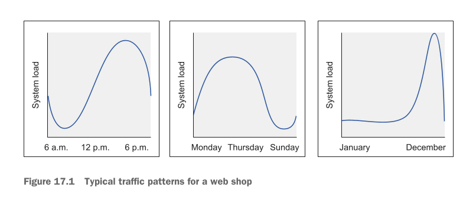
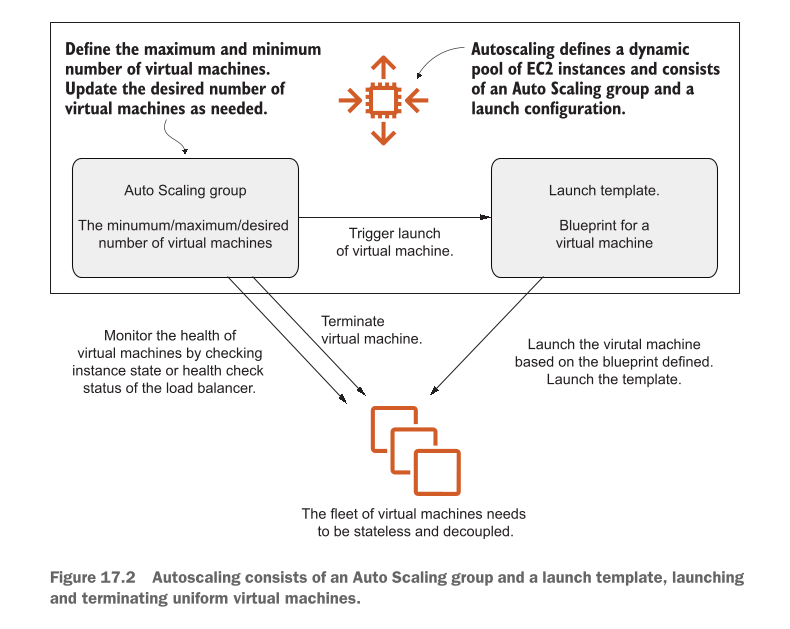
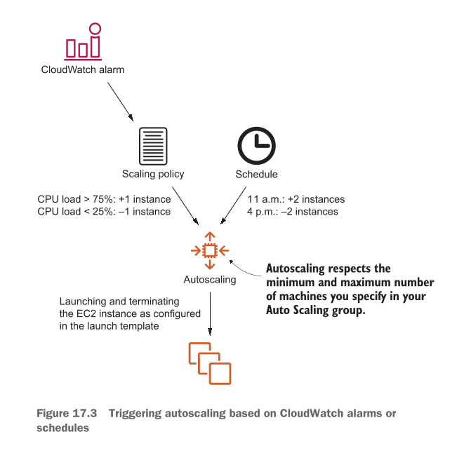
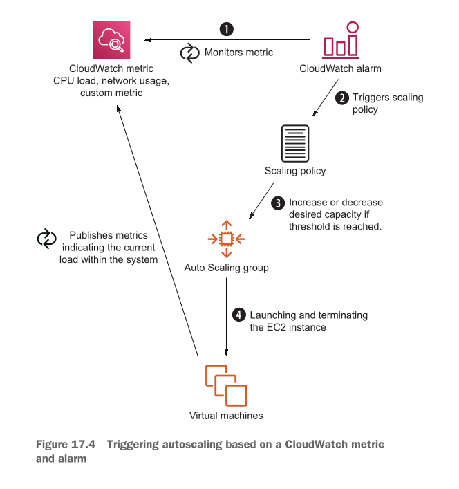
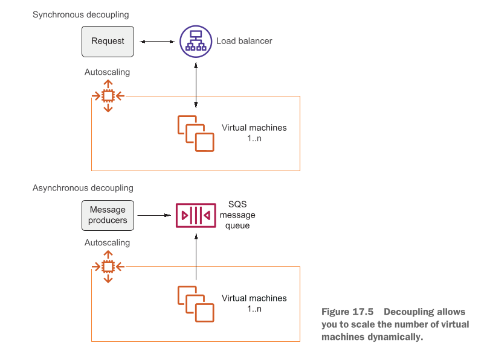
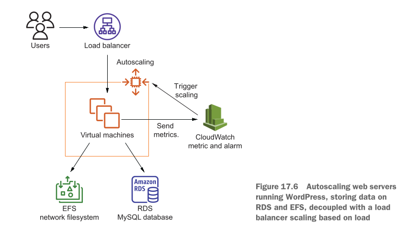
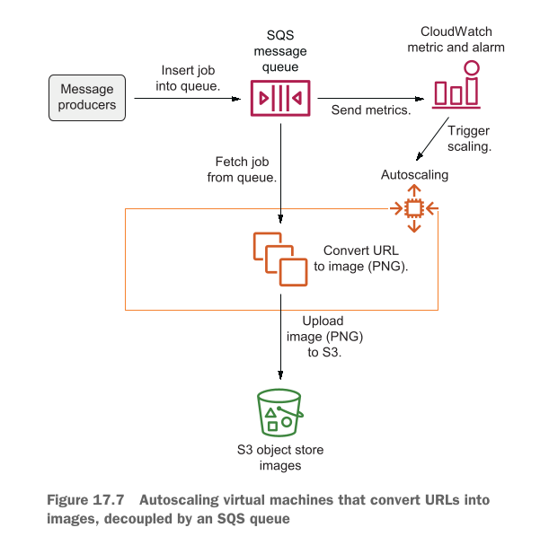

# Scaling up and down Autoscaling and CloudWatch

<details open>
  <summary><strong>📚 Table of contents</strong></summary>

  <ul>
    <li><a href="#this-chapter-covers">This chapter covers</a></li>
    <li><a href="#figure-171-typical-traffic-patterns-for-a-web-shop">Figure 17.1 Typical traffic patterns</a></li>
    <li><a href="#examples-are-100-covered-by-the-free-tier">Examples are 100% covered by the Free Tier</a></li>
    <li><a href="#managing-a-dynamic-ec2-instance-pool">Managing a dynamic EC2 instance pool</a></li>
    <li><a href="#figure-172-autoscaling-consists-of-an-auto-scaling-group-and-a-launch-template-launching-and-terminating-uniform-virtual-machines">Figure 17.2 Autoscaling overview</a></li>
    <li><a href="#dont-forget-to-define-a-health-check-grace-period">Health check grace period</a></li>
    <li><a href="#listing-171-auto-scaling-group-and-launch-template-for-a-web-app">Listing 17.1 Web app template</a></li>
    <li><a href="#using-metrics-or-schedules-to-trigger-scaling">Using metrics or schedules to trigger scaling</a></li>
    <li><a href="#figure-173-triggering-autoscaling-based-on-cloudwatch-alarms-or-schedules">Figure 17.3 Scaling triggers</a></li>
    <li><a href="#scaling-based-on-a-schedule">Scaling based on a schedule</a></li>
    <li><a href="#unix-cron-syntax-format">Unix Cron syntax</a></li>
    <li><a href="#scaling-based-on-cloudwatch-metrics">Scaling based on CloudWatch metrics</a></li>
    <li><a href="#scaling-based-on-cpu-load-with-vms-that-offer-burstable-performance">Burstable performance scaling</a></li>
    <li><a href="#decoupling-your-dynamic-ec2-instance-pool">Decoupling your dynamic EC2 instance pool</a></li>
    <li><a href="#scaling-a-dynamic-ec2-instance-pool-synchronously-decoupled-by-a-load-balancer">Scaling behind a load balancer</a></li>
    <li><a href="#simple-http-load-test">Simple HTTP load test</a></li>
    <li><a href="#cleaning-up">Cleaning up</a></li>
    <li><a href="#scaling-a-dynamic-ec2-instances-pool-asynchronously-decoupled-by-a-queue">Scaling behind a queue</a></li>
    <li><a href="#summary">Summary</a></li>
  </ul>

</details>

## This chapter covers

* **Creating an Auto Scaling group with a launch template:** Ek Auto Scaling group (ASG) ko Launch Template ki madad se banana. Modern AWS mein Launch Template humari virtual machines (EC2 instances) ka blueprint ya design hoti hai, jis mein hum batate hain ke naye banne wale server ka size, operating system aur configuration kya hogi.
* **Using autoscaling to change the number of virtual machines:** Auto Scaling ka istemal kar ke system load ke mutabiq virtual machines ki ginti (tadaad) ko khud-ba-khud kam ya ziada karna.
* **Scaling a synchronous decoupled app behind a load balancer (ALB):** Ek synchronous decoupled application ko Application Load Balancer (ALB) ke peeche rakh kar scale karna. Synchronous ka matlab hai jab user koi request bhejta hai (jaise website open karna) toh usay foran response chahiye hota hai.
* **Scaling an asynchronous decoupled app using a queue (SQS):** Ek asynchronous decoupled application ko Simple Queue Service (SQS) ki madad se scale karna. Asynchronous ka matlab hai ke user apna kaam (jaise video process karna) submit kar ke chala jata hai aur kaam background mein queue ke zariye aaram se hota rehta hai.

---

Suppose you’re organizing a party to celebrate your birthday. How much food and drink do you need to buy? Calculating the right numbers for your shopping list is difficult due to the following factors:

Writer ne yahan AWS scaling ko samjhane ke liye ek bohot hi aasaan real-world example di hai:

Farz karein aap apni birthday party plan kar rahe hain. Aap ko party ke liye kitna khana aur kitni cold drinks khareedni chahiye? Shopping list ke liye sahi tadaad ka andaza lagana bohot mushkil kaam hai kyunke do (2) unpredictable (an-dekhe) maslay samne aate hain:

* **How many people will attend? You received several confirmations, but some guests will cancel at short notice or show up without letting you know in advance. Therefore, the number of guests is vague:** Party mein kitne log aayenge? Aap ko kuch doston ne aane ka bola hai, lekin kuch log achanak plan cancel kar dete hain aur kuch bagair bataye extra doston ko sath le aate hain. Is liye mehmanon ki sahi tadaad hamesha vague (ghair wazih) hoti hai.
* **How much will your guests eat and drink? Will it be a hot day, with everybody drinking a lot? Will your guests be hungry? You need to guess the demand for food and drink based on experiences from previous parties as well as weather, time of day, and other variables:** Mehman kitna khayenge aur peeyenge? Kya us din sakht garmi hogi aur sab bohot ziada drinks peeyenge? Kya mehman bohot bhookay honge? Aap ko sirf pichli parties ke experience, mausam, party ke waqt aur doosri cheezon ko dekh kar ek andaza (guess) lagana padta hai.

---

Solving the equation is a challenge because there are many unknowns. Being a good host, you’ll order more food and drink than needed so no guest will be hungry or thirsty for long. It may cost you more money than necessary, and you may end up wasting some of it, but this possible waste is the risk you must take to ensure you have enough for unexpected guests and circumstances.

Is maslay ko hal karna bohot mushkil hai kyunke bohot saari cheezon ka pehle se pata nahi hota (unknowns). Ek accha host hone ke naatay aap kya karte hain? Aap zaroorat se ziada khana aur drinks khareed lete hain taake koi bhi mehman bhooka ya pyasa na rahe. Is se aap ka kharcha ziada hota hai aur ho sakta hai ke kuch khana zaya (waste) bhi ho jaye, lekin mehmanon ki achhi khatir-daari ke liye aap ko yeh extra kharche aur waste ka risk lena padta hai.

---

Before the cloud, the same was true for our industry when planning the capacity of our IT infrastructure. Planning to meet future demands for your IT infrastructure was nearly impossible. To prevent a supply gap, you needed to add extra capacity on top of the planned demand to prevent running short of resources. When procuring hardware for a data center, we always had to buy hardware based on the demands of the future. We faced the following uncertainties when making these decisions:

Cloud computing se pehle, traditional IT infrastructure (Physical Data Centers) mein bhi bilkul aisa hi hota tha. Apne IT infrastructure ki future capacity (hardware ki zaroorat) ko plan karna lagbhag namumkin tha.

System ko down hone ya crash hone se bachane ke liye (supply gap ko rokne ke liye), companies ko apni zaroorat se kahin ziada extra physical hardware pehle se khareed kar rakhna padta tha taake resources kam na par jayein. Data center ke liye hardware khareedte waqt in 3 bari uncertainties (shukook o shubaat) ka samna karna padta tha:

* **How many users need to be served by the infrastructure?** Infrastructure kitne users ko handle karega? Future mein traffic kitna barhega?
* **How much storage would the users need?** Users ko data store karne ke liye kitni hard disk drive space (storage) chahiye hogi?
* **How much computing power would be required to handle their requests?** User ki requests ko process karne ke liye kitne CPUs aur RAM (computing power) zaroori honge?

---

To avoid supply gaps, we had to order more or faster hardware than needed, causing unnecessary expenses.

In tamam uncertainties aur supply gaps se bachne ke liye, companies ko zaroorat se bohot ziada aur behad mehangay physical servers pehle se khareedne padte thay. Is wajah se lakhon dollars ke fuzool kharche (unnecessary expenses) hote thay aur hardware data center mein bekar para rehta tha.

---

On AWS, you can use services on demand. Planning capacity is less and less important. You can scale from one EC2 instance to thousands of EC2 instances. Storage can grow from gigabytes to petabytes. You can scale on demand, thus replacing capacity planning. AWS calls the ability to scale on demand elasticity.

AWS Cloud par aap tamam services ko **on-demand** (jab zaroorat ho tab) istemal karte hain. Ab pehle se baith kar saalon ki capacity planning karne ki zaroorat khatam ho chuki hai.

* Aap 1 single EC2 instance se shuru kar ke zaroorat padne par **hazaron EC2 instances** tak ja sakte hain.
* Aap ki Storage **Gigabytes (GB)** se barh kar **Petabytes (PB)** tak khud-ba-khud phail sakti hai.
* Aap zaroorat ke waqt seconds mein resources ko barha aur ghatasakte hain. AWS cloud ki is khilone ki tarah phailne aur sikudne ki salahiyat ko **Elasticity** (khinchne ya elastick hone ki salahiyat) kaha jata hai.

---

Public cloud providers like AWS can offer the needed capacity with a short waiting time. AWS serves more than a million customers, and at that scale, it isn’t a problem to provide you with 100 additional virtual machines within minutes if you suddenly need them. This allows you to address another problem: recurring traffic patterns, as shown in figure 17.1. Think about the load on your infrastructure during the day versus at night, on a weekday versus the weekend, or before Christmas versus the rest of year. Wouldn’t it be nice if you could add capacity when traffic grows and remove capacity when traffic shrinks? That’s what this chapter is all about.

AWS jaise public cloud providers bohot thode waqt mein aap ko har kisam ki capacity de dete hain. AWS ke paas 1 Million (10 Lakh) se ziada active customers hain. Itne bare scale par hone ki wajah se, agar aap ko achanak 100 extra virtual machines chahiye hon, toh AWS aap ko chand mintos mein woh saare servers ready kar ke de deta hai.

Is elasticity ki wajah se ek bohot bara masla hal hota hai: **Recurring Traffic Patterns** (bar bar dohrane wale traffic ke patterns).

Apne system par traffic ka load sochein:

1. Din ke waqt (jab log active hon) vs Raat ke waqt (jab log so rahe hon).
2. Karobari dinon (Weekdays) vs Hafte ke aakhri dinon (Weekends).
3. Salana tehvaron (jaise Christmas/Black Friday) vs Baqi saal ka aam traffic.

Kya yeh zabardast baat nahi hogi ke jab traffic barhe toh khud-ba-khud naye servers add ho jayein, aur jab traffic kam ho toh extra servers delete ho jayein taake paise bachein? Is chapter mein hum wahi seekhenge.

---

## Figure 17.1 Typical traffic patterns for a web shop

Is figure mein ek online shopping store (web shop) ke 3 alag alag recurring traffic patterns ko 3 graphs ke zariye samjhaya gaya hai:

<div align="center">
  
</div>

1. **Pehla Graph (6 a.m., 12 p.m., 6 p.m. - Daily Pattern):** Is graph mein din ke 24 ghanton ka traffic load dikhaya gaya hai. Subah 6 baje (6 a.m.) system load sab se kam (bottom level) par hota hai kyunke aksar log so rahe hote hain. Dopahar 12 baje traffic barhna shuru hota hai aur Shaam 6 baje (6 p.m.) peak (sab se unchai) par pahunch jata hai jab log kaam se wapas aakar online shopping karte hain.
2. **Doosra Graph (Monday, Thursday, Sunday - Weekly Pattern):** Is graph mein hafte ke dinon ka load dikhaya gaya hai. Monday ko kaam shuru hote hi traffic barhta hai, hafte ke darmiyan (Thursday ke qareeb) peak par rehta hai, aur Sunday tak aate aate log ghoomne phirne nikal jate hain toh system load dubara kam ho jata hai.
3. **Teesra Graph (January to December - Yearly/Seasonal Pattern):** Is graph mein poore saal ka load dikhaya gaya hai. January se November tak traffic bilkul normal aur flat rehta hai. Lekin jaise hi December aata hai (Holiday season aur Christmas shopping ki wajah se), system load achanak aasman ko choone lagta hai (huge traffic spike).

---

Scaling the number of virtual machines is possible with Auto Scaling groups (ASG) and scaling policies on AWS. Autoscaling is part of the EC2 service and helps you scale the number of EC2 instances you need to fulfill the current load of your system. We introduced Auto Scaling groups in chapter 13 to ensure that a single virtual machine was running even if an outage of an entire data center occurred.

AWS par virtual machines (EC2 instances) ko kam ya ziada karna **Auto Scaling groups (ASG)** aur **Scaling Policies** ke zariye hota hai. Auto scaling EC2 service ka hi ek hissa hai jo aap ke system ke current workload ko dekh kar servers ki tadaad ko control karta hai.

Chapter 13 mein hum ne ASG ka istemal High Availability ke liye kiya tha taake agar poora ek data center (Availability Zone) down bhi ho jaye, tab bhi kam se kam ek virtual machine zinda rahe.

---

In this chapter, you’ll learn how to manage a fleet of EC2 instances and adapt the size of the fleet depending on the current use of the infrastructure. To do so, you will use the concepts that you learned about in chapters 14 and 15 and enhance your setup with automatic scaling as follows:

Is chapter mein aap EC2 instances ki poori **Fleet** (fauj/group) ko manage karna aur load ke mutabiq us fleet ka size chota ya bara karna seekhenge. Is ke liye aap Chapter 14 aur 15 ke concepts ko le kar un par Auto Scaling lagayein ge:

* **Using Auto Scaling groups to launch multiple virtual machines of the same kind as you did in chapters 13 and 14:** Ek jaise multiple virtual machines ka group launch karne ke liye Auto Scaling groups ka istemal karna.
* **Changing the number of virtual machines based on CPU load with the help of CloudWatch alarms, which is a new concept we are introducing in this chapter:** CPU utilization (load) ke mutabiq servers ki tadaad kam ya ziada karna CloudWatch Alarms ki madad se (Yeh ek NAYA concept hai).
* **Changing the number of virtual machines based on a schedule to adapt to recurring traffic patterns—something you will learn about in this chapter:** Ek khas time table (Schedule) ke mutabiq servers ko scale karna taake daily/weekly traffic patterns ko handle kiya ja sake (Yeh bhi NAYA concept hai).
* **Using a load balancer as an entry point to the dynamic EC2 instance pool as you did in chapter 14:** Dynamic tarike se kam-ziada hone wale EC2 servers ke aage Load Balancer (ALB) ko entry point banana.
* **Using a queue to decouple the jobs from the dynamic EC2 instance pool, similar to what you learned in chapter 14:** Task/jobs ko EC2 instances se alag karne ke liye Queue (SQS) ka istemal karna.

---

## Examples are 100% covered by the Free Tier

The examples in this chapter are totally covered by the Free Tier. As long as you don’t run the examples longer than a few days, you won’t pay anything for it. Keep in mind that this applies only if you created a fresh AWS account for this book and there is nothing else going on in your AWS account. Try to complete the chapter within a few days, because you’ll clean up your account at the end of the chapter

Writer bilkul clear kar raha hai ke is chapter ki tamam practical misalein 100% AWS Free Tier ke andar aati hain:

* Agar aap in practicals ko sirf kuch dinon ke liye chalate hain aur baad mein delete kar dete hain, toh aap ko **ek rupeya bhi charge nahi hoga**.
* Yeh tabhi applicable hai jab aap ne is book ke liye bilkul **Fresh (Naya) AWS account** banaya ho aur us mein koi doosri heavy resources pehle se na chal rahi hon.
* Practical shuru karne ke baad is chapter ko 2-3 dinon mein khatam karein aur aakhir mein tamam resources ko **Clean Up (delete)** kar dein.

---

The following prerequisites are required to scale your application horizontally, which means increasing and decreasing the number of virtual machines based on the current workload:

Application ko **Horizontally Scale** karne ke liye (matlab workload ke hisab se servers ki tadaad ko badhana ya kam karna), 2 zaroori shartain (Prerequisites) poori honi chahiye:

* **The EC2 instances you want to scale need to be stateless. You can achieve stateless servers by storing data with the help of services like RDS (SQL database), DynamoDB (NoSQL database), EFS (network filesystem), or S3 (object store) instead of storing data on disks (instance store or EBS) that are available only to a single EC2 instance:** Jin EC2 instances ko aap ne scale karna hai, unka **Stateless** hona zaroori hai. Stateless server ka matlab hai ke server ke andar user ka koi permanent data, file ya session save na ho (kyunke agar woh server terminate ho gaya toh data zaya ho jayega). Data ko local disks (EBS ya Instance Store) par rakhne ki bajaye external AWS services par rakha jata hai, jaise:
* **RDS** (SQL Database for structured data)
* **DynamoDB** (Fast NoSQL Key-Value Database)
* **EFS** (Network File System jo sab servers aapas mein share kar sakein)
* **S3** (Object Storage files aur images ke liye)


* **An entry point to the dynamic EC2 instance pool is needed to distribute the workload across multiple EC2 instances. EC2 instances can be decoupled synchronously with a load balancer or asynchronously with a queue:** Dynamic EC2 instance pool (jo continuously kam aur ziada ho rahe hain) ke aage ek central entry point ka hona zaroori hai jo aane wale tamaam kaam ko saare servers par barabar baante. Yeh kaam 2 tarike se hota hai:
* **Synchronous Decoupling:** Load Balancer (ALB) ke zariye real-time requests ko baanta jata hai.
* **Asynchronous Decoupling:** Queue (SQS) ke zariye background jobs ko baanta jata hai.

Hum ne Stateless Server ka concept Part 3 mein samjha tha aur Decoupling ko Chapter 13 mein detail se dekha tha. Is chapter mein hum stateless servers ke concept ko practically apply karenge aur synchronous (ALB) aur asynchronous (SQS) dono tarah ki decoupling ki hands-on examples par kaam karenge.


---


## Managing a dynamic EC2 instance pool

Tasavvur karein ke aap ko ek aisi web application (jaise blog ki website) chalani hai jo traffic ke hisab se khud ko kam ya ziada kar sake. Jab website par visitors/requests ki tadaad barhne lage, toh system ko khud-ba-khud bilkul ek jaise naye virtual machines (EC2 instances) chalu (launch) karne chahiye. Aur jab visitors kam ho jayein, toh fuzool chalne wale virtual machines ko khud-ba-khud band (terminate) kar dena chahiye.

Is poore kaam ko bagair kisi insaan ke (automated tareeqay se) chalane ke liye, app ki tamam configuration aur deployment **Bootstrapping** ke dauran honi chahiye. Bootstrapping ka matlab hai jab naya server pehli baar on hota hai, toh woh khud hi saara zaroori software aur code install kar ke ready ho jaye, bina kisi engineer ke button dabaye.

Is section mein aap sab se pehle ek **Auto Scaling group (ASG)** banana seekhenge. Phir aap dekhenge ke Scheduled Actions (khas waqt ke mutabiq) ke zariye EC2 instances ki tadaad kaise badli jati hai. Is ke baad CloudWatch metrics (jaise CPU utilization) ko dekh kar automatically scale karna seekhenge.

Auto Scaling group aap ko dynamic EC2 pool ko 2 tareeqon se manage karne ki ijazat deta hai:

* **Dynamically adjust the number of virtual machines that are running:** Chalne wale virtual machines ki tadaad ko load ke hisab se khud-ba-khud kam ya ziada karna.
* **Launch, configure, and deploy uniform virtual machines:** Bilkul ek jaise (uniform) virtual machines ko launch, configure, aur un par app deploy karna.

Auto Scaling group hamesha aap ki tay karda limits (bounds) ke andar hi phailta aur sikudta hai:

1. **Minimum 2 Virtual Machines:** Kam az kam 2 servers set karne se yeh faida hota hai ke agar ek Data Center (Availability Zone) mein koi kharabi ya bijli ka outage aa jaye, tab bhi doosre Data Center mein doosra server chal raha hoga (Fault Tolerance).
2. **Maximum Virtual Machines:** Ziada se ziada limit set karne se yeh faida hota hai ke aap ka cloud ka bill aap ke budget se bahar na nikal jaye.

Autoscaling ke **3 mukhya hissey (Parts)** hote hain:

* **A launch template that defines the size, image, and configuration of virtual machines:** Ek Launch Template jo naye banne wale virtual machines ka size, Operating System (Image), aur configuration (blueprint) tay karti hai.
* **An Auto Scaling group that specifies how many virtual machines need to be running based on the launch template:** Ek Auto Scaling group jo yeh hisab rakhta hai ke Launch Template ke zariye kitne virtual machines active rehne chahiye.
* **Scaling plans that adjust the desired number of EC2 instances in the Auto Scaling group based on a plan or dynamically:** Scaling Plans jo time-table ya live load ke hisab se Auto Scaling group ke andar desired servers ki tadaad ko badalte hain.

Agar aap chahte hain ke multiple EC2 instances mil kar kaam karein, toh yeh zaroori hai ke har naya server bilkul ek jaisa (identical/homogeneous) ho. Naye servers ka blueprint banane ke liye hum **Launch Template** ka istemal karte hain.

---

## Figure 17.2 Autoscaling consists of an Auto Scaling group and a launch template, launching and terminating uniform virtual machines.

Is figure mein Autoscaling ke poore architecture aur working mechanism ko samjhaya gaya hai:

<div align="center">
  
</div>

1. **Top Box (Dynamic Pool & Limits):** Autoscaling EC2 instances ka ek dynamic pool define karti hai. Aap is mein minimum, maximum, aur desired number of virtual machines set karte hain.
2. **Auto Scaling group:** Yeh group instances ki ginti ko manage karta hai. Jab naye server ki zaroorat hoti hai, toh yeh Launch Template ko signal bhejta hai ki *"Naya Virtual Machine Launch Karo"*.
3. **Launch Template (Blueprint):** Yeh virtual machine ka naksha (blueprint) hai. Is nakshe ko dekh kar naye exact identical (ek jaise) EC2 instances launch hote hain.
4. **Health Monitoring & Termination:** Auto Scaling group har waqt servers ki health check karta rehta hai (EC2 State ya Load Balancer ke zariye). Agar koi server kharab (unhealthy) ho jaye ya traffic kam ho jaye, toh Auto Scaling group us server ko terminate (delete) kar deta hai.
5. **Bottom Note (Stateless & Decoupled):** Yeh saari EC2 fleet (servers) hamesha **Stateless** (jahan data save na ho) aur **Decoupled** (ek doosre se alag) honi chahiye taake kisi ek server ke aane ya jaane se application par koi bura asar na pare.

---

### Table 17.1 Launch template parameters

| Name | Description (Roman Urdu) | Possible values (Roman Urdu) |
| --- | --- | --- |
| **ImageId** | Woh image (OS) jis se virtual machine shuru ki jati hai. | Amazon Machine Image (AMI) ki ID (jaise `ami-028f2b5ee08012131`). |
| **InstanceType** | Nayi virtual machines ka size aur hardware capacity. | Instance type (jaise ke `t2.micro` ya modern `t3.micro`). |
| **UserData** | Virtual machine ke liye user data jo bootstrapping (startup) ke dauran script execute karne ke liye istemal hota hai. | BASE64-encoded string ya plain bash script. |
| **NetworkInterfaces** | Virtual machine ke network interfaces ko configure karta hai. Sab se ahem baat yeh hai ke yeh parameter aap ko instance ke sath public IP address attach karne ki ijazat deta hai. | Network interface configurations ki list (Security groups aur Public IP settings). |
| **IamInstanceProfile** | Ek IAM role ke sath linked IAM instance profile attach karta hai taake server doosri AWS services se secure baat kar sake. | IAM instance profile ka naam ya Amazon Resource Name (ARN, yani ek ID). |

---

Launch template banane ke baad, aap ek Auto Scaling group banate hain jo is template ka hawala (reference) deta hai. Auto Scaling group mein 3 main numbers hote hain:

* **Desired Capacity:** Matlooba servers ki tadaad jo har waqt chalni chahiye. Agar chalne wale servers is number se kam honge, toh ASG naye servers add karega. Agar chalne wale servers is number se ziada honge, toh ASG extra servers ko terminate kar dega. Desired capacity ko aap manually, schedule par, ya load ke hisab se badal sakte hain.
* **Minimum Size (MinSize):** Sehna yogya sab se kam limit. ASG kabhi bhi servers ki tadaad ko is se neche nahi girne dega.
* **Maximum Size (MaxSize):** Oopri limit. ASG kabhi bhi servers ki tadaad ko is limit se aage nahi barhne dega.

Auto Scaling group yeh bhi dekhta rehta hai ke EC2 instances healthy (sahi salamat) hain ya nahi. Agar koi instance kharab ho jaye, toh ASG usay automatically delete kar ke naya instance launch kar deta hai.

---

### Table 17.2 Auto Scaling group parameters

| Name | Description (Roman Urdu) | Possible values (Roman Urdu) |
| --- | --- | --- |
| **DesiredCapacity** | Matlooba (desired) healthy virtual machines ki tadaad. | Integer (Koi bhi mukammal adad, jaise 2, 4). |
| **MaxSize** | Virtual machines ki maximum tadaad; oopri scaling limit (upper scaling limit). | Integer. |
| **MinSize** | Virtual machines ki minimum tadaad; nichli scaling limit (lower scaling limit). | Integer. |
| **HealthCheckType** | Auto Scaling group virtual machines ki health kis tarah check karti hai. | `EC2` (instance ki basic hardware/OS health) ya `ELB` (load balancer ke zariye application ke URL ki health check). |
| **HealthCheckGracePeriod** | Nayi instance launch hone ke baad health check ko us waqt tak pause rakha jata hai jab tak instance mukammal bootstrap na ho jaye. | Sekondon ki tadaad (Number of seconds, e.g., 300). |
| **LaunchTemplate** | Virtual machines shuru karte waqt blueprint ke tor par istemal hone wale launch template ki ID (`LaunchTemplateId`) aur version. | Launch template ki ID aur version. |
| **TargetGroupARNs** | Load balancer ke target groups, jahan autoscaling nayi instances ko khud ba khud register karti hai. | Target group ARNs ki list. |
| **VPCZoneIdentifier** | Subnets ki list jin mein EC2 instances launch karni hain. | Kisi VPC ke subnet identifiers ki list. |

Agar aap `VPCZoneIdentifier` mein ek se ziada subnets dete hain, toh Auto Scaling group naye EC2 instances ko un saare subnets (aur multiple Availability Zones) mein barabar baant (evenly distribute) kar ke launch karta hai taake high availability mile.

---

## Don’t forget to define a health check grace period

Agar aap apne Auto Scaling group ke liye ELB (Load Balancer) ka health check istemal kar rahe hain, toh zaroor **HealthCheckGracePeriod** bhi set karein.

**Yeh kyun zaroori hai?**
Jab naya EC2 instance launch hota hai, toh usay start hone, operating system load karne, aur UserData script ke zariye web server (jaise Apache HTTPD) install karne mein 1 se 2 minute ka waqt lagta hai. Agar aap grace period nahi denge, toh Load Balancer pehle hi second mein check karega, application ko "Down" payee ga, aur ASG us naye server ko useless samajh kar terminate kar dega!

Grace period wo waqt hai jab tak ASG naye server par health check failures ko ignore karta hai. Ek aam web application ke liye **5 minute (300 seconds)** ka grace period bilkul suitable hota hai.

---

## Listing 17.1 Auto Scaling group and launch template for a web app

Niche di gayi CloudFormation YAML template ek dynamic EC2 pool ko setup karti hai:

```yaml
LaunchTemplate:
  Type: 'AWS::EC2::LaunchTemplate'
  Properties:
    LaunchTemplateData:
      IamInstanceProfile:
        Name: !Ref InstanceProfile
      ImageId: 'ami-028f2b5ee08012131'
      InstanceType: 't2.micro'
      NetworkInterfaces:
        - AssociatePublicIpAddress: true
          DeviceIndex: 0
          Groups:
            - !Ref WebServerSecurityGroup
      UserData:
        'Fn::Base64': !Sub |
          #!/bin/bash -x
          yum -y install httpd
AutoScalingGroup:
  Type: 'AWS::AutoScaling::AutoScalingGroup'
  Properties:
    TargetGroupARNs:
      - !Ref LoadBalancerTargetGroup
    LaunchTemplate:
      LaunchTemplateId: !Ref LaunchTemplate
      Version: !GetAtt 'LaunchTemplate.LatestVersionNumber'
    MinSize: 2
    MaxSize: 4
    HealthCheckGracePeriod: 300
    HealthCheckType: ELB
    VPCZoneIdentifier:
      - !Ref SubnetA
      - !Ref SubnetB

```

### Template Code Details:

* `LaunchTemplate:` -> AWS CloudFormation mein Launch Template resource create karne ki shuruaat.
* `Type: 'AWS::EC2::LaunchTemplate'` -> AWS ko bataya ja raha hai ke yeh EC2 Launch Template ka resource hai.
* `Properties:` -> Template ki configurations aur settings ka section.
* `LaunchTemplateData:` -> Instance ke andar ki saari main details yahan di jati hain.
* `IamInstanceProfile:` -> Instance ke sath IAM profile jodne ka block.
* `Name: !Ref InstanceProfile` -> Ek pehle se bane hue `InstanceProfile` ka reference de raha hai taake EC2 ko AWS permissions mil sakain.
* `ImageId: 'ami-028f2b5ee08012131'` -> Amazon Machine Image ki specific ID jo bata rahi hai ke Operating System konsa load hoga.
* `InstanceType: 't2.micro'` -> Instance ka hardware size (1 vCPU, 1 GB RAM).
* `NetworkInterfaces:` -> Virtual Network Card ki settings.
* `- AssociatePublicIpAddress: true` -> Is baat ko yaqeen banata hai ke har naye server ko internet se direct access ke liye ek Public IP mile.
* `DeviceIndex: 0` -> Primary network card (eth0) ki position set karta hai.
* `Groups:` -> Security groups attach karne ki jagah.
* `- !Ref WebServerSecurityGroup` -> Web server ke Security Group ka reference de raha hai (jo HTTP/HTTPS firewall rules apply karta hai).
* `UserData:` -> Server boot hote hi chalne wali script ka block.
* `'Fn::Base64': !Sub |` -> UserData script ko Base64 format mein encode karta hai jaisa ke AWS EC2 ko darkaar hota hai.
* `#!/bin/bash -x` -> Linux script ka header jo commands ko debug mode (`-x`) ke sath execute karta hai.
* `yum -y install httpd` -> Apache Web Server (httpd) ko automatically bina kisi human prompt (`-y`) ke install karta hai.
* `AutoScalingGroup:` -> Auto Scaling Group resource ki shuruaat.
* `Type: 'AWS::AutoScaling::AutoScalingGroup'` -> AWS ko batata hai ke yeh Auto Scaling Group ka resource hai.
* `Properties:` -> ASG ki settings.
* `TargetGroupARNs:` -> Load Balancer ke target group ki list.
* `- !Ref LoadBalancerTargetGroup` -> Naye launch hone wale servers ko automatically Application Load Balancer ke Target Group mein register kar deta hai.
* `LaunchTemplate:` -> ASG ko batata hai ke naye servers kis blueprint se banane hain.
* `LaunchTemplateId: !Ref LaunchTemplate` -> Upar banaye gaye Launch Template ki ID ko link kar raha hai.
* `Version: !GetAtt 'LaunchTemplate.LatestVersionNumber'` -> Hamesha Launch Template ka sab se **latest version** istemal karne ke liye dynamic attribute retrieve karta hai.
* `MinSize: 2` -> ASG ko paband karta hai ke kam se kam 2 instances hamesha chalte rahein.
* `MaxSize: 4` -> ASG ko paband karta hai ke ziada se ziada 4 instances tak hi scaling ho sakti hai.
* `HealthCheckGracePeriod: 300` -> Server launch hone ke baad **300 seconds (5 minutes)** tak ELB health check failure par server ko terminate nahi hone deta taake bootstrapping (yum install httpd) poori ho sake.
* `HealthCheckType: ELB` -> Server ki health ka faisla EC2 ke sath sath Load Balancer ke HTTP response checks par karta hai.
* `VPCZoneIdentifier:` -> Subnets ki list jahan servers launch karne hain.
* `- !Ref SubnetA` -> Pehla Subnet (e.g., Availability Zone A).
* `- !Ref SubnetB` -> Doosra Subnet (e.g., Availability Zone B). Auto Scaling group naye servers ko in do subnets mein barabar baant kar launch karega.

Mukhtasir yeh ke Auto Scaling groups ek behad mufeed tool hain jab aap ko ek se ziada ek jaise virtual machines ko alag alag Availability Zones mein chalana ho. Is ke alawa, Auto Scaling group kisi bhi kharab ya fail ho jane wale EC2 instance ko automatically delete kar ke naya replacement server chalu kar deta hai.


---

## Using metrics or schedules to trigger scaling

Ab tak aap ne dekha ke Auto Scaling group aur Launch Template ka istemal kar ke virtual machines ko kaise manage kiya jata hai. Is setup mein aap manually (khud apne haath se) Auto Scaling group ki desired capacity ko badal sakte hain taake naye servers launch ho sakein ya purane band ho sakein.

Lekin ek blogging platform ko chalane ke liye, aap ko ye kaam manually karne ki bajaye **Scaling Policies** ke zariye **automatically** (khud-ba-khud) karna hota hai.

**Real-world Example:**

* **Lunch Break Traffic:** Aksar log dopahar ke khane ke waqt (11 a.m. se 1 p.m.) internet ziada chalate hain aur blogs parhte hain. Toh aap ko rozana is waqt extra virtual machines ki zaroorat hoti hai.
* **Unpredictable Traffic:** Agar aap ke blog ka koi article Facebook ya X (Twitter) par viral ho jaye, toh achanak lakhon log website par aa jatay hain.

In do alag halaton ko sambhalne ke liye AWS aap ko virtual machines ki tadaad badalne ke do (2) tareeqe deta hai:

* **Defining a schedule:** Ek time-table (Schedule) bana dena jo baar baar dohraye jaane wale traffic patterns ke mutabiq servers ko kam ya ziada kare (jaise raat ke waqt jab log so rahe hon toh servers kam kar dena).
* **Using a CloudWatch alarm:** CloudWatch Alarm ka istemal karna jo live metrics (jaise CPU utilization ya Load Balancer par aane wali requests) ko dekh kar scaling policy ko trigger kare.

**Important Trade-off (Muqabla aur Samjhota):**

* **Schedule par scale karna** aasaan hota hai kyunke is mein koi mushkil metric set nahi karni padti. Lekin yeh kam precise (kam mefuz) hota hai kyunke achanak aane wale traffic spike ko handle karne ke liye aap ko zaroorat se ziada servers pehle se chalane padte hain (**Overprovisioning**).
* **CloudWatch Metrics par scale karna** behad precise hota hai kyunke yeh asli load ko dekh kar scale karta hai, lekin ek aisa metric dhoondna jis par 100% bharosa kiya ja sake, thoda complex kaam hai.

---

### Figure 17.3 Triggering autoscaling based on CloudWatch alarms or schedules

Is figure mein Auto Scaling group ko trigger karne ke dono tareeqon ka muqammal breakdown dikhaya gaya hai:

<div align="center">
  
</div>

1. **Left Side (CloudWatch Alarm Route):** CloudWatch alarm continuous system metric ko read karta hai. Agar **CPU load > 75%** hota hai, toh Scaling Policy ko command milti hai ke **+1 instance** (ek naya server) add kar do. Agar **CPU load < 25%** gir jata hai, toh Scaling Policy **-1 instance** (ek server) delete kar deti hai.
2. **Right Side (Schedule Route):** Time-table ke mutabiq kaam hota hai. Subah **11 a.m.** hote hi schedule **+2 instances** add kar deta hai, aur shaam **4 p.m.** par **-2 instances** kam kar deta hai.
3. **Center (Autoscaling Engine):** Autoscaling group dono tarf se aane wali instructions ko receive karta hai. Lekin yeh hamesha aap ki set ki hui **Minimum** aur **Maximum** limits ka khayal rakhta hai (woh kabhi bhi minimum se kam ya maximum se ziada servers launch nahi karega).
4. **Bottom (Virtual Machines):** End result yeh hota hai ke Launch Template ke blueprint ko use karte hue actual EC2 instances start ya terminate hote hain.

---

## Scaling based on a schedule

Blogging platform chalate waqt aap ko 2 kisam ke load patterns milte hain:

* **One-time actions (Ek dafa hone wale waqiaat):** Aap ne raat ko TV par apni website ka ikhtihar (ad) chalaya, jis ke foran baad registration page par achanak traffic ka tufan aa gaya. Yeh kaam roz roz nahi hota.
* **Recurring actions (Baar baar dohraye jane wale waqiaat):** Har roz dopahar 11 a.m. se 1 p.m. ke darmiyan log lunch break mein articles parhte hain. Yeh kaam har roz ek hi waqt par dohraya jata hai.

AWS Scheduled Actions in dono maseebaton ka hal nikalte hain. Aap aik dafa hone wale (One-time) ya baar baar dohraye jane wale (Recurring) schedules set kar sakte hain.

Is ka CloudFormation code book ke GitHub repository (`[https://github.com/AWSinAction/code3](https://github.com/AWSinAction/code3)`) mein `/chapter17/wordpress-schedule.yaml` par majood hai.

---

### Listing 17.2 Scheduling a one-time scaling action

Niche diya gaya YAML code ek **One-Time Scheduled Action** banata hai jo specific date aur time par chalega:

```yaml
OneTimeScheduledActionUp:
  Type: 'AWS::AutoScaling::ScheduledAction'
  Properties:
    AutoScalingGroupName: !Ref AutoScalingGroup
    DesiredCapacity: 4
    StartTime: '2025-01-01T12:00:00Z'

```

* `OneTimeScheduledActionUp:` -> CloudFormation resource ka logical naam.
* `Type: 'AWS::AutoScaling::ScheduledAction'` -> AWS ko bataya ja raha hai ke yeh Auto Scaling ki Scheduled Action resource hai.
* `Properties:` -> Configuration settings ka block.
* `AutoScalingGroupName: !Ref AutoScalingGroup` -> Batata hai ke yeh schedule kis Auto Scaling Group par apply hoga (`!Ref` pehle se bane group ka ID lata hai).
* `DesiredCapacity: 4` -> Schedule trigger hote hi total active servers ki tadaad ko **4** kar dega.
* `StartTime: '2025-01-01T12:00:00Z'` -> UTC Time zone ke mutabiq exact date aur time (1 January 12:00 PM UTC) jis waqt yeh action execute hoga.

---

### Listing 17.3 Scheduling a recurring scaling action that runs at 20:00 UTC every day

Aap Unix **Cron Syntax** ka istemal kar ke rozana dohraye jane wale (recurring) schedules bhi bana sakte hain. Niche di gayi example mein rozana karobari ghanton (08:00 se 20:00 UTC) ke liye servers ki tadaad barhai aur ghatai ja rahi hai:

```yaml
RecurringScheduledActionUp:
  Type: 'AWS::AutoScaling::ScheduledAction'
  Properties:
    AutoScalingGroupName: !Ref AutoScalingGroup
    DesiredCapacity: 4
    Recurrence: '0 8 * * *'
RecurringScheduledActionDown:
  Type: 'AWS::AutoScaling::ScheduledAction'
  Properties:
    AutoScalingGroupName: !Ref AutoScalingGroup
    DesiredCapacity: 2
    Recurrence: '0 20 * * *'

```

* `RecurringScheduledActionUp:` -> Subah ke waqt capacity badhane wale resource ka naam.
* `Type: 'AWS::AutoScaling::ScheduledAction'` -> Scheduled Action resource type.
* `AutoScalingGroupName: !Ref AutoScalingGroup` -> Target Auto Scaling Group.
* `DesiredCapacity: 4` -> Subah office timing shuru hote hi servers ki tadaad 4 kar do.
* `Recurrence: '0 8 * * *'` -> Cron expression jo batata hai ke **Har roz subah 08:00 UTC** par yeh kaam karna hai.
* `RecurringScheduledActionDown:` -> Shaam ke waqt capacity ghatane wale resource ka naam.
* `DesiredCapacity: 2` -> Office timing khatam hote hi extra 2 servers band kar do, aur sirf 2 chalne do.
* `Recurrence: '0 20 * * *'` -> Cron expression jo batata hai ke **Har roz shaam 20:00 UTC (8:00 PM)** par yeh kaam karna hai.

---

### Unix Cron Syntax Format

Cron format 5 stars (`* * * * *`) par mabni hota hai:

```text
* * * * *
| | | | |
| | | | +-- day of week (0 - 6) (0 Sunday)
| | | +---- month (1 - 12)
| | +------ day of month (1 - 31)
| +-------- hour (0 - 23)
+---------- min (0 - 59)

```

1. **Pehla Star (Minute):** 0 se 59 minutes (e.g., `0` ka matlab minute 0).
2. **Doosra Star (Hour):** 0 se 23 ghante (e.g., `8` ka matlab subah 8 baje, `20` ka matlab raat 8 baje).
3. **Teesra Star (Day of Month):** Mahine ka din (1 se 31). `*` ka matlab har din.
4. **Chotha Star (Month):** Mahina (1 se 12). `*` ka matlab har mahina.
5. **Panchvan Star (Day of Week):** Hafte ka din (0 se 6, jahan 0 = Sunday/Itwaar). `*` ka matlab hafte ka har din.

**Best Practice Recommendation:** Scheduled scaling ka istemal tabhi karein jab aap ko pehle se pata ho ke traffic kab aaye ga—jaise internal company tools jo sirf office timing (9 AM - 5 PM) mein chalte hain ya koi planned marketing campaign.

---

## Scaling based on CloudWatch metrics

Future ko predict karna behad mushkil hai. Traffic aksar aap ke plan kiye gaye schedule se hat kar achanak barh ya ghat jata hai. Agar aap ka koi blog post social media par viral ho jaye, toh schedule nakaam ho jayega. Is maseebat se bachne ke liye live traffic/load ko dekh kar scale karna padta hai.

Aap **CloudWatch Alarms** aur **Scaling Policies** ka istemal kar ke actual workload ke mutabiq EC2 instances ki tadaad badal sakte hain.

AWS mein **4 kisam ki Scaling Policies** hoti hain:

1. **Step scaling:** Yeh behad flexible hai. Is mein aap alag alag steps set kar sakte hain (e.g., agar CPU load 70% ho toh +1 server, lekin agar direct 90% par chala jaye toh +3 servers add kar do).
2. **Target tracking:** Yeh sab se modern aur aasaan tarika hai. Aap ko koi mushkil calculation nahi karni padti. Aap sirf ek target bata dete hain (jaise: *"Mera Average CPU Utilization 70% rehna chahiye"*). AWS khud hi servers add ya remove kar ke CPU ko 70% par maintain rakhta hai.
3. **Predictive scaling:** Yeh Machine Learning (AI) ka istemal karta hai. Purane traffic history data ko dekh kar future ke load ko predict karta hai aur pehle se hi scale kar deta hai.
4. **Simple scaling:** Yeh purana (Legacy) tareeqa hai jo ab khatam ho chuka hai aur is ki jagah Step Scaling ne le li hai.

---

### Figure 17.4 Triggering autoscaling based on a CloudWatch metric and alarm

Is figure mein Live Metric scaling ke 4-step cycle ko samjhaya gaya hai:

<div align="center">
  
</div>

1. **Step 1 (Publishes metrics):** Sabhi running Virtual Machines (EC2 instances) apni performance ka data (CPU load, network traffic) CloudWatch ko continuously bhejte hain.
2. **Step 2 (Monitors metric):** CloudWatch Alarm continuously is metric par nazar rakhta hai.
3. **Step 3 (Triggers scaling policy):** Jab CPU load set ki hui limit (threshold) ko cross karta hai, toh CloudWatch Alarm **Scaling Policy** ko trigger kar deta hai.
4. **Step 4 (Increases/Decreases capacity):** Scaling Policy Auto Scaling group ki desired capacity badal deti hai. Is ke natije mein ASG naye EC2 instances launch karta hai ya fuzool instances terminate kar deta hai.

---

### CloudWatch Metrics Details & Missing Metric Note

By default, EC2 instance CloudWatch ko yeh metrics automatically bhejta hai:

* **CPU Utilization** (CPU kitna use ho raha hai)
* **Network Utilization** (Kitna data in/out ho raha hai)
* **Disk Utilization** (Disk read/write speed)

> **Important Theoretical Aspect:** Default EC2 metrics mein **Memory (RAM) Usage ka koi metric majood NAHI hota!** Amazon hypervisor level par RAM usage read nahi kar sakta. Agar aap ko RAM par scale karna hai, toh aap ko application ke andar se Custom Metric CloudWatch ko bhejni paregi.

CloudWatch metric ke **3 main parameters** hote hain:

* **Namespace:** Metric ka ghar ya source (jaise `AWS/EC2`).
* **Dimensions:** Metric ka scope (jaise Auto Scaling Group ki ID, taake saare servers ka average nikala ja sake).
* **MetricName:** Metric ka khass naam (jaise `CPUUtilization`).

---

### Table 17.3 Parameters for a CloudWatch alarm that triggers scaling based on CPU usage of all virtual machines belonging to an Auto Scaling group

| Context | Name | Description (Roman Urdu) | Possible values (Roman Urdu) |
| --- | --- | --- | --- |
| **Condition** | `Statistic` | Kisi metric par apply hone wala statistical function (hisaab kitab). | `Average`, `Sum`, `Minimum`, `Maximum`, `SampleCount` |
| **Condition** | `Period` | Metric se values ka time-based slice (waqt ka tukda) define karta hai. | Seconds (60 ka multiple, e.g., 60, 300) |
| **Condition** | `EvaluationPeriods` | Alarm check karte waqt evaluate karne ke liye periods ki tadaad. | Integer (e.g., 1 ya 2 periods) |
| **Condition** | `Threshold` | Alarm trigger karne ke liye tay karda limit (limit point). | Number (e.g., 75% CPU) |
| **Condition** | `ComparisonOperator` | Statistical result ko threshold se compare karne wala mathematical operator. | `GreaterThanOrEqualToThreshold`, `GreaterThanThreshold`, `LessThanThreshold`, `LessThanOrEqualToThreshold` |
| **Metric** | `Namespace` | Metric kis service ka hai (Source). | EC2 service ke liye `AWS/EC2` |
| **Metric** | `Dimensions` | Metric ka scope (kis cheez par apply ho raha hai). | Auto Scaling group ka reference (saare instances ka aggregated average nikalne ke liye). |
| **Metric** | `MetricName` | Metric ka exact naam. | Misal ke taur par, `CPUUtilization` |
| **Action** | `AlarmActions` | Limit (threshold) cross hone par jo action trigger hoga. | Target Scaling Policy ka ARN (reference link) |

**Custom Metrics:** Aap AWS ke diye gaye metrics ke alawa apni Application se **Custom Metrics** bhi CloudWatch ko bhej sakte hain—jaise Application Thread Pool Usage, Request Processing Times, ya Active User Sessions.

---

## Scaling based on CPU load with VMs that offer burstable performance

Kuch virtual machines—jaise **T2, T3, aur T4g instance families**—burstable performance offer karti hain. Is ka matlab kya hai?

**ELI5 Analogy (Aasaan Misaal):**
In instances ke paas ek **Baseline Performance** hoti hai (jaise `t2.micro` ki baseline performance physical CPU ka sirf **10%** hoti hai). Jab server par load kam hota hai, toh yeh instance **CPU Credits** (sikka/tokens) jama karta rehta hai. Jab achanak traffic ka spike aata hai, toh yeh instance un credits ko kharch kar ke full 100% speed par **burst** (daudna) shuru kar deta hai.

Lekin jab saare CPU Credits khatam ho jatay hain, toh instance zabardasti dubara apni **10% baseline** speed par wapas aa jata hai.

### The Scaling Trap (Burstable Performance par scaling ka khatra)

Burstable instances (T2/T3) par **CPU Load ko dekh kar Auto Scaling lagana khatarnak aur tricky ho sakta hai**.

**Problem Scenario:**

1. Aap ki website par load thoda sa barha.
2. Instances ne apne saare CPU Credits kharch kar diye aur zero credits par aa gaye.
3. Ab server ki speed 10% par drop ho gayi. Speed kam hone ki wajah se choti si request process hone mein bhi CPU 100% busy dikhayega.
4. CloudWatch Alarm dekhega ke *"Arey Baap Re! CPU Load 100% ho gaya hai!"* aur Auto Scaling group naye servers launch karna shuru kar dega—jabke asliyat mein traffic nahi barha tha, balki sirf CPU Credits khatam huay thay!

**Solution / Best Practice:**
Agar aap Burstable (T2/T3) instances use kar rahe hain, toh CPU Utilization par scale karne ki bajaye **doosri metrics (jaise Number of Active Sessions / Load Balancer Requests)** par scale karein, ya phir Non-burstable instance families (jaise **C5, M5, C6i**) ka istemal karein jahan baseline CPU fix 100% milti hai.


---

## Decoupling your dynamic EC2 instance pool

Jab aap ko apni blogging platform par visitors ki demand ke hisab se virtual machines ki tadaad ko kam ya ziada karna hota hai, toh Auto Scaling groups aap ki madad karte hain taake bilkul ek jaise (uniform) servers launch ho sakain. SATH HI, Scheduled Actions aur CloudWatch Alarms automatically un servers ki tadaad ko badal dete hain.

Lekin sab se bara sawaal yeh paida hota hai: **Naye aur purane users aap ke EC2 instances tak pahunchenge kaise taake blog ke articles read kar sakain? HTTP requests ko kahan bheja jana chahiye?**

Chapter 14 mein hum ne **Decoupling** (System ke hisson ko ek doosre se alag karna) ka concept samjha tha:

1. **Synchronous Decoupling:** Elastic Load Balancer (ELB) ke zariye.
2. **Asynchronous Decoupling:** Simple Queue Service (SQS) ke zariye.

**Aasaan Misaal (ELI5):**
Maan lein aap ki dukaan par achanak bohot saare customers aa gaye hain aur aap ne andar kaam karne wale worker (servers) barha diye hain. Lekin agar bahar ka darwaza (IP Address) baar baar badalta rahe, toh customer pareshan ho jayenge. Is liye bahar ka main gate (Entry Point) hamesha **ek hi** rehna chahiye, chahe andar 2 workers kaam kar rahe hon ya 100 workers.

Auto Scaling ka istemal karne ke liye zaroori hai ke EC2 instances ko client (users) se alag (decouple) rakha jaye taake bahar ka interface badle bina piche servers ki tadaad badal sakay.

---

### Figure 17.5 Decoupling allows you to scale the number of virtual machines dynamically.

<div align="center">
  
</div>

Is figure mein Decoupling ke do main tareeqon ko samjhaya gaya hai:

1. **Synchronous Decoupling (Upar wala hissa):**
* **Request:** User ki taraf se aane wali HTTP request.
* **Load Balancer:** Central Entry Point ke taur par kaam karta hai.
* **Autoscaling Pool:** Load Balancer requests ko piche majood Virtual Machines ($1..n$) par baant (distribute) deta hai. Internal servers 2 hon ya 10, user ko sirf ek Load Balancer ka URL dikhta hai.


2. **Asynchronous Decoupling (Niche wala hissa):**
* **Message Producers:** Web applications ya systems jo kaam generate karte hain.
* **SQS Message Queue:** Ek temporary godam (buffer) jahan aane wale saare kaam/messages line mein lag jatay hain.
* **Virtual Machines & Autoscaling:** Virtual Machines is Queue se ek ek kar ke message uthati hain (**polling**) aur process karti hain. Agar Queue mein messages barhne lagein, toh Auto Scaling piche naye servers add kar deta hai.


---

### Stateless Server Ki Shart (Prerequisite)

Decoupled aur Scalable applications banane ke liye **Stateless Servers** ka hona zaroori hai. Stateless server ka matlab hai ke server apne andar koi data, uploaded files, ya user session save nahi karta, balki saara shared data kisi remote database ya storage par rakhta hai.

Book mein is ke **2 real-world examples** diye gaye hain:

* **WordPress Blog (Synchronous Example):**
* **Decoupling:** Elastic Load Balancer (ELB) ke zariye.
* **Scaling:** Autoscaling aur CloudWatch (CPU Utilization metric par).
* **Data Storage (Statelessness):** Posts aur metadata **Amazon RDS (MySQL)** mein, jabke uploaded images aur files **Amazon EFS (Network Filesystem)** par store hoti hain.


* **URL2PNG Web Application (Asynchronous Example):**
* **Decoupling:** Simple Queue Service (SQS) Queue ke zariye.
* **Scaling:** Autoscaling aur CloudWatch (Queue Length / Messages ki tadaad par).
* **Data Storage (Statelessness):** Metadata **Amazon DynamoDB (NoSQL)** mein, aur screenshot images **Amazon S3 (Object Store)** par store hoti hain.


---

## Scaling a dynamic EC2 instance pool synchronously decoupled by a load balancer

HTTP(S) requests ka jawab dena ek **Synchronous Task** (fawri jawab chaahne wala kaam) hai. Jab koi user aap ki website open karta hai, toh web server ko usay usi waqt screen par page dikhana hota hai. Dynamic EC2 pool chalate waqt Load Balancer ka istemal karna sab se best practice hai, kyunke yeh tamam requests ko multiple EC2 instances par baant deta hai.

**Real-world Problem Scenario:**
Aap ki company ka ek official blog WordPress par chal raha hai jahan announcements ki jati hain. Marketing team shikayat karti hai ke shaam ke waqt (jab daily traffic peak par hota hai) website bohot slow ho jati hai aur kabhi kabhi "Timeout" error de deti hai. Aap AWS ki **Elasticity** ka istemal kar ke load ke hisab se servers ki tadaad badhana chahte hain.

---

### Figure 17.6 Autoscaling web servers running WordPress, storing data on RDS and EFS, decoupled with a load balancer scaling based on load

<div align="center">
  
</div>

Is figure mein Highly Available aur Scalable WordPress Architecture ko step-by-step samjhaya gaya hai:

1. **Users:** Blog visitors jo website open kar rahe hain.
2. **Load Balancer:** Tamam visitors ki HTTP requests pehle Load Balancer par aati hain (Fixed Single Entry Point).
3. **Virtual Machines (EC2 Pool):** Load Balancer requests ko active EC2 instances (Apache + WordPress PHP) par bhejta hai.
4. **Amazon RDS (MySQL Database):** Saare EC2 instances ek hi **Multi-AZ RDS Database** se connect hote hain jahan blog ka textual data store hota hai.
5. **EFS Network Filesystem:** Saare EC2 instances **Amazon EFS** se Jude hote hain taake sabhi servers par ek hi WordPress code aur user uploads (images/videos) available hon.
6. **CloudWatch & Autoscaling:** EC2 instances apna CPU metrics CloudWatch ko bhejte hain. Jab CPU load barhta hai, CloudWatch alarm Auto Scaling ko trigger karta hai, aur ASG naye EC2 instances pool mein add kar deta hai.

---

### CloudFormation Deployment Command

Is scalable WordPress architecture ko AWS par spin-up (create) karne ke liye yeh command chalayi jati hai:

```bash
aws cloudformation create-stack --stack-name wordpress \
  --template-url https://s3.amazonaws.com/awsinaction-code3/chapter17/wordpress.yaml \
  --parameters "ParameterKey=WordpressAdminPassword,ParameterValue=$Password" \
  --capabilities CAPABILITY_IAM

```

#### Command Detail Breakdown:

* `aws cloudformation create-stack`: AWS CLI ko CloudFormation infrastructure stack create karne ki instruction deta hai.
* `--stack-name wordpress`: Ban'ne wale stack ka naam `wordpress` rakhta hai.
* `--template-url [https://s3.amazonaws.com/awsinaction-code3/chapter17/wordpress.yaml](https://s3.amazonaws.com/awsinaction-code3/chapter17/wordpress.yaml)`: S3 bucket mein majood CloudFormation YAML file ka link jahan poora infrastructure code likha hua hai.
* `--parameters "ParameterKey=WordpressAdminPassword,ParameterValue=$Password"``: WordPress Database/Admin ke liye password parameter pass karta hai.
* `--capabilities CAPABILITY_IAM`: CloudFormation ko naye IAM Roles aur Instance Profiles banane ki explicit permission deta hai.

*(Note: Is stack ko ban'ne mein lagbhag 15 minute lagte hain).*

---

### Listing 17.4 Creating a scalable, HA WordPress setup, part 1

Is template block mein EC2 instances launch karne ke liye **Launch Template** create kiya gaya hai:

```yaml
LaunchTemplate:
  Type: 'AWS::EC2::LaunchTemplate'
  Metadata:
    # [...]
  Properties:
    LaunchTemplateData:
      IamInstanceProfile:
        Name: !Ref InstanceProfile
      ImageId: !FindInMap [RegionMap, !Ref 'AWS::Region', AMI]
      Monitoring:
        Enabled: false
      InstanceType: 't2.micro'
      NetworkInterfaces:
        - AssociatePublicIpAddress: true
          DeviceIndex: 0
          Groups:
            - !Ref WebServerSecurityGroup
      UserData:
        # [...]

```

#### Code Detail Breakdown:

* `LaunchTemplate:` -> CloudFormation resource ka name.
* `Type: 'AWS::EC2::LaunchTemplate'` -> EC2 Launch Template resource type define karta hai.
* `Metadata:` -> EC2 instance ki bootstrapping configuration info.
* `Properties:` -> Launch template ki main settings.
* `LaunchTemplateData:` -> Instances ke blueprint ka data.
* `IamInstanceProfile:` -> Instance ke sath IAM profile attach karta hai.
* `Name: !Ref InstanceProfile` -> Virtual machines ko AWS services (jaise EFS, CloudWatch) se secure baat karne ke ijazat deta hai.
* `ImageId: !FindInMap [RegionMap, !Ref 'AWS::Region', AMI]` -> Dynamic lookup function jo aap ke current AWS Region ke mutabiq sahi Amazon Machine Image (AMI) select karta hai.
* `Monitoring:` -> Monitoring settings block.
* `Enabled: false` -> Extra kharchon se bachne ke liye EC2 Detailed Monitoring (1-minute metrics) ko disable rakha gaya hai aur Basic Monitoring (5-minute metrics) use ho rahi hai. Production mein isay `true` rakha jata hai.
* `InstanceType: 't2.micro'` -> Free tier eligible hardware size (1 vCPU, 1GB RAM).
* `NetworkInterfaces:` -> Virtual Network interfaces card list.
* `- AssociatePublicIpAddress: true` -> Instance ko public internet access ke liye Public IP deta hai.
* `DeviceIndex: 0` -> Primary Network interface (eth0).
* `Groups:` -> Security Groups list.
* `- !Ref WebServerSecurityGroup` -> Web server Security Group attach karta hai jo HTTP requests allow karta hai.
* `UserData:` -> Automated startup bash script jo WordPress ko install, configure aur EFS drive ko mount karti hai.

---

### Listing 17.5 Creating a scalable, HA WordPress setup, part 2

Is block mein **Auto Scaling Group** define kiya gaya hai jo Launch Template ko istemal karta hai:

```yaml
AutoScalingGroup:
  Type: 'AWS::AutoScaling::AutoScalingGroup'
  DependsOn:
    - EFSMountTargetA
    - EFSMountTargetB
  Properties:
    TargetGroupARNs:
      - !Ref LoadBalancerTargetGroup
    LaunchTemplate:
      LaunchTemplateId: !Ref LaunchTemplate
      Version: !GetAtt 'LaunchTemplate.LatestVersionNumber'
    MinSize: 2
    MaxSize: 4
    HealthCheckGracePeriod: 300
    HealthCheckType: ELB
    VPCZoneIdentifier:
      - !Ref SubnetA
      - !Ref SubnetB
    Tags:
      - PropagateAtLaunch: true
        Value: wordpress
        Key: Name

```

#### Code Detail Breakdown:

* `AutoScalingGroup:` -> Auto Scaling Group resource block.
* `Type: 'AWS::AutoScaling::AutoScalingGroup'` -> ASG resource type.
* `DependsOn:` -> **Bohot Ahem Dependency Block!** CloudFormation ko paband karta hai ke pehle `EFSMountTargetA` aur `EFSMountTargetB` banayein. Kyunke EC2 instances start hote hi EFS mount karte hain, agar EFS Mount Targets tayyar nahi honge toh bootstrap script fail ho jayegi!
* `TargetGroupARNs:` -> Load Balancer target group link.
* `- !Ref LoadBalancerTargetGroup` -> Naye servers ko automatic ALB ke target group mein add/remove karta hai.
* `LaunchTemplate:` -> Blueprint reference.
* `LaunchTemplateId: !Ref LaunchTemplate` -> Listing 17.4 wale Launch Template ko reference karta hai.
* `Version: !GetAtt 'LaunchTemplate.LatestVersionNumber'` -> Always latest version use karta hai.
* `MinSize: 2` -> High Availability ke liye kam az kam 2 servers hamesha chalte rahenge.
* `MaxSize: 4` -> Upper limit (4 se ziada servers launch nahi honge).
* `HealthCheckGracePeriod: 300` -> Naye server ko bootstrap hone aur web server tayyar hone ke liye **5 minute (300 seconds)** ka grace period deta hai pehle se unhealthy mark karne se pehle.
* `HealthCheckType: ELB` -> Health status check karne ke liye Load Balancer ke health check HTTP endpoints istemal karta hai.
* `VPCZoneIdentifier:` -> Subnet placement.
* `- !Ref SubnetA` / `- !Ref SubnetB` -> High Availability ke liye servers ko do alag alag Availability Zones ke subnets mein launch karta hai.
* `Tags:` -> Resource Tagging.
* `PropagateAtLaunch: true` -> Is tag (`Name: wordpress`) ko naye launch hone wale har EC2 instance par automatic copy/apply kar deta hai.

---

### Target-Tracking Scaling Policy Concept

AWS mein **Target-Tracking Scaling Policy** bilkul aap ke ghar ke **Thermostat** (AC/Heater Control) ki tarah kaam karti hai:
Aap ek Target Value set kar dete hain (jaise temperature 24°C), aur thermostat khud hi cooling ko kam ya ziada karta hai. Yahan aap target set karte hain (jaise CPU 70%), aur AWS background mein khud hi CloudWatch Alarms aur adjustments handle karta hai.

**Predefined Metric Specifications:**

1. `ASGAverageCPUUtilization`: Auto Scaling Group ke saare instances ka average CPU load.
2. `ALBRequestCountPerTarget`: Application Load Balancer se har instance ko aane wali requests ki ginti.
3. `ASGAverageNetworkIn` / `ASGAverageNetworkOut`: Netork traffic throughput (Bytes in/out).

> **Important Rule (Metric Requirement for Target Tracking):**
> Target tracking ke liye sirf wahi metric use ho sakti hai jo **Proportional** ho—yani naya instance add karne se woh metric sidha kam hoti ho!
> *Misal:* CPU load 100% hai, doosra server add karne se CPU load baant kar 50% ho jayega (Proportional).
> *Ghalti:* **Request Latency (Response Time)** ko target tracking mein use NAHI kiya ja sakta, kyunke naya EC2 server add karne se response latency ka kam hona zaroori nahi (ho sakta hai slow response ki wajah Database bottleneck ho).

---

### Listing 17.6 Creating a scalable, HA WordPress setup, part 3

Is block mein Target Tracking Policy ko configure kiya gaya hai:

```yaml
ScalingPolicy:
  Type: 'AWS::AutoScaling::ScalingPolicy'
  Properties:
    AutoScalingGroupName: !Ref AutoScalingGroup
    PolicyType: TargetTrackingScaling
    TargetTrackingConfiguration:
      PredefinedMetricSpecification:
        PredefinedMetricType: ASGAverageCPUUtilization
      TargetValue: 70
      EstimatedInstanceWarmup: 60

```

#### Code Detail Breakdown:

* `ScalingPolicy:` -> Policy resource definition.
* `Type: 'AWS::AutoScaling::ScalingPolicy'` -> Scaling policy resource type.
* `AutoScalingGroupName: !Ref AutoScalingGroup` -> Jis ASG par yeh policy apply honi hai.
* `PolicyType: TargetTrackingScaling` -> Target tracking scaling mechanism set karta hai.
* `TargetTrackingConfiguration:` -> Target Tracking configuration block.
* `PredefinedMetricSpecification:` -> Built-in metric selection.
* `PredefinedMetricType: ASGAverageCPUUtilization` -> ASG ke tamaam instances ke Average CPU utilization par scale karega.
* `TargetValue: 70` -> Target CPU Load **70%** set karta hai.
* `EstimatedInstanceWarmup: 60` -> **Warmup Period (60 Seconds):** Naya launch hone wala server jab tak bootstrap hota hai, us ke pehle 60 seconds ke CPU Spike ko CloudWatch calculation se bahar rakhta hai taake fuzool mein mazeed extra servers launch na hon.

---

### WordPress Verification Steps (Stack Complete hone ke baad)

Jab CloudFormation Stack status `CREATE_COMPLETE` ho jaye:

1. CloudFormation Console mein `wordpress` stack par click karein aur **Outputs** tab mein jayein.
2. `URL` key ke samne diye gaye link ko browser mein kholein.
3. Navigation bar mein **Log In** link par click karein.
4. Username `admin` aur woh Password dalein jo aap ne CLI command mein pass kiya tha.
5. Left menu se **Posts** par click karein.
6. **Add New** par click karein.
7. Title aur Text likhein, aur ek image upload karein.
8. **Publish** par click karein.
9. **View Post** link par click kar ke blog post ko dekhein.

---

## Simple HTTP load test

Hum WordPress setup par artificial traffic bhej kar load test karne ke liye **Apache Bench (`ab`)** tool ka istemal karenge (jo `httpd-tools` package ka hissa hai).

### Load Test Script Command

```bash
ab -n 500000 -c 15 -t 300 -s 120 -r $UrlLoadBalancer

```

#### Command Detail Breakdown:

* `ab`: Apache Bench testing tool execution.
* `-n 500000`: Total **500,000 (5 Lakh)** HTTP requests bhejega.
* `-c 15`: Single time par **15 Concurrent Threads** (ek sath 15 requests) chalaye ga.
* `-t 300`: Load test ki Maximum Time limit **300 seconds (5 Minutes)** rakhta hai.
* `-s 120`: Connection Timeout limit **120 seconds** set karta hai.
* `-r`: Socket errors/catch par test ko abort nahi hone deta, continue rakhta hai.
* `$UrlLoadBalancer`: Load balancer ka DNS URL environment variable.

---

### Updating Stack for Automated Load Test

Book ne automated load test ke liye ek dedicated CloudFormation stack update template diya hai:

```bash
aws cloudformation update-stack --stack-name wordpress \
  --template-url https://s3.amazonaws.com/awsinaction-code3/chapter17/wordpress-loadtest.yaml \
  --parameters ParameterKey=WordpressAdminPassword,UsePreviousValue=true \
  --capabilities CAPABILITY_IAM

```

#### Command Detail Breakdown:

* `aws cloudformation update-stack`: Pehle se bane stack ko update karta hai.
* `--stack-name wordpress`: Stack ka naam.
* `--template-url .../wordpress-loadtest.yaml`: Load test setup wali updated YAML template.
* `--parameters ParameterKey=WordpressAdminPassword,UsePreviousValue=true`: Purane password ko hi dobara retention/use karne ka instruction.
* `--capabilities CAPABILITY_IAM`: IAM updates permissions.

---

### Load Testing Monitoring (Console Steps)

Load test execution ke dauran console mein yeh 5 steps hote hue dekhein:

1. **CloudWatch Service:** AWS Console mein CloudWatch kholein aur left menu se **Alarms** par click karein.
2. **Alarm High State:** Load test shuru hone ke lagbhag 10 minute baad `TargetTracking-wordpress-AutoScalingGroup--AlarmHigh-` alarm **ALARM State** (red) mein chala jayega.
3. **EC2 Instances Scaling Up:** EC2 Console khol kar active instances dekhein. Auto scaling **2 naye EC2 instances launch karega**. Ab total **5 instances** honge (4 WordPress Web Servers + 1 Load Test Runner Server).
4. **Alarm Low State:** Load test khatam hone par CloudWatch par `TargetTracking-wordpress-AutoScalingGroup--AlarmLow-` alarm **ALARM State** mein jayega (kyunke CPU usage drop ho gaya hai).
5. **EC2 Instances Scaling Down:** EC2 Console mein 2 extra instances terminate (disappear) ho jayenge. Aakhir mein total **3 instances** bachein ge (2 Original Web Servers + 1 Load Test Runner Server).

*(Is poore scaling cycle mein lagbhag 30 minutes lagte hain).*

---

## Cleaning up

Practical khatam karne ke baad account se tamam resources delete kar ke bill se bachne ke liye yeh command chalayein:

```bash
aws cloudformation delete-stack --stack-name wordpress

```

#### Command Detail Breakdown:

* `aws cloudformation delete-stack`: CloudFormation ko order deta hai ke `wordpress` stack ke zariye banaye gaye saare resources (EC2, ASG, Load Balancer, EFS, RDS, Security Groups) ko completely delete aur clean kar de.

---

## Scaling a dynamic EC2 instances pool asynchronously decoupled by a queue

Tasavvur karein ke aap ek social bookmarking service (jaise Pinterest ya Pocket) bana rahe hain jahan log apne pasandida website links ko save aur share kar sakte hain. Is application ka sab se ahem feature yeh hai ke jab bhi koi user naya link save kare, toh system us website ka ek chota sa preview image (screenshot/PNG) dikhaye.

**Problem (Masla):**
URL ko PNG image mein badalna (website open kar ke screenshot lena) ek behad heavy CPU aur RAM ka kaam hai. Shaam ke waqt jab bohot saare users ek sath naye bookmarks add karte hain, toh system par achanak bohot bara load aa jata hai. Agar aap yeh heavy kaam direct web server par hi karenge, toh website freeze ho jayegi, response slow ho jayega, aur users pareshan ho kar app chor jayenge.

**ELI5 Analogy (Aasaan Misaal):**
Maan lein aap ki fast-food ki dukaan hai. Jab koi customer burger ka order deta hai, toh counter par baitha cash collector khud kitchen mein ja kar burger talna shuru nahi karta. Woh order ki chit (message) ek line mein chipka deta hai (Queue), aur kitchen ke andar majood cooks (Worker EC2 Instances) us chit ko dekh kar burger banate hain. Is tarah counter par khara customer foran receipt le kar aazad ho jata hai (fast response time) aur background mein cooks apna kaam karte rehte hain.

Is load-intensive kaam ko web application se alag kar ke background jobs mein convert karne se users ko har waqt fast response speed milti hai.

---

### Asynchronous Queue Decoupling ke Faide

Jab aap dynamic EC2 pool ko queue (SQS) ke zariye asynchronous decouple karte hain, toh workload ke hisab se scale karna behad aasaan ho jata hai:

* **No Immediate Response Needed:** User ko fawri screenshot nahi chahiye hota, is liye request ko foran answer karne ki bajaye **SQS Queue** mein daal diya jata hai.
* **Accurate Scaling Metric:** Servers ki ginti ko badhane ya kam karne ke liye Queue ki length (yani kitne jobs pending hain) ek 100% exact metric ban jati hai.
* **Zero Request Loss:** Shaam ko chahe achanak 50,000 requests kyun na aa jayein, koi bhi request fail ya drop nahi hoti kyunke saari requests SQS queue ke andar safe parhi rehti hain.

---

### URL2PNG Workflow (Step-by-Step Architecture)

Website preview banane ke is poore process ko 5 steps mein baanta gaya hai:

1. **Step 1:** Jab bhi koi user naya bookmark add karta hai, toh ek message SQS Queue ko bhej diya jata hai jis mein URL aur us bookmark ki Unique ID hoti hai.
2. **Step 2:** EC2 instances par chalne wali Node.js application lagataar SQS Queue ko check (**poll**) karti rehti hai.
3. **Step 3:** Node.js application queue se message uthati hai, URL ko background browser mein load karti hai aur us ka screenshot (PNG) banati hai.
4. **Step 4:** Banne wala screenshot **Amazon S3 Bucket** par upload ho jata hai aur file ka naam (Object Key) wahi Unique ID rakha jata hai.
5. **Step 5:** Users us Unique ID ka istemal kar ke direct S3 bucket se screenshot view ya download kar lete hain.

**Scaling Rule Logic:**
CloudWatch Alarm SQS queue ki length ko monitor karta hai. Agar Queue mein pending messages ki tadaad **5** tak pahunch jaye, toh CloudWatch Alarm Auto Scaling ko trigger karta hai aur ek NAYA EC2 Instance start ho jata hai. Jab Queue length **5 se kam** ho jati hai, toh doosra Alarm Auto Scaling ki desired capacity ko kam kar ke extra instance terminate kar deta hai.

---

### Figure 17.7 Autoscaling virtual machines that convert URLs into images, decoupled by an SQS queue

<div align="center">
  
</div>

Is figure mein SQS queue-based asynchronous autoscaling architecture ka poora flow samjhaya gaya hai:

1. **Message Producers (Web App):** Jab user link save karta hai, toh producer application job SQS Queue mein insert kar deti hai.
2. **SQS Message Queue:** Jab tak jobs process nahi hote, woh yahan store rehte hain. Queue apni performance metric CloudWatch ko bhejti hai.
3. **CloudWatch Metric and Alarm -> Autoscaling:** CloudWatch alarm queue length check karta hai. Agara threshold cross ho, toh Auto Scaling engine ko scaling ka order deta hai.
4. **Virtual Machines (Worker EC2 Pool):** EC2 instances SQS queue se jobs fetch karte hain, URL ko PNG image mein convert karte hain.
5. **S3 Object Store:** Conversion ke baad generated PNG images Amazon S3 Object Store mein upload kar di jati hain.

---

### URL2PNG CloudFormation Deployment Command

URL2PNG ki is scalable application ko deploy karne ke liye CLI par yeh command chalai jati hai:

```bash
aws cloudformation create-stack --stack-name url2png \
  --template-url https://s3.amazonaws.com/awsinaction-code3/chapter17/url2png.yaml \
  --capabilities CAPABILITY_IAM

```

#### Command Details Breakdown:

* `aws cloudformation create-stack`: AWS CLI ko Naya Infrastructure Stack banane ki hidayat deta hai.
* `--stack-name url2png`: CloudFormation Stack ka naam `url2png` rakhta hai.
* `--template-url [https://s3.amazonaws.com/.../url2png.yaml](https://s3.amazonaws.com/.../url2png.yaml)`: Amazon S3 par majood SQS, EC2, S3 aur Autoscaling ki YAML configuration file ka link.
* `--capabilities CAPABILITY_IAM`: CloudFormation ko naye IAM Roles aur Permissions banane ki ijazat deta hai.

*(Is stack ko ban'ne mein lagbhag 5 minute lagte hain)*.

---

### Target-Tracking vs Step-Scaling Policy (Design Choice Trade-off)

SQS Queue par scale karte waqt hum **Target-Tracking Policy** ka istemal **NAHI** kar sakte.

**Kyun?**
Target tracking tabhi kaam karti hai jab metric servers ki tadaad se seedhi divide hoti ho (jaise Average CPU). Queue mein parhe messages ki tadaad ka EC2 instances ki ginti se koi seedha mathematical correlation nahi hota. Is liye yahan hum **Step-Scaling Policy** ka istemal karenge jahan exact rules set kiye jatay hain.

---

### Listing 17.7 Monitoring the length of the SQS queue

Yeh CloudFormation code SQS Queue ki length ko monitor karne ke liye **CloudWatch Alarm** banata hai:

```yaml
HighQueueAlarm:
  Type: 'AWS::CloudWatch::Alarm'
  Properties:
    EvaluationPeriods: 1
    Statistic: Sum
    Threshold: 5
    AlarmDescription: 'Alarm if queue length is higher than 5.'
    Period: 300
    AlarmActions:
      - !Ref ScalingUpPolicy
    Namespace: 'AWS/SQS'
    Dimensions:
      - Name: QueueName
        Value: !Sub '${SQSQueue.QueueName}'
    ComparisonOperator: GreaterThanThreshold
    MetricName: ApproximateNumberOfMessagesVisible

```

#### Code Details Breakdown:

* `HighQueueAlarm:` -> CloudWatch Alarm resource ka logical naam.
* `Type: 'AWS::CloudWatch::Alarm'` -> Resource type definition.
* `Properties:` -> Configuration settings block.
* `EvaluationPeriods: 1` -> Alarm check karne ke liye 1 continuous time period ka data dekhta hai.
* `Statistic: Sum` -> Period ke andar aane wale saare messages ki total ginti (sum) karta hai.
* `Threshold: 5` -> Limit point **5** set karta hai. Agar queue mein 5 se ziada messages hue, toh alarm baj jayega.
* `AlarmDescription: 'Alarm if queue length is higher than 5.'` -> Alarm ki wazahat ke liye description string.
* `Period: 300` -> **300 Seconds (5 Minutes):** SQS metrics default mein har 5 minute baad CloudWatch ko publish hote hain, is liye period 300 rakha gaya hai.
* `AlarmActions:` -> Alarm trigger hone par chalne wala action block.
* `- !Ref ScalingUpPolicy` -> `ScalingUpPolicy` ko trigger kar ke desired EC2 instances badhata hai.
* `Namespace: 'AWS/SQS'` -> Metric ka ghar/source SQS service hai.
* `Dimensions:` -> Target resource specification.
* `Name: QueueName` / `Value: !Sub '${SQSQueue.QueueName}'` -> Exact target SQS queue ka naam link karta hai.
* `ComparisonOperator: GreaterThanThreshold` -> Operator jo check karta hai ke value 5 se ziada (`> 5`) hai ya nahi.
* `MetricName: ApproximateNumberOfMessagesVisible` -> SQS metric ka exact naam jo queue mein majood pending messages ki tadaad batata hai.

---

### Listing 17.8 A step-scaling policy adding one more instance to an Auto Scaling group

Yeh code Step-Scaling Policy define karta hai jo alarm bajne par Auto Scaling Group mein **1 extra server** add kar dega:

```yaml
ScalingUpPolicy:
  Type: 'AWS::AutoScaling::ScalingPolicy'
  Properties:
    AdjustmentType: 'ChangeInCapacity'
    AutoScalingGroupName: !Ref AutoScalingGroup
    PolicyType: 'StepScaling'
    MetricAggregationType: 'Average'
    EstimatedInstanceWarmup: 60
    StepAdjustments:
      - MetricIntervalLowerBound: 0
        ScalingAdjustment: 1

```

#### Code Details Breakdown:

* `ScalingUpPolicy:` -> Policy resource definition.
* `Type: 'AWS::AutoScaling::ScalingPolicy'` -> Auto Scaling Policy resource type.
* `AdjustmentType: 'ChangeInCapacity'` -> Capacity ko aik absolute number se badhane ka tarika (e.g., existing count mein +1 add karna).
* `AutoScalingGroupName: !Ref AutoScalingGroup` -> Jis Auto Scaling Group par yeh scaling apply honi hai.
* `PolicyType: 'StepScaling'` -> Policy type ko Step Scaling set karta hai.
* `MetricAggregationType: 'Average'` -> Alarm metric se milne wale data ko average format mein aggregate karta hai.
* `EstimatedInstanceWarmup: 60` -> **60 Seconds Warmup:** Naya server launch hote hi pehle 60 seconds tak us ke metrics ko ignore kiya jata hai jab tak Node.js app aur system boot-up na ho jaye.
* `StepAdjustments:` -> Scaling steps rules array.
* `MetricIntervalLowerBound: 0` -> Step range ka lower bound 0 set karta hai (yani Alarm Threshold se lekar infinity tak).
* `ScalingAdjustment: 1` -> Auto Scaling Group ki desired capacity mein **+1 instance** ka izafa karta hai.

*(Note: Jab Queue khali ho jaye toh extra instances delete karne ke liye `LowQueueAlarm` aur opposite Step-Scaling policy `ScalingDownPolicy` banayi jati hai)*.

---

### URL2PNG Automated Load Test Execution

Application par artificial load dalne ke liye hum CloudFormation Stack ko update kar ke SQS Queue mein ek sath **250 messages** inject karenge:

```bash
aws cloudformation update-stack --stack-name url2png \
  --template-url https://s3.amazonaws.com/awsinaction-code3/chapter17/url2png-loadtest.yaml \
  --capabilities CAPABILITY_IAM

```

#### Command Details Breakdown:

* `aws cloudformation update-stack`: `url2png` stack ko update karta hai.
* `--template-url .../url2png-loadtest.yaml`: Load test template S3 URL jo queue mein 250 requests bhejti hai.
* `--capabilities CAPABILITY_IAM`: IAM permissions validation.

---

### Load Test Monitoring (AWS Console Steps)

Load test execution ke dauran console mein yeh 5 steps perform honge:

1. **CloudWatch Service:** Console mein CloudWatch khol kar **Alarms** par click karein.
2. **Alarm High State:** Load test shuru hote hi `url2png-HighQueueAlarm-*` alarm **ALARM State** mein chala jayega.
3. **EC2 Instance Scale Up:** EC2 Console khol kar instances list karein. Auto Scaling naya instance launch karega. Total **3 instances** nazar aayenge (2 Worker Instances + 1 Load Test Runner Instance).
4. **Alarm Low State:** Messages process hone aur queue khali hone ke baad, `url2png-LowQueueAlarm-*` alarm **ALARM State** mein jayega.
5. **EC2 Instance Scale Down:** EC2 Console mein extra worker instance disappear (terminate) ho jayega. End mein total **2 instances** bachein ge (1 Worker Instance + 1 Load Test Runner Instance).

*(Is poore automated cycle mein lagbhag 20 minutes lagte hain)*.

---

### Cleaning Up

Practicals ke baad AWS resources delete kar ke bill se bachne ke liye yeh commands chalayein:

```bash
URL2PNG_BUCKET=$(aws cloudformation describe-stacks --stack-name url2png \
  --query "Stacks[0].Outputs[?OutputKey=='BucketName'].OutputValue" \
  --output text)

aws s3 rm s3://${URL2PNG_BUCKET} --recursive

aws cloudformation delete-stack --stack-name url2png

```

#### Commands Detail Breakdown:

1. `URL2PNG_BUCKET=$(...)`: CloudFormation Outputs se URL2PNG ki S3 Bucket ka naam nikal kar environment variable mein save karta hai.
2. `aws s3 rm s3://${URL2PNG_BUCKET} --recursive`: S3 bucket ke andar majood tamam generated PNG screenshot files ko delete karta hai (kyunke non-empty S3 bucket delete nahi hoti).
3. `aws cloudformation delete-stack --stack-name url2png`: CloudFormation stack aur us ke banaye hue SQS, EC2, ASG, CloudWatch Alarms ko complete delete kar deta hai.

---

## Summary

* **Auto Scaling Group aur Launch Template:** Jab bhi aap ko multiple identical (ek jaisay) virtual machines ko launch karna ho, Auto Scaling Group aur Launch Template sab se behtareen combination hain.
* **CloudWatch Metrics Publishing:** EC2, SQS aur doosri AWS services continuously apni performance metrics (jaise CPU usage, Queue length) CloudWatch ko bhejti rehti hain.
* **CloudWatch Alarms for Dynamic Scaling:** CloudWatch Alarms in metrics par nazar rakhte hain aur threshold cross hone par Auto Scaling Group ki Desired Capacity ko badal kar servers ko kam ya ziada kar sakte hain.
* **Stateless Virtual Machines:** Workload ke mutabiq servers ko automatically scale karne ke liye Virtual Machines ka **Stateless** hona ek mandatory Best Practice hai.
* **Decoupling Strategies:** Multiple virtual machines par workload ko barabar baantne ke liye **Synchronous Decoupling** (Load Balancer ke zariye) ya **Asynchronous Decoupling** (SQS Message Queue ke zariye) behad zaroori hai.


---