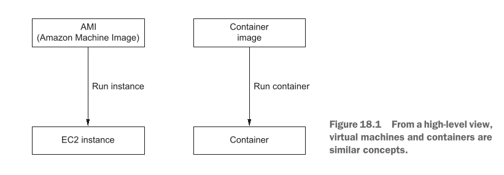
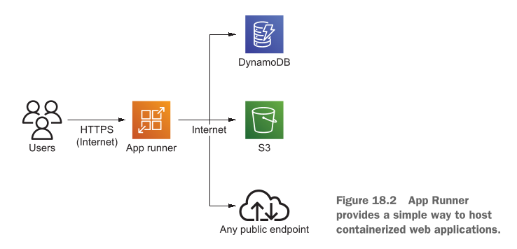
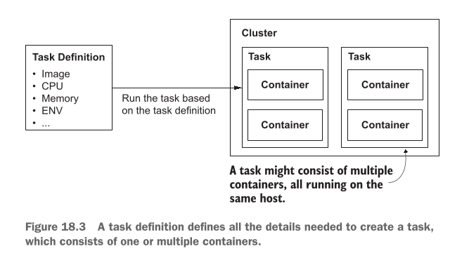
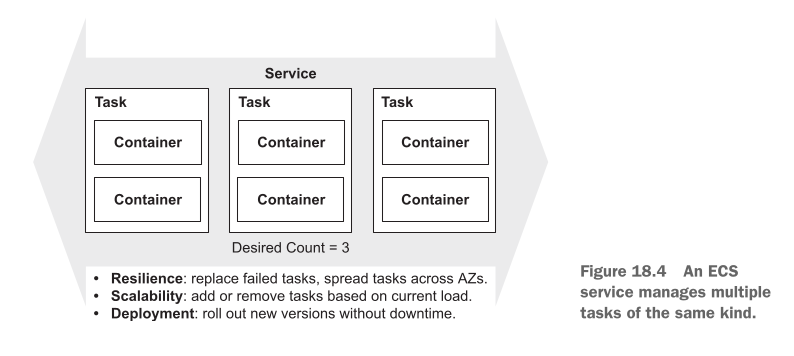
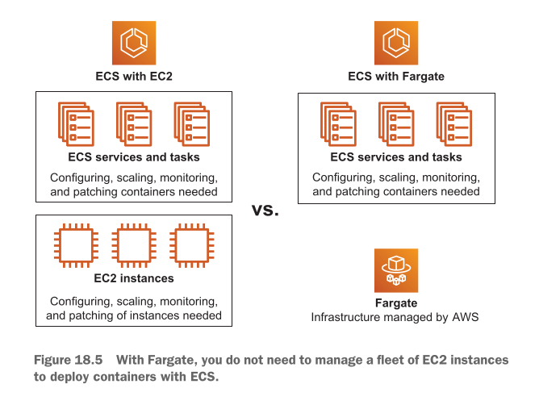
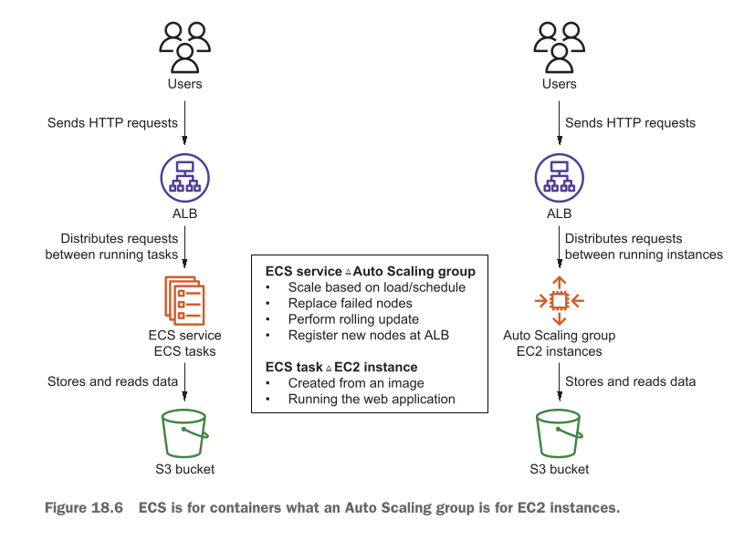
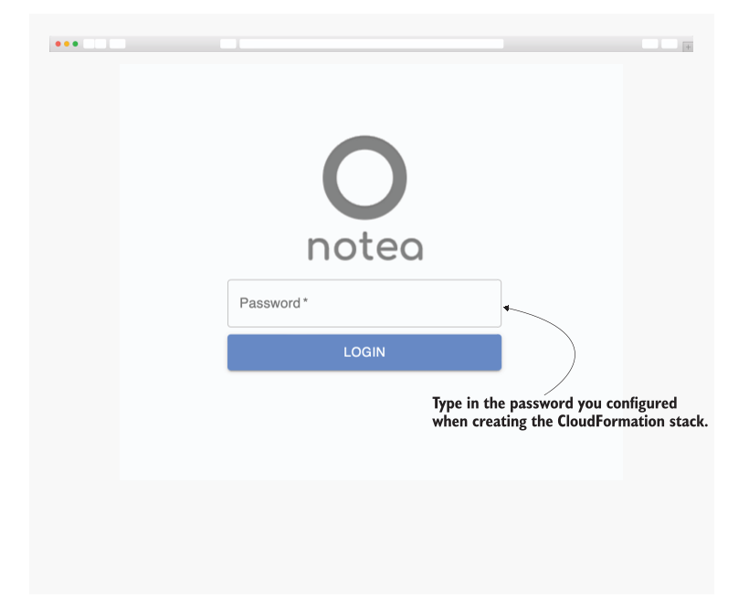
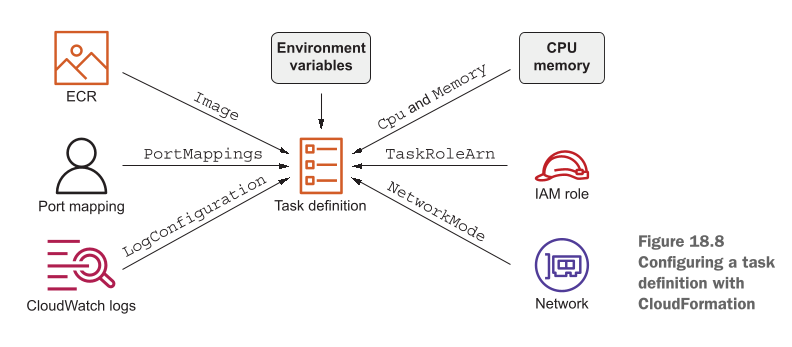

# Building modern architectures for the cloud: ECS, Fargate, and App Runner

<details open>
  <summary><strong>📚 Table of contents</strong></summary>

  <ul>
    <li><a href="#this-chapter-covers">This chapter covers</a></li>
    <li><a href="#comparing-different-options-to-run-containers-on-aws">Comparing different options to run containers on AWS</a></li>
    <li><a href="#the-ecs-basics-cluster-service-task-and-task-definition">The ECS basics: Cluster, service, task, and task definition</a></li>
    <li><a href="#aws-fargate-running-containers-without-managing-a-cluster-of-virtual-machines">AWS Fargate: Running containers without managing a cluster of virtual machines</a></li>
    <li><a href="#walking-through-a-cloud-native-architecture-ecs-fargate-and-s3">Walking through a cloud-native architecture: ECS, Fargate, and S3</a></li>
  </ul>

</details>

## **This chapter covers**

* **Deploying a web server with App Runner, the simplest way to run containers on AWS:** AWS par containers run karne ka sab se asaan tareeqa AWS App Runner hai. Isme aapko na servers ki fikar karni parti hai, na complex networking ki — sirf container do aur application live.
* **Comparing Elastic Container Service (ECS) and Elastic Kubernetes Service (EKS):** AWS par containers manage karne ke do baray orchestrators hain — ECS (AWS ka apna simple aur tightly-integrated tool) aur EKS (industry-standard Kubernetes ka managed version). In dono ka aapas mein farq aur use-case samjhaya jayega.
* **An introduction into ECS: cluster, task definition, task, and service:** Amazon ECS ke bunyadi building blocks ka breakdown:
* **Cluster:** Wo virtual ground ya boundary jahan aapke containers chalte hain.
* **Task Definition:** Ek blueprint ya recipe jismein likha hota hai ke container ko kitni CPU, memory, aur kaunsi image chahiye.
* **Task:** Us recipe par amal karke chalne wala actual running container instance.
* **Service:** Ek manager jo 24/7 dekhta hai ke aapke matlooba tadaad mein tasks theek se chal rahe hain ya nahi, aur crash hone par naya task start karta hai.


* **Running containers with Fargate without the need for managing virtual machines:** AWS Fargate ek serverless compute engine hai. Iska matlab aapko EC2 virtual machines create, patch, ya manage nahi karni partin; AWS background mein compute power khud sambhalta hai aur aap sirf apne container ke chalne ka pay karte hain.
* **Building a modern architecture based on ALB, ECS, Fargate, and S3:** Ek mukammal modern cloud architecture tayyar karna jismein traffic Application Load Balancer (ALB) sambhalay ga, containerized backend ECS aur Fargate par chalega, aur static files S3 par store hongi.

---

Writer batata hai ke jab wo clients ke sath consulting karte hain, toh do tarah ke projects aate hain:

* **Brownfield projects:** Ye wo projects hain jahan client ka purana setup (legacy system) pehle se company ke apne office ya data center (on-premises) mein chal raha hota hai. Maqsad pehle us system ko cloud par shift (migrate) karna hota hai, aur phir waqt ke sath usay modern banana hota hai. Iski misal aisi hai jaise ek purane bane banaye ghar ko renovate karna.
* **Greenfield projects:** Ye wo projects hain jahan sab kuch bilkul sifar (scratch) se shuru kiya jata hai aur cloud ki latest aur modern technologies ka istemal karke naya solution develop kiya jata hai. Iski misal ek khali plot par modern ghar tameer karne jaisi hai.

Containers aisi zabardast technology hain jo Brownfield aur Greenfield dono qism ke projects mein fit baithti hain. Purane applications ko containerize karke aasani se modernize kiya ja sakta hai, aur naye applications shuru se hi containers par build kiye ja sakte hain.

> **Docker Basics Note:** Writer yahan containers ko AWS par modern tareeqay se chalane par focus kar raha hai. Container image banane ya local machine par Docker chalane ki bunyadi basics ko book mein skip kiya gaya hai, jiske liye unhon ne *Docker in Action* ka hawala diya hai.

---

**Examples not covered by Free Tier**

* Is chapter ke practical examples AWS Free Tier ke tehat poori tarah cover nahi hote.
* In resources ko AWS par deploy karne par kharcha aam tor par **$1 per day** se bhi kam hota hai.
* Har example ke aakhir mein aur chapter ke end par tamam resources ko delete karne ka tareeqa diya gaya hai. Kharchay se bachne ke liye behtar yahi hai ke practicals ko kuch hi dino ke andar mukammal karke resources clean up kar diye jayein.

**Chapter requirements**

Is chapter ko samajhne ke liye darj zail cheezon ki bunyadi samajh honi chahiye:

* Containers ke andar software chalana (Docker ki basic samajh).
* **Amazon Simple Storage Service (S3):** Cloud par object data/files store karne ka tariqa.
* **Elastic Load Balancing (ELB):** Aane wali web traffic ko mukhtalif instances ya containers par barabar taqseem karna.
* **AWS CloudFormation:** Infrastructure as Code (IaC) ke zariye automated tareeqay se template files se poora cloud infrastructure khara karna.

---

**Why should you consider containers instead of virtual machines?**

Virtual machines (VMs) aur containers dono ka bunyadi maqsad ek jaisa hai: isolated environment mein software chalana. Isliye agar aapko EC2 virtual machines ka pehle se pata hai, toh container ko samajhna bilkul aasan hai.

**Figure 18.1 ka Jaiza**

**Figure 18.1** dono approaches ke darmiyan similarity ko high level par wazeh karti hai:

<div align="center">
  
</div>

* **Left Side (Virtual Machine Flow):** Hum ek **AMI (Amazon Machine Image)** letay hain aur `Run instance` ka command de kar ek **EC2 instance** khara kar letay hain. AMI ek master photocopy ya snapshot ki tarah hoti hai jismein Operating System aur zaroori configuration saved hoti hai.
* **Right Side (Container Flow):** Hum ek **Container image** letay hain aur `Run container` command de kar ek **Container** chala letay hain.

Dono methods ek pre-built image se hi start hote hain. Mental model ke tor par aap containers ko ek **Lightweight Virtual Machine** samajh sakte hain — jo VM ki tarah bhari bharkam Operating System ka load nahi leti balke bohot tezi se start hoti hai aur kam memory leti hai.

**"Works on my machine" ka Masla aur Docker ka Kirdar**

Developers ke darmiyan aksar ek purana masla rehta hai: *"Ye application mere laptop par bilkul theek chal raha hai, pata nahi production server par kyun phat gaya!"*

Aisa is liye hota hai kyunki developer ke laptop par libraries, environment variables, dependencies aur runtime version alag hote hain, jabke server par halaat mukhtalif hote hain.

2013 mein Docker ne container concept ko aam banaya. Real world mein jaise shipping containers hotay hain — ek lohay ka standard box jismein chahe kapray hon, car ho ya electronics, us box ka size standard hota hai aur wo aaram se ship, train ya truck par fit ho jata hai. Isi tarah software development mein:

* Container ek standardized unit ban jata hai jismein aapka application code, uski tamam libraries, binaries aur configs aik sath pack ho jati hain.
* Ye standardize package **Continuous Deployment (CD)** ko aasan banata hai, jahan har naya code change baghair kisi kharabi ke automatically test aur production environments par deploy ho jata hai.

**Portability aur uski Asal Limits**

Nazriyati (theoretical) tor par, aap ek hi container image ko:

1. Apne local laptop par chala sakte hain.
2. Apni company ke on-premises data center mein chala sakte hain.
3. AWS jese public cloud provider par chala sakte hain.

Iske baraks, EC2 ki AMI ko apne local laptop par chalana intehayi mushkil aur complex hota hai. Lekin containers mein bhi do ahem hudood (boundaries) hoti hain:

* **OS Boundary:** Linux container sirf Linux host (kernel) par chalega, aur Windows container Windows par.
* **CPU Architecture Boundary:** Agar container image Intel/AMD (x86_64) processor ke liye bani hai, toh wo ARM chips (jaise AWS Graviton ya Apple Silicon) par directly bina emulation ke us tarah behave nahi karegi.

> **Vendor Marketing vs Reality:** Cloud vendors aksar dawat dete hain ke "container ko uthao aur kisi bhi cloud par le jao baghair kisi badlao ke." Haqeeqat mein container image zaroor portable hoti hai, lekin poore system ko doosre cloud ke network, IAM permissions, database aur monitoring systems ke sath integrate karne mein kafi mehnat darkar hoti hai.

**Immutable Servers ka Tasawwur**

Containers ek behtareen engineering practice ko lazmi banate hain jise **Immutable Server** kaha jata hai.

* **Mutable Server (Purana tareeqa):** Ek server launch kiya, jab koi bug theek karna ho ya library update karni ho toh live chalte hue server ke andar login (SSH) kiya aur wahan ja kar changes kar diye. Isse waqt ke sath system un-predictable ho jata hai.
* **Immutable Server (Modern tareeqa):** Ek aesa server jisko launch karne ke baad kabhi tabdeel (modify) nahi kiya jata. Agar koi chota sa code change ya update karna hai, toh:
1. Purani chal rahi cheez ko modify nahi karte.
2. Nayi image build ki jati hai.
3. Nayi image se naye servers/containers launch kiye jate hain.
4. Purane containers ko band (destroy) kar diya jata hai.


Containers mein aam tor par chalte hue container mein login karke changes karne ki ijazat nahi hoti (aur na hi ye recommend kiya jata hai). Isliye containers by-design aapko immutable server model par chalne par majboor karte hain.

Is poore process ki bunyad **Dockerfile** hoti hai — ek aisi configuration file jismein step-by-step instructions (recipe) likhi hoti hain ke container image ko kaise prepare aur build karna hai.


---


## **Comparing different options to run containers on AWS**

AWS par containers chalane ke liye bohot se raste hain, lekin sab se seedha aur asan tareeqa **AWS App Runner** hai. App Runner ek aisi service hai jahan aapko load balancers, virtual servers, ya complex networking ki fikar karne ki zaroorat nahi hoti. Sirf container image ka link do, aur AWS aapke liye sab kuch configure karke ek live URL faraham kar deta hai.

Agar aapki local machine par AWS CLI configured nahi hai, toh use pehle set up karna zaroori hai taake terminal se AWS commands chalaye ja sakein.

---

**Listing 18.1 Creating an App Runner service**

```bash
aws apprunner create-service \
  --service-name simple \
  --source-configuration '{"ImageRepository": \
  {"ImageIdentifier": "public.ecr.aws/s5r5alt5/simple:latest", \
  "ImageRepositoryType": "ECR_PUBLIC"}}'
```

* `aws apprunner create-service`: Yeh CLI ka main command hai jo App Runner ke andar aik nayi service create karne ka hukum deta hai.
* `--service-name simple`: Service ka naam `simple` rakha gaya hai taake AWS console ya CLI mein isay asaani se pehchana ja sakay.
* `--source-configuration`: Yeh parameter App Runner ko batata hai ke container kahan se uthana hai.
* `ImageIdentifier`: Container registry ka mukammal path hai (`public.ecr.aws/s5r5alt5/simple:latest`), jo Amazon ECR Public Gallery par mojood ek simple web server image ko point kar raha hai.
* `ImageRepositoryType`: Iski value `"ECR_PUBLIC"` set ki gayi hai, jo yeh wazeh karti hai ke image Amazon ECR ke public repository mein parri hai aur isay download karne ke liye kisi private password ya secret credentials ki zaroorat nahi hai.


---

Command run hone ke baad takreeban 5 minute lagte hain service ko tayyar hone mein. Uske baad hum service ka status aur URL check karne ke liye Listing 18.2 wala command chalate hain.

**Listing 18.2 Fetching information about App Runner services**

```bash
$ aws apprunner list-services
{
  "ServiceSummaryList": [
    {
      "ServiceName": "simple",
      "ServiceId": "5e7ffd09c13d4d6189e9bb51fc0f230",
      "ServiceArn": "arn:aws:apprunner:us-east-1:...", 
      "ServiceUrl": "bxjsdpnnaz.us-east-1.awsapprunner.com", 
      "CreatedAt": "2022-01-07T20:26:48+01:00",
      "UpdatedAt": "2022-01-07T20:26:48+01:00",
      "Status": "RUNNING" 
    }
  ]
}
```

* `aws apprunner list-services`: Is account aur region mein mojood tamam App Runner services ki summary nikalta hai.
* `"ServiceName": "simple"`: Service ka wahi naam jo humne create karte waqt rakha tha.
* `"ServiceId"`: AWS ki taraf se assign kardah unique identifier.
* `"ServiceArn"`: Amazon Resource Name (ARN) — AWS resource ka unique pata, jo service ko delete ya update karte waqt kaam aata hai.
* `"ServiceUrl"`: Default domain name jo AWS ne generate karke diya. Is URL ko browser mein open karke aap apni live running application dekh sakte hain. App Runner custom domains (maslan `example.com`) ko bhi mukammal support karta hai.
* `"Status": "RUNNING"`: Yeh zahir karta hai ke background mein infrastructure create ho chuka hai, container active hai, aur requests receive karne ke liye tayyar hai.

---

**Figure 18.2 ka Jaiza**

**Figure 18.2** App Runner ke flow aur architecture ko wazeh karti hai:

<div align="center">
  
</div>

* **Users to App Runner:** Bahir se internet ke users `HTTPS` ke zariye App Runner ko access karte hain. Yeh request automated tareeqay se load balancer se hoti hui container tak pohnachti hai.
* **App Runner to Backend / AWS Services:** Container ke andar chalne wali web application internet ke zariye doosri AWS services jese **Amazon DynamoDB** (database), **Amazon S3** (file storage), ya kisi bhi **Public Endpoint / API** ke sath connect ho sakti hai.
* **Platform as a Service (PaaS):** App Runner developer ko infrastructure management se azaad kar deta hai. Aap sirf application ka container image faraham karte hain, aur App Runner khud yeh kaam karta hai:
* Container ko start karna aur uski health monitor karna.
* Users ki aane wali requests ko active containers ke darmiyan barabar baantna (Load Balancing).
* Agar traffic barh jaye toh mazeed containers start karna (Auto-scaling) aur load kam hone par containers kam kar dena.


---

**Pricing Model (Bachat aur Kharcha Kaise Calculate Hota Hai?)**

App Runner ka pricing model bohot dilchasp hai: **Jab container koi request process nahi kar raha hota (idle time), toh CPU ka kharcha $0 hota hai — aap sirf memory (RAM) ka pay karte hain**. Jab koi user request bhejta hai, sirf tab CPU active hoti hai aur uska kharcha shuru hota hai.

Misal ke taur par, ek application jo sirf subah 9 AM se sham 5 PM tak (8 hours per day) use hoti hai, aur baqi 16 ghante bilkul farigh rehti hai:

* Minimum configuration: **1 vCPU** aur **2 GB RAM**.
* **Active Hours (8 ghante/din — 30 din):**
* 1 vCPU: $\$0.064 \times 8 \times 30 = \$15.36$ mahana
* 2 GB Memory: $2 \times \$0.007 \times 8 \times 30 = \$3.36$ mahana


* **Inactive Hours (16 ghante/din — 30 din — CPU bilkul free):**
* 2 GB Memory: $2 \times \$0.007 \times 16 \times 30 = \$6.72$ mahana


* **Total Mahana Kharcha:** $\$15.36 + \$3.36 + \$6.72 = \mathbf{\$25.44}$ mahana.

---

**Listing 18.3 Deleting an App Runner service**

Kharchay se bachne ke liye kaam khatam hote hi service ko delete karna zaroori hai.

```bash
aws apprunner delete-service \
  --service-arn $ServiceArn

```

* `aws apprunner delete-service`: Service aur uske sath attached load balancing infrastructure ko khatam karne ka command.
* `--service-arn $ServiceArn`: `$ServiceArn` ki jagah wo mukammal ARN likhein jo Listing 18.2 ke output mein mila tha.

---

**App Runner ki Limitations**

App Runner itna asaan hone ke bawajood har jagah fit nahi baithta:

* **SLA (Service Level Agreement):** Launch ke waqt iske paas enterprise-grade financial uptime commitment (SLA) mojood nahi thi.
* **High-Traffic Par Mehnga:** Choti aur low-traffic applications ke liye App Runner bohot sasta hai. Lekin agar aapki application par musalsal lakhon requests aa rahi hain aur CPU 24 ghante busy rehta hai, toh yeh doosre tareeqon (jaise ECS ya EKS) ke muqablay mein kafi mehnga parh sakta hai.

---

**Amazon ECS vs Amazon EKS**

AWS par containers run karne ke do baray orchestrators hain: **Amazon Elastic Container Service (ECS)** aur **Amazon Elastic Kubernetes Service (EKS)**.

**WHAT IS KUBERNETES?**

Kubernetes (jise **K8s** bhi kaha jata hai) ek open-source system hai jo hazaron containers ko automatically deploy, scale, aur manage karta hai. Isay Google ne banaya tha aur aaj kal **CNCF (Cloud Native Computing Foundation)** isay maintain karti hai. Yeh local machine, private data center, aur public clouds har jagah chal sakta hai.

Dono tools ka core maqsad aik hi hai:

* Agar koi container crash ho jaye, toh naya container start karna.
* Naya code bina downtime ke deploy karna.
* Traffic ke hisab se containers ki tadaad ko kam ya zyada karna.

---

**Table 18.1 Launch configuration parameters**

| Category | ECS | EKS |
| --- | --- | --- |
| **Portability** | ECS AWS par dastiyab hai. ECS Anywhere on-premises workloads ke liye ECS istemal karne ka ek extension hai. Doosre cloud providers ECS ko support nahi karte. | EKS AWS par dastiyab hai. On-premises workloads ke liye, aap ke paas EKS Anywhere hai, jo AWS ki taraf se supported hai lekin uske liye VMware vSphere ki zaroorat hoti hai aur yeh option deta hai ke aap Kubernetes ko khud deploy aur manage karein. Iske ilawa, zyadatar doosre cloud providers ke paas bhi Kubernetes ki offering hoti hai. |
| **License** | Proprietary service hai lekin bilkul muft (free of charge) hai. | Open source license hai (Apache License 2.0). |
| **Ecosystem** | Bohat saari AWS services (misal ke taur par ALB, IAM, aur VPC) ke sath bohat behtareen tareeqay se kaam karta hai. | Aik vibrant open source ecosystem ke sath ata hai (misal ke taur par Prometheus, Helm). AWS services ke sath integration mojood hai lekin hamesha mukammal mature nahi hoti. |
| **Costs** | Cluster muft hota hai. Lazmi baat hai, aap compute infrastructure ke pese ada karte hain. | AWS har cluster ke liye taqreeban $72 mahana charge karta hai. Iske ilawa, AWS sifarish karta hai ke aisay workloads ko jo isolation chahte hain, ek hi cluster par deploy na karein. Iske oopar, aap compute infrastructure ke bhi pese de rahe hote hain. |

---

**Writer ka Faisla (Author's Preference)**

Agarche Kubernetes developers mein bohot mashhoor hai, writer zyada tar workloads ke liye **Amazon ECS** ko tarjeeh deta hai:

* ECS ka apna cluster management bilkul **free** hai, jabke EKS mein har cluster ke alag paise dene parte hain.
* ECS AWS ki baqi services (IAM roles, CloudWatch, ALB) ke sath seedha aur behtareen integrate hota hai.
* AWS CloudFormation ke sath ECS ki integration mukammal aur robust hai, jisse Infrastructure as Code likhna intehayi aasan ho jata hai.


---

## **The ECS basics: Cluster, service, task, and task definition**

Amazon ECS par containers chalane ke poore nizam ko samajhne ke liye chaar bunyadi pillars ko step-by-step samajhna zaroori hai: **Cluster**, **Task Definition**, **Task**, aur **Service**.

---

**1. Cluster (Boundary / Logical Group)**

* ECS par koi bhi kaam shuru karne ke liye sab se pehle ek **Cluster** banana parta hai.
* Yeh koi physical machine nahi balke ek **Logical Group** (virtual boundary) hai, jiske andar aapke tamam containerized workloads aur resources organize rehte hain.
* Mukhtalif qism ke kamon ko aapas mein alag (isolate) rakhne ke liye alag alag clusters banaye jate hain. Misal ke taur par:
* Ek cluster **Test Environment** ke liye.
* Doosra cluster **Production Environment** ke liye. Is tarah testing ke doran ki gayi ghalti ka asar live production users par nahi parta.


* **Cost & Limits:** ECS cluster banana bilkul **muft (free)** hota hai. AWS default taur par ek account mein **10,000 clusters** tak banane ki ijazat deta hai (jo aam tor par kisi bhi organization ki zaroorat se bohot zyada hai).

---

**2. Task Definition (Blueprint / Recipe)**

ECS par container chalane se pehle aapko ek **Task Definition** likhni parti hai. Yeh asal mein ek blueprint ya recipe hoti hai jismein ECS ko bataya jata hai ke container ko kaise chalana hai.

Is recipe mein darj zail cheezein define ki jati hain:

* **The container image URL:** Application image kahan store hai (maslan Amazon ECR ya Docker Hub ka address).
* **Provisioned baseline and limit for CPU:** Container ko chalne ke liye kam az kam kitni CPU power chahiye (baseline) aur load barhne par wo zyada se zyada kitni CPU use kar sakta hai (limit).
* **Provisioned baseline and limit for memory:** Container ke liye kam az kam aur zyada se zyada RAM (memory) ki hadd.
* **Environment variables:** Application ke secret keys, configuration settings, ya database connection strings.
* **Network configuration:** Container kis networking mode mein chalega aur wo bahir ki duniya ya doosre containers se kis port par rabta karega.

> **Ahem Nuqta:** Aik hi Task Definition ke andar aap **aik container** bhi define kar sakte hain ya **ek se zyada containers** (multi-container task) bhi likh sakte hain.

---

**Figure 18.3 ka Jaiza**

**Figure 18.3** Task Definition se Task banne ke amal ko wazeh karti hai:

<div align="center">
  
</div>

* **Left Side (Task Definition):** Yahan tamam specifications (Image, CPU, Memory, ENV variables) mojood hain.
* **Right Side (Cluster ke andar Running Tasks):** Jab hum command dete hain *"Run the task based on the task definition"*, toh Cluster ke andar actual Tasks launch ho jate hain.
* **Co-located Containers on Same Host:** Figure 18.3 mein wazeh dikhaya gaya hai ke agar aik task ke andar multiple containers define hain, toh ECS un tamam containers ko **hamesha aik hi host (same underlying machine)** par launch karega. Iska sab se bara faida yeh hota hai ke agar do containers ko aapas mein local resources share karne hon — maslan `localhost` ke zariye high-speed networking ya shared local storage — toh wo asaani se bina network latency ke ek doosre se baat kar sakte hain.

---

**3. Task (Running Instance)**

* Task asal mein Task Definition (recipe) ka aik **chalta hua amli roop (running instance)** hota hai.
* Task create karne ke liye aapko do cheezein specify karni parti hain:
1. Kaunse **Cluster** mein chalana hai.
2. Kaunsi **Task Definition** ke mutabiq chalana hai.


* Command milte hi ECS define kiye gaye containers ko cluster ke andar foran start kar deta hai.

---

**4. ECS Service (Automated Manager / 24/7 Supervisor)**

Aap Task ko manually (khud se) bhi run kar sakte hain, lekin production mein manually task chalana kafi khatarnak hota hai. Farz karein aapne ek web server task chalaya aur wo raat ko kisi bug ya server failure ki wajah se crash ho gaya, toh manual task dobara khud nahi chalega aur aapki website band ho jayegi.

Real-world web applications mein:

* Kam az kam 2 containers har waqt 24/7 chalte rehne chahiye taake load do alag alag **Availability Zones (AZs)** mein taqseem ho sake (agar ek data center mein masla aaye toh doosra chalta rahe).
* Jab website par achanak traffic barh jaye, toh foran naye containers start ho jane chahiye.

Is poore automated nizam ko chalane ke liye **ECS Service** ka istemal hota hai. Aap ECS Service ko containers ke liye ek **Auto Scaling Group** samajh sakte hain.

---

**Figure 18.4 ka Jaiza**

**Figure 18.4** ECS Service ke kirdar aur uske tehat chalne wale tasks ko dikhati hai:

<div align="center">
  
</div>

* Diagram mein Service ke andar **Desired Count = 3** set hai. Iska matlab service ka kaam yeh ensure karna hai ke har lamha 3 Tasks active aur healthy chal rahe hon.
* Ek ECS Service darj zail 5 ahem zimmedariyan sambhalti hai:
* **Runs multiple tasks of the same kind:** Ek hi recipe ke mutabiq aik se zyada duplicate tasks chalana.
* **Resilience (Monitors and replaces failed tasks):** Tasks ki sehat par musalsal nazar rakhna. Agar koi container crash ho jaye ya un-healthy ho jaye, toh service foran usay khatam karke uski jagah naya healthy task launch kar deti hai.
* **Spreads tasks across availability zones:** High availability ke liye tasks ko mukhtalif Availability Zones ke darmiyan barabar phela kar chalati hai.
* **Scalability (Scales the number of tasks based on load):** Traffic ke mutabiq tasks ki tadaad ko barhana (scale out) aur load kam hone par faltu tasks ko band karna (scale in).
* **Deployment (Orchestrates rolling updates):** Jab application ka naya version release karna ho, toh service baghair kisi downtime ke rolling update karti hai — pehle naye version ka task chalu karti hai, jab wo theek chal parta hai tab purane version ke task ko band karti hai.

---

## **AWS Fargate: Running containers without managing a cluster of virtual machines**

**AWS ki Tareekh aur Fargate ki Zaroorat**

Jab Amazon ECS 2015 mein launch hua, toh us waqt containers chalane ka setup do hisson (layers) mein banta tha:

1. **Container Layer:** Application ka Docker container, uski configuration aur scaling.
2. **Infrastructure Layer:** Wo EC2 virtual machines (servers) jin ke oopar ye containers chalte thay.

Is purane model mein developer ko dohra bojh uthana parta tha: container ke sath sath neeche chalne wale EC2 instances ka Operating System update karna, security patches lagana, disk space monitor karna, aur un instances ki auto-scaling manage karna. Yeh kaam system ko intehayi mushkil aur complex bana deta tha.

November 2017 mein AWS ne **AWS Fargate** launch kiya, jis ne game badal di. Fargate ek **Serverless Compute Engine** hai. Iska matlab ab aapko EC2 virtual machines create ya manage karne ki zaroorat nahi rehti — aap sirf container dete hain, aur AWS background mein compute power khud manage karta hai.

---

**Figure 18.5 ka Jaiza**

**Figure 18.5** ECS with EC2 aur ECS with Fargate ke darmiyan farq ko wazeh karti hai:

<div align="center">
  
</div>

* **Left Side (ECS with EC2 — 2 Layers of Work):**
* **ECS services and tasks:** Aapko containers configure, scale, monitor aur patch karne parte hain.
* **EC2 instances:** Neeche mojood virtual machines ko bhi alag se configure, scale, monitor aur OS patching karni parti hai.


* **Right Side (ECS with Fargate — 1 Layer of Work):**
* **ECS services and tasks:** Aap sirf apne containerized software par focus karte hain.
* **Fargate (Managed by AWS):** Neeche ka tamam hardware, OS, security patches aur server maintenance AWS khud sambhalta hai.


---

**Fargate ki Availability aur Platforms**

* Fargate sirf Amazon ECS ke sath hi nahi balke **Amazon EKS (Kubernetes)** ke sath bhi mukammal kaam karta hai.
* Operating System ke aitbar se Fargate **Amazon Linux** ke sath sath **Microsoft Windows Server 2019 (Full aur Core editions)** ko bhi support karta hai.

---

**Resource Configuration: EC2 vs Fargate**

* **EC2 Model:** Aapko bana banaya instance type (maslan `t3.medium` ya `m6g.medium`) choose karna parta hai, jismein CPU aur RAM ki miqdar pehle se fix hoti hai.
* **Fargate Model:** Aap har task ke hisab se exact **CPU** aur **Memory (RAM)** define karte hain ke is task ko kitne resources chahiye.

---

**Table 18.2 Provisioning CPU and memory for Fargate**

| CPU | Memory (Roman Urdu) |
| --- | --- |
| **0.25 vCPU** | 0.5 GB, 1 GB, ya 2 GB |
| **0.5 vCPU** | Minimum 1 GB, Maximum 4 GB, 1 GB ke increments |
| **1 vCPU** | Minimum 2 GB, Maximum 8 GB, 1 GB ke increments |
| **2 vCPU** | Minimum 4 GB, Maximum 16 GB, 1 GB ke increments |
| **4 vCPU** | Minimum 8 GB, Maximum 30 GB, 1 GB ke increments |
| **8 vCPU** | Minimum 16 GB, Maximum 60 GB, 4 GB ke increments |
| **16 vCPU** | Minimum 32 GB, Maximum 120 GB, 8 GB ke increments |

*Table ki Samajh:* Fargate mein aap apni marzi se koi bhi random combination nahi bana sakte. Misal ke taur par, agar aap **0.25 vCPU** (1/4 core) muntakhib karte hain, toh aap sirf 0.5 GB, 1 GB ya 2 GB memory hi select kar sakte hain. Jabke **1 vCPU** ke sath aap 2 GB se lekar 8 GB tak memory 1 GB ke hisab se (2 GB, 3 GB, 4 GB... 8 GB) barha sakte hain.

---

**Fargate Pricing aur Cost Calculation**

Fargate ka billing cycle **per-second** chalta hai — us lamhe se jab container image download hona shuru hoti hai, us lamhe tak jab task band (terminate) hota hai.

Kharchay ka daromadar region, operating system, aur processor architecture (Intel/AMD `x86` ya AWS Graviton `ARM`) par hota hai. `us-east-1` region mein **Linux/ARM** ke sath **1 vCPU aur 4 GB Memory** wale task ka mahana kharcha is tarah calculate hota hai:

* **1 vCPU ka Kharcha:**
$$\$0.04048 \text{ (per hour)} \times 24 \text{ hours} \times 30 \text{ days} = \mathbf{\$29.15} \text{ per month}$$


* **4 GB Memory ka Kharcha:**
$$4 \text{ GB} \times \$0.004445 \text{ (per GB-hour)} \times 24 \text{ hours} \times 30 \text{ days} = \mathbf{\$12.80} \text{ per month}$$


* **Total Mahana Bill:**
$$\$29.15 + \$12.80 = \mathbf{\$41.95} \text{ per month}$$


*(Book ke text mein summary sentence ke andar "1 vCPU and 2 GB memory" likha hai jo ek drafting typo hai, kyunki upar math aur calculation wazeh taur par 4 GB memory ke hisab se ki gayi hai).*

---

**Trade-Off: EC2 Sasta Hai Ya Fargate?**

Khaam resources (raw compute) ke hisab se EC2 instance sasta dikhta hai:

* Ek `m6g.medium` EC2 instance (1 vCPU, 4 GB RAM) taqreeban **$27.72 per month** deta hai, jabke wahi capacity Fargate par **$41.95 per month** parti hai.

Lekin EC2 chalane ke do baray chhupe hue nuqsanat (hidden costs) hain:

* **Resource Fragmentation aur Overprovisioning:** Agar aapne ek EC2 instance liya aur us par 2 containers chalaye jinhon ne 70% machine use ki, toh baqi 30% space khali reh kar zaya ho jati hai lekin bill poore 100% ka aata hai. Fargate mein aap sirf usi hissay ka pay karte hain jo aapne task ke liye reserve kiya.
* **Engineering Time (Operational Overhead):** EC2 instances ko update karna, monitor karna, cluster auto-scaler configure karna aur security patches lagana engineers ka qeemti waqt leta hai jiski salary cloud bill se kahin zyada mehngi parti hai.

Isi liye aksar use-cases mein Fargate ka thora sa zyada bill engineer ki mehnat aur time bacha kar overall sasta parta hai.

---

**Fargate ki Limitations**

Fargate har kaam ke liye nahi hai. Iski ahem pabandiyan yeh hain:

* **Resource Limit:** Ek single task zyada se zyada **16 vCPU aur 120 GB memory** tak ja sakta hai (bohot bhari database workloads ke liye kam parh sakta hai).
* **Privileged Mode Missing:** Fargate par containers `--privileged` mode mein nahi chal sakte. Iska matlab container ko host machine ke kernel ya low-level hardware tak direct access nahi milti (maslan container ke andar Docker chalana ya custom network interfaces banana mumkin nahi).
* **Missing GPU Support:** AI/Machine Learning ya high-performance graphic workloads ke liye Fargate par GPU compute dastiyab nahi hai.
* **EBS Volume Attachment:** Fargate launch ke waqt standard **Amazon EBS (Elastic Block Store)** volumes ko directly attach karne ki ijazat nahi deta tha (data persist karne ke liye AWS EFS ya Ephemeral storage use karni parti thi). Modern AWS updates mein ECS Fargate par EBS volumes attach karne ki support shamil kar di gayi hai, lekin direct low-level block storage control ab bhi EC2 ke muqablay mein limited rehta hai.


---


## **Walking through a cloud-native architecture: ECS, Fargate, and S3**

Real-world mein hum sab mukhtalif kamo ke doran notes banate hain — chahe client ke sath call par hon, kisi naye feature ka plan bana rahe hon, ya AWS ki koi nayi service explore kar rahe hon.

Is section mein writer ek mukammal production-ready cloud application deploy karke dikha raha hai jiska naam **Notea** hai:

* **Notea kya hai?** Yeh ek open-source, privacy-focused note-taking application hai.
* **Tech Stack:** Iska frontend **React** mein bana hai, backend **Next.js** par chal raha hai, aur application ka poora data (tamam notes) permanently **Amazon S3** par save hota hai.

---

**Figure 18.6 ka Jaiza: Modern Cloud-Native Architecture**

**Figure 18.6** mein do architectures ka aamne saamne mawazna (comparison) kiya gaya hai taake aapka EC2 ka purana concept seedha ECS par map ho sakay:

<div align="center">
  
</div>

* **Left Side (Modern ECS & Fargate Architecture):**
1. **Users:** Internet se users `HTTP` requests bhejte hain.
2. **Application Load Balancer (ALB):** Tamam incoming traffic ko receive karta hai aur neeche chal rahe active ECS Tasks (containers) ke darmiyan barabar taqseem karta hai.
3. **ECS Service & Tasks:** ECS Service tasks ko maintain karti hai aur traffic/CPU load barhne par Fargate par naye containers spin up karti hai.
4. **Fargate:** Serverless compute capacity faraham karta hai (koi EC2 instance manage nahi karna parta).
5. **Amazon S3 Bucket:** Application ka backend tamam notes ko S3 bucket ke andar read aur write karta hai.


* **Right Side (Traditional EC2 Architecture):**
1. ALB aane wali traffic ko EC2 instances par bhejta hai.
2. Auto Scaling Group load ke hisab se EC2 virtual machines ko kam ya zyada karta hai.
3. EC2 instances S3 se data read/write karte hain.


* **Dono ka Direct Comparison:**
* **ECS Service $\triangleq$ Auto Scaling Group:** Dono load ke hisab se scale karte hain, kharab hone wale nodes ko replace karte hain, rolling updates karte hain, aur load balancer (ALB) par naye nodes ko register karte hain.
* **ECS Task $\triangleq$ EC2 Instance:** Dono ek base image se bante hain aur dono ke andar actual web application execute ho rahi hoti hai.


---

**CloudFormation ke Zariye Stack Deploy Karna**

Is poore infrastructure (ALB, ECS Cluster, Fargate Tasks, IAM Roles, S3 Bucket, Auto Scaling) ko aik single CloudFormation template se deploy kiya gaya hai jo book ke GitHub repository (`awsinaction-code3/chapter18/notea.yaml`) par mojood hai.

Terminal mein yeh command execute karein:

```bash
aws cloudformation create-stack --stack-name notea \
  --template-url https://s3.amazonaws.com/awsinaction-code3/chapter18/notea.yaml --parameters \
  "ParameterKey=ApplicationID,ParameterValue=$ApplicationId" \
  "ParameterKey=Password,ParameterValue=$Password" \
  --capabilities CAPABILITY_IAM
```

* `aws cloudformation create-stack`: CloudFormation ko naya stack banane ka hukum deta hai.
* `--stack-name notea`: Stack ka naam `notea` rakha gaya hai.
* `--template-url`: AWS S3 par mojood template file ka direct URL.
* `--parameters`:
* `ApplicationID`: Ek unique naam/abbreviation (maslan aapka naam) jo S3 bucket aur resources ke unique naamo ke liye use hoga.
* `Password`: Notea application ko login karne ke liye password.


* `CAPABILITY_IAM`: Kyunki yeh template IAM roles create karti hai, isliye AWS CLI ko explicit ijazat dena zaroori hai.

> **Security Alert:** Kyunki yeh test deployment plain `HTTP` par chal rahi hai (HTTPS certificate attach nahi hai), isliye apna koi real/sensitive password use na karein, sirf ek temporary throwaway password rakhein.

---

**Stack Creation ka Intezar aur URL Hasil Karna**

Deployment mukammal hone mein taqreeban 5 minute lagte hain. Status check karne aur direct URL nikalne ke liye yeh combined command chalayein:

```bash
aws cloudformation wait stack-create-complete \
  --stack-name notea && aws cloudformation describe-stacks \
  --stack-name notea --query "Stacks[0].Outputs[0].OutputValue" \
  --output text
```

* `aws cloudformation wait stack-create-complete`: Yeh command terminal ko us waqt tak pause rakhta hai jab tak AWS par tamam resources kamyabi se ban nahi jate.
* `aws cloudformation describe-stacks`: Stack banne ke baad uske Outputs mein se Load Balancer ka live public DNS/URL extract karta hai.

---

**Figure 18.7 ka Jaiza**

<div align="center">
  
</div>

**Figure 18.7** Notea ka login page dikhati hai. Jab aap terminal se mila hua URL browser mein kholte hain, toh samne Notea ka login screen aata hai. Wahan wahi password enter karein jo aapne CloudFormation command ke parameter `$Password` mein define kiya tha, aur aapka note-taking dashboard khul jayega.

---

**Figure 18.8 ka Jaiza: Task Definition ke Components**

**Figure 18.8** Task Definition ke mukhtalif hisson ko aik jagah summarize karti hai:

<div align="center">
  
</div>

* **ECR (Image):** Container image kahan se download hogi.
* **Environment variables:** Container ko chalne ke liye kon se configs chahiye.
* **CPU / Memory:** Task ko chalne ke liye kitni compute power darkar hai.
* **TaskRoleArn (IAM role):** Container ko S3 bucket access karne ka permission pass.
* **Network (NetworkMode):** Task ka network connection (Fargate ke liye hamesha `awsvpc`).
* **CloudWatch logs (LogConfiguration):** Application logs kahan save honge.
* **Port mapping:** Container kis internal port par traffic sun raha hai.

---

**Listing 18.4 Configuring a task definition**

```yaml
TaskDefinition:
  Type: 'AWS::ECS::TaskDefinition'
  Properties:
    ContainerDefinitions:
      - Name: app
        Image: 'public.ecr.aws/s5r5alt5/notea:latest'
        PortMappings:
          - ContainerPort: 3000
            Protocol: tcp
            Essential: true
        LogConfiguration:
          LogDriver: awslogs
          Options:
            'awslogs-region': !Ref 'AWS::Region'
            'awslogs-group': !Ref LogGroup
            'awslogs-stream-prefix': app
        Environment:
          - Name: 'PASSWORD'
            Value: !Ref Password
          - Name: 'STORE_REGION'
            Value: !Ref 'AWS::Region'
          - Name: 'STORE_BUCKET'
            Value: !Ref Bucket
          - Name: 'COOKIE_SECURE'
            Value: 'false'
    Cpu: 512
    ExecutionRoleArn: !GetAtt TaskExecutionRole.Arn
    Family: !Ref 'AWS::StackName'
    Memory: 1024
    NetworkMode: awsvpc
    RequiresCompatibilities:
      - FARGATE
    TaskRoleArn: !GetAtt TaskRole.Arn
```

* `ContainerDefinitions`: Task ke andar chalne wale containers ki list.
* `Name: app`: Container ka reference naam.
* `Image: 'public.ecr.aws/s5r5alt5/notea:latest'`: ECR Public repository se pre-built Notea application image.
* `PortMappings`: Container ke andar port `3000` par web server listen kar raha hai. `Essential: true` ka matlab agar yeh container band hua toh poora task crash tasawwur hoga.
* `LogConfiguration`: `awslogs` driver use kiya gaya hai jo container ke console outputs (stdout/stderr) ko seedha CloudWatch Logs group mein stream karta hai.
* `Environment`: Container ko 4 configurations pass ki gayi hain: login password, S3 bucket ka region, S3 bucket ka naam, aur `COOKIE_SECURE: 'false'` (kyunki abhi plain HTTP use ho rahi hai).


* `Cpu: 512`: Fargate is task ko **0.5 vCPU** ($512 / 1024$) compute power dega.
* `Memory: 1024`: Task ke liye **1 GB (1024 MB)** RAM allocate hogi.
* `NetworkMode: awsvpc`: Fargate ke liye lazmi network mode. Iska matlab har task ko VPC ke andar apna aik alag private IP aur **Elastic Network Interface (ENI)** milta hai, bilkul aik mukammal EC2 instance ki tarah.
* `RequiresCompatibilities: [FARGATE]`: ECS ko batata hai ke yeh task sirf Fargate engine par launch hoga.

---

**Execution Role vs Task Role ka Farq**

Task Definition ke andar do mukhtalif IAM roles istemal hote hain jin ka farq samajhna intehayi zaroori hai:

* **ExecutionRoleArn (Fargate ka apna Guard Badge):** Yeh role **AWS Fargate infrastructure** use karta hai. Iska kaam container ke chalne se pehle ECR se private/public image download karna aur CloudWatch Logs mein log streams create karna hota hai.
* **TaskRoleArn (Container ke andar chalne wali Application ka Badge):** Yeh role container ke **andar mojood code** ko milta hai. Notea application ko user ke notes save karne ke liye Amazon S3 bucket par read/write permissions chahiye hoti hain, jo is role ke zariye di jati hain.

---

**Listing 18.5 Granting the container access to objects in an S3 bucket**

```yaml
TaskRole:
  Type: 'AWS::IAM::Role'
  Properties:
    AssumeRolePolicyDocument:
      Statement:
        - Effect: Allow
          Principal:
            Service: 'ecs-tasks.amazonaws.com'
          Action: 'sts:AssumeRole'
    Policies:
      - PolicyName: S3AccessPolicy
        PolicyDocument:
          Statement:
            - Effect: Allow
              Action:
                - 's3:GetObject'
                - 's3:PutObject'
                - 's3:DeleteObject'
              Resource: !Sub '${Bucket.Arn}/*'
            - Effect: Allow
              Action:
                - 's3:ListBucket'
              Resource: !Sub '${Bucket.Arn}'
Bucket:
  Type: 'AWS::S3::Bucket'
  Properties:
    BucketName: !Sub 'awsinaction-notea-${ApplicationID}'
```

* `AssumeRolePolicyDocument`: ECS task service (`ecs-tasks.amazonaws.com`) ko is role ko pehanny (assume karne) ki ijazat deta hai.
* `Policies (S3AccessPolicy)`:
* `s3:GetObject`, `s3:PutObject`, `s3:DeleteObject`: Notes ko read karne, naya note create/update karne aur delete karne ki permission sirf is specific bucket ke contents (`${Bucket.Arn}/*`) par di gayi hai.
* `s3:ListBucket`: Application ko bucket ke andar mojood files dekhne ki permission bucket level (`${Bucket.Arn}`) par di gayi hai.


* `Bucket`: Aik Amazon S3 bucket create karta hai jiska naam unique rakhne ke liye `${ApplicationID}` append kiya gaya hai.

---

**Listing 18.6 Creating an ECS service to spin up tasks running the web app**

```yaml
Service:
  DependsOn: HttpListener
  Type: 'AWS::ECS::Service'
  Properties:
    Cluster: !Ref 'Cluster'
    CapacityProviderStrategy:
      - Base: 0
        CapacityProvider: 'FARGATE'
        Weight: 1
    DeploymentConfiguration:
      MaximumPercent: 200
      MinimumHealthyPercent: 100
      DeploymentCircuitBreaker:
        Enable: true
        Rollback: true
    DesiredCount: 2
    HealthCheckGracePeriodSeconds: 30
    LoadBalancers:
      - ContainerName: 'app'
        ContainerPort: 3000
        TargetGroupArn: !Ref TargetGroup
    NetworkConfiguration:
      AwsvpcConfiguration:
        AssignPublicIp: 'ENABLED'
        SecurityGroups:
          - !Ref ServiceSecurityGroup
        Subnets: [!Ref SubnetA, !Ref SubnetB]
    PlatformVersion: '1.4.0'
    TaskDefinition: !Ref TaskDefinition
```

* `DependsOn: HttpListener`: Service us waqt tak start nahi hogi jab tak Load Balancer ka HTTP Listener tayyar na ho jaye.
* `CapacityProviderStrategy`: Tasks ko chalane ke liye `FARGATE` provider use ho raha hai (cost saving ke liye production mein yahan `FARGATE_SPOT` bhi mix kiya ja sakta hai).
* **Zero-Downtime Deployment Strategy:**
* `DesiredCount: 2`: Har waqt kam az kam 2 tasks chalte rahenge.
* `MinimumHealthyPercent: 100`: Deployment ke doran chalne wale healthy tasks ki tadaad kabhi bhi 2 ($100\%$) se kam nahi hogi.
* `MaximumPercent: 200`: Naya version release karte waqt ECS temporary taur par tasks ki tadaad 4 ($200\%$) tak le ja sakta hai (2 purane + 2 naye). Jab naye tasks healthy ho jate hain, tab purane 2 ko terminate kiya jata hai.
* `DeploymentCircuitBreaker`: Agar naye version mein koi bug ho aur containers bar bar crash ho rahe hon, toh circuit breaker deployment ko rok kar automatically purane working version par **Rollback** kar deta hai.


* `HealthCheckGracePeriodSeconds: 30`: Naya task start hone par container ko boot hone ke liye 30 seconds ka waqt diya jata hai, is doran ALB use un-healthy declare nahi karega.
* `LoadBalancers`: Container `app` ki port `3000` ko ALB ke `TargetGroup` ke sath automatically attach aur detach karta hai.
* `NetworkConfiguration`: Tasks ko do mukhtalif subnets (`SubnetA`, `SubnetB`) mein distribute karta hai taake High Availability (HA) hasil ho.

---

**Listing 18.7 Configuring autoscaling based on CPU utilization for the ECS service**

Workload barhne par tasks automatically barhane aur load kam hone par kam karne ke liye **Application Auto Scaling** ka istemal kiya gaya hai:

```yaml
ScalableTarget:
  Type: AWS::ApplicationAutoScaling::ScalableTarget
  Properties:
    MaxCapacity: '4'
    MinCapacity: '2'
    RoleARN: !GetAtt 'ScalableTargetRole.Arn'
    ServiceNamespace: ecs
    ScalableDimension: 'ecs:service:DesiredCount'
    ResourceId: !Sub
      - 'service/${Cluster}/${Service}'
      - Cluster: !Ref Cluster
        Service: !GetAtt 'Service.Name'
CPUScalingPolicy:
  Type: AWS::ApplicationAutoScaling::ScalingPolicy
  Properties:
    PolicyType: TargetTrackingScaling
    PolicyName: !Sub 'awsinaction-notea-${ApplicationID}'
    ScalingTargetId: !Ref ScalableTarget
    TargetTrackingScalingPolicyConfiguration:
      TargetValue: 50.0
      ScaleInCooldown: 180
      ScaleOutCooldown: 60
      PredefinedMetricSpecification:
        PredefinedMetricType: ECSServiceAverageCPUUtilization
```

* `ScalableTarget`: Scaling ki boundaries define karta hai:
* `MinCapacity: 2`: Kam az kam 2 tasks har haal mein chalenge.
* `MaxCapacity: 4`: Load chahe jitna bhi barh jaye, kharche ko control mein rakhne ke liye zyada se zyada 4 tasks tak jayega.
* `ScalableDimension: 'ecs:service:DesiredCount'`: Service ke tasks ki tadaad ko adjust karega.


* `TargetTrackingScalingPolicy`: Yeh bilkul car ke cruise control ya room AC ke thermostat ki tarah kaam karta hai:
* `TargetValue: 50.0`: Average CPU utilization ka target **50%** set kiya gaya hai.
* Agar CPU 50% se upar jayegi, toh auto-scaling foran naye tasks add karegi (Scale Out).
* Agar CPU 50% se neeche aayegi, toh faltu tasks ko band kar degi (Scale In).
* `ScaleOutCooldown: 60`: Naya task start karne ke baad 1 minute intezar karega situation ko dobara evaluate karne se pehle.
* `ScaleInCooldown: 180`: Task terminate karne ke baad 3 minute intezar karega taake traffic ke chote jhatko (flapping) se bacha ja sake.


---

**Resources Clean Up (Khatam Karna)**

Practice mukammal hone ke baad billing se bachne ke liye S3 bucket ka data delete karein aur CloudFormation stack ko remove karein:

```bash
aws s3 rm s3://awsinaction-notea-${ApplicationID} --recursive
aws cloudformation delete-stack --stack-name notea
aws cloudformation wait stack-delete-complete \
  --stack-name notea
```

* `aws s3 rm ... --recursive`: S3 bucket jab tak poori khali na ho, CloudFormation usay delete nahi kar sakta, isliye pehle tamam uploaded files saaf ki jati hain.
* `aws cloudformation delete-stack`: Tamam resources (ALB, ECS Service, Tasks, IAM Roles) ko mukammal taur par delete kar deta hai.
* `aws cloudformation wait stack-delete-complete`: Deletion process complete hone tak terminal par wait karta hai.

---

**Summary**

* **App Runner:** AWS par containers run karne ka sab se simple tareeqa hai, lekin isme advanced networking aur custom VPC configurations ki pabandiyan hoti hain.
* **ECS vs EKS:** Dono baray container orchestrators hain. ECS cost-effective (free cluster management), CloudFormation ke sath natively integrated aur zyada tar AWS workloads ke liye behtareen choice hai.
* **AWS Fargate:** Serverless container compute layer hai jo EC2 instances ko patch aur manage karne ki saari tension khatam kar deta hai.
* **ECS Core Components:** **Cluster** (logical group), **Task Definition** (blueprint/recipe), **Task** (running container), aur **Service** (supervisor/auto-healer).
* **Architectural Parity:** EC2 ke tamam concepts containers par apply hote hain — jahan ECS Service bilkul Auto Scaling Group ki tarah kaam karti hai aur ECS Task ek EC2 instance ki tarah software run karta hai.


---